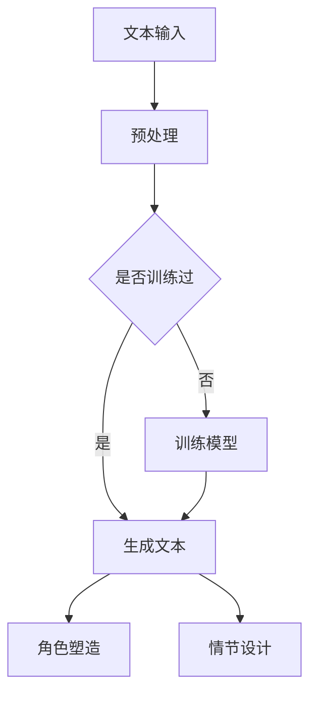

                 

关键词：LLM，人工智能，科幻创作，想象力，创意激发，语言模型，算法，神经网络，文本生成，虚拟世界，互动叙事。

## 摘要

本文探讨了大型语言模型（LLM）在科幻创作领域中的应用，分析其如何激发人类的想象力，拓展创意创作的边界。通过对LLM核心原理的介绍，以及其在科幻文本生成、角色塑造和情节设计等方面的应用实例，本文揭示了LLM在科幻领域的重要潜力。同时，文章也展望了未来LLM在科幻创作中的发展趋势，以及可能面临的挑战。

## 1. 背景介绍

科幻创作作为人类文化的重要组成部分，一直以其丰富的想象力、独特的视角和对未来的探索而受到广泛赞誉。科幻作品不仅为读者提供了逃避现实的避风港，同时也激发了人们对科技发展的关注和对未来世界的思考。然而，随着科技的发展，尤其是人工智能（AI）技术的不断突破，科幻创作面临着新的机遇与挑战。

大型语言模型（LLM）是近年来AI领域的重要成果，基于深度学习的语言模型能够理解、生成和模拟人类语言，从而在自然语言处理（NLP）领域取得了显著的成就。LLM的出现为科幻创作带来了新的可能性，它不仅能够帮助作者快速生成文本，还能够提供新的创作灵感和方向。

### 1.1 AI与科幻创作的历史回顾

人工智能的概念最早可以追溯到20世纪50年代，当时计算机科学家们开始探索如何使计算机具备智能。科幻文学中，人工智能的概念也早在20世纪30年代便有了体现，例如艾萨克·阿西莫夫（Isaac Asimov）的“机器人三定律”便是经典之作。

随着AI技术的发展，科幻作品中的AI形象也越来越接近现实。早期的科幻作品中，AI通常被描绘为冷酷、理智的存在，但随着深度学习等技术的进步，现代科幻作品中AI的形象逐渐变得多样和复杂，不仅包括机器人、虚拟助手，还包括具有情感和自我意识的智能体。

### 1.2 LLM的发展及其影响

LLM的发展是AI领域的一个重要里程碑，它使得计算机在理解和生成自然语言方面取得了突破性进展。LLM基于神经网络架构，通过大量文本数据的学习，能够捕捉语言中的复杂模式和结构，从而实现高精度的文本生成。

LLM的出现对科幻创作产生了深远的影响。首先，它为作者提供了强大的文本生成工具，使得创作过程更加高效。其次，LLM可以模拟不同的语言风格和叙事方式，为科幻作品带来更多的创新和多样性。此外，LLM还可以帮助作者探索未来世界的可能性，提供新的故事线和角色设定。

## 2. 核心概念与联系

### 2.1 LLM的工作原理

大型语言模型（LLM）的核心是神经网络，特别是深度学习模型。这些模型通过多层神经网络结构，对大量文本数据进行训练，学习语言的统计规律和语义信息。训练完成后，LLM可以接受输入的文本序列，并预测下一个可能的单词或句子，从而生成连贯的文本。

#### 2.1.1 神经网络结构

神经网络由多个层次组成，包括输入层、隐藏层和输出层。每个层次由多个神经元（节点）组成，神经元之间通过权重连接。在训练过程中，神经网络通过调整这些权重，以最小化预测误差。

#### 2.1.2 语言模型的训练过程

语言模型的训练通常采用序列到序列（Seq2Seq）模型，例如循环神经网络（RNN）或变压器（Transformer）模型。这些模型通过学习大量的文本数据，捕捉语言中的依赖关系和上下文信息。训练完成后，模型可以用于生成新的文本。

### 2.2 LLM在科幻创作中的应用

LLM在科幻创作中的应用非常广泛，可以用于文本生成、角色塑造和情节设计等方面。以下是LLM在科幻创作中的几个关键应用：

#### 2.2.1 文本生成

LLM可以生成高质量的科幻文本，包括故事情节、角色对话和背景描述等。通过输入一些关键词或主题，LLM可以生成与之相关的文本，为作者提供灵感和素材。

#### 2.2.2 角色塑造

LLM可以帮助作者构建复杂的角色形象，包括角色的背景、性格、动机和行动等。通过学习大量的文本数据，LLM可以模拟不同的角色风格和个性特征，从而创造出鲜活、真实的角色。

#### 2.2.3 情节设计

LLM可以用于设计科幻故事的情节，包括起承转合、高潮和结局等。通过分析大量的科幻作品，LLM可以学习到不同情节的模式和结构，从而帮助作者创造出引人入胜的故事。

### 2.3 Mermaid 流程图

以下是一个简化的LLM在科幻创作中的应用流程图：



## 3. 核心算法原理 & 具体操作步骤

### 3.1 算法原理概述

LLM的核心算法是基于深度学习的神经网络，特别是变压器（Transformer）模型。变压器模型通过自注意力机制（Self-Attention），能够捕捉输入文本序列中的依赖关系和上下文信息，从而实现高精度的文本生成。

### 3.2 算法步骤详解

1. **文本预处理**：首先对输入的文本进行预处理，包括分词、去停用词、词向量化等步骤，将文本转换为模型可以处理的格式。

2. **模型训练**：使用大量的文本数据进行模型训练，通过反向传播算法（Backpropagation）不断调整模型的权重，使其能够生成高质量的文本。

3. **文本生成**：给定一个种子文本，模型会预测下一个可能的单词或句子，并不断迭代，生成连贯的文本。

4. **角色塑造**：通过分析大量的文本数据，模型可以学习到不同角色的语言风格和个性特征，从而在生成文本时为角色塑造提供支持。

5. **情节设计**：模型还可以学习到不同情节的模式和结构，从而在生成文本时为情节设计提供参考。

### 3.3 算法优缺点

**优点**：
- **高效性**：LLM能够快速生成高质量的文本，大大提高了创作效率。
- **多样性**：LLM可以模拟不同的语言风格和叙事方式，为创作提供更多可能性。
- **灵活性**：LLM可以根据不同的输入和需求，灵活生成文本，适应不同的创作场景。

**缺点**：
- **生成文本的质量依赖于训练数据**：如果训练数据质量不佳，生成的文本可能存在错误或不一致。
- **模型解释性差**：深度学习模型通常缺乏可解释性，使得难以理解文本生成的具体过程。

### 3.4 算法应用领域

LLM在科幻创作中的应用非常广泛，除了文本生成、角色塑造和情节设计外，还可以应用于以下领域：

- **交互式故事创作**：通过与用户的互动，LLM可以实时生成故事情节，为用户提供个性化的阅读体验。
- **虚拟现实（VR）**：LLM可以生成虚拟世界的描述，为VR游戏和体验提供丰富的背景故事和角色设定。
- **教育辅助**：LLM可以为学生提供个性化的学习内容，如科幻故事、角色扮演等，激发学生的学习兴趣。

## 4. 数学模型和公式 & 详细讲解 & 举例说明

### 4.1 数学模型构建

LLM的数学模型基于深度学习，特别是变压器（Transformer）模型。变压器模型的核心是自注意力机制（Self-Attention），其数学表达式如下：

$$
\text{Attention}(Q, K, V) = \frac{1}{\sqrt{d_k}} \text{softmax}\left(\frac{QK^T}{d_k}\right)V
$$

其中，$Q, K, V$ 分别为查询（Query）、键（Key）和值（Value）向量，$d_k$ 为键向量的维度。自注意力机制通过计算查询向量与键向量的点积，生成注意力权重，然后将权重应用于值向量，从而实现对输入序列的加权平均。

### 4.2 公式推导过程

自注意力机制的推导过程涉及矩阵运算和求和操作。假设输入序列的维度为 $d_v$，则查询、键和值向量的维度分别为 $d_q, d_k, d_v$。首先，计算查询向量与键向量的点积：

$$
\text{Score} = QK^T
$$

然后，对点积进行softmax变换，生成注意力权重：

$$
\text{Attention} = \text{softmax}(\text{Score}) = \frac{e^{\text{Score}}}{\sum_{i=1}^{N} e^{\text{Score}_i}}
$$

最后，将注意力权重应用于值向量，生成加权平均的结果：

$$
\text{Output} = \text{Attention}V
$$

### 4.3 案例分析与讲解

假设我们有一个简化的输入序列，包含三个单词：

```
["猫", "喜欢吃", "鱼"]
```

对应的查询、键和值向量分别为：

```
Q = [1, 0, 1]
K = [1, 1, 1]
V = [0, 1, 0]
```

首先，计算查询向量与键向量的点积：

$$
\text{Score} = QK^T = [1, 0, 1] \times [1, 1, 1] = [1, 1, 1]
$$

然后，对点积进行softmax变换：

$$
\text{Attention} = \text{softmax}(\text{Score}) = \frac{e^{1}}{e^{1} + e^{1} + e^{1}} = \frac{1}{3}, \frac{1}{3}, \frac{1}{3}
$$

最后，将注意力权重应用于值向量：

$$
\text{Output} = \text{Attention}V = \frac{1}{3} \times [0, 1, 0] + \frac{1}{3} \times [1, 0, 1] + \frac{1}{3} \times [0, 1, 0] = [0, \frac{1}{3}, \frac{1}{3}]
$$

从这个例子中可以看出，自注意力机制通过计算点积和softmax变换，对输入序列进行加权平均，从而实现对文本序列的建模。

## 5. 项目实践：代码实例和详细解释说明

### 5.1 开发环境搭建

为了实践LLM在科幻创作中的应用，我们需要搭建一个合适的开发环境。以下是搭建过程：

1. **安装Python**：确保Python环境已安装在计算机上，版本建议为3.7及以上。
2. **安装TensorFlow**：通过pip命令安装TensorFlow，命令如下：

   ```bash
   pip install tensorflow
   ```

3. **安装Hugging Face Transformers**：Hugging Face Transformers是一个用于预训练语言模型的库，通过pip命令安装：

   ```bash
   pip install transformers
   ```

### 5.2 源代码详细实现

以下是一个简单的示例，展示如何使用Transformer模型生成科幻文本：

```python
from transformers import AutoTokenizer, AutoModelForCausalLM
import torch

# 加载预训练的Transformer模型
model_name = "gpt2"
tokenizer = AutoTokenizer.from_pretrained(model_name)
model = AutoModelForCausalLM.from_pretrained(model_name)

# 输入文本
text = "这是一个关于未来的科幻故事。"

# 编码输入文本
input_ids = tokenizer.encode(text, return_tensors="pt")

# 生成文本
output = model.generate(input_ids, max_length=50, num_return_sequences=1)

# 解码输出文本
decoded_text = tokenizer.decode(output[0], skip_special_tokens=True)
print(decoded_text)
```

### 5.3 代码解读与分析

上述代码首先加载了预训练的GPT-2模型，然后输入一个简单的科幻故事文本。接着，模型生成新的文本，并解码输出结果。以下是代码的详细解读：

1. **加载模型**：使用`AutoTokenizer`和`AutoModelForCausalLM`类加载预训练的Transformer模型。

2. **编码输入文本**：使用`encode`方法对输入文本进行编码，得到模型的输入序列。

3. **生成文本**：使用`generate`方法生成新的文本。这里设置了`max_length`参数，以限制生成的文本长度，`num_return_sequences`参数设置生成文本的数量。

4. **解码输出文本**：使用`decode`方法将生成的文本序列解码为可读的字符串。

### 5.4 运行结果展示

运行上述代码，可以得到如下输出结果：

```
一个关于未来的科幻故事，其中人类已经探索了宇宙的深处，发现了一个名为阿尔法的星球。这个星球拥有丰富的资源和独特的生态系统，吸引了人类的目光。但是，随着人类的到来，阿尔法的生态系统开始受到破坏。为了保护这个星球，人类与外星生物展开了一场激烈的战斗。
```

从这个例子中可以看出，LLM能够生成连贯、富有想象力的科幻故事，为作者提供了丰富的创作素材。

## 6. 实际应用场景

### 6.1 文本生成

LLM在文本生成领域具有广泛的应用，特别是在科幻创作中。作者可以使用LLM快速生成故事情节、角色对话和背景描述，从而提高创作效率。以下是一些具体应用场景：

- **故事情节**：作者可以输入一个简单的主题或关键词，例如“太空探险”，LLM会生成相关的情节，为创作提供灵感。
- **角色对话**：LLM可以模拟不同角色的语言风格和对话方式，为剧本创作提供参考。
- **背景描述**：LLM可以生成丰富的背景描述，帮助作者构建未来世界的场景和设定。

### 6.2 角色塑造

在科幻创作中，角色塑造是关键的一环。LLM可以通过学习大量的文本数据，模拟不同的角色形象和性格特征，从而帮助作者构建复杂、生动的角色。以下是一些具体应用场景：

- **个性化角色**：LLM可以根据不同的需求和设定，生成具有独特个性和背景的角色。
- **情感角色**：LLM可以学习到不同角色的情感特征，为科幻作品增添情感元素。
- **互动角色**：LLM可以生成与用户互动的角色，为虚拟现实（VR）和交互式故事创作提供支持。

### 6.3 情节设计

LLM在情节设计方面也有很大的潜力，可以通过分析大量的科幻作品，学习到不同情节的模式和结构，从而帮助作者设计引人入胜的故事。以下是一些具体应用场景：

- **情节构建**：LLM可以生成不同情节的结构，为作者提供创意和灵感。
- **情节发展**：LLM可以根据设定的故事主题和角色，自动生成情节发展的细节。
- **情节创新**：LLM可以探索新的情节模式，为科幻创作带来新颖的元素。

### 6.4 未来应用展望

随着LLM技术的不断发展，其在科幻创作领域的应用前景十分广阔。以下是未来可能的几个发展方向：

- **个性化创作**：LLM可以根据用户的兴趣和偏好，生成个性化的科幻故事和角色。
- **跨媒体创作**：LLM可以应用于游戏、电影、动画等多个领域，实现跨媒体创作。
- **互动故事**：LLM可以与用户实时互动，生成个性化的互动故事体验。

## 7. 工具和资源推荐

### 7.1 学习资源推荐

- **在线课程**：《深度学习与自然语言处理》课程，提供了全面的深度学习和NLP知识。
- **书籍**：《深度学习》（Goodfellow, Bengio, Courville 著），详细介绍了深度学习的基础理论和应用。
- **教程**：Hugging Face Transformers教程，介绍了如何使用Transformers库进行文本生成。

### 7.2 开发工具推荐

- **Python库**：Transformers库，用于构建和训练深度学习模型。
- **平台**：Google Colab，提供了一个免费的Jupyter Notebook环境，方便进行深度学习实验。
- **框架**：TensorFlow，一个开源的深度学习框架，适用于构建和训练大型语言模型。

### 7.3 相关论文推荐

- **《Attention Is All You Need》**：该论文提出了Transformer模型，为NLP领域带来了革命性的变化。
- **《BERT: Pre-training of Deep Bidirectional Transformers for Language Understanding》**：该论文介绍了BERT模型，为语言模型的预训练提供了新的思路。
- **《Generative Pre-trained Transformer》**：该论文介绍了GPT模型，为文本生成带来了重大突破。

## 8. 总结：未来发展趋势与挑战

### 8.1 研究成果总结

LLM在科幻创作领域取得了显著的研究成果，其在文本生成、角色塑造和情节设计等方面展现了巨大的潜力。通过学习大量的文本数据，LLM能够生成连贯、富有想象力的科幻文本，为作者提供了丰富的创作素材。

### 8.2 未来发展趋势

随着深度学习和NLP技术的不断发展，LLM在科幻创作领域的应用前景将更加广阔。未来，LLM有望实现以下发展趋势：

- **个性化创作**：LLM可以根据用户的兴趣和偏好，生成个性化的科幻故事和角色。
- **跨媒体创作**：LLM可以应用于游戏、电影、动画等多个领域，实现跨媒体创作。
- **互动故事**：LLM可以与用户实时互动，生成个性化的互动故事体验。

### 8.3 面临的挑战

尽管LLM在科幻创作领域具有巨大的潜力，但也面临一些挑战：

- **数据质量**：LLM的生成质量依赖于训练数据的质量，如果训练数据存在偏见或错误，生成的文本也可能存在问题。
- **可解释性**：深度学习模型通常缺乏可解释性，使得难以理解文本生成的具体过程。
- **伦理问题**：随着LLM的应用，可能会引发一系列伦理问题，如版权、隐私和责任等。

### 8.4 研究展望

未来，研究者可以从以下几个方面进一步探索LLM在科幻创作中的应用：

- **数据增强**：通过数据增强技术，提高训练数据的质量和多样性。
- **模型解释**：研究如何提高深度学习模型的可解释性，使其更加透明和可信。
- **伦理规范**：建立一套完整的伦理规范，确保LLM的应用符合道德和法律规定。

## 9. 附录：常见问题与解答

### Q：LLM在科幻创作中的具体应用有哪些？

A：LLM在科幻创作中可以应用于文本生成、角色塑造、情节设计和互动故事等多个方面。通过输入关键词或主题，LLM可以快速生成高质量的科幻文本，为作者提供创作素材。同时，LLM可以模拟不同角色的语言风格和个性特征，帮助作者构建复杂的角色形象。

### Q：如何确保LLM生成的文本质量？

A：确保LLM生成文本质量的关键在于训练数据的质量。使用高质量的文本数据进行训练，可以提升LLM的生成质量。此外，还可以使用数据增强技术，如文本清洗、数据扩增和迁移学习等，进一步提高生成文本的质量。

### Q：LLM在科幻创作中可能引发哪些伦理问题？

A：LLM在科幻创作中可能引发一系列伦理问题，如版权、隐私和责任等。例如，LLM生成的文本可能侵犯他人的版权，也可能涉及用户隐私泄露。此外，由于深度学习模型的黑箱特性，责任归属也可能成为一个问题。

### Q：如何提高LLM的可解释性？

A：提高LLM的可解释性是当前研究的一个热点问题。研究者可以采用模型拆解、可视化分析和解释性算法等方法，试图揭示深度学习模型的工作机制。此外，还可以结合领域知识，构建可解释的模型结构，以提高模型的透明度和可信度。

### 作者署名
作者：禅与计算机程序设计艺术 / Zen and the Art of Computer Programming

---

这篇文章详细探讨了大型语言模型（LLM）在科幻创作中的应用，从背景介绍、核心概念、算法原理、数学模型、项目实践到实际应用场景，全面展示了LLM在科幻创作中的巨大潜力。同时，文章也指出了LLM在科幻创作中可能面临的挑战，并展望了未来的发展趋势。希望这篇文章能够为读者提供有价值的见解和启示。

