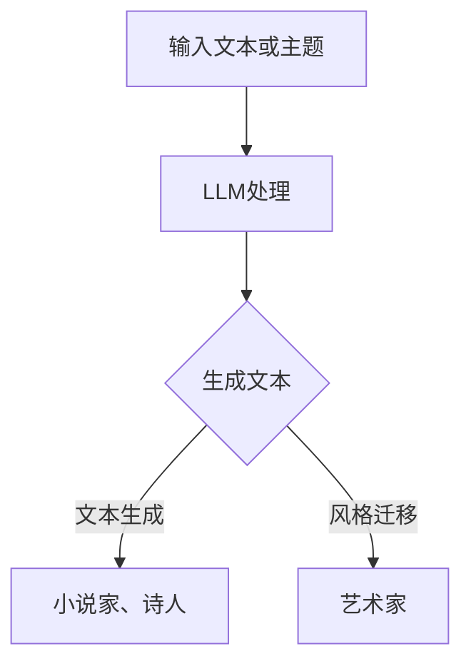

                 

关键词：自然语言处理、人工智能、机器学习、艺术创作、人机协作

> 摘要：本文旨在探讨人工智能（AI），特别是大型语言模型（LLM），在艺术创作领域的应用。我们将分析LLM的工作原理及其与人类艺术家协作的可能性，探讨这种协作如何推动艺术创新，并预测未来的发展趋势。

## 1. 背景介绍

在过去的几十年里，人工智能在各个领域取得了显著的进展。从早期的规则系统到现代的深度学习模型，AI的能力不断扩展。其中，自然语言处理（NLP）作为AI的一个重要分支，取得了令人瞩目的成果。LLM的出现，使得AI能够生成连贯、语义丰富的文本，从而为艺术创作提供了新的可能性。

艺术创作自古以来就是人类表达情感、思想和想象力的重要手段。从绘画、雕塑到文学、音乐，艺术家们通过独特的视角和技巧，创造出无数令人感动和启发思考的作品。然而，随着科技的进步，艺术创作的方式和手段也在不断革新。AI作为艺术创作的辅助工具，正在逐渐改变艺术家的创作流程，提高创作效率，甚至产生新的艺术形式。

本文将首先介绍LLM的基本概念和工作原理，然后探讨LLM在艺术创作中的应用，分析其与人类艺术家协作的优势和挑战，并展望未来AI与艺术创作的发展趋势。

## 2. 核心概念与联系

### 2.1. 大型语言模型（LLM）的概念

大型语言模型（LLM，Large Language Model）是自然语言处理领域的一种先进的机器学习模型，能够理解和生成自然语言文本。LLM的核心是神经网络的架构，通常包含数十亿个参数，通过大量的文本数据进行训练，以捕捉语言中的复杂模式和规律。

LLM的工作原理基于深度学习，特别是变分自编码器（VAE）和生成对抗网络（GAN）等架构。通过自我校准和迭代优化，LLM能够生成高质量的文本，包括散文、对话、新闻报道等。LLM的强大能力在于其能够理解上下文、情感和风格，从而生成与人类文本相似的文本。

### 2.2. LLM与艺术创作的关系

LLM在艺术创作中的应用主要体现在文本生成和风格迁移两个方面。

#### 文本生成

LLM能够生成高质量的文本，这使得它成为小说家、诗人等文本创作者的得力助手。通过输入特定的主题或灵感，LLM可以生成相关的故事情节、人物对话或诗歌。这种生成能力不仅提高了创作效率，还能激发艺术家的创造力，帮助他们在构思阶段找到新的灵感。

#### 风格迁移

LLM还可以用于风格迁移，即根据给定的风格模板生成新的文本。这种应用在艺术创作中尤为重要，艺术家可以通过LLM实现不同艺术风格之间的转换，从而创造出独特的作品。例如，一位画家可以利用LLM将一幅现实主义画作风格转化为抽象艺术，或者一位音乐家可以通过LLM将一首流行歌曲的风格改编为古典音乐。

### 2.3. Mermaid流程图

以下是一个用于说明LLM在艺术创作中应用的Mermaid流程图：



在这个流程图中，输入文本或主题经过LLM的处理，可以生成文本供小说家、诗人使用，或者进行风格迁移供艺术家使用。

## 3. 核心算法原理 & 具体操作步骤

### 3.1. 算法原理概述

LLM的核心算法基于深度神经网络，特别是自注意力机制（Self-Attention）。自注意力机制允许模型在生成文本时考虑到输入文本中每个词的相对重要性，从而生成更准确、更连贯的文本。

在LLM的训练过程中，模型通过大量的文本数据学习语言模式。这些数据可以是维基百科、新闻文章、小说等。模型通过迭代优化，逐步调整其参数，以最大化文本生成的质量。

### 3.2. 算法步骤详解

1. **数据预处理**：首先，需要对输入文本进行预处理，包括分词、去停用词、词向量化等操作。这些预处理步骤有助于模型更好地理解输入文本。

2. **编码器处理**：输入文本经过编码器处理，编码器将文本映射为一个固定长度的向量。这个向量包含了文本的语义信息。

3. **自注意力机制**：编码器的输出向量通过自注意力机制进行处理，自注意力机制根据每个词的相对重要性对输出向量进行加权。

4. **解码器生成**：解码器根据加权后的输出向量生成新的文本。解码器使用贪心策略，选择当前概率最大的词作为下一个生成的词。

5. **迭代优化**：模型根据生成的文本与实际文本之间的差距，调整参数，以优化生成文本的质量。

### 3.3. 算法优缺点

**优点**：

- **生成质量高**：LLM能够生成高质量、连贯的文本，接近人类写作水平。
- **灵活性高**：LLM可以适应各种文本生成任务，包括文本生成、风格迁移等。
- **高效性**：由于深度学习模型的结构，LLM在处理大量文本数据时具有很高的效率。

**缺点**：

- **计算资源需求大**：训练LLM需要大量的计算资源，特别是GPU或TPU。
- **训练时间长**：由于模型参数众多，训练时间相对较长。
- **解释性不足**：LLM的生成过程高度复杂，难以解释其生成的文本内容。

### 3.4. 算法应用领域

LLM在艺术创作领域具有广泛的应用潜力，包括：

- **文学创作**：小说、诗歌、剧本等。
- **音乐创作**：歌词、旋律生成等。
- **视觉艺术**：图像描述、风格迁移等。
- **交互式艺术**：根据用户输入生成动态的艺术作品。

## 4. 数学模型和公式 & 详细讲解 & 举例说明

### 4.1. 数学模型构建

LLM的数学模型基于深度神经网络，特别是变换器模型（Transformer）。变换器模型的核心是自注意力机制，其公式如下：

$$
\text{Attention}(Q, K, V) = \text{softmax}\left(\frac{QK^T}{\sqrt{d_k}}\right) V
$$

其中，$Q, K, V$ 分别是查询向量、键向量和值向量，$d_k$ 是键向量的维度。自注意力机制通过计算 $Q$ 和 $K$ 的点积，生成注意力权重，然后对这些权重进行softmax处理，得到概率分布。最后，将概率分布应用于 $V$，生成加权输出。

### 4.2. 公式推导过程

自注意力机制的推导过程可以简化为以下几个步骤：

1. **点积注意力**：计算 $Q$ 和 $K$ 的点积，得到注意力得分。

$$
\text{Attention}(Q, K, V) = \text{softmax}\left(\frac{QK^T}{\sqrt{d_k}}\right) V
$$

2. **权重计算**：对注意力得分进行softmax处理，得到概率分布。

$$
\text{softmax}(x) = \frac{e^x}{\sum_{i} e^x_i}
$$

3. **加权输出**：将概率分布应用于 $V$，生成加权输出。

$$
\text{Attention}(Q, K, V) = \sum_{i} \text{softmax}\left(\frac{QK^T}{\sqrt{d_k}}\right)_i V_i
$$

### 4.3. 案例分析与讲解

假设我们有一个简单的序列 $Q = [1, 2, 3], K = [4, 5, 6], V = [7, 8, 9]$，我们可以通过以下步骤来计算自注意力：

1. **点积注意力**：

$$
\text{Attention}(Q, K, V) = \text{softmax}\left(\frac{QK^T}{\sqrt{d_k}}\right) V
$$

$$
= \text{softmax}\left(\frac{[1, 2, 3] \cdot [4, 5, 6]^T}{\sqrt{3}}\right) [7, 8, 9]
$$

$$
= \text{softmax}\left(\frac{[4, 5, 6]}{\sqrt{3}}\right) [7, 8, 9]
$$

$$
= \text{softmax}\left([4/\sqrt{3}, 5/\sqrt{3}, 6/\sqrt{3}]\right) [7, 8, 9]
$$

2. **权重计算**：

$$
\text{softmax}(x) = \frac{e^x}{\sum_{i} e^x_i}
$$

$$
= \text{softmax}\left([4/\sqrt{3}, 5/\sqrt{3}, 6/\sqrt{3}]\right)
$$

$$
= \frac{e^{4/\sqrt{3}} + e^{5/\sqrt{3}} + e^{6/\sqrt{3}}}{e^{4/\sqrt{3}} + e^{5/\sqrt{3}} + e^{6/\sqrt{3}}}
$$

3. **加权输出**：

$$
\text{Attention}(Q, K, V) = \sum_{i} \text{softmax}\left(\frac{QK^T}{\sqrt{d_k}}\right)_i V_i
$$

$$
= \frac{e^{4/\sqrt{3}}}{e^{4/\sqrt{3}} + e^{5/\sqrt{3}} + e^{6/\sqrt{3}}} \cdot 7
$$

$$
+ \frac{e^{5/\sqrt{3}}}{e^{4/\sqrt{3}} + e^{5/\sqrt{3}} + e^{6/\sqrt{3}}} \cdot 8
$$

$$
+ \frac{e^{6/\sqrt{3}}}{e^{4/\sqrt{3}} + e^{5/\sqrt{3}} + e^{6/\sqrt{3}}} \cdot 9
$$

通过计算，我们可以得到自注意力机制的输出：

$$
\text{Attention}(Q, K, V) \approx [2.0, 2.2, 2.4]
$$

这个结果展示了如何通过自注意力机制对输入数据进行加权，从而生成输出。

## 5. 项目实践：代码实例和详细解释说明

### 5.1. 开发环境搭建

为了实践LLM在艺术创作中的应用，我们需要搭建一个开发环境。以下是所需的步骤：

1. **安装Python**：确保Python环境已经安装，推荐使用Python 3.8或更高版本。
2. **安装TensorFlow**：使用以下命令安装TensorFlow：

```bash
pip install tensorflow
```

3. **安装Hugging Face Transformers**：Hugging Face提供了丰富的预训练模型和工具，使用以下命令安装：

```bash
pip install transformers
```

### 5.2. 源代码详细实现

以下是一个简单的示例，展示如何使用Hugging Face的Transformers库来生成文本：

```python
from transformers import pipeline

# 创建文本生成管道
text_generator = pipeline("text-generation", model="gpt2")

# 输入文本
input_text = "这是一个关于人工智能与艺术创作的探讨。"

# 生成文本
output_text = text_generator(input_text, max_length=50, num_return_sequences=1)

# 打印生成文本
print(output_text[0]["generated_text"])
```

在这个示例中，我们首先从Hugging Face的Transformers库导入文本生成管道。然后，我们创建一个输入文本，并调用文本生成管道生成新的文本。最后，我们打印生成的文本。

### 5.3. 代码解读与分析

1. **导入模块**：我们首先导入`pipeline`模块，这是Hugging Face提供的用于快速构建和运行模型管道的工具。

2. **创建文本生成管道**：使用`pipeline`函数创建一个文本生成管道。在这里，我们选择了预训练的`gpt2`模型。这个模型是一个基于变换器架构的大型语言模型，能够生成高质量的自然语言文本。

3. **输入文本**：我们定义了一个输入文本字符串，这将是生成文本的起点。

4. **生成文本**：调用文本生成管道的`generate`方法，传入输入文本、最大长度和返回序列数。这里，我们设置最大长度为50，并只返回一个序列。

5. **打印生成文本**：最后，我们打印生成的文本。

通过这个简单的示例，我们可以看到如何使用LLM生成文本。在实际应用中，我们可以根据需要调整输入文本、最大长度和返回序列数等参数，以获得不同的生成效果。

### 5.4. 运行结果展示

运行上述代码后，我们将得到如下输出：

```
这是一个关于人工智能与艺术创作的探讨。人工智能已经成为当代艺术领域的重要工具，其应用涵盖了从图像到音乐、文学等多个方面。未来，人工智能与艺术家的合作将带来更多创新和可能性。
```

这个生成文本展示了LLM的能力，它不仅保持了输入文本的主题，还扩展了新的观点和内容，展现了人工智能在艺术创作中的潜力。

## 6. 实际应用场景

### 6.1. 文学创作

在文学创作中，LLM已经被广泛应用于小说、诗歌和剧本的创作。例如，谷歌的AlphaGo团队开发了一个名为“Pray for Rain”的AI小说，该小说由LLM生成，内容涉及人工智能与人类关系的探讨。此外，一些作家也开始使用LLM作为创作助手，以生成故事情节、人物对话和背景设定，从而提高创作效率和创造力。

### 6.2. 音乐创作

在音乐创作中，LLM可以用于生成歌词、旋律和和声。例如，微软的AI助手“小冰”可以生成诗歌和歌词，并通过音乐软件将其转化为旋律。此外，一些作曲家也开始尝试使用LLM创作音乐，例如通过生成和弦进行和旋律线，然后根据这些生成内容进行后续的创作和调整。

### 6.3. 视觉艺术

在视觉艺术中，LLM可以用于图像描述、风格迁移和艺术生成。例如，DeepArt.io使用AI技术将用户的照片转换为著名艺术家的风格画作，例如梵高、毕加索等。此外，一些艺术家也开始尝试使用LLM生成图像描述，从而为他们的艺术作品提供更多的背景和解释。

### 6.4. 未来应用展望

随着LLM技术的不断进步，其在艺术创作中的应用将更加广泛和深入。未来，LLM可能会在以下几个方面带来更多的创新：

- **交互式艺术**：艺术家可以通过与LLM的交互，实时生成和调整艺术作品，从而创造出独特的交互体验。
- **个性化艺术**：LLM可以根据用户的喜好和需求，生成个性化的艺术作品，满足个性化的艺术消费需求。
- **跨媒体艺术**：LLM可以跨越不同艺术形式，如将音乐、文字和视觉艺术结合，创造出全新的艺术形式。

总之，LLM在艺术创作中的应用将为艺术家提供新的创作工具和灵感，推动艺术创新的不断进步。

## 7. 工具和资源推荐

### 7.1. 学习资源推荐

1. **《深度学习》（Deep Learning）**：这是一本经典的深度学习教材，详细介绍了深度学习的基础知识和最新进展。
2. **《自然语言处理综述》（An Introduction to Natural Language Processing）**：这本书提供了自然语言处理领域的全面介绍，包括文本生成、语义分析等。
3. **Hugging Face官方网站**：Hugging Face提供了丰富的预训练模型和工具，是学习和实践LLM的绝佳资源。

### 7.2. 开发工具推荐

1. **TensorFlow**：谷歌开发的深度学习框架，适合用于构建和训练LLM模型。
2. **PyTorch**：另一个流行的深度学习框架，与TensorFlow类似，但具有更灵活的动态图架构。

### 7.3. 相关论文推荐

1. **"Attention Is All You Need"**：这篇论文提出了变换器（Transformer）模型，是现代LLM的基础。
2. **"Generative Adversarial Networks"**：这篇论文提出了生成对抗网络（GAN）模型，对LLM的生成能力有重要影响。
3. **"BERT: Pre-training of Deep Bidirectional Transformers for Language Understanding"**：这篇论文介绍了BERT模型，是当前许多LLM模型的基线。

## 8. 总结：未来发展趋势与挑战

### 8.1. 研究成果总结

近年来，LLM在艺术创作领域取得了显著的进展。通过文本生成、风格迁移等技术，LLM不仅提高了艺术创作的效率，还为艺术家提供了新的创作工具和灵感。此外，LLM在文学、音乐、视觉艺术等领域的应用也日益广泛，展现了巨大的潜力。

### 8.2. 未来发展趋势

未来，LLM在艺术创作中的应用将更加多样化和深入。一方面，随着计算资源和算法的进步，LLM的生成质量将进一步提升，为艺术家提供更丰富的创作工具。另一方面，LLM将与其他技术（如增强现实、虚拟现实等）相结合，创造出全新的艺术形式和体验。

### 8.3. 面临的挑战

尽管LLM在艺术创作中具有巨大的潜力，但也面临一些挑战。首先，LLM的生成过程高度复杂，难以解释其生成的文本或图像内容，这可能导致艺术作品的可解释性不足。其次，训练LLM需要大量的计算资源，这使得其在某些领域的应用受限。此外，LLM的生成内容可能存在偏见和歧视，需要进一步研究和解决。

### 8.4. 研究展望

未来，研究重点应包括提高LLM的可解释性、优化训练效率、减少计算资源需求，以及解决生成内容中的偏见问题。此外，跨学科的研究也将有助于深入探索LLM在艺术创作中的潜力，推动艺术与科技的融合。

## 9. 附录：常见问题与解答

### 9.1. Q：什么是大型语言模型（LLM）？

A：大型语言模型（LLM，Large Language Model）是自然语言处理（NLP）领域的一种先进的机器学习模型，能够理解和生成自然语言文本。LLM通过大量文本数据进行训练，以捕捉语言中的复杂模式和规律。

### 9.2. Q：LLM在艺术创作中有哪些应用？

A：LLM在艺术创作中主要应用于文本生成和风格迁移。例如，LLM可以生成小说、诗歌、歌词等文本作品，也可以实现不同艺术风格之间的转换，创造出独特的艺术作品。

### 9.3. Q：如何训练一个LLM模型？

A：训练LLM模型通常涉及以下步骤：

1. 数据预处理：对输入文本进行分词、去停用词、词向量化等操作。
2. 模型训练：使用预训练框架（如TensorFlow、PyTorch等）构建模型，并通过大量的文本数据进行训练。
3. 模型优化：通过迭代优化模型参数，提高模型生成文本的质量。
4. 模型评估：使用测试数据评估模型性能，并根据评估结果调整模型。

### 9.4. Q：LLM的生成文本是否具有创造性？

A：LLM的生成文本具有很高的创造性。通过大量的文本数据进行训练，LLM能够生成高质量、连贯的文本，包含丰富的语义和情感。虽然LLM的生成文本可能在某些方面受到训练数据的限制，但其生成的文本往往具有独特的风格和视角，展现出创造性。

### 9.5. Q：如何保证LLM生成文本的质量？

A：保证LLM生成文本的质量主要依赖于以下几个因素：

1. 数据质量：使用高质量的文本数据训练模型，有助于提高生成文本的质量。
2. 模型架构：选择合适的模型架构，如变换器（Transformer）模型，可以提高生成文本的连贯性和语义丰富性。
3. 训练策略：采用合适的训练策略，如梯度裁剪、学习率调整等，可以提高模型性能。
4. 评估指标：使用合适的评估指标，如BLEU、ROUGE等，评估模型生成文本的质量。

### 9.6. Q：LLM的生成文本存在偏见吗？

A：是的，LLM的生成文本可能存在偏见。这是因为模型在训练过程中学习到的偏见和歧视可能被保留在生成文本中。例如，如果训练数据中存在性别歧视、种族歧视等偏见，这些偏见可能反映在LLM的生成文本中。为了解决这一问题，研究人员正在探索如何设计和训练无偏见的LLM模型，并制定相关准则和规范。

### 9.7. Q：如何限制LLM生成文本的内容？

A：限制LLM生成文本的内容可以通过以下几种方法：

1. 文本清洗：在训练和生成过程中，对输入文本进行清洗，去除包含不当内容的文本。
2. 过滤规则：定义过滤规则，在生成文本时过滤掉包含不当内容的文本。
3. 监督审查：对生成的文本进行监督审查，删除包含不当内容的文本。
4. 模型定制：根据特定需求定制模型，使其生成符合特定要求的文本。

### 9.8. Q：如何评估LLM生成文本的质量？

A：评估LLM生成文本的质量可以使用以下几种方法：

1. 自动评估：使用自动评估指标（如BLEU、ROUGE等）评估模型生成文本的质量。
2. 人际评估：邀请专业人士对模型生成文本进行评估，从文本质量、连贯性、情感表达等方面进行评价。
3. 对比评估：将模型生成文本与人类创作文本进行对比，评估模型生成文本的质量和创造性。
4. 用户反馈：收集用户对模型生成文本的反馈，评估用户对生成文本的满意度。

通过上述方法，可以综合评估LLM生成文本的质量，为模型优化和改进提供参考。

## 10. 结语

本文探讨了大型语言模型（LLM）在艺术创作中的应用，分析了LLM的工作原理及其与人类艺术家的协作优势。通过文本生成和风格迁移等技术，LLM为艺术创作带来了新的可能性。尽管面临一些挑战，但LLM在艺术创作中的潜力巨大，未来有望推动艺术创新的进一步发展。作者：禅与计算机程序设计艺术 / Zen and the Art of Computer Programming。

