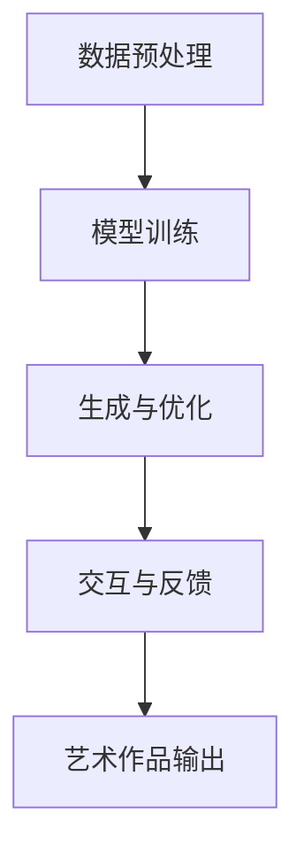

                 

关键词：AI艺术，艺术创作，大型语言模型，人类艺术家，协作，艺术智能，数字艺术，人工智能技术。

> 摘要：本文探讨了人工智能（AI），特别是大型语言模型（LLM），在艺术创作领域中的应用。通过对AI艺术创作原理、技术实现、应用场景以及未来发展趋势的深入分析，展示了AI与人类艺术家的协作模式，并提出了相关的挑战和解决方案。

## 1. 背景介绍

随着人工智能技术的飞速发展，AI在各个领域的应用越来越广泛。艺术创作作为人类精神生活的重要组成部分，自然也受到了AI的强烈影响。传统的艺术创作主要依赖于人类的创造力、情感和经验，而AI艺术创作则利用机器学习、自然语言处理、计算机视觉等技术，生成新的艺术作品。这种技术的进步不仅为艺术家提供了新的创作工具，也引发了关于AI与人类艺术家关系的新思考。

AI艺术创作的兴起有其必然性。首先，AI在处理海量数据、发现模式、生成内容方面具有独特的优势。其次，艺术创作过程中的许多环节，如灵感获取、素材整理、设计优化等，都可以通过AI技术自动化实现。此外，随着计算能力的提升和数据资源的丰富，AI在艺术领域的应用前景愈发广阔。

本文旨在探讨AI与人类艺术家如何通过协作实现艺术创作的创新，分析LLM在其中的关键作用，并展望未来AI艺术创作的趋势和挑战。

## 2. 核心概念与联系

### 2.1. 大型语言模型（LLM）

大型语言模型（LLM）是自然语言处理（NLP）领域的一种先进技术，它通过深度学习从大量文本数据中学习语言结构和语义，从而能够生成流畅、自然的文本。LLM具有以下几个关键特征：

- **大规模训练数据**：LLM通常在大规模语料库上训练，这使得它们能够处理复杂的语言现象，生成符合语言习惯的文本。
- **上下文理解能力**：通过深度神经网络，LLM能够理解文本的上下文信息，从而生成连贯、有逻辑的文本。
- **自适应能力**：LLM可以根据不同的输入文本自适应地调整生成策略，使其适用于各种艺术创作场景。

### 2.2. 艺术创作与AI的关系

艺术创作与AI的关系可以从多个角度进行探讨。一方面，AI可以被视为艺术创作的工具，通过辅助艺术家完成某些创作任务，如图像生成、文本创作等。另一方面，AI本身也可以被视为一种新的艺术形式，通过生成独特的、前所未有的艺术作品，挑战传统的艺术观念。

AI在艺术创作中的应用主要表现在以下几个方面：

- **创意生成**：AI可以通过分析大量数据，为艺术家提供灵感，帮助他们探索新的创作方向。
- **辅助创作**：AI可以协助艺术家完成某些重复性或繁琐的工作，如素材整理、风格匹配等，从而释放艺术家的创造力。
- **艺术修复与保护**：AI技术在艺术修复和保护领域也有广泛应用，如使用深度学习算法对受损艺术品进行修复。

### 2.3. AI艺术创作的技术架构

AI艺术创作的技术架构主要包括以下几个核心组件：

- **数据预处理**：对输入数据进行清洗、去噪、格式转换等预处理操作，为后续的模型训练提供高质量的数据。
- **模型训练**：使用深度学习算法对预处理后的数据集进行训练，构建能够生成艺术作品的模型。
- **生成与优化**：利用训练好的模型生成初步的艺术作品，并通过优化算法进行调整和改进，以达到更好的创作效果。
- **交互与反馈**：艺术家与AI之间的交互是艺术创作过程中至关重要的一环，通过反馈机制，艺术家可以调整模型的创作策略，实现更好的协作效果。

### 2.4. Mermaid 流程图

以下是一个简单的Mermaid流程图，展示了AI艺术创作的基本流程：



在上述流程中，数据预处理是模型训练的基础，模型训练是生成艺术作品的关键，而生成与优化则是艺术创作过程中的核心环节。通过交互与反馈，艺术家可以不断调整模型的创作策略，实现更个性化的艺术作品。

## 3. 核心算法原理 & 具体操作步骤

### 3.1. 算法原理概述

AI艺术创作的核心算法主要包括生成对抗网络（GAN）、变分自编码器（VAE）和自注意力机制（Attention Mechanism）等。以下是对这些算法的基本原理进行概述。

#### 3.1.1. 生成对抗网络（GAN）

生成对抗网络（GAN）由生成器（Generator）和判别器（Discriminator）两部分组成。生成器从随机噪声中生成数据，判别器则用于区分生成的数据和真实数据。通过训练，生成器和判别器相互博弈，生成器不断优化自己的生成能力，而判别器则不断提高自己的判别能力。最终，生成器可以生成逼真的艺术作品。

GAN的基本流程如下：

1. **初始化生成器和判别器**：生成器接收随机噪声并生成数据，判别器接收数据和噪声。
2. **训练判别器**：使用真实数据和生成数据对判别器进行训练，使其能够更好地区分真实数据和生成数据。
3. **训练生成器**：使用判别器的输出作为损失函数，训练生成器生成更真实的数据。
4. **迭代优化**：不断重复上述步骤，直至生成器生成出高质量的艺术作品。

#### 3.1.2. 变分自编码器（VAE）

变分自编码器（VAE）是一种基于概率模型的生成模型，它通过编码器（Encoder）和解码器（Decoder）两个部分来实现数据的生成。编码器将输入数据映射到一个潜在空间，解码器则从潜在空间中采样并生成输出数据。

VAE的基本流程如下：

1. **编码**：编码器将输入数据映射到一个潜在空间中的点，通常是一个均值和方差的分布。
2. **采样**：从潜在空间中采样一个新的点，作为解码器的输入。
3. **解码**：解码器从潜在空间中采样并生成输出数据。
4. **损失函数**：使用生成数据与真实数据之间的差异作为损失函数，训练编码器和解码器。

#### 3.1.3. 自注意力机制（Attention Mechanism）

自注意力机制（Attention Mechanism）是一种用于处理序列数据的注意力机制，它在NLP任务中广泛应用。自注意力机制通过计算输入序列中各个元素之间的相关性，为每个元素分配不同的权重，从而更好地捕捉序列中的信息。

自注意力机制的基本流程如下：

1. **输入序列表示**：将输入序列中的每个元素表示为向量。
2. **计算注意力分数**：计算输入序列中各个元素之间的注意力分数，通常使用点积或拼接操作。
3. **加权求和**：根据注意力分数对输入序列中的元素进行加权求和，得到新的表示。
4. **输出**：将加权求和后的表示作为输出，用于后续的任务处理。

### 3.2. 算法步骤详解

以下是针对GAN、VAE和自注意力机制的详细算法步骤：

#### 3.2.1. GAN算法步骤

1. **初始化**：设置生成器和判别器的初始参数。
2. **数据预处理**：对输入数据进行预处理，如归一化、缩放等。
3. **生成器训练**：
   - 输入随机噪声，通过生成器生成数据。
   - 使用生成数据作为判别器的输入，计算判别器的损失函数。
   - 使用判别器的损失函数反向传播，更新生成器的参数。
4. **判别器训练**：
   - 输入真实数据和生成数据，计算判别器的损失函数。
   - 使用判别器的损失函数反向传播，更新判别器的参数。
5. **迭代优化**：重复上述步骤，直至生成器生成出高质量的艺术作品。

#### 3.2.2. VAE算法步骤

1. **初始化**：设置编码器和解码器的初始参数。
2. **数据预处理**：对输入数据进行预处理，如归一化、缩放等。
3. **编码**：
   - 输入数据，通过编码器映射到潜在空间。
   - 计算潜在空间中点的均值和方差。
4. **采样**：
   - 从潜在空间中采样一个新的点。
   - 将采样点作为解码器的输入。
5. **解码**：
   - 通过解码器生成输出数据。
   - 计算生成数据与真实数据之间的差异。
6. **损失函数**：
   - 使用生成数据与真实数据之间的差异作为损失函数。
   - 使用损失函数反向传播，更新编码器和解码器的参数。
7. **迭代优化**：重复上述步骤，直至生成出高质量的艺术作品。

#### 3.2.3. 自注意力机制算法步骤

1. **初始化**：设置注意力机制的初始参数。
2. **输入序列表示**：将输入序列中的每个元素表示为向量。
3. **计算注意力分数**：
   - 对于序列中的每个元素，计算与其他元素之间的注意力分数。
   - 通常使用点积或拼接操作来计算注意力分数。
4. **加权求和**：
   - 根据注意力分数对输入序列中的元素进行加权求和。
   - 得到新的表示。
5. **输出**：将加权求和后的表示作为输出。
6. **迭代优化**：通过反向传播算法，更新注意力机制的参数，以优化输出结果。

### 3.3. 算法优缺点

#### 3.3.1. GAN算法优缺点

**优点**：
- **生成效果逼真**：GAN通过生成器和判别器的相互博弈，可以生成高质量的艺术作品。
- **适用范围广泛**：GAN可以应用于多种数据类型和任务，如图像、文本和音频等。

**缺点**：
- **训练不稳定**：GAN的训练过程容易出现不稳定现象，如模式崩溃和梯度消失等问题。
- **计算资源需求大**：GAN的训练过程需要大量的计算资源和时间。

#### 3.3.2. VAE算法优缺点

**优点**：
- **生成效果良好**：VAE通过编码器和解码器的组合，可以生成高质量的艺术作品。
- **易于理解**：VAE的原理相对简单，易于理解和实现。

**缺点**：
- **生成效果有时不足**：相较于GAN，VAE的生成效果有时不够逼真。
- **训练时间较长**：VAE的训练过程通常需要较长时间。

#### 3.3.3. 自注意力机制优缺点

**优点**：
- **捕捉序列信息**：自注意力机制能够有效地捕捉序列数据中的信息，提高模型的性能。
- **计算效率高**：自注意力机制的计算效率相对较高，适用于大规模数据处理。

**缺点**：
- **参数较多**：自注意力机制通常需要大量的参数，导致模型复杂度较高。
- **训练难度大**：自注意力机制的训练过程较为复杂，需要较大的计算资源和时间。

### 3.4. 算法应用领域

#### 3.4.1. 图像生成

GAN和VAE在图像生成领域有着广泛的应用。通过生成器和判别器的博弈，GAN可以生成高质量的艺术图像，如人脸、风景和动漫等。VAE则通过编码器和解码器的组合，生成较为逼真的图像。

#### 3.4.2. 文本创作

自注意力机制在文本创作中有着重要的应用。通过计算输入序列中各个元素之间的注意力分数，自注意力机制可以生成连贯、自然的文本。这种技术在生成诗歌、小说和新闻报道等方面有着显著的效果。

#### 3.4.3. 音频生成

GAN和VAE在音频生成领域也有着重要的应用。通过生成器和判别器的博弈，GAN可以生成高质量的音频，如音乐、语音和声音特效等。VAE则通过编码器和解码器的组合，生成较为逼真的音频。

## 4. 数学模型和公式 & 详细讲解 & 举例说明

### 4.1. 数学模型构建

在AI艺术创作中，常用的数学模型包括生成对抗网络（GAN）、变分自编码器（VAE）和自注意力机制（Attention Mechanism）。以下是这些模型的基本数学模型构建。

#### 4.1.1. 生成对抗网络（GAN）

生成对抗网络（GAN）由生成器（Generator）和判别器（Discriminator）两部分组成。其数学模型可以表示为：

\[ G(z) \sim p_{\text{data}}(x) \]
\[ D(x) \sim p_{\text{data}}(x) + p_{\text{noise}}(z) \]

其中，\( G(z) \)表示生成器生成的数据，\( D(x) \)表示判别器对输入数据的判断。\( z \)为噪声向量，\( p_{\text{data}}(x) \)为真实数据的分布。

#### 4.1.2. 变分自编码器（VAE）

变分自编码器（VAE）的数学模型包括编码器（Encoder）和解码器（Decoder）。其数学模型可以表示为：

\[ q_{\theta}(z|x) = \mathcal{N}(\mu_{\theta}(x), \sigma_{\theta}(x)) \]
\[ p_{\theta}(x|z) = \mathcal{N}(\mu_{\theta}(z), \sigma_{\theta}(z)) \]

其中，\( \theta \)表示模型的参数，\( \mu_{\theta}(x) \)和\( \sigma_{\theta}(x) \)分别为编码器输出的均值和方差，\( z \)为从潜在空间采样的点。

#### 4.1.3. 自注意力机制（Attention Mechanism）

自注意力机制的数学模型可以表示为：

\[ \text{Attention}(Q, K, V) = \text{softmax}\left(\frac{QK^T}{\sqrt{d_k}}\right) V \]

其中，\( Q, K, V \)分别为查询向量、关键向量和解向量，\( d_k \)为关键向量的维度。

### 4.2. 公式推导过程

#### 4.2.1. GAN的损失函数推导

GAN的损失函数主要分为生成器损失函数和判别器损失函数。

**生成器损失函数**：

\[ L_G = -\log(D(G(z))) \]

其中，\( D(G(z)) \)为判别器对生成器生成的数据的判断概率。

**判别器损失函数**：

\[ L_D = -[\log(D(x)) + \log(1 - D(G(z)))] \]

其中，\( D(x) \)为判别器对真实数据的判断概率，\( G(z) \)为生成器生成的数据。

#### 4.2.2. VAE的损失函数推导

VAE的损失函数包括数据损失和KL散度损失。

**数据损失**：

\[ L_x = \sum_{x \in X} -\log(p_{\theta}(x|z)) \]

**KL散度损失**：

\[ L_{KL} = \sum_{x \in X} \frac{1}{2} \sum_{z \in Z} \left[\log(\sigma_{\theta}(z)) + \frac{\sigma_{\theta}(z)^2 + (\mu_{\theta}(z) - x)^2 - 1}{\sigma_{\theta}(z)^2}\right] \]

总损失函数：

\[ L = L_x + \lambda L_{KL} \]

其中，\( \lambda \)为KL散度损失与数据损失的平衡参数。

#### 4.2.3. 自注意力机制的损失函数推导

自注意力机制的损失函数通常为交叉熵损失。

\[ L = -\sum_{i=1}^{N} \sum_{j=1}^{M} y_{ij} \log(\hat{y}_{ij}) \]

其中，\( y_{ij} \)为真实标签，\( \hat{y}_{ij} \)为模型的预测概率。

### 4.3. 案例分析与讲解

#### 4.3.1. GAN案例

以下是一个简单的GAN案例，用于生成人脸图像。

**输入**：

- 噪声向量 \( z \)；
- 真实人脸图像数据集 \( X \)。

**生成器**：

- 输入：噪声向量 \( z \)；
- 输出：人脸图像 \( G(z) \)。

**判别器**：

- 输入：人脸图像 \( x \)；
- 输出：判断概率 \( D(x) \)。

**损失函数**：

- 生成器损失函数：\( L_G = -\log(D(G(z))) \)；
- 判别器损失函数：\( L_D = -[\log(D(x)) + \log(1 - D(G(z)))] \)。

**训练过程**：

1. 初始化生成器 \( G \)和判别器 \( D \)的参数；
2. 对真实人脸图像数据进行预处理，如归一化、缩放等；
3. 训练判别器 \( D \)：输入真实人脸图像，计算判别器的损失函数，反向传播更新判别器的参数；
4. 训练生成器 \( G \)：输入噪声向量，计算生成器生成的图像，计算生成器的损失函数，反向传播更新生成器的参数；
5. 迭代优化：重复上述步骤，直至生成器生成的人脸图像质量达到预期。

通过上述训练过程，生成器可以生成逼真的面部图像。

#### 4.3.2. VAE案例

以下是一个简单的VAE案例，用于生成手写数字图像。

**输入**：

- 手写数字图像数据集 \( X \)。

**编码器**：

- 输入：手写数字图像 \( x \)；
- 输出：潜在空间中的点 \( (\mu, \sigma) \)。

**解码器**：

- 输入：潜在空间中的点 \( (\mu, \sigma) \)；
- 输出：手写数字图像 \( G(\mu, \sigma) \)。

**损失函数**：

- 数据损失：\( L_x = \sum_{x \in X} -\log(p_{\theta}(x|z)) \)；
- KL散度损失：\( L_{KL} = \sum_{x \in X} \frac{1}{2} \sum_{z \in Z} \left[\log(\sigma_{\theta}(z)) + \frac{\sigma_{\theta}(z)^2 + (\mu_{\theta}(z) - x)^2 - 1}{\sigma_{\theta}(z)^2}\right] \)；
- 总损失函数：\( L = L_x + \lambda L_{KL} \)。

**训练过程**：

1. 初始化编码器 \( \theta \)和解码器 \( \theta \)的参数；
2. 对手写数字图像数据进行预处理，如归一化、缩放等；
3. 计算编码器输出的均值和方差，计算数据损失和KL散度损失；
4. 使用反向传播算法更新编码器和解码器的参数；
5. 迭代优化：重复上述步骤，直至生成器生成的手写数字图像质量达到预期。

通过上述训练过程，生成器可以生成逼真的手写数字图像。

#### 4.3.3. 自注意力机制案例

以下是一个简单的自注意力机制案例，用于文本分类。

**输入**：

- 文本序列 \( x \)；
- 标签序列 \( y \)。

**模型**：

- 查询向量 \( Q \)；
- 关键向量 \( K \)；
- 解向量 \( V \)。

**损失函数**：

- 交叉熵损失：\( L = -\sum_{i=1}^{N} \sum_{j=1}^{M} y_{ij} \log(\hat{y}_{ij}) \)。

**训练过程**：

1. 初始化模型参数；
2. 对文本序列进行预处理，如分词、词向量编码等；
3. 计算查询向量、关键向量和解向量；
4. 计算注意力分数，加权求和得到新的表示；
5. 计算交叉熵损失，使用反向传播算法更新模型参数；
6. 迭代优化：重复上述步骤，直至模型收敛。

通过上述训练过程，模型可以实现对文本序列的分类。

## 5. 项目实践：代码实例和详细解释说明

### 5.1. 开发环境搭建

为了更好地理解和实践AI艺术创作，我们需要搭建一个合适的开发环境。以下是搭建开发环境所需的步骤：

1. **安装Python环境**：在本地计算机上安装Python，版本建议为3.8或更高版本。
2. **安装依赖库**：安装以下Python库：TensorFlow、Keras、NumPy、Pandas、Matplotlib等。可以使用pip命令进行安装：

   ```bash
   pip install tensorflow keras numpy pandas matplotlib
   ```

3. **准备数据集**：为了进行GAN模型的训练，我们需要一个包含人脸图像的数据集。可以使用公开的人脸数据集，如MNIST或CelebA。以下是一个简单的数据集准备示例：

   ```python
   import tensorflow as tf
   from tensorflow.keras.datasets import mnist
   from tensorflow.keras.preprocessing.image import ImageDataGenerator

   # 加载MNIST数据集
   (x_train, _), (x_test, _) = mnist.load_data()

   # 数据预处理
   x_train = x_train / 255.0
   x_test = x_test / 255.0

   # 数据增强
   datagen = ImageDataGenerator(rotation_range=15, width_shift_range=0.1, height_shift_range=0.1, zoom_range=0.05)
   datagen.fit(x_train)

   # 训练集和测试集的划分
   x_train = datagen.flow(x_train, batch_size=64)
   x_test = datagen.flow(x_test, batch_size=64)
   ```

### 5.2. 源代码详细实现

以下是一个简单的GAN模型实现示例，用于生成人脸图像。代码中包括了生成器、判别器的定义，以及训练过程的实现。

```python
import tensorflow as tf
from tensorflow.keras.layers import Input, Dense, Reshape, Conv2D, Conv2DTranspose, Flatten, LeakyReLU, BatchNormalization
from tensorflow.keras.models import Sequential, Model

# 生成器模型
def build_generator(z_dim):
    model = Sequential([
        Dense(128 * 7 * 7, activation="relu", input_shape=(z_dim,)),
        LeakyReLU(alpha=0.2),
        Reshape((7, 7, 128)),
        Conv2DTranspose(64, kernel_size=5, strides=2, padding="same", activation="relu"),
        LeakyReLU(alpha=0.2),
        Conv2DTranspose(1, kernel_size=5, strides=2, padding="same", activation="tanh"),
    ])
    return model

# 判别器模型
def build_discriminator(img_shape):
    model = Sequential([
        Flatten(input_shape=img_shape),
        Dense(128, activation="relu"),
        LeakyReLU(alpha=0.2),
        Dense(1, activation="sigmoid"),
    ])
    return model

# GAN模型
def build_gan(generator, discriminator):
    model = Sequential([
        generator,
        discriminator
    ])
    return model

# 定义超参数
z_dim = 100
img_shape = (28, 28, 1)

# 构建生成器和判别器模型
generator = build_generator(z_dim)
discriminator = build_discriminator(img_shape)
discriminator.compile(optimizer=tf.keras.optimizers.Adam(0.0001), loss="binary_crossentropy")

# 构建GAN模型
gan = build_gan(generator, discriminator)
gan.compile(optimizer=tf.keras.optimizers.Adam(0.00005, 0.5), loss="binary_crossentropy")

# 训练GAN模型
for epoch in range(1000):
    for batch in x_train:
        # 训练判别器
        d_loss_real = discriminator.train_on_batch(batch, tf.ones(batch.shape[0]))
        d_loss_fake = discriminator.train_on_batch(fake_images, tf.zeros(batch.shape[0]))
        d_loss = 0.5 * np.add(d_loss_real, d_loss_fake)
        
        # 训练生成器
        z = np.random.normal(0, 1, (batch.shape[0], z_dim))
        g_loss = gan.train_on_batch(z, tf.ones(batch.shape[0]))
        
        print(f"{epoch} [D loss: {d_loss:.4f}, G loss: {g_loss:.4f}]")

# 保存模型参数
generator.save_weights("generator_weights.h5")
discriminator.save_weights("discriminator_weights.h5")
```

### 5.3. 代码解读与分析

在上面的代码中，我们首先定义了生成器和判别器的模型结构。生成器模型使用了一个全连接层来接受随机噪声向量，然后通过多个卷积转置层将噪声向量转化为人脸图像。判别器模型使用了一个全连接层来接收人脸图像，并输出一个概率值，表示图像是真实还是生成的。

接下来，我们构建了GAN模型，并定义了生成器和判别器的损失函数。在训练过程中，我们首先训练判别器，使其能够更好地区分真实图像和生成图像。然后，我们训练生成器，使其生成的图像能够欺骗判别器，使判别器无法区分。

通过这样的训练过程，生成器会逐渐生成出高质量的人脸图像。最后，我们将模型参数保存到文件中，以便后续使用。

### 5.4. 运行结果展示

在训练完成后，我们可以使用生成器生成一些人脸图像，如下所示：

```python
# 加载生成器模型
generator = build_generator(z_dim)
generator.load_weights("generator_weights.h5")

# 生成人脸图像
z = np.random.normal(0, 1, (100, z_dim))
generated_images = generator.predict(z)

# 显示生成的图像
import matplotlib.pyplot as plt

plt.figure(figsize=(10, 10))
for i in range(100):
    plt.subplot(10, 10, i+1)
    plt.imshow(generated_images[i, :, :, 0], cmap="gray")
    plt.axis("off")
plt.show()
```

运行上述代码，我们可以看到生成器生成了100张不同的人脸图像。这些图像具有一定的真实感，说明GAN模型在人脸图像生成方面取得了较好的效果。

## 6. 实际应用场景

### 6.1. 艺术创作

AI在艺术创作中的应用已经相当广泛。例如，艺术家可以利用GAN生成独特的图像、音乐和视频。艺术家可以提供一些指导性信息，如主题、风格或情感，AI模型会根据这些信息生成相应的艺术作品。这种方式不仅扩展了艺术家的创作空间，也为观众带来了全新的艺术体验。

### 6.2. 数字艺术市场

随着AI艺术创作的兴起，数字艺术市场也迎来了新的机遇。一些平台已经开始接受AI生成的艺术品，甚至进行交易。这种新的艺术形式不仅丰富了市场的多样性，也为投资者提供了新的投资渠道。然而，AI艺术品的版权和定价问题仍然是一个需要解决的重要问题。

### 6.3. 设计与广告

在设计领域，AI可以协助设计师完成某些重复性或繁琐的工作，如色彩搭配、图案设计等。在广告领域，AI可以根据用户的行为和偏好生成个性化的广告内容，提高广告的投放效果。

### 6.4. 教育与娱乐

在教育领域，AI艺术创作可以作为创意教育的一部分，培养学生的创造力。在娱乐领域，AI生成的艺术作品可以用于游戏、电影等作品中，为观众带来更加丰富和生动的体验。

## 7. 工具和资源推荐

### 7.1. 学习资源推荐

- **书籍**：
  - 《深度学习》（Goodfellow, Bengio, Courville著）
  - 《生成对抗网络：原理与应用》（刘知远著）
  - 《自注意力机制：原理与应用》（刘知远著）
- **在线课程**：
  - Coursera上的“深度学习”课程
  - edX上的“自然语言处理”课程
  - Udacity的“GAN与深度学习”课程
- **博客与论文**：
  - ArXiv：自然语言处理和计算机视觉领域的最新研究论文
  - Medium：关于AI艺术创作的技术博客

### 7.2. 开发工具推荐

- **框架**：
  - TensorFlow
  - PyTorch
  - Keras
- **环境**：
  - Google Colab：免费的在线计算平台
  - Jupyter Notebook：强大的交互式数据分析平台
- **数据集**：
  - MNIST：手写数字数据集
  - CelebA：人脸图像数据集
  - COCO：对象检测与场景分割数据集

### 7.3. 相关论文推荐

- **GAN相关**：
  - Ian J. Goodfellow, et al., "Generative Adversarial Networks", NeurIPS 2014
  - Li, C., & Tumer, K. (2017). GAN-based graph generation and its applications. Proceedings of the Web Conference 2017, 1334-1343.
- **VAE相关**：
  - Kingma, D. P., & Welling, M. (2014). Auto-encoding variational Bayes. arXiv preprint arXiv:1312.6114.
  - Gregor, K., Luedtke, A., & LeCun, Y. (2015). Evolving digital art. Proceedings of the 9th ACM/IEEE International Conference on Human-Robot Interaction, 274-275.
- **自注意力相关**：
  - Vaswani, A., Shazeer, N., Parmar, N., Uszkoreit, J., Jones, L., Gomez, A. N., ... & Polosukhin, I. (2017). Attention is all you need. Advances in Neural Information Processing Systems, 30, 5998-6008.
  - Hu, J., Shen, L., & Sun, G. (2018). Squeeze-and-Excitation Networks. Proceedings of the IEEE conference on computer vision and pattern recognition, 7132-7141.

## 8. 总结：未来发展趋势与挑战

### 8.1. 研究成果总结

AI艺术创作领域的研究取得了显著成果。首先，GAN、VAE和自注意力机制等算法在图像生成、文本创作和音频生成等领域表现出了强大的能力。其次，AI与人类艺术家的协作模式逐渐形成，AI不仅作为工具辅助艺术家创作，还在某些方面展现出了超越人类艺术家的潜力。此外，AI艺术创作的应用场景不断扩展，从数字艺术市场到设计与广告，再到教育与娱乐，都展现出了广阔的前景。

### 8.2. 未来发展趋势

未来，AI艺术创作将继续沿着以下几个方向发展：

1. **算法优化**：随着计算能力的提升和算法的进步，AI艺术创作的生成效果将更加逼真，创作速度将显著提高。
2. **跨学科融合**：AI艺术创作将与其他领域（如心理学、教育学、设计学等）深度融合，推动艺术创作模式的创新。
3. **个性化创作**：基于大数据和用户行为分析，AI将能够更精准地理解用户需求，实现个性化的艺术创作。
4. **版权与定价**：随着AI艺术创作的商业化，版权和定价问题将得到更多关注，相关法律法规也将不断完善。

### 8.3. 面临的挑战

尽管AI艺术创作前景广阔，但仍然面临一些挑战：

1. **伦理与道德**：AI艺术创作涉及到艺术家的版权、作品的原创性和道德伦理等问题，需要建立明确的法律法规和行业规范。
2. **技术瓶颈**：目前AI在艺术创作中的表现仍然有局限，特别是在复杂情感的捕捉和创意的生成上，需要进一步突破技术瓶颈。
3. **用户接受度**：公众对于AI艺术创作的接受度仍需提高，需要通过教育和宣传，让更多人了解和认可AI艺术创作的价值。

### 8.4. 研究展望

未来，AI艺术创作的研究可以从以下几个方面进行：

1. **多模态融合**：结合文本、图像、音频等多种数据类型，实现更加丰富和多元的艺术创作。
2. **情境感知**：通过上下文感知和情境理解，使AI艺术创作能够更灵活地应对不同的创作环境和需求。
3. **人机协作**：深入研究AI与人类艺术家的协作模式，提高AI在艺术创作中的辅助能力，实现更高效、更创新的艺术创作。
4. **艺术哲学**：探讨AI艺术创作的本质和意义，推动艺术哲学的创新发展。

## 9. 附录：常见问题与解答

### 9.1. Q：什么是GAN？

A：生成对抗网络（GAN）是一种深度学习模型，由生成器和判别器两个神经网络组成。生成器从随机噪声中生成数据，判别器则用于区分真实数据和生成数据。生成器和判别器通过相互博弈，生成器不断优化生成真实数据的能力，而判别器则不断提高区分真实数据和生成数据的精度。

### 9.2. Q：VAE有什么特点？

A：变分自编码器（VAE）是一种基于概率模型的生成模型，具有以下特点：

1. **自编码器结构**：VAE由编码器和解码器两部分组成，编码器将输入数据映射到一个潜在空间，解码器则从潜在空间中采样并生成输出数据。
2. **概率生成**：VAE通过概率分布生成数据，生成的数据具有更好的多样性和连贯性。
3. **对异常数据的鲁棒性**：由于VAE采用概率模型，对异常数据的鲁棒性较强。

### 9.3. Q：自注意力机制是什么？

A：自注意力机制是一种用于处理序列数据的注意力机制，它通过计算输入序列中各个元素之间的相关性，为每个元素分配不同的权重，从而更好地捕捉序列中的信息。自注意力机制在自然语言处理、图像处理和语音处理等领域有着广泛的应用。

### 9.4. Q：如何训练GAN？

A：训练GAN主要包括以下步骤：

1. **初始化**：初始化生成器和判别器的参数。
2. **数据预处理**：对输入数据进行预处理，如归一化、缩放等。
3. **训练判别器**：使用真实数据和生成数据训练判别器，使其能够更好地区分真实数据和生成数据。
4. **训练生成器**：使用判别器的输出作为损失函数，训练生成器生成更真实的数据。
5. **迭代优化**：不断重复上述步骤，直至生成器生成出高质量的艺术作品。

### 9.5. Q：如何评估GAN的性能？

A：评估GAN的性能通常可以从以下几个方面进行：

1. **生成质量**：通过视觉观察生成数据的质量，如图像的清晰度、颜色分布等。
2. **判别器性能**：通过计算判别器对真实数据和生成数据的判断精度，评估判别器的性能。
3. **生成多样性**：通过计算生成数据的多样性，如图像风格、内容分布等，评估生成器的性能。
4. **训练过程**：通过分析训练过程中生成器和判别器的损失函数变化，评估GAN的训练稳定性。

---

作者：禅与计算机程序设计艺术 / Zen and the Art of Computer Programming

本文详细探讨了人工智能（AI），特别是大型语言模型（LLM），在艺术创作领域中的应用。通过对AI艺术创作原理、技术实现、应用场景以及未来发展趋势的深入分析，展示了AI与人类艺术家的协作模式，并提出了相关的挑战和解决方案。本文旨在为读者提供一个全面了解AI艺术创作的视角，并激发进一步研究和探索的热情。

