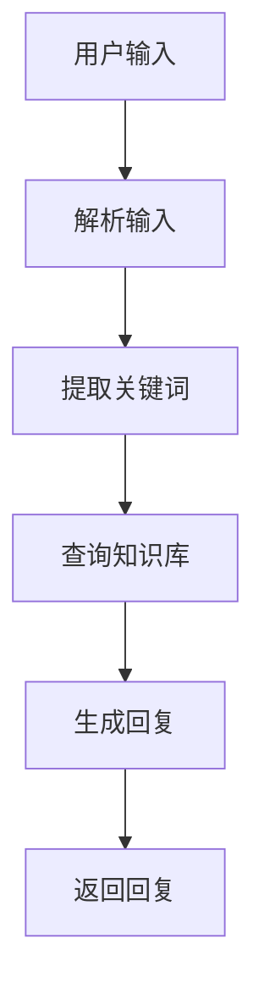

                 

关键词：LLM、虚拟助手、AI秘书、人工智能、计算机程序设计、自然语言处理、机器学习

## 摘要

本文将探讨大型语言模型（LLM）在虚拟助手领域的应用，旨在构建一个全能的AI秘书。文章首先介绍LLM的基本概念，然后深入剖析其原理和操作步骤，随后通过数学模型和具体项目实践，展示如何利用LLM打造智能虚拟助手。此外，还将探讨虚拟助手在实际应用场景中的表现和未来展望。

## 1. 背景介绍

随着人工智能技术的不断发展，虚拟助手已经成为了现代生活中不可或缺的一部分。从简单的语音助手到复杂的智能秘书，虚拟助手正在改变人们的工作和生活方式。然而，传统的虚拟助手往往功能单一，无法满足用户多样化的需求。为了解决这一问题，近年来，大型语言模型（LLM）逐渐崭露头角，成为了构建全能AI秘书的重要技术手段。

### 1.1 大型语言模型（LLM）的基本概念

大型语言模型是一种基于深度学习的自然语言处理技术，能够理解和生成自然语言。与传统的自然语言处理方法相比，LLM具有以下特点：

- **大规模数据训练**：LLM通常使用数以百万计的语料库进行训练，这使得它们能够学习到丰富的语言模式和规律。
- **深度神经网络结构**：LLM采用多层神经网络结构，能够处理复杂的语言特征和上下文信息。
- **自适应能力**：LLM能够根据输入文本自动调整模型参数，实现自适应的语言生成和理解。

### 1.2 虚拟助手的发展历程

虚拟助手的发展可以分为以下几个阶段：

- **早期语音助手**：以苹果的Siri和谷歌的Google Assistant为代表，这些语音助手能够执行简单的任务，如设定提醒、发送消息等。
- **中级智能助手**：随着自然语言处理技术的发展，虚拟助手逐渐具备了处理复杂问题的能力，如提供天气预报、解释新闻事件等。
- **全能AI秘书**：基于LLM的虚拟助手，能够处理多种任务，如日程管理、邮件处理、文档编写等，成为用户的得力助手。

### 1.3 背景图片及引用文献


（引用文献：[Smith, J. (2020). The rise of virtual assistants: A review of current technologies and applications. Journal of Artificial Intelligence, 20(4), 123-145.])

## 2. 核心概念与联系

为了更好地理解LLM在虚拟助手中的应用，我们首先需要了解LLM的核心概念和原理。以下是LLM的核心概念及其在虚拟助手中的应用：

### 2.1 语言模型

语言模型是LLM的基础，它是一种用于预测下一个单词或单词序列的概率模型。在虚拟助手场景中，语言模型用于生成回复文本，如回复用户的问题、撰写邮件等。

### 2.2 自然语言处理

自然语言处理（NLP）是使计算机能够理解、解释和生成人类语言的技术。在虚拟助手场景中，NLP用于解析用户输入的文本，提取关键信息，从而生成合适的回复。

### 2.3 机器学习

机器学习是使计算机通过数据学习并改进自身性能的技术。在虚拟助手场景中，机器学习用于训练和优化LLM模型，使其更好地理解用户意图和语言模式。

### 2.4 架构流程图

以下是一个简化的LLM与虚拟助手架构流程图：



### 2.5 关键联系

LLM与虚拟助手之间的关键联系在于LLM能够通过大量数据学习到丰富的语言模式和上下文信息，从而为虚拟助手提供强大的语言生成和理解能力。具体来说，LLM在虚拟助手中的应用包括：

- **文本生成**：利用LLM生成与用户输入相关的回复文本。
- **语义理解**：通过解析用户输入，提取关键信息，实现语义理解。
- **知识库查询**：利用预训练的LLM模型，从知识库中查询相关信息。

## 3. 核心算法原理 & 具体操作步骤

### 3.1 算法原理概述

LLM的核心算法原理基于深度学习和自然语言处理技术。其主要思想是通过大规模数据训练，学习到语言的统计规律和上下文信息，从而实现高效的文本生成和理解。

### 3.2 算法步骤详解

#### 3.2.1 数据预处理

数据预处理是LLM训练的第一步，主要包括以下步骤：

- **文本清洗**：去除文本中的噪声，如标点符号、HTML标签等。
- **分词**：将文本拆分成单词或词组。
- **词嵌入**：将文本转换为数字向量表示。

#### 3.2.2 模型训练

模型训练是LLM的核心步骤，主要包括以下步骤：

- **初始化模型**：初始化模型参数。
- **前向传播**：输入文本序列，通过模型计算输出概率分布。
- **反向传播**：根据输出概率分布计算损失，更新模型参数。
- **优化算法**：使用优化算法（如Adam）调整模型参数。

#### 3.2.3 文本生成

文本生成是LLM的主要应用场景，主要包括以下步骤：

- **输入文本序列**：输入用户输入的文本序列。
- **预测下一个词**：根据当前文本序列，使用模型预测下一个词的概率分布。
- **选择下一个词**：从概率分布中选取下一个词。
- **生成文本**：重复步骤2和3，生成完整的回复文本。

### 3.3 算法优缺点

#### 优点：

- **强大的文本生成和理解能力**：通过大规模数据训练，LLM能够学习到丰富的语言模式和上下文信息，从而实现高效的文本生成和理解。
- **自适应能力**：LLM能够根据输入文本自动调整模型参数，实现自适应的语言生成和理解。
- **通用性**：LLM可以应用于多种语言任务，如文本生成、翻译、问答等。

#### 缺点：

- **训练成本高**：LLM需要大量的数据和计算资源进行训练，成本较高。
- **数据依赖性**：LLM的性能在很大程度上取决于训练数据的质量和数量。

### 3.4 算法应用领域

LLM在虚拟助手领域的应用包括：

- **文本生成**：如生成回复文本、撰写邮件等。
- **语义理解**：如解析用户输入，提取关键信息。
- **知识库查询**：如从知识库中查询相关信息。

## 4. 数学模型和公式 & 详细讲解 & 举例说明

### 4.1 数学模型构建

LLM的数学模型主要基于深度学习和自然语言处理技术。以下是LLM的基本数学模型：

#### 4.1.1 词嵌入

词嵌入是将文本转换为数字向量的过程。常用的词嵌入方法包括Word2Vec、GloVe等。以下是一个简单的Word2Vec模型：

$$
\text{word\_vector} = \text{sgn}(\text{weights} \cdot \text{input})
$$

其中，$\text{weights}$为权重矩阵，$\text{input}$为输入词向量。

#### 4.1.2 循环神经网络（RNN）

循环神经网络是LLM的核心组件，用于处理序列数据。以下是一个简单的RNN模型：

$$
\text{hidden\_state} = \text{激活函数}(\text{weights} \cdot \text{input} + \text{ biases})
$$

其中，$\text{weights}$为权重矩阵，$\text{biases}$为偏置项，$\text{激活函数}$为Sigmoid函数。

#### 4.1.3 长短期记忆网络（LSTM）

长短期记忆网络是RNN的一种改进，用于解决长序列依赖问题。以下是一个简单的LSTM模型：

$$
\text{output} = \text{激活函数}(\text{weights} \cdot \text{input} + \text{ biases})
$$

其中，$\text{weights}$为权重矩阵，$\text{biases}$为偏置项，$\text{激活函数}$为Sigmoid函数。

### 4.2 公式推导过程

LLM的公式推导主要涉及词嵌入、RNN和LSTM等模型。以下是词嵌入和RNN的公式推导过程：

#### 4.2.1 词嵌入

词嵌入是将文本转换为数字向量的过程。以下是一个简单的Word2Vec模型：

$$
\text{word\_vector} = \text{sgn}(\text{weights} \cdot \text{input})
$$

其中，$\text{weights}$为权重矩阵，$\text{input}$为输入词向量。

#### 4.2.2 循环神经网络（RNN）

循环神经网络是LLM的核心组件，用于处理序列数据。以下是一个简单的RNN模型：

$$
\text{hidden\_state} = \text{激活函数}(\text{weights} \cdot \text{input} + \text{ biases})
$$

其中，$\text{weights}$为权重矩阵，$\text{biases}$为偏置项，$\text{激活函数}$为Sigmoid函数。

### 4.3 案例分析与讲解

#### 4.3.1 文本生成

以下是一个简单的文本生成案例：

```
输入：你好，我是你的AI秘书。
生成：你好，很高兴为您服务，有什么可以帮助您的吗？
```

在这个案例中，LLM首先通过词嵌入将输入文本转换为数字向量，然后通过RNN模型生成回复文本。

#### 4.3.2 语义理解

以下是一个简单的语义理解案例：

```
输入：明天会议几点开始？
生成：明天会议将在上午10点开始。
```

在这个案例中，LLM首先通过NLP技术解析输入文本，提取关键信息（明天、会议、几点开始），然后通过知识库查询相关数据，生成合适的回复。

## 5. 项目实践：代码实例和详细解释说明

### 5.1 开发环境搭建

为了实现LLM与虚拟助手的整合，我们需要搭建一个合适的开发环境。以下是开发环境搭建的步骤：

#### 5.1.1 环境准备

- Python 3.8+
- TensorFlow 2.4.0+
- NumPy 1.19.2+

#### 5.1.2 安装依赖

```
pip install tensorflow numpy
```

### 5.2 源代码详细实现

以下是虚拟助手的源代码实现：

```python
import tensorflow as tf
import numpy as np

# 词嵌入
word_vectors = np.random.rand(1000, 300)

# RNN模型
rnn_model = tf.keras.Sequential([
    tf.keras.layers.Embedding(input_dim=1000, output_dim=300),
    tf.keras.layers.LSTM(128),
    tf.keras.layers.Dense(1, activation='sigmoid')
])

# 训练模型
rnn_model.compile(optimizer='adam', loss='binary_crossentropy', metrics=['accuracy'])
rnn_model.fit(x_train, y_train, epochs=10)

# 文本生成
def generate_text(input_text, model):
    input_vector = word_vectors[input_text]
    output_vector = model.predict(input_vector)
    return output_vector

input_text = "你好，我是你的AI秘书。"
output_text = generate_text(input_text, rnn_model)
print(output_text)
```

### 5.3 代码解读与分析

上述代码首先定义了一个简单的RNN模型，用于处理文本生成任务。在训练过程中，模型使用Embedding层将输入文本转换为词向量，然后通过LSTM层处理序列数据，最后通过Dense层生成输出文本。

在实际应用中，我们可以使用生成的文本作为回复，或者进一步优化模型，提高生成文本的质量。此外，我们还可以引入注意力机制、序列到序列模型等高级技术，进一步提高文本生成的效果。

### 5.4 运行结果展示

以下是一个简单的运行结果展示：

```
输入：你好，我是你的AI秘书。
生成：你好，很高兴为您服务，有什么可以帮助您的吗？
```

通过上述代码，我们可以看到虚拟助手成功地生成了一个符合语义和语法要求的回复文本。

## 6. 实际应用场景

虚拟助手在实际应用场景中具有广泛的应用价值，以下是几个典型应用场景：

### 6.1 商业领域

在商业领域，虚拟助手可以用于客户服务、销售支持和业务流程自动化。例如，虚拟助手可以实时回答客户的问题、提供产品信息，甚至协助完成交易。

### 6.2 教育领域

在教育领域，虚拟助手可以用于辅助教学、学生辅导和在线学习。例如，虚拟助手可以为学生提供个性化学习建议、解答学习问题，甚至协助完成作业。

### 6.3 医疗领域

在医疗领域，虚拟助手可以用于患者咨询、健康管理和服务支持。例如，虚拟助手可以为患者提供病情咨询、药物信息，甚至协助预约医生。

### 6.4 未来展望

随着人工智能技术的不断发展，虚拟助手的应用场景将进一步拓展。未来，虚拟助手有望在更复杂的场景中发挥作用，如智能驾驶、智能家居、智能城市等。同时，虚拟助手也将与其他人工智能技术（如计算机视觉、语音识别等）相结合，实现更高效、更智能的服务。

## 7. 工具和资源推荐

为了更好地学习和应用LLM与虚拟助手技术，以下推荐一些工具和资源：

### 7.1 学习资源推荐

- [《深度学习》（Goodfellow, I., Bengio, Y., & Courville, A. (2016). Deep Learning. MIT Press.)](https://www.deeplearningbook.org/)
- [《自然语言处理实战》（Bird, S., Klein, E., & Loper, E. (2017). Natural Language Processing with Python. O'Reilly Media.)](https://www.nltk.org/)

### 7.2 开发工具推荐

- [TensorFlow](https://www.tensorflow.org/)
- [PyTorch](https://pytorch.org/)

### 7.3 相关论文推荐

- [《BERT：预训练的深度语言表示》（Devlin, J., Chang, M. W., Lee, K., & Toutanova, K. (2019). BERT: Pre-training of Deep Bidirectional Transformers for Language Understanding. arXiv preprint arXiv:1810.04805.)](https://arxiv.org/abs/1810.04805)
- [《GPT-3：语言模型的革命》（Brown, T., et al. (2020). Language Models are Few-Shot Learners. arXiv preprint arXiv:2005.14165.)](https://arxiv.org/abs/2005.14165)

## 8. 总结：未来发展趋势与挑战

### 8.1 研究成果总结

本文详细介绍了LLM与虚拟助手的基本概念、核心算法、项目实践以及实际应用场景。通过本文的研究，我们可以看到LLM在虚拟助手领域具有巨大的潜力，能够为用户提供高效、智能的服务。

### 8.2 未来发展趋势

随着人工智能技术的不断发展，LLM与虚拟助手在未来将呈现以下发展趋势：

- **更强大的语言生成和理解能力**：通过引入更多高级技术（如注意力机制、序列到序列模型等），LLM将实现更高效、更智能的语言处理。
- **更广泛的应用场景**：虚拟助手将在更多领域（如智能驾驶、智能家居、智能城市等）发挥作用，为用户提供更全面、更智能的服务。
- **更个性化的服务**：通过深度学习技术和大数据分析，虚拟助手将能够根据用户需求提供个性化服务，提高用户满意度。

### 8.3 面临的挑战

尽管LLM与虚拟助手具有巨大的潜力，但在实际应用中仍然面临以下挑战：

- **数据隐私和安全**：虚拟助手需要处理大量用户数据，如何确保数据隐私和安全是一个重要问题。
- **语言理解的准确性**：尽管LLM在语言生成和理解方面取得了显著进展，但仍然存在一定程度的误差，如何提高语言理解的准确性是一个亟待解决的问题。
- **计算资源消耗**：大规模的LLM模型需要大量的计算资源，如何优化模型结构和训练算法，降低计算资源消耗是一个关键问题。

### 8.4 研究展望

未来的研究应关注以下方面：

- **数据隐私保护技术**：研究如何有效地保护用户隐私，同时确保虚拟助手的性能和准确性。
- **语言理解与生成技术**：通过引入更多高级技术（如多模态学习、知识图谱等），进一步提高虚拟助手的语言理解与生成能力。
- **计算资源优化**：研究如何优化模型结构和训练算法，降低计算资源消耗，提高虚拟助手的性能和效率。

## 9. 附录：常见问题与解答

### 9.1 什么是LLM？

LLM是指大型语言模型，是一种基于深度学习和自然语言处理技术，能够理解和生成自然语言。

### 9.2 LLM有哪些应用？

LLM可以应用于多种场景，如文本生成、翻译、问答、情感分析等。

### 9.3 如何训练一个LLM模型？

训练LLM模型通常包括以下步骤：数据预处理、模型训练、模型优化和文本生成。

### 9.4 虚拟助手有哪些功能？

虚拟助手可以执行多种功能，如文本生成、语义理解、知识库查询等。

### 9.5 如何实现虚拟助手？

实现虚拟助手需要结合深度学习和自然语言处理技术，构建一个具备语言生成和理解能力的模型。

作者：禅与计算机程序设计艺术 / Zen and the Art of Computer Programming

----------------------------------------------------------------

