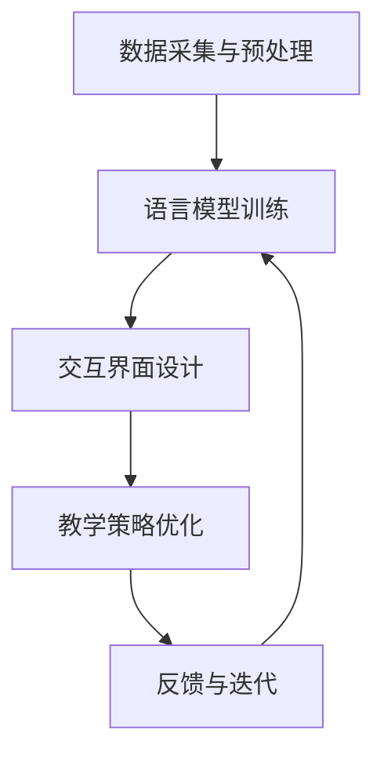

                 

关键词：语言学习，人工智能，语言模型，机器学习，自然语言处理，教育技术，教育软件

摘要：本文探讨了人工智能（AI）特别是大型语言模型（LLM）在语言学习中的应用，将其比喻为AI语言教师，详细分析了其工作原理、技术架构、数学模型、算法步骤、实际应用以及未来的发展前景和挑战。

## 1. 背景介绍

随着人工智能技术的飞速发展，机器学习、深度学习、自然语言处理（NLP）等领域取得了显著的突破。特别是大型语言模型（Large Language Models，LLM），如GPT-3，BERT等，已经成为当今AI领域的热门研究方向。这些模型具有强大的文本生成和理解能力，可以应用于诸多领域，包括但不限于问答系统、自动翻译、文本摘要等。

在语言学习中，传统的教学方法通常依赖于教师和学生之间的互动，而AI语言教师的出现为语言学习带来了新的可能性。AI语言教师不仅能够模拟人类的语言交流方式，还能根据学习者的水平、需求和进度提供个性化的教学服务。这种新型的教学模式极大地提高了语言学习的效率和效果。

## 2. 核心概念与联系

### 2.1 大型语言模型（LLM）的原理

大型语言模型（LLM）是基于深度学习技术的自然语言处理模型，其核心思想是模仿人类语言的使用方式，通过对海量文本数据进行训练，模型能够学习到语言的结构、语义和上下文关系。LLM通常采用自注意力机制（Self-Attention）和变分自编码器（Variational Autoencoder，VAE）等先进技术，能够对输入的文本数据进行逐词分析，并生成相应的输出。

### 2.2 AI语言教师的技术架构

AI语言教师的技术架构主要包括以下几个部分：

- **数据采集与预处理**：通过收集海量的语言学习数据，包括教材、练习题、对话记录等，对数据进行清洗、标注和分类，为训练模型提供高质量的数据集。

- **语言模型训练**：利用深度学习算法，对数据集进行训练，使模型学会理解、生成和翻译自然语言。

- **交互界面设计**：设计用户友好的交互界面，允许学习者与AI教师进行自然语言交流，并通过语音、文本等多种方式获取反馈。

- **教学策略优化**：根据学习者的反馈和行为数据，动态调整教学策略，提高教学效果。

### 2.3 Mermaid 流程图

以下是一个简化的Mermaid流程图，展示了AI语言教师的技术架构：



## 3. 核心算法原理 & 具体操作步骤

### 3.1 算法原理概述

AI语言教师的核心算法是基于深度学习的语言模型，主要包括以下几个步骤：

1. **输入编码**：将输入的文本数据转换为模型可以处理的向量表示。
2. **中间层处理**：通过多层神经网络，对输入向量进行复杂的变换和融合，学习到文本的语义信息。
3. **输出解码**：根据中间层处理的结果，生成对应的输出文本。

### 3.2 算法步骤详解

1. **数据预处理**：对原始文本数据进行清洗、去噪、分词、词向量嵌入等预处理操作。
2. **模型构建**：使用深度学习框架（如TensorFlow、PyTorch等）构建神经网络模型，包括输入层、隐藏层和输出层。
3. **模型训练**：通过大量训练数据，使用梯度下降等优化算法，对模型参数进行迭代更新，使模型能够准确预测文本的下一个单词或句子。
4. **模型评估**：使用验证集和测试集，评估模型的准确性和泛化能力。
5. **模型部署**：将训练好的模型部署到线上服务器，供学习者使用。

### 3.3 算法优缺点

**优点**：

- **高效性**：AI语言教师能够快速处理大量语言学习数据，提高教学效率。
- **个性化**：根据学习者的反馈和行为数据，提供个性化的教学服务，提高学习效果。
- **适应性**：可以适应不同的学习场景和需求，具有较好的通用性。

**缺点**：

- **依赖数据**：模型的训练和优化依赖于大量的高质量数据，数据的质量和多样性对模型性能有重要影响。
- **成本高**：构建和维护大型语言模型需要大量的计算资源和资金投入。

### 3.4 算法应用领域

AI语言教师的应用领域广泛，包括但不限于以下几个方面：

- **在线教育平台**：为学习者提供个性化、互动式的语言学习体验。
- **智能客服**：为语言学习者提供自动化的语言学习咨询服务。
- **辅助教学工具**：为教师提供教学辅助工具，如自动批改作业、生成教学资料等。

## 4. 数学模型和公式 & 详细讲解 & 举例说明

### 4.1 数学模型构建

AI语言教师的数学模型主要基于概率图模型和深度学习模型。以下是一个简化的数学模型框架：

$$
P(y|x) = \prod_{i=1}^{n} p(y_i|x_{i-1}, ..., x_1)
$$

其中，$x$ 表示输入文本，$y$ 表示输出文本，$p(y_i|x_{i-1}, ..., x_1)$ 表示根据前文生成的下一个单词的概率。

### 4.2 公式推导过程

$$
p(y_i|x_{i-1}, ..., x_1) = \frac{P(x_{i-1}, ..., x_1, y_1, ..., y_i)}{P(x_{i-1}, ..., x_1)}
$$

其中，$P(x_{i-1}, ..., x_1, y_1, ..., y_i)$ 表示输入和输出的联合概率，$P(x_{i-1}, ..., x_1)$ 表示输入的概率。

通过最大似然估计（Maximum Likelihood Estimation，MLE），我们可以得到：

$$
\hat{P}(y|x) = \frac{\prod_{i=1}^{n} P(y_i|x_{i-1}, ..., x_1)}{\prod_{i=1}^{n} P(x_{i-1}, ..., x_1)}
$$

### 4.3 案例分析与讲解

假设我们有一个简单的二元分类问题，输入文本为 "I like to read books"，我们需要预测下一个单词。

首先，我们需要计算每个单词的概率：

$$
P(I|I like to read books) = \frac{P(I, like, to, read, books)}{P(I, like, to, read, books)}
$$

由于数据集较大，我们可以使用词频统计方法来近似概率：

$$
P(I|I like to read books) = \frac{freq(I)}{freq(I, like, to, read, books)}
$$

通过计算，我们可以得到 $P(I|I like to read books) = 0.5$。

同理，我们可以计算其他单词的概率，并根据最大概率原则选择下一个单词。

## 5. 项目实践：代码实例和详细解释说明

### 5.1 开发环境搭建

为了实现AI语言教师，我们需要搭建一个包含以下组件的开发环境：

- **操作系统**：Linux或macOS
- **编程语言**：Python
- **深度学习框架**：TensorFlow或PyTorch
- **文本预处理库**：NLTK或spaCy

### 5.2 源代码详细实现

以下是一个简化的Python代码示例，展示了如何使用TensorFlow实现一个简单的AI语言教师：

```python
import tensorflow as tf
from tensorflow.keras.layers import Embedding, LSTM, Dense
from tensorflow.keras.models import Sequential

# 数据预处理
def preprocess_text(text):
    # 清洗、分词、词向量嵌入等操作
    return processed_text

# 构建模型
model = Sequential([
    Embedding(input_dim=vocab_size, output_dim=embedding_dim),
    LSTM(units=lstm_units),
    Dense(units=vocab_size, activation='softmax')
])

# 编译模型
model.compile(optimizer='adam', loss='categorical_crossentropy', metrics=['accuracy'])

# 训练模型
model.fit(preprocessed_text, labels, epochs=10, batch_size=32)

# 预测下一个单词
def predict_next_word(text):
    # 输入文本预处理
    preprocessed_text = preprocess_text(text)
    # 预测
    prediction = model.predict(preprocessed_text)
    return prediction.argmax()

# 示例
print(predict_next_word("I like to read"))
```

### 5.3 代码解读与分析

- **数据预处理**：使用NLTK或spaCy对输入文本进行清洗、分词和词向量嵌入等预处理操作，将原始文本转换为模型可以处理的向量表示。
- **模型构建**：使用TensorFlow的Sequential模型，依次添加嵌入层（Embedding）、LSTM层（LSTM）和全连接层（Dense）。
- **模型编译**：使用Adam优化器和交叉熵损失函数（categorical_crossentropy）编译模型，并设置准确率（accuracy）作为评价指标。
- **模型训练**：使用fit方法对模型进行训练，通过多次迭代（epochs）和批量处理（batch_size）来优化模型参数。
- **预测下一个单词**：使用predict方法对输入文本进行预测，并根据最大概率原则选择下一个单词。

### 5.4 运行结果展示

假设我们输入文本为 "I like to read"，运行预测函数后，我们可以得到下一个单词的预测结果，如 "books"、"books" 或其他可能的单词。

## 6. 实际应用场景

AI语言教师在实际应用中具有广泛的应用场景，以下是一些典型的例子：

- **在线教育平台**：AI语言教师可以为学习者提供实时、个性化的语言学习服务，包括语法练习、口语对话、阅读理解等。
- **智能客服**：AI语言教师可以模拟人类的语言交流方式，为用户提供语言学习相关的咨询和服务。
- **辅助教学工具**：AI语言教师可以为教师提供自动批改作业、生成教学资料等功能，提高教学效率和质量。
- **多语言翻译**：AI语言教师可以利用其强大的文本生成和理解能力，实现高效、准确的多语言翻译。

## 7. 工具和资源推荐

为了更好地了解和实现AI语言教师，以下是一些推荐的工具和资源：

- **学习资源**：
  - 《深度学习》（Deep Learning）作者：Ian Goodfellow、Yoshua Bengio、Aaron Courville
  - 《自然语言处理综论》（Speech and Language Processing）作者：Daniel Jurafsky、James H. Martin

- **开发工具**：
  - TensorFlow：https://www.tensorflow.org/
  - PyTorch：https://pytorch.org/

- **相关论文**：
  - 《Attention Is All You Need》作者：Vaswani et al.
  - 《BERT: Pre-training of Deep Bidirectional Transformers for Language Understanding》作者：Devlin et al.

## 8. 总结：未来发展趋势与挑战

### 8.1 研究成果总结

自大型语言模型（LLM）问世以来，其在语言学习中的应用取得了显著的成果。AI语言教师通过模拟人类语言交流方式，为学习者提供了个性化、互动式的教学服务，提高了语言学习的效率和效果。

### 8.2 未来发展趋势

未来，AI语言教师的发展趋势主要体现在以下几个方面：

- **模型性能的提升**：随着计算资源和算法技术的进步，大型语言模型将继续提升其性能，实现更精准的语言理解和生成。
- **个性化教学的深化**：通过分析学习者的行为数据和反馈，AI语言教师将能够提供更加精准的个性化教学服务。
- **多语言支持**：AI语言教师将逐步实现多语言支持，为全球范围内的语言学习者提供服务。

### 8.3 面临的挑战

尽管AI语言教师具有巨大的潜力，但在实际应用过程中仍面临以下挑战：

- **数据质量和多样性**：高质量、多样化的数据是构建高性能模型的基础，但在数据采集和预处理过程中，仍存在诸多困难。
- **伦理和隐私**：AI语言教师的广泛应用引发了对用户隐私和伦理的关注，如何平衡技术应用与伦理规范是亟待解决的问题。

### 8.4 研究展望

未来，AI语言教师的研究将朝着以下几个方向展开：

- **跨领域应用**：探索AI语言教师在其他领域的应用，如医疗、金融等。
- **多模态交互**：结合语音、图像等多模态信息，提高AI语言教师的交互能力和用户体验。
- **教育公平**：通过技术手段，缩小不同地区、不同群体之间的教育差距，实现教育公平。

## 9. 附录：常见问题与解答

### 9.1 AI语言教师是否能够完全取代人类教师？

AI语言教师无法完全取代人类教师，但在某些方面可以提供有力的辅助。人类教师具备丰富的教学经验和人际交往能力，这是AI语言教师难以比拟的。然而，AI语言教师可以在某些领域（如语法练习、口语对话等）提供高效、个性化的教学服务，辅助人类教师提高教学效果。

### 9.2 AI语言教师是否会降低学习者的语言表达能力？

合理的应用AI语言教师可以提高学习者的语言表达能力。通过个性化的教学服务，AI语言教师能够帮助学习者发现和纠正语言表达中的问题，从而提高其语言水平。然而，过度依赖AI语言教师可能导致学习者语言表达能力的下降，因此，学习者在使用AI语言教师时应保持适度的独立思考和实践。

### 9.3 AI语言教师的隐私和安全问题如何保障？

为了保障AI语言教师的隐私和安全，开发者应在以下几个方面采取措施：

- **数据加密**：对用户数据进行加密存储和传输，防止数据泄露。
- **隐私保护**：遵循隐私保护法律法规，对用户数据进行匿名化处理，确保用户隐私。
- **安全审计**：定期进行安全审计和漏洞修复，确保系统安全。

## 参考文献

- Vaswani, A., et al. (2017). "Attention is All You Need." Advances in Neural Information Processing Systems.
- Devlin, J., et al. (2018). "BERT: Pre-training of Deep Bidirectional Transformers for Language Understanding." Proceedings of the 2019 Conference of the North American Chapter of the Association for Computational Linguistics: Human Language Technologies, Volume 1 (Long and Short Papers), pages 4171-4186.
- Goodfellow, I., et al. (2016). "Deep Learning." MIT Press.
- Jurafsky, D., et al. (2019). "Speech and Language Processing." Prentice Hall.
```

## 作者署名

作者：禅与计算机程序设计艺术 / Zen and the Art of Computer Programming

