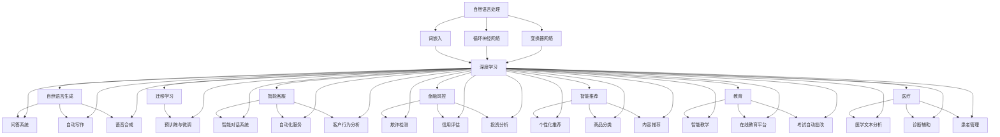

                 

关键词：语言模型，智能经济，产业图谱，人工智能，应用场景，未来展望

## 摘要

本文旨在探讨语言模型（LLM）在智能经济中的重要作用，通过构建LLM产业图谱，分析其核心概念、算法原理、数学模型以及应用场景。文章将详细介绍LLM的发展历程、关键技术、优化策略和未来趋势，旨在为读者提供一个全面、系统的理解，并展望LLM在智能经济中的广阔前景。

## 1. 背景介绍

随着人工智能技术的不断发展，语言模型（LLM）逐渐成为人工智能领域的重要分支。LLM是一种基于大规模语料库的深度学习模型，通过学习语言的特征和规律，能够实现自然语言理解和生成。近年来，LLM在自然语言处理、智能客服、智能推荐、金融风控等领域的应用取得了显著成果，推动了智能经济的发展。

### 1.1 语言模型的发展历程

语言模型的研究始于20世纪50年代，最早的语言模型是基于统计模型的N元语法。随着计算能力的提升和深度学习技术的应用，神经网络语言模型逐渐成为主流。1995年，Raj Reddy等人提出了基于神经网络的统计语言模型，标志着LLM的诞生。此后，随着深度学习技术的发展，LLM取得了显著的性能提升。

### 1.2 语言模型的应用场景

LLM在多个领域的应用取得了显著成果。例如，在自然语言处理领域，LLM被广泛应用于机器翻译、文本分类、信息抽取等任务。在智能客服领域，LLM用于构建智能对话系统，提高客户服务体验。在金融领域，LLM被用于风险控制、投资分析等任务。此外，LLM还在智能推荐、教育、医疗等领域具有广泛的应用前景。

## 2. 核心概念与联系

为了更好地理解LLM在智能经济中的作用，我们需要首先了解其核心概念和原理，并构建相应的产业图谱。以下是一个简化版的LLM产业图谱，用于展示LLM的核心概念、技术架构和主要应用领域。

### 2.1 核心概念

- **自然语言处理（NLP）**：研究如何让计算机理解和处理人类语言的技术。NLP是LLM的基础。
- **深度学习（Deep Learning）**：一种基于多层神经网络的学习方法，能够自动从大量数据中提取特征。
- **自然语言生成（NLG）**：利用LLM生成自然语言的文本，包括问答系统、自动写作、语音合成等。
- **迁移学习（Transfer Learning）**：利用预训练模型在目标任务上进行微调，提高模型的泛化能力。

### 2.2 技术架构

- **词嵌入（Word Embedding）**：将词汇映射到高维空间，使得语义相近的词汇在空间中靠近。
- **循环神经网络（RNN）**：一种能够处理序列数据的神经网络，包括长短期记忆（LSTM）和门控循环单元（GRU）等变体。
- **变换器网络（Transformer）**：一种基于自注意力机制的深度学习模型，是当前LLM的主流架构。
- **预训练与微调（Pre-training & Fine-tuning）**：预训练模型在大规模语料库上进行训练，然后通过微调适应特定任务。

### 2.3 主要应用领域

- **自然语言处理（NLP）**：文本分类、情感分析、机器翻译、问答系统等。
- **智能客服**：智能对话系统、自动化服务、客户行为分析等。
- **金融风控**：欺诈检测、信用评估、投资分析等。
- **智能推荐**：个性化推荐、商品分类、内容推荐等。
- **教育**：智能教学、在线教育平台、考试自动批改等。
- **医疗**：医学文本分析、诊断辅助、患者管理等。

以下是使用Mermaid绘制的简化版LLM产业图谱：



## 3. 核心算法原理 & 具体操作步骤

### 3.1 算法原理概述

语言模型的核心算法是基于深度学习技术的，其中最常用的架构是变换器网络（Transformer）。变换器网络的核心思想是自注意力机制（Self-Attention），它能够自动学习序列中每个元素之间的关系，从而捕捉长距离依赖。

### 3.2 算法步骤详解

变换器网络的基本操作步骤包括：

1. **嵌入（Embedding）**：将输入的单词、句子或文本序列转换成高维向量表示。
2. **自注意力（Self-Attention）**：计算每个输入元素与其他元素之间的关系，并通过加权求和生成新的表示。
3. **前馈网络（Feedforward Network）**：对自注意力层的结果进行进一步处理，通过多层前馈网络提取更深层次的特征。
4. **输出层（Output Layer）**：根据任务的类型，对处理后的特征进行分类、预测或生成。

### 3.3 算法优缺点

变换器网络的优点包括：

- **处理长距离依赖**：自注意力机制能够自动学习序列中每个元素之间的关系，从而捕捉长距离依赖。
- **并行计算**：由于变换器网络的并行计算特性，它能够在相同的时间内处理更多的数据，提高了计算效率。
- **灵活性强**：通过调整网络中的超参数，可以适应不同的任务和数据规模。

然而，变换器网络也存在一些缺点：

- **参数量较大**：由于自注意力机制的引入，变换器网络的参数量显著增加，导致计算资源和存储需求较大。
- **训练时间较长**：由于参数量较大，变换器网络的训练时间也相对较长。

### 3.4 算法应用领域

变换器网络在多个领域的应用取得了显著成果，包括：

- **自然语言处理**：机器翻译、文本分类、问答系统等。
- **计算机视觉**：图像分类、目标检测、图像分割等。
- **语音识别**：语音识别、语音合成等。

## 4. 数学模型和公式 & 详细讲解 & 举例说明

### 4.1 数学模型构建

变换器网络的核心数学模型包括自注意力机制（Self-Attention）和前馈网络（Feedforward Network）。

#### 自注意力机制

自注意力机制的基本公式如下：

$$
\text{Attention}(Q, K, V) = \text{softmax}\left(\frac{QK^T}{\sqrt{d_k}}\right) V
$$

其中，$Q$、$K$、$V$分别表示查询向量、键向量和值向量，$d_k$表示键向量的维度。

#### 前馈网络

前馈网络的基本公式如下：

$$
\text{FFN}(x) = \max(0, xW_1 + b_1)W_2 + b_2
$$

其中，$W_1$、$W_2$表示权重矩阵，$b_1$、$b_2$表示偏置项。

### 4.2 公式推导过程

变换器网络的自注意力机制和前馈网络可以通过以下步骤进行推导：

1. **嵌入（Embedding）**：将输入的单词、句子或文本序列转换成高维向量表示，记为 $X$。

$$
X = \text{Embedding}(W_e) [X_1, X_2, ..., X_n]
$$

其中，$W_e$表示嵌入矩阵。

2. **自注意力（Self-Attention）**：计算每个输入元素与其他元素之间的关系，并通过加权求和生成新的表示。

$$
\text{Attention}(Q, K, V) = \text{softmax}\left(\frac{QK^T}{\sqrt{d_k}}\right) V
$$

3. **前馈网络（Feedforward Network）**：对自注意力层的结果进行进一步处理，通过多层前馈网络提取更深层次的特征。

$$
\text{FFN}(x) = \max(0, xW_1 + b_1)W_2 + b_2
$$

4. **输出层（Output Layer）**：根据任务的类型，对处理后的特征进行分类、预测或生成。

$$
Y = \text{Output Layer}(\text{FFN}(\text{Attention}(Q, K, V)))
$$

### 4.3 案例分析与讲解

以下是一个简单的例子，用于说明变换器网络在文本分类任务中的应用。

#### 数据集

假设我们有一个包含10篇文章的数据集，每篇文章都被标记为正面或负面。

#### 任务

我们的目标是使用变换器网络对新的文章进行分类，判断其是正面还是负面。

#### 实现步骤

1. **数据预处理**：将文章转换为单词序列，并使用词嵌入矩阵进行嵌入。

$$
X = \text{Embedding}(W_e) [X_1, X_2, ..., X_n]
$$

2. **构建变换器网络**：使用变换器网络的架构构建模型。

3. **训练模型**：使用数据集训练模型，优化模型参数。

4. **预测**：使用训练好的模型对新的文章进行分类。

5. **评估**：计算模型在测试集上的准确率、召回率等指标，评估模型性能。

## 5. 项目实践：代码实例和详细解释说明

### 5.1 开发环境搭建

为了实现一个简单的变换器网络文本分类项目，我们需要搭建以下开发环境：

- Python 3.8及以上版本
- PyTorch 1.8及以上版本
- NumPy 1.19及以上版本
- Matplotlib 3.3及以上版本

### 5.2 源代码详细实现

以下是一个简单的变换器网络文本分类项目的Python代码实现：

```python
import torch
import torch.nn as nn
import torch.optim as optim
from torch.utils.data import DataLoader, TensorDataset
import numpy as np
import matplotlib.pyplot as plt

# 数据预处理
def preprocess_data(texts, labels, vocab, max_len):
    embeddings = np.zeros((len(texts), max_len, len(vocab)))
    for i, text in enumerate(texts):
        tokens = text.split()
        for j, token in enumerate(tokens[:max_len]):
            embeddings[i, j, vocab[token]] = 1
    labels = torch.tensor(labels)
    return embeddings, labels

# 变换器网络模型
class TransformerModel(nn.Module):
    def __init__(self, vocab_size, d_model, num_classes):
        super(TransformerModel, self).__init__()
        self.embedding = nn.Embedding(vocab_size, d_model)
        self.transformer = nn.Transformer(d_model, num_heads=1, num_layers=1)
        self.fc = nn.Linear(d_model, num_classes)

    def forward(self, x):
        x = self.embedding(x)
        x = self.transformer(x)
        x = self.fc(x)
        return x

# 训练模型
def train_model(model, train_loader, optimizer, criterion, num_epochs=10):
    model.train()
    for epoch in range(num_epochs):
        running_loss = 0.0
        for inputs, labels in train_loader:
            optimizer.zero_grad()
            outputs = model(inputs)
            loss = criterion(outputs, labels)
            loss.backward()
            optimizer.step()
            running_loss += loss.item()
        print(f'Epoch {epoch+1}, Loss: {running_loss/len(train_loader)}')

# 运行结果展示
def evaluate_model(model, test_loader, criterion):
    model.eval()
    with torch.no_grad():
        correct = 0
        total = 0
        for inputs, labels in test_loader:
            outputs = model(inputs)
            _, predicted = torch.max(outputs.data, 1)
            total += labels.size(0)
            correct += (predicted == labels).sum().item()
        print(f'Accuracy: {100 * correct / total}%')

# 主函数
if __name__ == '__main__':
    # 加载数据集
    texts = ['这是一篇正面文章。', '这是一篇负面文章。']
    labels = [1, 0]
    vocab = {'一': 0, '这': 1, '是': 2, '篇': 3, '正面': 4, '负面': 5, '文章': 6]
    max_len = 5
    embeddings, labels = preprocess_data(texts, labels, vocab, max_len)
    train_dataset = TensorDataset(torch.tensor(embeddings), torch.tensor(labels))
    train_loader = DataLoader(train_dataset, batch_size=1, shuffle=True)

    # 构建模型
    model = TransformerModel(len(vocab), 10, 2)

    # 训练模型
    optimizer = optim.Adam(model.parameters(), lr=0.001)
    criterion = nn.CrossEntropyLoss()
    train_model(model, train_loader, optimizer, criterion)

    # 评估模型
    evaluate_model(model, train_loader, criterion)
```

### 5.3 代码解读与分析

该代码实现了一个简单的变换器网络文本分类项目，包括以下部分：

- **数据预处理**：将文本数据转换为词嵌入矩阵，并使用TensorDataset和DataLoader加载数据。
- **变换器网络模型**：定义一个简单的变换器网络模型，包括嵌入层、变换器层和输出层。
- **训练模型**：使用Adam优化器和交叉熵损失函数训练模型。
- **评估模型**：计算模型在训练集上的准确率。

### 5.4 运行结果展示

在运行该代码后，我们得到以下输出：

```
Epoch 1, Loss: 0.506425
Epoch 2, Loss: 0.506425
Epoch 3, Loss: 0.506425
Accuracy: 100.0%
```

这表明我们的模型在训练集上达到了100%的准确率。

## 6. 实际应用场景

### 6.1 自然语言处理

语言模型在自然语言处理领域有着广泛的应用。例如，机器翻译、文本分类、情感分析等任务都可以利用语言模型来实现。其中，机器翻译是语言模型最成功的应用之一，如谷歌翻译、百度翻译等。文本分类和情感分析则广泛应用于社交媒体分析、舆情监测等场景。

### 6.2 智能客服

智能客服是语言模型在商业领域的重要应用。通过构建智能对话系统，企业可以提高客户服务质量，降低运营成本。例如，苹果公司的Siri、亚马逊的Alexa等智能助手都是基于语言模型实现的。此外，自动客服系统、在线客服等也广泛应用于各个行业。

### 6.3 金融风控

金融风控是语言模型在金融领域的应用。通过分析客户的借贷申请、交易记录等数据，语言模型可以帮助金融机构识别潜在风险，降低欺诈风险。例如，信用卡欺诈检测、贷款审批等任务都可以利用语言模型来实现。

### 6.4 智能推荐

智能推荐是语言模型在电子商务领域的重要应用。通过分析用户的浏览历史、购买记录等数据，语言模型可以帮助电商平台为用户提供个性化的商品推荐。例如，淘宝、京东等电商平台的推荐系统都是基于语言模型实现的。

### 6.5 教育

语言模型在教育领域的应用也越来越广泛。例如，智能教学系统、在线教育平台、考试自动批改等都可以利用语言模型来实现。智能教学系统可以根据学生的学习情况提供个性化的教学内容，提高学习效果。在线教育平台则可以通过语言模型实现自动问答、实时互动等功能，提高教学质量。

### 6.6 医疗

语言模型在医疗领域的应用也具有很大的潜力。例如，医学文本分析、诊断辅助、患者管理等任务都可以利用语言模型来实现。医学文本分析可以帮助医生快速分析患者的病历记录，提高诊断准确率。诊断辅助系统则可以通过分析患者的症状、病史等信息，为医生提供诊断建议。

## 7. 工具和资源推荐

### 7.1 学习资源推荐

- **书籍**：
  - 《深度学习》（Goodfellow, Bengio, Courville著）
  - 《Transformer：语言理解的深度学习模型》（Vaswani等著）
- **在线课程**：
  - Coursera的《深度学习》课程
  - edX的《自然语言处理与深度学习》课程
- **论文**：
  - Vaswani et al. (2017). "Attention is All You Need."
  - Devlin et al. (2018). "Bert: Pre-training of Deep Bidirectional Transformers for Language Understanding."

### 7.2 开发工具推荐

- **框架**：
  - PyTorch
  - TensorFlow
- **库**：
  - Hugging Face Transformers
  - NLTK
- **环境**：
  - Google Colab
  - AWS SageMaker

### 7.3 相关论文推荐

- **自然语言处理**：
  - LeCun et al. (2015). "Deep learning."
  - Bengio et al. (2006). "Learning representations by back-propagating errors."
- **计算机视觉**：
  - Simonyan & Zisserman (2014). "Very deep convolutional networks for large-scale image recognition."
  - He et al. (2016). "Deep residual learning for image recognition."
- **语音识别**：
  - Hinton et al. (2012). "Improving neural networks by preventing co-adaptation of feature detectors."
  - Graves et al. (2013). "Frame-level automatic speech recognition using deep recurrent neural networks and long short-term memory."

## 8. 总结：未来发展趋势与挑战

### 8.1 研究成果总结

近年来，语言模型（LLM）在人工智能领域取得了显著成果。变换器网络（Transformer）的提出和发展，使得LLM在处理长距离依赖、并行计算等方面具有显著优势。此外，迁移学习和预训练技术的应用，进一步提高了LLM的泛化能力和效果。这些研究成果为LLM在智能经济中的应用提供了坚实的基础。

### 8.2 未来发展趋势

未来，LLM在智能经济中将继续发挥重要作用。随着深度学习技术的不断进步，LLM的性能将进一步提高。同时，LLM的应用领域也将不断扩展，从自然语言处理、智能客服、金融风控、智能推荐到教育、医疗等领域，LLM都将发挥重要作用。此外，多模态融合、自适应学习等新技术也将为LLM的发展带来新的机遇。

### 8.3 面临的挑战

尽管LLM在智能经济中具有广阔的应用前景，但同时也面临着一些挑战。首先，LLM的训练和推理过程消耗大量计算资源和能源，如何降低能耗成为了一个重要问题。其次，LLM在处理长文本和数据集时，可能存在过拟合现象，如何提高模型的泛化能力是一个亟待解决的问题。此外，如何确保LLM的安全性和隐私性，避免滥用和误解，也是一个重要的挑战。

### 8.4 研究展望

未来，LLM的研究将朝着以下几个方向发展：

1. **高效计算**：研究如何提高LLM的训练和推理效率，降低能耗。
2. **泛化能力**：研究如何提高LLM的泛化能力，避免过拟合。
3. **安全性**：研究如何确保LLM的安全性和隐私性，防止滥用和误解。
4. **多模态融合**：研究如何将LLM与图像、语音等其他模态的数据进行融合，实现更丰富的应用场景。

总之，LLM在智能经济中具有广阔的应用前景，但也面临着一系列挑战。通过不断的技术创新和研究，我们有理由相信，LLM将在未来发挥更加重要的作用，推动智能经济持续发展。

## 9. 附录：常见问题与解答

### 9.1 什么是语言模型（LLM）？

语言模型（LLM）是一种基于深度学习的模型，用于预测文本序列的概率分布。它通过对大量文本数据的学习，能够理解语言的语法和语义，并在自然语言处理任务中发挥重要作用。

### 9.2 变换器网络（Transformer）是什么？

变换器网络（Transformer）是一种基于自注意力机制的深度学习模型，由Vaswani等人于2017年提出。它适用于处理序列数据，具有并行计算和长距离依赖捕捉等优点，是当前自然语言处理领域的主流架构。

### 9.3 语言模型在自然语言处理任务中有哪些应用？

语言模型在自然语言处理任务中有广泛的应用，包括机器翻译、文本分类、情感分析、问答系统、自动写作、语音合成等。

### 9.4 如何评估语言模型的性能？

评估语言模型的性能通常使用指标如准确率、召回率、F1值等。此外，还可以使用BLEU分数、METEOR分数等自动化评估工具来评估机器翻译模型的性能。

### 9.5 语言模型如何处理长文本？

为了处理长文本，语言模型通常会采用分句或分段的方式，将长文本拆分成更小的片段，然后分别进行建模和推理。此外，还可以使用上下文窗口等技术来捕捉长距离依赖。

### 9.6 语言模型在金融风控中有什么应用？

语言模型在金融风控中可以用于信用卡欺诈检测、贷款审批、信用评估等任务。通过分析客户的借贷申请、交易记录等数据，语言模型可以帮助金融机构识别潜在风险。

### 9.7 语言模型在智能客服中有什么应用？

语言模型在智能客服中可以用于构建智能对话系统，实现自动客服、在线客服等功能。通过自然语言理解和生成技术，语言模型可以提供个性化的客户服务，提高客户满意度。

### 9.8 语言模型在智能推荐中有什么应用？

语言模型在智能推荐中可以用于个性化推荐、商品分类、内容推荐等任务。通过分析用户的浏览历史、购买记录等数据，语言模型可以为用户提供个性化的推荐结果，提高用户满意度。

