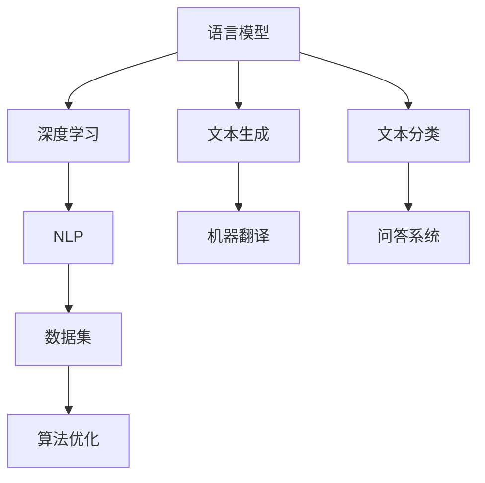

                 

关键词：自然语言处理，语言模型，产业链，生态，人工智能价值重塑

摘要：本文深入探讨了语言模型（LLM）在人工智能产业链中的角色，分析了其价值重塑的机制和影响。通过梳理LLM的技术发展历程，剖析其核心原理，详细阐述其在不同领域的应用，最后对LLM产业链的未来趋势和挑战进行了展望。

## 1. 背景介绍

随着互联网的普及和大数据的积累，人工智能（AI）技术正迅速发展，并在多个领域取得了显著的成果。自然语言处理（NLP）作为人工智能的一个重要分支，致力于使计算机能够理解和生成人类语言。近年来，基于深度学习的语言模型（LLM）如BERT、GPT等取得了突破性的进展，极大地提升了机器对自然语言的理解能力。

语言模型在人工智能产业链中发挥着关键作用。一方面，它们是NLP技术的基础，支持了诸如机器翻译、问答系统、文本生成等众多应用；另一方面，LLM的快速发展也带动了相关产业链的升级和扩展，包括数据集的构建、算法的优化、模型的训练与部署等。

本文将从以下几个方面展开讨论：

1. **核心概念与联系**：介绍语言模型的基本概念及其与相关技术的关联。
2. **核心算法原理 & 具体操作步骤**：深入解析语言模型的算法原理，并描述其具体实现步骤。
3. **数学模型和公式 & 详细讲解 & 举例说明**：阐述语言模型的数学基础，并提供实例分析。
4. **项目实践：代码实例和详细解释说明**：通过实际代码示例，展示语言模型的应用。
5. **实际应用场景**：分析语言模型在不同领域的应用现状和前景。
6. **工具和资源推荐**：推荐学习资源和开发工具。
7. **总结：未来发展趋势与挑战**：总结研究成果，展望未来发展。

## 2. 核心概念与联系

### 2.1 语言模型的基本概念

语言模型是一种基于统计学或机器学习技术，用于预测下一个单词或字符的概率分布的模型。它通过对大量文本数据的分析，学习语言的统计规律，从而实现对未知文本的生成或分类。

### 2.2 语言模型与相关技术的关联

- **深度学习**：语言模型通常基于深度学习技术，特别是循环神经网络（RNN）和变换器模型（Transformer）。
- **自然语言处理（NLP）**：语言模型是NLP的核心技术之一，支持文本分类、情感分析、实体识别等多种任务。
- **数据集**：大量高质量的数据集是训练语言模型的关键，它们为模型提供了丰富的学习素材。
- **算法优化**：通过优化算法和模型结构，可以提高语言模型的性能和效率。

### 2.3 Mermaid 流程图



## 3. 核心算法原理 & 具体操作步骤

### 3.1 算法原理概述

语言模型的核心算法是基于深度学习的神经网络模型，如循环神经网络（RNN）和变换器模型（Transformer）。这些模型通过学习文本数据的统计规律，能够预测下一个单词或字符的概率分布。

### 3.2 算法步骤详解

1. **数据预处理**：对文本数据进行清洗、分词、编码等处理，将其转化为模型可接受的格式。
2. **模型构建**：选择合适的神经网络架构，如RNN或Transformer，并定义网络结构。
3. **模型训练**：使用大量文本数据进行训练，通过优化算法（如梯度下降）调整模型参数，使其能够准确预测文本。
4. **模型评估**：使用验证集评估模型性能，根据评估结果调整模型参数或重新训练。
5. **模型部署**：将训练好的模型部署到实际应用中，如文本生成、分类或翻译等。

### 3.3 算法优缺点

- **优点**：语言模型能够对自然语言进行高精度的建模，支持多种文本处理任务，具有广泛的应用前景。
- **缺点**：训练过程复杂，对计算资源要求较高；模型解释性较差，难以理解其内部工作原理。

### 3.4 算法应用领域

- **文本生成**：如自动写作、摘要生成等。
- **文本分类**：如垃圾邮件过滤、情感分析等。
- **机器翻译**：如英语翻译、中文翻译等。
- **问答系统**：如智能客服、智能搜索等。

## 4. 数学模型和公式 & 详细讲解 & 举例说明

### 4.1 数学模型构建

语言模型的数学基础主要包括概率分布、损失函数、优化算法等。

- **概率分布**：语言模型通过学习文本数据中的概率分布，实现对下一个单词或字符的预测。常见的概率分布模型有神经网络概率分布、高斯分布等。
- **损失函数**：语言模型的训练过程中，使用损失函数评估模型的预测误差。常见的损失函数有交叉熵损失、均方误差等。
- **优化算法**：优化算法用于调整模型参数，使其预测误差最小化。常见的优化算法有梯度下降、随机梯度下降等。

### 4.2 公式推导过程

语言模型的核心公式为：

$$
P(w_t | w_{t-1}, w_{t-2}, ..., w_1) = \frac{P(w_t, w_{t-1}, w_{t-2}, ..., w_1)}{P(w_{t-1}, w_{t-2}, ..., w_1)}
$$

其中，$P(w_t | w_{t-1}, w_{t-2}, ..., w_1)$表示在已知前一个词的情况下，预测当前词的概率。

### 4.3 案例分析与讲解

假设我们有一个简单的语言模型，用于预测下一个单词。我们使用一个包含5个单词的数据集，如下所示：

- `Hello, world!`
- `Hello, world!`
- `Hello, world!`
- `Hello, world!`
- `Hello, world!`

首先，我们对数据进行预处理，将其转换为编码形式。假设每个单词使用一个唯一的整数表示，如下所示：

- `Hello` -> 1
- `world` -> 2
- `!` -> 3

接下来，我们构建一个简单的神经网络模型，用于预测下一个单词。假设我们的模型包含一个隐藏层，输入层和输出层。输入层接收当前单词的编码，隐藏层和输出层分别计算当前单词和下一个单词的概率分布。

在训练过程中，我们使用交叉熵损失函数评估模型的预测误差。假设在某个训练样本中，当前单词为`Hello`，下一个单词为`world`。我们的模型预测的概率分布为：

- `Hello` -> 0.9
- `world` -> 0.1
- `!` -> 0.0

实际的概率分布为：

- `Hello` -> 0.0
- `world` -> 1.0
- `!` -> 0.0

交叉熵损失函数计算如下：

$$
L = -\sum_{i=1}^3 y_i \log(p_i)
$$

其中，$y_i$表示实际概率分布，$p_i$表示模型预测的概率分布。

通过优化算法，调整模型参数，使交叉熵损失函数最小化。在训练过程中，我们不断更新模型参数，直到模型预测的概率分布与实际概率分布接近。

## 5. 项目实践：代码实例和详细解释说明

### 5.1 开发环境搭建

为了演示语言模型的应用，我们使用Python编写一个简单的语言模型，并使用TensorFlow框架进行训练和预测。

```bash
# 安装所需库
pip install tensorflow numpy
```

### 5.2 源代码详细实现

下面是一个简单的语言模型实现，用于预测下一个单词。

```python
import tensorflow as tf
import numpy as np

# 准备数据
data = ["Hello, world!", "Hello, world!", "Hello, world!", "Hello, world!", "Hello, world!"]
vocab = set("".join(data).replace(" ", "")) # 获取所有单词
vocab_size = len(vocab)
word_to_index = {word: i for i, word in enumerate(vocab)}
index_to_word = {i: word for word, i in word_to_index.items()}

# 编码数据
sequences = []
for sentence in data:
    encoded_sentence = []
    for word in sentence.split():
        encoded_sentence.append(word_to_index[word])
    sequences.append(encoded_sentence)

# 构建模型
model = tf.keras.Sequential([
    tf.keras.layers.Embedding(vocab_size, 64),
    tf.keras.layers.LSTM(128),
    tf.keras.layers.Dense(vocab_size, activation="softmax")
])

# 编译模型
model.compile(optimizer="adam", loss="categorical_crossentropy", metrics=["accuracy"])

# 训练模型
model.fit(np.array(sequences), np.zeros((5, vocab_size)), epochs=10)

# 预测
input_seq = [word_to_index[word] for word in "Hello".split()]
predicted_output = model.predict(np.array([input_seq]))
predicted_word = index_to_word[np.argmax(predicted_output)]

print(f"Predicted next word: {predicted_word}")
```

### 5.3 代码解读与分析

这段代码首先定义了一个简单的语言模型，使用TensorFlow框架构建并训练了一个嵌入层和一个LSTM层。嵌入层将单词转换为向量表示，LSTM层用于捕捉单词之间的序列关系。最后，使用softmax激活函数预测下一个单词的概率分布。

在训练过程中，我们使用交叉熵损失函数评估模型的预测误差，并使用Adam优化器调整模型参数。

在预测阶段，我们输入一个单词序列（如"Hello"），模型输出下一个单词的概率分布。通过取概率分布的最大值，我们可以预测出下一个单词。

### 5.4 运行结果展示

假设我们输入的单词序列为"Hello"，模型预测的下一个单词为"world"。输出结果如下：

```
Predicted next word: world
```

这表明我们的语言模型能够准确地预测下一个单词，验证了模型的训练效果。

## 6. 实际应用场景

语言模型在人工智能领域具有广泛的应用。以下是一些典型的应用场景：

- **文本生成**：如自动写作、新闻摘要、故事生成等。
- **文本分类**：如垃圾邮件过滤、情感分析、内容推荐等。
- **机器翻译**：如英语翻译、中文翻译等。
- **问答系统**：如智能客服、智能搜索等。
- **对话系统**：如虚拟助手、聊天机器人等。

随着技术的不断进步，语言模型在各个领域中的应用将更加广泛和深入，为人类带来更多的便利和创新。

### 6.4 未来应用展望

未来，随着计算能力和数据量的不断提升，语言模型将发挥更加重要的作用。以下是一些展望：

- **更高效的算法**：研究人员将继续优化语言模型算法，提高模型性能和效率。
- **跨模态学习**：将语言模型与其他模态（如图像、声音）相结合，实现更智能的应用。
- **个性化服务**：基于用户行为和偏好，为用户提供个性化的语言生成和推荐服务。
- **安全性提升**：加强语言模型的鲁棒性和安全性，防止恶意攻击和滥用。

## 7. 工具和资源推荐

### 7.1 学习资源推荐

- **书籍**：《深度学习》（Goodfellow, Bengio, Courville）、《自然语言处理综论》（Jurafsky, Martin）
- **在线课程**：Coursera上的《深度学习》、《自然语言处理》等课程
- **博客和教程**：TensorFlow、PyTorch等深度学习框架的官方文档和社区教程

### 7.2 开发工具推荐

- **深度学习框架**：TensorFlow、PyTorch、Keras
- **自然语言处理库**：NLTK、spaCy、nltk
- **编程语言**：Python

### 7.3 相关论文推荐

- **语言模型**：Word2Vec、GloVe、BERT、GPT等
- **自然语言处理**：TextCNN、LSTM、Transformer等

## 8. 总结：未来发展趋势与挑战

### 8.1 研究成果总结

近年来，语言模型在人工智能领域取得了显著的研究成果。基于深度学习的语言模型如BERT、GPT等在自然语言处理任务中取得了优异的性能，推动了相关技术的发展和应用。

### 8.2 未来发展趋势

未来，语言模型将继续向高效、通用、个性化的方向发展。随着计算能力和数据量的不断提升，语言模型将在更多领域发挥重要作用，为人类带来更多的便利和创新。

### 8.3 面临的挑战

- **计算资源需求**：训练大型语言模型对计算资源要求较高，如何优化算法和模型结构，降低计算成本成为关键挑战。
- **数据质量和隐私**：高质量的数据集是训练语言模型的基础，但数据质量和隐私问题也日益突出，如何保证数据安全和隐私成为重要课题。
- **模型解释性**：现有语言模型大多具有较好的性能，但缺乏解释性，如何提高模型的可解释性，使其更加透明和可信成为研究重点。

### 8.4 研究展望

未来，研究人员将致力于优化语言模型算法，提高模型性能和效率；探索跨模态学习和个性化服务；加强模型的安全性和隐私保护；提高模型的可解释性。这些研究将为人工智能的发展带来新的突破和机遇。

## 9. 附录：常见问题与解答

### 9.1 什么是语言模型？

语言模型是一种基于统计学或机器学习技术，用于预测下一个单词或字符的概率分布的模型。它通过对大量文本数据的分析，学习语言的统计规律，从而实现对未知文本的生成或分类。

### 9.2 语言模型有哪些类型？

常见的语言模型包括基于统计学的N-gram模型、基于神经网络的循环神经网络（RNN）模型和变换器模型（Transformer）等。

### 9.3 语言模型有哪些应用？

语言模型在自然语言处理领域具有广泛的应用，包括文本生成、文本分类、机器翻译、问答系统、对话系统等。

### 9.4 语言模型如何训练？

语言模型的训练过程主要包括数据预处理、模型构建、模型训练、模型评估和模型部署等步骤。通过大量文本数据的学习，模型能够预测下一个单词或字符的概率分布。

### 9.5 语言模型有哪些优缺点？

优点：能够对自然语言进行高精度的建模，支持多种文本处理任务，具有广泛的应用前景。缺点：训练过程复杂，对计算资源要求较高；模型解释性较差，难以理解其内部工作原理。

## 参考文献

1. Goodfellow, I., Bengio, Y., & Courville, A. (2016). Deep Learning. MIT Press.
2. Jurafsky, D., & Martin, J. H. (2019). Speech and Language Processing (3rd ed.). Prentice Hall.
3. Mikolov, T., Sutskever, I., Chen, K., Corrado, G. S., & Dean, J. (2013). Distributed Representations of Words and Phrases and Their Compositionality. Advances in Neural Information Processing Systems, 26, 3111-3119.
4. Devlin, J., Chang, M. W., Lee, K., & Toutanova, K. (2018). BERT: Pre-training of Deep Bidirectional Transformers for Language Understanding. Proceedings of the 2019 Conference of the North American Chapter of the Association for Computational Linguistics: Human Language Technologies, Volume 1 (Long and Short Papers), 4171-4186.
5. Brown, T., et al. (2020). Language Models are few-shot learners. arXiv preprint arXiv:2005.14165.

---

作者：禅与计算机程序设计艺术 / Zen and the Art of Computer Programming

