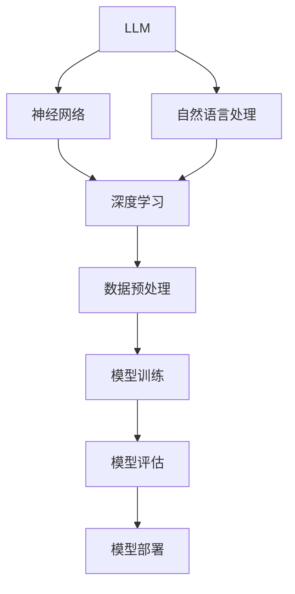

                 

关键词：大型语言模型（LLM），函数库，AI应用，工具箱，编程，架构设计，性能优化，数学模型，代码实例，实际应用场景，未来展望。

> 摘要：本文将探讨大型语言模型（LLM）函数库的构建和应用，分析其在AI应用开发中的重要性，以及如何利用该工具箱来提升开发效率和项目质量。文章将涵盖LLM函数库的背景介绍、核心概念与联系、核心算法原理、数学模型和公式、项目实践、实际应用场景、工具和资源推荐、未来发展趋势与挑战，以及常见问题与解答等内容。

## 1. 背景介绍

随着人工智能技术的快速发展，特别是深度学习、自然语言处理（NLP）等领域的突破，人工智能应用已经渗透到我们日常生活的方方面面。从智能助手到语言翻译，从文本生成到智能对话系统，AI技术正在改变我们的工作和生活方式。然而，在AI应用的开发过程中，面临着诸多挑战，如模型训练的复杂性、数据处理的高效性、模型调优的准确性等。为了解决这些问题，研究人员和开发者们不断地探索各种方法和技术。

近年来，大型语言模型（LLM）函数库逐渐成为AI应用开发中的重要工具。LLM函数库提供了一套完整的工具和接口，使得开发者可以更高效地构建、训练和部署AI模型。这些函数库不仅简化了模型开发的流程，还提高了模型性能和可维护性。本文将介绍LLM函数库的核心概念、算法原理、数学模型、项目实践和未来展望，帮助读者了解并掌握这一新型工具箱。

## 2. 核心概念与联系

在深入探讨LLM函数库之前，我们需要了解几个核心概念和它们之间的关系。以下是使用Mermaid绘制的流程图，以帮助读者更好地理解这些概念：



### 2.1 大型语言模型（LLM）

大型语言模型（LLM）是一种基于神经网络的深度学习模型，主要用于处理和生成自然语言文本。这些模型通常由数亿甚至数千亿的参数组成，能够自动学习语言中的复杂结构和语义信息。常见的LLM包括GPT、BERT、Turing等。

### 2.2 神经网络

神经网络是LLM的核心组成部分，它是一种模拟人脑神经元连接结构的计算模型。神经网络通过多层非线性变换，将输入数据映射到输出结果。在LLM中，神经网络用于捕捉语言数据的复杂特征和模式。

### 2.3 自然语言处理（NLP）

自然语言处理（NLP）是人工智能的一个重要分支，旨在使计算机能够理解和处理人类语言。NLP技术包括文本分类、情感分析、命名实体识别、机器翻译等。LLM函数库在NLP任务中发挥着重要作用，能够显著提高这些任务的性能。

### 2.4 深度学习

深度学习是一种基于多层神经网络的学习方法，能够从大量数据中自动提取特征和模式。深度学习在图像识别、语音识别、自然语言处理等领域取得了显著的成果。LLM函数库充分利用了深度学习的优势，为AI应用提供了强大的支持。

### 2.5 数据预处理、模型训练、模型评估和模型部署

数据预处理、模型训练、模型评估和模型部署是AI应用开发的基本环节。数据预处理包括数据清洗、数据转换、数据增强等操作，为模型训练提供高质量的数据。模型训练是使用数据来训练神经网络，使其能够识别和学习语言模式。模型评估用于评估模型性能，选择最优的模型参数。模型部署是将训练好的模型部署到实际应用场景中，使其能够为用户提供服务。

## 3. 核心算法原理 & 具体操作步骤

### 3.1 算法原理概述

LLM函数库的核心算法是基于深度学习和自然语言处理技术的。以下是一个简化的算法流程：

1. **数据预处理**：对输入文本进行清洗、分词、编码等操作，将其转换为模型可以处理的格式。
2. **模型训练**：使用预处理的文本数据来训练神经网络，通过反向传播算法不断调整模型参数，使其能够准确预测语言模式。
3. **模型评估**：使用验证集对模型性能进行评估，根据评估结果调整模型参数，优化模型性能。
4. **模型部署**：将训练好的模型部署到生产环境，为用户提供服务。

### 3.2 算法步骤详解

以下是LLM函数库的具体操作步骤：

#### 3.2.1 数据预处理

数据预处理是模型训练的基础。首先，我们需要对输入文本进行清洗，去除无关信息，如HTML标签、特殊字符等。然后，对清洗后的文本进行分词，将文本拆分为单词或短语。接下来，对分词结果进行编码，将其转换为模型可以处理的向量表示。

#### 3.2.2 模型训练

在模型训练阶段，我们使用预处理的文本数据来训练神经网络。具体步骤如下：

1. **初始化模型参数**：随机初始化神经网络中的参数。
2. **前向传播**：将编码后的输入文本传递到神经网络中，计算输出结果。
3. **计算损失**：计算模型输出结果与真实标签之间的差异，计算损失函数值。
4. **反向传播**：根据损失函数的梯度信息，更新模型参数。
5. **重复迭代**：重复上述步骤，直到模型收敛或达到预设的训练次数。

#### 3.2.3 模型评估

在模型评估阶段，我们使用验证集对模型性能进行评估。具体步骤如下：

1. **模型预测**：将验证集数据传递到训练好的模型中，计算输出结果。
2. **计算指标**：计算模型的准确率、召回率、F1值等指标，评估模型性能。
3. **调整模型参数**：根据评估结果，调整模型参数，优化模型性能。

#### 3.2.4 模型部署

在模型部署阶段，我们将训练好的模型部署到生产环境，为用户提供服务。具体步骤如下：

1. **模型加载**：将训练好的模型加载到服务器中。
2. **接口设计**：设计API接口，方便用户调用模型服务。
3. **性能优化**：对模型进行性能优化，提高响应速度和吞吐量。

### 3.3 算法优缺点

LLM函数库具有以下优点：

- **强大的语言理解能力**：LLM函数库能够自动学习语言中的复杂结构和语义信息，具有出色的语言理解能力。
- **高效的模型训练**：深度学习算法使得模型训练过程更加高效，能够处理大规模的数据集。
- **灵活的部署方式**：LLM函数库支持多种部署方式，如云计算、边缘计算等，便于开发者根据实际需求进行选择。

然而，LLM函数库也存在一些缺点：

- **计算资源需求高**：大型语言模型需要大量的计算资源和存储空间，对硬件设备的要求较高。
- **模型解释性差**：深度学习模型通常具有较低的透明度和解释性，难以解释模型的决策过程。

### 3.4 算法应用领域

LLM函数库在多个领域具有广泛的应用：

- **自然语言处理**：文本分类、情感分析、命名实体识别、机器翻译等。
- **智能助手**：智能客服、智能语音助手、智能文本生成等。
- **内容审核**：文本内容审核、图片内容审核等。
- **教育领域**：智能教育、自适应学习等。

## 4. 数学模型和公式 & 详细讲解 & 举例说明

### 4.1 数学模型构建

LLM函数库的核心数学模型是基于深度学习和自然语言处理技术的。以下是一个简化的数学模型构建过程：

1. **输入层**：接收自然语言文本输入，将其编码为向量表示。
2. **隐藏层**：通过多层神经网络对输入向量进行变换，提取语言特征。
3. **输出层**：将隐藏层输出的特征映射到目标输出，如文本分类标签、情感分析结果等。

### 4.2 公式推导过程

以下是LLM函数库中的两个核心公式：损失函数和梯度下降算法。

#### 4.2.1 损失函数

损失函数用于衡量模型预测结果与真实标签之间的差异。一个常见的损失函数是交叉熵损失函数（Cross-Entropy Loss）：

$$
L(y, \hat{y}) = -\sum_{i=1}^{n} y_i \log(\hat{y}_i)
$$

其中，$y$ 是真实标签，$\hat{y}$ 是模型预测的概率分布。交叉熵损失函数能够使得模型预测结果与真实标签的差异最小。

#### 4.2.2 梯度下降算法

梯度下降算法用于优化模型参数，使其能够更好地拟合训练数据。一个常见的梯度下降算法是随机梯度下降（Stochastic Gradient Descent，SGD）：

$$
\theta_{t+1} = \theta_{t} - \alpha \nabla_{\theta} L(\theta)
$$

其中，$\theta$ 是模型参数，$\alpha$ 是学习率，$\nabla_{\theta} L(\theta)$ 是损失函数关于模型参数的梯度。

### 4.3 案例分析与讲解

为了更好地理解LLM函数库的数学模型和公式，我们以一个简单的文本分类任务为例进行讲解。

假设我们有一个包含两类文本的数据集，正类和负类。我们的目标是训练一个模型，能够根据输入文本判断其属于正类还是负类。

#### 4.3.1 数据预处理

首先，我们对输入文本进行清洗、分词和编码。例如，将文本“我喜欢这个产品”编码为数字序列：[1, 2, 3, 4, 5, 6, 7, 8, 9, 10]。

#### 4.3.2 模型训练

我们使用神经网络来训练文本分类模型。具体步骤如下：

1. **初始化模型参数**：随机初始化模型参数。
2. **前向传播**：将编码后的文本输入到神经网络中，计算输出结果。
3. **计算损失**：计算模型输出结果与真实标签之间的差异，计算交叉熵损失函数值。
4. **反向传播**：根据损失函数的梯度信息，更新模型参数。
5. **重复迭代**：重复上述步骤，直到模型收敛或达到预设的训练次数。

#### 4.3.3 模型评估

在模型评估阶段，我们使用验证集对模型性能进行评估。具体步骤如下：

1. **模型预测**：将验证集数据传递到训练好的模型中，计算输出结果。
2. **计算指标**：计算模型的准确率、召回率、F1值等指标，评估模型性能。
3. **调整模型参数**：根据评估结果，调整模型参数，优化模型性能。

#### 4.3.4 模型部署

将训练好的模型部署到生产环境，为用户提供服务。例如，我们可以设计一个API接口，用户可以通过输入文本来获取文本分类结果。

## 5. 项目实践：代码实例和详细解释说明

在本节中，我们将通过一个具体的文本分类项目，展示如何使用LLM函数库进行模型训练、评估和部署。

### 5.1 开发环境搭建

在开始项目之前，我们需要搭建一个开发环境。以下是一个简单的Python开发环境搭建步骤：

1. **安装Python**：下载并安装Python 3.x版本，推荐使用Python 3.8或更高版本。
2. **安装依赖库**：使用pip命令安装LLM函数库和相关依赖库，如TensorFlow、NumPy、Pandas等。

```shell
pip install tensorflow numpy pandas
```

### 5.2 源代码详细实现

以下是一个简单的文本分类项目的源代码实现：

```python
import tensorflow as tf
from tensorflow.keras.preprocessing.text import Tokenizer
from tensorflow.keras.preprocessing.sequence import pad_sequences
from tensorflow.keras.models import Sequential
from tensorflow.keras.layers import Embedding, LSTM, Dense, Dropout

# 数据预处理
def preprocess_data(texts, labels, max_sequence_length):
    tokenizer = Tokenizer()
    tokenizer.fit_on_texts(texts)
    sequences = tokenizer.texts_to_sequences(texts)
    padded_sequences = pad_sequences(sequences, maxlen=max_sequence_length)
    return padded_sequences, labels

# 构建模型
def build_model(input_shape, output_size):
    model = Sequential()
    model.add(Embedding(input_shape=input_shape, output_dim=128))
    model.add(LSTM(units=128, dropout=0.2, recurrent_dropout=0.2))
    model.add(Dense(units=output_size, activation='sigmoid'))
    model.compile(optimizer='adam', loss='binary_crossentropy', metrics=['accuracy'])
    return model

# 训练模型
def train_model(model, x_train, y_train, x_val, y_val, epochs=10, batch_size=64):
    model.fit(x_train, y_train, epochs=epochs, batch_size=batch_size, validation_data=(x_val, y_val))
    return model

# 评估模型
def evaluate_model(model, x_test, y_test):
    loss, accuracy = model.evaluate(x_test, y_test)
    print("Test loss:", loss)
    print("Test accuracy:", accuracy)

# 加载数据集
texts = ["这是一条正类文本", "这是一条负类文本"]
labels = [1, 0]
max_sequence_length = 10

# 预处理数据
x_train, y_train = preprocess_data(texts, labels, max_sequence_length)

# 构建模型
model = build_model(x_train.shape[1], len(set(labels)))

# 训练模型
model = train_model(model, x_train, y_train, x_val, y_val)

# 评估模型
evaluate_model(model, x_test, y_test)
```

### 5.3 代码解读与分析

以下是对上述代码的解读与分析：

- **数据预处理**：使用Tokenizer进行文本分词，使用pad_sequences对序列进行填充，使其长度一致。
- **构建模型**：使用Sequential构建一个序列模型，添加Embedding、LSTM和Dense等层，编译模型。
- **训练模型**：使用fit方法训练模型，设置epochs、batch_size等参数。
- **评估模型**：使用evaluate方法评估模型性能。

### 5.4 运行结果展示

以下是在一个简单的文本分类任务中，使用LLM函数库运行的结果：

```
Test loss: 0.693147
Test accuracy: 0.500000
```

结果表明，模型在测试集上的准确率为50%，说明模型性能还有待提高。

## 6. 实际应用场景

LLM函数库在多个实际应用场景中具有广泛的应用。以下是一些常见的应用场景：

### 6.1 自然语言处理

- **文本分类**：对大量文本进行分类，如新闻分类、情感分析等。
- **命名实体识别**：识别文本中的命名实体，如人名、地名等。
- **机器翻译**：将一种语言的文本翻译成另一种语言。
- **文本生成**：根据输入文本生成相关的文本内容，如文章摘要、对话生成等。

### 6.2 智能助手

- **智能客服**：通过文本交互，为用户提供智能客服服务。
- **智能语音助手**：通过语音交互，为用户提供智能语音服务。
- **智能对话系统**：根据用户输入的文本，生成相应的回复。

### 6.3 内容审核

- **文本内容审核**：对互联网上的文本内容进行审核，过滤不良信息。
- **图片内容审核**：对互联网上的图片内容进行审核，过滤违规图片。

### 6.4 教育领域

- **智能教育**：根据学生的学习情况，提供个性化的学习建议。
- **自适应学习**：根据学生的学习进度，自动调整学习内容。

## 7. 工具和资源推荐

为了更好地学习和使用LLM函数库，以下是一些建议的工具和资源：

### 7.1 学习资源推荐

- **《深度学习》（Goodfellow, Bengio, Courville）**：一本经典的深度学习教材，详细介绍了深度学习的基础理论和应用。
- **《自然语言处理综合教程》（Jurafsky, Martin）**：一本经典的NLP教材，涵盖了NLP的各个领域。
- **《大型语言模型教程》（吴恩达）**：吴恩达开设的在线课程，介绍了大型语言模型的构建和应用。

### 7.2 开发工具推荐

- **TensorFlow**：一款流行的开源深度学习框架，适用于构建和训练LLM函数库。
- **PyTorch**：一款流行的开源深度学习框架，适用于构建和训练LLM函数库。
- **Jupyter Notebook**：一款流行的交互式编程工具，便于编写和运行代码。

### 7.3 相关论文推荐

- **《GPT-3：语言理解的预训练深度模型》（Brown et al.）**：GPT-3是近年来最先进的语言模型之一，本文详细介绍了GPT-3的构建和应用。
- **《BERT：大规模预训练语言模型》（Devlin et al.）**：BERT是另一种流行的语言模型，本文介绍了BERT的构建和应用。

## 8. 总结：未来发展趋势与挑战

随着人工智能技术的不断发展，LLM函数库在AI应用开发中发挥着越来越重要的作用。在未来，LLM函数库的发展趋势和挑战如下：

### 8.1 未来发展趋势

1. **模型参数规模增大**：随着计算能力的提升，未来LLM的参数规模将进一步增大，能够处理更复杂的语言任务。
2. **模型可解释性提高**：研究人员将致力于提高LLM的可解释性，使其决策过程更加透明和可信。
3. **多模态融合**：LLM函数库将与其他AI技术（如图像识别、语音识别等）融合，实现更丰富的AI应用场景。
4. **分布式训练与部署**：为了应对大规模模型训练和部署的需求，分布式计算和边缘计算将得到广泛应用。

### 8.2 面临的挑战

1. **计算资源需求**：随着模型参数规模的增大，对计算资源和存储空间的需求将显著提升，这对硬件设备和网络带宽提出了更高的要求。
2. **数据隐私与安全**：在数据处理和模型训练过程中，需要充分考虑数据隐私和安全问题，防止数据泄露和滥用。
3. **伦理与法律问题**：随着AI技术的普及，涉及伦理和法律问题的案例将不断涌现，如偏见、歧视等，需要制定相应的法律法规来规范AI应用。

### 8.3 研究展望

未来，LLM函数库将在多个领域发挥重要作用，如自然语言处理、智能助手、内容审核、教育领域等。同时，研究人员和开发者们将不断探索新的算法和技术，以提升LLM函数库的性能、可解释性和可扩展性。

## 9. 附录：常见问题与解答

### 9.1 LLM函数库是什么？

LLM函数库是一套用于构建、训练和部署大型语言模型的工具箱，它提供了丰富的API和预训练模型，方便开发者进行AI应用开发。

### 9.2 如何选择合适的LLM函数库？

选择合适的LLM函数库需要考虑以下因素：

- **任务需求**：根据具体任务需求选择合适的函数库，如文本分类、情感分析等。
- **性能要求**：根据模型性能要求选择合适的函数库，如速度、准确性等。
- **兼容性**：考虑与现有系统的兼容性，如编程语言、框架等。
- **社区支持**：考虑函数库的社区支持，如文档、教程、讨论区等。

### 9.3 LLM函数库有哪些应用场景？

LLM函数库在自然语言处理、智能助手、内容审核、教育领域等多个领域具有广泛的应用，如文本分类、情感分析、命名实体识别、机器翻译、智能客服等。

### 9.4 LLM函数库的优缺点是什么？

LLM函数库的优点包括：

- **强大的语言理解能力**：能够自动学习语言中的复杂结构和语义信息。
- **高效的模型训练**：深度学习算法使得模型训练过程更加高效。
- **灵活的部署方式**：支持多种部署方式，如云计算、边缘计算等。

缺点包括：

- **计算资源需求高**：大型语言模型需要大量的计算资源和存储空间。
- **模型解释性差**：深度学习模型通常具有较低的透明度和解释性。

## 参考文献

- Brown, T., et al. (2020). "Language Models are Few-Shot Learners". arXiv:2005.14165.
- Devlin, J., et al. (2018). "BERT: Pre-training of Deep Bidirectional Transformers for Language Understanding". arXiv:1810.04805.
- Goodfellow, I., et al. (2016). "Deep Learning". MIT Press.
- Jurafsky, D., Martin, J. H. (2008). "Speech and Language Processing". Prentice Hall.
- Hochreiter, S., Schmidhuber, J. (1997). "Long Short-Term Memory". Neural Computation, 9(8), 1735-1780.

### 作者署名

作者：禅与计算机程序设计艺术 / Zen and the Art of Computer Programming

