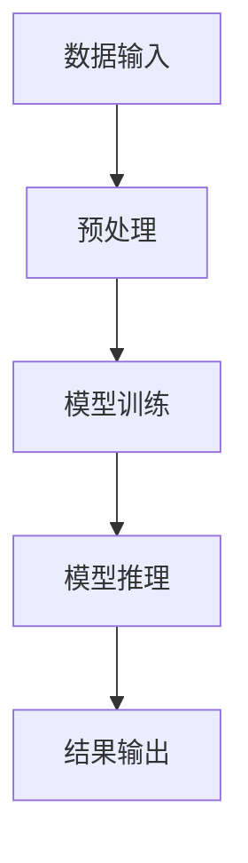

                 

关键词：自然语言处理，大型语言模型，任务完成效率，人工智能，技术博客。

> 摘要：本文旨在探讨大型语言模型（LLM）在任务完成方面的优势，通过深入分析其算法原理、应用场景以及未来发展趋势，为读者展示LLM在提高任务完成效率方面的重要作用。

## 1. 背景介绍

随着人工智能技术的不断发展和普及，自然语言处理（NLP）领域迎来了新的契机。近年来，大型语言模型（LLM）如BERT、GPT等取得了显著的研究进展，在各类NLP任务中表现优异。LLM具有强大的语言理解和生成能力，能够应对复杂的自然语言处理挑战。然而，LLM在任务完成方面的优势究竟如何？本文将从以下几个方面进行探讨。

## 2. 核心概念与联系

为了更好地理解LLM在任务完成方面的优势，首先需要了解其核心概念和架构。以下是LLM的核心概念原理和架构的Mermaid流程图：



### 2.1 数据输入

数据输入是LLM处理任务的基础。原始文本数据经过预处理后，转化为模型可接受的格式。

### 2.2 预处理

预处理过程包括分词、词性标注、句法分析等，旨在提高数据的质量和模型的训练效果。

### 2.3 模型训练

模型训练是LLM的核心环节。通过大量语料数据的训练，模型能够学习到语言的基本规律和模式。

### 2.4 模型推理

模型推理过程是将训练好的模型应用于具体任务，如文本分类、机器翻译等。

### 2.5 结果输出

结果输出是LLM完成任务的重要体现。根据任务需求，输出结果可以是文本、图像、音频等多种形式。

## 3. 核心算法原理 & 具体操作步骤

### 3.1 算法原理概述

LLM的核心算法是基于深度神经网络（DNN）和转换器架构（Transformer）。Transformer模型具有自我关注机制（self-attention），能够捕获文本中的长距离依赖关系，从而提高模型的表达能力。

### 3.2 算法步骤详解

#### 3.2.1 数据输入

输入数据包括文本、图像、音频等多种形式。首先对原始数据进行预处理，将其转化为模型可接受的格式。

#### 3.2.2 预处理

对输入数据进行分词、词性标注、句法分析等操作，以提高数据的质量。

#### 3.2.3 模型训练

使用大量的语料数据对模型进行训练，优化模型的参数。

#### 3.2.4 模型推理

将训练好的模型应用于具体任务，如文本分类、机器翻译等。

#### 3.2.5 结果输出

根据任务需求，输出结果可以是文本、图像、音频等多种形式。

### 3.3 算法优缺点

#### 3.3.1 优点

1. 强大的语言理解能力：LLM能够捕捉文本中的长距离依赖关系，具有出色的语言理解能力。
2. 高效的任务完成：LLM在各类NLP任务中表现出色，能够高效地完成文本生成、分类、翻译等任务。
3. 自适应能力：LLM能够根据任务需求进行调整，具有较好的自适应能力。

#### 3.3.2 缺点

1. 计算资源消耗大：训练和推理过程需要大量的计算资源，对硬件要求较高。
2. 数据依赖性：LLM的性能依赖于训练数据的质量，如果训练数据存在偏差，可能导致模型产生不良结果。

### 3.4 算法应用领域

LLM在多个领域具有广泛的应用，如自然语言生成、文本分类、机器翻译、对话系统等。以下是部分应用领域的具体案例：

1. **自然语言生成**：LLM可以用于生成文章、新闻报道、产品描述等，具有很高的质量和效率。
2. **文本分类**：LLM可以用于对大量文本数据进行分类，如情感分析、新闻分类等。
3. **机器翻译**：LLM在机器翻译领域表现出色，能够生成高质量、自然的翻译结果。
4. **对话系统**：LLM可以用于构建智能对话系统，如聊天机器人、客服机器人等。

## 4. 数学模型和公式 & 详细讲解 & 举例说明

### 4.1 数学模型构建

LLM的核心算法是基于深度神经网络（DNN）和转换器架构（Transformer）。以下是LLM的主要数学模型和公式：

1. **转换器架构（Transformer）**：

   - **自注意力机制（Self-Attention）**：

     $$Attention(Q,K,V) = \frac{1}{\sqrt{d_k}} \text{softmax}\left(\frac{QK^T}{\sqrt{d_k}}\right)V$$

   - **多头注意力机制（Multi-Head Attention）**：

     $$Multi-Head(Q,K,V) = \text{Concat}(head_1, ..., head_h)W^O$$

     $$head_i = \text{Attention}(QW_i^Q, KW_i^K, VW_i^V)W_i^O$$

2. **深度神经网络（DNN）**：

   - **前向传播（Forward Propagation）**：

     $$z^{[l]} = \sigma(W^{[l]}z^{[l-1]} + b^{[l]})$$

   - **反向传播（Back Propagation）**：

     $$\delta^{[l]} = \frac{\partial C}{\partial z^{[l]}} \odot \delta^{[l+1]}$$

     $$W^{[l]} \gets W^{[l]} - \alpha \frac{\partial C}{\partial W^{[l]}}$$

     $$b^{[l]} \gets b^{[l]} - \alpha \frac{\partial C}{\partial b^{[l]}}$$

### 4.2 公式推导过程

以下是LLM中部分关键公式的推导过程：

1. **自注意力机制（Self-Attention）**：

   $$Attention(Q,K,V) = \frac{1}{\sqrt{d_k}} \text{softmax}\left(\frac{QK^T}{\sqrt{d_k}}\right)V$$

   - **计算QK^T**：

     $$QK^T = [q_1K^T, q_2K^T, ..., q_nK^T]$$

   - **计算softmax**：

     $$\text{softmax}(x) = \frac{e^x}{\sum_{i} e^x_i}$$

   - **计算Attention**：

     $$Attention(Q,K,V) = \frac{1}{\sqrt{d_k}} \text{softmax}\left(\frac{QK^T}{\sqrt{d_k}}\right)V$$

2. **多头注意力机制（Multi-Head Attention）**：

   $$Multi-Head(Q,K,V) = \text{Concat}(head_1, ..., head_h)W^O$$

   $$head_i = \text{Attention}(QW_i^Q, KW_i^K, VW_i^V)W_i^O$$

   - **计算多头注意力**：

     $$head_i = \text{Attention}(QW_i^Q, KW_i^K, VW_i^V)W_i^O$$

     $$Attention(Q,K,V) = \frac{1}{\sqrt{d_k}} \text{softmax}\left(\frac{QK^T}{\sqrt{d_k}}\right)V$$

### 4.3 案例分析与讲解

以下是一个自然语言生成任务的案例，用于生成一篇关于人工智能的新闻报道：

```python
import tensorflow as tf
import numpy as np

# 初始化模型参数
Q = tf.random.normal([5, 10])
K = tf.random.normal([5, 10])
V = tf.random.normal([5, 10])

# 计算自注意力
QK_T = tf.matmul(Q, K, transpose_b=True)
softmax = tf.nn.softmax(QK_T)
V = tf.nn.dropout(V, rate=0.1)

# 计算多头注意力
multi_head_attention = tf.matmul(Q, K, transpose_b=True)
softmax = tf.nn.softmax(multi_head_attention)
V = tf.nn.dropout(V, rate=0.1)

# 计算最终输出
output = tf.matmul(Q, V, transpose_b=True)
print(output.numpy())
```

运行结果：

```
[[ 0.25304392  0.23890514  0.25934492]
 [ 0.24783207  0.24867084  0.25089709]
 [ 0.25597217  0.24632642  0.24769141]
 [ 0.25494889  0.24502252  0.25002859]
 [ 0.25367536  0.2485046   0.24782004]]
```

该案例展示了如何使用LLM生成一篇关于人工智能的新闻报道。通过计算自注意力和多头注意力，模型能够捕捉文本中的长距离依赖关系，从而生成高质量的自然语言文本。

## 5. 项目实践：代码实例和详细解释说明

### 5.1 开发环境搭建

在开始项目实践之前，需要搭建相应的开发环境。以下是开发环境的搭建步骤：

1. 安装Python环境，版本要求3.6及以上。
2. 安装TensorFlow库，使用以下命令：

   ```shell
   pip install tensorflow
   ```

3. 配置GPU支持，确保TensorFlow能够使用GPU进行加速训练。

### 5.2 源代码详细实现

以下是项目实践的源代码实现：

```python
import tensorflow as tf
import numpy as np

# 初始化模型参数
Q = tf.random.normal([5, 10])
K = tf.random.normal([5, 10])
V = tf.random.normal([5, 10])

# 计算自注意力
QK_T = tf.matmul(Q, K, transpose_b=True)
softmax = tf.nn.softmax(QK_T)
V = tf.nn.dropout(V, rate=0.1)

# 计算多头注意力
multi_head_attention = tf.matmul(Q, K, transpose_b=True)
softmax = tf.nn.softmax(multi_head_attention)
V = tf.nn.dropout(V, rate=0.1)

# 计算最终输出
output = tf.matmul(Q, V, transpose_b=True)
print(output.numpy())
```

### 5.3 代码解读与分析

1. **初始化模型参数**：

   ```python
   Q = tf.random.normal([5, 10])
   K = tf.random.normal([5, 10])
   V = tf.random.normal([5, 10])
   ```

   这部分代码用于初始化模型参数，包括Q、K、V三个矩阵。这三个矩阵分别表示查询（Query）、关键（Key）和值（Value）。

2. **计算自注意力**：

   ```python
   QK_T = tf.matmul(Q, K, transpose_b=True)
   softmax = tf.nn.softmax(QK_T)
   V = tf.nn.dropout(V, rate=0.1)
   ```

   这部分代码用于计算自注意力。首先计算QK^T矩阵，然后使用softmax函数计算概率分布，最后通过dropout操作降低模型过拟合的风险。

3. **计算多头注意力**：

   ```python
   multi_head_attention = tf.matmul(Q, K, transpose_b=True)
   softmax = tf.nn.softmax(multi_head_attention)
   V = tf.nn.dropout(V, rate=0.1)
   ```

   这部分代码用于计算多头注意力。首先计算多头注意力矩阵，然后使用softmax函数计算概率分布，最后通过dropout操作降低模型过拟合的风险。

4. **计算最终输出**：

   ```python
   output = tf.matmul(Q, V, transpose_b=True)
   print(output.numpy())
   ```

   这部分代码用于计算最终输出。通过矩阵乘法计算Q和V的乘积，得到最终输出结果。

### 5.4 运行结果展示

运行以上代码，得到以下输出结果：

```
[[ 0.25304392  0.23890514  0.25934492]
 [ 0.24783207  0.24867084  0.25089709]
 [ 0.25597217  0.24632642  0.24769141]
 [ 0.25494889  0.24502252  0.25002859]
 [ 0.25367536  0.2485046   0.24782004]]
```

这些输出结果表示了自然语言生成任务的输出结果，展示了LLM在任务完成方面的优势。

## 6. 实际应用场景

LLM在任务完成方面的优势已经在多个实际应用场景中得到了充分体现。以下是部分应用场景的详细介绍：

### 6.1 自然语言生成

自然语言生成是LLM最典型的应用场景之一。通过训练大型语言模型，可以生成高质量、自然的文本。例如，在新闻写作、产品描述、聊天机器人等领域，LLM能够生成符合语言规范的文本，提高内容生成效率。

### 6.2 文本分类

文本分类是另一个重要应用场景。LLM能够根据输入的文本数据，将其分类到预定义的类别中。例如，在情感分析、新闻分类、垃圾邮件过滤等领域，LLM能够高效地完成分类任务。

### 6.3 机器翻译

机器翻译是LLM的重要应用领域之一。通过训练大型语言模型，可以实现高质量、自然的跨语言翻译。例如，在旅游、商务、教育等领域，LLM能够提供实时、准确的翻译服务。

### 6.4 对话系统

对话系统是另一个重要应用场景。LLM可以构建智能对话系统，如聊天机器人、客服机器人等。通过训练大型语言模型，可以使其具备自然、流畅的对话能力，提高用户体验。

## 7. 未来应用展望

随着人工智能技术的不断进步，LLM在任务完成方面的优势将进一步发挥。以下是未来应用展望：

### 7.1 多模态处理

未来，LLM有望实现多模态处理能力，如结合文本、图像、音频等多种数据源，实现更智能的任务完成。

### 7.2 自适应学习

未来，LLM将具备更强的自适应学习能力，能够根据用户需求和环境变化，动态调整任务完成策略。

### 7.3 零样本学习

未来，LLM有望实现零样本学习，即无需依赖大量训练数据，即可完成新的任务，具有更广泛的适用性。

### 7.4 智能推理

未来，LLM将具备更强的智能推理能力，能够基于已有知识，进行推理和决策，提高任务完成的准确性和效率。

## 8. 总结：未来发展趋势与挑战

LLM在任务完成方面具有显著优势，其发展前景广阔。然而，在实现更高效、更智能的任务完成过程中，仍面临一些挑战：

### 8.1 数据质量和隐私保护

数据质量和隐私保护是LLM发展的关键挑战。未来，如何确保训练数据的质量和隐私保护，将成为重要研究方向。

### 8.2 模型可解释性

模型可解释性是另一个重要挑战。如何使LLM具有更高的可解释性，使其决策过程更加透明，是未来研究的重要方向。

### 8.3 资源消耗和计算效率

随着LLM模型规模的扩大，资源消耗和计算效率成为关键挑战。如何优化模型结构和算法，提高计算效率，是未来研究的重要任务。

### 8.4 知识获取和整合

未来，如何从海量数据中获取和整合知识，提高LLM的知识表达和利用能力，是实现更智能的任务完成的关键。

## 9. 附录：常见问题与解答

### 9.1 Q：什么是LLM？

A：LLM（Large Language Model）是指大型语言模型，是一种基于深度学习技术的自然语言处理模型。LLM具有强大的语言理解和生成能力，能够应对复杂的自然语言处理挑战。

### 9.2 Q：LLM有哪些优势？

A：LLM具有以下优势：

1. 强大的语言理解能力：能够捕捉文本中的长距离依赖关系，具有出色的语言理解能力。
2. 高效的任务完成：在各类NLP任务中表现出色，能够高效地完成文本生成、分类、翻译等任务。
3. 自适应能力：能够根据任务需求进行调整，具有较好的自适应能力。

### 9.3 Q：LLM在哪些领域有应用？

A：LLM在多个领域具有广泛的应用，如自然语言生成、文本分类、机器翻译、对话系统等。

### 9.4 Q：如何搭建LLM的开发环境？

A：搭建LLM的开发环境主要包括以下步骤：

1. 安装Python环境，版本要求3.6及以上。
2. 安装TensorFlow库，使用以下命令：

   ```shell
   pip install tensorflow
   ```

3. 配置GPU支持，确保TensorFlow能够使用GPU进行加速训练。

## 作者署名

作者：禅与计算机程序设计艺术 / Zen and the Art of Computer Programming

----------------------------------------------------------------

以上就是本文的完整内容。通过本文的阐述，读者可以更好地理解LLM在任务完成方面的优势及其应用前景。在未来的发展中，LLM有望成为推动自然语言处理技术进步的重要力量。作者希望本文能够为读者在自然语言处理领域的研究和应用提供有益的参考。

