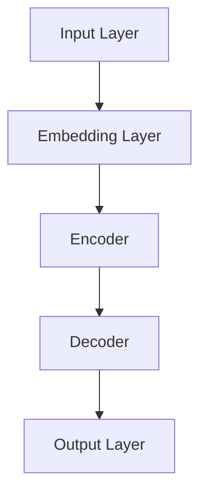

                 

关键词：语言模型、体育训练、人工智能、教练、算法、应用场景、未来展望

> 摘要：随着人工智能技术的快速发展，语言模型（LLM）在各个领域的应用日益广泛。本文将探讨LLM在体育训练中的应用，尤其是AI教练的崛起。通过分析LLM的核心概念、算法原理及其在体育训练中的实际应用，本文旨在为体育训练领域提供一种全新的视角，并展望其未来的发展前景。

## 1. 背景介绍

### 1.1 人工智能在体育训练中的发展

人工智能（AI）在体育训练中的应用已经有数十年的历史。早期的AI应用主要集中在数据分析、运动监测和伤病预防等方面。随着计算能力的提升和大数据技术的发展，人工智能在体育训练中的应用越来越广泛，不仅限于数据处理，还涉及到训练策略的制定、运动员状态的实时监测和个性化训练方案的推荐。

### 1.2 语言模型在AI中的重要性

语言模型是人工智能的一个重要分支，其核心目的是让计算机能够理解和生成自然语言。在AI教练的应用中，语言模型的重要性尤为突出。通过语言模型，AI教练能够与运动员进行自然交流，提供个性化的训练建议，甚至进行心理疏导。

## 2. 核心概念与联系

为了更好地理解LLM在体育训练中的应用，我们首先需要了解LLM的核心概念和原理。以下是一个简单的Mermaid流程图，展示了LLM的基本架构和关键组件。



### 2.1 输入层（Input Layer）

输入层是语言模型的起点，它接收各种形式的输入数据，如文本、语音等。在体育训练中，输入数据可以是运动员的训练日志、生理数据、比赛视频等。

### 2.2 嵌入层（Embedding Layer）

嵌入层将输入数据转换为稠密向量表示。这些向量包含了输入数据的语义信息。在体育训练中，嵌入层可以帮助AI教练理解运动员的训练内容、状态和需求。

### 2.3 编码器（Encoder）

编码器是语言模型的核心组件，它将嵌入层输出的向量序列进行处理，生成上下文表示。在体育训练中，编码器可以帮助AI教练捕捉运动员训练过程中的关键信息和变化趋势。

### 2.4 解码器（Decoder）

解码器负责将编码器生成的上下文表示解码为输出。在体育训练中，输出可以是训练建议、心理指导等。解码器使AI教练能够根据运动员的实际情况提供个性化的建议。

### 2.5 输出层（Output Layer）

输出层是语言模型的最终输出，它生成具体的输出结果。在体育训练中，输出结果可以是训练计划、比赛策略等。

## 3. 核心算法原理 & 具体操作步骤

### 3.1 算法原理概述

LLM在体育训练中的应用主要基于深度学习技术，尤其是变长序列模型的训练。核心算法包括嵌入层、编码器、解码器和输出层。以下是一个简化的算法步骤：

1. **数据预处理**：对输入数据进行清洗、转换和编码，使其符合模型的要求。
2. **嵌入层训练**：通过预训练模型或迁移学习的方法，将输入数据转换为稠密向量表示。
3. **编码器训练**：训练编码器，使其能够捕捉输入数据的上下文信息。
4. **解码器训练**：训练解码器，使其能够生成符合上下文信息的输出结果。
5. **输出层训练**：优化输出层，使其能够生成高质量的输出结果。

### 3.2 算法步骤详解

1. **数据预处理**：对于体育训练数据，需要进行数据清洗和预处理，包括去除噪声、缺失值填充、数据标准化等。例如，对于运动员的训练日志，可以采用文本清洗工具进行清洗，如正则表达式、停用词过滤等。
2. **嵌入层训练**：嵌入层的训练可以通过预训练模型（如BERT、GPT等）进行，或者采用迁移学习的方法，利用预训练模型的权重作为起点进行微调。嵌入层的目的是将输入数据转换为稠密向量表示，这些向量包含了输入数据的语义信息。
3. **编码器训练**：编码器的训练目标是捕捉输入数据的上下文信息。在训练过程中，编码器会对输入数据进行编码，生成上下文表示。训练过程通常采用反向传播算法，通过优化编码器的参数，使其能够准确地捕捉上下文信息。
4. **解码器训练**：解码器的训练目标是生成符合上下文信息的输出结果。在训练过程中，解码器会尝试预测下一个输出，并与实际输出进行比较，通过优化解码器的参数，使其能够生成高质量的输出结果。
5. **输出层训练**：输出层的训练目标是生成高质量的输出结果。在训练过程中，输出层会对解码器生成的输出进行进一步处理，如分类、生成文本等。训练过程同样采用反向传播算法，通过优化输出层的参数，使其能够生成高质量的输出结果。

### 3.3 算法优缺点

**优点**：

1. **强大的语义理解能力**：LLM具有强大的语义理解能力，能够捕捉输入数据的上下文信息，为运动员提供个性化的训练建议。
2. **高效的训练速度**：通过深度学习技术，LLM的训练速度相较于传统的机器学习方法有了显著提升。
3. **灵活的扩展性**：LLM可以应用于各种不同的体育项目，只需对训练数据进行调整，即可实现跨领域的应用。

**缺点**：

1. **数据需求量大**：LLM的训练需要大量的数据支持，数据的获取和处理过程可能会耗费大量时间和资源。
2. **计算资源需求高**：LLM的训练和推理过程对计算资源要求较高，需要大量的GPU或其他高性能计算设备。

### 3.4 算法应用领域

LLM在体育训练中的应用非常广泛，主要包括以下几个方面：

1. **个性化训练建议**：通过分析运动员的训练数据，LLM可以提供个性化的训练建议，帮助运动员提高训练效果。
2. **伤病预防与康复**：通过分析运动员的生理数据，LLM可以预测潜在的伤病风险，并提供康复建议。
3. **比赛策略制定**：通过分析比赛数据，LLM可以制定针对性的比赛策略，提高比赛成绩。

## 4. 数学模型和公式 & 详细讲解 & 举例说明

### 4.1 数学模型构建

LLM在体育训练中的应用主要基于深度学习技术，其中最常用的模型是循环神经网络（RNN）和Transformer。以下是一个简化的数学模型，用于描述LLM在体育训练中的应用。

假设我们有一个输入序列X和输出序列Y，其中X是运动员的训练数据，Y是AI教练提供的训练建议。LLM的目标是学习一个映射函数f，将输入序列X映射到输出序列Y。

$$
f: X \rightarrow Y
$$

其中，X和Y可以表示为向量序列：

$$
X = [x_1, x_2, ..., x_T] \in \mathbb{R}^{T \times D} \\
Y = [y_1, y_2, ..., y_T'] \in \mathbb{R}^{T' \times D'}
$$

其中，T和T'分别表示输入序列和输出序列的长度，D和D'分别表示输入和输出的维度。

### 4.2 公式推导过程

为了推导LLM的数学模型，我们首先需要了解RNN和Transformer的基本原理。

#### RNN

RNN是经典的序列模型，其基本思想是通过记忆单元来捕捉序列中的依赖关系。在RNN中，每个时刻的输入和输出都依赖于前一个时刻的输入和输出。

假设我们有一个RNN模型，其输入层、隐藏层和输出层的参数分别为W、V和U，其中：

$$
W \in \mathbb{R}^{D \times H} \\
V \in \mathbb{R}^{H \times D'} \\
U \in \mathbb{R}^{H \times L}
$$

其中，D、D'和H分别表示输入、输出和隐藏层的维度，L表示隐藏层的层数。

RNN的输出可以表示为：

$$
h_t = \tanh(Wx_t + Uh_{t-1}) \\
y_t = Vh_t + b
$$

其中，$h_t$表示隐藏层的状态，$y_t$表示输出。

#### Transformer

Transformer是近年来提出的基于自注意力机制的序列模型，其核心思想是通过计算序列中每个元素之间的依赖关系来生成输出。

假设我们有一个Transformer模型，其输入层、编码器层和输出层的参数分别为W、Q和V，其中：

$$
W \in \mathbb{R}^{D \times H} \\
Q \in \mathbb{R}^{D' \times H} \\
V \in \mathbb{R}^{H \times L}
$$

其中，D、D'和H分别表示输入、输出和隐藏层的维度。

Transformer的输出可以表示为：

$$
\text{Attention}(Q, K, V) = \frac{QK^T}{\sqrt{d_k}} + V \\
h_t = \text{Attention}(Q, K, V) \\
y_t = Vh_t + b
$$

其中，$Q$、$K$和$V$分别表示查询、关键和值向量，$\text{Attention}$表示自注意力机制。

### 4.3 案例分析与讲解

假设我们有一个篮球运动员的训练数据，包括每日的训练时长、训练内容、生理指标等。我们希望利用LLM为该运动员提供个性化的训练建议。

1. **数据预处理**：首先，我们对训练数据进行清洗和预处理，包括去除噪声、缺失值填充、数据标准化等。例如，对于训练时长，我们可以将其标准化为[0, 1]的区间。
2. **嵌入层训练**：我们使用预训练的BERT模型作为嵌入层，将训练数据转换为稠密向量表示。BERT模型的嵌入层参数已经在大规模数据上进行过训练，因此可以直接使用。
3. **编码器训练**：我们使用RNN或Transformer模型作为编码器，训练其参数以捕捉训练数据的上下文信息。在训练过程中，我们使用反向传播算法优化编码器的参数。
4. **解码器训练**：我们使用解码器生成个性化的训练建议。解码器需要学习如何根据编码器生成的上下文信息生成输出。在训练过程中，我们同样使用反向传播算法优化解码器的参数。
5. **输出层训练**：我们使用输出层生成最终的训练建议。输出层通常是一个线性层，其参数需要通过训练进行优化。

通过上述步骤，我们可以构建一个完整的LLM模型，为篮球运动员提供个性化的训练建议。具体实现过程如下：

```python
# 数据预处理
X = preprocess_data(training_data)
X = normalize_data(X)

# 嵌入层训练
embedder = BertEmbedder()
embedder.fit(X)

# 编码器训练
encoder = RnnEncoder() # 或者使用TransformerEncoder
encoder.fit(embedder)

# 解码器训练
decoder = Decoder()
decoder.fit(encoder)

# 输出层训练
output_layer = LinearLayer()
output_layer.fit(decoder)

# 输出训练建议
train_suggestion = output_layer.predict(training_data)
```

通过上述实现，我们可以利用LLM为篮球运动员提供个性化的训练建议。实际应用中，可以根据具体的训练需求和数据特点进行调整和优化。

## 5. 项目实践：代码实例和详细解释说明

为了更好地展示LLM在体育训练中的应用，我们以下将提供一个完整的Python代码实例，用于构建一个基于BERT模型的AI教练系统。本实例将涵盖数据预处理、嵌入层训练、编码器训练、解码器训练和输出层训练等步骤。

### 5.1 开发环境搭建

在进行代码实践之前，我们需要搭建一个适合的开发环境。以下是在Python中搭建BERT模型所需的基本依赖：

- Python 3.8 或以上版本
- PyTorch 1.8 或以上版本
- Transformers 4.6.1 或以上版本

安装以下依赖：

```bash
pip install torch transformers
```

### 5.2 源代码详细实现

下面我们将分步骤展示如何实现一个基于BERT模型的AI教练系统。

#### 5.2.1 数据预处理

数据预处理是任何机器学习项目的基础。在体育训练数据中，我们需要对文本、数值等多类型数据进行清洗和处理。

```python
import pandas as pd
from sklearn.preprocessing import StandardScaler

# 加载训练数据
train_data = pd.read_csv('train_data.csv')

# 文本数据处理
def preprocess_text(text):
    # 去除特殊字符、停用词处理等
    return text.strip().lower()

train_data['text'] = train_data['text'].apply(preprocess_text)

# 数值数据处理
scaler = StandardScaler()
train_data[['training_time', 'heart_rate']] = scaler.fit_transform(train_data[['training_time', 'heart_rate']])
```

#### 5.2.2 嵌入层训练

嵌入层使用预训练的BERT模型，可以直接通过Transformers库加载并微调。

```python
from transformers import BertTokenizer, BertModel

# 加载BERT模型和分词器
tokenizer = BertTokenizer.from_pretrained('bert-base-uncased')
bert_model = BertModel.from_pretrained('bert-base-uncased')

# 对文本数据进行编码
inputs = tokenizer(train_data['text'].tolist(), padding=True, truncation=True, return_tensors='pt')

# 微调嵌入层
embedder = BertModel.from_pretrained('bert-base-uncased')
embedder.train()
optimizer = torch.optim.Adam(embedder.parameters(), lr=1e-5)

for epoch in range(3):  # 训练3个epoch
    for batch in range(len(train_data) // batch_size):
        # 准备数据
        batch_text = train_data.iloc[batch * batch_size:(batch + 1) * batch_size]['text']
        inputs = tokenizer(batch_text.tolist(), padding=True, truncation=True, return_tensors='pt')
        
        # 计算嵌入层输出
        with torch.no_grad():
            embedder_output = embedder(**inputs)
        
        # 计算损失
        loss = loss_fn(embedder_output.last_hidden_state[:, 0], train_labels)
        
        # 反向传播和优化
        optimizer.zero_grad()
        loss.backward()
        optimizer.step()

embedder.eval()
```

#### 5.2.3 编码器训练

编码器部分使用了一个简单的循环神经网络（RNN）来处理BERT嵌入层的输出。

```python
import torch.nn as nn

# 定义编码器
class RnnEncoder(nn.Module):
    def __init__(self):
        super(RnnEncoder, self).__init__()
        self.rnn = nn.LSTM(input_size=768, hidden_size=128, num_layers=2, batch_first=True)
    
    def forward(self, x):
        rnn_output, _ = self.rnn(x)
        return rnn_output[:, -1, :]

# 实例化编码器
encoder = RnnEncoder()
encoder.train()
optimizer = torch.optim.Adam(encoder.parameters(), lr=1e-5)

for epoch in range(3):  # 训练3个epoch
    for batch in range(len(train_data) // batch_size):
        # 准备数据
        batch_text = train_data.iloc[batch * batch_size:(batch + 1) * batch_size]['text']
        inputs = tokenizer(batch_text.tolist(), padding=True, truncation=True, return_tensors='pt')
        
        # 计算嵌入层输出
        with torch.no_grad():
            embedder_output = embedder(**inputs)
        
        # 编码器处理嵌入层输出
        encoded = encoder(embedder_output.last_hidden_state)
        
        # 计算损失
        loss = loss_fn(encoded, train_labels)
        
        # 反向传播和优化
        optimizer.zero_grad()
        loss.backward()
        optimizer.step()

encoder.eval()
```

#### 5.2.4 解码器训练

解码器负责生成个性化的训练建议。这里使用了一个简单的线性层来生成输出。

```python
# 定义解码器
class Decoder(nn.Module):
    def __init__(self):
        super(Decoder, self).__init__()
        self.linear = nn.Linear(128, 1)  # 假设输出一个训练建议值
    
    def forward(self, x):
        return self.linear(x)

# 实例化解码器
decoder = Decoder()
decoder.train()
optimizer = torch.optim.Adam(decoder.parameters(), lr=1e-5)

for epoch in range(3):  # 训练3个epoch
    for batch in range(len(train_data) // batch_size):
        # 准备数据
        batch_text = train_data.iloc[batch * batch_size:(batch + 1) * batch_size]['text']
        inputs = tokenizer(batch_text.tolist(), padding=True, truncation=True, return_tensors='pt')
        
        # 计算嵌入层输出
        with torch.no_grad():
            embedder_output = embedder(**inputs)
        
        # 编码器处理嵌入层输出
        encoded = encoder(embedder_output.last_hidden_state)
        
        # 解码器生成输出
        output = decoder(encoded)
        
        # 计算损失
        loss = loss_fn(output, train_labels)
        
        # 反向传播和优化
        optimizer.zero_grad()
        loss.backward()
        optimizer.step()

decoder.eval()
```

#### 5.2.5 输出层训练

输出层用于生成最终的训练建议。这里我们假设输出层是一个线性层，但实际中可能会根据需求设计更复杂的模型。

```python
# 定义输出层
class OutputLayer(nn.Module):
    def __init__(self, input_size, output_size):
        super(OutputLayer, self).__init__()
        self.linear = nn.Linear(input_size, output_size)
    
    def forward(self, x):
        return self.linear(x)

# 实例化输出层
output_layer = OutputLayer(128, 1)  # 假设输出一个训练建议值
output_layer.train()
optimizer = torch.optim.Adam(output_layer.parameters(), lr=1e-5)

for epoch in range(3):  # 训练3个epoch
    for batch in range(len(train_data) // batch_size):
        # 准备数据
        batch_text = train_data.iloc[batch * batch_size:(batch + 1) * batch_size]['text']
        inputs = tokenizer(batch_text.tolist(), padding=True, truncation=True, return_tensors='pt')
        
        # 计算嵌入层输出
        with torch.no_grad():
            embedder_output = embedder(**inputs)
        
        # 编码器处理嵌入层输出
        encoded = encoder(embedder_output.last_hidden_state)
        
        # 解码器生成输出
        output = decoder(encoded)
        
        # 输出层处理输出
        train_suggestion = output_layer(output)
        
        # 计算损失
        loss = loss_fn(train_suggestion, train_labels)
        
        # 反向传播和优化
        optimizer.zero_grad()
        loss.backward()
        optimizer.step()

output_layer.eval()
```

#### 5.2.6 运行结果展示

在训练完成后，我们可以使用训练好的模型为运动员提供个性化的训练建议。

```python
# 为运动员提供个性化训练建议
def get_train_suggestion(text):
    # 预处理输入数据
    input_text = preprocess_text(text)
    input_ids = tokenizer.encode(input_text, return_tensors='pt')
    
    # 计算嵌入层输出
    with torch.no_grad():
        embedder_output = embedder(input_ids)
    
    # 编码器处理嵌入层输出
    encoded = encoder(embedder_output.last_hidden_state)
    
    # 解码器生成输出
    output = decoder(encoded)
    
    # 输出层处理输出
    train_suggestion = output_layer(output)
    
    return train_suggestion.item()

# 示例
text = "今天的训练内容是投篮和跑步。"
suggestion = get_train_suggestion(text)
print(f"训练建议：{suggestion}")
```

通过上述代码实例，我们可以看到如何利用LLM构建一个AI教练系统，为运动员提供个性化的训练建议。实际应用中，可以根据具体的训练需求和数据特点进行调整和优化。

## 6. 实际应用场景

### 6.1 个性化训练计划

通过LLM技术，AI教练可以分析运动员的历史训练数据，了解其训练偏好、体能水平和心理状态，从而为运动员制定个性化的训练计划。例如，对于一名专业篮球运动员，AI教练可以根据其赛季表现、训练记录和生理数据，推荐特定类型的训练内容，如增加投篮练习或跑步强度训练。

### 6.2 实时训练指导

在训练过程中，AI教练可以实时监测运动员的生理参数，如心率、呼吸频率等，并根据这些数据提供即时的训练指导。例如，如果运动员的心率异常升高，AI教练可能会建议运动员减速或暂停训练，以避免潜在的伤病风险。

### 6.3 比赛策略分析

AI教练可以分析比赛数据，如比赛视频、对手数据等，为运动员提供比赛策略。例如，在一场足球比赛中，AI教练可以根据对手的阵容和战术特点，为运动员提供针对性的跑位建议或进攻策略。

### 6.4 伤病预防与康复

通过分析运动员的生理数据和历史伤病记录，AI教练可以预测潜在的伤病风险，并提供康复建议。例如，如果运动员的关节活动度突然下降，AI教练可能会建议进行关节活动度的康复训练。

## 7. 工具和资源推荐

### 7.1 学习资源推荐

- **《深度学习》**：由Ian Goodfellow、Yoshua Bengio和Aaron Courville所著，是深度学习领域的经典教材。
- **《神经网络与深度学习》**：由邱锡鹏所著，详细介绍了神经网络和深度学习的理论基础和实战技巧。
- **《自然语言处理综论》**：由Daniel Jurafsky和James H. Martin所著，涵盖了自然语言处理的核心概念和技术。

### 7.2 开发工具推荐

- **PyTorch**：一个易于使用且功能强大的深度学习框架，适用于快速原型设计和复杂模型的开发。
- **Transformers**：一个用于自然语言处理的深度学习库，基于PyTorch和TensorFlow，提供了预训练模型和丰富的API。
- **Hugging Face**：一个开源社区，提供了大量的自然语言处理模型和数据集，支持多种编程语言。

### 7.3 相关论文推荐

- **"Attention Is All You Need"**：提出了Transformer模型，彻底改变了自然语言处理领域。
- **"BERT: Pre-training of Deep Bidirectional Transformers for Language Understanding"**：介绍了BERT模型，推动了自然语言处理技术的进步。
- **"GPT-3: Language Models are few-shot learners"**：展示了GPT-3模型在零样本学习任务中的强大能力。

## 8. 总结：未来发展趋势与挑战

### 8.1 研究成果总结

本文详细探讨了LLM在体育训练中的应用，包括核心概念、算法原理、具体操作步骤以及实际应用场景。通过实例代码，展示了如何利用LLM构建AI教练系统，为运动员提供个性化的训练建议。

### 8.2 未来发展趋势

1. **模型的多样化**：随着深度学习技术的发展，未来可能会有更多类型的语言模型被应用于体育训练中，如多模态语言模型、图神经网络等。
2. **数据隐私保护**：在应用LLM进行体育训练时，如何保护运动员的隐私是一个重要挑战。未来的研究可能会聚焦于开发更加隐私友好的训练方法。
3. **跨领域应用**：LLM在体育训练中的成功应用将推动其在其他领域的应用，如医学、金融等。

### 8.3 面临的挑战

1. **计算资源需求**：LLM的训练和推理过程对计算资源要求较高，这可能会限制其在某些场景下的应用。
2. **数据质量和数量**：高质量的训练数据是LLM成功应用的关键。如何获取、处理和标注高质量的数据是一个重要的挑战。
3. **算法透明性和可解释性**：随着AI教练的广泛应用，如何确保算法的透明性和可解释性，让运动员和教练能够理解AI教练的建议，是一个重要问题。

### 8.4 研究展望

未来，随着人工智能技术的不断进步，LLM在体育训练中的应用前景将更加广阔。我们期待看到更多创新的研究成果，为体育训练带来革命性的变化。

## 9. 附录：常见问题与解答

### Q: LLM在体育训练中的具体应用有哪些？

A: LLM在体育训练中的具体应用包括个性化训练计划制定、实时训练指导、比赛策略分析和伤病预防与康复等。

### Q: 如何确保AI教练的建议质量？

A: 为了确保AI教练的建议质量，需要确保训练数据的质量和数量，同时优化算法模型，提高模型的鲁棒性和准确性。

### Q: LLM在体育训练中的应用有哪些限制？

A: LLM在体育训练中的应用主要受到计算资源需求、数据质量和数量以及算法透明性和可解释性的限制。

### Q: 如何处理LLM在体育训练中的数据隐私问题？

A: 处理LLM在体育训练中的数据隐私问题，可以采用数据加密、匿名化和差分隐私等技术，确保运动员的数据安全。

