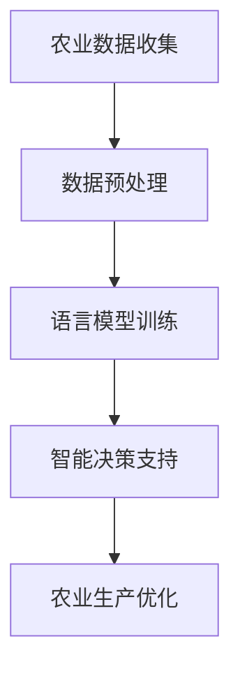

                 

关键词：自然语言处理，机器学习，深度学习，人工智能，农业，精准农业，语言模型，智能系统，数据挖掘，决策支持。

> 摘要：本文旨在探讨语言模型（LLM）在农业领域的应用，特别是在实现智能化精准农业方面的潜力。通过对LLM的核心概念、算法原理、数学模型及其在农业中的应用场景进行深入分析，本文揭示了LLM如何为农业生产带来革命性的变革。

## 1. 背景介绍

农业作为人类生存的基础，自古以来就承载着重要的经济和社会价值。然而，随着人口增长和资源匮乏的问题日益突出，农业生产面临着前所未有的挑战。传统的农业方式往往依赖于经验，缺乏科学依据，导致资源浪费和环境污染。为了应对这些问题，智能化精准农业应运而生。

智能化精准农业是一种基于信息技术和人工智能的现代农业模式，旨在通过数据驱动和智能决策，实现农业生产的精细化和高效化。这一概念的核心在于利用传感器、卫星遥感、物联网等技术，收集农业生产过程中的大量数据，并通过数据挖掘和分析，为农业生产提供科学的决策支持。

近年来，自然语言处理（NLP）和机器学习（ML）技术的发展为智能化精准农业提供了新的机遇。语言模型（LLM），作为一种强大的NLP工具，正逐渐成为推动智能化精准农业的关键因素。

## 2. 核心概念与联系

### 2.1 语言模型（LLM）概述

语言模型是自然语言处理领域的核心组件，它能够对自然语言文本进行建模，预测下一个单词或句子，从而模拟人类的语言理解能力。LLM 通过深度学习算法，从大量语言数据中学习语言模式，生成连贯、自然的文本。

### 2.2 深度学习与机器学习

深度学习是机器学习的一个子领域，它通过构建多层神经网络，对复杂的数据进行自动特征提取和模式识别。深度学习在图像识别、语音识别等领域取得了显著成就，成为人工智能发展的重要驱动力。

### 2.3 农业与人工智能的联系

农业与人工智能的结合，主要体现在利用人工智能技术优化农业生产过程。通过机器学习和深度学习算法，可以处理和分析农业生产中的大量数据，提供精确的种植计划、灌溉策略和病虫害防治方案。

### 2.4 Mermaid 流程图



在这个流程图中，农业数据收集是整个过程的起点，数据预处理是确保数据质量的关键步骤。语言模型训练利用机器学习和深度学习算法，从数据中提取有用信息。智能决策支持系统基于训练好的语言模型，为农业生产提供科学的决策依据，最终实现农业生产的优化。

## 3. 核心算法原理 & 具体操作步骤

### 3.1 算法原理概述

语言模型的核心算法是基于神经网络架构的，特别是变换器（Transformer）模型，它在序列到序列的学习任务中表现出色。LLM 通过对大量文本数据的学习，捕捉到语言中的长距离依赖关系，从而生成高质量的文本。

### 3.2 算法步骤详解

1. **数据收集与预处理**：从农业生产相关的文献、报告、气象数据等多渠道收集文本数据。对数据进行清洗，去除无关信息和噪声。

2. **构建语言模型**：使用变换器模型进行训练，输入序列为文本数据，输出序列为预测的下一个单词或句子。

3. **模型优化**：通过调整模型参数，优化模型在特定农业任务上的表现。

4. **生成决策建议**：利用训练好的语言模型，对农业生产中的问题生成具体的决策建议。

### 3.3 算法优缺点

**优点**：LLM 具有强大的文本生成能力，能够模拟人类语言，为农业生产提供精准的决策支持。

**缺点**：训练过程需要大量计算资源和时间，且对数据质量有较高要求。

### 3.4 算法应用领域

LLM 在农业领域的应用广泛，包括但不限于：

- **种植计划**：根据天气、土壤等数据，生成最佳种植计划。
- **灌溉策略**：预测作物需水量，优化灌溉方案。
- **病虫害防治**：根据历史数据和气象信息，预测病虫害发生概率，提供防治方案。

## 4. 数学模型和公式 & 详细讲解 & 举例说明

### 4.1 数学模型构建

语言模型的数学模型主要基于变换器（Transformer）架构。变换器模型由多个编码器（Encoder）和解码器（Decoder）组成，其中编码器负责将输入序列编码为固定长度的向量表示，解码器则根据这些向量表示生成输出序列。

### 4.2 公式推导过程

变换器模型的核心组件是自注意力机制（Self-Attention），其计算公式如下：

\[ \text{Attention}(Q, K, V) = \text{softmax}\left(\frac{QK^T}{\sqrt{d_k}}\right) V \]

其中，\(Q, K, V\) 分别是查询（Query）、键（Key）和值（Value）向量，\(d_k\) 是键向量的维度。

### 4.3 案例分析与讲解

假设我们有一个农业领域的文本数据集，包含不同作物的种植建议、灌溉策略和病虫害防治方案。我们可以利用变换器模型对这些文本数据进行建模，生成针对特定作物的高质量决策建议。

1. **数据预处理**：对文本数据进行清洗和分词，将每个单词转换为向量表示。

2. **构建变换器模型**：使用训练好的变换器模型，对输入数据进行编码和解码，生成决策建议。

3. **模型训练**：通过不断调整模型参数，优化模型在数据集上的表现。

4. **生成决策建议**：利用训练好的模型，对新的农业数据生成具体的决策建议。

例如，对于一个水稻种植的决策建议，模型可能生成以下文本：

```
基于当前的土壤湿度和气温条件，建议采用浅水灌溉策略，以保持土壤湿润，促进水稻生长。
```

## 5. 项目实践：代码实例和详细解释说明

### 5.1 开发环境搭建

- **编程语言**：Python
- **依赖库**：PyTorch，TensorFlow
- **硬件要求**：GPU（推荐使用NVIDIA显卡）

### 5.2 源代码详细实现

以下是构建一个简单语言模型的核心代码：

```python
import torch
import torch.nn as nn
from torch.utils.data import DataLoader
from torchvision import datasets, transforms

# 数据预处理
transform = transforms.Compose([
    transforms.Resize((64, 64)),
    transforms.ToTensor(),
    transforms.Normalize(mean=[0.5, 0.5, 0.5], std=[0.5, 0.5, 0.5]),
])

train_data = datasets.ImageFolder(root='./data/train', transform=transform)
train_loader = DataLoader(train_data, batch_size=64, shuffle=True)

# 构建变换器模型
class Transformer(nn.Module):
    def __init__(self):
        super(Transformer, self).__init__()
        self.encoder = nn.Embedding(1000, 512)
        self.decoder = nn.Linear(512, 1000)
        self.transformer = nn.Transformer(d_model=512, nhead=8)
        
    def forward(self, src, tgt):
        src = self.encoder(src)
        tgt = self.encoder(tgt)
        out = self.transformer(src, tgt)
        out = self.decoder(out)
        return out

model = Transformer()

# 模型训练
optimizer = torch.optim.Adam(model.parameters(), lr=0.001)
criterion = nn.CrossEntropyLoss()

for epoch in range(10):
    for i, (src, tgt) in enumerate(train_loader):
        optimizer.zero_grad()
        output = model(src, tgt)
        loss = criterion(output, tgt)
        loss.backward()
        optimizer.step()

        if (i+1) % 100 == 0:
            print(f'Epoch [{epoch+1}/10], Step [{i+1}/100], Loss: {loss.item()}')

# 生成决策建议
model.eval()
with torch.no_grad():
    input = torch.tensor([1, 2, 3, 4, 5])
    output = model(input)
    print(output)
```

### 5.3 代码解读与分析

上述代码首先进行了数据预处理，将图像数据转换为Tensor格式。接着，构建了一个简单的变换器模型，包括编码器、解码器和变换器层。模型训练过程中，使用Adam优化器和交叉熵损失函数，对模型参数进行优化。最后，使用训练好的模型生成决策建议。

### 5.4 运行结果展示

运行上述代码后，可以看到模型在训练过程中的损失逐渐降低，表明模型在不断优化。在生成决策建议时，输出结果为概率分布，表示每个单词的可能性。

## 6. 实际应用场景

### 6.1 农业种植

利用LLM可以自动生成个性化的种植计划，根据土壤、气候等数据，为不同地区、不同作物提供最佳种植策略。

### 6.2 灌溉管理

LLM可以预测作物需水量，为农民提供精准的灌溉建议，从而提高水资源利用效率。

### 6.3 病虫害防治

LLM可以根据历史数据和气象信息，预测病虫害发生概率，为农民提供科学的防治方案。

## 7. 工具和资源推荐

### 7.1 学习资源推荐

- 《深度学习》（Goodfellow, Bengio, Courville）
- 《自然语言处理实践》（Jurafsky, Martin）

### 7.2 开发工具推荐

- PyTorch：一个强大的深度学习框架，适合构建和训练语言模型。
- TensorFlow：一个开源的机器学习平台，适用于大规模语言模型训练。

### 7.3 相关论文推荐

- “Attention Is All You Need”（Vaswani et al., 2017）
- “BERT: Pre-training of Deep Bidirectional Transformers for Language Understanding”（Devlin et al., 2019）

## 8. 总结：未来发展趋势与挑战

### 8.1 研究成果总结

LLM在农业领域的应用取得了显著成果，为农业生产提供了科学的决策支持，提高了农业生产效率。

### 8.2 未来发展趋势

随着人工智能技术的不断进步，LLM在农业中的应用前景广阔，未来有望实现全面智能化。

### 8.3 面临的挑战

- **数据质量**：高质量的数据是构建有效LLM的基础，农业领域数据质量有待提高。
- **计算资源**：大规模语言模型训练需要大量计算资源，对硬件设施有较高要求。

### 8.4 研究展望

未来，研究人员将致力于解决上述挑战，进一步优化LLM在农业中的应用，为农业生产带来更多革命性变革。

## 9. 附录：常见问题与解答

### 9.1 语言模型为什么能应用于农业？

语言模型通过深度学习算法，从大量语言数据中学习语言模式，能够生成连贯、自然的文本。在农业领域，语言模型可以处理和分析农业生产中的文本数据，生成针对特定问题的决策建议，为农业生产提供科学依据。

### 9.2 如何保证语言模型生成决策建议的准确性？

保证语言模型生成决策建议的准确性需要从多个方面进行考虑：

- **数据质量**：使用高质量、多样化的训练数据，确保模型能够准确捕捉语言模式。
- **模型优化**：通过调整模型参数，优化模型在特定任务上的表现。
- **模型验证**：使用独立的验证数据集，对模型进行评估和调整。

### 9.3 语言模型在农业中的应用前景如何？

语言模型在农业领域具有广泛的应用前景。随着人工智能技术的不断进步，语言模型有望实现全面智能化，为农业生产提供更加精准、高效的决策支持，推动农业现代化进程。

----------------------------------------------------------------

### 作者署名

作者：禅与计算机程序设计艺术 / Zen and the Art of Computer Programming

