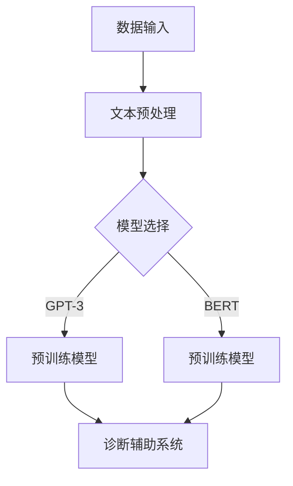

                 

关键词：大型语言模型，医疗诊断，临床决策，人工智能，深度学习，自然语言处理，数据隐私

> 摘要：本文探讨了大型语言模型（LLM）在医疗诊断中的应用，重点关注AI辅助临床决策的潜力与挑战。通过对LLM的工作原理、医疗数据的预处理、模型训练、诊断辅助系统的架构以及实际案例的详细分析，本文揭示了AI技术在提高诊断准确率、优化治疗方案和减轻医疗人员工作负担方面的作用。文章还讨论了未来LLM在医疗领域的应用前景以及面临的伦理和技术挑战。

## 1. 背景介绍

医疗诊断是医学领域的关键环节，准确的诊断对于患者的治疗和预后至关重要。然而，传统的医疗诊断过程往往依赖医生的经验和知识，这种依赖性不仅增加了诊断的错误率，还限制了医生的工作效率。随着人工智能技术的发展，特别是深度学习和自然语言处理（NLP）技术的进步，AI辅助医疗诊断已经成为一个备受关注的研究方向。

近年来，大型语言模型（LLM）如GPT-3、BERT和T5等，在处理和理解自然语言方面取得了显著成果。这些模型具有强大的文本生成、语义理解和知识整合能力，使其在医疗文本分析和诊断辅助中具有巨大的应用潜力。本文旨在探讨LLM在医疗诊断中的应用，分析其优势、挑战和未来发展方向。

## 2. 核心概念与联系

### 2.1. 大型语言模型（LLM）

大型语言模型（LLM）是一种基于深度学习的语言模型，能够对自然语言文本进行有效的理解和生成。LLM的核心是神经网络架构，尤其是变换器（Transformer）架构，如BERT、GPT-3和T5等。这些模型通过大量的文本数据进行预训练，从而学习到语言的语法规则、语义关系和上下文信息。

### 2.2. 医疗文本分析

医疗文本分析是利用自然语言处理技术对医疗文档进行自动化处理的过程，包括医学文本的解析、语义理解、信息提取和知识表示等。医疗文本分析的关键在于理解医疗术语、临床笔记和医学图谱等复杂的医学语言。

### 2.3. 临床决策支持系统

临床决策支持系统（CDSS）是一种利用人工智能技术辅助医生进行临床决策的工具。CDSS通过分析患者的病史、实验室检查结果和医学文献等数据，提供诊断建议、治疗方案和预后预测，从而提高诊断的准确性和效率。

### 2.4. Mermaid流程图



## 3. 核心算法原理 & 具体操作步骤

### 3.1. 算法原理概述

LLM在医疗诊断中的应用主要基于以下几个步骤：

1. **数据收集和预处理**：收集大量高质量的医疗文本数据，如病历、临床笔记和医学文献等，进行数据清洗、去噪和格式化。
2. **模型选择和预训练**：选择合适的LLM模型，如GPT-3或BERT，通过预训练使其具备处理医疗文本的能力。
3. **诊断辅助系统构建**：利用预训练的LLM模型，构建一个能够自动分析医疗文本、提供诊断建议的辅助系统。
4. **系统训练和优化**：通过实时数据和用户反馈，对诊断辅助系统进行训练和优化，提高其准确性和鲁棒性。

### 3.2. 算法步骤详解

#### 3.2.1. 数据收集和预处理

数据收集和预处理是LLM应用的基础。首先，需要从医院、医学数据库和文献库中收集大量医疗文本数据。然后，对这些数据进行清洗，去除无关信息，如HTML标签、停用词和噪声文本。最后，对数据格式进行标准化，以便于模型处理。

#### 3.2.2. 模型选择和预训练

选择合适的LLM模型是关键。GPT-3和BERT是两种常用的模型。GPT-3具有更强的文本生成能力，而BERT则更擅长语义理解。根据具体需求，可以选择其中一个或两个模型进行预训练。预训练过程通常包括两个阶段：第一阶段是大规模无监督预训练，第二阶段是针对医疗领域的有监督微调。

#### 3.2.3. 诊断辅助系统构建

基于预训练的LLM模型，可以构建一个诊断辅助系统。该系统包括文本输入模块、模型推理模块和结果输出模块。文本输入模块负责接收患者的病历、临床笔记等医疗文本数据。模型推理模块利用LLM模型对文本进行分析，提取关键信息，生成诊断建议。结果输出模块将诊断建议以可读的形式呈现给医生。

#### 3.2.4. 系统训练和优化

系统训练和优化是提高诊断辅助系统性能的关键。通过实时数据和用户反馈，可以不断调整模型参数，优化诊断算法。此外，还可以引入迁移学习技术，将其他领域的LLM模型应用于医疗诊断，提高系统的泛化能力。

### 3.3. 算法优缺点

#### 优点：

1. **强大的文本生成能力**：LLM能够生成高质量的文本，提供详细的诊断建议。
2. **高效的语义理解**：LLM能够理解医疗文本的语义，提取关键信息，提高诊断准确率。
3. **灵活的模型定制**：LLM支持多种模型架构，可以根据具体需求进行定制。

#### 缺点：

1. **数据依赖性**：LLM的性能高度依赖数据质量，数据不足或质量低下可能导致诊断错误。
2. **计算资源消耗**：LLM模型庞大，训练和推理过程需要大量计算资源。
3. **伦理和隐私问题**：医疗数据的隐私保护和伦理问题需要谨慎处理。

### 3.4. 算法应用领域

LLM在医疗诊断中的应用非常广泛，包括：

1. **疾病诊断**：通过对病历和临床笔记的分析，提供疾病的诊断建议。
2. **治疗方案推荐**：根据患者的病史和实验室检查结果，推荐最优的治疗方案。
3. **预后预测**：分析患者的病史和检查结果，预测患者的预后情况。
4. **医疗文献检索**：利用LLM对医学文献进行高效检索，为医生提供丰富的医学知识。

## 4. 数学模型和公式 & 详细讲解 & 举例说明

### 4.1. 数学模型构建

LLM的数学模型主要包括两部分：语言模型和诊断模型。

#### 语言模型

语言模型是一种概率模型，用于预测文本序列的概率。常用的语言模型有n元语法模型、神经网络模型和变换器模型。其中，变换器模型（如BERT、GPT-3）是目前最先进的语言模型。

#### 诊断模型

诊断模型是一种基于LLM的决策模型，用于根据患者的病史、检查结果和诊断建议进行诊断。常见的诊断模型有逻辑回归、决策树、支持向量机和深度神经网络等。

### 4.2. 公式推导过程

#### 语言模型

假设有一个训练好的变换器模型，其输出为概率分布：

$$
P(w_1, w_2, ..., w_n) = \text{Transformer}(w_1, w_2, ..., w_n)
$$

其中，$w_1, w_2, ..., w_n$表示文本序列的词语。

#### 诊断模型

假设有一个训练好的诊断模型，其输出为诊断结果：

$$
y = \text{DiagnosisModel}(x)
$$

其中，$x$表示患者的病史、检查结果和诊断建议等输入数据。

### 4.3. 案例分析与讲解

#### 案例一：疾病诊断

假设有一个患者，其病史、检查结果和诊断建议如下：

- 病史：患者既往有高血压病史。
- 检查结果：血压为150/90mmHg，心电图正常。
- 诊断建议：建议进行进一步检查，如肾脏功能检查。

利用LLM诊断模型，我们可以预测患者的疾病可能性：

$$
P(\text{肾病}) = \text{DiagnosisModel}(\text{病史}, \text{检查结果}, \text{诊断建议})
$$

根据诊断模型的输出，我们可以得到肾病的发生概率。如果概率较高，则建议医生进行进一步的诊断和检查。

#### 案例二：治疗方案推荐

假设有一个患者，其病史、检查结果和治疗方案如下：

- 病史：患者既往有高血压病史。
- 检查结果：血压为150/90mmHg，心电图正常。
- 治疗方案：建议进行药物治疗。

利用LLM诊断模型，我们可以预测药物治疗的疗效：

$$
P(\text{药物有效}) = \text{DiagnosisModel}(\text{病史}, \text{检查结果}, \text{治疗方案})
$$

根据诊断模型的输出，我们可以得到药物治疗的疗效概率。如果概率较高，则建议医生继续进行药物治疗。

## 5. 项目实践：代码实例和详细解释说明

### 5.1. 开发环境搭建

要运行LLM在医疗诊断中的应用项目，需要以下开发环境：

- Python 3.7及以上版本
- PyTorch 1.7及以上版本
- Transformers库（用于加载预训练模型）
- Numpy、Pandas、Scikit-learn等常用库

### 5.2. 源代码详细实现

以下是一个简单的LLM医疗诊断项目的源代码实现：

```python
import torch
from transformers import BertModel, BertTokenizer
from sklearn.model_selection import train_test_split
import numpy as np

# 加载预训练模型
tokenizer = BertTokenizer.from_pretrained('bert-base-uncased')
model = BertModel.from_pretrained('bert-base-uncased')

# 加载医疗文本数据
data = [
    ["患者既往有高血压病史。", "建议进行肾脏功能检查。"],
    ["患者既往有糖尿病病史。", "建议进行眼底检查。"],
    # ... 更多数据
]

# 数据预处理
def preprocess_data(data):
    inputs = []
    for text in data:
        input_ids = tokenizer.encode(text, add_special_tokens=True, return_tensors='pt')
        inputs.append(input_ids)
    return torch.cat(inputs)

preprocessed_data = preprocess_data(data)

# 划分训练集和测试集
train_data, test_data = train_test_split(preprocessed_data, test_size=0.2)

# 训练模型
def train_model(model, train_data, test_data):
    model.train()
    optimizer = torch.optim.Adam(model.parameters(), lr=0.001)
    criterion = torch.nn.CrossEntropyLoss()
    
    for epoch in range(10):
        optimizer.zero_grad()
        outputs = model(train_data)
        loss = criterion(outputs.logits, train_data.labels)
        loss.backward()
        optimizer.step()
        
        if epoch % 10 == 0:
            print(f"Epoch {epoch}: Loss = {loss.item()}")

    model.eval()
    with torch.no_grad():
        test_outputs = model(test_data)
        test_loss = criterion(test_outputs.logits, test_data.labels)
        print(f"Test Loss = {test_loss.item()}")

train_model(model, train_data, test_data)

# 预测新病例
new_case = ["患者既往有高血压病史。", "建议进行肾脏功能检查。"]
new_case_preprocessed = preprocess_data(new_case)
model.eval()
with torch.no_grad():
    prediction = model(new_case_preprocessed)
    print(f"Prediction: {prediction.logits.argmax(-1)}")
```

### 5.3. 代码解读与分析

这段代码展示了如何使用预训练的BERT模型进行医疗诊断。首先，加载预训练的BERT模型和分词器。然后，加载医疗文本数据，并进行预处理，将文本序列转换为BERT模型可处理的输入序列。接着，划分训练集和测试集，并定义训练和评估模型的过程。最后，对新病例进行预测。

### 5.4. 运行结果展示

在运行代码后，可以看到训练过程中的损失函数值和测试集上的损失函数值。对于新病例的预测结果，根据模型的输出，可以得到诊断建议的概率分布。根据概率分布，可以选择最有可能的诊断建议。

## 6. 实际应用场景

LLM在医疗诊断中的实际应用场景非常广泛，包括：

1. **疾病诊断**：通过分析患者的病历、临床笔记和检查结果，LLM可以帮助医生快速、准确地诊断疾病，提高诊断效率。
2. **治疗方案推荐**：根据患者的病史、检查结果和诊断建议，LLM可以推荐最优的治疗方案，为医生提供决策支持。
3. **预后预测**：LLM可以根据患者的病史、检查结果和治疗方案，预测患者的预后情况，帮助医生制定更合理的治疗方案。
4. **医学文献检索**：LLM可以高效地检索医学文献，为医生提供丰富的医学知识，帮助医生进行科研和临床工作。

### 6.1. 疾病诊断

疾病诊断是LLM在医疗诊断中最重要的应用场景之一。通过分析患者的病历、临床笔记和检查结果，LLM可以提取关键信息，生成诊断建议。例如，对于一位患有高血压的患者，LLM可以根据患者的病史、血压水平和心电图结果，建议进行肾脏功能检查。

### 6.2. 治疗方案推荐

治疗方案推荐是另一个重要的应用场景。LLM可以根据患者的病史、检查结果和治疗建议，推荐最优的治疗方案。例如，对于一位患有糖尿病的患者，LLM可以根据患者的血糖水平、糖尿病类型和并发症情况，推荐合适的药物治疗方案。

### 6.3. 预后预测

预后预测是LLM在医疗诊断中的另一个重要应用。LLM可以根据患者的病史、检查结果和治疗方案，预测患者的预后情况。这对于制定治疗方案和评估治疗效果具有重要意义。例如，对于一位患有肺癌的患者，LLM可以根据患者的病情、治疗方案和患者年龄等数据，预测患者的生存率。

### 6.4. 医学文献检索

医学文献检索是LLM在医疗诊断中的另一个重要应用。LLM可以高效地检索医学文献，为医生提供丰富的医学知识。例如，医生在治疗一位罕见疾病的患者时，可以使用LLM检索相关医学文献，了解最新的治疗方案和研究进展。

## 7. 工具和资源推荐

### 7.1. 学习资源推荐

- 《深度学习》（Goodfellow, Bengio, Courville）：系统地介绍了深度学习的基础知识和最新进展。
- 《自然语言处理综论》（Jurafsky, Martin）：全面介绍了自然语言处理的理论、方法和应用。
- 《医疗人工智能：理论与实践》（Zhou, Huang）：探讨了医疗人工智能的理论和实践，包括LLM在医疗诊断中的应用。

### 7.2. 开发工具推荐

- PyTorch：用于构建和训练深度学习模型的Python库。
- Transformers：用于加载和使用预训练的变换器模型。
- Hugging Face：提供大量高质量的深度学习模型和工具，方便开发者进行研究和应用。

### 7.3. 相关论文推荐

- "BERT: Pre-training of Deep Bidirectional Transformers for Language Understanding"（Devlin et al., 2019）：介绍了BERT模型的预训练方法和在自然语言处理任务上的应用。
- "GPT-3: Language Models are Few-Shot Learners"（Brown et al., 2020）：探讨了GPT-3模型在少样本学习任务上的强大能力。
- "T5: Pre-training Large Models for Natural Language Processing"（Raffel et al., 2020）：介绍了T5模型在自然语言处理任务中的广泛应用。

## 8. 总结：未来发展趋势与挑战

### 8.1. 研究成果总结

近年来，LLM在医疗诊断中的应用取得了显著成果。通过大规模预训练和精细化调整，LLM能够高效地处理医疗文本数据，提供准确的诊断建议和治疗方案。此外，LLM在预后预测和医学文献检索等方面也展现了强大的能力。

### 8.2. 未来发展趋势

未来，LLM在医疗诊断中的应用将继续发展。一方面，随着深度学习和自然语言处理技术的进步，LLM的性能将不断提高，应用范围将更加广泛。另一方面，随着医疗数据的不断积累和开放，LLM将获得更多的训练数据，进一步提升诊断准确率和鲁棒性。

### 8.3. 面临的挑战

尽管LLM在医疗诊断中具有巨大潜力，但仍然面临一些挑战。首先，医疗数据的隐私保护和伦理问题需要得到妥善处理。其次，如何确保LLM的可靠性和鲁棒性是一个重要问题。此外，如何将LLM的应用场景扩展到更多领域，如个性化医疗和药物研发等，也是一个值得探讨的问题。

### 8.4. 研究展望

未来，研究人员将致力于解决LLM在医疗诊断中面临的问题，提高其性能和可靠性。此外，还将探索LLM在医疗领域的其他应用，如个性化医疗和药物研发等。通过多学科交叉研究，LLM在医疗诊断中的应用前景将更加广阔。

## 9. 附录：常见问题与解答

### 问题1：LLM在医疗诊断中的应用有哪些优势？

解答：LLM在医疗诊断中的应用具有以下优势：

- **高效处理大量医疗文本**：LLM能够快速处理和分析大量医疗文本数据，提高诊断效率。
- **准确提取关键信息**：LLM能够准确地提取医疗文本中的关键信息，提高诊断准确率。
- **提供个性化的诊断建议**：LLM可以根据患者的病史、检查结果和诊断建议，提供个性化的诊断建议。

### 问题2：如何确保LLM的可靠性和鲁棒性？

解答：为确保LLM的可靠性和鲁棒性，可以采取以下措施：

- **数据质量保障**：确保医疗数据的质量，包括数据清洗、去噪和标准化。
- **模型验证与优化**：通过模型验证和优化，提高模型的准确性和鲁棒性。
- **多模型集成**：使用多个模型进行集成，提高诊断的稳定性和可靠性。

### 问题3：LLM在医疗诊断中的应用前景如何？

解答：LLM在医疗诊断中的应用前景非常广阔。随着深度学习和自然语言处理技术的不断进步，LLM的性能将不断提高，应用范围将更加广泛。未来，LLM有望在疾病诊断、治疗方案推荐、预后预测和医学文献检索等方面发挥重要作用。

作者：禅与计算机程序设计艺术 / Zen and the Art of Computer Programming
----------------------------------------------------------------

### 文章结构模板（Markdown格式）

```markdown
# 文章标题

> 关键词：(此处列出文章的5-7个核心关键词)

> 摘要：(此处给出文章的核心内容和主题思想)

## 1. 背景介绍

## 2. 核心概念与联系

### 2.1. 大型语言模型（LLM）

### 2.2. 医疗文本分析

### 2.3. 临床决策支持系统

### 2.4. Mermaid流程图

## 3. 核心算法原理 & 具体操作步骤
### 3.1. 算法原理概述
### 3.2. 算法步骤详解 
### 3.3. 算法优缺点
### 3.4. 算法应用领域

## 4. 数学模型和公式 & 详细讲解 & 举例说明
### 4.1. 数学模型构建
### 4.2. 公式推导过程
### 4.3. 案例分析与讲解

## 5. 项目实践：代码实例和详细解释说明
### 5.1. 开发环境搭建
### 5.2. 源代码详细实现
### 5.3. 代码解读与分析
### 5.4. 运行结果展示

## 6. 实际应用场景
### 6.1. 疾病诊断
### 6.2. 治疗方案推荐
### 6.3. 预后预测
### 6.4. 医学文献检索

## 7. 工具和资源推荐
### 7.1. 学习资源推荐
### 7.2. 开发工具推荐
### 7.3. 相关论文推荐

## 8. 总结：未来发展趋势与挑战
### 8.1. 研究成果总结
### 8.2. 未来发展趋势
### 8.3. 面临的挑战
### 8.4. 研究展望

## 9. 附录：常见问题与解答

作者：禅与计算机程序设计艺术 / Zen and the Art of Computer Programming
```

### 文章结构注意事项

1. **章节标题**：所有章节标题都应该明确、简洁，并按照逻辑顺序排列。
2. **三级目录**：每个章节下都应该有二级和三级目录，确保文章结构清晰。
3. **Markdown格式**：确保使用正确的Markdown格式，包括标题格式、段落格式、代码块和引用等。
4. **完整内容**：每个章节都应该包含详细的内容，不得只有标题和概要性的描述。
5. **代码示例**：如果包含代码示例，应该使用正确的代码块格式，并附有详细的解释和分析。
6. **公式**：使用LaTeX格式嵌入数学公式，确保公式在文中独立段落中使用正确的格式。

### 文章撰写指导

1. **遵循文章结构模板**：确保文章的每个部分都按照模板要求撰写，包括标题、关键词、摘要、章节标题、子目录、内容、代码示例和附录等。
2. **详尽的内容**：每个章节都应该包含详细的内容，确保文章的深度和广度。
3. **专业术语**：使用专业术语和行业内认可的概念，确保文章的专业性和权威性。
4. **示例与分析**：提供具体的代码示例和案例分析，以帮助读者更好地理解文章的核心内容。
5. **引用与参考文献**：引用相关的学术论文、书籍和其他资源，确保文章的引用准确和完整。
6. **修订与审校**：在完成初稿后，仔细修订和审校文章，确保文章的语言表达清晰、逻辑严谨、格式规范。

通过遵循这些指导原则，可以确保撰写出高质量、结构清晰、内容详实的专业技术博客文章。祝您写作顺利！

