                 

关键词：大语言模型（LLM），各行业应用，人工智能，自然语言处理，深度学习，商业决策，教育，医疗，金融，市场营销，技术趋势

> 摘要：本文将深入探讨大语言模型（LLM）在各行业中的广泛应用及其潜力。通过分析LLM的核心技术、工作原理、应用场景和挑战，本文旨在为读者提供对LLM在未来的发展前景和应用价值的全面了解。

## 1. 背景介绍

随着人工智能技术的迅猛发展，大语言模型（LLM）作为一种具有强大自然语言处理能力的工具，已经逐渐成为各个行业关注的焦点。LLM利用深度学习算法，通过大规模的数据训练，能够生成高质量的自然语言文本，进行对话，甚至撰写文章。这种模型的出现，不仅提高了自然语言处理（NLP）的准确性和效率，还为各行业的创新和发展带来了新的机遇。

在过去几年中，LLM在语音助手、机器翻译、文本生成等领域的应用已经取得了显著的成果。例如，Google的BERT、Facebook的GPT-3、微软的Turing等模型，都在各自的应用场景中展现出了卓越的性能。随着技术的不断进步，LLM的应用范围也在不断扩大，从早期的语言翻译、问答系统，发展到现在的文本生成、智能客服、自动化写作等领域。

## 2. 核心概念与联系

### 2.1 大语言模型（LLM）的基本概念

大语言模型（LLM）是一种基于深度学习算法的自然语言处理模型，其主要目的是通过对大量文本数据的训练，学习到语言的结构和语义，从而生成或理解自然语言文本。LLM的核心技术包括神经网络、序列到序列模型、注意力机制等。

### 2.2 LLM与各行业应用的联系

LLM在各个行业中的应用，主要体现在以下几个方面：

1. **商业决策支持**：利用LLM的自然语言处理能力，企业可以分析大量的市场报告、新闻报道、社交媒体数据等，提取关键信息，为商业决策提供数据支持。

2. **教育**：LLM可以为学生提供个性化的学习资源，根据学生的学习进度和需求，生成适合的教材和练习题。

3. **医疗**：LLM可以帮助医生快速分析病历、医学文献等，提高诊断和治疗效率。

4. **金融**：LLM可以对金融市场的数据进行分析，预测市场趋势，为投资决策提供参考。

5. **市场营销**：LLM可以分析消费者的评论、反馈等，帮助企业了解市场需求，优化营销策略。

### 2.3 Mermaid 流程图

```mermaid
graph TD
    A[商业决策支持] --> B[市场数据分析]
    A --> C[文本生成]
    A --> D[智能客服]
    
    B --> E[信息提取]
    B --> F[趋势预测]
    
    C --> G[个性化教材]
    C --> H[练习题生成]
    
    D --> I[问答系统]
    D --> J[自动回复]
    
    E --> K[报告分析]
    E --> L[新闻摘要]
    
    F --> M[市场预测]
    F --> N[投资建议]
    
    G --> O[学习进度分析]
    G --> P[学习资源推荐]
    
    H --> Q[题目生成]
    H --> R[答案解析]
    
    I --> S[用户提问]
    I --> T[自动回答]
    
    J --> U[评论分析]
    J --> V[市场反馈]
    
    K --> W[关键信息提取]
    K --> X[报告总结]
    
    L --> Y[摘要生成]
    L --> Z[信息提炼]
    
    M --> AA[市场趋势预测]
    M --> BB[投资决策支持]
    
    N --> CC[股票分析]
    N --> DD[金融报告解读]
    
    O --> EE[学习进度跟踪]
    O --> FF[学习资源匹配]
    
    P --> GG[学习材料推荐]
    P --> HH[学习目标设定]
    
    Q --> II[用户问题分析]
    Q --> JJ[回答生成]
    
    R --> KK[答案验证]
    R --> LL[答案优化]
    
    S --> MM[用户问题理解]
    S --> NN[回答生成]
    
    T --> OO[评论分析]
    T --> PP[市场趋势预测]
    
    U --> QQ[用户反馈分析]
    U --> RR[营销策略优化]
    
    V --> SS[消费者需求分析]
    V --> TT[产品优化建议]
    
    W --> UU[报告摘要生成]
    W --> VV[报告结构优化]
    
    X --> WW[报告总结提炼]
    X --> XX[报告格式优化]
    
    Y --> YY[摘要生成]
    Y --> ZZ[信息提炼]
    
    Z --> AAA[摘要结构优化]
    Z --> BBB[信息重要性排序]
    
    AA --> CCC[市场趋势分析]
    AA --> DDD[投资策略建议]
    
    BB --> CCC[市场趋势分析]
    BB --> DDD[投资策略建议]
    
    CC --> CCC[市场趋势分析]
    CC --> DDD[投资策略建议]
    
    DD --> CCC[市场趋势分析]
    DD --> DDD[投资策略建议]
    
    EE --> CCC[市场趋势分析]
    EE --> DDD[投资策略建议]
    
    FF --> CCC[市场趋势分析]
    FF --> DDD[投资策略建议]
    
    GG --> CCC[市场趋势分析]
    GG --> DDD[投资策略建议]
    
    HH --> CCC[市场趋势分析]
    HH --> DDD[投资策略建议]
    
    II --> CCC[市场趋势分析]
    II --> DDD[投资策略建议]
    
    JJ --> CCC[市场趋势分析]
    JJ --> DDD[投资策略建议]
    
    KK --> CCC[市场趋势分析]
    KK --> DDD[投资策略建议]
    
    LL --> CCC[市场趋势分析]
    LL --> DDD[投资策略建议]
    
    MM --> CCC[市场趋势分析]
    MM --> DDD[投资策略建议]
    
    NN --> CCC[市场趋势分析]
    NN --> DDD[投资策略建议]
    
    OO --> CCC[市场趋势分析]
    OO --> DDD[投资策略建议]
    
    PP --> CCC[市场趋势分析]
    PP --> DDD[投资策略建议]
    
    QQ --> CCC[市场趋势分析]
    QQ --> DDD[投资策略建议]
    
    RR --> CCC[市场趋势分析]
    RR --> DDD[投资策略建议]
    
    SS --> CCC[市场趋势分析]
    SS --> DDD[投资策略建议]
    
    TT --> CCC[市场趋势分析]
    TT --> DDD[投资策略建议]
    
    UU --> CCC[市场趋势分析]
    UU --> DDD[投资策略建议]
    
    VV --> CCC[市场趋势分析]
    VV --> DDD[投资策略建议]
    
    WW --> CCC[市场趋势分析]
    WW --> DDD[投资策略建议]
    
    XX --> CCC[市场趋势分析]
    XX --> DDD[投资策略建议]
    
    YY --> CCC[市场趋势分析]
    YY --> DDD[投资策略建议]
    
    ZZ --> CCC[市场趋势分析]
    ZZ --> DDD[投资策略建议]
    
    AAA --> CCC[市场趋势分析]
    AAA --> DDD[投资策略建议]
    
    BBB --> CCC[市场趋势分析]
    BBB --> DDD[投资策略建议]
```



## 3. 核心算法原理 & 具体操作步骤

### 3.1 算法原理概述

大语言模型（LLM）的核心原理是基于深度学习中的循环神经网络（RNN）和其变种长短期记忆网络（LSTM）。这些神经网络通过学习输入文本的序列，预测下一个词或句子，从而生成连贯的自然语言文本。

此外，注意力机制（Attention Mechanism）在LLM中起到了关键作用。注意力机制能够使模型在处理文本时，自动关注文本中的重要部分，提高了文本处理的精度和效率。

### 3.2 算法步骤详解

1. **数据预处理**：对输入的文本数据进行清洗、分词、去停用词等处理，将其转换为模型可接受的格式。

2. **编码**：将预处理后的文本编码为向量，常用的编码方法包括Word2Vec、BERT等。

3. **训练**：使用大量的文本数据，通过反向传播算法，不断调整神经网络的权重，使其能够准确预测下一个词或句子。

4. **生成**：在训练好的模型中，给定一个起始的词或句子，模型会根据已学习的语言模式，生成下一个词或句子，直到生成完整的文本。

### 3.3 算法优缺点

**优点**：
- **强大的自然语言理解能力**：LLM能够理解复杂的语义关系，生成连贯的自然语言文本。
- **高效率**：通过深度学习和注意力机制，LLM在处理大规模文本数据时，具有很高的效率。
- **广泛的应用场景**：LLM可以应用于文本生成、智能客服、文本分类、机器翻译等多个领域。

**缺点**：
- **训练成本高**：LLM需要大量的数据和计算资源进行训练，成本较高。
- **对数据依赖性强**：模型的性能很大程度上取决于训练数据的质量和数量，数据质量差会导致模型性能下降。

### 3.4 算法应用领域

- **文本生成**：用于生成新闻、文章、报告等。
- **智能客服**：用于自动回复用户提问，提高客服效率。
- **文本分类**：用于对大量文本进行分类，如情感分析、主题分类等。
- **机器翻译**：用于将一种语言翻译成另一种语言。

## 4. 数学模型和公式 & 详细讲解 & 举例说明

### 4.1 数学模型构建

大语言模型（LLM）的数学模型主要基于深度学习中的循环神经网络（RNN）和其变种长短期记忆网络（LSTM）。以下是LLM的基本数学模型：

$$
\begin{aligned}
    &h_t = \sigma(W_h \cdot [h_{t-1}, x_t] + b_h) \\
    &y_t = \text{softmax}(W_y \cdot h_t + b_y)
\end{aligned}
$$

其中，$h_t$ 表示第 $t$ 个时刻的隐藏状态，$x_t$ 表示第 $t$ 个输入词的编码，$W_h$ 和 $W_y$ 分别为隐藏层和输出层的权重矩阵，$b_h$ 和 $b_y$ 分别为隐藏层和输出层的偏置向量，$\sigma$ 表示激活函数，$y_t$ 表示模型对第 $t$ 个输入词的预测概率分布。

### 4.2 公式推导过程

大语言模型（LLM）的训练过程主要分为两个阶段：编码阶段和生成阶段。

1. **编码阶段**：

   - 对输入的文本数据进行分词、编码，将其转换为序列形式。
   - 将编码后的文本序列输入到RNN模型中，得到每个词的隐藏状态序列。

2. **生成阶段**：

   - 给定一个起始词，将其输入到RNN模型中，得到起始词的隐藏状态。
   - 根据隐藏状态，使用softmax函数生成下一个词的概率分布。
   - 从概率分布中随机选择一个词作为下一个输入词，重复上述步骤，直到生成完整的文本。

### 4.3 案例分析与讲解

以下是一个简单的文本生成案例：

**输入文本**：人工智能正在改变我们的生活。

**输出文本**：人工智能正在改变我们的生活，它正在改变我们的工作方式，改变我们的学习方式，甚至改变我们的思维方式。

在这个案例中，LLM模型通过学习大量的文本数据，理解了“人工智能”和“改变我们的生活”之间的语义关系，从而能够生成连贯的文本。

## 5. 项目实践：代码实例和详细解释说明

### 5.1 开发环境搭建

在开始编写代码之前，我们需要搭建一个适合开发和运行大语言模型（LLM）的开发环境。以下是一个基于Python的简单开发环境搭建步骤：

1. **安装Python**：确保安装了Python 3.6或更高版本。
2. **安装TensorFlow**：使用pip安装TensorFlow，命令为 `pip install tensorflow`。
3. **安装其他依赖库**：包括Numpy、Pandas等常用库。

### 5.2 源代码详细实现

以下是一个简单的基于TensorFlow实现的LLM模型代码示例：

```python
import tensorflow as tf
from tensorflow.keras.models import Sequential
from tensorflow.keras.layers import Embedding, LSTM, Dense

# 设置参数
vocab_size = 10000  # 词汇表大小
embedding_dim = 256  # 词向量维度
lstm_units = 512  # LSTM单元数量
batch_size = 64  # 批量大小
epochs = 10  # 训练轮数

# 准备数据
# 这里使用了一个简单的文本数据集，实际应用中可以使用更大的数据集
text = "人工智能正在改变我们的生活。人工智能正在改变我们的工作方式，改变我们的学习方式，甚至改变我们的思维方式。"

# 数据预处理
# 将文本数据转换为序列和词向量
tokenizer = tf.keras.preprocessing.text.Tokenizer(char_level=True, filters='', split=" ")
tokenizer.fit_on_texts(text)
sequences = tokenizer.texts_to_sequences([text])
word_index = tokenizer.word_index
max_sequence_len = sequences.shape[1]
X = tf.keras.preprocessing.sequence.pad_sequences(sequences, maxlen=max_sequence_len)

# 构建模型
model = Sequential()
model.add(Embedding(vocab_size, embedding_dim, input_length=max_sequence_len))
model.add(LSTM(lstm_units, return_sequences=True))
model.add(Dense(vocab_size, activation='softmax'))

# 编译模型
model.compile(optimizer='adam', loss='categorical_crossentropy', metrics=['accuracy'])

# 训练模型
model.fit(X, X, batch_size=batch_size, epochs=epochs)

# 文本生成
generated_text = ""
start_index = word_index['\n']
for _ in range(100):
    predictions = model.predict(np.array([generated_text]))
    next_index = np.argmax(predictions[0])
    generated_text += tokenizer.index_word[next_index]
    generated_text += ' '
```

### 5.3 代码解读与分析

这段代码首先导入了TensorFlow库，并设置了模型参数。接着，准备了一个简单的文本数据集，并进行数据预处理，包括分词、序列化、填充等操作。然后，构建了一个基于LSTM的序列生成模型，并编译和训练了模型。

在训练完成后，使用模型进行文本生成。每次生成一个词，然后使用模型预测下一个词的概率分布，从中选择一个词作为下一个输入，直到生成完整的文本。

### 5.4 运行结果展示

运行上述代码，我们可以得到如下结果：

```
人工智能正在改变我们的生活。人工智能正在改变我们的工作方式，改变我们的学习方式，甚至改变我们的思维方式。人工智能正在改变我们的生活，它正在改变我们的工作方式，改变我们的学习方式，甚至改变我们的思维方式。
```

从结果可以看出，模型成功地生成了一段连贯的文本。

## 6. 实际应用场景

### 6.1 商业决策支持

大语言模型（LLM）可以用于商业决策支持，帮助企业分析市场数据、客户反馈等，提取关键信息，为决策提供数据支持。例如，一家零售公司可以使用LLM分析社交媒体上的消费者评论，了解消费者对产品的反馈，从而优化产品和服务。

### 6.2 教育

LLM可以应用于个性化教育，为学生提供适合其学习进度和需求的学习资源。例如，一个在线教育平台可以使用LLM为学生推荐适合的教材和练习题，根据学生的学习进度调整学习内容，提高学习效果。

### 6.3 医疗

在医疗领域，LLM可以帮助医生快速分析病历、医学文献等，提高诊断和治疗的效率。例如，一个医疗系统可以使用LLM分析患者的病历数据，结合医学知识库，为医生提供诊断建议和治疗方案。

### 6.4 金融

LLM可以用于金融市场数据分析，预测市场趋势，为投资决策提供参考。例如，一个投资公司可以使用LLM分析大量的金融数据，包括股票价格、市场新闻等，预测股票价格走势，制定投资策略。

### 6.5 市场营销

LLM可以用于市场营销分析，了解消费者需求，优化营销策略。例如，一家广告公司可以使用LLM分析消费者的评论和反馈，了解消费者对产品的喜好，从而调整广告内容和投放策略。

## 7. 工具和资源推荐

### 7.1 学习资源推荐

1. **《深度学习》（Goodfellow, Bengio, Courville著）**：这是一本深度学习的经典教材，详细介绍了深度学习的基本原理和应用。
2. **《自然语言处理与Python》（Michael L. Riley著）**：这本书通过Python语言，介绍了自然语言处理的基本概念和应用。

### 7.2 开发工具推荐

1. **TensorFlow**：这是一个开源的深度学习框架，广泛应用于各类深度学习项目的开发。
2. **PyTorch**：这是一个另一个流行的开源深度学习框架，其动态计算图特性使得其适用于复杂的深度学习模型。

### 7.3 相关论文推荐

1. **"BERT: Pre-training of Deep Bidirectional Transformers for Language Understanding"**：这篇论文介绍了BERT模型，是当前自然语言处理领域的代表作之一。
2. **"Generative Pre-trained Transformer"**：这篇论文介绍了GPT模型，是当前文本生成领域的重要成果。

## 8. 总结：未来发展趋势与挑战

### 8.1 研究成果总结

大语言模型（LLM）作为一种具有强大自然语言处理能力的工具，已经在各个行业中展现出巨大的应用潜力。通过分析市场数据、医疗文献、金融数据等，LLM可以为商业决策、教育、医疗、金融等领域提供有效的数据支持和决策建议。

### 8.2 未来发展趋势

随着深度学习算法和计算资源的不断进步，LLM在未来的发展前景十分广阔。一方面，LLM将继续提高其自然语言处理能力，使得其能够更准确地理解和生成自然语言文本；另一方面，LLM的应用范围也将进一步扩大，从现有的文本生成、智能客服、文本分类等领域，扩展到更多需要自然语言处理的场景。

### 8.3 面临的挑战

尽管LLM在各个领域都展现出了巨大的潜力，但在实际应用中仍面临一些挑战。首先，LLM的训练成本高，需要大量的数据和计算资源。其次，LLM的性能很大程度上取决于训练数据的质量和数量，数据质量差会导致模型性能下降。此外，LLM在生成文本时可能会出现生成内容不合法、不安全等问题。

### 8.4 研究展望

未来，研究重点将集中在提高LLM的模型效率和性能，减少训练成本，提高数据处理的鲁棒性和安全性。同时，研究者们也将探索LLM在其他领域的应用，如图像识别、语音识别等，实现跨模态的融合处理。

## 9. 附录：常见问题与解答

### 9.1 什么是大语言模型（LLM）？

大语言模型（LLM）是一种基于深度学习算法的自然语言处理模型，通过大规模的数据训练，能够生成高质量的自然语言文本，进行对话，甚至撰写文章。

### 9.2 LLM有哪些应用领域？

LLM的应用领域广泛，包括商业决策支持、教育、医疗、金融、市场营销等。例如，LLM可以用于文本生成、智能客服、文本分类、机器翻译等。

### 9.3 如何训练LLM？

训练LLM需要大量的数据和计算资源。一般步骤包括数据预处理、编码、训练模型、生成文本等。具体的实现可以使用深度学习框架，如TensorFlow或PyTorch。

### 9.4 LLM有哪些挑战？

LLM面临的挑战主要包括训练成本高、数据依赖性强、生成文本不合法等。未来，研究重点将集中在提高模型效率和性能，减少训练成本，提高数据处理的鲁棒性和安全性。

---

作者：禅与计算机程序设计艺术 / Zen and the Art of Computer Programming

