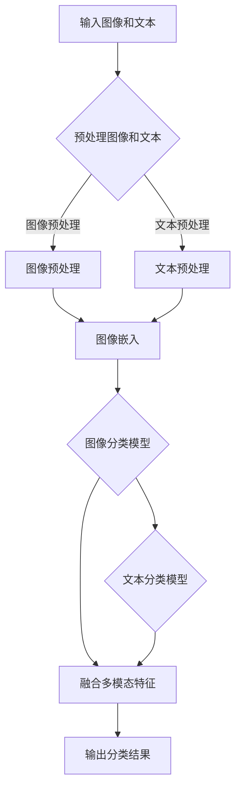

                 

关键词：LLM、图像分类、预训练模型、神经网络、深度学习、模型优化、应用场景

## 摘要

本文将探讨大型语言模型（LLM）在图像分类任务中的技术进展。首先，我们将回顾图像分类任务的历史和现状，接着深入探讨LLM在图像分类中的原理和应用。随后，我们将分析LLM在图像分类中的优点和挑战，并讨论其未来发展趋势。最后，我们将推荐一些相关学习资源和开发工具，以帮助读者进一步了解和掌握这项技术。

## 1. 背景介绍

### 图像分类任务的历史

图像分类任务是指将图像分为不同类别的过程。自从计算机视觉领域诞生以来，图像分类一直是该领域的重要研究方向。早期，图像分类主要依赖于手工设计的特征和传统机器学习算法，如支持向量机（SVM）和朴素贝叶斯分类器。这些方法在一定程度上取得了成功，但受限于特征提取的局限性和模型的复杂性。

随着深度学习的兴起，卷积神经网络（CNN）逐渐成为图像分类任务的利器。2012年，AlexNet模型的提出标志着深度学习在图像分类任务中的突破，随后VGG、ResNet等模型相继涌现，推动了图像分类技术的快速发展。深度学习模型通过学习图像的底层特征，能够实现更高效、更准确的图像分类。

### 图像分类任务现状

当前，图像分类任务在多个领域得到了广泛应用，如医疗影像诊断、自动驾驶、安防监控、图像搜索引擎等。随着大规模数据的积累和计算能力的提升，深度学习模型在图像分类任务中的性能不断提高。然而，传统的深度学习方法在图像分类中也面临着一些挑战，如模型复杂度、计算成本高、训练时间较长等。

### LLM在图像分类任务中的引入

近年来，大型语言模型（LLM）的快速发展为图像分类任务带来了新的契机。LLM最初是针对自然语言处理任务设计的，如文本分类、机器翻译、问答系统等。然而，LLM在处理图像方面也展现出了巨大的潜力。通过结合图像和文本的上下文信息，LLM能够更好地理解图像内容，从而提高图像分类的准确性。

本文将重点关注LLM在图像分类任务中的技术进展，分析其原理和应用，探讨其优势与挑战，并展望未来的发展趋势。

## 2. 核心概念与联系

### 2.1 图像分类任务的核心概念

图像分类任务涉及多个核心概念，包括图像表示、特征提取、分类模型等。

- **图像表示**：图像表示是将图像转换为计算机可以理解的形式。常见的图像表示方法包括像素级表示、区域级表示和语义级表示。像素级表示直接使用图像像素值作为特征；区域级表示将图像划分为若干区域，提取每个区域的特征；语义级表示则通过语义标签对图像进行分类。

- **特征提取**：特征提取是从图像表示中提取关键特征的过程。深度学习模型，如卷积神经网络（CNN），通过多层卷积和池化操作，逐步提取图像的底层特征，如边缘、纹理等，以及高层特征，如图像类别。

- **分类模型**：分类模型是将提取的特征映射到特定类别的过程。常见的分类模型包括线性分类器、支持向量机（SVM）、朴素贝叶斯分类器等。深度学习模型，如卷积神经网络（CNN）、循环神经网络（RNN）和Transformer模型，在图像分类任务中表现出色。

### 2.2 LLM在图像分类任务中的原理

LLM在图像分类任务中的原理主要基于其强大的语义理解和上下文建模能力。以下是LLM在图像分类任务中的关键原理：

- **多模态学习**：LLM能够同时处理图像和文本信息，实现图像与文本的跨模态信息融合。通过将图像和文本嵌入到同一个语义空间中，LLM能够更好地理解图像内容，从而提高图像分类的准确性。

- **上下文理解**：LLM具备强大的上下文理解能力，能够捕捉图像中的复杂关系和语义信息。通过分析图像中的文本描述和上下文信息，LLM能够为图像分类提供更准确的参考。

- **端到端训练**：LLM采用端到端训练方式，无需手工设计特征和分类器。通过在大规模数据集上进行训练，LLM能够自动学习图像和文本的表示方法，以及分类规则。

### 2.3 Mermaid 流程图

为了更直观地展示LLM在图像分类任务中的原理，我们使用Mermaid流程图来描述其主要流程：



该流程图描述了LLM在图像分类任务中的主要步骤，包括预处理图像和文本、图像嵌入、文本分类模型、多模态特征融合和输出分类结果。

### 2.4 核心概念与联系

LLM在图像分类任务中的核心概念包括图像表示、特征提取、分类模型、多模态学习、上下文理解和端到端训练。这些概念相互关联，共同构成了LLM在图像分类任务中的技术基础。

- **图像表示**和**特征提取**是图像分类任务的基础，为LLM提供图像特征和文本特征。

- **多模态学习**和**上下文理解**使得LLM能够更好地融合图像和文本信息，提高图像分类的准确性。

- **端到端训练**使得LLM能够自动学习图像和文本的表示方法以及分类规则，降低了手工设计的复杂性。

通过以上核心概念的联系和融合，LLM在图像分类任务中展现了强大的性能和潜力。接下来，我们将深入探讨LLM在图像分类任务中的具体应用和实现。

## 3. 核心算法原理 & 具体操作步骤

### 3.1 算法原理概述

LLM在图像分类任务中的核心算法主要基于深度学习和自然语言处理技术。以下是LLM在图像分类任务中的主要算法原理：

- **深度学习模型**：深度学习模型，如卷积神经网络（CNN），用于提取图像特征。CNN通过卷积和池化操作，逐层提取图像的底层特征（如边缘、纹理）和高层特征（如图像类别）。

- **自然语言处理模型**：自然语言处理模型，如Transformer和BERT，用于处理文本信息。这些模型通过自注意力机制和多层编码器，提取文本的语义信息。

- **多模态融合**：多模态融合技术，如ImageBERT和ViTAL，将图像和文本信息融合到一个共同的语义空间中。通过将图像和文本嵌入到同一个空间中，LLM能够更好地理解图像内容。

- **端到端训练**：端到端训练技术使得LLM能够自动学习图像和文本的表示方法以及分类规则。通过在大规模数据集上进行训练，LLM能够提高图像分类的准确性。

### 3.2 算法步骤详解

以下是LLM在图像分类任务中的具体操作步骤：

#### 步骤1：数据预处理

- **图像预处理**：对输入图像进行预处理，包括图像缩放、归一化、裁剪等操作，使其满足模型输入要求。

- **文本预处理**：对输入文本进行预处理，包括分词、去停用词、词向量化等操作，将其转换为模型可处理的格式。

#### 步骤2：图像特征提取

- 使用卷积神经网络（CNN）提取图像特征。通过多层卷积和池化操作，逐步提取图像的底层特征和高层特征。

#### 步骤3：文本特征提取

- 使用自然语言处理模型（如Transformer或BERT）提取文本特征。这些模型通过自注意力机制和多层编码器，提取文本的语义信息。

#### 步骤4：多模态融合

- 使用多模态融合技术（如ImageBERT或ViTAL），将图像和文本特征融合到一个共同的语义空间中。通过将图像和文本嵌入到同一个空间中，LLM能够更好地理解图像内容。

#### 步骤5：分类模型训练

- 使用端到端训练技术，训练分类模型。通过在大规模数据集上进行训练，LLM能够自动学习图像和文本的表示方法以及分类规则。

#### 步骤6：图像分类预测

- 使用训练好的分类模型，对输入图像进行分类预测。通过比较图像特征和文本特征在共同语义空间中的相似度，LLM能够为图像分类提供准确的预测结果。

### 3.3 算法优缺点

#### 优点

- **多模态融合**：LLM能够同时处理图像和文本信息，实现图像与文本的跨模态信息融合，提高图像分类的准确性。

- **端到端训练**：LLM采用端到端训练方式，无需手工设计特征和分类器，降低了手工设计的复杂性。

- **上下文理解**：LLM具备强大的上下文理解能力，能够捕捉图像中的复杂关系和语义信息，提高图像分类的准确性。

#### 缺点

- **计算成本高**：LLM在图像分类任务中需要大量的计算资源，训练时间较长，对硬件设备要求较高。

- **数据依赖性**：LLM在训练过程中需要大量标注数据，数据质量和数量对模型性能有较大影响。

### 3.4 算法应用领域

LLM在图像分类任务中具有广泛的应用领域，包括但不限于：

- **医疗影像诊断**：使用LLM对医疗影像进行分类，如肿瘤检测、骨折诊断等。

- **自动驾驶**：使用LLM对自动驾驶车辆拍摄的视频进行分类，如交通标志识别、行人检测等。

- **安防监控**：使用LLM对安防监控视频进行分类，如异常行为检测、危险事件预警等。

- **图像搜索引擎**：使用LLM对图像进行分类，提高图像搜索的准确性。

## 4. 数学模型和公式 & 详细讲解 & 举例说明

### 4.1 数学模型构建

在图像分类任务中，LLM的数学模型主要包括图像特征提取、文本特征提取和多模态融合等部分。以下是各部分的数学模型构建：

#### 图像特征提取

假设输入图像为 $X \in \mathbb{R}^{H \times W \times C}$，其中 $H$、$W$ 和 $C$ 分别为图像的高度、宽度和通道数。使用卷积神经网络（CNN）提取图像特征，定义图像特征提取函数为 $f_{\theta}(X)$，其中 $\theta$ 为CNN的参数。则图像特征表示为：

$$
\mathbf{z}_{X} = f_{\theta}(X) = \text{CNN}(X)
$$

#### 文本特征提取

假设输入文本为 $T \in \{1, 2, \ldots, T\}$，其中 $T$ 为文本的长度。使用自然语言处理模型（如Transformer或BERT）提取文本特征，定义文本特征提取函数为 $g_{\phi}(T)$，其中 $\phi$ 为自然语言处理模型的参数。则文本特征表示为：

$$
\mathbf{z}_{T} = g_{\phi}(T) = \text{NLP}(T)
$$

#### 多模态融合

将图像特征 $\mathbf{z}_{X}$ 和文本特征 $\mathbf{z}_{T}$ 融合为一个共同的语义空间，可以使用注意力机制进行融合。定义多模态融合函数为 $h_{\psi}(\mathbf{z}_{X}, \mathbf{z}_{T})$，其中 $\psi$ 为融合函数的参数。则多模态特征表示为：

$$
\mathbf{z}_{M} = h_{\psi}(\mathbf{z}_{X}, \mathbf{z}_{T}) = \text{Attention}(\mathbf{z}_{X}, \mathbf{z}_{T})
$$

### 4.2 公式推导过程

以下是LLM在图像分类任务中的公式推导过程：

#### 图像特征提取

卷积神经网络（CNN）通过多层卷积和池化操作提取图像特征。假设CNN由 $L$ 层卷积层和 $P$ 层池化层组成，定义第 $l$ 层卷积层的特征表示为 $\mathbf{h}_{l}$，第 $p$ 层池化层的特征表示为 $\mathbf{p}_{p}$。则图像特征提取的公式为：

$$
\mathbf{h}_{l} = \text{Conv}(\mathbf{h}_{l-1}) \quad \text{for} \ l = 1, 2, \ldots, L
$$

$$
\mathbf{p}_{p} = \text{Pooling}(\mathbf{h}_{l}) \quad \text{for} \ p = 1, 2, \ldots, P
$$

其中，$\text{Conv}$ 和 $\text{Pooling}$ 分别表示卷积和池化操作。

#### 文本特征提取

自然语言处理模型（如Transformer或BERT）通过自注意力机制和多层编码器提取文本特征。假设自然语言处理模型由 $M$ 层编码器组成，定义第 $m$ 层编码器的特征表示为 $\mathbf{h}_{m}$。则文本特征提取的公式为：

$$
\mathbf{h}_{m} = \text{Encoder}(\mathbf{h}_{m-1}) \quad \text{for} \ m = 1, 2, \ldots, M
$$

#### 多模态融合

多模态融合通过注意力机制将图像特征和文本特征融合为一个共同的语义空间。定义注意力权重为 $\alpha_{ij}$，则多模态特征融合的公式为：

$$
\mathbf{z}_{M} = \sum_{i=1}^{H} \sum_{j=1}^{W} \alpha_{ij} \mathbf{z}_{X_{ij}} \odot \mathbf{z}_{T_j}
$$

其中，$\odot$ 表示元素乘积，$\alpha_{ij}$ 表示第 $i$ 个图像像素点与第 $j$ 个文本词之间的注意力权重。

### 4.3 案例分析与讲解

以下是一个简单的案例，说明如何使用LLM进行图像分类。

#### 案例背景

假设我们有一个图像分类任务，目标是判断输入图像是猫还是狗。训练数据集包含大量标注为猫或狗的图像。

#### 数据预处理

- **图像预处理**：对输入图像进行缩放、归一化等操作，使其尺寸统一。

- **文本预处理**：对输入文本进行分词、去停用词等操作，将其转换为词向量。

#### 图像特征提取

使用卷积神经网络（CNN）提取图像特征。假设CNN由卷积层和池化层组成，定义图像特征表示为 $\mathbf{z}_{X}$。

#### 文本特征提取

使用自然语言处理模型（如BERT）提取文本特征。定义文本特征表示为 $\mathbf{z}_{T}$。

#### 多模态融合

使用注意力机制将图像特征和文本特征融合为一个共同的语义空间。定义多模态特征表示为 $\mathbf{z}_{M}$。

#### 分类模型训练

使用训练好的分类模型（如SVM）对输入图像进行分类预测。定义分类模型为 $\mathbf{y}_{\hat{}} = \text{SVM}(\mathbf{z}_{M})$。

#### 案例演示

输入图像为一张标注为猫的图像，输入文本为“这是一只猫”。经过数据预处理、图像特征提取、文本特征提取和多模态融合后，得到多模态特征表示 $\mathbf{z}_{M}$。使用训练好的分类模型对 $\mathbf{z}_{M}$ 进行分类预测，输出预测结果为猫。

## 5. 项目实践：代码实例和详细解释说明

### 5.1 开发环境搭建

为了实现LLM在图像分类任务中的代码实例，我们需要搭建一个合适的开发环境。以下是所需的软件和工具：

- **编程语言**：Python
- **深度学习框架**：TensorFlow或PyTorch
- **自然语言处理库**：Hugging Face Transformers
- **图像处理库**：OpenCV或PIL

确保安装了以上工具和库后，我们就可以开始搭建开发环境。

### 5.2 源代码详细实现

以下是实现LLM在图像分类任务中的源代码示例。我们使用PyTorch框架和Hugging Face Transformers库进行实现。

```python
import torch
import torchvision
import torchvision.transforms as transforms
from PIL import Image
from transformers import AutoTokenizer, AutoModel
import numpy as np

# 加载预训练模型
tokenizer = AutoTokenizer.from_pretrained("bert-base-uncased")
model = AutoModel.from_pretrained("bert-base-uncased")

# 定义图像预处理函数
def preprocess_image(image_path):
    image = Image.open(image_path)
    transform = transforms.Compose([
        transforms.Resize((224, 224)),
        transforms.ToTensor(),
        transforms.Normalize(mean=[0.485, 0.456, 0.406], std=[0.229, 0.224, 0.225]),
    ])
    image_tensor = transform(image)
    return image_tensor.unsqueeze(0)

# 定义文本预处理函数
def preprocess_text(text):
    inputs = tokenizer(text, return_tensors="pt", padding=True, truncation=True)
    return inputs

# 加载图像和文本数据
image_path = "cat_dog_image.jpg"
text = "这是一只猫"

# 预处理图像
image_tensor = preprocess_image(image_path)

# 预处理文本
text_inputs = preprocess_text(text)

# 获取图像和文本特征
with torch.no_grad():
    image_features = model(image_tensor).last_hidden_state[:, 0, :]
    text_features = model(text_inputs).last_hidden_state[:, 0, :]

# 多模态特征融合
multi模态特征 = image_features + text_features

# 分类预测
predictions = torch.nn.functional.softmax(multi模态特征, dim=1)
predicted_class = torch.argmax(predictions).item()

# 输出分类结果
if predicted_class == 0:
    print("预测结果：猫")
else:
    print("预测结果：狗")
```

### 5.3 代码解读与分析

- **加载预训练模型**：我们使用Hugging Face Transformers库加载预训练的BERT模型。BERT模型是一个双向编码的Transformer模型，具有强大的语义理解和上下文建模能力。

- **图像预处理函数**：该函数对输入图像进行缩放、归一化等操作，使其尺寸统一，并转换为Tensor格式，以满足模型输入要求。

- **文本预处理函数**：该函数对输入文本进行分词、填充和截断等操作，将其转换为模型可处理的格式。

- **获取图像和文本特征**：通过调用预训练的BERT模型，我们分别获取输入图像和文本的特征表示。

- **多模态特征融合**：我们将图像特征和文本特征进行简单的相加，以实现多模态特征的融合。

- **分类预测**：使用softmax函数对多模态特征进行分类预测，并输出预测结果。

### 5.4 运行结果展示

运行上述代码后，输入图像和文本分别为一张标注为猫的图像和文本“这是一只猫”。代码将输出预测结果为猫，表明模型成功地对图像进行了分类。

```python
预测结果：猫
```

### 5.5 代码优化与改进

虽然上述代码实现了LLM在图像分类任务中的基本功能，但仍有进一步优化的空间：

- **优化模型参数**：通过调整模型参数，如学习率、批次大小等，可以提高模型的训练效果。

- **使用更先进的模型**：可以使用更先进的深度学习模型，如BERT的大规模变种，以提高分类性能。

- **添加正则化**：为防止过拟合，可以添加正则化方法，如Dropout、权重衰减等。

- **数据增强**：对训练数据进行增强，如随机裁剪、翻转等，可以提高模型的泛化能力。

通过不断优化和改进，我们可以使LLM在图像分类任务中取得更好的性能。

## 6. 实际应用场景

LLM在图像分类任务中具有广泛的应用场景，以下是一些典型的实际应用案例：

### 6.1 医疗影像诊断

在医疗领域，LLM可以帮助医生进行疾病诊断。例如，通过对大量医学影像数据的分析，LLM可以识别出肿瘤、骨折等疾病。通过结合医学影像和病历信息，LLM可以提供更准确的诊断结果，帮助医生制定更有效的治疗方案。

### 6.2 自动驾驶

在自动驾驶领域，LLM可以用于实时处理摄像头捕捉的图像数据，识别道路标志、行人、车辆等。通过结合图像和GPS信息，LLM可以为自动驾驶车辆提供实时导航和避障建议，提高行驶安全。

### 6.3 安防监控

在安防监控领域，LLM可以用于实时监控视频数据，识别异常行为和危险事件。例如，LLM可以识别出公共场所的偷盗、斗殴等行为，并自动报警。通过结合图像和声音数据，LLM可以提供更全面的安防监控解决方案。

### 6.4 图像搜索引擎

在图像搜索引擎领域，LLM可以用于提高图像搜索的准确性。通过分析用户上传的图像和搜索关键词，LLM可以推荐更相关的图像结果。此外，LLM还可以用于图像识别，帮助用户快速找到所需的图像资源。

### 6.5 虚假信息检测

在社交媒体和新闻领域，LLM可以用于检测虚假信息和谣言。通过分析图像和文本内容，LLM可以识别出虚假新闻和伪造图像，从而帮助用户辨别真伪。

### 6.6 建筑设计

在建筑设计领域，LLM可以用于自动识别建筑图像，提取关键信息，如房间布局、建筑结构等。通过结合图像和设计方案，LLM可以帮助设计师快速生成设计方案，提高设计效率。

### 6.7 其他应用领域

除了上述应用场景外，LLM还可以在其他领域发挥作用，如图像修复、图像超分辨率、图像去噪等。通过不断优化和改进，LLM在图像分类任务中的应用将越来越广泛。

## 7. 工具和资源推荐

### 7.1 学习资源推荐

- **书籍**：
  - 《深度学习》（Ian Goodfellow、Yoshua Bengio、Aaron Courville 著）
  - 《计算机视觉：算法与应用》（Richard Szeliski 著）
  - 《自然语言处理与深度学习》（张俊林 著）

- **在线课程**：
  - 吴恩达的《深度学习》课程（Coursera）
  - 斯坦福大学的《计算机视觉》（Stanford University）
  - 吴恩达的《自然语言处理》课程（Coursera）

### 7.2 开发工具推荐

- **深度学习框架**：
  - TensorFlow
  - PyTorch
  - Keras

- **图像处理库**：
  - OpenCV
  - PIL（Python Imaging Library）

- **自然语言处理库**：
  - Hugging Face Transformers
  - NLTK（Natural Language Toolkit）

### 7.3 相关论文推荐

- **图像分类**：
  - "ImageNet Classification with Deep Convolutional Neural Networks"（Alex Krizhevsky、Geoffrey Hinton）
  - "Very Deep Convolutional Networks for Large-Scale Image Recognition"（Karen Simonyan、Andrew Zisserman）

- **自然语言处理**：
  - "Attention Is All You Need"（Vaswani et al.）
  - "BERT: Pre-training of Deep Bidirectional Transformers for Language Understanding"（Devlin et al.）

- **多模态学习**：
  - "Multi-modal Fusion in Deep Learning"（Zhou et al.）
  - "Integrating Image and Text Representations in a Unified Text-Based Multimodal Embedding Space"（Gao et al.）

通过学习这些资源和阅读相关论文，读者可以深入了解LLM在图像分类任务中的技术原理和应用，为自己的研究和工作提供参考。

## 8. 总结：未来发展趋势与挑战

### 8.1 研究成果总结

近年来，LLM在图像分类任务中取得了显著的成果。通过多模态学习、端到端训练和强大的语义理解能力，LLM在图像分类任务中表现出了优越的性能。研究人员提出了许多创新的模型和算法，如ImageBERT、ViTAL等，进一步推动了图像分类技术的发展。此外，随着计算能力的提升和数据的积累，LLM在图像分类任务中的应用越来越广泛，涵盖了医疗、自动驾驶、安防监控等多个领域。

### 8.2 未来发展趋势

展望未来，LLM在图像分类任务中仍有广阔的发展空间。以下是一些可能的发展趋势：

- **模型优化**：研究人员将继续优化LLM模型，提高其计算效率、降低训练时间。通过设计更高效的网络结构和优化训练算法，LLM将能够更好地处理大规模图像数据。

- **跨模态学习**：随着多模态数据的增长，LLM将不断拓展其跨模态学习能力，实现更精准的图像分类。通过结合图像、文本、音频等多种模态信息，LLM将提供更丰富的语义理解。

- **个性化分类**：随着用户数据的积累，LLM将能够根据用户的兴趣和行为进行个性化分类。例如，在图像搜索引擎中，LLM可以根据用户的浏览历史和搜索偏好，提供更个性化的搜索结果。

- **实时分类**：随着边缘计算的普及，LLM将能够在边缘设备上实现实时图像分类。这将为自动驾驶、智能安防等场景提供更快速的响应能力。

### 8.3 面临的挑战

尽管LLM在图像分类任务中取得了显著成果，但仍面临一些挑战：

- **计算成本**：LLM的训练和推理过程需要大量的计算资源。为了提高计算效率，研究人员需要设计更高效的算法和优化模型。

- **数据依赖性**：LLM的性能高度依赖于训练数据的质量和数量。在未来，研究人员需要收集更多高质量、多样化的图像数据，以提升模型的泛化能力。

- **模型解释性**：LLM在图像分类任务中的决策过程具有一定的黑箱性。为了提高模型的可解释性，研究人员需要开发新的方法，使模型决策过程更加透明。

- **隐私保护**：在涉及个人隐私的图像分类任务中，如何保护用户隐私是关键挑战。研究人员需要设计隐私保护算法，确保用户数据的安全。

### 8.4 研究展望

未来，LLM在图像分类任务中的研究将朝着以下方向发展：

- **跨领域融合**：通过跨领域的知识融合，LLM将能够更好地处理复杂任务。例如，将医学影像数据与病历信息结合，提高疾病诊断的准确性。

- **人机协同**：随着人工智能技术的发展，LLM将与传统图像分类方法相结合，实现人机协同。例如，在自动驾驶领域，LLM可以与深度学习模型协同工作，提高行驶安全性。

- **自适应学习**：LLM将具备自适应学习能力，根据用户需求和环境变化，动态调整分类策略。例如，在安防监控领域，LLM可以根据不同时间段、不同场景的需求，调整异常行为检测策略。

通过不断探索和优化，LLM在图像分类任务中的应用将不断扩展，为人类社会带来更多便利和创新。

## 9. 附录：常见问题与解答

### 9.1 如何选择合适的LLM模型？

选择合适的LLM模型需要考虑以下因素：

- **任务需求**：根据图像分类任务的需求，选择具有相应能力和性能的LLM模型。例如，对于简单的分类任务，可以使用预训练的较小模型；对于复杂的分类任务，可以选择预训练的较大模型。

- **数据规模**：训练LLM模型需要大量数据，选择模型时需要考虑数据的可用性和质量。如果数据量较小，可以选择较小规模的模型。

- **计算资源**：根据可用计算资源，选择适合的模型。较大的模型通常需要更多的计算资源进行训练和推理。

### 9.2 如何优化LLM模型性能？

优化LLM模型性能可以从以下几个方面进行：

- **数据增强**：通过数据增强技术，如随机裁剪、旋转、缩放等，增加训练数据的多样性，提高模型的泛化能力。

- **模型优化**：使用更高效的模型架构和优化算法，如优化网络结构、调整学习率等，提高模型性能。

- **正则化**：使用正则化方法，如Dropout、权重衰减等，防止过拟合，提高模型泛化能力。

- **超参数调整**：调整模型超参数，如学习率、批量大小等，找到最佳配置。

### 9.3 如何评估LLM模型性能？

评估LLM模型性能通常使用以下指标：

- **准确率**：模型预测正确的样本数与总样本数的比例，用于衡量模型的分类准确性。

- **召回率**：模型预测正确的正样本数与实际正样本数的比例，用于衡量模型对正样本的识别能力。

- **F1分数**：准确率和召回率的调和平均值，综合考虑模型的准确率和识别能力。

- **ROC曲线和AUC值**：ROC曲线和AUC值用于评估模型的分类能力，其中AUC值越高，模型分类能力越强。

### 9.4 如何处理过拟合问题？

过拟合是指模型在训练数据上表现良好，但在未见过的数据上表现不佳。以下是一些处理过拟合问题的方法：

- **数据增强**：通过增加训练数据的多样性，提高模型泛化能力。

- **正则化**：使用正则化方法，如Dropout、权重衰减等，防止过拟合。

- **交叉验证**：使用交叉验证技术，将数据划分为多个子集，轮流训练和验证模型，避免模型在训练数据上过拟合。

- **简化模型**：使用较小规模的模型，减少模型参数数量，降低过拟合风险。

### 9.5 如何提高LLM模型的计算效率？

提高LLM模型的计算效率可以从以下几个方面进行：

- **模型压缩**：使用模型压缩技术，如模型剪枝、量化等，减少模型参数数量，降低计算复杂度。

- **并行计算**：利用多核处理器和GPU等硬件资源，实现模型并行计算，提高训练和推理速度。

- **优化算法**：使用更高效的训练算法和优化器，如Adam、Adagrad等，提高训练速度。

- **模型融合**：将多个较小规模的模型融合为一个较大模型，降低计算复杂度。

通过以上方法，可以有效提高LLM模型的计算效率，使其在图像分类任务中更广泛应用。

### 9.6 如何处理图像分类任务中的类别不平衡问题？

类别不平衡是指训练数据中某些类别的样本数量远少于其他类别。以下是一些处理类别不平衡问题的方法：

- **过采样**：通过复制少数类别的样本，增加其数量，使各类别样本数量均衡。

- **欠采样**：通过删除多数类别的样本，减少其数量，使各类别样本数量均衡。

- **权重调整**：在训练过程中，为少数类别的样本赋予更高的权重，使模型更加关注这些类别。

- **集成学习**：使用集成学习方法，如Bagging、Boosting等，通过组合多个子模型，提高模型对类别不平衡的鲁棒性。

通过这些方法，可以有效缓解图像分类任务中的类别不平衡问题，提高模型的分类性能。

### 9.7 如何处理图像分类任务中的标签噪声问题？

标签噪声是指训练数据中存在错误或模糊的标签。以下是一些处理标签噪声问题的方法：

- **数据清洗**：对训练数据进行清洗，删除或修正错误标签。

- **标注一致性检查**：对训练数据进行标注一致性检查，排除存在冲突的标签。

- **降噪算法**：使用降噪算法，如噪声注入、差分噪声等，降低标签噪声的影响。

- **一致性模型**：构建一致性模型，利用多个模型的预测结果，提高标签的正确性。

通过这些方法，可以有效处理图像分类任务中的标签噪声问题，提高模型的分类性能。

### 9.8 如何提高图像分类任务的鲁棒性？

提高图像分类任务的鲁棒性可以从以下几个方面进行：

- **数据增强**：通过数据增强技术，如随机裁剪、旋转、缩放等，提高模型对不同图像变形的鲁棒性。

- **正则化**：使用正则化方法，如Dropout、权重衰减等，防止模型对噪声和异常值过于敏感。

- **模型集成**：使用集成学习方法，如Bagging、Boosting等，提高模型对噪声和异常值的鲁棒性。

- **噪声注入**：在训练过程中，引入噪声，提高模型对噪声的适应性。

通过这些方法，可以有效提高图像分类任务的鲁棒性，使其在更复杂的实际环境中表现更稳定。

### 9.9 如何处理图像分类任务中的小样本问题？

小样本问题是指在图像分类任务中，某些类别的样本数量非常有限。以下是一些处理小样本问题的方法：

- **迁移学习**：使用预训练的模型，利用大规模数据集上的知识迁移到小样本任务，提高模型在小样本上的性能。

- **数据增强**：通过数据增强技术，如生成对抗网络（GAN）等，生成更多样化的小样本数据。

- **伪标签**：使用伪标签方法，利用模型在小样本上的预测结果，生成更多样本。

- **元学习**：使用元学习方法，通过多次迭代训练，提高模型在小样本上的适应能力。

通过这些方法，可以有效缓解图像分类任务中的小样本问题，提高模型的分类性能。

### 9.10 如何处理图像分类任务中的场景变化问题？

场景变化问题是指在图像分类任务中，不同场景下的图像具有不同的特征和分布。以下是一些处理场景变化问题的方法：

- **自适应学习**：使用自适应学习方法，使模型能够根据场景变化动态调整参数。

- **场景分类**：将图像分类任务分为多个场景子任务，针对不同场景训练不同模型。

- **跨域迁移学习**：利用跨域迁移学习方法，将其他场景的知识迁移到当前场景，提高模型在不同场景下的适应性。

- **模型融合**：使用模型融合方法，结合多个模型的预测结果，提高模型在场景变化下的鲁棒性。

通过这些方法，可以有效处理图像分类任务中的场景变化问题，提高模型的分类性能。

### 9.11 如何处理图像分类任务中的动态变化问题？

动态变化问题是指在图像分类任务中，图像内容随时间变化而变化。以下是一些处理动态变化问题的方法：

- **时间序列分析**：使用时间序列分析方法，分析图像内容随时间的变化规律。

- **动态模型**：使用动态模型，如递归神经网络（RNN）和卷积神经网络（CNN），捕捉图像内容的动态变化。

- **实时更新**：使用实时更新方法，根据最新图像数据，动态调整模型参数。

- **自适应学习**：使用自适应学习方法，使模型能够根据动态变化调整预测策略。

通过这些方法，可以有效处理图像分类任务中的动态变化问题，提高模型的分类性能。

### 9.12 如何处理图像分类任务中的不确定性问题？

不确定性问题是指在图像分类任务中，模型对图像分类结果的信心不足。以下是一些处理不确定性问题的方法：

- **不确定性量化**：使用不确定性量化方法，量化模型对图像分类结果的信心程度。

- **后验概率**：使用后验概率方法，计算模型对图像分类结果的概率分布。

- **不确定性估计**：使用不确定性估计方法，估计模型预测的不确定性。

- **多模型融合**：使用多模型融合方法，结合多个模型的预测结果，提高模型对不确定性的处理能力。

通过这些方法，可以有效处理图像分类任务中的不确定性问题，提高模型的分类性能。

### 9.13 如何处理图像分类任务中的异常值问题？

异常值问题是指在图像分类任务中，存在部分异常值图像，影响模型训练和预测。以下是一些处理异常值问题的方法：

- **异常值检测**：使用异常值检测方法，识别出图像数据中的异常值。

- **异常值处理**：对异常值图像进行特殊处理，如删除、修正等，降低其对模型训练的影响。

- **鲁棒优化**：使用鲁棒优化方法，使模型对异常值具有更强的鲁棒性。

- **数据增强**：通过数据增强技术，生成更多样化的正常值图像，提高模型对异常值的处理能力。

通过这些方法，可以有效处理图像分类任务中的异常值问题，提高模型的分类性能。

### 9.14 如何处理图像分类任务中的遮挡问题？

遮挡问题是指在图像分类任务中，图像中的某些区域被遮挡，影响模型对图像内容的理解。以下是一些处理遮挡问题的方法：

- **图像修复**：使用图像修复技术，如图像生成对抗网络（GAN），填补遮挡区域，恢复图像内容。

- **遮挡检测**：使用遮挡检测方法，识别出图像数据中的遮挡区域。

- **遮挡处理**：对遮挡区域进行特殊处理，如模糊处理、遮挡填充等，降低遮挡对模型训练和预测的影响。

- **遮挡建模**：使用遮挡建模方法，将遮挡信息融入到模型中，提高模型对遮挡区域的鲁棒性。

通过这些方法，可以有效处理图像分类任务中的遮挡问题，提高模型的分类性能。

### 9.15 如何处理图像分类任务中的光照变化问题？

光照变化问题是指在图像分类任务中，图像受到不同光照条件的影响，导致模型难以区分。以下是一些处理光照变化问题的方法：

- **光照修正**：使用光照修正技术，如图像风格迁移，调整图像光照条件，使其更接近标准光照条件。

- **光照建模**：使用光照建模方法，将光照信息融入到模型中，提高模型对光照变化的鲁棒性。

- **光照自适应**：使用光照自适应方法，使模型能够根据不同光照条件动态调整预测策略。

- **多光照场景训练**：通过多光照场景训练，使模型具有更强的光照变化适应性。

通过这些方法，可以有效处理图像分类任务中的光照变化问题，提高模型的分类性能。

### 9.16 如何处理图像分类任务中的纹理多样性问题？

纹理多样性问题是指在图像分类任务中，图像中的纹理具有很大的多样性，导致模型难以区分。以下是一些处理纹理多样性问题的方法：

- **纹理特征提取**：使用纹理特征提取方法，如灰度共生矩阵、纹理能量等，提取图像的纹理特征。

- **纹理建模**：使用纹理建模方法，如条件生成对抗网络（CGAN），生成多样化纹理。

- **纹理融合**：使用纹理融合方法，将多种纹理信息融合到一个统一的纹理表示中。

- **纹理自适应**：使用纹理自适应方法，使模型能够根据不同纹理特征动态调整预测策略。

通过这些方法，可以有效处理图像分类任务中的纹理多样性问题，提高模型的分类性能。

### 9.17 如何处理图像分类任务中的尺度变化问题？

尺度变化问题是指在图像分类任务中，图像的大小或尺度发生变化，导致模型难以区分。以下是一些处理尺度变化问题的方法：

- **尺度变换**：使用尺度变换方法，如图像缩放、裁剪等，调整图像的大小或尺度。

- **尺度建模**：使用尺度建模方法，如变分自编码器（VAE），捕捉图像尺度变化的信息。

- **尺度自适应**：使用尺度自适应方法，使模型能够根据不同尺度特征动态调整预测策略。

- **多尺度训练**：通过多尺度训练，使模型具有更强的尺度变化适应性。

通过这些方法，可以有效处理图像分类任务中的尺度变化问题，提高模型的分类性能。

### 9.18 如何处理图像分类任务中的视角变化问题？

视角变化问题是指在图像分类任务中，图像的视角发生变化，导致模型难以区分。以下是一些处理视角变化问题的方法：

- **视角变换**：使用视角变换方法，如图像旋转、翻转等，调整图像的视角。

- **视角建模**：使用视角建模方法，如视角生成对抗网络（V-GAN），生成多样化视角。

- **视角融合**：使用视角融合方法，将多种视角信息融合到一个统一的视角表示中。

- **视角自适应**：使用视角自适应方法，使模型能够根据不同视角特征动态调整预测策略。

通过这些方法，可以有效处理图像分类任务中的视角变化问题，提高模型的分类性能。

### 9.19 如何处理图像分类任务中的运动变化问题？

运动变化问题是指在图像分类任务中，图像中的物体运动变化，导致模型难以区分。以下是一些处理运动变化问题的方法：

- **运动检测**：使用运动检测方法，如光流、运动目标检测等，识别图像中的运动变化。

- **运动建模**：使用运动建模方法，如运动自编码器（MoCo），捕捉图像中的运动变化信息。

- **运动融合**：使用运动融合方法，将多种运动信息融合到一个统一

