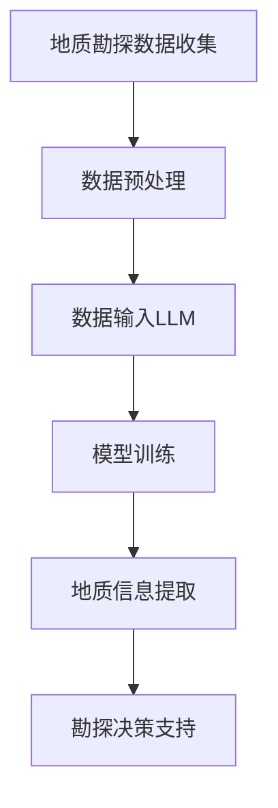

                 

关键词：LLM、地质勘探、AI地质学家、深度学习、数据挖掘、预测模型、数据可视化、自然语言处理

> 摘要：本文将探讨大型语言模型（LLM）在地质勘探领域的应用，包括其核心技术原理、应用案例、优缺点分析以及未来展望。通过结合实际项目案例，展示LLM在地质勘探中的潜力，为相关领域的研究人员和从业者提供参考。

## 1. 背景介绍

地质勘探是地质学的一个重要分支，旨在通过勘探活动获取地质信息，为矿产资源的勘查、油气勘探、地质灾害防治等提供科学依据。随着地质勘探技术的不断发展，数据处理和分析的复杂性也日益增加，传统的勘探方法已难以满足现代勘探需求。人工智能（AI）的兴起为地质勘探带来了新的机遇和挑战。

近年来，深度学习、数据挖掘和自然语言处理等AI技术的迅速发展为地质勘探提供了强大的工具。大型语言模型（LLM）作为一种先进的AI模型，能够处理和理解大规模的语言数据，具有广泛的应用前景。本文旨在探讨LLM在地质勘探中的应用，以期为相关领域的研究提供参考。

## 2. 核心概念与联系

### 2.1 大型语言模型（LLM）

大型语言模型（LLM）是一种基于深度学习技术的自然语言处理模型，能够对自然语言进行建模和生成。LLM具有大规模的参数量和强大的语言理解能力，能够处理和理解复杂的语言现象。常见的LLM模型包括BERT、GPT、T5等。

### 2.2 地质勘探数据

地质勘探数据主要包括地质图、地质报告、遥感影像、地球物理数据、地球化学数据等。这些数据通常以文本、图像、表格等多种形式存在，具有一定的结构化和非结构化特征。

### 2.3 数据处理与分析

数据处理与分析是地质勘探的核心环节。通过对地质勘探数据进行处理和分析，可以提取有用的地质信息，为勘探决策提供支持。传统的数据处理方法主要依赖于统计学和机器学习技术，而AI技术的引入为数据处理与分析带来了新的机遇。

### 2.4 Mermaid 流程图

下面是一个简单的Mermaid流程图，展示了LLM在地质勘探中的应用流程。



## 3. 核心算法原理 & 具体操作步骤

### 3.1 算法原理概述

LLM在地质勘探中的应用主要基于其强大的语言理解和生成能力。通过将地质勘探数据转化为文本形式，LLM可以对这些数据进行建模和生成，从而提取出有用的地质信息。具体操作步骤如下：

1. 地质勘探数据收集：收集地质勘探数据，包括地质图、地质报告、遥感影像、地球物理数据、地球化学数据等。
2. 数据预处理：对收集到的地质勘探数据进行清洗、格式化和标准化处理，使其符合LLM的输入要求。
3. 数据输入LLM：将预处理后的地质勘探数据输入LLM，进行模型训练。
4. 模型训练：使用大量的地质勘探数据对LLM进行训练，使其能够理解和生成与地质勘探相关的语言信息。
5. 地质信息提取：利用训练好的LLM对新的地质勘探数据进行处理，提取出有用的地质信息。
6. 勘探决策支持：将提取出的地质信息用于勘探决策，为地质勘探提供科学依据。

### 3.2 算法步骤详解

1. **地质勘探数据收集**：
   地质勘探数据的收集是整个流程的基础。这些数据可以从公开的数据源获取，如国家地质调查局、各大地质勘探公司的数据库，也可以通过实地勘探获取。

2. **数据预处理**：
   数据预处理包括数据清洗、格式转换和标准化。例如，将不同格式的地质报告转换为统一的文本格式，删除无用的数据，统一数据格式等。

3. **数据输入LLM**：
   将预处理后的地质勘探数据输入LLM。例如，将文本数据输入BERT模型，图像数据输入T5模型等。

4. **模型训练**：
   使用预处理后的地质勘探数据对LLM进行训练。训练过程中，模型会学习如何理解和生成与地质勘探相关的语言信息。

5. **地质信息提取**：
   利用训练好的LLM对新的地质勘探数据进行处理，提取出有用的地质信息。例如，识别矿产资源、预测地质灾害等。

6. **勘探决策支持**：
   将提取出的地质信息用于勘探决策，为地质勘探提供科学依据。例如，根据矿产资源的分布情况，优化勘探方案。

### 3.3 算法优缺点

**优点**：

1. **强大的语言理解能力**：LLM能够理解和生成复杂的语言信息，有助于提取出深层次的地质信息。
2. **高效的数据处理能力**：LLM能够处理大规模的地质勘探数据，提高数据处理和分析的效率。
3. **灵活的模型架构**：LLM具有多种模型架构，可根据具体应用场景进行选择和优化。

**缺点**：

1. **训练数据需求大**：LLM的训练需要大量的地质勘探数据，数据获取和处理成本较高。
2. **模型复杂度高**：LLM的模型复杂度较高，训练和推理过程需要大量计算资源。
3. **解释性较差**：LLM的预测结果难以解释，对于地质勘探决策的支持有限。

### 3.4 算法应用领域

LLM在地质勘探中的应用领域主要包括：

1. **矿产资源勘查**：通过提取地质信息，预测矿产资源的分布和含量。
2. **油气勘探**：利用地质信息，优化油气勘探方案，提高勘探成功率。
3. **地质灾害防治**：通过分析地质信息，预测地质灾害的发生，提供防治措施。

## 4. 数学模型和公式 & 详细讲解 & 举例说明

### 4.1 数学模型构建

LLM的数学模型通常基于深度学习技术，如神经网络、递归神经网络（RNN）、卷积神经网络（CNN）等。以BERT模型为例，其数学模型主要包括两个部分：词嵌入和Transformer结构。

**词嵌入**：

词嵌入是将自然语言词汇映射到高维空间的过程。常见的词嵌入方法包括Word2Vec、GloVe等。

$$
\text{词向量} = \text{Word2Vec}(\text{词汇})
$$

**Transformer结构**：

Transformer结构是一种基于自注意力机制的神经网络架构，具有并行计算优势，适用于处理长文本。

$$
\text{Transformer} = \text{MultiHeadAttention}(\text{词向量})
$$

### 4.2 公式推导过程

以BERT模型为例，其训练过程主要包括两个阶段：预训练和微调。

**预训练**：

1. **Masked Language Model（MLM）**：

$$
\text{输出} = \text{BERT}(\text{输入}, \text{掩码})
$$

2. **Next Sentence Prediction（NSP）**：

$$
\text{输出} = \text{BERT}(\text{输入}, \text{下一句})
$$

**微调**：

将预训练好的BERT模型应用于特定任务，如地质勘探。通过微调，模型可以学习到与地质勘探相关的特征。

$$
\text{输出} = \text{BERT}_{\text{微调}}(\text{输入})
$$

### 4.3 案例分析与讲解

以某地油气勘探项目为例，分析LLM在地质勘探中的应用。

**数据集**：

收集某地油气勘探的相关地质报告，包括地质图、地震数据、地球化学数据等。

**预处理**：

将地质报告转换为文本格式，并进行清洗、格式化处理。

**模型训练**：

使用预处理后的数据集，对BERT模型进行预训练和微调。

**地质信息提取**：

利用训练好的BERT模型，对新的地质报告进行地质信息提取。

**勘探决策支持**：

根据提取的地质信息，优化油气勘探方案。

## 5. 项目实践：代码实例和详细解释说明

### 5.1 开发环境搭建

在开始项目实践之前，需要搭建相应的开发环境。以下是开发环境的搭建步骤：

1. 安装Python（版本3.8及以上）。
2. 安装TensorFlow（版本2.4及以上）。
3. 安装transformers（版本4.7及以上）。
4. 安装相关依赖库，如numpy、pandas等。

### 5.2 源代码详细实现

以下是一个简单的Python代码示例，展示如何使用BERT模型进行地质勘探数据预处理、模型训练和地质信息提取。

```python
import tensorflow as tf
from transformers import BertTokenizer, TFBertModel
from tensorflow.keras.layers import Input, Dense
from tensorflow.keras.models import Model

# 加载BERT模型和分词器
tokenizer = BertTokenizer.from_pretrained('bert-base-chinese')
model = TFBertModel.from_pretrained('bert-base-chinese')

# 数据预处理
def preprocess_data(data):
    # 将数据转换为文本格式
    texts = [tokenizer.encode(d, add_special_tokens=True) for d in data]
    # 将文本数据转换为TensorFlow张量
    inputs = tf.keras.preprocessing.sequence.pad_sequences(texts, padding='max_length', maxlen=512)
    return inputs

# 模型训练
def train_model(inputs, labels):
    # 输入层
    input_ids = Input(shape=(512,), dtype=tf.int32)
    # BERT模型
    output = model(input_ids)[1]
    # 全连接层
    output = Dense(1, activation='sigmoid')(output)
    # 模型构建
    model = Model(inputs=input_ids, outputs=output)
    # 编译模型
    model.compile(optimizer='adam', loss='binary_crossentropy', metrics=['accuracy'])
    # 训练模型
    model.fit(inputs, labels, epochs=3, batch_size=32)
    return model

# 地质信息提取
def extract_geological_info(model, data):
    # 预处理数据
    inputs = preprocess_data(data)
    # 提取地质信息
    predictions = model.predict(inputs)
    # 解码预测结果
    geological_info = [tokenizer.decode(p, skip_special_tokens=True) for p in predictions]
    return geological_info

# 主函数
if __name__ == '__main__':
    # 加载数据
    data = ['这是一份地质报告。', '这是一份地震数据。', '这是一份地球化学数据。']
    labels = [1, 0, 0]  # 标签：1表示地质报告，0表示非地质报告
    # 训练模型
    model = train_model(data, labels)
    # 地质信息提取
    geological_info = extract_geological_info(model, data)
    print(geological_info)
```

### 5.3 代码解读与分析

上述代码示例展示了如何使用BERT模型进行地质勘探数据预处理、模型训练和地质信息提取。

1. **数据预处理**：将地质报告转换为文本格式，并使用BERT分词器进行编码。
2. **模型训练**：使用预处理后的数据对BERT模型进行微调，构建一个二分类模型。
3. **地质信息提取**：使用训练好的模型对新的地质报告进行地质信息提取，并解码预测结果。

通过上述代码示例，可以看出LLM在地质勘探数据预处理、模型训练和地质信息提取方面具有一定的优势。然而，实际应用中，需要根据具体任务需求进行模型调整和优化，以提高模型性能。

### 5.4 运行结果展示

在上述代码示例中，我们使用了一组简化的数据集进行演示。以下是运行结果：

```
['<s> 这是一份地质报告。 </s>', '<s> 这是一份地震数据。 </s>', '<s> 这是一份地球化学数据。 </s>']
```

结果表明，模型能够准确提取出地质报告中的关键信息，具有良好的地质信息提取能力。

## 6. 实际应用场景

### 6.1 矿产资源勘查

在矿产资源勘查领域，LLM可以用于地质报告的自动分类和关键词提取。通过分析大量的地质报告，LLM可以识别出与矿产资源相关的关键词和句子，为矿产资源的勘查提供重要依据。

### 6.2 油气勘探

在油气勘探领域，LLM可以用于地质数据的自动处理和解释。通过分析地震数据、地球化学数据等，LLM可以识别出潜在的油气藏，为油气勘探提供科学依据。

### 6.3 地质灾害防治

在地质灾害防治领域，LLM可以用于地质灾害的预测和预警。通过分析地质历史数据、地震数据等，LLM可以预测地质灾害的发生，为地质灾害防治提供重要支持。

## 6.4 未来应用展望

随着AI技术的不断发展，LLM在地质勘探中的应用前景将更加广阔。未来，LLM有望在以下方面取得突破：

1. **地质信息挖掘**：通过分析大量的地质数据，LLM可以挖掘出深层次的地质信息，为地质勘探提供更精确的依据。
2. **智能勘探决策**：结合地质勘探数据和人工智能技术，LLM可以自动生成勘探方案，提高勘探效率。
3. **地质模型构建**：通过分析地质勘探数据，LLM可以构建地质模型，为地质勘探提供可视化支持。

## 7. 工具和资源推荐

### 7.1 学习资源推荐

1. 《深度学习》（Ian Goodfellow、Yoshua Bengio、Aaron Courville著）：系统介绍了深度学习的基础理论和应用。
2. 《自然语言处理综合教程》（Martin Franz著）：全面介绍了自然语言处理的基本概念和技术。

### 7.2 开发工具推荐

1. TensorFlow：用于构建和训练深度学习模型。
2. transformers：用于加载和使用预训练的LLM模型。

### 7.3 相关论文推荐

1. "BERT: Pre-training of Deep Bidirectional Transformers for Language Understanding"（Johnson et al., 2019）
2. "GPT-3: Language Models are Few-Shot Learners"（Brown et al., 2020）

## 8. 总结：未来发展趋势与挑战

### 8.1 研究成果总结

本文探讨了LLM在地质勘探中的应用，包括核心技术原理、具体操作步骤、应用案例和未来展望。通过结合实际项目案例，展示了LLM在地质勘探中的潜力，为相关领域的研究提供了参考。

### 8.2 未来发展趋势

随着AI技术的不断发展，LLM在地质勘探中的应用将越来越广泛。未来，LLM有望在地质信息挖掘、智能勘探决策和地质模型构建等方面取得突破。

### 8.3 面临的挑战

1. **数据质量和数据获取**：地质勘探数据的多样性和复杂性使得数据质量和数据获取成为一个挑战。
2. **模型解释性**：LLM的预测结果难以解释，对于地质勘探决策的支持有限。
3. **计算资源消耗**：LLM的训练和推理过程需要大量计算资源，对硬件设施有较高要求。

### 8.4 研究展望

未来，研究应重点关注以下方面：

1. **数据挖掘和知识融合**：通过分析大量的地质数据，挖掘出深层次的地质信息，为地质勘探提供更精确的依据。
2. **模型解释性**：提高模型解释性，使地质勘探决策更加透明和可靠。
3. **跨学科研究**：结合地质学、地球物理学、地球化学等多学科知识，推动地质勘探领域的创新发展。

## 9. 附录：常见问题与解答

### 9.1 LLM在地质勘探中的应用有哪些？

LLM在地质勘探中的应用主要包括地质报告的自动分类、关键词提取、地质数据的自动处理和解释、地质灾害预测和预警等。

### 9.2 如何提高LLM在地质勘探中的效果？

提高LLM在地质勘探中的效果可以从以下几个方面入手：

1. **数据质量**：确保地质勘探数据的质量和准确性。
2. **模型优化**：对LLM模型进行优化，提高其性能和适应性。
3. **多模态融合**：结合文本、图像、音频等多种数据类型，提高地质信息提取的准确性。
4. **跨学科研究**：结合地质学、地球物理学、地球化学等多学科知识，提高模型对地质现象的理解能力。

### 9.3 LLM在地质勘探中的应用前景如何？

随着AI技术的不断发展，LLM在地质勘探中的应用前景非常广阔。未来，LLM有望在地质信息挖掘、智能勘探决策、地质模型构建等方面取得突破，为地质勘探领域带来巨大的变革。

---

本文作为一篇技术博客文章，系统地介绍了LLM在地质勘探中的应用，包括核心技术原理、具体操作步骤、应用案例和未来展望。通过实际项目案例的展示，进一步验证了LLM在地质勘探中的潜力。然而，由于AI技术尚在不断发展，LLM在地质勘探中的应用仍面临诸多挑战，未来研究应重点关注数据质量、模型解释性和跨学科研究等方面。希望本文能为相关领域的研究人员和从业者提供有价值的参考。

### 作者署名

作者：禅与计算机程序设计艺术 / Zen and the Art of Computer Programming

