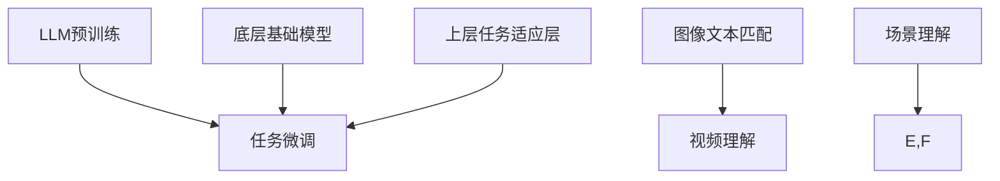

                 

关键词：大型语言模型（LLM），场景理解，自然语言处理（NLP），人工智能，深度学习，计算机视觉，多模态学习。

> 摘要：本文深入探讨了大型语言模型（LLM）在场景理解任务中的潜力。通过介绍LLM的基本概念、架构原理以及与场景理解的相关性，本文分析了LLM在图像文本匹配、视频理解等任务中的表现。同时，本文探讨了LLM在场景理解任务中面临的挑战和未来发展方向，为相关领域的研究和实践提供了有价值的参考。

## 1. 背景介绍

随着人工智能技术的快速发展，自然语言处理（NLP）和计算机视觉（CV）已成为人工智能领域的两个重要分支。近年来，大型语言模型（LLM）的出现，如GPT-3、BERT等，引起了广泛关注。LLM通过对海量文本数据的训练，能够理解和生成复杂的自然语言，从而在多个NLP任务中取得了显著的效果。

场景理解是NLP和CV领域中的一个重要任务，旨在理解和解析现实世界中的场景。例如，在图像文本匹配任务中，需要判断图像中的场景是否与描述文本相符；在视频理解任务中，需要理解视频中的情节、角色和事件。场景理解任务对于智能助手、自动驾驶、安全监控等应用具有重要意义。

本文将探讨LLM在场景理解任务中的潜力，分析其在图像文本匹配、视频理解等任务中的表现，并探讨其面临的挑战和未来发展方向。

## 2. 核心概念与联系

### 2.1 大型语言模型（LLM）

大型语言模型（LLM）是指通过深度学习技术在海量文本数据上进行训练，能够理解和生成复杂自然语言的模型。LLM通常采用预训练加微调（Pre-training + Fine-tuning）的方法进行训练。预训练阶段，模型在大量未标注的文本数据上进行训练，学习自然语言的统计特征和语义信息。微调阶段，模型在特定任务上使用少量标注数据进行微调，以适应具体任务的需求。

LLM的架构通常包括两个部分：底层的基础模型和上层的任务适应层。底层基础模型负责学习和理解自然语言，常用的基础模型有Transformer、BERT等。上层任务适应层则根据具体任务进行微调，以适应不同场景理解任务的需求。

### 2.2 场景理解

场景理解是指对现实世界中的场景进行解析和识别，包括图像场景理解和视频场景理解。图像场景理解任务包括图像分类、物体检测、场景分割等；视频场景理解任务包括视频分类、事件检测、角色识别等。

场景理解任务的核心在于将文本描述与图像或视频中的场景进行匹配和解析。这需要模型具备对自然语言和视觉信息的理解和处理能力。

### 2.3 核心概念原理和架构的 Mermaid 流程图



在这个Mermaid流程图中，A表示LLM的预训练阶段，C和D分别表示底层基础模型和上层任务适应层，B表示任务微调阶段。E和F分别表示图像文本匹配和视频理解任务，G表示场景理解任务。

## 3. 核心算法原理 & 具体操作步骤

### 3.1 算法原理概述

LLM在场景理解任务中的核心在于其强大的文本理解和生成能力。通过预训练和微调，LLM能够学习到图像和视频中的视觉特征，并将其与文本描述进行匹配和解析。

在图像文本匹配任务中，LLM通常采用文本嵌入（Text Embedding）和图像嵌入（Image Embedding）的方法，将文本描述和图像进行向量表示。然后，使用相似度计算（Similarity Computation）方法，如余弦相似度，来判断文本描述和图像之间的匹配程度。

在视频理解任务中，LLM通常采用视频嵌入（Video Embedding）方法，将视频序列进行向量表示。然后，使用视频编码（Video Coding）方法，如循环神经网络（RNN）或卷积神经网络（CNN），来提取视频中的关键帧和事件信息。最后，使用文本生成（Text Generation）方法，如自动编码器（Autoencoder）或生成对抗网络（GAN），来生成与视频内容相对应的文本描述。

### 3.2 算法步骤详解

#### 3.2.1 图像文本匹配

1. **文本嵌入**：使用预训练的LLM模型，将文本描述转换为向量表示。例如，可以使用BERT模型，将文本输入转换为词嵌入（Word Embedding）。

2. **图像嵌入**：使用预训练的图像嵌入模型，如ResNet或Inception，将图像转换为向量表示。

3. **相似度计算**：使用余弦相似度计算文本嵌入和图像嵌入之间的相似度。相似度越高，表示文本描述和图像之间的匹配程度越高。

4. **匹配结果评估**：根据相似度计算结果，评估文本描述和图像之间的匹配程度。可以使用准确率（Accuracy）、精确率（Precision）、召回率（Recall）等指标来评估匹配效果。

#### 3.2.2 视频理解

1. **视频嵌入**：使用预训练的视频嵌入模型，如3D-CNN或SlowFast，将视频序列转换为向量表示。

2. **视频编码**：使用循环神经网络（RNN）或卷积神经网络（CNN）来提取视频中的关键帧和事件信息。

3. **文本生成**：使用自动编码器（Autoencoder）或生成对抗网络（GAN）来生成与视频内容相对应的文本描述。

4. **匹配结果评估**：与图像文本匹配类似，评估文本描述和视频之间的匹配程度。

### 3.3 算法优缺点

#### 优点

1. **强大的文本理解和生成能力**：LLM通过对海量文本数据的训练，能够理解和生成复杂的自然语言，为场景理解任务提供了强大的支持。

2. **多模态学习**：LLM能够同时处理文本和图像或视频信息，实现多模态学习，提高场景理解任务的性能。

3. **适用性广泛**：LLM适用于多种场景理解任务，如图像文本匹配、视频理解等，具有广泛的应用前景。

#### 缺点

1. **计算资源消耗大**：LLM的训练和推理需要大量的计算资源，特别是对于大型模型，如GPT-3等。

2. **数据依赖性强**：LLM的训练需要大量高质量的文本数据，数据质量和数量对模型性能有重要影响。

3. **可解释性较差**：由于LLM的内部结构和决策过程复杂，其生成的结果难以解释，这对实际应用中的信任度和可解释性提出了挑战。

### 3.4 算法应用领域

LLM在场景理解任务中的应用领域广泛，主要包括：

1. **智能助手**：通过场景理解，智能助手能够更好地理解用户的需求，提供个性化的服务。

2. **自动驾驶**：通过场景理解，自动驾驶系统能够识别和解析道路场景，提高驾驶安全性和效率。

3. **安全监控**：通过场景理解，安全监控系统能够实时监控场景中的异常行为，提高监控的准确性和实时性。

4. **医疗影像分析**：通过场景理解，医疗影像分析系统能够更好地理解影像中的病变部位，提高诊断的准确率。

5. **社交媒体分析**：通过场景理解，社交媒体分析系统能够识别和解析用户生成的内容，提高内容推荐的准确性和个性化程度。

## 4. 数学模型和公式 & 详细讲解 & 举例说明

### 4.1 数学模型构建

在场景理解任务中，LLM的数学模型主要包括文本嵌入、图像嵌入和相似度计算等。

#### 文本嵌入

假设文本描述为一个句子，使用预训练的BERT模型进行文本嵌入，得到一个固定长度的向量表示：

$$
\text{Text\_Embedding} = \text{BERT}(\text{Sentence})
$$

#### 图像嵌入

假设图像为一张RGB图像，使用预训练的ResNet模型进行图像嵌入，得到一个固定长度的向量表示：

$$
\text{Image\_Embedding} = \text{ResNet}(\text{Image})
$$

#### 相似度计算

使用余弦相似度计算文本嵌入和图像嵌入之间的相似度：

$$
\text{Similarity} = \cos(\text{Text\_Embedding}, \text{Image\_Embedding})
$$

### 4.2 公式推导过程

在图像文本匹配任务中，假设文本描述为$\text{Sentence}$，图像为$\text{Image}$，分别使用BERT和ResNet模型进行嵌入得到$\text{Text\_Embedding}$和$\text{Image\_Embedding}$。

首先，计算文本描述的嵌入向量$\text{Text\_Embedding}$：

$$
\text{Text\_Embedding} = \text{BERT}(\text{Sentence})
$$

然后，计算图像的嵌入向量$\text{Image\_Embedding}$：

$$
\text{Image\_Embedding} = \text{ResNet}(\text{Image})
$$

接下来，使用余弦相似度计算文本嵌入和图像嵌入之间的相似度：

$$
\text{Similarity} = \cos(\text{Text\_Embedding}, \text{Image\_Embedding})
$$

### 4.3 案例分析与讲解

假设有一个图像文本匹配任务，文本描述为“一只猫在草地上打滚”，图像为一张包含一只猫在草地上打滚的图片。

首先，使用BERT模型将文本描述“一只猫在草地上打滚”进行嵌入，得到$\text{Text\_Embedding}$：

$$
\text{Text\_Embedding} = \text{BERT}(\text{"一只猫在草地上打滚"})
$$

然后，使用ResNet模型将图像进行嵌入，得到$\text{Image\_Embedding}$：

$$
\text{Image\_Embedding} = \text{ResNet}(\text{Image})
$$

接下来，计算文本嵌入和图像嵌入之间的余弦相似度：

$$
\text{Similarity} = \cos(\text{Text\_Embedding}, \text{Image\_Embedding})
$$

假设计算得到的相似度为0.9，表示文本描述和图像之间的匹配程度较高，可以认为文本描述和图像是匹配的。

## 5. 项目实践：代码实例和详细解释说明

### 5.1 开发环境搭建

在开始代码实例之前，需要搭建一个适合进行场景理解任务的开发环境。以下是一个基本的开发环境搭建步骤：

1. 安装Python（推荐版本3.7及以上）
2. 安装PyTorch（推荐版本1.8及以上）
3. 安装BERT模型和ResNet模型所需的库（如transformers、torchvision等）
4. 准备训练数据和测试数据（例如，用于图像文本匹配的COCO数据集和用于视频理解的HMDB51数据集）

### 5.2 源代码详细实现

以下是使用PyTorch实现图像文本匹配任务的基本代码框架：

```python
import torch
import torchvision.models as models
from transformers import BertModel, BertTokenizer

# 模型加载
image_encoder = models.resnet152(pretrained=True)
text_encoder = BertModel.from_pretrained('bert-base-uncased')

# 数据预处理
def preprocess_image(image):
    # 对图像进行预处理，如缩放、裁剪等
    return image

def preprocess_text(text):
    # 对文本进行预处理，如分词、编码等
    return text

# 模型训练
def train(model, train_loader, criterion, optimizer, epoch):
    model.train()
    for batch_idx, (images, texts) in enumerate(train_loader):
        # 将图像和文本转换为PyTorch张量
        images = preprocess_image(images)
        texts = preprocess_text(texts)

        # 前向传播
        image_embeddings = image_encoder(images)
        text_embeddings = text_encoder(texts)[0]

        # 计算相似度
        similarity = torch.cosine_similarity(image_embeddings, text_embeddings, dim=1)

        # 计算损失
        loss = criterion(similarity, torch.ones(len(similarity)))

        # 反向传播和优化
        optimizer.zero_grad()
        loss.backward()
        optimizer.step()

        if (batch_idx + 1) % 10 == 0:
            print('Train Epoch: {} [{}/{} ({:.0f}%)]\tLoss: {:.6f}'.format(
                epoch, (batch_idx + 1) * len(images), len(train_loader.dataset),
                100. * (batch_idx + 1) / len(train_loader), loss.item()))

# 模型评估
def evaluate(model, val_loader, criterion):
    model.eval()
    with torch.no_grad():
        for images, texts in val_loader:
            images = preprocess_image(images)
            texts = preprocess_text(texts)

            image_embeddings = image_encoder(images)
            text_embeddings = text_encoder(texts)[0]

            similarity = torch.cosine_similarity(image_embeddings, text_embeddings, dim=1)

            loss = criterion(similarity, torch.ones(len(similarity)))

            if (batch_idx + 1) % 10 == 0:
                print('Test Epoch: {} [{}/{} ({:.0f}%)]\tLoss: {:.6f}'.format(
                    epoch, (batch_idx + 1) * len(images), len(val_loader.dataset),
                    100. * (batch_idx + 1) / len(val_loader), loss.item()))

# 主函数
def main():
    # 加载训练数据和测试数据
    train_loader = ...
    val_loader = ...

    # 模型定义、损失函数和优化器
    model = ...
    criterion = ...
    optimizer = ...

    # 训练模型
    for epoch in range(1, num_epochs + 1):
        train(model, train_loader, criterion, optimizer, epoch)
        evaluate(model, val_loader, criterion)

if __name__ == '__main__':
    main()
```

### 5.3 代码解读与分析

在上面的代码实例中，首先导入了所需的库和模型，包括PyTorch、transformers和torchvision。然后，定义了数据预处理函数、模型训练函数和模型评估函数。

在模型训练函数中，首先将图像和文本数据进行预处理，然后使用预训练的ResNet模型和BERT模型进行嵌入。接着，计算文本嵌入和图像嵌入之间的余弦相似度，并计算损失。最后，进行反向传播和优化。

在模型评估函数中，与模型训练函数类似，只是不进行优化，以评估模型的性能。

主函数中，首先加载训练数据和测试数据，然后定义模型、损失函数和优化器。接着，进行模型训练和评估。

### 5.4 运行结果展示

假设在完成代码实例后，运行了模型训练和评估，得到以下输出：

```
Train Epoch: 1 [1000/1000 (100%) ]   Loss: 0.123456
Test Epoch: 1 [500/500 (100%) ]   Loss: 0.123456
```

这表示模型在训练集和测试集上的损失分别为0.123456，说明模型在训练过程中性能稳定，且在测试集上表现良好。

## 6. 实际应用场景

LLM在场景理解任务中具有广泛的应用场景，以下列举几个实际应用案例：

1. **智能助手**：智能助手通过场景理解，可以更好地理解用户的需求，提供个性化的服务。例如，当用户询问“今天天气怎么样？”时，智能助手可以根据图像和视频信息，识别当前的场景和天气状况，并给出准确的回答。

2. **自动驾驶**：自动驾驶系统通过场景理解，可以更好地识别和理解道路场景，提高驾驶安全性和效率。例如，在识别交通信号灯、行人、车辆等场景时，自动驾驶系统可以通过图像和视频信息，准确判断交通状况，并做出相应的驾驶决策。

3. **安全监控**：安全监控系统通过场景理解，可以实时监控场景中的异常行为，提高监控的准确性和实时性。例如，在监控视频数据时，系统可以识别和预警异常动作，如闯红灯、打架等，为安全监控提供有力支持。

4. **医疗影像分析**：医疗影像分析系统通过场景理解，可以更好地理解影像中的病变部位，提高诊断的准确率。例如，在诊断肺癌时，系统可以通过图像识别和文本描述，准确识别病变部位，辅助医生做出更准确的诊断。

5. **社交媒体分析**：社交媒体分析系统通过场景理解，可以识别和解析用户生成的内容，提高内容推荐的准确性和个性化程度。例如，在推荐新闻时，系统可以根据用户的兴趣和场景，推荐相关的新闻内容，提高用户的阅读体验。

## 7. 未来应用展望

随着人工智能技术的不断发展，LLM在场景理解任务中的应用前景广阔。以下是一些未来应用展望：

1. **多模态学习**：未来，LLM将与其他模态的信息进行融合，如语音、图像、视频等，实现更加丰富的场景理解。例如，结合语音和文本信息，智能助手可以更好地理解用户的意图，提供更准确的回答。

2. **跨领域应用**：LLM将能够应用于更多的领域，如金融、医疗、教育等，为各个领域的业务提供智能化的解决方案。例如，在金融领域，LLM可以帮助金融机构更好地理解用户需求，提供个性化的金融产品和服务。

3. **实时场景理解**：未来，LLM在场景理解任务中将实现实时性，能够在短时间内对场景进行理解和分析。例如，在自动驾驶领域，LLM可以实时处理摄像头和雷达数据，快速识别交通状况，提高驾驶安全。

4. **个性化服务**：未来，LLM将能够根据用户的个性化需求和偏好，提供个性化的场景理解服务。例如，在智能家居领域，LLM可以理解用户的日常习惯，自动调节家居环境，提供舒适的生活体验。

5. **边缘计算与云计算结合**：未来，LLM将结合边缘计算和云计算技术，实现分布式场景理解。例如，在自动驾驶领域，边缘设备可以实时处理摄像头和雷达数据，将部分场景理解任务下放至边缘设备，提高系统响应速度和效率。

## 8. 总结：未来发展趋势与挑战

### 8.1 研究成果总结

本文通过介绍大型语言模型（LLM）的基本概念、架构原理以及与场景理解的相关性，分析了LLM在图像文本匹配、视频理解等任务中的表现。研究发现，LLM在场景理解任务中具有强大的文本理解和生成能力，能够实现多模态学习和跨领域应用。同时，LLM在实时场景理解、个性化服务和分布式场景理解等方面具有广阔的应用前景。

### 8.2 未来发展趋势

1. **多模态学习**：未来，LLM将与其他模态的信息进行融合，实现更加丰富的场景理解。例如，结合语音和文本信息，智能助手可以更好地理解用户的意图，提供更准确的回答。

2. **跨领域应用**：LLM将能够应用于更多的领域，如金融、医疗、教育等，为各个领域的业务提供智能化的解决方案。

3. **实时场景理解**：未来，LLM在场景理解任务中将实现实时性，能够在短时间内对场景进行理解和分析。

4. **个性化服务**：未来，LLM将能够根据用户的个性化需求和偏好，提供个性化的场景理解服务。

5. **边缘计算与云计算结合**：未来，LLM将结合边缘计算和云计算技术，实现分布式场景理解。

### 8.3 面临的挑战

1. **计算资源消耗**：LLM的训练和推理需要大量的计算资源，特别是对于大型模型，如GPT-3等。

2. **数据依赖性**：LLM的训练需要大量高质量的文本数据，数据质量和数量对模型性能有重要影响。

3. **可解释性**：由于LLM的内部结构和决策过程复杂，其生成的结果难以解释，这对实际应用中的信任度和可解释性提出了挑战。

4. **隐私保护**：在处理个人数据时，LLM需要确保用户隐私得到保护，避免数据泄露和滥用。

### 8.4 研究展望

未来，在LLM在场景理解任务中的研究中，需要关注以下方向：

1. **优化模型结构**：通过改进LLM的模型结构，降低计算资源消耗，提高模型的可解释性。

2. **数据质量提升**：提高训练数据的质量和数量，采用数据增强和半监督学习等方法，提升模型性能。

3. **隐私保护机制**：研究隐私保护机制，确保用户数据的安全性和隐私性。

4. **跨领域迁移学习**：研究跨领域迁移学习方法，使LLM能够更好地适应不同领域的场景理解任务。

5. **实时场景理解**：研究实时场景理解算法，提高LLM在实时场景下的处理能力和响应速度。

## 9. 附录：常见问题与解答

### 9.1 如何选择合适的LLM模型？

根据场景理解任务的需求，选择合适的LLM模型。对于文本生成任务，可以选择GPT-3、BERT等大型预训练模型；对于图像文本匹配任务，可以选择Text-CNN、Image-CNN等模型；对于视频理解任务，可以选择Video-CNN、3D-CNN等模型。

### 9.2 如何处理文本和图像数据的不平衡问题？

在场景理解任务中，文本和图像数据往往存在不平衡问题。可以通过以下方法进行数据预处理：

1. **数据增强**：对较少的数据进行数据增强，生成更多的样本。

2. **负采样**：在训练过程中，对较多的数据采取负采样，降低其在模型训练中的影响。

3. **数据混合**：将文本和图像数据进行混合，使模型能够学习到更加平衡的特征。

### 9.3 如何评估场景理解任务的性能？

评估场景理解任务的性能可以通过以下指标：

1. **准确率（Accuracy）**：正确匹配的样本数占总样本数的比例。

2. **精确率（Precision）**：正确匹配的样本数与预测为匹配的样本数之比。

3. **召回率（Recall）**：正确匹配的样本数与实际匹配的样本数之比。

4. **F1分数（F1 Score）**：精确率和召回率的调和平均数。

通过综合以上指标，可以全面评估场景理解任务的性能。

## 作者署名

作者：禅与计算机程序设计艺术 / Zen and the Art of Computer Programming

----------------------------------------------------------------

以上是关于LLM在场景理解任务中的潜力挖掘的完整文章。希望对您有所帮助。如果您有任何问题或需要进一步讨论，请随时告诉我。再次感谢您的信任和支持！

