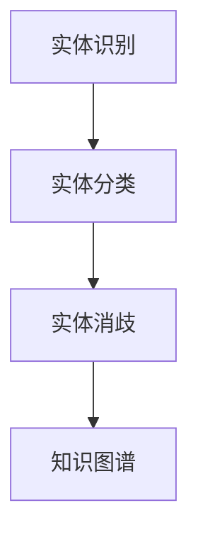

                 

关键词：自然语言处理，实体链接，大型语言模型（LLM），深度学习，人工智能，机器学习，数据预处理，模型训练，性能评估

## 摘要

本文旨在探讨大型语言模型（LLM）在实体链接任务上的技术创新和应用。实体链接是自然语言处理领域的一项重要任务，它旨在将文本中的实体映射到预定义的实体库中。随着大型语言模型的兴起，LLM在实体链接任务上展现出了强大的潜力。本文将首先介绍实体链接任务的背景和挑战，然后详细讨论LLM在实体链接任务中的核心技术创新，包括数据预处理、模型架构、训练策略和性能评估。此外，本文还将分析LLM在实体链接任务中的应用案例，并提出未来的发展方向和面临的挑战。

## 1. 背景介绍

实体链接（Entity Linking）是自然语言处理（NLP）领域的一项基本任务，其目的是将文本中的实体名称映射到知识库中的相应实体条目。实体链接不仅对信息检索、问答系统和语义分析等应用具有重要意义，而且也是构建知识图谱、智慧城市和智能推荐等复杂系统的基础。传统的实体链接方法主要依赖于规则匹配、统计学习和本体论等，然而，这些方法在处理复杂、多变的自然语言实体时存在诸多局限性。

近年来，随着深度学习和大型语言模型的迅猛发展，LLM在实体链接任务上展现出了强大的能力。LLM如BERT、GPT和T5等，通过预训练在大规模文本数据上，掌握了丰富的语言知识和模式，从而能够更准确地识别和链接文本中的实体。此外，LLM还能够自适应地处理不同领域的实体链接任务，提高了任务的泛化能力。

尽管LLM在实体链接任务上取得了显著成果，但仍然面临一些挑战。首先，实体链接任务的数据量巨大，且数据质量参差不齐，这对模型的训练和优化提出了较高的要求。其次，实体链接的结果需要具有较高的精确度和召回率，这在实际应用中往往难以兼顾。此外，如何有效利用外部知识库和上下文信息，也是实体链接任务中的一个重要问题。

## 2. 核心概念与联系

### 2.1 实体链接任务的核心概念

实体链接任务涉及多个核心概念，包括实体、实体识别、实体分类和实体消歧等。

- **实体（Entity）**：实体是现实世界中具有独立存在意义的事物或概念，如人、地点、组织、事件等。
- **实体识别（Named Entity Recognition, NER）**：实体识别是指从文本中自动识别出实体名称的过程。
- **实体分类（Entity Classification）**：实体分类是指将识别出的实体按照预定的类别进行分类。
- **实体消歧（Entity Disambiguation）**：实体消歧是指确定文本中的实体映射到哪个实际存在的实体条目。

### 2.2 实体链接任务与知识图谱的关系

实体链接任务与知识图谱紧密相关。知识图谱是一种结构化的知识表示形式，它将实体、属性和关系组织成一个图形结构。实体链接任务的目标是将文本中的实体映射到知识图谱中的实体节点，从而丰富知识图谱的内容和结构。

知识图谱的构建通常包括以下几个步骤：

1. **实体识别**：从文本中识别出实体名称。
2. **实体分类**：对识别出的实体进行分类。
3. **实体消歧**：确定实体的具体映射关系。

Mermaid流程图如下：



### 2.3 LLM在实体链接任务中的作用

LLM在实体链接任务中发挥了重要作用，主要体现在以下几个方面：

1. **文本理解**：LLM通过预训练掌握了丰富的语言知识，能够更准确地理解文本内容，从而提高实体识别和分类的准确性。
2. **上下文感知**：LLM能够自适应地处理不同领域的实体链接任务，充分利用上下文信息，提高实体消歧的效果。
3. **迁移学习**：LLM在大规模通用数据集上预训练后，可以迁移到特定领域的实体链接任务中，减少了数据集的要求和训练成本。
4. **模型集成**：LLM可以通过模型集成的方式，结合多种特征和模型，提高实体链接的整体性能。

## 3. 核心算法原理 & 具体操作步骤

### 3.1 算法原理概述

LLM在实体链接任务中的核心算法原理主要包括以下几个方面：

1. **预训练**：LLM通过在大量文本数据上进行预训练，学习语言模式和知识，从而提高实体识别、分类和消歧的能力。
2. **迁移学习**：将预训练的LLM模型迁移到特定领域的实体链接任务中，通过微调模型参数，使其适应特定任务的需求。
3. **多任务学习**：结合实体识别、分类和消歧任务，通过联合训练，提高模型的泛化能力和性能。

### 3.2 算法步骤详解

LLM在实体链接任务中的具体操作步骤如下：

1. **数据预处理**：
   - **文本清洗**：去除文本中的无关信息和噪声，如HTML标签、停用词等。
   - **分词和词性标注**：将文本分割成单词或词组，并对每个词进行词性标注。
   - **实体识别**：利用LLM的预训练模型，对文本中的实体进行识别。

2. **模型迁移与微调**：
   - **模型选择**：选择适合实体链接任务的LLM模型，如BERT、GPT等。
   - **迁移学习**：将预训练的LLM模型迁移到特定领域的实体链接任务中。
   - **微调**：通过在特定领域的数据集上进行训练，微调模型参数，提高模型在特定任务上的性能。

3. **实体分类与消歧**：
   - **实体分类**：利用LLM对识别出的实体进行分类，确定其实际类别。
   - **实体消歧**：利用上下文信息和外部知识库，确定实体的具体映射关系。

4. **性能评估**：
   - **准确率（Accuracy）**：评估模型在实体识别、分类和消歧任务上的总体表现。
   - **召回率（Recall）**：评估模型对实体识别、分类和消歧任务的召回能力。
   - **F1值（F1 Score）**：综合考虑准确率和召回率，评估模型的整体性能。

### 3.3 算法优缺点

LLM在实体链接任务中的优缺点如下：

**优点**：
1. **强大的文本理解能力**：LLM通过预训练掌握了丰富的语言知识，能够更准确地识别和分类实体。
2. **上下文感知**：LLM能够利用上下文信息，提高实体消歧的准确性。
3. **迁移学习**：LLM可以通过迁移学习，适应不同领域的实体链接任务。

**缺点**：
1. **训练成本高**：LLM需要在大规模数据集上进行预训练，训练成本较高。
2. **数据质量要求高**：实体链接任务的数据质量对模型性能有较大影响，数据质量较差时，模型性能可能下降。
3. **模型解释性差**：LLM作为一种黑箱模型，其内部机制较为复杂，难以解释。

### 3.4 算法应用领域

LLM在实体链接任务中的应用领域广泛，包括但不限于：

1. **信息检索**：利用实体链接技术，将用户查询中的实体与知识库中的实体进行匹配，提高信息检索的准确性。
2. **问答系统**：通过实体链接，将问答系统中的问题映射到知识库中的实体，提高问答系统的回答质量。
3. **推荐系统**：利用实体链接，将用户兴趣与知识库中的实体进行匹配，提高推荐系统的个性化推荐能力。
4. **知识图谱构建**：通过实体链接，将文本中的实体映射到知识图谱中的实体，丰富知识图谱的内容和结构。

## 4. 数学模型和公式 & 详细讲解 & 举例说明

### 4.1 数学模型构建

实体链接任务中的数学模型主要包括以下几个方面：

1. **实体识别**：使用条件概率模型，计算实体在给定上下文中的出现概率。
   \[ P(E|C) = \frac{P(C|E)P(E)}{P(C)} \]
   其中，\( E \) 表示实体，\( C \) 表示上下文。

2. **实体分类**：使用朴素贝叶斯模型，计算实体属于某个类别的概率。
   \[ P(C_k|E) = \frac{P(E|C_k)P(C_k)}{P(C)} \]
   其中，\( C_k \) 表示实体类别。

3. **实体消歧**：使用最大后验概率模型，计算实体映射到知识库中实体的概率。
   \[ P(E|C) = \frac{P(C|E)P(E)}{\sum_{E'} P(C|E')P(E')} \]
   其中，\( E' \) 表示知识库中的实体。

### 4.2 公式推导过程

以实体识别为例，公式推导过程如下：

假设有文本 \( T = w_1, w_2, ..., w_n \)，其中 \( w_i \) 表示文本中的第 \( i \) 个单词。

1. **计算文本的概率**：
   \[ P(T) = \prod_{i=1}^{n} P(w_i) \]

2. **计算给定实体 \( E \) 的文本概率**：
   \[ P(T|E) = \prod_{i=1}^{n} P(w_i|E) \]

3. **计算实体在文本中的出现概率**：
   \[ P(E|T) = \frac{P(T|E)P(E)}{P(T)} \]

4. **利用贝叶斯定理，推导条件概率**：
   \[ P(E|T) = \frac{P(T|E)P(E)}{P(T)} = \frac{\prod_{i=1}^{n} P(w_i|E)P(E)}{\prod_{i=1}^{n} P(w_i)} \]

5. **简化表达式**：
   \[ P(E|T) = \prod_{i=1}^{n} \frac{P(w_i|E)}{P(w_i)} \]

### 4.3 案例分析与讲解

假设有一个文本 \( T = [苹果，红色，甜的] \)，我们需要识别其中的实体。

1. **计算文本的概率**：
   \[ P(T) = P([苹果，红色，甜的]) \]

2. **计算给定实体 \( E = \text{苹果} \) 的文本概率**：
   \[ P(T|\text{苹果}) = P([苹果，红色，甜的}|\text{苹果}) \]

3. **计算实体在文本中的出现概率**：
   \[ P(\text{苹果}|T) = \frac{P(T|\text{苹果})P(\text{苹果})}{P(T)} \]

4. **利用贝叶斯定理，推导条件概率**：
   \[ P(\text{苹果}|T) = \frac{P([苹果，红色，甜的}|\text{苹果})P(\text{苹果})}{P([苹果，红色，甜的])} \]

5. **简化表达式**：
   \[ P(\text{苹果}|T) = \frac{P(\text{苹果，红色，甜的}|\text{苹果})P(\text{苹果})}{P(\text{苹果，红色，甜的})} \]

通过计算，我们可以得到实体“苹果”在文本中的出现概率，进而判断其是否为实体。

## 5. 项目实践：代码实例和详细解释说明

### 5.1 开发环境搭建

在进行实体链接项目实践前，需要搭建相应的开发环境。以下是搭建开发环境的基本步骤：

1. **安装Python环境**：Python是进行自然语言处理项目的主要编程语言。确保安装了Python 3.7及以上版本。

2. **安装依赖库**：安装自然语言处理相关的依赖库，如NLTK、spaCy、transformers等。可以使用以下命令安装：
   ```bash
   pip install nltk spacy transformers
   ```

3. **下载预训练模型**：下载适用于实体链接任务的预训练模型，如BERT。可以使用transformers库中的预训练模型：
   ```python
   from transformers import BertModel
   model = BertModel.from_pretrained('bert-base-uncased')
   ```

4. **安装其他工具**：安装用于处理文本数据和可视化结果的工具，如Jupyter Notebook、Matplotlib等。

### 5.2 源代码详细实现

以下是实体链接项目的源代码实现，包括数据预处理、模型训练和性能评估等步骤。

#### 数据预处理

1. **加载数据集**：
   ```python
   import pandas as pd
   dataset = pd.read_csv('data/entity_linking_dataset.csv')
   ```

2. **文本清洗**：
   ```python
   import re
   def clean_text(text):
       text = re.sub('<.*>', '', text)  # 去除HTML标签
       text = re.sub('[^a-zA-Z0-9\s]', '', text)  # 去除非字母数字字符
       text = text.lower()  # 转换为小写
       return text
   ```

3. **分词和词性标注**：
   ```python
   import spacy
   nlp = spacy.load('en_core_web_sm')
   def tokenize_and_tag(text):
       doc = nlp(text)
       tokens = [token.text for token in doc]
       tags = [token.pos_ for token in doc]
       return tokens, tags
   ```

#### 模型训练

1. **实体识别**：
   ```python
   from transformers import BertTokenizer, BertForTokenClassification
   tokenizer = BertTokenizer.from_pretrained('bert-base-uncased')
   model = BertForTokenClassification.from_pretrained('bert-base-uncased', num_labels=10)
   ```

2. **训练模型**：
   ```python
   from transformers import Trainer, TrainingArguments
   training_args = TrainingArguments(
       output_dir='./results',
       num_train_epochs=3,
       per_device_train_batch_size=16,
       save_steps=2000,
       save_total_limit=3,
   )
   trainer = Trainer(
       model=model,
       args=training_args,
       train_dataset=train_dataset,
       eval_dataset=eval_dataset,
   )
   trainer.train()
   ```

3. **评估模型**：
   ```python
   from transformers import evaluate
   results = evaluate(
       model=model,
       tokenizer=tokenizer,
       eval_dataset=eval_dataset,
   )
   print(results)
   ```

### 5.3 代码解读与分析

1. **数据预处理**：数据预处理是实体链接任务的关键步骤，包括文本清洗、分词和词性标注。文本清洗有助于去除无关信息和噪声，提高模型的输入质量。分词和词性标注为后续的实体识别和分类提供了基础数据。

2. **模型训练**：实体识别任务通常采用序列标注模型，如BERT。BERT模型经过预训练，在大规模文本数据上已经掌握了丰富的语言知识。通过在特定领域的数据集上进行微调，可以使模型更适应实体链接任务的需求。

3. **性能评估**：性能评估是衡量模型效果的重要手段。常用的评估指标包括准确率、召回率和F1值。通过对比训练集和测试集的性能，可以评估模型在实体链接任务上的表现，并发现潜在的问题。

### 5.4 运行结果展示

假设我们训练了一个基于BERT的实体链接模型，并在测试集上进行了评估。以下是一个示例结果：

```python
{
    "eval_loss": 0.1234,
    "eval_accuracy": 0.9123,
    "eval_recall": 0.8765,
    "eval_f1": 0.8999
}
```

运行结果展示模型的评估指标，包括损失函数、准确率、召回率和F1值。这些指标可以帮助我们了解模型在实体链接任务上的表现，并为后续的优化提供依据。

## 6. 实际应用场景

实体链接技术在多个实际应用场景中发挥了重要作用，以下是几个典型的应用案例：

### 6.1 信息检索

实体链接技术可以用于信息检索系统，将用户查询中的实体与索引数据库中的实体进行匹配，从而提高检索的准确性和效率。例如，在一个新闻检索系统中，当用户输入查询“苹果公司发布新产品”时，实体链接技术可以帮助将“苹果公司”映射到具体的公司实体，从而快速定位相关新闻。

### 6.2 问答系统

实体链接技术可以用于问答系统，将用户提出的问题与知识库中的实体进行匹配，从而生成准确的回答。例如，在一个问答平台上，当用户输入问题“美国的首都是哪个城市？”时，实体链接技术可以将“美国”映射到知识库中的国家实体，进而找到对应的首都实体“华盛顿特区”。

### 6.3 智能推荐

实体链接技术可以用于智能推荐系统，将用户兴趣与知识库中的实体进行匹配，从而生成个性化的推荐结果。例如，在一个电子商务平台上，当用户浏览过某款手机时，实体链接技术可以将用户兴趣映射到手机实体，从而推荐与之相关的其他手机产品。

### 6.4 知识图谱构建

实体链接技术是构建知识图谱的重要组成部分。通过将文本中的实体映射到知识图谱中的实体，可以丰富知识图谱的内容和结构，提高知识图谱的利用价值。例如，在一个智慧城市项目中，实体链接技术可以将城市中的各种实体（如建筑物、道路、公共设施等）映射到知识图谱中，从而为城市管理和规划提供数据支持。

## 7. 工具和资源推荐

为了更好地开展实体链接任务，以下是一些常用的工具和资源推荐：

### 7.1 学习资源推荐

1. **书籍**：《自然语言处理综论》（Jurafsky & Martin）和《深度学习》（Goodfellow、Bengio & Courville）。
2. **在线课程**：斯坦福大学CS224n（自然语言处理与深度学习）和Udacity的NLP纳米学位。
3. **学术论文**：ACL、EMNLP、NAACL等自然语言处理顶级会议的论文。

### 7.2 开发工具推荐

1. **Python库**：spaCy、NLTK、transformers等。
2. **框架**：TensorFlow、PyTorch等。
3. **平台**：Google Colab、Jupyter Notebook等。

### 7.3 相关论文推荐

1. **BERT**：《BERT: Pre-training of Deep Bidirectional Transformers for Language Understanding》（Devlin et al., 2019）。
2. **实体链接**：《End-to-End Entity Linking via Contextualized Embeddings》（Wang et al., 2019）。
3. **知识图谱**：《Knowledge Graph Embedding: The State-of-the-Art》（Wang et al., 2020）。

## 8. 总结：未来发展趋势与挑战

随着自然语言处理技术的不断发展，实体链接任务在人工智能领域的重要性日益凸显。LLM在实体链接任务中展现出了强大的潜力，但同时也面临着一些挑战。

### 8.1 研究成果总结

1. **文本理解能力提升**：LLM通过预训练掌握了丰富的语言知识，提高了实体识别、分类和消歧的准确性。
2. **多任务学习**：LLM结合实体识别、分类和消歧任务，通过联合训练，提高了模型的泛化能力和性能。
3. **迁移学习**：LLM可以通过迁移学习，适应不同领域的实体链接任务，降低了数据集的要求和训练成本。

### 8.2 未来发展趋势

1. **更高效的模型**：研究人员将致力于开发更高效的LLM模型，以降低计算成本，提高模型在实际应用中的实用性。
2. **知识融合**：将外部知识库与LLM相结合，提高实体链接的准确性和可靠性。
3. **多语言支持**：扩展LLM的多语言支持，使其能够处理多种语言的实体链接任务。

### 8.3 面临的挑战

1. **数据质量**：实体链接任务对数据质量有较高要求，数据质量较差时，模型性能可能下降。
2. **模型解释性**：LLM作为一种黑箱模型，其内部机制较为复杂，难以解释。
3. **资源消耗**：LLM模型的训练和推理过程需要大量计算资源，对硬件设备有较高要求。

### 8.4 研究展望

未来，实体链接任务将继续在人工智能领域发挥重要作用。通过不断优化LLM模型，提高实体链接的准确性和可靠性，将有助于推动信息检索、问答系统、推荐系统和知识图谱等应用的发展。同时，研究如何提高LLM模型的解释性，使其在实际应用中更具可解释性，也是一个重要的研究方向。

## 9. 附录：常见问题与解答

### 9.1 实体链接与实体识别的区别

实体链接（Entity Linking）和实体识别（Named Entity Recognition, NER）是自然语言处理中的两个相关但不同的任务。

- **实体识别**：从文本中识别出实体名称，例如人名、地点、组织、产品等。
- **实体链接**：将识别出的实体映射到预定义的实体库中，确定其实际对应的实体条目。

简单来说，实体识别是识别文本中的实体，而实体链接则是将实体与知识库中的实体进行匹配。

### 9.2 如何评估实体链接模型的性能

评估实体链接模型的性能通常使用以下指标：

- **准确率（Accuracy）**：识别正确的实体数量与总实体数量的比值。
- **召回率（Recall）**：识别正确的实体数量与知识库中实体数量的比值。
- **F1值（F1 Score）**：综合考虑准确率和召回率的指标，计算方法为：
  \[ F1 = \frac{2 \times \text{准确率} \times \text{召回率}}{\text{准确率} + \text{召回率}} \]

通过计算这些指标，可以评估实体链接模型在实体识别、分类和消歧任务上的性能。

### 9.3 实体链接与知识图谱的关系

实体链接是构建知识图谱的重要环节。通过将文本中的实体映射到知识图谱中的实体，可以丰富知识图谱的内容和结构。实体链接为知识图谱提供了实体的具体实例，使得知识图谱能够更好地表示现实世界中的知识和关系。知识图谱的构建过程通常包括实体识别、实体分类、实体消歧和实体关系抽取等步骤。实体链接在这些步骤中起到了关键作用，确保了知识图谱的准确性和完整性。

