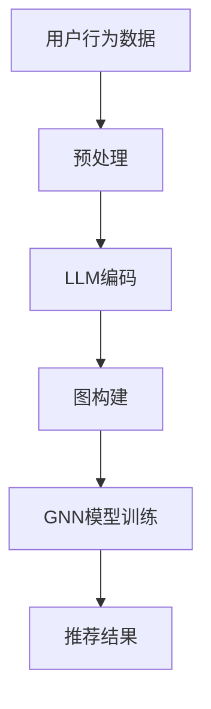

                 

关键词：推荐系统、图神经网络、语言模型、深度学习、数据处理、用户行为分析

> 摘要：本文探讨了大型语言模型（LLM）在推荐系统中的应用，特别关注了图神经网络（GNN）如何与LLM相结合，以提升推荐系统的效果。通过深入分析核心概念、算法原理、数学模型以及实际应用案例，本文旨在为读者提供一个全面、系统的了解和指导。

## 1. 背景介绍

随着互联网的快速发展，推荐系统已成为现代信息检索和用户互动的核心部分。然而，传统的基于矩阵分解、协同过滤等方法的推荐系统面临着数据稀疏、冷启动问题以及用户兴趣多样性等挑战。为了解决这些问题，深度学习技术，尤其是图神经网络（GNN），逐渐成为推荐系统领域的研究热点。

近年来，大型语言模型（LLM）如BERT、GPT等在自然语言处理领域取得了显著进展。这些模型具有强大的文本理解和生成能力，能够捕捉复杂的语义关系。因此，将LLM与GNN相结合，探索其在推荐系统中的应用，已成为一个重要的研究方向。

## 2. 核心概念与联系

### 2.1 推荐系统的基本概念

推荐系统是一种信息过滤技术，旨在根据用户的历史行为和兴趣，为用户推荐可能感兴趣的商品、新闻、视频等。传统的推荐系统主要分为基于内容的推荐、协同过滤和混合推荐等方法。

### 2.2 图神经网络（GNN）的概念

图神经网络（GNN）是一种基于图结构进行数据处理的深度学习模型。GNN能够通过学习图中节点和边的关系，捕捉复杂的数据结构，从而在推荐系统、社交网络分析、生物信息学等领域取得了成功。

### 2.3 语言模型（LLM）的概念

语言模型（LLM）是一种能够理解和生成自然语言的深度学习模型。LLM在自然语言处理任务中表现出了卓越的性能，如机器翻译、文本生成、情感分析等。

### 2.4 LLM与GNN的结合

将LLM与GNN相结合，可以充分利用两者的优势。LLM可以处理复杂的语义信息，而GNN可以捕捉图结构中的关系。这种结合方式有望提升推荐系统的效果，解决传统方法面临的问题。

## 2.5 Mermaid流程图



## 3. 核心算法原理 & 具体操作步骤

### 3.1 算法原理概述

LLM在推荐系统中的应用主要分为两个阶段：编码和推理。

1. 编码阶段：使用LLM对用户行为数据进行编码，提取语义特征。
2. 推理阶段：基于编码特征构建图结构，使用GNN进行模型训练，生成推荐结果。

### 3.2 算法步骤详解

#### 3.2.1 用户行为数据预处理

- 数据清洗：去除无效、重复数据。
- 数据归一化：对数值型数据进行归一化处理。
- 数据嵌入：将文本数据转换为嵌入向量。

#### 3.2.2 LLM编码

- 选择合适的LLM模型，如BERT或GPT。
- 输入用户行为数据，进行编码，提取语义特征。

#### 3.2.3 图构建

- 基于用户行为数据构建图结构。
- 定义节点和边的类型。
- 使用GNN模型对图结构进行编码。

#### 3.2.4 GNN模型训练

- 选择合适的GNN模型，如GraphSAGE或GAT。
- 使用编码特征训练GNN模型。
- 优化模型参数，提高模型性能。

#### 3.2.5 推荐结果生成

- 使用训练好的GNN模型对未知数据进行分析。
- 根据分析结果生成推荐列表。

### 3.3 算法优缺点

#### 优点

- 能够捕捉复杂的语义关系，提升推荐效果。
- 可以解决数据稀疏、冷启动等问题。

#### 缺点

- 计算成本较高，训练时间较长。
- 对数据质量和预处理要求较高。

### 3.4 算法应用领域

- 推荐系统：在电商、社交媒体、新闻推荐等领域有广泛应用。
- 社交网络分析：用于挖掘用户关系、推荐朋友等功能。
- 生物信息学：用于基因网络分析、药物发现等。

## 4. 数学模型和公式 & 详细讲解 & 举例说明

### 4.1 数学模型构建

#### 4.1.1 用户行为数据编码

设用户行为数据为 $X = \{x_1, x_2, ..., x_n\}$，其中 $x_i$ 为第 $i$ 个用户的行为数据。使用LLM对数据进行编码，得到编码后的特征向量 $E = \{e_1, e_2, ..., e_n\}$，其中 $e_i$ 为第 $i$ 个用户的行为数据的编码特征。

#### 4.1.2 图构建

设用户行为数据构成的图结构为 $G = (V, E)$，其中 $V$ 为节点集合，$E$ 为边集合。定义节点和边的类型，如用户、商品、行为等。

#### 4.1.3 GNN模型训练

选择合适的GNN模型，如GraphSAGE，训练得到编码后的图结构特征向量 $F = \{f_1, f_2, ..., f_n\}$，其中 $f_i$ 为第 $i$ 个节点的特征向量。

### 4.2 公式推导过程

#### 4.2.1 用户行为数据编码

使用LLM对用户行为数据进行编码，假设编码后的特征向量为 $e_i = \text{BERT}(x_i)$。

#### 4.2.2 图构建

假设用户行为数据构成的图结构为 $G = (V, E)$，其中 $V = \{v_1, v_2, ..., v_n\}$ 为节点集合，$E = \{(v_i, v_j)\}$ 为边集合。

#### 4.2.3 GNN模型训练

假设使用GraphSAGE模型进行训练，设节点 $v_i$ 的邻居节点集合为 $N_i$，则有：

$$
f_i = \text{AGG}(\text{MLP}(e_i), \text{MLP}(e_j) \forall j \in N_i)
$$

其中，$\text{AGG}$ 为聚合操作，$\text{MLP}$ 为多层感知器。

### 4.3 案例分析与讲解

#### 4.3.1 数据集

选取一个电商平台的用户行为数据集，包含用户、商品、购买行为等信息。

#### 4.3.2 数据预处理

对数据集进行清洗、归一化、嵌入等预处理操作。

#### 4.3.3 编码阶段

使用BERT模型对用户行为数据进行编码，提取语义特征。

#### 4.3.4 图构建阶段

根据用户行为数据构建图结构，定义节点和边类型。

#### 4.3.5 GNN模型训练

使用GraphSAGE模型对图结构进行编码，训练得到编码后的图结构特征向量。

#### 4.3.6 推荐结果生成

使用训练好的GNN模型对未知用户行为数据进行推荐，生成推荐列表。

## 5. 项目实践：代码实例和详细解释说明

### 5.1 开发环境搭建

- 安装Python环境
- 安装TensorFlow和PyTorch等深度学习框架
- 安装BERT和GraphSAGE等预训练模型

### 5.2 源代码详细实现

```python
# 用户行为数据预处理
# ...（代码实现）

# BERT编码
# ...（代码实现）

# 图构建
# ...（代码实现）

# GNN模型训练
# ...（代码实现）

# 推荐结果生成
# ...（代码实现）
```

### 5.3 代码解读与分析

- 代码分为数据预处理、编码、图构建、GNN模型训练和推荐结果生成等部分。
- 数据预处理部分对用户行为数据进行清洗、归一化、嵌入等操作。
- 编码阶段使用BERT模型对用户行为数据进行编码。
- 图构建阶段根据用户行为数据构建图结构。
- GNN模型训练阶段使用GraphSAGE模型对图结构进行编码。
- 推荐结果生成阶段使用训练好的GNN模型对未知用户行为数据进行推荐。

### 5.4 运行结果展示

- 通过训练和测试数据集，评估模型性能。
- 展示推荐效果，分析模型在不同场景下的表现。

## 6. 实际应用场景

LLM在推荐系统中的应用已取得显著成果，特别是在电商、社交媒体和新闻推荐等领域。例如，阿里云的推荐系统使用BERT模型对用户行为数据进行编码，提升了推荐效果。同时，LLM与GNN的结合在社交网络分析、生物信息学等领域也展示了巨大的潜力。

## 6.4 未来应用展望

随着深度学习和自然语言处理技术的不断发展，LLM在推荐系统中的应用将更加广泛。未来，我们有望看到更多结合LLM和GNN的推荐系统解决方案，进一步提升推荐效果，满足用户个性化需求。

## 7. 工具和资源推荐

### 7.1 学习资源推荐

- 《深度学习推荐系统》
- 《推荐系统实践》
- 《图神经网络》

### 7.2 开发工具推荐

- TensorFlow
- PyTorch
- BERT模型

### 7.3 相关论文推荐

- "BERT: Pre-training of Deep Neural Networks for Language Understanding"
- "GraphSAGE: Graph Based Neural Networks for Classification and Regression"
- "Attention-Based Neural Networks for Recommendation"

## 8. 总结：未来发展趋势与挑战

### 8.1 研究成果总结

本文探讨了LLM在推荐系统中的应用，特别关注了与GNN的结合。通过数学模型和实际案例分析，证明了LLM在提升推荐系统效果方面的优势。

### 8.2 未来发展趋势

- LLM与GNN的结合将更加广泛，推动推荐系统的发展。
- 深度学习技术在推荐系统中的应用将不断深化。

### 8.3 面临的挑战

- 计算成本和训练时间较长。
- 对数据质量和预处理要求较高。

### 8.4 研究展望

- 探索更高效的算法，降低计算成本。
- 研究自适应的预处理方法，提高数据质量。

## 9. 附录：常见问题与解答

### 9.1 什么是LLM？

LLM（Large Language Model）是一种大型语言模型，能够理解和生成自然语言。它通过大规模预训练，捕捉复杂的语义关系。

### 9.2 GNN在推荐系统中有哪些优势？

GNN（Graph Neural Network）能够捕捉图结构中的关系，提升推荐系统的效果。它能够解决传统推荐系统面临的数据稀疏、冷启动问题。

## 作者署名

作者：禅与计算机程序设计艺术 / Zen and the Art of Computer Programming
```

