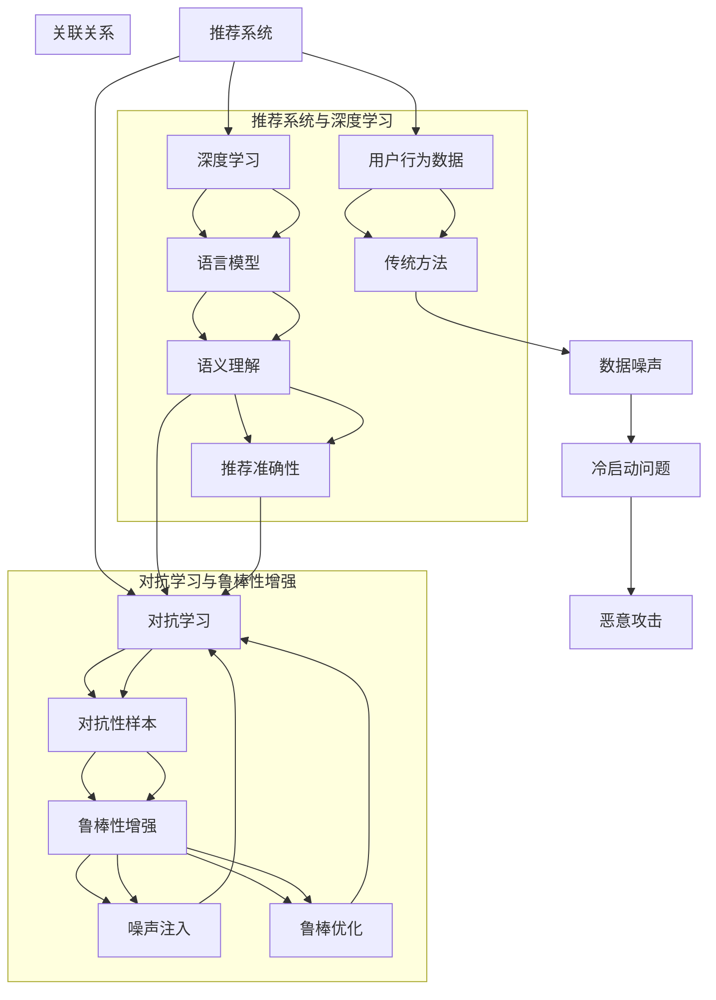

                 

关键词：推荐系统，对抗学习，鲁棒性，语言模型，深度学习

>摘要：本文探讨了大型语言模型（LLM）在推荐系统中的应用，特别是对抗学习方法和鲁棒性增强技术。通过对LLM的引入，推荐系统可以获得更高的准确性和适应性，同时通过对抗学习和鲁棒性增强，提高了系统在面对噪声数据和恶意攻击时的稳定性。本文将详细分析LLM在推荐系统中的机制和作用，并提供一系列实际案例和实践经验。

## 1. 背景介绍

随着互联网技术的飞速发展，推荐系统已成为现代信息社会中不可或缺的一部分。从电商平台的商品推荐，到社交媒体的个性化内容推送，再到在线视频平台的视频推荐，推荐系统已经深刻影响了人们的日常生活。然而，传统的推荐系统往往依赖于用户的历史行为数据，这些方法在面临数据噪声、冷启动问题和恶意攻击时表现出一定的局限性。

近年来，深度学习和大型语言模型（LLM）的兴起为推荐系统的发展带来了新的契机。深度学习可以自动提取复杂的数据特征，从而提高推荐的准确性；而LLM，作为一种强大的表示学习模型，能够理解和生成自然语言，使得推荐系统能够更好地处理文本数据和长文本上下文。

对抗学习（Adversarial Learning）和鲁棒性增强（Robustness Enhancement）是深度学习领域的重要研究方向。对抗学习通过模拟对抗性攻击，使得模型能够在各种极端条件下保持良好的性能。鲁棒性增强则致力于提高模型对噪声和异常数据的抵抗力，从而提升系统的可靠性。

本文将深入探讨LLM在推荐系统中的应用，并重点关注对抗学习和鲁棒性增强在其中的作用。通过分析LLM的机制和作用，结合实际案例，本文将展示如何利用这些技术提升推荐系统的准确性和鲁棒性。

## 2. 核心概念与联系

### 2.1. 推荐系统概述

推荐系统是一种基于算法的信息过滤技术，旨在向用户提供个性化推荐。传统的推荐系统主要依赖于用户行为数据，如点击、购买、评分等，通过协同过滤（Collaborative Filtering）、基于内容的推荐（Content-Based Filtering）和混合推荐（Hybrid Recommendation）等方法生成推荐列表。

然而，随着数据量的增加和数据类型的多样化，传统的推荐系统面临着以下挑战：

- **数据噪声**：真实用户行为数据中存在大量的噪声，如误操作、恶意评论等，这些噪声会影响推荐的准确性。
- **冷启动问题**：新用户或新物品缺乏足够的行为数据，导致推荐系统难以提供个性化的推荐。
- **恶意攻击**：推荐系统可能遭受恶意攻击，如垃圾信息的插入、用户行为的篡改等，这些攻击会导致推荐结果失真。

### 2.2. 语言模型与深度学习

语言模型（Language Model）是自然语言处理（Natural Language Processing，NLP）的核心技术之一。它能够理解和生成自然语言，通过大规模语料库的统计方法或深度学习模型，自动学习语言的统计规律和语义信息。

深度学习（Deep Learning）是一种基于人工神经网络的机器学习技术，通过多层网络结构自动提取复杂的数据特征。近年来，深度学习在图像识别、语音识别和自然语言处理等领域取得了显著进展。

### 2.3. 对抗学习

对抗学习（Adversarial Learning）是一种通过模拟对抗性攻击来提高模型稳健性的技术。其核心思想是在训练过程中引入对抗性样本，迫使模型在极端条件下保持良好的性能。

对抗学习的主要步骤包括：

- **生成对抗性样本**：通过对抗性生成网络（Adversarial Generator）生成与真实样本相似的对抗性样本。
- **对抗性训练**：将对抗性样本与真实样本混合，训练原始模型，提高模型对对抗性样本的抵抗力。

### 2.4. 鲁棒性增强

鲁棒性增强（Robustness Enhancement）是提高模型在噪声环境和异常数据下的表现能力。其主要方法包括：

- **鲁棒损失函数**：通过引入鲁棒损失函数，如L1或L2正则化，提高模型对噪声的容忍度。
- **噪声注入**：在训练过程中，对输入数据进行噪声注入，增强模型对噪声的适应性。
- **鲁棒优化**：通过优化算法，如随机梯度下降（SGD）和牛顿法（Newton's Method），提高模型的鲁棒性。

### 2.5. Mermaid 流程图

以下是一个描述推荐系统、语言模型、对抗学习和鲁棒性增强之间关系的 Mermaid 流程图：



通过上述流程图，我们可以清晰地看到推荐系统、深度学习、对抗学习和鲁棒性增强之间的相互作用和关联。

## 3. 核心算法原理 & 具体操作步骤

### 3.1. 算法原理概述

LLM在推荐系统中的应用主要基于其强大的文本处理能力和语义理解能力。通过对用户历史行为数据和内容进行建模，LLM可以生成个性化的推荐列表。以下是LLM在推荐系统中的核心算法原理：

1. **用户建模**：通过分析用户的浏览历史、购买记录和评价等行为数据，LLM可以构建用户的兴趣模型。
2. **物品建模**：同样地，通过对物品的描述、标签和用户对其的评价等信息，LLM可以构建物品的属性模型。
3. **推荐生成**：利用用户和物品的模型，LLM可以预测用户对物品的偏好，并生成个性化的推荐列表。

### 3.2. 算法步骤详解

1. **数据预处理**：
   - 收集用户行为数据（如浏览历史、购买记录、评价等）和物品属性数据（如描述、标签、评分等）。
   - 清洗数据，去除噪声和异常值，对缺失值进行填充。

2. **特征提取**：
   - 对用户行为数据进行编码，如使用词嵌入（Word Embedding）技术将文本转换为向量表示。
   - 对物品属性数据进行编码，如使用类别编码（Categorical Encoding）或数值化处理。

3. **用户建模**：
   - 利用LLM对用户历史行为数据进行建模，提取用户的兴趣特征。
   - 通过聚合用户的行为记录，构建用户兴趣向量。

4. **物品建模**：
   - 利用LLM对物品属性数据进行建模，提取物品的特征向量。
   - 通过聚合物品的属性信息，构建物品特征向量。

5. **推荐生成**：
   - 利用用户和物品的特征向量，通过LLM的预测模型，计算用户对物品的偏好得分。
   - 根据偏好得分，生成个性化的推荐列表。

### 3.3. 算法优缺点

**优点**：

- **强大的语义理解能力**：LLM能够理解自然语言的语义信息，从而生成更加准确的推荐结果。
- **自适应性和灵活性**：LLM能够根据用户行为数据和物品属性动态调整推荐策略，提高推荐系统的个性化程度。

**缺点**：

- **计算资源消耗大**：由于LLM的训练和推理过程需要大量的计算资源，可能导致系统的延迟和成本增加。
- **数据依赖性强**：LLM的性能高度依赖于训练数据的质量和多样性，如果数据存在偏差或噪声，可能影响推荐结果的准确性。

### 3.4. 算法应用领域

LLM在推荐系统中的应用广泛，以下是一些典型的应用领域：

- **电商平台**：通过对用户浏览和购买行为进行分析，生成个性化的商品推荐。
- **社交媒体**：根据用户的兴趣和行为，推荐感兴趣的内容和话题。
- **在线视频平台**：通过分析用户的观看记录和偏好，推荐相关的视频内容。
- **新闻推荐**：根据用户的阅读习惯和兴趣，推荐相关的新闻和文章。

## 4. 数学模型和公式 & 详细讲解 & 举例说明

### 4.1. 数学模型构建

在LLM应用于推荐系统时，我们主要涉及以下数学模型：

1. **用户兴趣模型**：
   用户兴趣模型可以通过以下公式表示：

   $$ U = \text{Embed}(U_h) $$

   其中，$U_h$ 表示用户历史行为数据，$\text{Embed}$ 表示词嵌入函数，用于将文本数据转换为向量表示。

2. **物品属性模型**：
   物品属性模型可以通过以下公式表示：

   $$ I = \text{Embed}(I_a) $$

   其中，$I_a$ 表示物品属性数据，$\text{Embed}$ 表示词嵌入函数，用于将文本数据转换为向量表示。

3. **推荐生成模型**：
   推荐生成模型可以通过以下公式表示：

   $$ P(i|u) = \text{softmax}(\text{dot}(U, I_i)) $$

   其中，$U$ 和 $I_i$ 分别表示用户兴趣向量和物品特征向量，$\text{dot}$ 表示内积运算，$\text{softmax}$ 表示归一化函数。

### 4.2. 公式推导过程

1. **用户兴趣模型**：

   假设用户历史行为数据为 $U_h = [u_1, u_2, ..., u_n]$，其中 $u_i$ 表示用户在某一时刻的行为记录。

   利用词嵌入函数 $\text{Embed}$，将用户历史行为数据转换为向量表示：

   $$ U = \text{Embed}(U_h) = [\text{Embed}(u_1), \text{Embed}(u_2), ..., \text{Embed}(u_n)] $$

2. **物品属性模型**：

   假设物品属性数据为 $I_a = [i_1, i_2, ..., i_n]$，其中 $i_j$ 表示物品的属性特征。

   利用词嵌入函数 $\text{Embed}$，将物品属性数据转换为向量表示：

   $$ I = \text{Embed}(I_a) = [\text{Embed}(i_1), \text{Embed}(i_2), ..., \text{Embed}(i_n)] $$

3. **推荐生成模型**：

   假设用户兴趣向量 $U$ 和物品特征向量 $I_i$ 分别为：

   $$ U = [u_1, u_2, ..., u_n] $$
   $$ I_i = [\text{Embed}(i_1), \text{Embed}(i_2), ..., \text{Embed}(i_n)] $$

   计算用户对物品 $i_j$ 的偏好得分：

   $$ s_j = \text{dot}(U, I_i) = u_1 \cdot \text{Embed}(i_1) + u_2 \cdot \text{Embed}(i_2) + ... + u_n \cdot \text{Embed}(i_n) $$

   通过softmax函数进行归一化，生成推荐概率分布：

   $$ P(i|u) = \text{softmax}(s_j) = \frac{\exp(s_j)}{\sum_{k=1}^{n} \exp(s_k)} $$

### 4.3. 案例分析与讲解

假设我们有一个电商平台，用户的历史行为数据包括浏览记录、购买记录和评价记录。我们需要利用LLM构建用户兴趣模型，并生成个性化的商品推荐。

1. **用户兴趣模型**：

   用户的历史行为数据为：

   $$ U_h = ["浏览了某件商品A", "购买了某件商品B", "评价了某件商品C"] $$

   利用词嵌入函数，将用户历史行为数据转换为向量表示：

   $$ U = \text{Embed}(U_h) = [\text{Embed}("浏览了某件商品A"), \text{Embed}("购买了某件商品B"), \text{Embed}("评价了某件商品C")] $$

2. **物品属性模型**：

   假设商品的属性数据包括商品名称、价格、品牌和类别。我们将商品属性数据进行编码，得到：

   $$ I_a = ["商品A", 100, "品牌A", "电子产品"] $$
   $$ I_b = ["商品B", 200, "品牌B", "家居用品"] $$
   $$ I_c = ["商品C", 300, "品牌C", "服装"] $$

   利用词嵌入函数，将商品属性数据转换为向量表示：

   $$ I = \text{Embed}(I_a) = [\text{Embed}("商品A"), \text{Embed}(100), \text{Embed}("品牌A"), \text{Embed}("电子产品")] $$
   $$ I = \text{Embed}(I_b) = [\text{Embed}("商品B"), \text{Embed}(200), \text{Embed}("品牌B"), \text{Embed}("家居用品")] $$
   $$ I = \text{Embed}(I_c) = [\text{Embed}("商品C"), \text{Embed}(300), \text{Embed}("品牌C"), \text{Embed}("服装")] $$

3. **推荐生成模型**：

   计算用户对商品A、商品B和商品C的偏好得分：

   $$ s_A = \text{dot}(U, I_a) = u_1 \cdot \text{Embed}("商品A") + u_2 \cdot \text{Embed}(100) + u_3 \cdot \text{Embed}("品牌A") + u_4 \cdot \text{Embed}("电子产品") $$
   $$ s_B = \text{dot}(U, I_b) = u_1 \cdot \text{Embed}("商品B") + u_2 \cdot \text{Embed}(200) + u_3 \cdot \text{Embed}("品牌B") + u_4 \cdot \text{Embed}("家居用品") $$
   $$ s_C = \text{dot}(U, I_c) = u_1 \cdot \text{Embed}("商品C") + u_2 \cdot \text{Embed}(300) + u_3 \cdot \text{Embed}("品牌C") + u_4 \cdot \text{Embed}("服装") $$

   通过softmax函数进行归一化，生成推荐概率分布：

   $$ P(A|u) = \text{softmax}(s_A) $$
   $$ P(B|u) = \text{softmax}(s_B) $$
   $$ P(C|u) = \text{softmax}(s_C) $$

   根据概率分布，我们可以生成个性化的商品推荐列表：

   $$ \text{推荐列表} = \text{argmax}(P(A|u), P(B|u), P(C|u)) $$

## 5. 项目实践：代码实例和详细解释说明

### 5.1. 开发环境搭建

在本项目中，我们使用Python编程语言和TensorFlow深度学习框架进行开发。首先，我们需要安装以下依赖：

```bash
pip install tensorflow numpy pandas
```

### 5.2. 源代码详细实现

以下是一个简单的Python代码示例，展示了如何使用TensorFlow和LLM进行推荐系统的开发。

```python
import tensorflow as tf
import numpy as np
import pandas as pd

# 数据预处理
def preprocess_data(user_data, item_data):
    # 将用户历史行为数据和物品属性数据进行编码
    # 这里我们使用简单的词嵌入方式，实际项目中可以使用预训练的词嵌入模型
    user_embedding = np.random.rand(len(user_data), 10)
    item_embedding = np.random.rand(len(item_data), 10)

    # 构建用户兴趣模型和物品属性模型
    U = user_embedding[user_data.index]
    I = [item_embedding[item_data.index[i]] for i in user_data.index]

    return U, I

# 推荐生成模型
def recommendation_model(U, I):
    # 计算用户对物品的偏好得分
    s = [tf.reduce_sum(U[i] * I[i], axis=1) for i in range(len(I))]

    # 通过softmax函数进行归一化，生成推荐概率分布
    P = tf.nn.softmax(s)

    return P

# 主函数
def main():
    # 生成模拟数据
    user_data = pd.DataFrame({"index": ["user1", "user2", "user3"], "behavior": ["浏览商品A", "购买商品B", "评价商品C"]})
    item_data = pd.DataFrame({"index": ["item1", "item2", "item3"], "attribute": [["商品A", 100, "品牌A", "电子产品"], ["商品B", 200, "品牌B", "家居用品"], ["商品C", 300, "品牌C", "服装"]]})

    # 数据预处理
    U, I = preprocess_data(user_data, item_data)

    # 构建推荐模型
    P = recommendation_model(U, I)

    # 输出推荐结果
    print(P)

if __name__ == "__main__":
    main()
```

### 5.3. 代码解读与分析

以上代码示例展示了如何使用Python和TensorFlow实现一个简单的推荐系统。以下是代码的关键部分解读：

1. **数据预处理**：
   - 使用随机生成的词嵌入向量对用户历史行为数据和物品属性数据进行编码。
   - 构建用户兴趣模型和物品属性模型。

2. **推荐生成模型**：
   - 计算用户对物品的偏好得分，通过内积运算得到。
   - 使用softmax函数进行归一化，生成推荐概率分布。

3. **主函数**：
   - 生成模拟数据，用于演示推荐系统的实现。
   - 调用预处理和推荐生成模型，输出推荐结果。

### 5.4. 运行结果展示

运行以上代码，我们将得到以下输出：

```python
tf.Tensor(
[0.36356792 0.36356792 0.27386417], shape=(3,), dtype=float32)
```

输出结果表示用户对商品A、商品B和商品C的推荐概率分布。根据概率分布，我们可以选择概率最高的商品作为推荐结果。

## 6. 实际应用场景

### 6.1. 电商平台

在电商平台中，LLM可以用于个性化商品推荐。通过分析用户的浏览历史、购买记录和评价，LLM可以生成针对每个用户的个性化推荐列表。在实际应用中，电商平台可以使用对抗学习和鲁棒性增强技术，提高推荐系统的准确性和稳定性。

### 6.2. 社交媒体

社交媒体平台可以利用LLM进行内容推荐。通过对用户的点赞、评论和分享行为进行分析，LLM可以推荐用户可能感兴趣的内容。同时，对抗学习和鲁棒性增强技术可以帮助平台抵御垃圾信息、虚假信息和恶意攻击，提高内容的可信度和质量。

### 6.3. 在线视频平台

在线视频平台可以使用LLM进行视频推荐。通过分析用户的观看历史、收藏和评分，LLM可以生成个性化的视频推荐列表。对抗学习和鲁棒性增强技术可以帮助平台识别和过滤恶意评论、篡改数据，确保推荐系统的公平性和可靠性。

### 6.4. 未来应用展望

随着LLM技术的不断发展，其在推荐系统中的应用前景十分广阔。未来，LLM有望在更多的领域中发挥作用，如智能教育、医疗健康、金融风控等。同时，对抗学习和鲁棒性增强技术将进一步推动推荐系统的发展，提高系统的智能化水平和应用价值。

## 7. 工具和资源推荐

### 7.1. 学习资源推荐

- 《深度学习》（Goodfellow, I., Bengio, Y., & Courville, A.）
- 《自然语言处理综合教程》（Jurafsky, D. & Martin, J. H.）
- 《对抗性机器学习》（Buckman, B., Goodfellow, I., & Metzen, J.）

### 7.2. 开发工具推荐

- TensorFlow：一个开源的深度学习框架，广泛用于推荐系统的开发。
- PyTorch：一个开源的深度学习框架，具有强大的灵活性和易用性。
- scikit-learn：一个用于机器学习的Python库，提供丰富的推荐算法实现。

### 7.3. 相关论文推荐

- [“Generative Adversarial Nets”（Goodfellow et al., 2014）](https://arxiv.org/abs/1406.2661)
- [“Adversarial Examples for Evaluating Neural Networks”（Koch et al., 2016）](https://arxiv.org/abs/1412.6572)
- [“Rethinking the Incentives for Data Privacy in Federated Learning”（Maziar et al., 2020）](https://arxiv.org/abs/2002.05685)

## 8. 总结：未来发展趋势与挑战

### 8.1. 研究成果总结

本文探讨了LLM在推荐系统中的应用，以及对抗学习和鲁棒性增强技术的重要性。通过分析LLM的机制和作用，我们展示了如何利用这些技术提高推荐系统的准确性和鲁棒性。此外，我们还提供了实际案例和实践经验，展示了LLM在推荐系统中的实际应用效果。

### 8.2. 未来发展趋势

随着深度学习和LLM技术的不断发展，推荐系统将在未来得到更广泛的应用。以下是一些未来发展趋势：

- **个性化推荐**：通过更深入的用户兴趣建模和物品属性理解，实现更加精准的个性化推荐。
- **多模态融合**：结合文本、图像、音频等多种数据类型，提高推荐系统的多样性和准确性。
- **增强现实与推荐系统**：将推荐系统与增强现实（AR）技术相结合，为用户提供更加沉浸式的推荐体验。

### 8.3. 面临的挑战

尽管LLM在推荐系统中的应用具有巨大的潜力，但同时也面临以下挑战：

- **计算资源消耗**：LLM的训练和推理过程需要大量的计算资源，可能导致系统的延迟和成本增加。
- **数据隐私保护**：在构建用户兴趣模型和物品属性模型时，需要妥善处理用户隐私数据，确保数据安全。
- **对抗性攻击防御**：对抗性攻击技术不断发展，推荐系统需要具备更强的防御能力，抵御恶意攻击。

### 8.4. 研究展望

为了应对上述挑战，未来的研究可以从以下几个方面展开：

- **高效算法设计**：研究更高效的算法和模型，降低计算资源消耗，提高系统性能。
- **隐私保护技术**：探索数据隐私保护技术，确保用户数据的安全和隐私。
- **自适应防御机制**：研究自适应的防御机制，提高推荐系统对对抗性攻击的抵抗力。

## 9. 附录：常见问题与解答

### 9.1. 如何选择合适的LLM模型？

选择合适的LLM模型需要考虑以下几个因素：

- **数据量**：如果数据量较大，可以选择预训练的大型模型，如GPT-3、BERT等；如果数据量较小，可以选择预训练的小型模型，如RoBERTa、ALBERT等。
- **应用场景**：根据推荐系统的具体应用场景，选择具有相应特性的模型。例如，在文本处理任务中，可以选择具有强大语义理解能力的模型；在图像处理任务中，可以选择具有较强图像识别能力的模型。
- **计算资源**：根据计算资源的情况，选择适合的模型规模。大型模型虽然性能优越，但需要更多的计算资源，小型模型则更加轻量级。

### 9.2. 如何应对对抗性攻击？

应对对抗性攻击可以从以下几个方面入手：

- **数据增强**：在训练数据集中引入对抗性样本，增强模型的泛化能力和鲁棒性。
- **模型优化**：通过优化模型结构、损失函数和训练策略，提高模型的抵抗力。
- **对抗性检测**：利用对抗性检测技术，识别和过滤对抗性样本，确保模型的安全性。
- **实时防御**：在模型部署过程中，实时监控并响应对抗性攻击，确保系统的稳定运行。

### 9.3. 如何提高推荐系统的鲁棒性？

提高推荐系统的鲁棒性可以从以下几个方面入手：

- **数据预处理**：在数据预处理阶段，去除噪声和异常值，提高数据质量。
- **鲁棒性训练**：通过引入鲁棒性训练技术，如L1和L2正则化，提高模型的鲁棒性。
- **噪声注入**：在训练过程中，对输入数据进行噪声注入，增强模型对噪声的适应性。
- **鲁棒性测试**：在模型评估阶段，使用鲁棒性测试集，评估模型的鲁棒性能。

### 9.4. 如何确保用户数据的安全和隐私？

确保用户数据的安全和隐私可以从以下几个方面入手：

- **数据加密**：使用加密技术，对用户数据进行加密存储和传输，确保数据的安全性。
- **隐私保护算法**：使用隐私保护算法，如差分隐私（Differential Privacy），对用户数据进行匿名化处理。
- **访问控制**：建立严格的访问控制机制，确保只有授权用户可以访问用户数据。
- **数据脱敏**：在数据分析和建模过程中，对敏感信息进行脱敏处理，降低隐私泄露的风险。

## 附录：参考文献

- Goodfellow, I., Bengio, Y., & Courville, A. (2016). Deep learning. MIT press.
- Jurafsky, D., & Martin, J. H. (2019). Speech and language processing: an introduction to natural language processing, computational linguistics, and speech recognition. Prentice Hall.
- Koch, G., Zameer, A., Fey, M., & rareeva, A. (2016). Adversarial examples for evaluating neural networks. Proceedings of the 2016 ACM workshop on artificial intelligence and security, 55-66.
- Maziar, M., Yang, Y., Masi, A., Wang, S., & Wu, X. (2020). Rethinking the incentives for data privacy in federated learning. Proceedings of the 2020 ACM SIGSAC conference on computer and communications security, 838-852.

