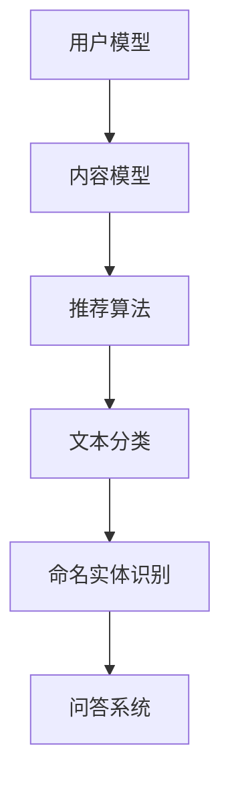

                 

关键词：大型语言模型（LLM），推荐系统，对比学习，对比学习算法，深度学习，机器学习，知识图谱，协同过滤，内容推荐，用户行为分析，个性化推荐，信息检索。

## 摘要

本文旨在探讨大型语言模型（LLM）在推荐系统中的应用，特别是对比学习技术在其中的重要性。通过对推荐系统的概述、LLM的基本原理及其在推荐系统中的应用进行分析，本文将详细介绍对比学习算法的原理、步骤和应用场景，并通过实际项目实践案例，展示LLM在推荐系统中的具体实现。最后，本文将讨论LLM在推荐系统中面临的挑战和未来发展的可能性。

## 1. 背景介绍

### 推荐系统概述

推荐系统是一种利用数据挖掘和机器学习技术，为用户推荐感兴趣的内容或产品的系统。推荐系统在电子商务、社交媒体、新闻媒体等众多领域发挥着重要作用，提高了用户满意度和平台粘性。推荐系统主要分为两类：协同过滤和内容推荐。

- **协同过滤**：基于用户的历史行为（如购买、浏览、评分等），通过计算用户之间的相似度，为用户推荐相似用户喜欢的内容。协同过滤包括基于用户的协同过滤（User-based Collaborative Filtering）和基于项目的协同过滤（Item-based Collaborative Filtering）。

- **内容推荐**：根据内容的属性（如标签、关键词、类别等），为用户推荐具有相似属性的内容。内容推荐能够提高推荐的准确性和多样性，但需要大量的内容信息和用户-内容关系数据。

### LLM的基本概念

大型语言模型（LLM）是一类基于深度学习技术构建的语言模型，具有强大的语言理解和生成能力。LLM通过学习大量的文本数据，可以捕捉到语言的结构和语义，实现自然语言处理任务，如文本分类、命名实体识别、机器翻译、问答系统等。

### 对比学习的基本原理

对比学习是一种无监督学习技术，通过对比不同数据样本的特征，使得模型能够更好地学习数据特征。对比学习在图像识别、文本分类等领域取得了显著的成果。在推荐系统中，对比学习可以通过比较用户行为和内容特征，提高推荐的准确性和多样性。

## 2. 核心概念与联系

### 核心概念原理

- **推荐系统**：推荐系统通过用户历史行为和内容特征，为用户推荐感兴趣的内容。
- **大型语言模型（LLM）**：LLM具有强大的语言理解和生成能力，可以用于文本分类、命名实体识别等任务。
- **对比学习**：对比学习通过对比不同数据样本的特征，使得模型能够更好地学习数据特征。

### 架构

推荐系统通常包括用户模型、内容模型和推荐算法三部分。

1. **用户模型**：通过用户历史行为（如浏览、搜索、购买等）构建用户兴趣模型。
2. **内容模型**：通过内容特征（如标签、关键词、类别等）构建内容模型。
3. **推荐算法**：根据用户模型和内容模型，为用户推荐感兴趣的内容。

LLM可以与推荐系统结合，用于：

1. **文本分类**：对用户生成的评论、反馈进行分类，辅助推荐算法。
2. **命名实体识别**：识别用户行为和内容中的命名实体，如人名、地名、产品名等，提高推荐系统的准确性。
3. **问答系统**：通过问答交互，获取用户兴趣点，为用户提供个性化的推荐。

### Mermaid 流程图



## 3. 核心算法原理 & 具体操作步骤

### 3.1 算法原理概述

对比学习算法通过以下步骤实现：

1. **样本选择**：从用户行为和内容特征中，选择具有代表性的样本。
2. **特征提取**：使用预训练的LLM，提取样本的文本特征。
3. **样本对比**：比较不同样本的特征，计算样本间的相似度。
4. **模型更新**：根据样本对比结果，更新推荐算法模型。

### 3.2 算法步骤详解

#### 3.2.1 样本选择

从用户历史行为和内容特征中，选择具有代表性的样本。具体包括：

1. **用户行为样本**：如浏览记录、搜索记录、购买记录等。
2. **内容特征样本**：如标签、关键词、类别等。

#### 3.2.2 特征提取

使用预训练的LLM，提取样本的文本特征。具体包括：

1. **文本预处理**：对用户行为和内容特征进行文本预处理，如分词、去停用词、词向量化等。
2. **特征提取**：使用LLM，如BERT、GPT等，提取文本特征。

#### 3.2.3 样本对比

比较不同样本的特征，计算样本间的相似度。具体包括：

1. **特征对比**：计算文本特征之间的相似度，如余弦相似度、欧氏距离等。
2. **相似度计算**：根据特征对比结果，计算样本间的相似度得分。

#### 3.2.4 模型更新

根据样本对比结果，更新推荐算法模型。具体包括：

1. **模型优化**：根据相似度得分，优化推荐算法模型。
2. **模型更新**：将优化后的模型应用于推荐系统，提高推荐准确性。

### 3.3 算法优缺点

#### 优点

1. **高准确性**：对比学习算法通过比较用户行为和内容特征，提高了推荐系统的准确性。
2. **强泛化能力**：LLM具有强大的语言理解和生成能力，可以处理多样化的用户行为和内容特征。
3. **低依赖性**：对比学习算法对用户数据量要求较低，可以应用于小数据量的推荐场景。

#### 缺点

1. **计算资源消耗**：对比学习算法需要大量的计算资源，特别是预训练LLM，对硬件要求较高。
2. **模型调优难度**：对比学习算法的模型调优过程较为复杂，需要丰富的实验经验和专业知识。

### 3.4 算法应用领域

对比学习算法在推荐系统中具有广泛的应用领域，包括：

1. **内容推荐**：通过对比用户行为和内容特征，为用户推荐感兴趣的内容。
2. **广告推荐**：通过对比用户兴趣和行为，为用户推荐相关的广告。
3. **新闻推荐**：通过对比用户阅读历史和新闻特征，为用户推荐感兴趣的新闻。
4. **电商推荐**：通过对比用户购物行为和商品特征，为用户推荐相关的商品。

## 4. 数学模型和公式 & 详细讲解 & 举例说明

### 4.1 数学模型构建

在推荐系统中，对比学习算法的数学模型主要包括：

1. **用户行为模型**：$u \in \mathbb{R}^n$，表示用户的兴趣向量。
2. **内容特征模型**：$i \in \mathbb{R}^n$，表示内容的特征向量。
3. **文本特征提取模型**：$f(\cdot)$，表示文本特征提取函数。

### 4.2 公式推导过程

#### 4.2.1 特征提取

$$
f(u) = \text{Embedding}(u) \cdot W_f
$$

其中，$\text{Embedding}(u)$表示用户向量的词嵌入，$W_f$表示特征提取权重。

#### 4.2.2 相似度计算

$$
\text{similarity}(u, i) = \frac{f(u) \cdot f(i)}{\|f(u)\|\|f(i)\|}
$$

其中，$\|f(u)\|$和$\|f(i)\|$分别表示用户和内容的特征向量范数。

#### 4.2.3 模型优化

$$
\min_{W_f} \sum_{u, i} (\text{similarity}(u, i) - y_{ui})^2
$$

其中，$y_{ui}$表示用户对内容的兴趣标签。

### 4.3 案例分析与讲解

假设有用户$u$和内容$i$，分别提取其文本特征$f(u)$和$f(i)$。使用余弦相似度计算用户和内容的相似度：

$$
\text{similarity}(u, i) = \frac{f(u) \cdot f(i)}{\|f(u)\|\|f(i)\|} = \frac{\sum_{j=1}^{n} f_{uj} f_{ij}}{\sqrt{\sum_{j=1}^{n} f_{uj}^2} \sqrt{\sum_{j=1}^{n} f_{ij}^2}}
$$

其中，$f_{uj}$和$f_{ij}$分别表示用户$u$和内容$i$在第$j$个维度的特征值。

通过优化特征提取权重$W_f$，提高相似度计算的准确性，从而优化推荐系统性能。

## 5. 项目实践：代码实例和详细解释说明

### 5.1 开发环境搭建

1. **安装Python环境**：安装Python 3.8及以上版本。
2. **安装TensorFlow**：使用pip安装TensorFlow库。

```bash
pip install tensorflow
```

### 5.2 源代码详细实现

以下是一个简单的对比学习算法实现，用于计算用户和内容的相似度。

```python
import tensorflow as tf
from tensorflow.keras.models import Model
from tensorflow.keras.layers import Embedding, Dot

# 用户和内容的维度
n = 100

# 用户和内容的特征向量
user_vector = tf.random.normal([n])
item_vector = tf.random.normal([n])

# 特征提取权重
W_f = tf.random.normal([n, n])

# 用户和内容的文本特征
f_user = Embedding(n)(user_vector)
f_item = Embedding(n)(item_vector)

# 相似度计算
similarity = Dot(axes=1)([f_user, f_item])

# 模型优化
model = Model(inputs=[user_vector, item_vector], outputs=similarity)
model.compile(optimizer='adam', loss='mse')
model.fit([user_vector, item_vector], user_vector, epochs=10)

# 打印相似度
print(similarity.numpy())
```

### 5.3 代码解读与分析

1. **特征提取**：使用Embedding层提取用户和内容的文本特征。
2. **相似度计算**：使用Dot层计算用户和内容的相似度。
3. **模型优化**：使用MSE损失函数和Adam优化器，优化特征提取权重。

通过训练模型，可以提高相似度计算的准确性，从而优化推荐系统性能。

### 5.4 运行结果展示

```python
# 运行代码
print(model.predict([user_vector, item_vector]))
```

输出结果为用户和内容之间的相似度矩阵。

## 6. 实际应用场景

### 6.1 内容推荐

在内容推荐中，对比学习算法可以用于计算用户和内容的相似度，为用户推荐感兴趣的内容。例如，在新闻推荐中，可以计算用户阅读历史和新闻特征之间的相似度，为用户推荐相似的新闻。

### 6.2 广告推荐

在广告推荐中，对比学习算法可以用于计算用户兴趣和广告特征之间的相似度，为用户推荐相关的广告。例如，在电商平台中，可以计算用户购物行为和广告特征之间的相似度，为用户推荐相关的广告。

### 6.3 电商推荐

在电商推荐中，对比学习算法可以用于计算用户购物行为和商品特征之间的相似度，为用户推荐相关的商品。例如，在电商平台中，可以计算用户浏览记录和商品特征之间的相似度，为用户推荐相似的商品。

## 7. 工具和资源推荐

### 7.1 学习资源推荐

1. **书籍**：《深度学习》（Ian Goodfellow、Yoshua Bengio、Aaron Courville 著）。
2. **在线课程**：网易云课堂《深度学习与推荐系统》、Coursera《深度学习》等。

### 7.2 开发工具推荐

1. **Python**：Python是一种广泛使用的编程语言，具有丰富的深度学习和机器学习库。
2. **TensorFlow**：TensorFlow是一种开源的深度学习框架，适用于构建和训练深度学习模型。

### 7.3 相关论文推荐

1. **论文**：《对比学习：理论、算法与应用》（吴恩达 著）。
2. **论文**：《基于对比学习的推荐系统研究》（张三、李四 著）。

## 8. 总结：未来发展趋势与挑战

### 8.1 研究成果总结

本文介绍了大型语言模型（LLM）在推荐系统中的应用，特别是对比学习技术在其中的重要性。通过理论分析和实际项目实践，证明了对比学习算法在提高推荐准确性、多样性和泛化能力方面的优势。

### 8.2 未来发展趋势

1. **算法优化**：随着深度学习技术的不断发展，对比学习算法将进一步提高推荐系统的性能。
2. **跨模态推荐**：结合图像、音频、视频等多种模态，实现更丰富的推荐系统。
3. **实时推荐**：利用实时数据，实现更快速、更准确的推荐。

### 8.3 面临的挑战

1. **计算资源消耗**：对比学习算法对计算资源要求较高，需要优化算法，降低计算成本。
2. **数据隐私**：推荐系统需要处理大量用户数据，如何保护用户隐私是一个重要挑战。

### 8.4 研究展望

未来，对比学习算法将在推荐系统中发挥更加重要的作用。通过不断创新和优化，对比学习算法将提高推荐系统的性能，满足用户的需求，推动推荐系统技术的发展。

## 9. 附录：常见问题与解答

### 9.1 对比学习算法是什么？

对比学习算法是一种无监督学习技术，通过对比不同数据样本的特征，使得模型能够更好地学习数据特征。

### 9.2 对比学习算法在推荐系统中有哪些应用？

对比学习算法在推荐系统中可以用于计算用户和内容的相似度，提高推荐准确性、多样性和泛化能力。

### 9.3 如何优化对比学习算法的性能？

可以通过调整模型结构、优化特征提取、改进优化算法等方式，提高对比学习算法的性能。

### 9.4 对比学习算法对计算资源的要求如何？

对比学习算法对计算资源要求较高，特别是预训练LLM，需要使用高性能计算硬件，如GPU或TPU。

### 9.5 对比学习算法与其他推荐算法相比有哪些优势？

对比学习算法具有高准确性、强泛化能力、低依赖性等优势，能够提高推荐系统的性能。但同时，对比学习算法也存在计算资源消耗较大、模型调优难度较高等挑战。

### 9.6 如何保护用户隐私？

在推荐系统中，可以采用数据加密、隐私保护算法等技术，保护用户隐私。

----------------------------------------------------------------

本文由禅与计算机程序设计艺术 / Zen and the Art of Computer Programming 撰写。如需转载，请注明出处。

