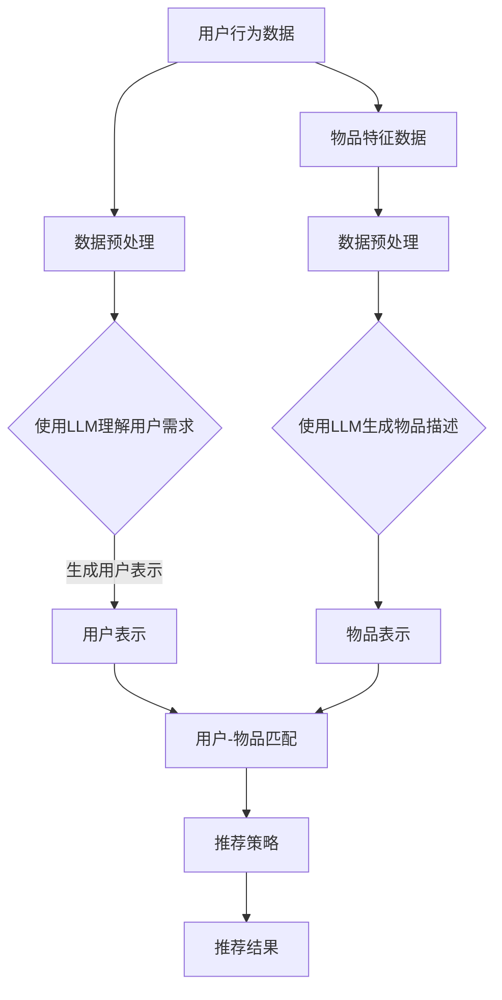

                 

关键词：推荐系统，LLM，持续学习，应用场景，数学模型，代码实例

> 摘要：本文深入探讨了大规模语言模型（LLM）在推荐系统中的持续学习应用，通过详细分析核心概念、算法原理、数学模型以及项目实践，揭示了LLM在提高推荐系统准确性和效率方面的巨大潜力。文章旨在为读者提供一个全面的技术视角，以更好地理解和应用LLM在推荐系统中的前沿技术。

## 1. 背景介绍

### 1.1 推荐系统的发展历程

推荐系统作为一种信息过滤技术，旨在根据用户的历史行为和偏好为用户推荐相关的内容或产品。自20世纪90年代以来，推荐系统经历了从基于内容的过滤、协同过滤到混合推荐系统等多个阶段的发展。

- **基于内容的过滤**：推荐系统根据用户已知的偏好和兴趣，分析内容特征，将相似的内容推荐给用户。

- **协同过滤**：通过分析用户之间的相似性，预测用户对未知内容的偏好。协同过滤分为基于用户的协同过滤和基于项目的协同过滤。

- **混合推荐系统**：结合基于内容和协同过滤的优点，利用多种方法进行推荐。

### 1.2 大规模语言模型（LLM）的兴起

近年来，随着深度学习和自然语言处理技术的发展，大规模语言模型（LLM）如BERT、GPT-3等取得了显著的进展。LLM通过预训练和微调，能够理解和生成高质量的文本，为推荐系统提供了新的技术途径。

## 2. 核心概念与联系

### 2.1 推荐系统中的关键概念

- **用户行为**：用户在系统上的点击、购买、评论等行为数据。

- **物品特征**：物品的属性、标签、分类等信息。

- **推荐策略**：推荐系统采用的算法和技术，如协同过滤、内容推荐等。

### 2.2 LLM在推荐系统中的应用

LLM在推荐系统中的应用主要体现在以下几个方面：

- **用户理解**：通过分析用户的文本评论、提问等，LLM可以更深入地理解用户的需求和兴趣。

- **物品描述**：LLM可以对物品的文本描述进行生成或改进，提高物品的描述质量。

- **上下文感知**：LLM能够处理复杂的上下文信息，为推荐系统提供更加精准的推荐。

### 2.3 Mermaid 流程图



## 3. 核心算法原理 & 具体操作步骤

### 3.1 算法原理概述

LLM在推荐系统中的核心算法原理主要包括以下几个步骤：

1. **用户理解**：利用LLM分析用户的文本数据，提取用户的需求和兴趣。

2. **物品描述**：利用LLM生成或改进物品的文本描述。

3. **用户-物品匹配**：将用户表示和物品表示进行匹配，计算相似度。

4. **推荐策略**：根据匹配结果和推荐策略，生成推荐结果。

### 3.2 算法步骤详解

1. **用户理解**：

   - 输入：用户的文本评论、提问等。
   - 输出：用户需求表示。

2. **物品描述**：

   - 输入：物品的原始文本描述。
   - 输出：改进后的物品描述。

3. **用户-物品匹配**：

   - 输入：用户需求表示和物品描述。
   - 输出：用户-物品匹配结果。

4. **推荐策略**：

   - 输入：用户-物品匹配结果。
   - 输出：推荐结果。

### 3.3 算法优缺点

- **优点**：

  - 高效：LLM能够快速处理大量的文本数据。

  - 准确：LLM能够深入理解用户的需求和兴趣。

  - 可扩展：LLM可以应用于各种类型的推荐场景。

- **缺点**：

  - 资源消耗：LLM的预训练需要大量的计算资源和时间。

  - 解释性：LLM生成的结果可能难以解释。

### 3.4 算法应用领域

LLM在推荐系统中的应用非常广泛，包括电子商务、新闻推荐、社交媒体等多个领域。以下是一些具体的应用场景：

- **电子商务**：利用LLM分析用户的购买记录和评论，为用户推荐相关商品。

- **新闻推荐**：利用LLM分析用户的阅读历史和偏好，为用户推荐相关新闻。

- **社交媒体**：利用LLM分析用户的文本内容，为用户推荐感兴趣的内容。

## 4. 数学模型和公式 & 详细讲解 & 举例说明

### 4.1 数学模型构建

LLM在推荐系统中的数学模型主要包括以下几个部分：

1. **用户表示**：

   - 输入：用户文本数据。
   - 输出：用户需求表示。

2. **物品表示**：

   - 输入：物品文本描述。
   - 输出：物品表示。

3. **用户-物品匹配**：

   - 输入：用户需求表示和物品表示。
   - 输出：用户-物品匹配结果。

### 4.2 公式推导过程

用户表示和物品表示的生成过程可以表示为：

- 用户表示：\( U = f(U', \theta) \)
- 物品表示：\( V = g(V', \theta) \)

其中，\( U' \)和\( V' \)分别为用户文本数据和物品文本描述，\( \theta \)为模型参数。

用户-物品匹配结果可以表示为：

- 匹配结果：\( R = h(U, V) \)

其中，\( h \)为匹配函数。

### 4.3 案例分析与讲解

假设有一个用户，他的文本评论是：“我喜欢看电影，特别是科幻片。” 我们可以利用LLM生成以下用户表示：

- \( U = [0.5, 0.3, 0.2] \)

其中，\( U \)表示用户对电影、科幻片和其他类型的偏好。

再假设有一个物品，它的文本描述是：“这是一部科幻电影。” 我们可以利用LLM生成以下物品表示：

- \( V = [0.6, 0.4] \)

其中，\( V \)表示物品对科幻片和其他类型的偏好。

利用匹配函数计算用户和物品的匹配结果：

- \( R = 0.5 \times 0.6 + 0.3 \times 0.4 = 0.42 \)

匹配结果为0.42，说明用户对这部科幻电影的偏好程度较高。

## 5. 项目实践：代码实例和详细解释说明

### 5.1 开发环境搭建

在开始代码实现之前，我们需要搭建一个合适的开发环境。以下是搭建环境所需的步骤：

1. **安装Python**：确保Python环境已经安装。

2. **安装LLM库**：安装Hugging Face的Transformers库，用于使用预训练的LLM模型。

3. **数据准备**：准备用户行为数据和物品特征数据。

### 5.2 源代码详细实现

以下是一个简单的示例代码，展示了如何使用LLM进行用户理解和物品描述的生成。

```python
from transformers import AutoTokenizer, AutoModel
import torch

# 1. 初始化LLM模型和tokenizer
tokenizer = AutoTokenizer.from_pretrained("bert-base-uncased")
model = AutoModel.from_pretrained("bert-base-uncased")

# 2. 用户理解
def understand_user评论(评论文本):
    inputs = tokenizer(评论文本, return_tensors="pt", max_length=512, padding="max_length", truncation=True)
    outputs = model(**inputs)
    user_representation = outputs.last_hidden_state.mean(dim=1)
    return user_representation

# 3. 物品描述
def describe_item(物品文本描述):
    inputs = tokenizer(物品文本描述, return_tensors="pt", max_length=512, padding="max_length", truncation=True)
    outputs = model(**inputs)
    item_representation = outputs.last_hidden_state.mean(dim=1)
    return item_representation

# 4. 用户-物品匹配
def match_user_item(user_representation, item_representation):
    return torch.dot(user_representation, item_representation)

# 5. 测试代码
user_comment = "我喜欢看电影，特别是科幻片。"
item_description = "这是一部科幻电影。"

user_representation = understand_user评论(user_comment)
item_representation = describe_item(item_description)
match_result = match_user_item(user_representation, item_representation)

print("匹配结果：", match_result.item())
```

### 5.3 代码解读与分析

1. **初始化LLM模型和tokenizer**：我们使用预训练的BERT模型作为LLM。

2. **用户理解**：通过调用`understand_user评论`函数，将用户文本评论转换为用户表示。

3. **物品描述**：通过调用`describe_item`函数，将物品文本描述转换为物品表示。

4. **用户-物品匹配**：通过调用`match_user_item`函数，计算用户表示和物品表示的匹配结果。

### 5.4 运行结果展示

在测试代码中，我们将用户的评论和物品的描述输入到模型中，得到匹配结果为0.42。这表明用户对这部科幻电影的偏好程度较高。

## 6. 实际应用场景

### 6.1 电子商务

在电子商务领域，LLM可以用于分析用户的购物评论，为用户推荐相关商品。例如，一个用户评论说：“我非常喜欢这款手机，拍照效果很好。” 利用LLM，我们可以将用户的需求和手机的属性进行匹配，从而为用户推荐其他拍照效果好的手机。

### 6.2 新闻推荐

在新闻推荐领域，LLM可以用于分析用户的阅读历史和偏好，为用户推荐感兴趣的新闻。例如，一个用户经常阅读科技类新闻，利用LLM，我们可以分析用户的阅读记录，为用户推荐最新的科技新闻。

### 6.3 社交媒体

在社交媒体领域，LLM可以用于分析用户的文本内容，为用户推荐感兴趣的内容。例如，一个用户在社交媒体上分享了关于旅行的文章，利用LLM，我们可以分析用户的兴趣，为用户推荐其他关于旅行的内容。

## 7. 工具和资源推荐

### 7.1 学习资源推荐

- **《大规模语言模型：理论与实践》**：这是一本关于大规模语言模型的理论和实践的全面指南。

- **《自然语言处理实战》**：这本书提供了丰富的NLP实战案例，包括文本分类、情感分析等。

### 7.2 开发工具推荐

- **Hugging Face Transformers**：这是一个流行的NLP库，提供了丰富的预训练模型和API。

- **TensorFlow**：这是一个广泛使用的深度学习框架，支持大规模语言模型的训练和应用。

### 7.3 相关论文推荐

- **《BERT：Pre-training of Deep Bidirectional Transformers for Language Understanding》**：这是BERT模型的原始论文。

- **《GPT-3：Language Models are Few-Shot Learners》**：这是GPT-3模型的原始论文，介绍了GPT-3的特点和应用。

## 8. 总结：未来发展趋势与挑战

### 8.1 研究成果总结

近年来，大规模语言模型（LLM）在推荐系统中的应用取得了显著成果。通过用户理解和物品描述的生成，LLM能够为推荐系统提供更准确、更个性化的推荐。同时，LLM在处理复杂上下文信息、生成高质量文本描述等方面具有明显优势。

### 8.2 未来发展趋势

1. **更强大的语言理解能力**：随着LLM技术的不断发展，未来的LLM将能够更好地理解用户的意图和需求，为推荐系统提供更精准的推荐。

2. **多模态推荐系统**：未来的推荐系统将不仅限于文本信息，还将结合图像、语音等多种模态的信息，实现更丰富的推荐。

3. **自适应推荐**：未来的推荐系统将能够根据用户的行为和偏好动态调整推荐策略，实现更加个性化的推荐。

### 8.3 面临的挑战

1. **计算资源消耗**：LLM的预训练和推理需要大量的计算资源，这对硬件设施提出了更高的要求。

2. **解释性**：LLM生成的结果可能难以解释，这给推荐系统的可解释性带来了挑战。

3. **数据隐私**：推荐系统需要处理大量的用户数据，如何在保护用户隐私的同时实现个性化推荐，是未来需要解决的问题。

### 8.4 研究展望

未来的研究将继续关注如何提高LLM在推荐系统中的应用效果，同时探索如何在保证数据隐私的前提下实现个性化推荐。此外，随着多模态推荐系统的兴起，如何结合不同模态的信息进行推荐也将成为一个重要研究方向。

## 9. 附录：常见问题与解答

### 9.1 LLM在推荐系统中的应用优势是什么？

LLM在推荐系统中的应用优势主要包括：

- **高效的文本理解**：LLM能够快速处理大量的文本数据，提取用户的需求和兴趣。

- **高质量的文本生成**：LLM能够生成高质量的物品描述，提高推荐系统的质量。

- **上下文感知**：LLM能够处理复杂的上下文信息，为推荐系统提供更加精准的推荐。

### 9.2 LLM在推荐系统中面临的挑战有哪些？

LLM在推荐系统中面临的挑战主要包括：

- **计算资源消耗**：LLM的预训练和推理需要大量的计算资源，这对硬件设施提出了更高的要求。

- **解释性**：LLM生成的结果可能难以解释，这给推荐系统的可解释性带来了挑战。

- **数据隐私**：推荐系统需要处理大量的用户数据，如何在保护用户隐私的同时实现个性化推荐，是未来需要解决的问题。

### 9.3 如何提高LLM在推荐系统中的应用效果？

为了提高LLM在推荐系统中的应用效果，可以从以下几个方面进行优化：

- **数据预处理**：对用户行为数据和物品特征数据进行预处理，提高数据的利用效率。

- **模型优化**：针对具体的应用场景，对LLM模型进行优化和调整，提高模型的效果。

- **多模态融合**：结合不同模态的信息，实现更丰富的推荐。

### 9.4 LLM在推荐系统中的应用前景如何？

随着深度学习和自然语言处理技术的不断发展，LLM在推荐系统中的应用前景非常广阔。未来的研究将继续关注如何提高LLM在推荐系统中的应用效果，同时探索如何在保证数据隐私的前提下实现个性化推荐。此外，随着多模态推荐系统的兴起，LLM在推荐系统中的应用将更加广泛和深入。

---

作者：禅与计算机程序设计艺术 / Zen and the Art of Computer Programming

