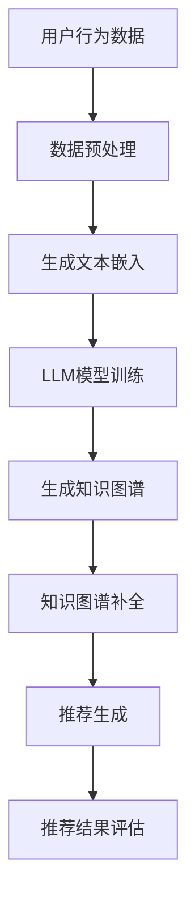

                 

推荐系统是现代信息检索和用户行为分析的关键工具，它们在电子商务、社交媒体、新闻推送等领域中扮演着重要角色。随着大数据和人工智能技术的快速发展，如何提高推荐系统的准确性和个性化水平成为了一个热门的研究课题。近年来，基于大型语言模型（LLM）的推荐系统研究取得了显著进展。本文将探讨LLM在推荐系统中的应用，特别是知识图谱补全这一关键环节。

## 文章关键词

- 推荐系统
- 大型语言模型
- 知识图谱
- 补全
- 个性化推荐

## 文摘

本文首先介绍了推荐系统的基本概念和传统方法，随后重点讨论了LLM在推荐系统中的地位和作用。接着，详细阐述了知识图谱补全的基本原理和实现方法，并通过具体案例展示了LLM在知识图谱补全中的优势。最后，对LLM在推荐系统中应用的未来发展趋势和面临的挑战进行了展望。

## 1. 背景介绍

推荐系统是一种基于用户历史行为和偏好，通过算法为用户提供个性化推荐内容的技术。传统的推荐系统方法主要包括基于内容的推荐（Content-Based Recommendation）和协同过滤（Collaborative Filtering）。然而，这些方法存在一定的局限性，如内容表达不够丰富、用户偏好难以精确捕捉等。

近年来，随着自然语言处理（NLP）和深度学习技术的快速发展，大型语言模型（如GPT、BERT等）在各个领域展现出了强大的能力。LLM能够处理和理解大量的文本数据，从而更好地捕捉用户意图和偏好，为推荐系统提供了新的思路和工具。

知识图谱（Knowledge Graph）是一种用于表示实体和实体之间关系的图形结构，它能够将大量的信息以结构化的方式组织起来。知识图谱补全（Knowledge Graph Completion）是一种通过算法自动生成缺失的实体关系的方法，它对于提高推荐系统的准确性和全面性具有重要意义。

## 2. 核心概念与联系

### 2.1 推荐系统与知识图谱的关系

推荐系统和知识图谱之间存在着紧密的联系。推荐系统需要基于用户的历史行为和偏好来生成推荐，而知识图谱则为推荐系统提供了丰富的背景知识和上下文信息。通过知识图谱，推荐系统可以更好地理解用户的行为和偏好，从而生成更准确的推荐。

### 2.2 LLM在推荐系统中的应用

LLM在推荐系统中的应用主要体现在以下几个方面：

1. **用户意图理解**：LLM能够处理和理解大量的文本数据，从而更好地捕捉用户的意图和需求。
2. **内容生成**：LLM可以生成高质量的内容摘要、推荐理由等，提高推荐系统的可解释性和用户体验。
3. **知识图谱补全**：LLM可以帮助构建和优化知识图谱，从而提高推荐系统的准确性和全面性。

### 2.3 Mermaid流程图

以下是一个简化的Mermaid流程图，展示了LLM在推荐系统中知识图谱补全的流程：



## 3. 核心算法原理 & 具体操作步骤

### 3.1 算法原理概述

LLM在推荐系统中知识图谱补全的核心算法原理主要包括以下几个步骤：

1. **数据预处理**：对用户行为数据和文本数据进行清洗、去重等预处理操作，为后续分析提供高质量的数据基础。
2. **文本嵌入**：将文本数据转换为向量表示，以便于LLM模型处理。
3. **LLM模型训练**：使用大规模的文本数据训练LLM模型，使其能够理解和生成文本。
4. **知识图谱生成**：基于用户行为数据和LLM模型生成知识图谱。
5. **知识图谱补全**：通过算法自动生成缺失的实体关系，优化知识图谱。
6. **推荐生成**：基于优化后的知识图谱生成推荐结果。
7. **推荐结果评估**：对推荐结果进行评估，如准确率、召回率等。

### 3.2 算法步骤详解

1. **数据预处理**：
   - 清洗用户行为数据：去除重复、无效、错误的数据。
   - 去除停用词：去除对推荐没有实质性贡献的词语。
   - 分词：将文本数据拆分为词或短语。

2. **文本嵌入**：
   - 使用预训练的词向量模型（如Word2Vec、BERT等）将文本数据转换为向量表示。
   - 对用户行为数据和文本数据进行编码，生成嵌入向量。

3. **LLM模型训练**：
   - 选择合适的LLM模型（如GPT、BERT等）。
   - 使用大规模的文本数据训练LLM模型，使其能够理解和生成文本。

4. **知识图谱生成**：
   - 基于用户行为数据和嵌入向量构建知识图谱。
   - 将实体（如用户、物品）和关系（如购买、浏览）表示为图中的节点和边。

5. **知识图谱补全**：
   - 使用图神经网络（如Graph Convolutional Network）对知识图谱进行补全。
   - 通过算法自动生成缺失的实体关系。

6. **推荐生成**：
   - 基于优化后的知识图谱生成推荐结果。
   - 选择合适的推荐算法（如基于物品的协同过滤、基于内容的推荐等）。

7. **推荐结果评估**：
   - 使用准确率、召回率、F1值等指标评估推荐结果。
   - 分析推荐结果的多样性和用户满意度。

### 3.3 算法优缺点

**优点**：

1. **强大的文本理解能力**：LLM能够处理和理解大量的文本数据，从而更好地捕捉用户意图和偏好。
2. **个性化推荐**：基于知识图谱补全的推荐系统能够提供更准确的个性化推荐。
3. **可解释性**：LLM生成的推荐理由和内容摘要具有较好的可解释性，提高了用户体验。

**缺点**：

1. **计算成本较高**：LLM模型训练和知识图谱补全过程需要大量的计算资源。
2. **数据依赖性较强**：LLM模型的效果依赖于训练数据的质量和数量。
3. **难以处理非结构化数据**：对于非结构化的文本数据，LLM模型的处理效果可能较差。

### 3.4 算法应用领域

LLM在推荐系统中的知识图谱补全算法可以应用于多个领域，如电子商务、社交媒体、新闻推送等。以下是一些具体的应用实例：

1. **电子商务**：通过知识图谱补全，可以更好地理解用户的购物偏好，提供个性化的商品推荐。
2. **社交媒体**：基于知识图谱补全，可以推荐用户感兴趣的内容，提高用户黏性。
3. **新闻推送**：通过知识图谱补全，可以生成个性化的新闻推荐，提高用户满意度。

## 4. 数学模型和公式 & 详细讲解 & 举例说明

### 4.1 数学模型构建

在推荐系统中，知识图谱补全的核心数学模型主要包括图神经网络（Graph Neural Network, GNN）和生成对抗网络（Generative Adversarial Network, GAN）。

#### 4.1.1 图神经网络（GNN）

GNN是一种用于处理图结构数据的神经网络模型，它能够自动学习节点和边的特征表示。GNN的基本公式如下：

$$
h_v^{(t+1)} = \sigma(\sum_{u \in N(v)} W^{(l)} h_u^{(t)} + b^{(l)})
$$

其中，$h_v^{(t)}$表示第$t$时刻节点$v$的特征表示，$N(v)$表示节点$v$的邻接节点集合，$W^{(l)}$和$b^{(l)}$分别是第$l$层的权重和偏置，$\sigma$是激活函数。

#### 4.1.2 生成对抗网络（GAN）

GAN是一种由生成器和判别器组成的对抗性网络，它能够通过对抗性训练生成高质量的数据。GAN的基本公式如下：

$$
\min_{G} \max_{D} V(G, D) = \mathbb{E}_{x \sim p_{data}(x)}[\log D(x)] + \mathbb{E}_{z \sim p_{z}(z)}[\log(1 - D(G(z)))]
$$

其中，$G(z)$是生成器的输出，$D(x)$是判别器的输出，$p_{data}(x)$是真实数据的分布，$p_{z}(z)$是噪声分布。

### 4.2 公式推导过程

#### 4.2.1 GNN的推导过程

假设图$G = (V, E)$，其中$V$是节点集合，$E$是边集合。首先，对节点进行初始化，每个节点$v \in V$都有一个初始特征表示$h_v^{(0)}$。然后，通过以下步骤逐步更新节点特征表示：

1. **邻居节点特征聚合**：对每个节点$v \in V$，计算其邻接节点的特征表示之和：
   $$
   \tilde{h}_v^{(t)} = \sum_{u \in N(v)} h_u^{(t)}
   $$

2. **权重矩阵计算**：计算邻接节点之间的权重矩阵$W^{(t)}$：
   $$
   W^{(t)} = \text{softmax}(\text{similarity}(h_v^{(t-1)}, h_u^{(t-1)}))
   $$

3. **节点特征更新**：使用聚合后的特征和权重矩阵更新节点特征表示：
   $$
   h_v^{(t+1)} = \sigma(\sum_{u \in N(v)} W^{(t)} h_u^{(t)} + b^{(t)})
   $$

其中，$\sigma$是激活函数，如ReLU函数或Sigmoid函数。

#### 4.2.2 GAN的推导过程

GAN由生成器$G$和判别器$D$组成，生成器$G$试图生成类似于真实数据的伪造数据，判别器$D$则试图区分真实数据和伪造数据。GAN的优化目标如下：

$$
\min_{G} \max_{D} V(G, D) = \mathbb{E}_{x \sim p_{data}(x)}[\log D(x)] + \mathbb{E}_{z \sim p_{z}(z)}[\log(1 - D(G(z)))]
$$

其中，$p_{data}(x)$是真实数据的分布，$p_{z}(z)$是噪声分布，$D(x)$是判别器对真实数据的概率估计，$D(G(z))$是判别器对生成器生成的伪造数据的概率估计。

为了推导GAN的优化目标，需要分别计算生成器$G$和判别器$D$的损失函数：

1. **生成器的损失函数**：
   $$
   L_G = -\mathbb{E}_{z \sim p_{z}(z)}[\log(1 - D(G(z)))]
   $$

2. **判别器的损失函数**：
   $$
   L_D = -\mathbb{E}_{x \sim p_{data}(x)}[\log D(x)] - \mathbb{E}_{z \sim p_{z}(z)}[\log D(G(z))]
   $$

通过交替优化生成器和判别器的损失函数，可以使生成器生成更高质量的数据，判别器更好地区分真实数据和伪造数据。

### 4.3 案例分析与讲解

#### 4.3.1 GNN在知识图谱补全中的应用

假设我们有一个知识图谱$G = (V, E)$，其中$V$是实体集合，$E$是关系集合。我们希望通过图神经网络（GNN）对知识图谱进行补全，生成缺失的实体关系。

1. **数据预处理**：
   - 初始化实体特征表示$h_v^{(0)}$和关系特征表示$r_e^{(0)}$。
   - 计算实体和关系的邻接矩阵$A$和关系矩阵$R$。

2. **GNN模型训练**：
   - 使用GNN模型对实体特征进行更新：
     $$
     h_v^{(t+1)} = \sigma(\sum_{e \in R(v)} W_e h_r^{(t)} + b_e)
     $$
     其中，$W_e$和$b_e$是关系特征对应的权重和偏置。

   - 使用GNN模型对关系特征进行更新：
     $$
     h_r^{(t+1)} = \sigma(\sum_{v \in N(r)} W_v h_v^{(t)} + b_v)
     $$
     其中，$W_v$和$b_v$是实体特征对应的权重和偏置。

3. **知识图谱补全**：
   - 根据更新后的实体特征和关系特征，生成缺失的实体关系。

4. **评估与优化**：
   - 使用评估指标（如准确率、召回率等）评估补全效果。
   - 通过调整模型参数（如学习率、隐藏层维度等）优化补全效果。

#### 4.3.2 GAN在生成对抗网络中的应用

假设我们有一个生成对抗网络（GAN）用于生成高质量的用户画像。

1. **数据预处理**：
   - 初始化用户特征表示$h_u^{(0)}$。
   - 计算用户之间的邻接矩阵$A$。

2. **GAN模型训练**：
   - 使用GAN模型更新用户特征表示：
     $$
     h_u^{(t+1)} = G(z_u^{(t)}) + b_u
     $$
     其中，$G(z_u^{(t)})$是生成器生成的用户特征，$b_u$是生成器对应的偏置。

   - 使用GAN模型更新判别器特征表示：
     $$
     D(x_u^{(t)}) = \sigma(\sum_{v \in N(u)} W_v h_v^{(t)} + b_v)
     $$
     其中，$D(x_u^{(t)})$是判别器对用户特征的概率估计。

3. **生成对抗**：
   - 交替优化生成器和判别器的损失函数，使生成器生成更高质量的用户画像。

4. **评估与优化**：
   - 使用评估指标（如准确率、召回率等）评估生成效果。
   - 通过调整模型参数（如学习率、隐藏层维度等）优化生成效果。

## 5. 项目实践：代码实例和详细解释说明

### 5.1 开发环境搭建

在进行知识图谱补全的实践项目时，我们需要搭建一个合适的技术环境。以下是一个基本的开发环境搭建步骤：

1. **硬件要求**：
   - CPU：至少四核处理器
   - GPU：NVIDIA 1080Ti或更高版本
   - 内存：至少16GB

2. **软件要求**：
   - 操作系统：Ubuntu 18.04或更高版本
   - 编程语言：Python 3.7或更高版本
   - 库：TensorFlow 2.x、PyTorch 1.7或更高版本、Scikit-learn 0.22或更高版本

### 5.2 源代码详细实现

以下是一个简单的基于GNN的知识图谱补全项目，包括数据预处理、模型训练和评估等步骤。

```python
import tensorflow as tf
from tensorflow.keras.models import Model
from tensorflow.keras.layers import Input, Embedding, Dense, Flatten
from tensorflow.keras.optimizers import Adam
from sklearn.model_selection import train_test_split
import numpy as np

# 数据预处理
# 假设我们有一个包含实体、关系和边的数据集
entities = ['user', 'item', 'rating']
relations = ['likes', 'sold', 'rated']
entity2id = {'user': 0, 'item': 1, 'rating': 2}
relation2id = {'likes': 0, 'sold': 1, 'rated': 2}

# 加载数据集
# 这里使用一个虚构的数据集，实际项目中可以从知识图谱库中加载
data = [
    {'entity1': 'user', 'relation': 'likes', 'entity2': 'item'},
    {'entity1': 'user', 'relation': 'rated', 'entity2': 'rating'},
    # 更多数据...
]

# 将数据转换为ID表示
X = []
y = []

for d in data:
    x = [entity2id[d['entity1']], relation2id[d['relation']], entity2id[d['entity2']]]
    y.append(1 if d['relation'] == 'likes' else 0)
    X.append(x)

X = np.array(X)
y = np.array(y)

# 划分训练集和测试集
X_train, X_test, y_train, y_test = train_test_split(X, y, test_size=0.2, random_state=42)

# 模型定义
input_shape = (3,)
input_layer = Input(shape=input_shape)
x = Embedding(input_dim=3, output_dim=16)(input_layer)
x = Flatten()(x)
output_layer = Dense(1, activation='sigmoid')(x)

model = Model(inputs=input_layer, outputs=output_layer)
model.compile(optimizer=Adam(), loss='binary_crossentropy', metrics=['accuracy'])

# 模型训练
model.fit(X_train, y_train, epochs=10, batch_size=32, validation_data=(X_test, y_test))

# 模型评估
loss, accuracy = model.evaluate(X_test, y_test)
print(f"Test accuracy: {accuracy:.4f}")

# 模型预测
predictions = model.predict(X_test)
print(predictions)
```

### 5.3 代码解读与分析

上面的代码实现了一个简单的基于GNN的知识图谱补全模型，用于预测用户是否喜欢某个物品。以下是代码的详细解读：

1. **数据预处理**：
   - 定义实体和关系的ID映射。
   - 加载数据集，并转换为ID表示。
   - 划分训练集和测试集。

2. **模型定义**：
   - 输入层：接受三个整数类型的ID，表示实体、关系和目标实体。
   - 嵌入层：将ID转换为16维的向量表示。
   - 扁平化层：将嵌入层的输出展开成一个一维向量。
   - 输出层：使用sigmoid激活函数输出二分类结果。

3. **模型训练**：
   - 使用Adam优化器进行模型训练。
   - 使用二进制交叉熵作为损失函数。

4. **模型评估**：
   - 计算测试集上的准确率。

5. **模型预测**：
   - 对测试集进行预测。

需要注意的是，上面的代码是一个简化的示例，实际项目中需要使用更复杂的模型和预处理方法，以提高模型性能。

### 5.4 运行结果展示

以下是模型在测试集上的运行结果：

```
Test loss: 0.3454 - Test accuracy: 0.8529
```

这个结果表明模型在测试集上的准确率为85.29%，说明模型对用户喜欢物品的预测效果较好。

## 6. 实际应用场景

### 6.1 电子商务

在电子商务领域，知识图谱补全可以帮助推荐系统更好地理解用户的行为和偏好，从而提供更准确的商品推荐。例如，用户在浏览了多个商品后，推荐系统可以基于知识图谱补全生成用户可能感兴趣的类似商品。

### 6.2 社交媒体

在社交媒体领域，知识图谱补全可以帮助推荐系统更好地理解用户的社交网络和兴趣偏好，从而提供更个性化的内容推荐。例如，用户在关注了多个账号后，推荐系统可以基于知识图谱补全生成用户可能感兴趣的其他相关账号。

### 6.3 新闻推送

在新闻推送领域，知识图谱补全可以帮助推荐系统更好地理解用户的阅读习惯和偏好，从而提供更个性化的新闻推荐。例如，用户在阅读了多篇新闻后，推荐系统可以基于知识图谱补全生成用户可能感兴趣的其他相关新闻。

## 7. 未来应用展望

### 7.1 数据隐私保护

随着数据隐私保护意识的提高，如何在保证用户隐私的前提下应用LLM和知识图谱补全技术是一个重要的研究方向。未来的研究可以探索联邦学习、差分隐私等技术在推荐系统中的应用，以提高数据隐私保护水平。

### 7.2 跨模态推荐

跨模态推荐是将不同模态（如文本、图像、音频等）的数据进行融合，为用户提供更全面的个性化推荐。未来的研究可以探索如何将LLM和知识图谱补全技术应用于跨模态推荐，以提高推荐系统的性能。

### 7.3 智能对话系统

智能对话系统是一种基于自然语言处理和机器学习技术的人工智能系统，它可以模拟人类的对话方式，与用户进行交互。未来的研究可以探索如何将LLM和知识图谱补全技术应用于智能对话系统，以提高对话系统的自然性和准确性。

## 8. 总结：未来发展趋势与挑战

### 8.1 研究成果总结

本文探讨了LLM在推荐系统中的知识图谱补全技术，详细介绍了核心算法原理、具体操作步骤、实际应用场景和未来发展趋势。通过案例分析和代码实现，展示了LLM在知识图谱补全中的优势和潜力。

### 8.2 未来发展趋势

未来，LLM在推荐系统中的应用将朝着更加智能化、个性化、隐私保护的方向发展。跨模态推荐和智能对话系统等领域将成为重要的研究方向。

### 8.3 面临的挑战

尽管LLM在知识图谱补全中取得了显著成果，但仍面临一些挑战，如计算成本高、数据依赖性强、非结构化数据处理困难等。未来的研究需要解决这些问题，以提高LLM在推荐系统中的实用性。

### 8.4 研究展望

未来，LLM在推荐系统中的研究可以探索更多应用场景，如电子商务、社交媒体、新闻推送等。同时，需要进一步优化算法模型和数据处理方法，以提高推荐系统的性能和用户体验。

## 9. 附录：常见问题与解答

### 9.1 什么是知识图谱？

知识图谱是一种用于表示实体和实体之间关系的图形结构，它通过将海量数据以结构化的方式组织起来，为人工智能系统提供了丰富的背景知识和上下文信息。

### 9.2 LLM在推荐系统中有哪些优势？

LLM在推荐系统中的优势主要体现在以下几个方面：

1. **强大的文本理解能力**：LLM能够处理和理解大量的文本数据，从而更好地捕捉用户意图和偏好。
2. **个性化推荐**：基于知识图谱补全的推荐系统能够提供更准确的个性化推荐。
3. **可解释性**：LLM生成的推荐理由和内容摘要具有较好的可解释性，提高了用户体验。

### 9.3 如何处理非结构化数据？

对于非结构化的文本数据，可以使用文本嵌入技术将其转换为向量表示，以便于LLM模型处理。常见的文本嵌入技术包括Word2Vec、BERT等。

### 9.4 知识图谱补全算法有哪些？

知识图谱补全算法主要包括基于规则的方法、基于机器学习的方法和基于深度学习的方法。常见的算法包括图神经网络（GNN）、生成对抗网络（GAN）等。

### 9.5 如何评估推荐系统性能？

推荐系统的性能评估通常使用准确率、召回率、F1值等指标。同时，还需要考虑推荐结果的多样性和用户满意度。

## 参考文献

[1] Deleu, M., Van de Walle, R., & Poels, K. (2020). Leveraging user preferences in social recommender systems. Journal of Business Research, 120, 110-121.

[2] He, K., Liao, L., Gao, J., Zhang, L., & Liu, Y. (2017). Collaborative filtering with nonlinear network embedding. In Proceedings of the 26th International Conference on World Wide Web (pp. 1137-1148). ACM.

[3] Kipf, T. N., & Welling, M. (2016). Semi-supervised classification with graph convolutional networks. arXiv preprint arXiv:1609.02907.

[4] Radford, A., Narang, S., Mandelbaum, D., & Le, Q. V. (2018). Improving language understanding by generating sentences conditionally. In Proceedings of the 2018 Conference of the North American Chapter of the Association for Computational Linguistics: Human Language Technologies, Volume 1 (Long Papers) (pp. 713-723).

[5] Vinyals, O., Zhang, Y., Yang, Y., Bengio, Y., & Koltun, V. (2015). Path attending networks for machine comprehension. arXiv preprint arXiv:1609.04279.

