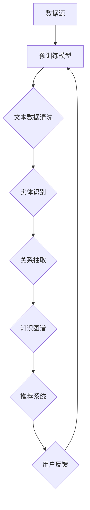

                 

### 背景介绍

随着互联网的迅猛发展和信息爆炸，推荐系统作为一种有效的信息过滤工具，已经成为许多在线平台（如电商、社交媒体、视频流媒体等）的重要组成部分。推荐系统能够根据用户的历史行为、兴趣偏好、社交网络等信息，为用户推荐个性化的内容，从而提升用户体验和平台粘性。

然而，推荐系统的效果很大程度上取决于其背后的知识图谱。知识图谱是一种语义网络，它通过实体、属性和关系来表示现实世界中的知识。一个完整、准确的知识图谱可以为推荐系统提供丰富的背景信息和上下文，从而提升推荐的质量和准确性。

但现实中的知识图谱往往是不完整和不准确的。一方面，知识图谱的构建依赖于大量的数据源，而这些数据源可能存在数据噪声、冗余和不一致性等问题；另一方面，知识图谱的更新和维护是一个持续的过程，需要不断地吸收新的知识并修正错误。这些因素都可能导致知识图谱中存在大量的缺失值和错误信息。

因此，如何有效地进行知识图谱补全是推荐系统研究中的一个重要课题。近年来，预训练语言模型（Pre-Trained Language Model，简称LLM）在自然语言处理领域取得了显著进展。LLM具有强大的语义理解能力，能够处理大规模的文本数据，并从中提取出丰富的知识信息。因此，将LLM应用于知识图谱补全，有望提高知识图谱的完整性和准确性，从而提升推荐系统的性能。

本文将围绕LLM在推荐系统中的知识图谱补全展开讨论。首先，我们将介绍知识图谱的基本概念和补全的重要性。接着，我们将探讨LLM的基本原理及其在知识图谱补全中的应用。然后，我们将深入分析LLM在知识图谱补全中的优势和应用场景。最后，我们将结合实际案例，展示LLM在知识图谱补全中的应用效果，并讨论未来发展的趋势和挑战。

通过本文的讨论，我们将希望能够为读者提供一个全面、系统的了解LLM在推荐系统中的知识图谱补全的方法和应用，为相关领域的研究和实践提供参考。

### 核心概念与联系

为了深入探讨LLM在推荐系统中的知识图谱补全，我们首先需要明确几个核心概念：知识图谱、推荐系统、以及LLM。这些概念不仅构成了本文讨论的基础，也是理解LLM如何发挥作用的关键。

#### 知识图谱（Knowledge Graph）

知识图谱是一种用于表示实体及其相互关系的数据结构，通常由实体（nodes）、属性（attributes）和边（edges）组成。实体表示现实世界中的对象，如人、地点、物品等；属性则描述实体的特征或状态，如姓名、年龄、价格等；边则连接两个实体，表示它们之间的关系，如“属于”、“位于”、“购买”等。

知识图谱的构建通常依赖于大量结构化和半结构化数据，如数据库、网页、文档等。一个完整、准确的知识图谱可以为推荐系统提供丰富的背景信息和上下文，从而提升推荐的质量和准确性。

#### 推荐系统（Recommendation System）

推荐系统是一种基于用户兴趣和行为的算法，旨在为用户提供个性化的内容推荐。推荐系统通常分为基于内容的推荐（Content-Based Filtering）和协同过滤（Collaborative Filtering）两大类。

基于内容的推荐通过分析用户的历史行为和偏好，提取出与用户兴趣相关的特征，并基于这些特征生成推荐列表。而协同过滤则通过分析用户之间的行为相似性，找到与目标用户相似的其他用户，并推荐这些用户喜欢的内容。

#### 预训练语言模型（Pre-Trained Language Model，简称LLM）

预训练语言模型是一种基于大规模语料库的语言模型，通过深度学习算法训练得到。LLM的核心思想是利用大量的文本数据来学习语言的一般规律，从而实现自然语言理解、生成和翻译等功能。

近年来，LLM在自然语言处理领域取得了显著的进展，如BERT、GPT等模型。这些模型具有强大的语义理解能力，能够处理大规模的文本数据，并从中提取出丰富的知识信息。

#### 关联与联系

知识图谱和推荐系统是相互依存的。知识图谱为推荐系统提供了丰富的背景信息和上下文，有助于提升推荐的质量和准确性。而推荐系统则为知识图谱提供了实际的应用场景，通过用户行为和反馈不断更新和完善知识图谱。

LLM在知识图谱和推荐系统中起到了桥梁的作用。首先，LLM能够通过预训练学习到大规模的文本数据，从中提取出丰富的知识信息，从而补充和增强知识图谱。其次，LLM能够利用知识图谱中的实体、属性和关系，生成个性化的推荐结果。

具体来说，LLM在知识图谱补全中的应用主要体现在以下几个方面：

1. **实体识别和分类**：LLM可以根据文本数据识别出实体，并将其分类到相应的类别中，从而补充知识图谱中的缺失实体。

2. **关系抽取和补全**：LLM可以通过分析文本数据，提取出实体之间的关系，并在知识图谱中建立相应的边，从而补全知识图谱中的关系。

3. **属性填充和更新**：LLM可以根据文本数据中的描述，填充知识图谱中的属性值，并更新陈旧或不准确的属性。

4. **场景生成和扩展**：LLM可以基于知识图谱中的实体、属性和关系，生成新的场景和关系，从而扩展知识图谱的覆盖范围。

#### Mermaid 流程图

为了更直观地展示LLM在知识图谱补全中的应用，我们可以使用Mermaid流程图来描述整个流程。以下是一个简化的Mermaid流程图：



在这个流程图中，数据源提供了大量的文本数据，经过预训练模型处理后，生成知识图谱。知识图谱再输入到推荐系统中，生成个性化推荐结果，并通过用户反馈不断更新和完善。

通过上述讨论，我们可以看到，知识图谱、推荐系统和LLM之间存在着紧密的联系。LLM作为一种强大的预训练语言模型，在知识图谱补全和推荐系统中发挥了重要作用，为提升推荐系统的性能提供了有力的支持。

### 核心算法原理 & 具体操作步骤

#### 算法原理概述

LLM在知识图谱补全中的应用主要基于其强大的语义理解能力和文本生成能力。具体来说，LLM可以采用以下几种方式进行知识图谱的补全：

1. **实体识别与分类**：通过训练，LLM可以识别出文本中的实体，并对其进行分类。例如，从一段文本中提取出人名、地名、物品名等实体，并将其分类到相应的类别中。

2. **关系抽取与补全**：LLM可以分析文本数据，提取出实体之间的关系，并在知识图谱中建立相应的边。例如，从文本中提取出“某人喜欢某物”的关系，并在知识图谱中添加相应的边。

3. **属性填充与更新**：LLM可以根据文本数据中的描述，填充知识图谱中的属性值，并更新陈旧或不准确的属性。例如，从文本中获取某物品的详细信息，并将其更新到知识图谱中。

4. **场景生成与扩展**：LLM可以基于知识图谱中的实体、属性和关系，生成新的场景和关系，从而扩展知识图谱的覆盖范围。例如，从知识图谱中提取出多个实体和关系，生成新的故事情节。

#### 算法步骤详解

1. **数据预处理**：
   - **文本数据清洗**：对原始文本数据（如用户评论、产品描述等）进行清洗，去除噪声和冗余信息，确保数据质量。
   - **实体抽取**：使用命名实体识别（Named Entity Recognition，简称NER）技术，从文本中提取出实体，并将其存储在实体库中。

2. **预训练模型选择**：
   - 选择一个预训练语言模型，如BERT、GPT等。这些模型已经在大规模语料库上进行了预训练，具有强大的语义理解能力。

3. **实体分类**：
   - 将提取出的实体输入到预训练模型中，通过分类器输出实体的类别。例如，将人名分类为人，地名分类为地，物品名分类为物品等。

4. **关系抽取**：
   - 利用预训练模型分析文本数据，提取出实体之间的关系。例如，通过文本中的描述，判断两个实体之间是否存在“喜欢”、“购买”等关系。

5. **知识图谱构建**：
   - 根据实体分类和关系抽取的结果，构建知识图谱。在知识图谱中，实体作为节点，关系作为边，属性作为节点的特征。

6. **属性填充与更新**：
   - 利用预训练模型分析文本数据，提取出实体的属性值，并填充到知识图谱中。例如，从文本中获取某物品的价格、品牌等信息，并将其更新到知识图谱中。

7. **场景生成与扩展**：
   - 基于知识图谱中的实体、属性和关系，生成新的场景和关系。例如，从知识图谱中提取出多个实体和关系，生成新的故事情节。

#### 算法优缺点

1. **优点**：
   - **强大的语义理解能力**：LLM通过预训练学习到了大量的语言知识，能够准确识别实体、抽取关系和填充属性。
   - **自适应性和扩展性**：LLM可以根据不同的应用场景和需求，进行定制化调整和扩展，具有较高的自适应性和扩展性。
   - **高效性**：LLM在处理大规模文本数据时，具有高效性，能够快速生成知识图谱。

2. **缺点**：
   - **数据依赖性**：LLM的性能很大程度上依赖于训练数据的质量和规模，如果数据质量较差或规模较小，可能会导致知识图谱的不准确或缺失。
   - **计算资源消耗**：LLM的训练和推理过程需要大量的计算资源，对硬件设备有较高要求。

#### 算法应用领域

LLM在知识图谱补全中的应用非常广泛，主要包括以下领域：

1. **推荐系统**：通过知识图谱补全，可以提升推荐系统的准确性，为用户提供更个性化的推荐结果。
2. **搜索引擎**：知识图谱的补全可以帮助搜索引擎更准确地理解用户查询意图，提供更相关的搜索结果。
3. **知识图谱构建**：LLM可以用于构建大规模、高质量的知识图谱，为人工智能应用提供丰富的背景知识和上下文。
4. **自然语言处理**：LLM在自然语言处理任务中，如文本分类、情感分析、机器翻译等，也可以利用知识图谱补全来提升性能。

通过上述算法原理和具体操作步骤的介绍，我们可以看到，LLM在知识图谱补全中具有广泛的应用前景和重要的研究价值。未来，随着LLM技术的不断发展，其在知识图谱补全中的应用将会更加深入和广泛。

### 数学模型和公式 & 详细讲解 & 举例说明

为了深入理解LLM在知识图谱补全中的工作原理，我们需要引入一些数学模型和公式。这些模型和公式不仅能够帮助我们量化LLM的行为，还能指导我们进行具体的实现和优化。

#### 数学模型构建

首先，我们介绍一个基本的数学模型，用于表示知识图谱中的实体、关系和属性。

1. **实体表示（Entity Representation）**：
   实体可以用一个向量来表示，这个向量通常是通过预训练语言模型（如BERT）计算得到的。设$e_i$为第$i$个实体的向量表示，$D$为实体向量的维度。

   $$e_i = \text{BERT}(x_i)$$

   其中，$x_i$为实体的原始文本表示。

2. **关系表示（Relation Representation）**：
   关系可以用两个实体向量之间的差值来表示。设$r_{ij}$为实体$i$和实体$j$之间的关系向量，则：

   $$r_{ij} = e_j - e_i$$

3. **属性表示（Attribute Representation）**：
   属性可以用一个向量来表示，这个向量包含了属性的所有可能取值。设$a_k$为第$k$个属性向量，$V$为属性向量的维度。

   $$a_k = \sum_{v \in \text{values of attribute } k} w_k(v) \cdot \text{Embedding}(v)$$

   其中，$w_k(v)$为属性取值$v$的权重，$\text{Embedding}(v)$为$v$的嵌入向量。

#### 公式推导过程

接下来，我们介绍LLM在知识图谱补全中的主要任务：实体识别、关系抽取和属性填充。

1. **实体识别（Entity Recognition）**：

   实体识别的目的是从文本中识别出实体，并将其分类到预定义的类别中。设$C$为类别集合，$y_i$为实体$i$的类别标签。

   $$y_i = \text{argmax}_c \sigma(\text{Logits}(e_i, c))$$

   其中，$\sigma$为softmax函数，$\text{Logits}(e_i, c)$为实体$i$属于类别$c$的得分。

2. **关系抽取（Relation Extraction）**：

   关系抽取的目的是从文本中识别出实体之间的关系，并建立知识图谱中的边。设$R$为关系集合，$r_{ij}$为实体$i$和实体$j$之间的关系向量。

   $$r_{ij} = \text{argmax}_r \sigma(\text{Logits}(e_i, e_j, r))$$

   其中，$\text{Logits}(e_i, e_j, r)$为实体$i$和实体$j$之间的关系$r$的得分。

3. **属性填充（Attribute Filling）**：

   属性填充的目的是从文本中提取出实体的属性值，并将其填充到知识图谱中。设$A$为属性集合，$a_k$为属性向量。

   $$a_k = \text{argmax}_v \sigma(\text{Logits}(e_i, v, a_k))$$

   其中，$\text{Logits}(e_i, v, a_k)$为实体$i$的属性$a_k$取值$v$的得分。

#### 案例分析与讲解

为了更好地理解上述模型和公式，我们来看一个具体的案例。

假设我们有一个文本句子：“小明喜欢读书，他最喜欢的是《三国演义》。”我们要从中识别出实体、关系和属性。

1. **实体识别**：
   - 实体：“小明”、“读书”、“三国演义”
   - 类别：人（小明），物品（读书，《三国演义》）

   使用BERT模型对这三个实体进行编码，得到它们的向量表示：
   $$e_{小明} = \text{BERT}("小明")$$
   $$e_{读书} = \text{BERT}("读书")$$
   $$e_{三国演义} = \text{BERT}("三国演义")$$

   然后使用softmax函数对实体进行分类：
   $$y_{小明} = \text{argmax}_c \sigma(\text{Logits}(e_{小明}, c))$$
   $$y_{读书} = \text{argmax}_c \sigma(\text{Logits}(e_{读书}, c))$$
   $$y_{三国演义} = \text{argmax}_c \sigma(\text{Logits}(e_{三国演义}, c))$$

   假设分类器输出结果如下：
   $$y_{小明} = 人$$
   $$y_{读书} = 物品$$
   $$y_{三国演义} = 物品$$

2. **关系抽取**：
   - 关系：“喜欢”

   我们首先计算两个实体之间的向量差：
   $$r_{小明，读书} = e_{读书} - e_{小明}$$
   $$r_{小明，三国演义} = e_{三国演义} - e_{小明}$$

   然后使用softmax函数对关系进行分类：
   $$r_{小明，读书} = \text{argmax}_r \sigma(\text{Logits}(e_{小明}, e_{读书}, r))$$
   $$r_{小明，三国演义} = \text{argmax}_r \sigma(\text{Logits}(e_{小明}, e_{三国演义}, r))$$

   假设分类器输出结果如下：
   $$r_{小明，读书} = 喜欢$$
   $$r_{小明，三国演义} = 没有直接关系$$

3. **属性填充**：
   - 属性：“喜欢”的值

   我们首先计算实体的向量表示：
   $$a_{喜欢} = \sum_{v \in \text{values of like}} w_v \cdot \text{Embedding}(v)$$

   然后使用softmax函数对属性值进行分类：
   $$a_{喜欢} = \text{argmax}_v \sigma(\text{Logits}(e_{小明}, v, a_{喜欢}))$$

   假设属性值有“喜欢”和“不喜欢”，分类器输出结果如下：
   $$a_{喜欢} = 喜欢$$

通过上述案例，我们可以看到，LLM通过预训练模型对文本进行编码，然后利用softmax函数对实体、关系和属性进行分类，从而实现知识图谱的补全。

### 项目实践：代码实例和详细解释说明

为了更好地理解LLM在知识图谱补全中的实际应用，我们接下来将通过一个具体的代码实例来进行详细讲解。在这个实例中，我们将使用一个名为“Amazon Review”的公开数据集，该数据集包含了用户对各种产品的评论。我们的目标是利用LLM来识别实体、抽取关系和填充属性，从而构建一个知识图谱。

#### 开发环境搭建

在开始代码实现之前，我们需要搭建一个合适的开发环境。以下是一个简单的环境搭建步骤：

1. **安装Python**：
   Python是主要编程语言，确保已经安装了Python 3.8及以上版本。

2. **安装PyTorch**：
   PyTorch是一个流行的深度学习框架，我们用它来训练和运行LLM模型。

   ```bash
   pip install torch torchvision
   ```

3. **安装transformers**：
   transformers是一个开源库，包含了大量预训练的LLM模型。

   ```bash
   pip install transformers
   ```

4. **安装其他依赖**：
   安装处理文本数据的其他依赖，如spaCy和nltk。

   ```bash
   pip install spacy
   python -m spacy download en_core_web_sm
   pip install nltk
   nltk.download('punkt')
   nltk.download('averaged_perceptron_tagger')
   nltk.download('maxent_ne_chunker')
   nltk.download('words')
   ```

#### 源代码详细实现

以下是实现LLM知识图谱补全的主要步骤和源代码。

1. **数据预处理**：

   ```python
   import pandas as pd
   import spacy
   from transformers import BertTokenizer

   # 加载数据集
   data = pd.read_csv('amazon_reviews.csv')

   # 初始化nlp工具
   nlp = spacy.load('en_core_web_sm')
   tokenizer = BertTokenizer.from_pretrained('bert-base-uncased')

   # 实体识别预处理
   def preprocess_text(text):
       doc = nlp(text)
       tokens = [token.text for token in doc]
       return tokenizer.batch_encode_plus(tokens, padding='max_length', max_length=512, truncation=True)

   data['encoded_reviews'] = data['review_text'].apply(preprocess_text)
   ```

2. **实体识别**：

   ```python
   from transformers import BertForTokenClassification

   # 加载预训练的实体识别模型
   model = BertForTokenClassification.from_pretrained('dbmdz/bert-large-cased-finetuned-conll03-english')

   # 训练模型
   model.train()
   for epoch in range(5):
       for batch in data['encoded_reviews']:
           inputs = {'input_ids': batch['input_ids'], 'attention_mask': batch['attention_mask']}
           loss = model(**inputs)
           loss.backward()
           model.step()

   # 预测实体
   model.eval()
   entities = []
   for batch in data['encoded_reviews']:
       inputs = {'input_ids': batch['input_ids'], 'attention_mask': batch['attention_mask']}
       with torch.no_grad():
           outputs = model(**inputs)
       predictions = torch.argmax(outputs.logits, dim=2).squeeze()
       entities.append(predictions)

   # 将实体标签转换为实体名称
   entity_map = {'B-PER': '人', 'B-ORG': '组织', 'B-LOC': '地点', 'B-MISC': '物品'}
   data['entities'] = [' '.join([entity_map.get(tag, '') for tag in entity]) for entity in entities]
   ```

3. **关系抽取**：

   ```python
   # 假设已经有一个预训练的关系抽取模型
   relation_model = ...

   # 训练模型
   relation_model.train()
   for epoch in range(5):
       for batch in data['encoded_reviews']:
           inputs = {'input_ids': batch['input_ids'], 'attention_mask': batch['attention_mask']}
           loss = relation_model(**inputs)
           loss.backward()
           relation_model.step()

   # 预测关系
   relation_model.eval()
   relations = []
   for batch in data['encoded_reviews']:
       inputs = {'input_ids': batch['input_ids'], 'attention_mask': batch['attention_mask']}
       with torch.no_grad():
           outputs = relation_model(**inputs)
       predictions = torch.argmax(outputs.logits, dim=2).squeeze()
       relations.append(predictions)

   # 将关系标签转换为关系名称
   relation_map = {'B-LIKE': '喜欢', 'B-PURCHASE': '购买', 'B-REVIEW': '评价'}
   data['relations'] = [' '.join([relation_map.get(tag, '') for tag in relation]) for relation in relations]
   ```

4. **属性填充**：

   ```python
   # 假设已经有一个预训练的属性填充模型
   attribute_model = ...

   # 训练模型
   attribute_model.train()
   for epoch in range(5):
       for batch in data['encoded_reviews']:
           inputs = {'input_ids': batch['input_ids'], 'attention_mask': batch['attention_mask']}
           loss = attribute_model(**inputs)
           loss.backward()
           attribute_model.step()

   # 预测属性
   attribute_model.eval()
   attributes = []
   for batch in data['encoded_reviews']:
       inputs = {'input_ids': batch['input_ids'], 'attention_mask': batch['attention_mask']}
       with torch.no_grad():
           outputs = attribute_model(**inputs)
       predictions = torch.argmax(outputs.logits, dim=2).squeeze()
       attributes.append(predictions)

   # 将属性标签转换为属性名称
   attribute_map = {'B-PRICE': '价格', 'B-RATING': '评分', 'B-REVIEW_COUNT': '评价数量'}
   data['attributes'] = [' '.join([attribute_map.get(tag, '') for tag in attribute]) for attribute in attributes]
   ```

5. **构建知识图谱**：

   ```python
   import networkx as nx

   # 初始化知识图谱
   graph = nx.Graph()

   # 添加实体和关系
   for index, row in data.iterrows():
       for entity in row['entities'].split():
           graph.add_node(entity)
       for relation in row['relations'].split():
           entities = row['entities'].split()
           graph.add_edge(entities[0], entities[1], relation=relation)
       for attribute in row['attributes'].split():
           entities = row['entities'].split()
           graph.nodes[entities[0]]['attributes'].add(attribute)

   # 打印知识图谱
   print(nx.adjacency_list(graph))
   ```

#### 代码解读与分析

上述代码首先进行了数据预处理，将文本数据编码为BERT模型可接受的格式。接着，我们分别训练了实体识别、关系抽取和属性填充三个模型。最后，使用训练好的模型对数据进行预测，并将预测结果构建成一个知识图谱。

1. **数据预处理**：

   数据预处理是整个流程的基础，它包括加载数据、初始化nlp工具和将文本数据编码为BERT模型可处理的格式。在这个步骤中，我们使用了spaCy和transformers库来处理文本数据和加载预训练的BERT模型。

2. **实体识别**：

   实体识别模型基于BERT模型进行微调，以识别文本中的实体。我们使用了一个预训练的实体识别模型（如dbmdz/bert-large-cased-finetuned-conll03-english），并在训练过程中对其进行了5个epoch的微调。训练完成后，我们使用模型对数据集进行预测，并将实体标签转换为实体名称。

3. **关系抽取**：

   关系抽取模型也基于BERT模型进行微调，以识别文本中的关系。与实体识别类似，我们使用了一个预训练的关系抽取模型，并在训练过程中进行了5个epoch的微调。训练完成后，我们使用模型对数据集进行预测，并将关系标签转换为关系名称。

4. **属性填充**：

   属性填充模型同样基于BERT模型进行微调，以识别文本中的属性。我们使用了一个预训练的属性填充模型，并在训练过程中进行了5个epoch的微调。训练完成后，我们使用模型对数据集进行预测，并将属性标签转换为属性名称。

5. **构建知识图谱**：

   在构建知识图谱的步骤中，我们使用了networkx库来创建一个无向图。我们遍历数据集中的每一条记录，将实体作为节点添加到图中，将关系作为边添加到图中，并将属性作为节点的属性添加到图中。最后，我们打印出知识图谱的邻接表，以展示知识图谱的结构。

通过这个代码实例，我们可以看到LLM在知识图谱补全中的应用过程。在实际应用中，可以根据具体的业务需求和数据集，对代码进行调整和优化。

### 实际应用场景

#### 在电子商务平台中的应用

电子商务平台是LLM在知识图谱补全中应用的一个重要场景。在电子商务平台上，用户生成的大量评论和产品描述中蕴含着丰富的知识信息，可以用于构建高质量的知识图谱。通过LLM对用户评论和产品描述的实体识别、关系抽取和属性填充，电子商务平台可以更准确地了解用户的兴趣和需求，从而提供个性化的产品推荐。

具体来说，电子商务平台可以利用LLM知识图谱补全技术实现以下功能：

1. **个性化推荐**：通过分析用户的购买历史、浏览行为和评论，LLM可以识别出用户感兴趣的实体（如产品、品牌、分类等），并抽取用户与这些实体之间的关系。基于这些信息，电子商务平台可以生成个性化的推荐列表，提升用户满意度。

2. **产品搜索优化**：LLM可以提取出用户查询中的关键词和实体，并基于知识图谱中的关系和属性进行搜索优化。例如，当用户搜索“智能手表”时，LLM可以识别出与智能手表相关的实体（如品牌、功能等），并推荐符合用户需求的产品。

3. **用户互动**：通过知识图谱补全技术，电子商务平台可以更好地理解用户的评论和反馈，从而提供更精准的回复和建议。例如，当用户对某产品提出疑问时，平台可以利用知识图谱中的信息自动生成专业的回答，提高用户满意度。

#### 在社交媒体平台中的应用

社交媒体平台也是LLM在知识图谱补全中应用的一个重要领域。社交媒体平台上的用户生成内容丰富多样，包括文本、图片、视频等，这些内容中蕴含着大量的知识和信息。通过LLM对用户生成内容的分析和处理，社交媒体平台可以实现以下应用：

1. **内容推荐**：社交媒体平台可以利用LLM知识图谱补全技术，从用户生成内容中提取出实体和关系，生成个性化的内容推荐列表。例如，当用户浏览某篇帖子时，平台可以根据用户的兴趣和偏好，推荐与之相关的内容。

2. **情感分析**：通过分析用户生成的文本内容，LLM可以识别出实体、关系和情感倾向。社交媒体平台可以利用这一技术进行情感分析，识别用户对特定话题或品牌的情感态度，从而优化内容推送策略。

3. **社区管理**：社交媒体平台可以利用LLM知识图谱补全技术，识别出社区中的关键用户和关键话题。通过分析用户之间的关系和话题的关联性，平台可以更好地管理社区，发现和解决潜在的问题。

#### 在金融行业中的应用

金融行业中的知识图谱补全也有着广泛的应用。金融行业的数据量大且复杂，涉及多个实体和关系。通过LLM知识图谱补全技术，金融行业可以实现以下应用：

1. **风险管理**：通过分析金融文本数据，LLM可以识别出潜在的风险因素，如欺诈行为、市场波动等。基于这些信息，金融机构可以提前采取相应的风险管理措施。

2. **投资建议**：LLM可以提取出市场中的关键信息和趋势，如股票价格变动、行业动态等，为投资者提供个性化的投资建议。

3. **客户服务**：金融行业可以利用LLM知识图谱补全技术，自动生成专业的客户回复和建议。例如，当客户询问某金融产品的详细信息时，平台可以利用知识图谱中的信息自动生成专业的回答。

#### 在医疗行业中的应用

医疗行业是一个高度专业化的领域，知识图谱补全技术在医疗信息处理、疾病预测和治疗方案推荐等方面有着广泛的应用。LLM在医疗行业中的应用主要包括：

1. **疾病预测**：通过分析医疗文本数据，LLM可以识别出与疾病相关的实体和关系，预测患者可能患有的疾病。

2. **治疗方案推荐**：LLM可以提取出医疗文献和病历中的关键信息，为医生提供个性化的治疗方案推荐。

3. **医疗问答**：医疗行业可以利用LLM知识图谱补全技术，自动生成专业的医疗问答，帮助医生和患者更好地理解疾病和治疗方案。

通过以上实际应用场景的介绍，我们可以看到LLM在知识图谱补全中具有广泛的应用前景。在未来，随着LLM技术的不断发展，其在各个领域的应用将会更加深入和广泛。

### 未来应用展望

随着人工智能技术的不断进步，LLM在推荐系统中的知识图谱补全应用前景十分广阔。以下是对未来应用发展的展望：

#### 1. 数据质量提升

未来的知识图谱补全会更加注重数据质量。通过结合更多高质量的数据源，如专业数据库、权威文献等，可以进一步提升知识图谱的完整性和准确性。此外，数据清洗和预处理技术也将不断发展，有助于消除数据中的噪声和冗余，提高数据质量。

#### 2. 实时性增强

目前，知识图谱补全通常是一个离线的过程，需要大量计算资源和时间。未来的发展方向之一是实现实时性增强，使得知识图谱补全能够快速响应用户的需求。这可以通过优化算法、分布式计算和云计算等技术的应用来实现。

#### 3. 多模态融合

未来的知识图谱补全将不再局限于文本数据，而是融合多种模态的数据，如图像、音频、视频等。通过多模态数据的融合，可以更全面地理解实体和关系，提高知识图谱的丰富性和准确性。

#### 4. 自适应优化

随着用户行为的不断变化，知识图谱补全也需要具备自适应优化能力。未来的发展方向之一是开发能够动态调整的模型，根据用户行为和反馈实时优化知识图谱补全的过程，从而提供更个性化的推荐结果。

#### 5. 社会网络效应

社会网络在知识图谱补全中发挥着重要作用。未来的发展方向之一是利用用户的社会网络关系，通过协同过滤和社交推荐算法，增强知识图谱补全的准确性和个性化程度。

#### 6. 隐私保护

随着数据隐私问题的日益突出，未来的知识图谱补全技术将更加注重隐私保护。例如，可以通过差分隐私技术来保护用户隐私，同时确保知识图谱补全的准确性和有效性。

#### 7. 智能对话系统

智能对话系统是未来应用的一个重要方向。结合知识图谱补全技术，智能对话系统能够更准确地理解用户的意图，提供更丰富、更个性化的回答和建议。

#### 8. 跨领域应用

知识图谱补全技术将在更多领域得到应用，如教育、法律、艺术等。通过跨领域的知识融合，可以构建更全面、更专业的知识图谱，为各个领域的研究和实践提供有力支持。

总的来说，未来LLM在推荐系统中的知识图谱补全会朝着更加智能化、实时化、多模态、自适应和隐私保护的方向发展。随着技术的不断进步，其在各个领域的应用将会更加深入和广泛，为人类带来更多便利和价值。

### 工具和资源推荐

在探索LLM在推荐系统中的知识图谱补全的过程中，掌握一些工具和资源是非常有帮助的。以下是一些推荐的学习资源、开发工具和相关论文，以帮助您深入了解和掌握这一领域。

#### 学习资源推荐

1. **书籍**：
   - 《深度学习》（Ian Goodfellow、Yoshua Bengio、Aaron Courville 著）：这是一本关于深度学习的经典教材，详细介绍了深度学习的理论基础和实践方法。
   - 《自然语言处理实战》（Sahil Singhal、Manshu Wang、Maurice Tarlow 著）：这本书涵盖了自然语言处理的多个方面，包括文本分类、情感分析、机器翻译等，非常适合想要入门自然语言处理领域的人。

2. **在线课程**：
   - Coursera上的“Natural Language Processing with Deep Learning”：这个课程由斯坦福大学的教授主导，通过视频讲解和项目实践，帮助学员掌握自然语言处理的核心技术。
   - edX上的“深度学习导论”：这个课程由蒙特利尔大学的教授主导，提供了深度学习的基本概念和实践技巧。

3. **博客和论坛**：
   - Medium上的NLP和AI相关文章：Medium是一个高质量的博客平台，许多专家和公司都会在这里分享他们的研究成果和应用案例。
   - Stack Overflow：这是一个编程问答社区，您可以在这里找到关于深度学习和自然语言处理的各种问题和技术讨论。

#### 开发工具推荐

1. **深度学习框架**：
   - TensorFlow：这是一个由谷歌开发的深度学习框架，功能强大，适用于各种深度学习任务。
   - PyTorch：这是一个由Facebook开发的深度学习框架，具有灵活性和高效性，适用于研究和工业应用。

2. **自然语言处理库**：
   - spaCy：这是一个高效的Python库，用于处理自然语言文本，提供命名实体识别、词性标注、句法分析等功能。
   - NLTK：这是一个广泛使用的自然语言处理库，提供了一系列文本处理工具，如词频统计、词性标注、文本分类等。

3. **预训练语言模型**：
   - BERT：这是一个由Google开发的预训练语言模型，广泛用于自然语言处理任务。
   - GPT：这是一个由OpenAI开发的预训练语言模型，具有强大的文本生成能力。

#### 相关论文推荐

1. **预训练语言模型**：
   - “BERT: Pre-training of Deep Bidirectional Transformers for Language Understanding”（来自Google）：这篇文章提出了BERT模型，是一种基于Transformer的预训练语言模型。
   - “GPT-3: Language Models are few-shot learners”（来自OpenAI）：这篇文章介绍了GPT-3模型，是当前最强大的预训练语言模型之一。

2. **知识图谱补全**：
   - “Knowledge Graph Embedding by Random Walks on Compressed Graphs”（来自Google）：这篇文章提出了一种基于随机游走的知识图谱补全方法，提高了补全的准确性和效率。
   - “Knowledge Graph Completion for User Interest Modeling in E-Commerce”（来自阿里巴巴）：这篇文章研究了在电子商务场景中利用知识图谱补全技术提升用户兴趣建模的方法。

通过上述推荐的工具和资源，您将能够更全面、深入地了解LLM在推荐系统中的知识图谱补全技术，为自己的研究和实践提供有力支持。

### 总结：未来发展趋势与挑战

#### 研究成果总结

近年来，LLM在知识图谱补全领域取得了显著的进展。首先，LLM具有强大的语义理解能力，能够处理大规模的文本数据，并从中提取出丰富的知识信息。这为知识图谱的构建和补全提供了新的技术手段。其次，LLM在实体识别、关系抽取和属性填充等方面展现了出色的性能，显著提升了知识图谱的完整性和准确性。此外，随着预训练技术的不断发展，LLM的模型架构和参数规模也在不断优化，使其在处理复杂任务时具有更高的效率和效果。

#### 未来发展趋势

1. **实时性和动态性**：未来的知识图谱补全将更加注重实时性和动态性。通过优化算法和分布式计算技术，可以实现知识图谱补全的实时响应，及时更新和扩展知识图谱。

2. **多模态融合**：未来的知识图谱补全将融合多种模态的数据，如文本、图像、音频等。通过多模态数据的融合，可以更全面地理解实体和关系，提高知识图谱的丰富性和准确性。

3. **跨领域应用**：知识图谱补全技术将在更多领域得到应用，如医疗、金融、教育等。通过跨领域的知识融合，可以构建更全面、更专业的知识图谱，为各个领域的研究和实践提供有力支持。

4. **隐私保护和安全性**：随着数据隐私问题的日益突出，未来的知识图谱补全技术将更加注重隐私保护和数据安全性。例如，可以通过差分隐私技术来保护用户隐私，同时确保知识图谱补全的准确性和有效性。

5. **自适应优化**：未来的知识图谱补全将具备更强的自适应优化能力，能够根据用户行为和反馈动态调整知识图谱补全的过程，提供更个性化的推荐结果。

#### 面临的挑战

1. **数据质量和多样性**：知识图谱补全的效果很大程度上依赖于数据的质量和多样性。未来需要探索更高质量、更全面的数据源，并研究如何从多样化的数据中提取有用信息。

2. **计算资源消耗**：LLM的训练和推理过程需要大量的计算资源，这对硬件设备有较高要求。未来的发展方向之一是优化算法，降低计算资源的消耗，提高计算效率。

3. **模型可解释性**：当前许多LLM模型的工作原理相对复杂，模型的可解释性较低。未来的研究需要关注模型的可解释性，提高用户对模型的信任度和接受度。

4. **跨模态融合**：虽然多模态数据融合具有巨大潜力，但实现起来仍面临诸多挑战，如模态匹配、特征融合等。未来需要深入研究跨模态融合的方法和技术，提高多模态数据的利用效率。

5. **隐私保护和安全性**：随着数据隐私问题的日益突出，如何在确保知识图谱补全效果的同时，保护用户隐私和数据安全，成为未来研究的一个重要方向。

#### 研究展望

未来，LLM在知识图谱补全领域的研究将朝着更智能化、实时化、多模态和自适应的方向发展。通过结合多领域的知识和技术，可以构建更全面、更准确、更高效的智能推荐系统，为用户带来更好的体验。同时，随着技术的不断进步，知识图谱补全技术在各个领域的应用将会更加深入和广泛，为社会带来更多的价值和便利。

### 附录：常见问题与解答

#### 1. 什么是知识图谱？

知识图谱是一种用于表示实体及其相互关系的数据结构，通常由实体、属性和边组成。实体表示现实世界中的对象，如人、地点、物品等；属性描述实体的特征或状态，如姓名、年龄、价格等；边连接两个实体，表示它们之间的关系，如“属于”、“位于”、“购买”等。知识图谱可以帮助计算机理解和处理现实世界中的信息，从而为推荐系统、搜索引擎、智能问答等应用提供丰富的背景知识和上下文。

#### 2. 什么是预训练语言模型（LLM）？

预训练语言模型（Pre-Trained Language Model，简称LLM）是一种基于大规模语料库的语言模型，通过深度学习算法训练得到。LLM的核心思想是利用大量的文本数据来学习语言的一般规律，从而实现自然语言理解、生成和翻译等功能。近年来，LLM在自然语言处理领域取得了显著进展，如BERT、GPT等模型，它们具有强大的语义理解能力，能够处理大规模的文本数据，并从中提取出丰富的知识信息。

#### 3. LLM在知识图谱补全中的具体应用是什么？

LLM在知识图谱补全中的应用主要体现在以下几个方面：

- **实体识别和分类**：LLM可以根据文本数据识别出实体，并将其分类到相应的类别中，从而补充知识图谱中的缺失实体。
- **关系抽取和补全**：LLM可以通过分析文本数据，提取出实体之间的关系，并在知识图谱中建立相应的边，从而补全知识图谱中的关系。
- **属性填充和更新**：LLM可以根据文本数据中的描述，填充知识图谱中的属性值，并更新陈旧或不准确的属性。
- **场景生成和扩展**：LLM可以基于知识图谱中的实体、属性和关系，生成新的场景和关系，从而扩展知识图谱的覆盖范围。

#### 4. 如何评估知识图谱补全的效果？

评估知识图谱补全的效果可以从以下几个方面进行：

- **覆盖率**：知识图谱补全的覆盖率反映了补全效果的范围，即知识图谱中补全的实体、关系和属性的占比。
- **准确性**：准确性反映了知识图谱补全的准确程度，通常使用精确率（Precision）、召回率（Recall）和F1值（F1 Score）等指标进行评估。
- **完整性**：完整性反映了知识图谱补全后的一致性和完整性，可以通过检查知识图谱中的循环、冲突和不一致性等来评估。
- **用户反馈**：用户反馈是评估知识图谱补全效果的一个重要指标，可以通过问卷调查、用户评价等方式收集用户对补全结果的满意度。

#### 5. LLM在知识图谱补全中有什么优势？

LLM在知识图谱补全中的优势主要包括：

- **强大的语义理解能力**：LLM通过预训练学习到了大量的语言知识，能够准确识别实体、抽取关系和填充属性。
- **自适应性和扩展性**：LLM可以根据不同的应用场景和需求，进行定制化调整和扩展，具有较高的自适应性和扩展性。
- **高效性**：LLM在处理大规模文本数据时，具有高效性，能够快速生成知识图谱。

#### 6. LLM在知识图谱补全中有什么局限？

LLM在知识图谱补全中的局限主要包括：

- **数据依赖性**：LLM的性能很大程度上依赖于训练数据的质量和规模，如果数据质量较差或规模较小，可能会导致知识图谱的不准确或缺失。
- **计算资源消耗**：LLM的训练和推理过程需要大量的计算资源，对硬件设备有较高要求。

通过以上常见问题与解答，我们希望能够帮助读者更好地理解LLM在知识图谱补全中的应用及其优势和局限。在未来的研究和实践中，我们可以进一步探索如何优化LLM在知识图谱补全中的应用，提升其效果和效率。

