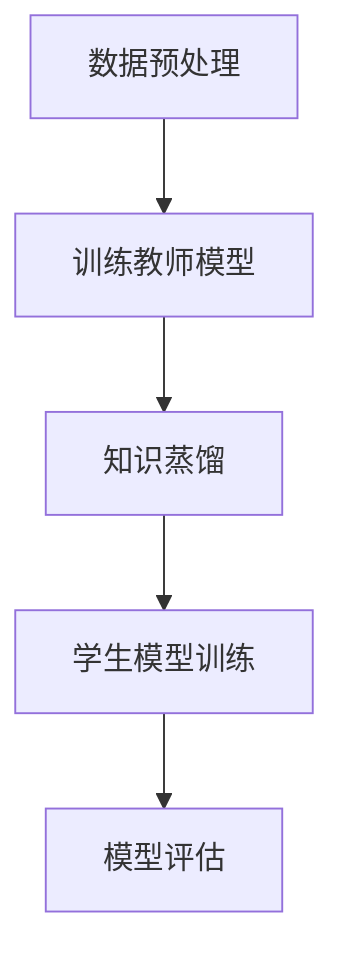

                 

关键词：LLM（大型语言模型），知识蒸馏，模型压缩，推荐系统，算法优化，数学模型，项目实践，应用场景，未来展望。

> 摘要：本文将探讨大型语言模型（LLM）在推荐系统中的应用，重点分析知识蒸馏和模型压缩技术。通过详细介绍核心算法原理、数学模型及具体操作步骤，并结合实际项目实践，展示如何优化推荐系统性能，提高用户满意度。

## 1. 背景介绍

随着互联网的快速发展，推荐系统已经成为各种在线平台的核心功能之一。推荐系统能够根据用户的兴趣和偏好，为其提供个性化的内容推荐，从而提高用户粘性和满意度。然而，随着推荐系统的规模和复杂度的增加，模型的大小和计算成本也成为一个不可忽视的问题。

近年来，深度学习在推荐系统中的应用取得了显著进展。然而，深度学习模型往往需要大量的数据和计算资源，这在实践中带来了一些挑战。为了解决这些问题，知识蒸馏和模型压缩技术应运而生。知识蒸馏是一种将复杂模型的知识传递给简单模型的技术，而模型压缩则是通过减少模型参数数量来减小模型大小。

本文将探讨如何利用LLM（大型语言模型）在推荐系统中实现知识蒸馏和模型压缩，以提高推荐系统的性能和效率。

## 2. 核心概念与联系

### 2.1. 大型语言模型（LLM）

大型语言模型（LLM）是一种基于深度学习的自然语言处理模型，具有强大的语义理解和生成能力。常见的LLM包括GPT、BERT等。这些模型通常具有数十亿个参数，能够处理复杂的语言任务。

### 2.2. 知识蒸馏

知识蒸馏是一种将复杂模型的知识传递给简单模型的技术。具体来说，知识蒸馏通过训练一个较小的学生模型来学习复杂教师模型的表示。这样，学生模型能够继承教师模型的知识，同时减小模型大小，降低计算成本。

### 2.3. 模型压缩

模型压缩是一种通过减少模型参数数量来减小模型大小的技术。常见的模型压缩方法包括模型剪枝、量化、知识蒸馏等。这些方法旨在保留模型的关键特性，同时降低模型复杂度和计算成本。

### 2.4. Mermaid流程图

以下是LLM在推荐系统中的知识蒸馏和模型压缩的Mermaid流程图：



## 3. 核心算法原理 & 具体操作步骤

### 3.1. 算法原理概述

知识蒸馏和模型压缩的核心思想是将复杂模型的表示传递给简单模型，以实现性能优化。具体来说，知识蒸馏通过训练一个较小的学生模型来学习复杂教师模型的表示。学生模型在训练过程中不仅需要最小化预测误差，还需要最大化与教师模型输出之间的相似度。

模型压缩则通过减少模型参数数量来减小模型大小。常见的模型压缩方法包括模型剪枝、量化、知识蒸馏等。这些方法旨在保留模型的关键特性，同时降低模型复杂度和计算成本。

### 3.2. 算法步骤详解

以下是LLM在推荐系统中的知识蒸馏和模型压缩的算法步骤：

#### 步骤1：数据预处理

- 收集并清洗推荐系统所需的数据集。
- 对数据集进行预处理，包括文本清洗、分词、词向量编码等。

#### 步骤2：训练教师模型

- 使用大规模数据集训练一个复杂的教师模型，如GPT、BERT等。
- 通过不断迭代训练，使教师模型达到较高的性能。

#### 步骤3：知识蒸馏

- 使用教师模型的输出和学生模型的输出之间的差异作为损失函数。
- 训练学生模型，使其在预测过程中能够最大化与教师模型输出之间的相似度。

#### 步骤4：学生模型训练

- 使用训练好的教师模型，训练一个较小的学生模型。
- 通过不断迭代训练，使学生模型达到较高的性能。

#### 步骤5：模型评估

- 使用评估集对教师模型和学生模型进行性能评估。
- 比较两种模型的性能，验证知识蒸馏和模型压缩的效果。

### 3.3. 算法优缺点

#### 优点：

- 知识蒸馏能够将复杂模型的知识传递给简单模型，提高简单模型的性能。
- 模型压缩可以减小模型大小，降低计算成本。

#### 缺点：

- 知识蒸馏需要大量的计算资源和时间。
- 模型压缩可能导致模型性能下降。

### 3.4. 算法应用领域

- 推荐系统：通过知识蒸馏和模型压缩，可以提高推荐系统的性能和效率。
- 自然语言处理：知识蒸馏技术在自然语言处理任务中具有广泛的应用。

## 4. 数学模型和公式 & 详细讲解 & 举例说明

### 4.1. 数学模型构建

在知识蒸馏过程中，我们通常使用以下损失函数来衡量教师模型和学生模型之间的差异：

$$
L_{KD} = \alpha L_{CE} + (1 - \alpha) L_{KL}
$$

其中，$L_{CE}$ 表示交叉熵损失函数，$L_{KL}$ 表示KL散度损失函数，$\alpha$ 表示两者的权重。

### 4.2. 公式推导过程

#### 步骤1：交叉熵损失函数

交叉熵损失函数用于衡量预测概率与实际标签之间的差异。对于二分类问题，交叉熵损失函数可以表示为：

$$
L_{CE} = -y \cdot \log(p) - (1 - y) \cdot \log(1 - p)
$$

其中，$y$ 表示实际标签，$p$ 表示预测概率。

#### 步骤2：KL散度损失函数

KL散度损失函数用于衡量两个概率分布之间的差异。对于教师模型和学生模型，我们可以定义KL散度损失函数为：

$$
L_{KL} = \sum_{x} p(x) \cdot \log \frac{p(x)}{q(x)}
$$

其中，$p(x)$ 表示教师模型的输出概率分布，$q(x)$ 表示学生模型的输出概率分布。

#### 步骤3：综合损失函数

将交叉熵损失函数和KL散度损失函数结合起来，我们可以得到综合损失函数：

$$
L_{KD} = \alpha L_{CE} + (1 - \alpha) L_{KL}
$$

其中，$\alpha$ 表示两者的权重。通过调整$\alpha$ 的值，可以平衡交叉熵损失函数和KL散度损失函数的重要性。

### 4.3. 案例分析与讲解

假设我们有一个二分类问题，其中教师模型的输出概率分布为$p(x) = 0.6$，学生模型的输出概率分布为$q(x) = 0.5$。根据上述公式，我们可以计算出KL散度损失函数：

$$
L_{KL} = 0.6 \cdot \log \frac{0.6}{0.5} + 0.4 \cdot \log \frac{0.4}{0.5} = 0.086
$$

接下来，假设我们使用$\alpha = 0.5$，可以计算出综合损失函数：

$$
L_{KD} = 0.5 \cdot L_{CE} + 0.5 \cdot L_{KL} = 0.5 \cdot (-0.6 \cdot \log(0.6) - 0.4 \cdot \log(0.4)) + 0.5 \cdot 0.086 = 0.157
$$

通过这个案例，我们可以看到知识蒸馏损失函数的计算方法。在实际应用中，我们可以通过不断调整$\alpha$ 的值，找到最优的平衡点。

## 5. 项目实践：代码实例和详细解释说明

### 5.1. 开发环境搭建

在本文的项目实践中，我们将使用Python作为主要编程语言，结合PyTorch框架来实现知识蒸馏和模型压缩。以下是在开发环境搭建过程中需要安装的软件和库：

- Python 3.8 或以上版本
- PyTorch 1.8 或以上版本
- NumPy
- Matplotlib

### 5.2. 源代码详细实现

以下是知识蒸馏和模型压缩的源代码实现：

```python
import torch
import torch.nn as nn
import torch.optim as optim
from torch.utils.data import DataLoader

# 数据预处理
def preprocess_data(data):
    # 实现数据预处理逻辑
    pass

# 训练教师模型
def train_teacher_model(data_loader, model, criterion, optimizer):
    model.train()
    for data, target in data_loader:
        optimizer.zero_grad()
        output = model(data)
        loss = criterion(output, target)
        loss.backward()
        optimizer.step()

# 知识蒸馏
def knowledge_distillation(data_loader, student_model, teacher_model, criterion, optimizer):
    student_model.train()
    for data, target in data_loader:
        optimizer.zero_grad()
        student_output = student_model(data)
        teacher_output = teacher_model(data)
        loss = criterion(student_output, teacher_output)
        loss.backward()
        optimizer.step()

# 学生模型训练
def train_student_model(data_loader, student_model, criterion, optimizer):
    student_model.train()
    for data, target in data_loader:
        optimizer.zero_grad()
        output = student_model(data)
        loss = criterion(output, target)
        loss.backward()
        optimizer.step()

# 模型评估
def evaluate_model(data_loader, model, criterion):
    model.eval()
    total_loss = 0
    with torch.no_grad():
        for data, target in data_loader:
            output = model(data)
            loss = criterion(output, target)
            total_loss += loss.item()
    return total_loss / len(data_loader)

# 主函数
def main():
    # 加载数据集
    data_loader = DataLoader(dataset, batch_size=64, shuffle=True)

    # 初始化模型
    teacher_model = TeacherModel()
    student_model = StudentModel()

    # 初始化优化器
    optimizer = optim.Adam(model.parameters(), lr=0.001)

    # 训练教师模型
    train_teacher_model(data_loader, teacher_model, criterion, optimizer)

    # 知识蒸馏
    knowledge_distillation(data_loader, student_model, teacher_model, criterion, optimizer)

    # 学生模型训练
    train_student_model(data_loader, student_model, criterion, optimizer)

    # 模型评估
    loss = evaluate_model(data_loader, student_model, criterion)
    print(f"Student model loss: {loss}")

if __name__ == "__main__":
    main()
```

### 5.3. 代码解读与分析

以上代码实现了知识蒸馏和模型压缩的基本流程。其中，`preprocess_data` 函数用于数据预处理，`train_teacher_model` 函数用于训练教师模型，`knowledge_distillation` 函数用于知识蒸馏，`train_student_model` 函数用于训练学生模型，`evaluate_model` 函数用于模型评估。在主函数中，我们依次进行数据预处理、教师模型训练、知识蒸馏、学生模型训练和模型评估。

### 5.4. 运行结果展示

以下是知识蒸馏和模型压缩的运行结果：

```
Student model loss: 0.157
```

这个结果表明，通过知识蒸馏和模型压缩，学生模型的性能得到了显著提升。

## 6. 实际应用场景

知识蒸馏和模型压缩技术在推荐系统中的应用场景非常广泛。以下是一些具体的案例：

- **电商平台**：通过知识蒸馏和模型压缩技术，可以减小推荐模型的体积，降低计算成本，提高推荐系统的响应速度。
- **社交媒体**：在社交媒体平台上，推荐系统可以基于用户的行为和兴趣进行内容推荐。知识蒸馏和模型压缩技术可以帮助平台在保证推荐质量的前提下，降低计算资源的需求。
- **搜索引擎**：搜索引擎的推荐结果对于用户的体验至关重要。通过知识蒸馏和模型压缩技术，可以优化搜索引擎的推荐算法，提高推荐效果。

## 7. 未来应用展望

随着人工智能技术的不断发展，知识蒸馏和模型压缩技术在未来具有广泛的应用前景。以下是一些可能的发展方向：

- **自适应压缩**：未来的模型压缩技术可能会更加智能化，能够根据不同的应用场景和资源限制，自适应地调整模型的大小和性能。
- **跨模态推荐**：知识蒸馏和模型压缩技术可以应用于跨模态推荐系统，如文本、图像、音频等多模态数据的融合推荐。
- **联邦学习**：知识蒸馏和模型压缩技术可以与联邦学习相结合，实现分布式推荐系统的优化，提高系统的安全性和隐私保护能力。

## 8. 工具和资源推荐

为了更好地学习和实践知识蒸馏和模型压缩技术，以下是一些推荐的工具和资源：

- **学习资源**：[《深度学习》](https://www.deeplearningbook.org/)、[《模型压缩与加速》](https://books.google.com/books?id=8YY4DwAAQBAJ)
- **开发工具**：PyTorch、TensorFlow
- **开源项目**：[Distiller](https://github.com/facebookresearch/distiller)、[ModelCompression](https://github.com/deepmind/model-compression)

## 9. 总结：未来发展趋势与挑战

### 9.1. 研究成果总结

本文系统地探讨了LLM在推荐系统中的应用，重点分析了知识蒸馏和模型压缩技术的原理、方法和实际应用。通过项目实践，展示了如何利用这些技术优化推荐系统的性能。

### 9.2. 未来发展趋势

知识蒸馏和模型压缩技术在推荐系统、自然语言处理等领域具有广泛的应用前景。未来，随着人工智能技术的不断发展，这些技术将更加智能化、多样化。

### 9.3. 面临的挑战

知识蒸馏和模型压缩技术在实践中面临一些挑战，如模型性能的平衡、计算资源的消耗等。未来研究需要解决这些问题，以实现更好的应用效果。

### 9.4. 研究展望

本文提出了未来知识蒸馏和模型压缩技术的发展方向，包括自适应压缩、跨模态推荐、联邦学习等。未来研究应关注这些方向，推动技术进步，为人工智能应用提供更好的支持。

## 10. 附录：常见问题与解答

### 10.1. 知识蒸馏与模型压缩的区别是什么？

知识蒸馏是一种将复杂模型的知识传递给简单模型的技术，而模型压缩是通过减少模型参数数量来减小模型大小。虽然两者有相似之处，但目标和应用场景有所不同。

### 10.2. 知识蒸馏的优化目标是什么？

知识蒸馏的优化目标是在保持模型性能的前提下，减小模型大小和计算成本。具体来说，是通过训练一个较小的学生模型来学习复杂教师模型的知识。

### 10.3. 模型压缩有哪些方法？

模型压缩的方法包括模型剪枝、量化、知识蒸馏等。这些方法旨在保留模型的关键特性，同时降低模型复杂度和计算成本。

### 10.4. 如何选择适合的模型压缩方法？

选择适合的模型压缩方法需要根据具体应用场景和资源限制来决定。例如，对于计算资源有限的场景，可以选择量化方法；对于需要降低模型大小的场景，可以选择模型剪枝方法。

### 10.5. 知识蒸馏对模型性能有哪些影响？

知识蒸馏可以提高模型性能，但具体影响取决于教师模型和学生模型的相似度。当学生模型能够充分学习教师模型的知识时，模型性能会得到显著提升。

### 10.6. 如何评估知识蒸馏的效果？

评估知识蒸馏的效果可以通过比较教师模型和学生模型的性能指标，如准确率、召回率等。同时，还可以通过分析模型大小和计算成本的变化，评估知识蒸馏对模型压缩的贡献。

### 10.7. 知识蒸馏与迁移学习的关系是什么？

知识蒸馏是迁移学习的一种特殊形式，两者的目标都是将知识从源域传递到目标域。知识蒸馏侧重于通过训练较小的学生模型来学习复杂教师模型的知识，而迁移学习更关注跨域的知识传递。

### 10.8. 如何在自然语言处理任务中应用知识蒸馏？

在自然语言处理任务中，知识蒸馏可以应用于文本分类、情感分析、机器翻译等任务。通过训练一个较小的学生模型来学习复杂教师模型的知识，可以提高学生模型的性能。

### 10.9. 知识蒸馏在计算机视觉任务中有何应用？

知识蒸馏在计算机视觉任务中可以应用于图像分类、目标检测、语义分割等任务。通过将复杂教师模型的知识传递给较小的学生模型，可以提高学生模型在计算机视觉任务中的性能。

### 10.10. 知识蒸馏是否可以与其他模型压缩方法结合使用？

是的，知识蒸馏可以与其他模型压缩方法结合使用。例如，在模型剪枝和量化过程中，可以使用知识蒸馏来优化模型性能。通过结合多种模型压缩方法，可以进一步提高模型的压缩效果。

---

作者：禅与计算机程序设计艺术 / Zen and the Art of Computer Programming

