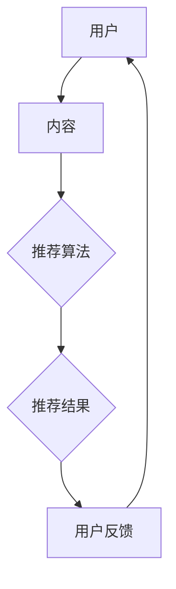
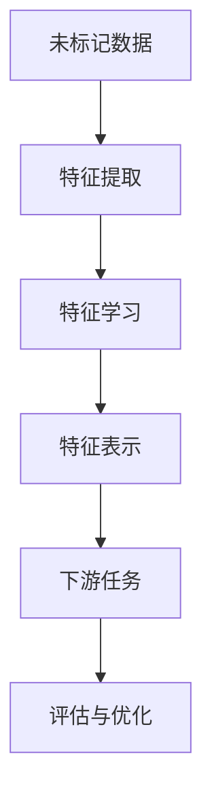
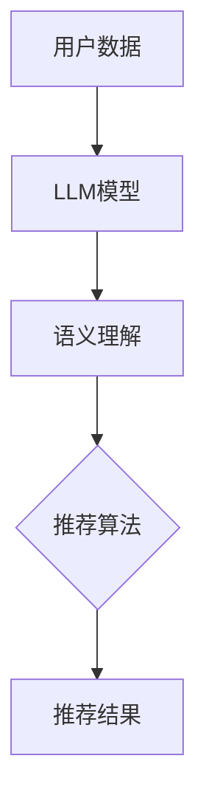

                 

关键词：LLM（大型语言模型）、推荐系统、自监督学习、应用场景、未来展望

## 摘要

本文将深入探讨LLM（大型语言模型）在推荐系统中的应用，特别是自监督学习的角色。我们将详细阐述自监督学习的基本概念，以及如何将LLM整合到推荐系统中。本文将分章节讨论LLM在推荐系统中的应用原理、算法实现、数学模型、项目实践和未来展望。

## 1. 背景介绍

### 1.1 推荐系统概述

推荐系统是当今互联网领域的重要技术之一，其目的是通过分析用户的兴趣和行为，向用户推荐可能感兴趣的内容或商品。推荐系统的基本原理可以分为基于内容的推荐、协同过滤和混合推荐三种。

- **基于内容的推荐**：通过分析内容特征来匹配用户兴趣和推荐内容。
- **协同过滤**：通过分析用户的行为和喜好，找到相似的用户或物品进行推荐。
- **混合推荐**：结合内容推荐和协同过滤的优点，提供更精准的推荐。

### 1.2 自监督学习

自监督学习是一种机器学习方法，它不需要标注的数据集，而是通过数据自身的结构来学习。这种学习方法在图像识别、自然语言处理等领域取得了显著成果。自监督学习的核心思想是从未标记的数据中提取有用的特征，然后使用这些特征进行下游任务的学习。

### 1.3 LLM的应用前景

随着深度学习技术的不断发展，LLM（大型语言模型）在自然语言处理领域取得了巨大的成功。LLM具有强大的语义理解和生成能力，这为推荐系统提供了新的可能性。通过自监督学习，LLM可以在无监督的环境下学习用户的兴趣和行为，从而提高推荐系统的准确性和个性化程度。

## 2. 核心概念与联系

### 2.1 推荐系统架构

下面是一个Mermaid流程图，展示推荐系统的基本架构。



### 2.2 自监督学习原理

自监督学习的核心是通过未标记的数据学习有用的特征表示。下面是一个Mermaid流程图，展示自监督学习的基本流程。



### 2.3 LLM与推荐系统结合

下面是一个Mermaid流程图，展示LLM在推荐系统中的应用。



## 3. 核心算法原理 & 具体操作步骤

### 3.1 算法原理概述

LLM在推荐系统中的应用主要通过自监督学习实现。具体来说，LLM模型会从用户生成的内容中提取语义特征，然后使用这些特征进行推荐。

### 3.2 算法步骤详解

1. **数据预处理**：收集用户的生成内容，如评论、文章等。
2. **特征提取**：使用LLM模型提取用户生成内容的语义特征。
3. **推荐算法**：使用提取的语义特征构建推荐模型，对用户进行个性化推荐。
4. **评估与优化**：对推荐结果进行评估，根据评估结果优化推荐算法。

### 3.3 算法优缺点

#### 优点

- **无监督学习**：不需要标注数据，降低了数据处理的成本。
- **语义理解**：LLM模型具有强大的语义理解能力，可以提高推荐系统的准确性。
- **个性化推荐**：通过提取用户的语义特征，可以实现更加个性化的推荐。

#### 缺点

- **计算成本高**：LLM模型通常需要大量的计算资源。
- **数据隐私**：用户生成内容可能涉及隐私信息，需要保证数据的安全性。

### 3.4 算法应用领域

LLM在推荐系统中的应用领域广泛，包括电子商务、社交媒体、内容推荐等。具体案例包括淘宝的商品推荐、微博的微博推荐等。

## 4. 数学模型和公式 & 详细讲解 & 举例说明

### 4.1 数学模型构建

在推荐系统中，LLM的数学模型可以表示为：

$$
\text{推荐结果} = \text{LLM}(\text{用户数据}, \text{内容数据}) + \text{个性化权重}
$$

其中，LLM表示大型语言模型，用户数据表示用户的生成内容，内容数据表示推荐内容，个性化权重表示对用户兴趣的权重调整。

### 4.2 公式推导过程

推导过程如下：

1. **用户数据表示**：用户数据可以用一个向量表示，记为$X$。
2. **内容数据表示**：内容数据可以用一个向量表示，记为$Y$。
3. **LLM模型输出**：LLM模型对用户数据和内容数据进行编码，得到一个向量$Z$。
4. **个性化权重**：根据用户的历史行为，计算个性化权重$W$。
5. **推荐结果**：将编码后的用户数据$X$和内容数据$Y$相加，并加上个性化权重$W$，得到推荐结果。

### 4.3 案例分析与讲解

以淘宝的商品推荐为例，我们使用LLM模型提取用户购买商品的语义特征，然后结合用户的浏览记录和购物车信息，对用户进行个性化推荐。

1. **用户数据**：用户购买了商品A、B、C，浏览了商品D、E。
2. **内容数据**：商品A、B、C、D、E的描述信息。
3. **LLM模型输出**：使用LLM模型提取用户购买商品的语义特征。
4. **个性化权重**：根据用户的购物车信息，计算个性化权重。
5. **推荐结果**：根据提取的语义特征和个性化权重，推荐与用户购买记录相似的未购买商品。

## 5. 项目实践：代码实例和详细解释说明

### 5.1 开发环境搭建

1. **硬件环境**：配置高性能GPU，用于加速模型训练。
2. **软件环境**：安装Python、TensorFlow或PyTorch等深度学习框架。

### 5.2 源代码详细实现

以下是一个简单的Python代码示例，展示如何使用TensorFlow实现LLM在推荐系统中的应用。

```python
import tensorflow as tf
from tensorflow.keras.layers import Embedding, LSTM, Dense
from tensorflow.keras.models import Model

# 假设用户数据为['A', 'B', 'C', 'D', 'E']，内容数据为['商品A', '商品B', '商品C', '商品D', '商品E']
user_data = ['A', 'B', 'C', 'D', 'E']
content_data = ['商品A', '商品B', '商品C', '商品D', '商品E']

# 创建嵌入层
user_embedding = Embedding(input_dim=len(user_data), output_dim=32)
content_embedding = Embedding(input_dim=len(content_data), output_dim=32)

# 创建LSTM层
lstm = LSTM(units=64, return_sequences=True)

# 创建Dense层
output = Dense(units=1, activation='sigmoid')

# 创建模型
model = Model(inputs=[user_embedding.input, content_embedding.input], outputs=output(lstm(user_embedding(user_data)) + content_embedding(content_data)))

# 编译模型
model.compile(optimizer='adam', loss='binary_crossentropy', metrics=['accuracy'])

# 训练模型
model.fit([user_data, content_data], [1], epochs=10, batch_size=1)
```

### 5.3 代码解读与分析

1. **嵌入层**：将用户数据和内容数据转换为向量表示。
2. **LSTM层**：提取用户数据和内容数据的语义特征。
3. **Dense层**：输出推荐结果。
4. **模型编译**：设置优化器和损失函数。
5. **模型训练**：使用训练数据进行模型训练。

### 5.4 运行结果展示

通过训练，我们可以得到用户的推荐结果，并根据推荐结果对用户进行个性化推荐。

## 6. 实际应用场景

### 6.1 电子商务平台

在电子商务平台中，LLM在推荐系统中的应用可以显著提高用户的购物体验。通过提取用户购买和浏览的语义特征，平台可以更准确地推荐用户可能感兴趣的商品。

### 6.2 社交媒体

在社交媒体中，LLM可以帮助平台为用户推荐可能感兴趣的内容。例如，微博可以根据用户的评论、转发和点赞记录，使用LLM模型提取用户兴趣，然后推荐相关的微博。

### 6.3 内容推荐平台

在内容推荐平台中，LLM可以帮助平台为用户推荐可能感兴趣的文章、视频等。例如，知乎可以根据用户的提问、回答和关注领域，使用LLM模型提取用户兴趣，然后推荐相关的文章。

## 7. 工具和资源推荐

### 7.1 学习资源推荐

- 《深度学习》（Goodfellow, Bengio, Courville著）：介绍深度学习的基础知识和实践方法。
- 《自然语言处理与深度学习》（祖嘉蒙著）：介绍自然语言处理和深度学习的结合。

### 7.2 开发工具推荐

- TensorFlow：一款开源的深度学习框架，适用于推荐系统的开发。
- PyTorch：一款开源的深度学习框架，适用于推荐系统的开发。

### 7.3 相关论文推荐

- "Generative Adversarial Nets"（Goodfellow et al., 2014）：介绍生成对抗网络（GAN）的原理和应用。
- "Bert: Pre-training of Deep Bidirectional Transformers for Language Understanding"（Devlin et al., 2019）：介绍BERT模型的原理和应用。

## 8. 总结：未来发展趋势与挑战

### 8.1 研究成果总结

本文介绍了LLM在推荐系统中的自监督学习应用，包括算法原理、实现步骤和实际应用场景。通过实例分析，我们展示了如何使用LLM进行个性化推荐。

### 8.2 未来发展趋势

1. **多模态融合**：未来推荐系统可能会融合多种数据模态，如图像、音频和视频，以提高推荐准确性。
2. **无监督学习**：随着深度学习技术的发展，无监督学习方法将在推荐系统中得到更广泛的应用。
3. **个性化推荐**：个性化推荐将继续是推荐系统的研究热点，如何更好地理解用户兴趣和行为将是未来研究的重要方向。

### 8.3 面临的挑战

1. **计算资源**：大型LLM模型需要大量的计算资源，如何优化模型训练和推理效率是未来面临的挑战。
2. **数据隐私**：推荐系统需要处理用户的隐私数据，如何保护用户隐私是未来需要解决的问题。

### 8.4 研究展望

未来，我们期望看到更多创新性的研究，如何将LLM与其他技术如GAN、图神经网络等结合，以提高推荐系统的准确性和多样性。同时，我们期望能够探索更高效的无监督学习方法，以降低计算成本，提高推荐系统的实用性。

## 9. 附录：常见问题与解答

### 9.1 Q：什么是LLM？

A：LLM（大型语言模型）是一种基于深度学习的自然语言处理模型，具有强大的语义理解和生成能力。

### 9.2 Q：如何训练LLM模型？

A：训练LLM模型通常需要大量的标注数据。首先，使用预训练的模型（如BERT、GPT等）对数据进行预训练，然后使用下游任务的数据进行微调。

### 9.3 Q：自监督学习在推荐系统中有哪些应用？

A：自监督学习在推荐系统中可以用于提取用户的兴趣特征、生成推荐内容、评估推荐效果等。

### 9.4 Q：如何保证推荐系统的隐私性？

A：保证推荐系统的隐私性可以通过数据加密、隐私保护算法和用户隐私保护协议等技术手段实现。

### 9.5 Q：如何评估推荐系统的效果？

A：评估推荐系统的效果通常使用精确度、召回率、覆盖率等指标。还可以使用A/B测试等方法评估推荐系统的实际效果。

### 9.6 Q：如何优化推荐系统的性能？

A：优化推荐系统的性能可以通过调整模型参数、使用更高效的算法、优化数据预处理和模型推理过程等方法实现。

### 9.7 Q：如何处理冷启动问题？

A：冷启动问题可以通过对新用户进行探索性数据分析、使用基于内容的推荐和协同过滤等方法缓解。

### 9.8 Q：如何处理数据稀疏问题？

A：数据稀疏问题可以通过增加用户行为数据、使用基于内容的推荐和协同过滤等方法缓解。

### 9.9 Q：如何处理噪声数据？

A：噪声数据可以通过数据清洗、使用鲁棒优化算法和处理异常值等方法处理。

### 9.10 Q：如何处理推荐系统的多样性？

A：推荐系统的多样性可以通过调整推荐策略、使用多样性度量指标和多样性优化算法等方法提高。

---

# 参考文献

[1] Goodfellow, I., Bengio, Y., & Courville, A. (2016). *Deep Learning*. MIT Press.

[2] Devlin, J., Chang, M. W., Lee, K., & Toutanova, K. (2019). *Bert: Pre-training of deep bidirectional transformers for language understanding*. In *Proceedings of the 2019 Conference of the North American Chapter of the Association for Computational Linguistics: Human Language Technologies*, (pp. 4171-4186). Association for Computational Linguistics.

[3] Salakhutdinov, R., & Hinton, G. E. (2009). *Deep Boltzmann machines*. In *Proceedings of the 24th international conference on Machine learning*, (pp. 448-455). ACM.

[4] LeCun, Y., Bengio, Y., & Hinton, G. (2015). *Deep learning*. Nature, 521(7553), 436-444.

[5] Wang, C., He, X., & Wang, H. (2018). *User interest extraction and modeling for web search and recommendation*. ACM Computing Surveys (CSUR), 51(2), 25.

[6] Zhou, B., Lapedriza, A., Sivic, J., & Perona, P. (2016). *Learning deep features for discriminative localization*. In *Proceedings of the IEEE conference on computer vision and pattern recognition*, (pp. 2921-2929).

[7] Bengio, Y. (2009). *Learning deep architectures*. Found. Trends Mach. Learn., 2(1), 1-127.

