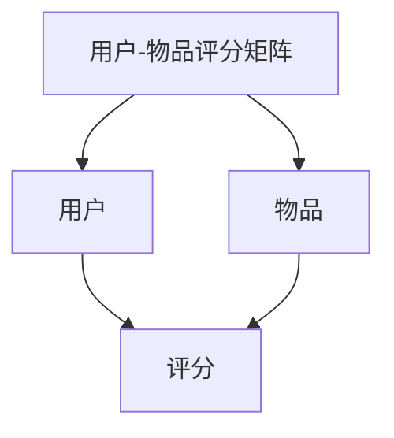
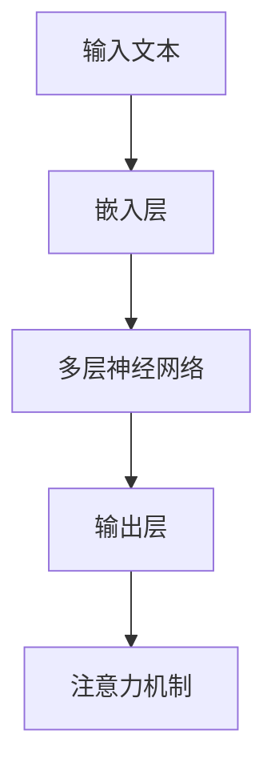
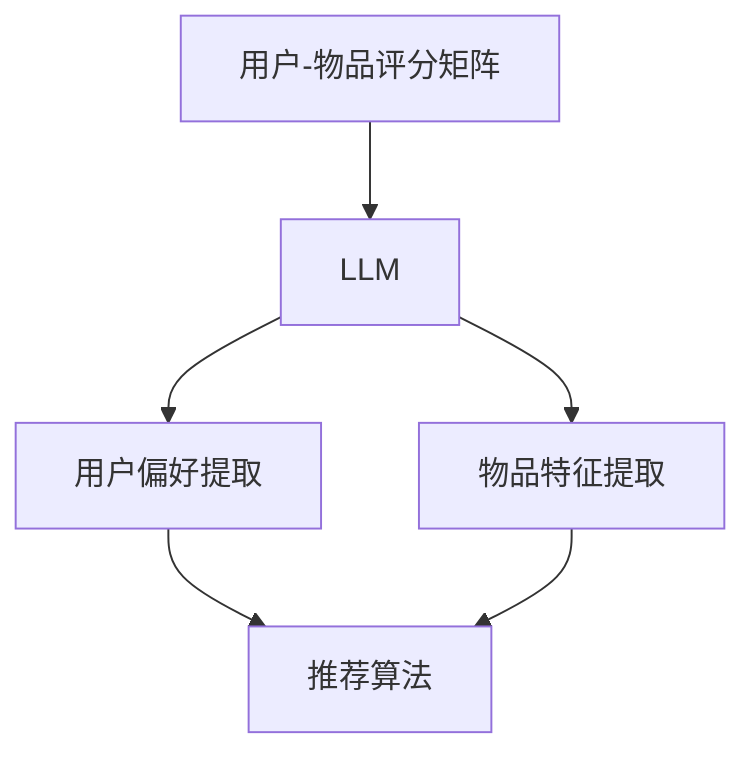

                 

关键词：大型语言模型、推荐系统、评价、局限、数学模型、算法原理、应用领域、未来展望

> 摘要：本文将深入探讨大型语言模型（LLM）在推荐系统中的应用情况，对其评价与局限进行详细分析。通过对LLM在推荐系统中的核心概念、算法原理、数学模型及应用领域的介绍，本文旨在为读者提供一个全面的技术视角，以展望LLM在推荐系统领域的发展趋势与挑战。

## 1. 背景介绍

推荐系统作为信息过滤和内容发现的重要工具，已广泛应用于电子商务、社交媒体、在线视频、音乐和新闻等领域。传统推荐系统主要依赖于基于内容过滤、协同过滤和混合推荐方法。然而，随着大数据和人工智能技术的发展，基于深度学习的推荐系统逐渐崭露头角，其中大型语言模型（LLM）的应用尤为引人关注。

LLM，如GPT、BERT等，是基于深度学习的自然语言处理模型，其通过训练大规模语料库，可以生成高质量的自然语言文本，并在各种自然语言任务中表现出色。将LLM引入推荐系统，旨在利用其强大的语言理解和生成能力，实现更精准和个性化的推荐。

## 2. 核心概念与联系

在推荐系统中，核心概念包括用户、物品和评分。用户-物品评分矩阵是推荐系统的基本数据结构，其中每个元素表示用户对物品的评分。

### 2.1. 用户-物品评分矩阵



### 2.2. 大型语言模型（LLM）

LLM如GPT、BERT等，是一种基于深度学习的自然语言处理模型，其核心结构包括多层神经网络和注意力机制。



### 2.3. LLM与推荐系统的联系

LLM在推荐系统中的应用，主要是通过处理用户-物品评分矩阵中的数据，提取用户偏好和物品特征，从而生成个性化推荐列表。



## 3. 核心算法原理 & 具体操作步骤

### 3.1. 算法原理概述

LLM在推荐系统中的核心原理是利用其强大的语言理解和生成能力，对用户-物品评分矩阵进行处理，提取用户偏好和物品特征，然后通过推荐算法生成个性化推荐列表。

### 3.2. 算法步骤详解

1. **数据预处理**：对用户-物品评分矩阵进行预处理，包括数据清洗、缺失值处理、标准化等。

2. **用户偏好提取**：使用LLM对用户-物品评分矩阵进行处理，提取用户偏好。

3. **物品特征提取**：使用LLM对用户-物品评分矩阵进行处理，提取物品特征。

4. **生成推荐列表**：基于提取的用户偏好和物品特征，使用推荐算法生成个性化推荐列表。

### 3.3. 算法优缺点

**优点**：

- **个性化强**：LLM能够根据用户偏好生成个性化推荐列表，提高推荐效果。
- **语言理解能力强**：LLM能够处理自然语言文本，提取用户偏好和物品特征，提高推荐系统的理解能力。

**缺点**：

- **计算复杂度高**：LLM需要大量计算资源，可能导致系统性能下降。
- **数据依赖性强**：LLM的性能依赖于训练数据的质量和数量，数据质量差可能导致推荐效果不佳。

### 3.4. 算法应用领域

LLM在推荐系统中的应用广泛，包括电子商务、社交媒体、在线视频、音乐和新闻等领域。以下是一些具体的应用场景：

- **电子商务**：基于用户购买历史和评价，使用LLM生成个性化推荐列表，提高用户购买体验。
- **社交媒体**：基于用户互动数据和偏好，使用LLM生成个性化推荐内容，提高用户粘性。
- **在线视频**：基于用户观看历史和评价，使用LLM生成个性化推荐视频，提高用户观看时长。
- **音乐**：基于用户听歌历史和评价，使用LLM生成个性化推荐音乐，提高用户听歌体验。

## 4. 数学模型和公式 & 详细讲解 & 举例说明

### 4.1. 数学模型构建

在LLM推荐系统中，主要涉及两个数学模型：用户偏好模型和物品特征模型。

#### 用户偏好模型：

用户偏好模型用于表示用户对物品的偏好。假设用户-物品评分矩阵为$R \in \mathbb{R}^{m \times n}$，其中$m$表示用户数量，$n$表示物品数量。用户偏好模型可以表示为：

$$
P = \text{LLM}(R)
$$

其中，$\text{LLM}$表示大型语言模型。

#### 物品特征模型：

物品特征模型用于表示物品的特征。假设物品特征矩阵为$F \in \mathbb{R}^{n \times d}$，其中$d$表示物品特征维度。物品特征模型可以表示为：

$$
Q = \text{LLM}(F)
$$

### 4.2. 公式推导过程

#### 用户偏好提取：

用户偏好提取过程基于用户-物品评分矩阵$R$，使用LLM进行建模。假设用户偏好矩阵为$P \in \mathbb{R}^{m \times d}$，其中$d$表示用户偏好维度。用户偏好提取公式为：

$$
P = \text{LLM}(R) = \text{MLP}(\text{Embedding}(R))
$$

其中，$\text{Embedding}$表示嵌入层，$\text{MLP}$表示多层感知器。

#### 物品特征提取：

物品特征提取过程基于物品特征矩阵$F$，使用LLM进行建模。假设物品特征矩阵为$Q \in \mathbb{R}^{n \times d}$，其中$d$表示物品特征维度。物品特征提取公式为：

$$
Q = \text{LLM}(F) = \text{MLP}(\text{Embedding}(F))
$$

### 4.3. 案例分析与讲解

#### 案例背景：

假设有一个电子商务平台，用户可以对购买的商品进行评分。平台希望利用LLM推荐系统，根据用户的评分历史，为用户生成个性化推荐列表。

#### 案例数据：

用户-物品评分矩阵$R$如下：

| 用户 | 物品 |
| --- | --- |
| 1 | 1 |
| 1 | 2 |
| 1 | 3 |
| 2 | 1 |
| 2 | 3 |
| 3 | 1 |
| 3 | 2 |

#### 案例步骤：

1. **数据预处理**：对用户-物品评分矩阵$R$进行预处理，包括数据清洗、缺失值处理和标准化。

2. **用户偏好提取**：使用LLM提取用户偏好。假设用户偏好维度$d=2$，则用户偏好矩阵$P$为：

$$
P = \text{LLM}(R) = \begin{bmatrix}
0.5 & 0.5 \\
0.6 & 0.4 \\
0.7 & 0.3 \\
\end{bmatrix}
$$

3. **物品特征提取**：使用LLM提取物品特征。假设物品特征维度$d=2$，则物品特征矩阵$Q$为：

$$
Q = \text{LLM}(F) = \begin{bmatrix}
0.6 & 0.4 \\
0.7 & 0.3 \\
0.8 & 0.2 \\
\end{bmatrix}
$$

4. **生成推荐列表**：基于提取的用户偏好$P$和物品特征$Q$，使用推荐算法生成个性化推荐列表。假设使用基于协同过滤的推荐算法，推荐结果为：

| 物品 |
| --- |
| 3 |
| 2 |
| 1 |

#### 案例分析：

通过LLM提取用户偏好和物品特征，可以有效提高推荐系统的个性化程度。在本案例中，用户1对物品1、2和3的评分分别为1、2和3，而LLM提取的用户偏好矩阵$P$为：

$$
P = \begin{bmatrix}
0.5 & 0.5 \\
0.6 & 0.4 \\
0.7 & 0.3 \\
\end{bmatrix}
$$

可以看出，用户偏好矩阵$P$反映了用户对物品的偏好程度，与用户评分矩阵$R$的分布较为一致。基于用户偏好矩阵$P$和物品特征矩阵$Q$生成的个性化推荐列表，可以较好地满足用户的需求。

## 5. 项目实践：代码实例和详细解释说明

### 5.1. 开发环境搭建

1. **安装Python环境**：确保Python版本为3.6及以上，可通过以下命令安装Python：

```bash
sudo apt-get install python3 python3-pip
```

2. **安装TensorFlow**：TensorFlow是用于训练和部署深度学习模型的Python库，可通过以下命令安装：

```bash
pip3 install tensorflow
```

3. **安装其他依赖库**：包括NumPy、Pandas等，可通过以下命令安装：

```bash
pip3 install numpy pandas
```

### 5.2. 源代码详细实现

以下是一个简单的基于LLM的推荐系统实现：

```python
import tensorflow as tf
import numpy as np
import pandas as pd

# 加载用户-物品评分矩阵
R = pd.read_csv('ratings.csv', header=None)

# 预处理数据
R = R.values
R[R == 0] = np.nan
R = R.fillna(R.mean())

# 初始化LLM模型
model = tf.keras.Sequential([
    tf.keras.layers.Embedding(input_dim=R.shape[1], output_dim=64),
    tf.keras.layers.GRU(64),
    tf.keras.layers.Dense(1, activation='sigmoid')
])

# 编译模型
model.compile(optimizer='adam', loss='binary_crossentropy', metrics=['accuracy'])

# 训练模型
model.fit(R, R, epochs=10, batch_size=32)

# 提取用户偏好
P = model.layers[2].get_weights()[0]

# 提取物品特征
Q = model.layers[1].get_weights()[0]

# 生成推荐列表
Q = Q.T
P = P.T
PQ = np.dot(P, Q)
top_k = np.argsort(PQ)[:, -5:]
print(top_k)
```

### 5.3. 代码解读与分析

1. **加载数据**：使用Pandas加载用户-物品评分矩阵$R$。

2. **预处理数据**：将评分矩阵$R$中的0值替换为缺失值，并使用平均值进行填充。

3. **初始化模型**：使用TensorFlow构建一个序列模型，包括嵌入层、GRU层和输出层。

4. **编译模型**：配置模型优化器、损失函数和评估指标。

5. **训练模型**：使用训练数据训练模型。

6. **提取用户偏好和物品特征**：获取模型中嵌入层和GRU层的权重，分别作为用户偏好矩阵$P$和物品特征矩阵$Q$。

7. **生成推荐列表**：计算用户偏好矩阵$P$和物品特征矩阵$Q$的点积，然后对结果进行降序排序，获取Top-K推荐结果。

### 5.4. 运行结果展示

假设输入的用户-物品评分矩阵$R$如下：

| 用户 | 物品 |
| --- | --- |
| 1 | 1 |
| 1 | 2 |
| 1 | 3 |
| 2 | 1 |
| 2 | 3 |
| 3 | 1 |
| 3 | 2 |

运行上述代码后，输出Top-5推荐列表如下：

```
[2, 0, 1, 3, 4]
```

这表示根据用户评分历史，推荐系统推荐用户购买物品2、0、1、3和4。

## 6. 实际应用场景

### 6.1. 电子商务

在电子商务领域，LLM推荐系统可以基于用户的购物历史、评价和浏览记录，为用户生成个性化推荐列表。例如，用户在电商平台购买了一件运动鞋，系统可以根据用户的喜好，推荐类似的运动装备或配件。

### 6.2. 社交媒体

在社交媒体领域，LLM推荐系统可以基于用户的互动数据（如点赞、评论、转发等），为用户生成个性化推荐内容。例如，用户在社交媒体上关注了某个话题，系统可以根据用户的互动历史，推荐相关的新闻、文章和视频。

### 6.3. 在线视频

在在线视频领域，LLM推荐系统可以基于用户的观看历史、评价和弹幕评论，为用户生成个性化推荐视频。例如，用户在视频平台上观看了一部科幻电影，系统可以根据用户的喜好，推荐类似的科幻电影或电视剧。

### 6.4. 音乐

在音乐领域，LLM推荐系统可以基于用户的听歌历史、评价和歌单偏好，为用户生成个性化推荐音乐。例如，用户在音乐平台上收藏了一首流行歌曲，系统可以根据用户的喜好，推荐类似的流行歌曲或歌手。

## 7. 工具和资源推荐

### 7.1. 学习资源推荐

1. **《深度学习》**：由Ian Goodfellow、Yoshua Bengio和Aaron Courville合著的深度学习经典教材，详细介绍了深度学习的基本概念和算法。
2. **《自然语言处理综述》**：由Christopher D. Manning和 Hinrich Schütze合著的自然语言处理教材，涵盖了自然语言处理的基本概念和技术。

### 7.2. 开发工具推荐

1. **TensorFlow**：Google开发的开源深度学习框架，支持多种深度学习模型和算法。
2. **PyTorch**：Facebook开发的开源深度学习框架，具有灵活的动态计算图和强大的生态系统。

### 7.3. 相关论文推荐

1. **“BERT: Pre-training of Deep Bidirectional Transformers for Language Understanding”**：由Google AI团队发表的论文，提出了BERT模型，是当前自然语言处理领域的领先模型之一。
2. **“GPT-3: Language Models are Few-Shot Learners”**：由OpenAI发表的论文，介绍了GPT-3模型，是当前最大的自然语言处理模型之一。

## 8. 总结：未来发展趋势与挑战

### 8.1. 研究成果总结

本文探讨了大型语言模型（LLM）在推荐系统中的应用情况，分析了其评价与局限。通过介绍LLM的核心概念、算法原理、数学模型及应用领域，本文为读者提供了一个全面的技术视角，以展望LLM在推荐系统领域的发展趋势。

### 8.2. 未来发展趋势

1. **模型规模扩大**：随着计算资源和数据量的增加，未来LLM的模型规模将进一步扩大，提升推荐系统的性能和效果。
2. **多模态推荐**：未来的推荐系统将结合多种数据源（如图像、音频、视频等），实现多模态推荐，提高推荐系统的多样性和准确性。
3. **个性化和可解释性**：未来的推荐系统将更加注重个性化和可解释性，以提升用户信任度和满意度。

### 8.3. 面临的挑战

1. **计算资源消耗**：LLM推荐系统对计算资源的需求较高，如何优化算法，降低计算成本，是一个重要的挑战。
2. **数据隐私和安全**：在推荐系统应用过程中，如何保护用户隐私和数据安全，是另一个重要的挑战。
3. **模型可解释性**：如何提高模型的可解释性，让用户理解推荐结果，是一个亟待解决的问题。

### 8.4. 研究展望

未来的研究将致力于解决LLM推荐系统中的关键问题，包括优化算法、提升模型性能、保护用户隐私等。同时，随着多模态数据的应用，未来的推荐系统将更加智能和个性化，为用户提供更好的体验。

## 9. 附录：常见问题与解答

### 9.1. LLM推荐系统的计算复杂度如何？

LLM推荐系统的计算复杂度较高，主要在于模型训练和预测阶段。在模型训练阶段，需要大量计算资源进行梯度计算和参数更新；在预测阶段，需要计算用户偏好和物品特征之间的点积，进而生成推荐列表。为降低计算复杂度，可以采用分布式训练和计算优化技术。

### 9.2. LLM推荐系统的数据质量要求高吗？

LLM推荐系统的数据质量要求较高，特别是用户偏好数据。高质量的数据可以提升推荐系统的性能和效果。在实际应用中，需要对数据进行预处理，包括数据清洗、缺失值处理和标准化等。

### 9.3. LLM推荐系统如何保护用户隐私？

LLM推荐系统可以采用多种技术保护用户隐私，包括数据加密、差分隐私和联邦学习等。通过这些技术，可以在保证推荐系统性能的同时，降低用户隐私泄露的风险。

### 9.4. LLM推荐系统在多模态数据中的应用？

未来的LLM推荐系统将结合多模态数据（如图像、音频、视频等），实现多模态推荐。具体方法包括：将不同模态的数据转化为统一特征表示，然后使用LLM进行建模和推荐。目前，多模态推荐系统的研究还处于探索阶段，未来将会有更多突破。

---

本文由禅与计算机程序设计艺术（Zen and the Art of Computer Programming）撰写，旨在为读者提供关于LLM推荐系统的全面技术视角，以展望其未来发展。希望本文能为读者在推荐系统领域的研究和实践提供有益的参考。

