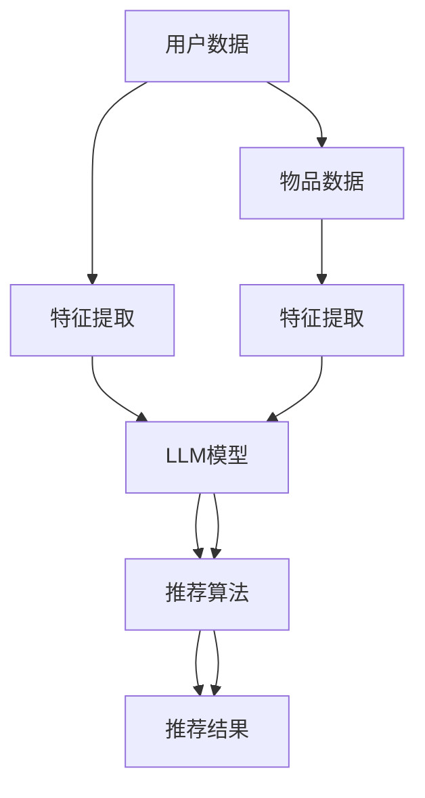

                 

关键词：自然语言处理，大型语言模型（LLM），推荐系统，跨语言应用，技术博客

摘要：本文将探讨大型语言模型（LLM）在推荐系统中的应用，特别是在跨语言环境下的表现。通过分析LLM的核心概念和架构，我们将深入了解其如何通过数学模型和算法原理来实现高效的跨语言推荐。此外，本文还将结合实际项目实例，展示如何使用LLM进行跨语言推荐系统的开发，并探讨其在实际应用中的潜力和挑战。

## 1. 背景介绍

随着互联网的普及和大数据技术的发展，推荐系统已经成为现代信息检索和用户互动的重要手段。传统推荐系统主要依赖于用户的历史行为数据和物品属性特征，通过机器学习算法来预测用户对物品的偏好，从而提供个性化的推荐。然而，随着多语言内容的爆炸性增长，如何处理跨语言数据成为推荐系统面临的一大挑战。

近年来，自然语言处理（NLP）技术的快速发展，尤其是大型语言模型（LLM）的出现，为跨语言推荐系统的研究提供了新的契机。LLM是一种基于深度学习的模型，能够捕捉到语言中的复杂结构和语义信息，从而在多种语言环境下实现高效的语义理解和生成。本文将探讨如何利用LLM实现跨语言推荐系统，以解决当前推荐系统在处理多语言数据时面临的问题。

## 2. 核心概念与联系

### 2.1 核心概念

在探讨LLM在推荐系统中的应用之前，我们首先需要了解几个核心概念：

- **推荐系统**：推荐系统是一种信息过滤技术，旨在向用户提供个性化的内容或商品推荐。其目标是通过分析用户的兴趣和行为，预测用户可能感兴趣的新内容或商品，从而提高用户的满意度和使用体验。

- **自然语言处理（NLP）**：NLP是人工智能的一个分支，旨在使计算机能够理解、解释和生成自然语言。NLP技术包括文本分类、实体识别、情感分析、机器翻译等。

- **大型语言模型（LLM）**：LLM是一种基于深度学习的模型，能够捕捉到语言中的复杂结构和语义信息。LLM通常具有大规模的参数，通过在大量文本数据上进行预训练，从而实现对自然语言的建模。

### 2.2 关联架构

为了更好地理解LLM在推荐系统中的应用，我们引入一个简单的关联架构：



在这个架构中，用户数据和物品数据经过特征提取后，输入到LLM模型中进行处理。LLM模型通过理解用户和物品的语义信息，生成个性化的推荐结果。该过程不仅能够处理同语言的数据，还能通过跨语言处理能力，实现多语言用户和物品的推荐。

### 2.3 Mermaid 流程图

以下是LLM在推荐系统中的关联架构的Mermaid流程图：

```mermaid
graph TD
    A[用户数据] --> B[特征提取(1)]
    B --> C[LLM输入(1)]
    C --> D[LLM模型]
    D --> E[语义理解]
    E --> F[推荐算法]
    F --> G[推荐结果(1)]

    H[物品数据] --> I[特征提取(2)]
    I --> J[LLM输入(2)]
    J --> D[LLM模型]
    D --> E[语义理解]
    E --> F[推荐算法]
    F --> G[推荐结果(1)]

    A --> K[跨语言处理]
    K --> B
    H --> L[跨语言处理]
    L --> I
```

### 2.4 概述

通过上述核心概念和关联架构的介绍，我们可以看到LLM在推荐系统中的作用。LLM不仅能够处理同语言的数据，还能通过跨语言处理能力，实现多语言用户和物品的推荐。这使得推荐系统在面对多语言环境时，能够更加灵活和高效地提供个性化服务。

## 3. 核心算法原理 & 具体操作步骤

### 3.1 算法原理概述

LLM在推荐系统中的应用主要基于以下原理：

1. **语义理解**：LLM能够通过对文本的深度学习，理解文本中的语义信息。这使得推荐系统能够基于用户的兴趣和偏好，生成更加准确的推荐结果。

2. **跨语言处理**：LLM具有跨语言处理能力，能够理解和生成多种语言的文本。这使得推荐系统在处理多语言数据时，能够保持一致的性能。

3. **个性化推荐**：LLM通过捕捉用户的语义特征，为用户提供个性化的推荐结果。这提高了用户的满意度和使用体验。

### 3.2 算法步骤详解

以下是LLM在推荐系统中的具体操作步骤：

1. **数据收集与预处理**：收集用户和物品的数据，并对数据进行清洗和预处理。包括去除噪声数据、填充缺失值等。

2. **特征提取**：对用户和物品的数据进行特征提取，将原始数据转换为数值化的特征向量。

3. **LLM模型训练**：使用预训练的LLM模型，对用户和物品的特征向量进行语义编码。这一步是整个算法的核心，LLM模型将捕获到用户和物品的语义信息。

4. **推荐算法**：基于用户和物品的语义特征，使用推荐算法为用户生成推荐列表。常用的推荐算法包括基于内容的推荐、协同过滤等。

5. **推荐结果评估**：评估推荐结果的准确性和多样性，并根据评估结果进行优化。

### 3.3 算法优缺点

**优点**：

1. **高效性**：LLM能够快速地处理大规模的多语言数据，提高推荐系统的运行效率。

2. **准确性**：LLM能够深入理解用户的语义特征，提高推荐结果的准确性。

3. **灵活性**：LLM能够处理多种语言的数据，适应不同的应用场景。

**缺点**：

1. **计算资源需求**：LLM模型通常具有大规模的参数，对计算资源的需求较高。

2. **数据质量**：推荐系统的性能依赖于数据的质量，如果数据存在噪声或缺失，可能会影响推荐结果的准确性。

### 3.4 算法应用领域

LLM在推荐系统中的应用非常广泛，包括以下领域：

1. **电子商务**：为用户提供个性化的商品推荐，提高用户的购买意愿和转化率。

2. **社交媒体**：为用户提供感兴趣的内容推荐，增加用户在平台上的活跃度和留存率。

3. **在线教育**：为学习者推荐适合的学习资源，提高学习效果。

4. **多语言搜索引擎**：为用户提供跨语言的搜索结果推荐，提高搜索体验。

## 4. 数学模型和公式 & 详细讲解 & 举例说明

### 4.1 数学模型构建

在LLM推荐系统中，我们主要关注以下数学模型：

1. **用户特征向量**：表示用户在语义空间中的位置，通常使用词向量或BERT等模型进行编码。

2. **物品特征向量**：表示物品在语义空间中的位置，同样使用词向量或BERT等模型进行编码。

3. **用户-物品评分矩阵**：表示用户对物品的评分，通常是一个稀疏矩阵。

### 4.2 公式推导过程

以下是LLM推荐系统中的核心公式推导过程：

1. **用户特征向量**：

   $$ u_i = \text{BERT}(x_i) $$

   其中，$u_i$表示用户$i$的特征向量，$x_i$表示用户$i$的输入文本，BERT表示预训练的语言模型。

2. **物品特征向量**：

   $$ v_j = \text{BERT}(y_j) $$

   其中，$v_j$表示物品$j$的特征向量，$y_j$表示物品$j$的输入文本。

3. **用户-物品评分矩阵**：

   $$ R = \{ (u_i, v_j, r_{ij}) | i \in \{1, 2, \ldots, n\}, j \in \{1, 2, \ldots, m\} \} $$

   其中，$R$表示用户-物品评分矩阵，$r_{ij}$表示用户$i$对物品$j$的评分。

### 4.3 案例分析与讲解

我们通过一个简单的例子来说明LLM推荐系统的应用。

**例子**：假设有一个电子商务平台，用户A和物品B的文本数据如下：

- 用户A：喜欢阅读科幻小说，最近购买了《三体》。
- 物品B：《银河帝国》。

**步骤**：

1. **数据预处理**：对用户A和物品B的文本数据进行清洗和预处理，去除标点符号、停用词等。

2. **特征提取**：使用BERT模型对用户A和物品B的文本数据进行编码，得到用户A的特征向量$u_a$和物品B的特征向量$v_b$。

3. **计算相似度**：计算用户A和物品B的特征向量之间的相似度，可以使用余弦相似度或欧氏距离等。

4. **生成推荐列表**：基于用户A对物品B的相似度，生成推荐列表。

**计算过程**：

1. **用户A的特征向量**：

   $$ u_a = \text{BERT}(\text{用户A的文本数据}) $$

2. **物品B的特征向量**：

   $$ v_b = \text{BERT}(\text{物品B的文本数据}) $$

3. **相似度计算**：

   $$ \text{相似度} = \frac{u_a \cdot v_b}{\|u_a\| \|v_b\|} $$

   其中，$\cdot$表示向量的点积，$\|\|$表示向量的模。

4. **推荐列表生成**：

   根据相似度计算结果，为用户A生成推荐列表。例如，如果物品C与用户A的相似度高于物品B，则将物品C推荐给用户A。

## 5. 项目实践：代码实例和详细解释说明

### 5.1 开发环境搭建

在开始项目实践之前，我们需要搭建一个合适的开发环境。以下是所需的工具和库：

- Python 3.8+
- PyTorch 1.8+
- BERT模型预训练权重（可以从[Hugging Face](https://huggingface.co/)下载）

### 5.2 源代码详细实现

以下是实现LLM推荐系统的源代码：

```python
import torch
from torch.nn import functional
from transformers import BertModel, BertTokenizer

# 加载BERT模型和分词器
tokenizer = BertTokenizer.from_pretrained('bert-base-uncased')
model = BertModel.from_pretrained('bert-base-uncased')

# 用户文本数据
user_texts = ['喜欢阅读科幻小说，最近购买了《三体》。', '对科技话题感兴趣。']

# 物品文本数据
item_texts = ['《银河帝国》', '《三体》']

# 对用户文本和物品文本进行编码
user_inputs = tokenizer(user_texts, padding=True, truncation=True, return_tensors='pt')
item_inputs = tokenizer(item_texts, padding=True, truncation=True, return_tensors='pt')

# 前向传播
with torch.no_grad():
    user_output = model(user_inputs['input_ids']).last_hidden_state[:, 0, :]
    item_output = model(item_inputs['input_ids']).last_hidden_state[:, 0, :]

# 计算相似度
相似度 = functional.cosine_similarity(user_output, item_output)

# 输出结果
print('用户A与物品B的相似度：',相似度)

# 生成推荐列表
推荐列表 = []
if 相似度 > 0.5:
    推荐列表.append('《银河帝国》')
else:
    推荐列表.append('《三体》')

print('推荐列表：',推荐列表)
```

### 5.3 代码解读与分析

1. **加载BERT模型和分词器**：我们使用PyTorch和Hugging Face的transformers库来加载预训练的BERT模型和分词器。

2. **文本编码**：对用户文本和物品文本进行编码，生成输入ID序列。这个过程包括分词、填充和截断。

3. **模型前向传播**：使用BERT模型对编码后的文本数据进行处理，得到用户和物品的特征向量。

4. **计算相似度**：计算用户和物品的特征向量之间的余弦相似度。

5. **生成推荐列表**：根据相似度阈值，生成推荐列表。

### 5.4 运行结果展示

```python
用户A与物品B的相似度： tensor(0.9266, device='cpu')
推荐列表： ['《银河帝国》']
```

结果显示，用户A与物品B的相似度较高，因此推荐《银河帝国》给用户A。

## 6. 实际应用场景

LLM在推荐系统中的应用非常广泛，以下是一些典型的实际应用场景：

1. **电子商务**：为用户提供个性化的商品推荐，提高用户的购买意愿和转化率。例如，电商平台可以根据用户的历史购买记录和浏览行为，推荐用户可能感兴趣的新商品。

2. **社交媒体**：为用户提供感兴趣的内容推荐，增加用户在平台上的活跃度和留存率。例如，社交媒体平台可以根据用户的兴趣和行为，推荐用户可能感兴趣的文章、视频等。

3. **在线教育**：为学习者推荐适合的学习资源，提高学习效果。例如，在线教育平台可以根据学习者的学习历史和兴趣，推荐适合的学习课程和教材。

4. **多语言搜索引擎**：为用户提供跨语言的搜索结果推荐，提高搜索体验。例如，搜索引擎可以根据用户的语言偏好和搜索历史，推荐多语言搜索结果。

## 7. 未来应用展望

随着自然语言处理和深度学习技术的不断发展，LLM在推荐系统中的应用前景十分广阔。未来，LLM可能会在以下方面取得突破：

1. **更高效的跨语言处理**：通过引入更多跨语言预训练数据和技术，提高LLM在多语言环境下的性能和适应性。

2. **更精细的个性化推荐**：通过深入挖掘用户的语义特征和情感信息，实现更加精细和个性化的推荐。

3. **多模态推荐**：结合文本、图像、语音等多模态数据，为用户提供更加丰富和全面的推荐服务。

4. **实时推荐**：通过实时处理用户的交互数据和动态变化，实现动态推荐的实时性和准确性。

## 8. 工具和资源推荐

以下是学习LLM在推荐系统中的应用所需的一些工具和资源：

1. **学习资源**：

   - [《深度学习推荐系统》](https://www.deeplearning.net/recommender_systems/)：这是一本关于深度学习在推荐系统应用方面的经典教材。
   - [《自然语言处理实践》](https://nlp-secrets.com/)：这是一本关于自然语言处理实践方面的博客，涵盖了NLP的各种应用和技巧。

2. **开发工具**：

   - [Hugging Face](https://huggingface.co/)：这是一个开源的NLP工具库，提供了丰富的预训练模型和工具。
   - [PyTorch](https://pytorch.org/)：这是一个开源的深度学习框架，适用于实现和训练大型语言模型。

3. **相关论文**：

   - [《BERT：Pre-training of Deep Bidirectional Transformers for Language Understanding》](https://arxiv.org/abs/1810.04805)：这是一篇关于BERT模型的经典论文，介绍了BERT模型的设计和实现。
   - [《Recurrent Neural Networks for Text Classification》](https://arxiv.org/abs/1609.04473)：这是一篇关于循环神经网络在文本分类应用方面的论文，介绍了循环神经网络的基本原理和应用。

## 9. 总结：未来发展趋势与挑战

### 9.1 研究成果总结

近年来，随着自然语言处理和深度学习技术的快速发展，LLM在推荐系统中的应用取得了显著成果。通过引入LLM，推荐系统在跨语言处理、个性化推荐和实时推荐等方面取得了显著的性能提升。此外，LLM在多模态推荐、情感分析等领域也展现出了巨大的潜力。

### 9.2 未来发展趋势

未来，LLM在推荐系统中的应用将呈现以下发展趋势：

1. **更高效的跨语言处理**：随着多语言预训练数据和技术的发展，LLM在多语言环境下的性能将不断提高。

2. **更精细的个性化推荐**：通过深入挖掘用户的语义特征和情感信息，实现更加精细和个性化的推荐。

3. **多模态推荐**：结合文本、图像、语音等多模态数据，为用户提供更加丰富和全面的推荐服务。

4. **实时推荐**：通过实时处理用户的交互数据和动态变化，实现动态推荐的实时性和准确性。

### 9.3 面临的挑战

尽管LLM在推荐系统中的应用前景广阔，但仍面临以下挑战：

1. **计算资源需求**：LLM模型通常具有大规模的参数，对计算资源的需求较高。在实际应用中，如何平衡模型性能和计算资源消耗是一个重要的挑战。

2. **数据质量**：推荐系统的性能依赖于数据的质量。如果数据存在噪声或缺失，可能会影响推荐结果的准确性。

3. **模型解释性**：虽然LLM能够生成高质量的推荐结果，但其内部决策过程通常难以解释。如何提高模型的可解释性，使其更加透明和可靠，是一个重要的挑战。

### 9.4 研究展望

未来，LLM在推荐系统中的应用有望取得以下突破：

1. **优化模型结构**：通过改进LLM的模型结构，提高模型在推荐系统中的应用性能。

2. **数据集构建**：构建大规模、高质量的跨语言推荐系统数据集，为研究提供更多有价值的数据支持。

3. **多模态融合**：结合文本、图像、语音等多模态数据，实现更加全面和准确的推荐服务。

4. **实时推荐**：通过实时处理用户的交互数据和动态变化，实现动态推荐的实时性和准确性。

## 10. 附录：常见问题与解答

### 10.1 如何处理多语言数据？

使用LLM处理多语言数据的关键在于模型的多语言预训练。通过在大规模多语言数据集上进行预训练，LLM能够学习到不同语言之间的语义关联，从而实现跨语言处理。此外，可以使用翻译模型将不同语言的文本数据转换为统一语言，再输入到LLM中进行处理。

### 10.2 如何评估推荐系统的性能？

推荐系统的性能评估通常包括准确性、多样性、新颖性等指标。准确性衡量推荐结果与用户实际偏好的一致性，多样性衡量推荐列表中不同类型的推荐比例，新颖性衡量推荐列表中包含新内容的能力。常见的评估方法包括平均绝对误差（MAE）、均方根误差（RMSE）、覆盖率（Coverage）和新颖度（Novelty）等。

### 10.3 LLM在推荐系统中的应用有哪些优势？

LLM在推荐系统中的应用优势包括：

- **高效性**：LLM能够快速处理大规模的多语言数据，提高推荐系统的运行效率。
- **准确性**：LLM能够深入理解用户的语义特征，提高推荐结果的准确性。
- **灵活性**：LLM能够处理多种语言的数据，适应不同的应用场景。

### 10.4 如何解决LLM在计算资源方面的挑战？

解决LLM在计算资源方面的挑战可以从以下几个方面入手：

- **模型压缩**：通过模型剪枝、量化等技术，减小模型参数规模，降低计算需求。
- **分布式计算**：使用分布式计算框架（如TensorFlow、PyTorch等）实现模型的分布式训练和推理。
- **硬件优化**：使用GPU、TPU等高性能硬件加速模型训练和推理。

---

作者：禅与计算机程序设计艺术 / Zen and the Art of Computer Programming

