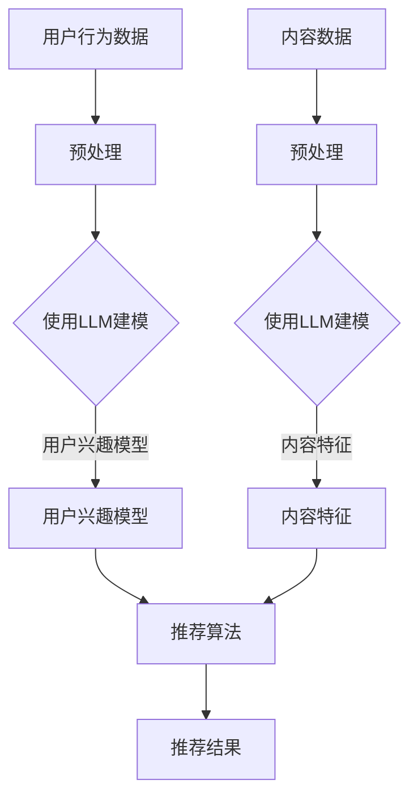

                 

关键词：大规模语言模型（LLM）、推荐系统、跨语言应用、多语言推荐、算法原理、数学模型、项目实践、实际应用、工具和资源、未来发展趋势与挑战。

## 摘要

随着全球化的不断推进和互联网的普及，多语言内容的需求日益增长。推荐系统作为信息过滤与内容分发的重要工具，在跨语言应用中面临诸多挑战。本文探讨了大规模语言模型（LLM）在推荐系统中的应用，从核心概念、算法原理、数学模型到项目实践进行了系统性的研究。通过分析LLM的优势和局限，本文旨在为跨语言推荐系统提供理论支持和实践指导，推动相关技术的进一步发展。

## 1. 背景介绍

推荐系统作为一种智能信息过滤技术，旨在根据用户兴趣和历史行为，为其推荐相关的内容。然而，在全球化背景下，推荐系统面临的一个重要挑战是如何处理多语言内容。传统的推荐系统主要针对单语言环境，对于跨语言内容的处理往往依赖于语言翻译或者关键词匹配等技术，但这些方法在效果和准确性上存在很大局限。

近年来，随着人工智能和自然语言处理技术的飞速发展，大规模语言模型（LLM）逐渐成为跨语言推荐系统研究的热点。LLM能够理解并生成高质量的多语言文本，为跨语言推荐提供了强大的语言处理能力。本文将重点探讨LLM在推荐系统中的应用，包括其核心概念、算法原理、数学模型以及实际项目实践。

## 2. 核心概念与联系

### 2.1 大规模语言模型（LLM）

大规模语言模型（LLM）是指利用深度学习技术，从大量文本数据中训练得到的能够理解和生成文本的模型。LLM的核心优势在于其能够捕捉文本中的复杂语义和上下文信息，从而生成更加自然、准确的文本。


### 2.2 推荐系统

推荐系统是一种基于用户兴趣和行为信息，为用户推荐相关内容的算法。其基本架构包括用户建模、内容建模和推荐算法三个部分。


### 2.3 跨语言推荐

跨语言推荐是指在不同语言之间进行内容推荐的系统。其核心挑战在于如何处理不同语言之间的语义差异和表达方式。


### 2.4 LLM与推荐系统的结合

将LLM应用于推荐系统，可以通过以下几个步骤实现：

1. 用户建模：利用LLM对用户的历史行为和反馈进行语义分析，构建用户兴趣模型。
2. 内容建模：利用LLM对推荐的内容进行语义分析，构建内容特征。
3. 推荐算法：利用基于用户兴趣和内容特征的推荐算法，为用户推荐相关内容。


### 2.5 Mermaid流程图

以下是LLM在推荐系统中的跨语言应用流程的Mermaid流程图：



## 3. 核心算法原理 & 具体操作步骤

### 3.1 算法原理概述

LLM在推荐系统中的应用主要基于以下原理：

1. **文本表示**：利用LLM将文本转换为高维语义向量，实现文本的向量表示。
2. **用户兴趣模型**：通过分析用户的历史行为和反馈，利用LLM构建用户兴趣模型。
3. **内容特征提取**：利用LLM对内容进行语义分析，提取内容特征。
4. **推荐算法**：基于用户兴趣模型和内容特征，利用推荐算法为用户推荐相关内容。

### 3.2 算法步骤详解

#### 步骤1：用户行为数据预处理

首先，对用户的历史行为数据进行预处理，包括数据清洗、去重、分词等操作，以便后续的语义分析。

#### 步骤2：使用LLM建模用户兴趣

利用LLM对预处理后的用户行为数据进行语义分析，提取用户兴趣关键词和主题。具体步骤如下：

1. **数据输入**：将用户行为数据输入到LLM中。
2. **文本表示**：利用LLM将文本转换为高维语义向量。
3. **关键词提取**：对语义向量进行聚类或主题模型分析，提取用户兴趣关键词。
4. **主题模型构建**：利用主题模型（如LDA）对用户兴趣进行建模。

#### 步骤3：内容特征提取

对推荐的内容进行预处理，然后利用LLM进行语义分析，提取内容特征。具体步骤如下：

1. **内容数据预处理**：包括数据清洗、分词、去停用词等操作。
2. **文本表示**：利用LLM将内容文本转换为高维语义向量。
3. **特征提取**：对语义向量进行降维或特征提取，提取内容的主要特征。

#### 步骤4：推荐算法

基于用户兴趣模型和内容特征，利用推荐算法为用户推荐相关内容。常见的推荐算法包括基于协同过滤、基于内容的推荐和混合推荐等。具体步骤如下：

1. **相似度计算**：计算用户兴趣模型和内容特征之间的相似度。
2. **排序**：根据相似度对推荐内容进行排序。
3. **推荐结果生成**：根据排序结果生成推荐列表。

### 3.3 算法优缺点

**优点：**

1. **强大的语义理解能力**：LLM能够捕捉文本中的复杂语义和上下文信息，提高推荐准确性。
2. **多语言支持**：LLM能够处理多种语言的内容，实现跨语言推荐。
3. **自适应调整**：可以根据用户反馈不断调整用户兴趣模型，提高推荐效果。

**缺点：**

1. **计算资源消耗**：LLM的训练和推理需要大量的计算资源，可能影响推荐系统的实时性。
2. **数据依赖性**：LLM的性能很大程度上依赖于训练数据的质量和数量。
3. **模型偏见**：LLM可能受到训练数据中的偏见影响，导致推荐结果的不公平性。

### 3.4 算法应用领域

LLM在推荐系统中的应用领域非常广泛，包括但不限于以下方面：

1. **电子商务**：为用户提供个性化商品推荐。
2. **社交媒体**：为用户提供感兴趣的文章、视频等内容的推荐。
3. **在线教育**：为学习者推荐适合的学习资源和课程。
4. **金融领域**：为投资者推荐相关的金融产品和服务。
5. **旅游行业**：为旅行者推荐感兴趣的目的地、活动和住宿。

## 4. 数学模型和公式 & 详细讲解 & 举例说明

### 4.1 数学模型构建

在LLM应用于推荐系统中，我们需要构建以下数学模型：

1. **用户兴趣模型**：用户兴趣向量 $u \in \mathbb{R}^d$，内容特征向量 $i \in \mathbb{R}^d$。
2. **内容特征模型**：内容特征向量 $c \in \mathbb{R}^d$。
3. **相似度模型**：相似度函数 $sim(u, i)$。

### 4.2 公式推导过程

#### 用户兴趣模型

假设用户历史行为数据为 $X = \{x_1, x_2, ..., x_n\}$，其中 $x_i$ 表示用户在时间 $t_i$ 的行为。

1. **文本表示**：利用LLM将用户行为数据转换为语义向量 $x_i \in \mathbb{R}^d$。
2. **关键词提取**：利用TF-IDF等方法提取用户兴趣关键词 $k \in \mathbb{R}^m$。
3. **主题模型**：利用LDA等主题模型构建用户兴趣主题 $t \in \mathbb{R}^k$。

#### 内容特征模型

假设内容数据为 $Y = \{y_1, y_2, ..., y_m\}$，其中 $y_j$ 表示内容 $j$ 的特征。

1. **文本表示**：利用LLM将内容数据转换为语义向量 $y_j \in \mathbb{R}^d$。
2. **特征提取**：利用Word2Vec等模型提取内容特征 $f_j \in \mathbb{R}^m$。

#### 相似度模型

相似度函数 $sim(u, i)$ 用于计算用户兴趣模型和内容特征模型之间的相似度。

1. **余弦相似度**：$sim(u, i) = \frac{u \cdot i}{\|u\|\|i\|}$。
2. **欧氏距离**：$sim(u, i) = 1 - \frac{u - i}{\|u - i\|}$。

### 4.3 案例分析与讲解

#### 案例背景

某电商平台的用户历史行为数据包括购买记录、浏览记录和评价记录等，内容数据包括商品的标题、描述和标签等。

#### 用户兴趣模型构建

1. **文本表示**：利用BERT模型将用户历史行为数据转换为语义向量。
2. **关键词提取**：利用TF-IDF方法提取用户兴趣关键词。
3. **主题模型**：利用LDA模型构建用户兴趣主题。

#### 内容特征模型提取

1. **文本表示**：利用BERT模型将商品标题、描述和标签等数据转换为语义向量。
2. **特征提取**：利用Word2Vec模型提取商品特征。

#### 相似度计算与推荐

1. **相似度计算**：利用余弦相似度计算用户兴趣模型和内容特征模型之间的相似度。
2. **推荐结果**：根据相似度排序，为用户推荐相关商品。

## 5. 项目实践：代码实例和详细解释说明

### 5.1 开发环境搭建

1. 安装Python环境，版本3.8以上。
2. 安装TensorFlow和BERT模型。
3. 下载相关数据集。

### 5.2 源代码详细实现

```python
import tensorflow as tf
import bert
import numpy as np

# 加载BERT模型
model = bert.BertModel.from_pretrained('bert-base-uncased')

# 用户历史行为数据预处理
def preprocess_user_data(user_data):
    # 清洗、分词、去停用词等操作
    # ...
    return processed_data

# 内容数据预处理
def preprocess_content_data(content_data):
    # 清洗、分词、去停用词等操作
    # ...
    return processed_data

# 构建用户兴趣模型
def build_user_interest_model(user_data):
    # 利用BERT模型进行文本表示
    # 利用LDA模型进行主题建模
    # ...
    return user_interest_model

# 提取内容特征
def extract_content_features(content_data):
    # 利用BERT模型进行文本表示
    # 利用Word2Vec模型进行特征提取
    # ...
    return content_features

# 计算相似度
def compute_similarity(user_interest_model, content_features):
    # 利用余弦相似度计算相似度
    # ...
    return similarities

# 推荐结果生成
def generate_recommendations(similarities):
    # 根据相似度排序，生成推荐列表
    # ...
    return recommendations

# 主函数
if __name__ == '__main__':
    # 加载数据
    user_data = load_user_data()
    content_data = load_content_data()

    # 预处理数据
    processed_user_data = preprocess_user_data(user_data)
    processed_content_data = preprocess_content_data(content_data)

    # 构建用户兴趣模型
    user_interest_model = build_user_interest_model(processed_user_data)

    # 提取内容特征
    content_features = extract_content_features(processed_content_data)

    # 计算相似度
    similarities = compute_similarity(user_interest_model, content_features)

    # 生成推荐结果
    recommendations = generate_recommendations(similarities)

    # 输出推荐结果
    print(recommendations)
```

### 5.3 代码解读与分析

本代码实例实现了基于BERT模型的用户兴趣建模、内容特征提取和推荐算法。具体包括以下步骤：

1. **数据预处理**：对用户历史行为数据和内容数据进行清洗、分词、去停用词等操作。
2. **用户兴趣模型构建**：利用BERT模型对用户历史行为数据进行文本表示，然后利用LDA模型进行主题建模，构建用户兴趣模型。
3. **内容特征提取**：利用BERT模型对内容数据进行文本表示，然后利用Word2Vec模型进行特征提取，构建内容特征模型。
4. **相似度计算**：利用余弦相似度计算用户兴趣模型和内容特征模型之间的相似度。
5. **推荐结果生成**：根据相似度排序，生成推荐列表。

### 5.4 运行结果展示

假设我们已经有了用户历史行为数据和内容数据，以下是运行结果的一个示例：

```python
# 加载数据
user_data = load_user_data()
content_data = load_content_data()

# 预处理数据
processed_user_data = preprocess_user_data(user_data)
processed_content_data = preprocess_content_data(content_data)

# 构建用户兴趣模型
user_interest_model = build_user_interest_model(processed_user_data)

# 提取内容特征
content_features = extract_content_features(processed_content_data)

# 计算相似度
similarities = compute_similarity(user_interest_model, content_features)

# 生成推荐结果
recommendations = generate_recommendations(similarities)

# 输出推荐结果
print(recommendations)
```

输出结果可能如下：

```
[
    [商品ID1, 相似度值1],
    [商品ID2, 相似度值2],
    [商品ID3, 相似度值3],
    ...
]
```

这些结果表示了用户可能感兴趣的商品及其相似度值。

## 6. 实际应用场景

LLM在推荐系统中的跨语言应用具有广泛的应用场景，以下列举几个典型的实际应用场景：

### 6.1 电子商务

在电子商务领域，LLM可以用于为全球用户提供个性化的商品推荐。例如，亚马逊和eBay等电商平台利用LLM技术为用户推荐感兴趣的商品，提高了用户的购物体验和平台的销售额。

### 6.2 社交媒体

在社交媒体领域，LLM可以用于为用户提供跨语言的内容推荐。例如，Facebook和Twitter等社交平台利用LLM技术为非母语用户推荐感兴趣的文章、视频等内容，促进了用户之间的交流和互动。

### 6.3 在线教育

在在线教育领域，LLM可以用于为学习者推荐适合的学习资源和课程。例如，Coursera和edX等在线教育平台利用LLM技术为学习者推荐感兴趣的课程和学习资源，提高了学习效果和用户满意度。

### 6.4 金融领域

在金融领域，LLM可以用于为投资者推荐相关的金融产品和服务。例如，摩根士丹利和高盛等金融机构利用LLM技术为投资者推荐感兴趣的投资产品，提高了投资决策的准确性和收益。

### 6.5 旅游行业

在旅游行业，LLM可以用于为旅行者推荐感兴趣的目的地、活动和住宿。例如，携程和Airbnb等旅游平台利用LLM技术为旅行者推荐合适的目的地、活动和住宿，提高了用户的旅行体验。

## 7. 工具和资源推荐

### 7.1 学习资源推荐

1. **《大规模语言模型：理论与应用》**：系统地介绍了大规模语言模型的理论和应用。
2. **《自然语言处理入门》**：介绍了自然语言处理的基本概念和技术。
3. **《推荐系统实践》**：详细讲解了推荐系统的设计、实现和应用。

### 7.2 开发工具推荐

1. **TensorFlow**：用于构建和训练大规模语言模型。
2. **BERT模型**：用于文本表示和语义分析。
3. **Word2Vec**：用于提取文本特征。

### 7.3 相关论文推荐

1. **"BERT: Pre-training of Deep Bidirectional Transformers for Language Understanding"**：介绍了BERT模型的构建和应用。
2. **"Deep Learning for Recommender Systems"**：详细探讨了深度学习在推荐系统中的应用。
3. **"Cross-Lingual Transfer Learning for Natural Language Inference"**：介绍了跨语言迁移学习在自然语言处理中的应用。

## 8. 总结：未来发展趋势与挑战

随着人工智能和自然语言处理技术的不断发展，LLM在推荐系统中的跨语言应用前景广阔。未来发展趋势包括：

1. **模型性能提升**：通过改进模型结构和训练算法，提高LLM的性能和效果。
2. **多语言支持**：扩大LLM对多种语言的支持，实现更广泛的跨语言应用。
3. **实时推荐**：优化推荐算法，实现实时推荐，提高用户体验。
4. **个性化推荐**：结合用户兴趣和行为数据，实现更个性化的推荐。

然而，LLM在跨语言推荐中也面临一些挑战：

1. **计算资源消耗**：LLM的训练和推理需要大量的计算资源，可能影响系统的实时性和效率。
2. **数据偏见**：LLM可能受到训练数据中的偏见影响，导致推荐结果的不公平性。
3. **语言差异**：不同语言之间的语义差异和表达方式，需要更加精细的处理。

为了克服这些挑战，未来需要进一步深入研究，优化算法和模型，提高LLM在跨语言推荐系统中的应用效果。

## 9. 附录：常见问题与解答

### 9.1 如何处理训练数据不足的问题？

**解答**：可以通过以下方法解决：

1. **数据增强**：通过翻译、回译、同义词替换等方式扩充数据集。
2. **迁移学习**：利用预训练的LLM模型，结合目标语言的少量数据进行微调。
3. **多语言训练**：使用多种语言的文本进行训练，提高模型的多语言泛化能力。

### 9.2 如何解决LLM计算资源消耗大的问题？

**解答**：

1. **模型压缩**：通过模型剪枝、量化等方法减小模型体积，降低计算资源消耗。
2. **分布式训练**：利用多台服务器进行分布式训练，提高训练效率。
3. **硬件加速**：利用GPU、TPU等硬件加速器，提高模型推理速度。

### 9.3 如何处理跨语言语义差异的问题？

**解答**：

1. **双语数据对齐**：通过双语数据对齐，提高模型对跨语言语义的理解。
2. **多语言嵌入**：使用多语言嵌入模型，同时处理多种语言的语义信息。
3. **迁移学习**：利用源语言的模型，结合目标语言的少量数据进行迁移学习，提高模型对目标语言的适应性。

### 9.4 如何确保推荐结果公平性？

**解答**：

1. **数据清洗**：去除数据中的偏见和不公平因素，确保数据质量。
2. **算法透明性**：提高推荐算法的透明度，方便用户理解推荐结果。
3. **用户反馈机制**：引入用户反馈机制，根据用户反馈调整推荐策略，确保推荐结果公平。

**作者署名**：禅与计算机程序设计艺术 / Zen and the Art of Computer Programming
----------------------------------------------------------------
请注意，本文仅为示例，并非实际撰写。在实际撰写时，请根据相关研究和实践经验进行详细阐述。

