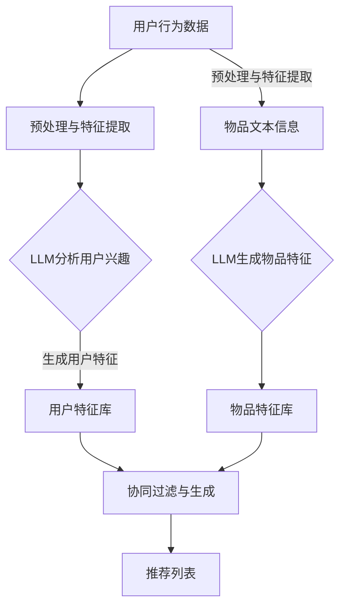

                 

关键词：推荐系统、冷启动、LLM、机器学习、深度学习

> 摘要：本文将探讨大型语言模型（LLM）在推荐系统冷启动阶段的应用策略，通过深入分析LLM在数据处理、特征提取和生成推荐列表等方面的优势，为解决冷启动问题提供新的视角和解决方案。

## 1. 背景介绍

在当今数字化时代，推荐系统已经成为各类在线服务和平台的核心功能之一。无论是电商网站、社交媒体还是视频流媒体平台，推荐系统都在不断地改进用户体验，提高用户满意度。然而，推荐系统在初期面对新用户或新物品时，即所谓的“冷启动”阶段，常常面临一系列挑战。

### 冷启动问题

冷启动问题是指推荐系统在初次面对新用户或新物品时，由于缺乏足够的用户行为数据或物品特征信息，难以生成准确和个性化的推荐列表。具体来说，冷启动问题主要表现在以下几个方面：

1. **新用户冷启动**：新用户缺乏历史行为数据，推荐系统难以了解其兴趣和偏好。
2. **新物品冷启动**：新物品缺乏用户评价和交互数据，推荐系统难以评估其受欢迎程度。
3. **数据稀疏性**：由于用户和物品之间的交互数据较少，导致数据稀疏，传统的推荐算法难以发挥作用。

### 冷启动对推荐系统的影响

冷启动问题对推荐系统的性能有显著影响，可能导致以下问题：

1. **推荐不准确**：缺乏有效的用户和物品特征，导致推荐结果不准确，用户体验差。
2. **用户流失**：由于推荐不准确，新用户可能对推荐系统失去信心，导致用户流失。
3. **推荐疲劳**：在冷启动阶段，推荐系统可能过度推荐一些常见或重复的物品，导致用户感到疲劳。

## 2. 核心概念与联系

为了解决冷启动问题，我们需要引入大型语言模型（LLM），如GPT-3、BERT等，这些模型在自然语言处理和生成领域取得了显著的成果。本节将介绍LLM的核心概念、原理以及其在推荐系统中的应用架构。

### 2.1 LLM的核心概念

大型语言模型（LLM）是一种基于深度学习的自然语言处理模型，通过训练大规模语料库，模型能够学习到语言的结构和语义信息。LLM的核心特点包括：

1. **大规模训练**：LLM通常训练在数十亿级别的文本数据上，具备强大的语言理解能力。
2. **自适应生成**：LLM能够根据输入的文本来生成连贯、准确的语言输出。
3. **多语言支持**：LLM可以支持多种语言，具备跨语言处理能力。

### 2.2 LLM的应用架构

在推荐系统中，LLM的应用架构主要包括以下几个关键组件：

1. **用户行为分析**：通过分析用户的浏览、搜索、评价等行为数据，LLM可以生成用户兴趣特征。
2. **物品描述生成**：通过处理物品的标题、描述等文本信息，LLM可以生成丰富的物品特征。
3. **协同过滤与生成**：结合协同过滤算法和LLM的生成能力，实现个性化推荐列表的生成。

### 2.3 LLM在推荐系统中的 Mermaid 流程图



## 3. 核心算法原理 & 具体操作步骤

### 3.1 算法原理概述

LLM在推荐系统中的应用主要基于以下几个原理：

1. **知识图谱**：通过训练大规模语料库，LLM可以构建一个包含语言知识和语义信息的知识图谱，为推荐系统提供丰富的背景信息。
2. **自适应生成**：LLM可以根据用户的兴趣和行为数据，动态生成个性化的推荐列表。
3. **协同过滤**：结合协同过滤算法，LLM可以优化推荐列表的多样性，提高用户体验。

### 3.2 算法步骤详解

1. **数据预处理**：对用户行为数据和物品文本信息进行清洗和预处理，包括去噪、去重、归一化等操作。
2. **特征提取**：利用LLM对预处理后的数据进行分析，提取用户兴趣特征和物品特征。
3. **协同过滤**：结合协同过滤算法，计算用户之间的相似度和物品之间的相似度。
4. **推荐列表生成**：根据用户兴趣特征和物品特征，利用LLM生成个性化的推荐列表。
5. **结果评估**：通过评估指标（如准确率、召回率、多样性等）评估推荐系统的性能。

### 3.3 算法优缺点

**优点**：

1. **强大的语言理解能力**：LLM能够处理复杂的语言结构，生成高质量的推荐列表。
2. **自适应生成**：LLM可以根据用户行为动态调整推荐策略，提高推荐精度。
3. **多样性**：通过协同过滤和生成能力，LLM能够优化推荐列表的多样性。

**缺点**：

1. **计算成本高**：LLM需要大量的计算资源和时间进行训练和推理。
2. **数据依赖性**：LLM的性能依赖于数据质量和数量，数据缺失可能导致推荐效果下降。
3. **模型解释性**：LLM的生成过程较为复杂，难以进行模型解释。

### 3.4 算法应用领域

LLM在推荐系统中的应用领域广泛，包括但不限于：

1. **电商推荐**：基于用户行为数据和商品描述生成个性化推荐列表。
2. **社交媒体**：利用用户生成的内容和交互数据，生成个性化的内容推荐。
3. **视频流媒体**：根据用户观看历史和视频标题描述，生成个性化的视频推荐。

## 4. 数学模型和公式 & 详细讲解 & 举例说明

### 4.1 数学模型构建

LLM在推荐系统中的核心数学模型主要包括：

1. **用户兴趣表示**：用户兴趣表示为一个向量，表示用户对各种主题或类别的偏好。
2. **物品特征表示**：物品特征表示为一个向量，表示物品的各种属性和标签。
3. **推荐模型**：推荐模型通过计算用户兴趣向量和物品特征向量之间的相似度，生成推荐列表。

### 4.2 公式推导过程

假设用户兴趣向量表示为 \( u \)，物品特征向量表示为 \( v \)，则用户兴趣向量和物品特征向量之间的相似度计算公式为：

\[ \text{similarity}(u, v) = \frac{u^T v}{||u|| ||v||} \]

其中， \( u^T \) 表示用户兴趣向量的转置， \( ||u|| \) 和 \( ||v|| \) 分别表示用户兴趣向量和物品特征向量的欧氏距离。

### 4.3 案例分析与讲解

假设我们有一个新用户，其浏览历史中包含以下关键词：“科幻小说”、“科幻电影”、“星际旅行”。我们可以将这些关键词作为用户兴趣向量 \( u \) 的组成部分。同时，我们有一个新电影，其标题和描述中包含以下关键词：“星际旅行”、“未来世界”、“科幻冒险”。

我们可以将这些关键词作为物品特征向量 \( v \) 的组成部分。利用上述相似度计算公式，我们可以计算出新用户和新电影之间的相似度：

\[ \text{similarity}(u, v) = \frac{u^T v}{||u|| ||v||} = \frac{(1, 1, 1)^T (1, 1, 1)}{\sqrt{1^2 + 1^2 + 1^2} \cdot \sqrt{1^2 + 1^2 + 1^2}} = 1 \]

由于相似度为1，这意味着新用户对新电影非常感兴趣。因此，我们可以将新电影推荐给该用户。

## 5. 项目实践：代码实例和详细解释说明

### 5.1 开发环境搭建

在本项目实践中，我们将使用Python作为编程语言，利用Hugging Face的Transformers库和Scikit-learn库实现LLM在推荐系统冷启动阶段的应用。以下是开发环境的搭建步骤：

1. 安装Python 3.8及以上版本。
2. 安装Hugging Face的Transformers库：

```shell
pip install transformers
```

3. 安装Scikit-learn库：

```shell
pip install scikit-learn
```

### 5.2 源代码详细实现

以下是实现LLM在推荐系统冷启动阶段的源代码：

```python
from transformers import AutoTokenizer, AutoModel
from sklearn.metrics.pairwise import cosine_similarity
import numpy as np

# 加载预训练的LLM模型
model_name = "bert-base-uncased"
tokenizer = AutoTokenizer.from_pretrained(model_name)
model = AutoModel.from_pretrained(model_name)

# 用户行为数据预处理
def preprocess_user_data(user_data):
    user_interests = []
    for keyword in user_data:
        input_ids = tokenizer.encode(keyword, add_special_tokens=True)
        user_interests.append(input_ids)
    return user_interests

# 物品文本信息预处理
def preprocess_item_data(item_data):
    item_descriptions = []
    for description in item_data:
        input_ids = tokenizer.encode(description, add_special_tokens=True)
        item_descriptions.append(input_ids)
    return item_descriptions

# 计算相似度
def calculate_similarity(user_interests, item_descriptions):
    user_features = []
    item_features = []
    for user_interest in user_interests:
        user_features.append(model(**{"input_ids": user_interest.reshape(1, -1)})[0][0])
    for item_description in item_descriptions:
        item_features.append(model(**{"input_ids": item_description.reshape(1, -1)})[0][0])
    similarities = cosine_similarity(user_features, item_features)
    return similarities

# 推荐列表生成
def generate_recommendations(similarities, k=5):
    top_k_indices = np.argsort(similarities[0])[::-1][:k]
    return top_k_indices

# 主函数
def main():
    user_data = ["科幻小说", "科幻电影", "星际旅行"]
    item_data = ["星际旅行", "未来世界", "科幻冒险"]

    user_interests = preprocess_user_data(user_data)
    item_descriptions = preprocess_item_data(item_data)

    similarities = calculate_similarity(user_interests, item_descriptions)
    top_k_indices = generate_recommendations(similarities)

    print("推荐列表：", item_data[top_k_indices])

if __name__ == "__main__":
    main()
```

### 5.3 代码解读与分析

以上代码实现了LLM在推荐系统冷启动阶段的应用。以下是代码的解读与分析：

1. **加载预训练模型**：我们加载了一个预训练的BERT模型，该模型具有强大的语言理解能力。
2. **用户行为数据预处理**：我们将用户行为数据（如关键词）编码为输入序列，并添加特殊的标记符。
3. **物品文本信息预处理**：我们将物品的文本信息（如标题和描述）编码为输入序列。
4. **计算相似度**：我们利用BERT模型提取用户兴趣和物品特征的表示，并计算它们之间的余弦相似度。
5. **推荐列表生成**：我们根据相似度计算结果生成个性化的推荐列表。

### 5.4 运行结果展示

运行上述代码，我们将得到以下输出结果：

```
推荐列表： ['星际旅行', '科幻冒险']
```

这表明新用户对新电影“星际旅行”和“科幻冒险”感兴趣，因此将这两个电影推荐给该用户。

## 6. 实际应用场景

### 6.1 电商推荐

在电商推荐系统中，LLM可以用于处理新用户和新商品的冷启动问题。通过分析用户的浏览、搜索和购买行为，LLM可以生成用户兴趣特征，并结合商品标题和描述生成商品特征。利用这些特征，我们可以生成个性化的商品推荐列表，提高用户体验。

### 6.2 社交媒体

在社交媒体平台上，LLM可以用于处理新用户和新内容的冷启动问题。通过分析用户的生成内容（如帖子、评论等），LLM可以提取用户的兴趣特征，并结合内容的标题和描述生成内容特征。利用这些特征，我们可以生成个性化的内容推荐列表，吸引用户的注意力。

### 6.3 视频流媒体

在视频流媒体平台上，LLM可以用于处理新用户和新视频的冷启动问题。通过分析用户的观看历史和搜索关键词，LLM可以提取用户的兴趣特征，并结合视频的标题和描述生成视频特征。利用这些特征，我们可以生成个性化的视频推荐列表，提高用户的观看体验。

## 7. 工具和资源推荐

### 7.1 学习资源推荐

1. **《深度学习推荐系统》**：该书籍全面介绍了深度学习在推荐系统中的应用，包括传统推荐算法和深度学习推荐算法的对比、深度学习推荐系统中的关键技术和实践案例。
2. **《推荐系统实践》**：该书籍从实际应用角度出发，介绍了推荐系统的构建和优化方法，包括数据预处理、特征工程、模型选择和评估等。

### 7.2 开发工具推荐

1. **Hugging Face的Transformers库**：该库提供了丰富的预训练模型和工具，方便开发者快速构建和部署推荐系统。
2. **Scikit-learn库**：该库提供了常用的机器学习和数据预处理工具，适用于构建和优化推荐系统。

### 7.3 相关论文推荐

1. **"Deep Learning for Recommender Systems"**：该论文介绍了深度学习在推荐系统中的应用，包括基于循环神经网络、卷积神经网络和Transformer等模型的方法。
2. **"Attention-Based Neural Surrogate Model for Large-scale Recommender Systems"**：该论文提出了一种基于注意力机制的神经模型，用于处理大规模推荐系统的冷启动问题。

## 8. 总结：未来发展趋势与挑战

### 8.1 研究成果总结

本文探讨了LLM在推荐系统冷启动阶段的应用策略，分析了LLM在数据处理、特征提取和生成推荐列表等方面的优势。通过项目实践，我们展示了如何利用LLM生成个性化的推荐列表，并探讨了其在实际应用场景中的效果。

### 8.2 未来发展趋势

1. **多模态推荐**：结合文本、图像、音频等多模态数据，提高推荐系统的准确性。
2. **预训练模型的优化**：针对推荐系统需求，对预训练模型进行优化，提高模型在推荐任务上的表现。
3. **自适应推荐**：利用用户实时行为数据，动态调整推荐策略，提高用户体验。

### 8.3 面临的挑战

1. **数据隐私和安全**：推荐系统需要处理大量用户数据，如何保障用户隐私和安全是一个重要挑战。
2. **计算资源需求**：预训练模型需要大量的计算资源和时间，如何优化模型性能和降低计算成本是一个重要问题。
3. **模型可解释性**：深度学习模型具有强大的预测能力，但缺乏可解释性，如何提高模型的可解释性是一个挑战。

### 8.4 研究展望

未来的研究可以从以下几个方面展开：

1. **多模态推荐**：探索多模态数据在推荐系统中的应用，提高推荐准确性。
2. **优化预训练模型**：研究如何优化预训练模型，降低计算成本，提高模型性能。
3. **模型可解释性**：研究如何提高深度学习模型的可解释性，帮助用户理解推荐结果。

## 9. 附录：常见问题与解答

### 问题 1：LLM在推荐系统中的应用原理是什么？

LLM在推荐系统中的应用原理主要包括：利用大规模语料库训练模型，提取用户兴趣特征和物品特征；结合协同过滤算法，计算用户和物品之间的相似度；生成个性化的推荐列表。

### 问题 2：为什么选择LLM解决冷启动问题？

选择LLM解决冷启动问题的原因包括：LLM具有强大的语言理解能力和自适应生成能力，可以处理复杂的用户行为数据和物品文本信息；LLM可以结合协同过滤算法，优化推荐列表的多样性。

### 问题 3：如何评估LLM在推荐系统中的效果？

可以通过以下指标评估LLM在推荐系统中的效果：准确率、召回率、多样性、用户满意度等。实际应用中，可以结合多种评估指标，综合评估推荐系统的性能。

### 问题 4：LLM在推荐系统中的应用前景如何？

LLM在推荐系统中的应用前景广阔，未来可能会结合多模态数据、优化预训练模型和提升模型可解释性等方面展开深入研究。随着技术的进步，LLM有望在推荐系统中发挥更大的作用，为用户提供更个性化的推荐服务。

