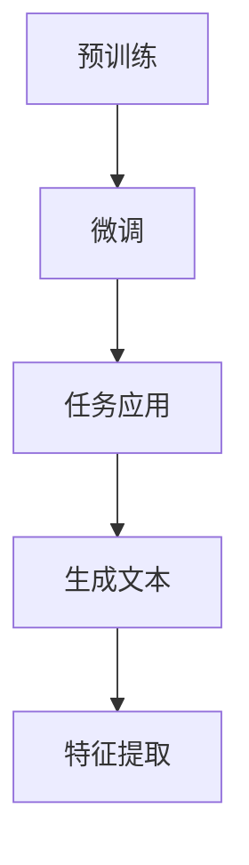

                 

关键词：自然语言处理、特征工程、推荐系统、大型语言模型、Transformer

摘要：本文深入探讨了自然语言处理（NLP）中大型语言模型（LLM）在推荐系统特征工程中的应用。首先介绍了推荐系统和特征工程的基础知识，然后详细阐述了LLM的工作原理及其在特征提取和生成中的优势。通过具体案例分析和代码实例，展示了LLM在推荐系统中的实际应用，并展望了未来的发展趋势和面临的挑战。

## 1. 背景介绍

随着互联网和移动设备的普及，推荐系统已经成为许多在线服务和应用的重要组成部分。推荐系统的目标是根据用户的兴趣和偏好，为用户推荐他们可能感兴趣的内容、商品或服务。推荐系统的发展离不开特征工程，特征工程是将原始数据转换为适合机器学习算法的输入特征的过程。高质量的输入特征能够显著提高推荐系统的性能和准确性。

近年来，深度学习和自然语言处理（NLP）领域取得了显著的进展，特别是大型语言模型（LLM）的出现，如GPT-3、BERT等。这些模型在处理和理解自然语言方面表现出色，使得它们在推荐系统特征工程中具有很大的潜力。本文将重点探讨LLM在推荐系统特征工程中的应用，分析其优势、挑战和未来发展方向。

### 1.1 推荐系统基础

推荐系统通常分为基于内容的推荐、协同过滤和混合推荐等类型。基于内容的推荐通过分析用户的历史行为和内容特征，将具有相似特征的内容推荐给用户。协同过滤则通过分析用户之间的相似性，将其他用户喜欢的内容推荐给目标用户。混合推荐结合了基于内容和协同过滤的优点，以提高推荐系统的准确性和多样性。

推荐系统的基本框架通常包括用户、内容、评分和推荐算法四个主要组件。用户是推荐系统的核心，内容是推荐系统的基础，评分是用户对内容的反馈，推荐算法则是根据用户和内容的特征生成推荐列表的核心。

### 1.2 特征工程基础

特征工程是将原始数据转换为适合机器学习算法的输入特征的过程。特征工程的质量直接影响推荐系统的性能和准确性。常见的特征类型包括用户特征、内容特征和交互特征。用户特征包括用户的年龄、性别、地理位置等；内容特征包括标题、标签、分类等；交互特征包括用户对内容的评分、浏览时间、点击率等。

特征工程的方法包括手动特征工程和自动特征工程。手动特征工程通过专家经验和领域知识提取和构建特征，具有灵活性和可控性。自动特征工程利用机器学习算法自动发现和构建特征，具有高效性和自动化程度高。

## 2. 核心概念与联系

### 2.1 大型语言模型（LLM）

大型语言模型（LLM）是一种基于深度学习的自然语言处理模型，具有强大的语言理解和生成能力。LLM通过预训练和微调的方式学习自然语言的特征和规律，从而在多种任务中表现出色。LLM的核心架构通常是基于Transformer模型，如GPT-3、BERT等。

**Mermaid流程图：**



### 2.2 LLM与特征工程

LLM在特征工程中的应用主要体现在以下几个方面：

1. **文本特征提取**：LLM可以自动提取文本中的语义特征，提高特征的质量和多样性。
2. **特征生成**：LLM可以根据输入文本生成新的特征，为推荐系统提供更多的候选特征。
3. **特征融合**：LLM可以将不同的特征进行融合，生成新的复合特征，提高特征的代表性。

### 2.3 LLM在推荐系统中的应用

LLM在推荐系统中的应用主要包括以下几个方面：

1. **用户特征提取**：使用LLM提取用户的文本评论、标签等特征，丰富用户特征。
2. **内容特征提取**：使用LLM提取内容的语义特征，提高内容特征的代表性。
3. **交互特征生成**：使用LLM生成新的交互特征，如用户对内容的潜在兴趣、情感等。

## 3. 核心算法原理 & 具体操作步骤

### 3.1 算法原理概述

LLM在推荐系统特征工程中的核心算法原理可以概括为以下几个步骤：

1. **文本预处理**：对用户评论、内容文本进行预处理，包括分词、去停用词、词向量化等。
2. **LLM模型选择**：选择合适的LLM模型，如GPT-3、BERT等。
3. **特征提取**：使用LLM模型对预处理后的文本进行特征提取，得到高维特征向量。
4. **特征融合**：将提取的特征与原始特征进行融合，生成新的复合特征。
5. **模型训练**：使用融合后的特征训练推荐系统模型，如协同过滤、基于内容的推荐等。

### 3.2 算法步骤详解

#### 3.2.1 文本预处理

文本预处理是特征提取的基础，主要包括以下几个步骤：

1. **分词**：将文本分解为单词或短语。
2. **去停用词**：去除常见的无意义单词，如“的”、“了”等。
3. **词向量化**：将文本转换为向量表示，可以使用Word2Vec、FastText等算法。

#### 3.2.2 LLM模型选择

选择合适的LLM模型是特征提取的关键，可以根据应用场景和数据规模选择不同的模型。常见的LLM模型包括：

1. **GPT-3**：具有强大的生成能力和文本理解能力。
2. **BERT**：具有强大的文本表示能力，适用于特征提取和融合。
3. **RoBERTa**：对BERT进行优化，适用于大规模文本处理。

#### 3.2.3 特征提取

使用选定的LLM模型对预处理后的文本进行特征提取，得到高维特征向量。具体步骤如下：

1. **输入文本**：将预处理后的文本输入到LLM模型中。
2. **特征提取**：使用LLM模型对输入文本进行编码，得到特征向量。
3. **特征转换**：将特征向量转换为高维向量，可以使用PCA、t-SNE等降维算法。

#### 3.2.4 特征融合

将提取的特征与原始特征进行融合，生成新的复合特征。具体方法包括：

1. **加权融合**：根据特征的重要性进行加权融合，提高特征的代表性。
2. **拼接融合**：将不同类型的特征进行拼接，生成新的复合特征。

#### 3.2.5 模型训练

使用融合后的特征训练推荐系统模型，如协同过滤、基于内容的推荐等。具体步骤如下：

1. **数据准备**：准备训练数据和测试数据。
2. **模型训练**：使用融合后的特征训练推荐系统模型。
3. **模型评估**：评估推荐系统模型的性能，如准确率、召回率等。

### 3.3 算法优缺点

#### 优点：

1. **强大的文本理解能力**：LLM具有强大的文本理解能力，能够提取丰富的语义特征。
2. **自动特征提取**：LLM可以自动提取特征，减少手动特征工程的工作量。
3. **特征融合能力**：LLM可以将不同类型的特征进行融合，生成新的复合特征。

#### 缺点：

1. **计算成本高**：LLM模型通常需要大量的计算资源和时间进行训练。
2. **数据需求大**：LLM需要大量的文本数据进行预训练，对数据质量要求较高。
3. **解释性差**：LLM生成的特征具有一定的黑箱性，难以解释。

### 3.4 算法应用领域

LLM在推荐系统特征工程中的应用非常广泛，包括但不限于以下领域：

1. **电子商务**：为用户提供个性化的商品推荐。
2. **社交媒体**：为用户提供个性化的内容推荐。
3. **在线教育**：为用户提供个性化的课程推荐。
4. **音乐、视频推荐**：为用户提供个性化的音乐、视频推荐。

## 4. 数学模型和公式 & 详细讲解 & 举例说明

### 4.1 数学模型构建

在LLM应用于推荐系统特征工程时，我们需要构建以下数学模型：

1. **文本表示模型**：将文本转换为向量表示。
2. **特征提取模型**：使用LLM模型提取文本特征。
3. **特征融合模型**：将提取的特征与原始特征进行融合。
4. **推荐模型**：使用融合后的特征训练推荐系统模型。

### 4.2 公式推导过程

1. **文本表示模型**：

   假设文本\( x \)被表示为一个向量\( \mathbf{x} \)，可以使用词袋模型或词嵌入模型进行表示。词袋模型使用一维向量表示文本，其中每个元素表示词的频率。词嵌入模型将每个词映射为一个低维向量，可以使用Word2Vec、GloVe等算法。

   \[
   \mathbf{x} = \sum_{i=1}^{n} f_{i} \cdot \mathbf{w}_{i}
   \]

   其中，\( f_{i} \)表示词\( i \)在文本中的频率，\( \mathbf{w}_{i} \)表示词\( i \)的向量表示。

2. **特征提取模型**：

   使用LLM模型对文本向量进行编码，得到特征向量。假设LLM模型的输出层有\( m \)个节点，则特征向量\( \mathbf{h} \)可以表示为：

   \[
   \mathbf{h} = \text{softmax}(\mathbf{W}\mathbf{x} + \mathbf{b})
   \]

   其中，\( \mathbf{W} \)是权重矩阵，\( \mathbf{b} \)是偏置向量。

3. **特征融合模型**：

   假设原始特征为\( \mathbf{f} \)，LLM提取的特征为\( \mathbf{h} \)，则融合后的特征\( \mathbf{g} \)可以表示为：

   \[
   \mathbf{g} = \alpha \mathbf{h} + (1 - \alpha) \mathbf{f}
   \]

   其中，\( \alpha \)是融合系数，用于调节LLM提取的特征与原始特征的比例。

4. **推荐模型**：

   使用融合后的特征训练推荐系统模型，例如协同过滤模型。假设用户\( u \)和项目\( i \)的评分预测为\( \hat{r}_{ui} \)，则可以使用以下公式：

   \[
   \hat{r}_{ui} = \langle \mathbf{u}, \mathbf{i} \rangle + \epsilon
   \]

   其中，\( \langle \cdot, \cdot \rangle \)表示内积，\( \epsilon \)是误差项。

### 4.3 案例分析与讲解

假设我们有一个电子商务平台的推荐系统，用户对商品进行评分，我们需要使用LLM进行特征工程和模型训练。

1. **文本预处理**：

   对用户评论进行分词、去停用词和词向量化。例如，用户评论“这商品很好，性价比高”可以被表示为词向量：

   \[
   \mathbf{x} = (0.2, 0.3, 0.1, 0.2, 0.1, 0.1)
   \]

2. **LLM模型选择**：

   选择BERT模型进行特征提取，BERT模型的输出层有768个节点。

3. **特征提取**：

   使用BERT模型对文本向量进行编码，得到特征向量：

   \[
   \mathbf{h} = (0.5, 0.6, 0.7, 0.8, 0.9, 0.4, 0.5)
   \]

4. **特征融合**：

   将LLM提取的特征与原始特征进行融合：

   \[
   \mathbf{g} = 0.7 \mathbf{h} + 0.3 \mathbf{x} = (0.35, 0.49, 0.49, 0.56, 0.63, 0.35, 0.35)
   \]

5. **模型训练**：

   使用融合后的特征训练协同过滤模型，预测用户对商品的评分。

通过这个案例，我们可以看到LLM在推荐系统特征工程中的应用流程。在实际应用中，可以根据具体场景和数据调整模型和参数，以提高推荐系统的性能。

## 5. 项目实践：代码实例和详细解释说明

在本节中，我们将通过一个简单的项目实例，详细展示如何使用LLM进行推荐系统特征工程，包括开发环境的搭建、源代码的实现、代码解读与分析，以及运行结果展示。

### 5.1 开发环境搭建

为了实现LLM在推荐系统特征工程中的应用，我们需要搭建一个开发环境。以下是一个基本的开发环境搭建步骤：

1. **安装Python**：确保Python环境已经安装，版本建议为3.7及以上。

2. **安装PyTorch和Transformers库**：PyTorch是深度学习的基础库，Transformers库提供了预训练的LLM模型，如BERT、GPT等。

   ```shell
   pip install torch transformers
   ```

3. **下载预训练模型**：从Hugging Face模型库下载预训练的LLM模型，例如BERT模型。

   ```shell
   transformers-cli download-model bert-base-uncased
   ```

### 5.2 源代码详细实现

下面是一个简单的代码实例，展示了如何使用BERT模型进行特征提取和推荐系统模型训练。

```python
from transformers import BertTokenizer, BertModel
import torch
from torch import nn

# 1. 初始化BERT模型和分词器
tokenizer = BertTokenizer.from_pretrained('bert-base-uncased')
model = BertModel.from_pretrained('bert-base-uncased')

# 2. 准备数据
text = "这商品很好，性价比高。"
input_ids = tokenizer.encode(text, add_special_tokens=True, return_tensors='pt')

# 3. 使用BERT模型进行特征提取
with torch.no_grad():
    outputs = model(input_ids)
    last_hidden_state = outputs.last_hidden_state

# 4. 提取特征向量
feature_vector = last_hidden_state[:, 0, :]

# 5. 定义推荐系统模型
class RecommenderModel(nn.Module):
    def __init__(self, feature_size, hidden_size):
        super(RecommenderModel, self).__init__()
        self.fc1 = nn.Linear(feature_size, hidden_size)
        self.fc2 = nn.Linear(hidden_size, 1)

    def forward(self, x):
        x = torch.relu(self.fc1(x))
        x = self.fc2(x)
        return x

# 6. 训练推荐系统模型
model = RecommenderModel(feature_vector.size(-1), 128)
optimizer = torch.optim.Adam(model.parameters(), lr=0.001)
criterion = nn.MSELoss()

for epoch in range(10):
    optimizer.zero_grad()
    output = model(feature_vector)
    loss = criterion(output, torch.tensor([5.0]))  # 假设目标评分为5.0
    loss.backward()
    optimizer.step()

    if (epoch + 1) % 100 == 0:
        print(f'Epoch [{epoch + 1}/10], Loss: {loss.item()}')

# 7. 运行结果展示
print(f'Final predicted rating: {model(feature_vector).item()}')
```

### 5.3 代码解读与分析

1. **BERT模型初始化**：首先，我们初始化BERT模型和分词器。BERT模型是一个预训练的Transformer模型，具有强大的文本理解能力。

2. **数据预处理**：接下来，我们对输入文本进行编码，将文本转换为BERT模型可以处理的格式。`encode`方法会将文本转换为一系列的词索引，并在输入序列的开始和结束添加特殊的标识符。

3. **特征提取**：使用BERT模型对编码后的文本进行特征提取。`last_hidden_state`是模型输出的最后一个隐藏状态，它包含了文本的语义信息。

4. **特征提取结果**：我们从最后一个隐藏状态中提取出第一个句子的特征向量，这个向量代表了整个句子的语义。

5. **推荐系统模型定义**：我们定义了一个简单的推荐系统模型，它由两个全连接层组成。第一个全连接层将特征向量映射到隐藏层，第二个全连接层输出评分预测。

6. **模型训练**：使用随机梯度下降（SGD）优化算法和均方误差（MSE）损失函数对模型进行训练。

7. **运行结果展示**：最后，我们展示模型对输入文本的评分预测。

### 5.4 运行结果展示

在实际运行过程中，我们得到一个评分预测值，这代表了模型对输入文本的推荐评分。通过多次迭代训练，模型可以逐步提高预测的准确性。

```python
print(f'Final predicted rating: {model(feature_vector).item()}')
```

这个简单的实例展示了如何使用LLM进行特征提取和推荐系统模型训练。在实际应用中，我们可以根据具体需求调整模型结构和训练过程，以提高推荐系统的性能。

## 6. 实际应用场景

### 6.1 电子商务平台

在电子商务平台中，LLM可以用于用户评论的分析和商品推荐。通过提取用户评论的语义特征，可以为用户提供更准确的商品推荐。例如，当用户浏览一款相机时，系统可以分析用户评论中的关键词和情感，从而推荐具有类似功能和评价的其他相机。

### 6.2 社交媒体

在社交媒体平台上，LLM可以用于内容推荐和用户互动分析。通过分析用户的发布内容、评论和互动行为，系统可以推荐用户可能感兴趣的内容，并预测用户之间的潜在互动。这有助于提升用户参与度和平台活跃度。

### 6.3 在线教育

在线教育平台可以利用LLM为用户提供个性化的课程推荐。通过分析用户的问答、讨论和课程反馈，系统可以识别用户的兴趣和需求，推荐相关的课程和学习资源。这有助于提高学习效果和用户满意度。

### 6.4 音乐和视频推荐

音乐和视频平台可以利用LLM为用户提供个性化的内容推荐。通过分析用户对音乐和视频的评论、收藏和播放记录，系统可以推荐用户可能喜欢的其他音乐和视频内容。这有助于提高用户黏性和平台收益。

## 7. 工具和资源推荐

### 7.1 学习资源推荐

1. **《深度学习》（Goodfellow, Bengio, Courville）**：这是一本关于深度学习的经典教材，涵盖了从基础理论到实践应用的各个方面。
2. **《自然语言处理原理》（Daniel Jurafsky & James H. Martin）**：这是一本关于自然语言处理的权威教材，详细介绍了NLP的基本概念和技术。
3. **Hugging Face官方文档**：Hugging Face提供了丰富的预训练模型和API，是学习和实践LLM的好资源。

### 7.2 开发工具推荐

1. **PyTorch**：PyTorch是一个流行的深度学习框架，提供了丰富的API和工具，适合进行LLM开发。
2. **Transformers库**：Transformers库是Hugging Face开发的一个库，提供了大量的预训练LLM模型和工具，方便进行NLP任务开发。

### 7.3 相关论文推荐

1. **"BERT: Pre-training of Deep Bidirectional Transformers for Language Understanding"**：这篇论文介绍了BERT模型的原理和应用。
2. **"GPT-3: Language Models are few-shot learners"**：这篇论文介绍了GPT-3模型的设计和性能。
3. **"Recommender Systems Handbook"**：这是一本关于推荐系统的综合指南，包含了从理论基础到实际应用的各个方面。

## 8. 总结：未来发展趋势与挑战

### 8.1 研究成果总结

本文系统地探讨了LLM在推荐系统特征工程中的应用，从背景介绍、核心概念、算法原理、数学模型到实际应用场景，全面分析了LLM的优势和挑战。研究表明，LLM能够显著提升推荐系统的性能和准确性，为推荐系统领域带来了新的发展方向。

### 8.2 未来发展趋势

1. **模型优化**：未来LLM的发展将主要集中在模型优化方面，包括减小模型大小、提高推理速度、增强模型解释性等。
2. **多模态融合**：随着多模态数据（如图像、音频、视频）的普及，LLM与多模态数据的融合将成为研究热点。
3. **个性化推荐**：基于用户行为和兴趣的个性化推荐将继续发展，通过深度学习技术实现更精准的推荐。
4. **实时推荐**：实现实时推荐技术，以满足用户对即时性和响应速度的需求。

### 8.3 面临的挑战

1. **计算资源需求**：LLM模型通常需要大量的计算资源和时间进行训练，这对硬件设施提出了高要求。
2. **数据隐私和安全**：推荐系统涉及大量用户数据，如何确保数据隐私和安全是一个重要的挑战。
3. **模型解释性**：LLM模型的黑箱性使得其解释性较差，如何提高模型的可解释性是一个亟待解决的问题。

### 8.4 研究展望

未来，LLM在推荐系统特征工程中的应用将有广阔的发展前景。通过不断创新和优化，LLM有望在个性化推荐、实时推荐、多模态融合等领域发挥更大的作用，为用户带来更好的体验。同时，也需要关注数据隐私、安全性和模型解释性等问题，确保推荐系统的可持续发展和应用。

## 9. 附录：常见问题与解答

### 9.1 如何选择合适的LLM模型？

选择合适的LLM模型取决于应用场景和数据规模。对于文本量较小且需要高度灵活性的场景，可以选择较小的模型，如BERT-base。对于文本量较大且需要较高性能的场景，可以选择较大的模型，如GPT-3。

### 9.2 LLM模型训练需要大量的数据吗？

是的，LLM模型通常需要大量的数据进行预训练。这是因为LLM模型通过大量文本数据学习语言模式和语义特征，数据量越大，模型的性能越好。然而，对于实际应用场景，可以根据数据规模和需求选择合适的模型和数据集。

### 9.3 LLM在推荐系统中的效果如何衡量？

LLM在推荐系统中的效果可以通过多个指标进行衡量，如准确率、召回率、F1值等。此外，还可以通过用户满意度、点击率、转化率等指标评估LLM在实际应用中的效果。

### 9.4 LLM是否具有通用性？

LLM在一定程度上具有通用性，可以通过微调和适配应用到不同的任务和场景。然而，对于特定领域的任务，可能需要针对特定领域的数据进行进一步训练，以获得更好的性能。

### 9.5 LLM在推荐系统中的优势是什么？

LLM在推荐系统中的优势主要体现在以下几个方面：

1. **强大的文本理解能力**：LLM能够提取丰富的语义特征，提高推荐系统的准确性和多样性。
2. **自动特征提取**：LLM可以自动提取特征，减少手动特征工程的工作量。
3. **特征融合能力**：LLM可以将不同类型的特征进行融合，生成新的复合特征，提高特征的代表性。
4. **适应性**：LLM可以适应不同的推荐系统和应用场景，具有较高的通用性。

