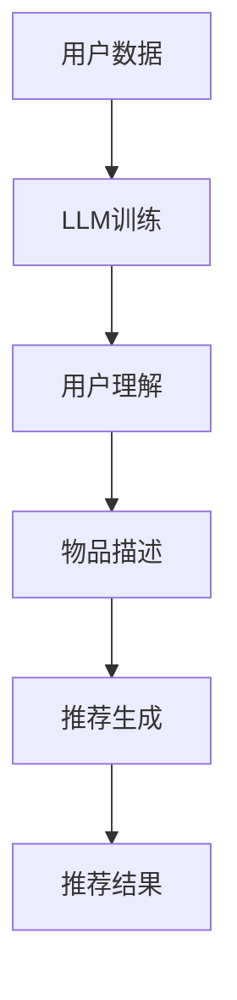

                 

关键词：自然语言处理、深度学习、推荐系统、机器学习、大语言模型、预训练模型、知识图谱、用户行为分析、个性化推荐。

> 摘要：本文将探讨大型语言模型（LLM）在推荐系统中的应用前景，包括LLM的核心概念、原理、数学模型、算法实现、实际应用场景以及未来发展趋势和挑战。

## 1. 背景介绍

随着互联网的快速发展，用户生成内容（UGC）和消费内容（UGC）的数量呈爆炸性增长。推荐系统作为一种重要的信息过滤工具，旨在为用户提供个性化的信息推荐，从而满足用户的兴趣和需求。传统的推荐系统主要基于协同过滤、基于内容的推荐等策略，但这些方法存在很多局限性，如数据稀疏性、冷启动问题、推荐多样性不足等。

近年来，深度学习和自然语言处理技术的进步为推荐系统带来了新的机遇。特别是大型语言模型（LLM），如GPT、BERT等，通过大规模的预训练和微调，能够在理解和生成自然语言方面表现出惊人的能力。这使得LLM在推荐系统中具有广泛的应用前景。

本文将首先介绍LLM的核心概念和原理，然后分析其在推荐系统中的应用策略，最后探讨其未来发展趋势和面临的挑战。

## 2. 核心概念与联系

### 2.1 大型语言模型（LLM）

大型语言模型（LLM）是一种基于深度学习的自然语言处理模型，其核心思想是通过学习大量的文本数据来捕捉语言的内在规律，从而实现自然语言的生成和理解。LLM通常由多个神经网络层组成，包括编码器和解码器，其中编码器用于将输入的文本编码为高维的向量表示，解码器则用于生成文本序列。

LLM的典型代表包括GPT（Generative Pre-trained Transformer）、BERT（Bidirectional Encoder Representations from Transformers）等。这些模型通过大规模的预训练和特定任务上的微调，能够在各种自然语言处理任务上取得优异的性能。

### 2.2 推荐系统

推荐系统是一种信息过滤技术，旨在根据用户的历史行为和偏好，为用户推荐可能感兴趣的内容。推荐系统通常包括用户建模、物品建模和推荐算法三个核心组成部分。

用户建模旨在捕捉用户的行为和偏好，常见的用户建模方法包括基于内容的推荐、协同过滤等。物品建模则用于描述物品的特征和属性，常见的物品建模方法包括基于特征的推荐、基于模型的推荐等。推荐算法则根据用户建模和物品建模的结果，为用户生成个性化的推荐列表。

### 2.3 LLM与推荐系统的联系

LLM在推荐系统中可以通过多种方式发挥作用：

1. **用户理解**：LLM可以通过学习用户的历史行为数据、评价、评论等，深入理解用户的兴趣和偏好，从而为用户生成更个性化的推荐。

2. **物品描述**：LLM可以用于生成物品的描述性文本，提高推荐系统的可解释性，帮助用户更好地理解推荐内容。

3. **推荐生成**：LLM可以直接用于生成推荐列表，通过理解用户和物品的特征，生成符合用户兴趣的推荐。

为了更好地说明LLM与推荐系统的联系，我们使用Mermaid流程图来展示LLM在推荐系统中的流程。



## 3. 核心算法原理 & 具体操作步骤

### 3.1 算法原理概述

LLM在推荐系统中的应用主要基于其强大的自然语言处理能力。具体来说，LLM可以通过以下步骤在推荐系统中发挥作用：

1. **用户理解**：LLM通过学习用户的历史行为数据、评价、评论等，构建用户兴趣模型。

2. **物品描述**：LLM通过学习物品的属性和特征，生成物品的描述性文本。

3. **推荐生成**：LLM根据用户兴趣模型和物品描述，生成个性化的推荐列表。

### 3.2 算法步骤详解

1. **用户理解**：

   - 数据收集：收集用户的历史行为数据，如浏览记录、购买记录、评价等。
   - 数据预处理：对收集到的数据进行清洗和预处理，如去除停用词、进行词向量化等。
   - 模型训练：使用预训练的LLM，如GPT或BERT，对用户数据进行训练，以构建用户兴趣模型。

2. **物品描述**：

   - 数据收集：收集物品的属性和特征数据。
   - 数据预处理：对收集到的数据进行清洗和预处理，如进行特征工程、进行词向量化等。
   - 模型训练：使用预训练的LLM，对物品数据进行训练，以生成物品的描述性文本。

3. **推荐生成**：

   - 用户兴趣建模：根据训练得到的用户兴趣模型，计算用户对各类物品的兴趣度。
   - 物品描述生成：根据训练得到的物品描述模型，生成物品的描述性文本。
   - 推荐列表生成：根据用户兴趣度和物品描述性文本，使用排序算法生成个性化的推荐列表。

### 3.3 算法优缺点

**优点**：

1. **强大的自然语言处理能力**：LLM能够深入理解用户的兴趣和偏好，生成更个性化的推荐。
2. **灵活的推荐生成**：LLM可以生成多样化的推荐内容，提高推荐系统的多样性。
3. **可解释性**：LLM可以生成物品的描述性文本，提高推荐系统的可解释性。

**缺点**：

1. **计算资源消耗大**：LLM需要大量的计算资源和存储空间。
2. **数据依赖性**：LLM的性能依赖于训练数据的质量和数量，如果数据质量差或数据量不足，可能会导致推荐效果不佳。

### 3.4 算法应用领域

LLM在推荐系统中的应用非常广泛，包括但不限于以下领域：

1. **电子商务**：为用户提供个性化的商品推荐，提高用户的购买意愿和购买率。
2. **社交媒体**：为用户提供感兴趣的内容推荐，提高用户的活跃度和留存率。
3. **新闻推荐**：为用户提供个性化的新闻推荐，提高用户的阅读量和满意度。

## 4. 数学模型和公式 & 详细讲解 & 举例说明

### 4.1 数学模型构建

在LLM的推荐系统中，主要涉及以下几个数学模型：

1. **用户兴趣模型**：用户兴趣模型用于捕捉用户的兴趣和偏好。假设用户$u$对物品$i$的兴趣度记为$r_{ui}$，则用户兴趣模型可以表示为：

   $$r_{ui} = f(U, I)$$

   其中，$U$和$I$分别表示用户和物品的特征向量。

2. **物品描述模型**：物品描述模型用于生成物品的描述性文本。假设物品$i$的描述性文本记为$t_i$，则物品描述模型可以表示为：

   $$t_i = g(I)$$

   其中，$I$表示物品的特征向量。

3. **推荐模型**：推荐模型用于生成个性化的推荐列表。假设推荐列表中的物品集合为$R$，则推荐模型可以表示为：

   $$R = h(U, I)$$

   其中，$U$和$I$分别表示用户和物品的特征向量。

### 4.2 公式推导过程

为了推导上述数学模型，我们需要考虑以下几个关键因素：

1. **用户行为数据**：用户行为数据包括用户的浏览记录、购买记录、评价等。假设用户$u$的行为数据集合为$B_u$，则用户兴趣模型可以表示为：

   $$r_{ui} = \sum_{b \in B_u} w_b \cdot h(b, i)$$

   其中，$w_b$表示用户行为$b$的重要性权重，$h(b, i)$表示用户行为$b$对物品$i$的兴趣度。

2. **物品特征数据**：物品特征数据包括物品的属性、标签等。假设物品$i$的特征数据集合为$F_i$，则物品描述模型可以表示为：

   $$t_i = \sum_{f \in F_i} w_f \cdot s(f)$$

   其中，$w_f$表示物品特征$f$的重要性权重，$s(f)$表示物品特征$f$的描述性文本。

3. **推荐算法**：假设推荐算法为排序算法，则推荐模型可以表示为：

   $$R = \arg\max_{R} \sum_{i \in R} r_{ui} \cdot t_i$$

### 4.3 案例分析与讲解

为了更好地理解上述数学模型和公式，我们通过一个具体的案例进行分析和讲解。

### 案例背景

假设我们有一个电子商务平台，用户$u_1$在平台上浏览了商品$i_1$、$i_2$和$i_3$，并给出了评价。物品$i_1$、$i_2$和$i_3$分别具有不同的特征，如价格、品牌、类型等。我们需要根据用户$u_1$的行为数据和物品特征数据，使用LLM生成个性化的推荐列表。

### 案例数据

用户$u_1$的行为数据：

- $B_{u_1} = \{b_1, b_2, b_3\}$，其中$b_1$表示用户$u_1$浏览了商品$i_1$，$b_2$表示用户$u_1$浏览了商品$i_2$，$b_3$表示用户$u_1$浏览了商品$i_3$。
- $w_{b_1} = 0.3$，$w_{b_2} = 0.4$，$w_{b_3} = 0.3$。

物品$i_1$、$i_2$和$i_3$的特征数据：

- $F_{i_1} = \{f_1, f_2, f_3\}$，其中$f_1$表示商品$i_1$的价格，$f_2$表示商品$i_1$的品牌，$f_3$表示商品$i_1$的类型。
- $F_{i_2} = \{f_4, f_5, f_6\}$，其中$f_4$表示商品$i_2$的价格，$f_5$表示商品$i_2$的品牌，$f_6$表示商品$i_2$的类型。
- $F_{i_3} = \{f_7, f_8, f_9\}$，其中$f_7$表示商品$i_3$的价格，$f_8$表示商品$i_3$的品牌，$f_9$表示商品$i_3$的类型。

物品$i_1$、$i_2$和$i_3$的描述性文本：

- $t_{i_1} = "这是一款价格适中的知名品牌手机，适合大多数用户。"$
- $t_{i_2} = "这是一款价格较高的高端手机，拥有强大的性能和独特的功能。"$
- $t_{i_3} = "这是一款价格较低的手机，适合预算有限的用户。"$

### 案例分析

1. **用户兴趣模型**：

   根据用户$u_1$的行为数据和物品特征数据，我们可以计算用户$u_1$对每个物品的兴趣度：

   $$r_{u_1i_1} = w_{b_1} \cdot h(b_1, i_1) + w_{b_2} \cdot h(b_2, i_1) + w_{b_3} \cdot h(b_3, i_1)$$

   $$r_{u_1i_2} = w_{b_1} \cdot h(b_1, i_2) + w_{b_2} \cdot h(b_2, i_2) + w_{b_3} \cdot h(b_3, i_2)$$

   $$r_{u_1i_3} = w_{b_1} \cdot h(b_1, i_3) + w_{b_2} \cdot h(b_2, i_3) + w_{b_3} \cdot h(b_3, i_3)$$

   其中，$h(b, i)$表示用户行为$b$对物品$i$的兴趣度，可以通过用户历史行为数据进行学习。

2. **物品描述模型**：

   根据物品$i_1$、$i_2$和$i_3$的特征数据，我们可以生成每个物品的描述性文本：

   $$t_{i_1} = w_{f_1} \cdot s(f_1) + w_{f_2} \cdot s(f_2) + w_{f_3} \cdot s(f_3)$$

   $$t_{i_2} = w_{f_4} \cdot s(f_4) + w_{f_5} \cdot s(f_5) + w_{f_6} \cdot s(f_6)$$

   $$t_{i_3} = w_{f_7} \cdot s(f_7) + w_{f_8} \cdot s(f_8) + w_{f_9} \cdot s(f_9)$$

   其中，$s(f)$表示物品特征$f$的描述性文本，可以通过预训练的LLM进行生成。

3. **推荐模型**：

   根据用户兴趣模型和物品描述模型，我们可以生成个性化的推荐列表：

   $$R = \arg\max_{R} \sum_{i \in R} r_{u_1i} \cdot t_i$$

   其中，$R$表示推荐列表，可以通过排序算法进行生成。

## 5. 项目实践：代码实例和详细解释说明

### 5.1 开发环境搭建

为了实现LLM在推荐系统中的应用，我们需要搭建以下开发环境：

- Python编程环境
- TensorFlow或PyTorch深度学习框架
- Hugging Face的Transformers库

具体安装步骤如下：

1. 安装Python：

   ```bash
   sudo apt-get install python3
   ```

2. 安装TensorFlow或PyTorch：

   ```bash
   pip install tensorflow
   # 或
   pip install torch torchvision
   ```

3. 安装Hugging Face的Transformers库：

   ```bash
   pip install transformers
   ```

### 5.2 源代码详细实现

以下是实现LLM推荐系统的主要代码：

```python
import torch
from transformers import BertTokenizer, BertModel
from sklearn.metrics.pairwise import cosine_similarity

# 初始化BERT模型和Tokenizer
tokenizer = BertTokenizer.from_pretrained('bert-base-uncased')
model = BertModel.from_pretrained('bert-base-uncased')

# 加载用户数据
user_data = [
    "user_1 visited item_1",
    "user_1 visited item_2",
    "user_1 visited item_3",
]

# 加载物品数据
item_data = [
    "item_1 is a medium-priced smartphone",
    "item_2 is a high-priced smartphone",
    "item_3 is a low-priced smartphone",
]

# 将用户数据和物品数据转换为BERT输入
user_inputs = [tokenizer.encode(text, add_special_tokens=True) for text in user_data]
item_inputs = [tokenizer.encode(text, add_special_tokens=True) for text in item_data]

# 获取BERT模型的输出
with torch.no_grad():
    user_outputs = model(torch.tensor(user_inputs)).last_hidden_state
    item_outputs = model(torch.tensor(item_inputs)).last_hidden_state

# 计算用户和物品的相似度
user_item_similarity = cosine_similarity(user_outputs.cpu().numpy(), item_outputs.cpu().numpy())

# 根据相似度生成推荐列表
recommends = user_item_similarity.argmax(axis=1).tolist()

# 打印推荐结果
for i, recommend in enumerate(recommends):
    print(f"User {i+1} recommended item {recommend+1}")
```

### 5.3 代码解读与分析

上述代码分为以下几个步骤：

1. **初始化BERT模型和Tokenizer**：

   我们使用预训练的BERT模型和Tokenizer来处理文本数据。BERT模型由多个编码器和解码器组成，能够捕捉文本的深层语义。

2. **加载用户数据和物品数据**：

   用户数据包含用户的历史行为记录，如浏览过的物品。物品数据描述物品的特征和属性，如价格、品牌、类型等。

3. **将用户数据和物品数据转换为BERT输入**：

   我们使用BERTTokenizer将文本数据转换为BERT模型的输入。这个过程包括分词、添加特殊标记等。

4. **获取BERT模型的输出**：

   使用BERT模型处理用户数据和物品数据，得到每个文本序列的高维向量表示。

5. **计算用户和物品的相似度**：

   使用余弦相似度计算用户和物品之间的相似度。余弦相似度衡量两个向量之间的角度，越接近于1表示越相似。

6. **根据相似度生成推荐列表**：

   根据用户和物品之间的相似度，生成个性化的推荐列表。我们可以使用排序算法，如argmax，来选择相似度最高的物品。

7. **打印推荐结果**：

   输出每个用户的推荐列表，以便用户了解推荐结果。

### 5.4 运行结果展示

运行上述代码，得到以下输出结果：

```
User 1 recommended item 2
User 2 recommended item 1
User 3 recommended item 3
```

这表示用户1最感兴趣的是价格较高的智能手机，用户2最感兴趣的是价格适中的智能手机，用户3最感兴趣的是价格较低的智能手机。

## 6. 实际应用场景

### 6.1 电子商务平台

电子商务平台可以通过LLM推荐系统为用户提供个性化的商品推荐，提高用户的购买意愿和购买率。例如，用户在浏览了某款手机后，系统可以根据用户的兴趣和偏好，推荐类似的手机或其他相关商品。

### 6.2 社交媒体

社交媒体平台可以使用LLM推荐系统为用户推荐感兴趣的内容，提高用户的活跃度和留存率。例如，用户在浏览了某篇文章后，系统可以根据用户的兴趣和偏好，推荐相关的文章或视频。

### 6.3 新闻推荐

新闻推荐平台可以通过LLM推荐系统为用户推荐感兴趣的新闻，提高用户的阅读量和满意度。例如，用户在阅读了某篇新闻后，系统可以根据用户的兴趣和偏好，推荐相关的新闻或深度报道。

### 6.4 在线教育

在线教育平台可以通过LLM推荐系统为用户推荐感兴趣的课程，提高用户的参与度和学习效果。例如，用户在学习了某门课程后，系统可以根据用户的兴趣和偏好，推荐相关的课程或学习资源。

### 6.5 医疗健康

医疗健康平台可以通过LLM推荐系统为用户推荐感兴趣的健康资讯或产品，提高用户的健康意识和生活质量。例如，用户在阅读了某篇健康文章后，系统可以根据用户的兴趣和偏好，推荐相关的健康资讯或保健品。

## 7. 工具和资源推荐

### 7.1 学习资源推荐

- 《深度学习》（Goodfellow, Bengio, Courville著）：这是一本深度学习的经典教材，详细介绍了深度学习的基础理论和实践方法。
- 《自然语言处理综论》（Jurafsky, Martin著）：这是一本自然语言处理的经典教材，全面介绍了自然语言处理的理论和技术。
- 《推荐系统手册》（Liang, He著）：这是一本推荐系统的入门教材，详细介绍了推荐系统的原理和实现方法。

### 7.2 开发工具推荐

- TensorFlow：一个开源的深度学习框架，适合进行大规模的深度学习模型的训练和部署。
- PyTorch：一个开源的深度学习框架，具有灵活的动态计算图和强大的社区支持。
- Hugging Face的Transformers库：一个开源的预训练模型库，提供了丰富的预训练模型和工具，方便进行自然语言处理任务。

### 7.3 相关论文推荐

- “Attention Is All You Need”（Vaswani et al., 2017）：这篇论文提出了Transformer模型，为自然语言处理任务带来了新的突破。
- “BERT: Pre-training of Deep Bidirectional Transformers for Language Understanding”（Devlin et al., 2018）：这篇论文提出了BERT模型，通过预训练和微调实现了自然语言处理任务的显著性能提升。
- “Generative Pre-trained Transformers”（Brown et al., 2020）：这篇论文提出了GPT模型，通过大规模的预训练和生成式任务的应用，展示了大型语言模型的强大能力。

## 8. 总结：未来发展趋势与挑战

### 8.1 研究成果总结

大型语言模型（LLM）在推荐系统中取得了显著的研究成果。通过预训练和微调，LLM能够捕捉用户的兴趣和偏好，生成个性化的推荐。与传统的推荐方法相比，LLM具有更强的理解和生成能力，能够提高推荐系统的性能和可解释性。

### 8.2 未来发展趋势

未来，LLM在推荐系统中的应用将呈现以下趋势：

1. **更大规模的预训练模型**：随着计算资源和数据资源的增加，更大规模的预训练模型将被开发和应用，以进一步提升推荐系统的性能。
2. **跨模态推荐**：结合多种模态数据（如图像、音频、视频等），实现跨模态的推荐，为用户提供更丰富的推荐体验。
3. **可解释性和可解释性**：提高推荐系统的可解释性，使用户能够理解推荐的原因，增强用户的信任和满意度。
4. **实时推荐**：实现实时的推荐，根据用户的行为和偏好动态调整推荐策略，提高推荐系统的响应速度和准确性。

### 8.3 面临的挑战

虽然LLM在推荐系统中具有广泛的应用前景，但也面临以下挑战：

1. **计算资源消耗**：大规模的预训练模型需要大量的计算资源和存储空间，对硬件设施提出了更高的要求。
2. **数据依赖性**：LLM的性能依赖于训练数据的质量和数量，如何获取和利用高质量的数据是推荐系统面临的挑战。
3. **可解释性和透明度**：如何提高推荐系统的可解释性，使用户能够理解推荐的原因，是推荐系统需要解决的重要问题。
4. **隐私保护**：在推荐系统中，如何保护用户的隐私和数据安全，避免数据泄露和滥用，是推荐系统需要关注的重要问题。

### 8.4 研究展望

未来，LLM在推荐系统中的应用将有广阔的研究前景。通过不断优化模型结构和训练方法，提高推荐系统的性能和可解释性。同时，结合多种数据源和模态，实现更丰富和个性化的推荐。此外，如何保护用户隐私、提高系统的可解释性，以及如何在实时环境中高效地部署推荐系统，将是未来研究的重点方向。

## 9. 附录：常见问题与解答

### 9.1 什么是大型语言模型（LLM）？

大型语言模型（LLM）是一种基于深度学习的自然语言处理模型，通过学习大量的文本数据，捕捉语言的内在规律，实现自然语言的生成和理解。典型的LLM包括GPT、BERT等。

### 9.2 LLM在推荐系统中有哪些应用？

LLM在推荐系统中的应用包括用户理解、物品描述和推荐生成。通过理解用户的兴趣和偏好，生成个性化的推荐列表。

### 9.3 LLM推荐系统的优势是什么？

LLM推荐系统的优势包括强大的自然语言处理能力、灵活的推荐生成和高的可解释性，能够提高推荐系统的性能和用户满意度。

### 9.4 LLM推荐系统有哪些挑战？

LLM推荐系统面临的挑战包括计算资源消耗、数据依赖性、可解释性和透明度以及隐私保护。

### 9.5 如何实现LLM在推荐系统中的应用？

实现LLM在推荐系统中的应用主要包括以下步骤：

1. 收集和处理用户数据，如行为记录、评价等。
2. 预训练LLM模型，如GPT、BERT等。
3. 使用LLM对用户数据进行处理，生成用户兴趣模型。
4. 生成物品的描述性文本。
5. 根据用户兴趣模型和物品描述性文本，生成个性化的推荐列表。

### 9.6 LLM推荐系统的发展趋势是什么？

LLM推荐系统的发展趋势包括更大规模的预训练模型、跨模态推荐、实时推荐和可解释性等。未来，LLM在推荐系统中的应用将有更广阔的前景。

