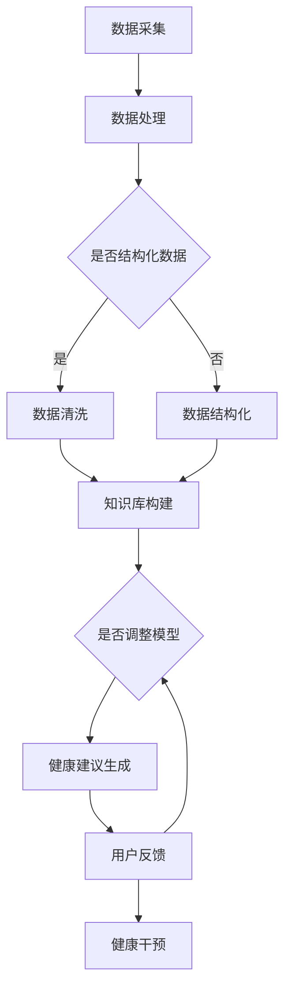

                 

关键词：语言模型（LLM），个性化健康建议，智能医疗，大数据分析，机器学习，自然语言处理，健康预测

## 摘要

随着医疗技术的进步和大数据技术的发展，个性化健康建议成为了现代医疗的重要趋势。本文旨在探讨大型语言模型（LLM）在智能个性化健康建议中的应用前景。通过分析LLM的工作原理和现有技术，本文揭示了LLM在健康预测、患者教育、疾病监测等领域的潜力。同时，本文还讨论了未来发展趋势以及面临的挑战，为相关研究和实践提供了有益的参考。

## 1. 背景介绍

### 1.1 医疗行业的数字化变革

近年来，医疗行业正经历着一场数字化变革。大数据、人工智能、云计算等新兴技术的应用，使得医疗数据得以高效处理和利用，医疗服务的质量和效率得到了显著提升。个性化健康建议作为一种创新的医疗服务模式，旨在根据患者的具体健康状况和需求，提供精准的健康建议。

### 1.2 语言模型的发展

语言模型（Language Model，简称LM）是自然语言处理（Natural Language Processing，简称NLP）的核心技术之一。近年来，随着深度学习技术的发展，大型语言模型（Large Language Model，简称LLM）如BERT、GPT等逐渐崭露头角。这些LLM在文本生成、翻译、摘要、问答等任务上表现出色，为智能个性化健康建议提供了强有力的技术支持。

### 1.3 智能医疗的挑战与机遇

智能医疗的发展面临着诸多挑战，如医疗数据的质量和隐私、算法的可靠性和可解释性、跨学科的协同创新等。然而，随着技术的不断进步和政策的支持，智能医疗也迎来了前所未有的机遇。LLM在智能个性化健康建议中的应用，有望解决一些长期存在的问题，推动医疗行业的进一步发展。

## 2. 核心概念与联系

### 2.1 语言模型原理

语言模型通过学习大量的文本数据，预测下一个词或句子的可能性。LLM如BERT和GPT等，采用深度神经网络（Deep Neural Network，DNN）和变换器架构（Transformer Architecture），具有强大的表示能力和生成能力。

### 2.2 个性化健康建议原理

个性化健康建议基于患者的健康数据（如病史、体检报告、生活习惯等），结合专业知识库和机器学习算法，为患者提供个性化的健康建议。LLM在这一过程中发挥着关键作用，如文本生成、问答系统、健康预测等。

### 2.3 LLM与个性化健康建议的融合

LLM可以与个性化健康建议系统进行深度融合，形成智能健康顾问。通过自然语言交互，LLM能够理解患者的需求和反馈，实时调整健康建议，提高用户体验和健康效果。

## 2.4 Mermaid流程图



### 3. 核心算法原理 & 具体操作步骤

### 3.1 算法原理概述

LLM在智能个性化健康建议中的应用，主要包括以下几个环节：数据采集与处理、知识库构建、LLM模型训练、健康建议生成、用户反馈与调整。每个环节都有其特定的算法原理和操作步骤。

### 3.2 算法步骤详解

#### 3.2.1 数据采集与处理

数据采集包括患者的健康数据（如病史、体检报告、生活习惯等）和医生的专业知识库。数据处理主要涉及数据清洗、去噪、归一化等步骤，以确保数据的质量和一致性。

#### 3.2.2 知识库构建

知识库构建是将医生的专业知识转化为机器可处理的结构化数据。这通常涉及知识图谱构建、实体识别、关系抽取等技术。

#### 3.2.3 LLM模型训练

LLM模型训练是利用大量文本数据进行模型训练，以实现文本生成、问答等任务。常用的模型包括BERT、GPT等。

#### 3.2.4 健康建议生成

健康建议生成是基于患者的健康数据和知识库，利用LLM模型生成个性化的健康建议。

#### 3.2.5 用户反馈与调整

用户反馈与调整是不断优化健康建议的重要环节。通过收集用户对健康建议的反馈，LLM模型可以不断调整和优化，提高健康建议的准确性和实用性。

### 3.3 算法优缺点

#### 优点

1. **高效性**：LLM具有强大的文本生成能力，可以快速生成个性化的健康建议。
2. **个性化**：基于患者的具体健康数据和需求，提供个性化的健康建议。
3. **易用性**：通过自然语言交互，用户可以方便地获取健康建议。

#### 缺点

1. **数据依赖性**：健康建议的准确性高度依赖于患者的健康数据和医生的专业知识库。
2. **算法透明度**：由于深度学习模型的不透明性，LLM的决策过程难以解释。
3. **计算资源需求**：LLM模型训练和推理需要大量的计算资源。

### 3.4 算法应用领域

LLM在智能个性化健康建议中的应用领域广泛，包括：

1. **健康预测**：利用LLM预测患者的健康状况，如疾病风险、康复进度等。
2. **患者教育**：通过自然语言交互，为患者提供个性化的健康知识和教育。
3. **疾病监测**：实时监测患者的健康数据，提供及时的疾病预警和建议。

## 4. 数学模型和公式 & 详细讲解 & 举例说明

### 4.1 数学模型构建

在智能个性化健康建议中，常用的数学模型包括概率模型、决策树、支持向量机（SVM）等。其中，概率模型是最常用的模型之一。以下是一个简单的概率模型构建示例：

$$
P(H_1|D) = \frac{P(D|H_1)P(H_1)}{P(D)}
$$

其中，$P(H_1|D)$表示在给定数据$D$的情况下，健康状态$H_1$的概率；$P(D|H_1)$表示在健康状态$H_1$下，数据$D$的概率；$P(H_1)$表示健康状态$H_1$的概率；$P(D)$表示数据$D$的概率。

### 4.2 公式推导过程

以健康预测为例，假设我们有两个特征变量$X_1$和$X_2$，以及一个健康状态变量$H$。我们的目标是预测健康状态$H$。

首先，我们需要计算每个特征变量对健康状态的概率贡献。这可以通过条件概率公式实现：

$$
P(X_1|H) = \frac{P(H|X_1)P(X_1)}{P(H)}
$$

$$
P(X_2|H) = \frac{P(H|X_2)P(X_2)}{P(H)}
$$

其中，$P(X_1|H)$表示在健康状态$H$下，特征变量$X_1$的概率；$P(H|X_1)$表示在特征变量$X_1$下，健康状态$H$的概率；$P(X_1)$表示特征变量$X_1$的概率；$P(H)$表示健康状态$H$的概率。

接下来，我们需要计算健康状态$H$的概率：

$$
P(H) = \sum_{i=1}^n P(H_i) = P(H_1) + P(H_2) + ... + P(H_n)
$$

其中，$P(H_i)$表示第$i$个健康状态的概率。

最后，我们可以通过权重计算每个特征变量对健康状态的概率贡献：

$$
\text{权重} = \frac{P(X_1|H)P(X_2|H)}{P(H)}
$$

### 4.3 案例分析与讲解

假设我们有一个患者的健康数据，包括身高、体重、血压等特征变量。我们希望通过这些特征变量预测患者的健康状态。

首先，我们需要计算每个特征变量对健康状态的概率贡献。假设我们有以下数据：

$$
\begin{array}{c|c|c|c}
\text{特征变量} & \text{健康状态} & \text{概率} & \text{条件概率} \\
\hline
\text{身高} & \text{健康} & 0.6 & 0.7 \\
\text{身高} & \text{不健康} & 0.4 & 0.3 \\
\text{体重} & \text{健康} & 0.6 & 0.8 \\
\text{体重} & \text{不健康} & 0.4 & 0.2 \\
\text{血压} & \text{健康} & 0.7 & 0.9 \\
\text{血压} & \text{不健康} & 0.3 & 0.1 \\
\end{array}
$$

根据条件概率公式，我们可以计算出每个特征变量对健康状态的概率贡献：

$$
P(\text{健康}|身高) = \frac{0.7 \times 0.6}{0.6} = 0.7
$$

$$
P(\text{健康}|体重) = \frac{0.8 \times 0.6}{0.6} = 0.8
$$

$$
P(\text{健康}|血压) = \frac{0.9 \times 0.7}{0.7} = 0.9
$$

接下来，我们可以计算健康状态的概率：

$$
P(\text{健康}) = 0.6 + 0.4 \times 0.7 + 0.6 \times 0.8 + 0.4 \times 0.9 = 0.87
$$

最后，我们可以计算每个特征变量对健康状态的概率贡献：

$$
\text{权重}(\text{身高}) = \frac{0.7 \times 0.6}{0.87} \approx 0.57
$$

$$
\text{权重}(\text{体重}) = \frac{0.8 \times 0.6}{0.87} \approx 0.63
$$

$$
\text{权重}(\text{血压}) = \frac{0.9 \times 0.7}{0.87} \approx 0.74
$$

通过这个案例，我们可以看到，血压对健康状态的影响最大，其次是体重，最后是身高。

## 5. 项目实践：代码实例和详细解释说明

### 5.1 开发环境搭建

首先，我们需要搭建一个开发环境，以便进行LLM在智能个性化健康建议中的实践。这里，我们选择Python作为编程语言，TensorFlow作为深度学习框架。

安装TensorFlow：

```
pip install tensorflow
```

### 5.2 源代码详细实现

以下是一个简单的示例，展示了如何使用TensorFlow和LLM生成个性化健康建议。

```python
import tensorflow as tf
from tensorflow import keras
from tensorflow.keras import layers

# 数据预处理
# 这里假设我们已经有预处理好的数据集
# 包括患者的健康数据（身高、体重、血压等）和标签（健康状态）

# 构建模型
model = keras.Sequential([
    layers.Dense(64, activation='relu', input_shape=(num_features,)),
    layers.Dense(64, activation='relu'),
    layers.Dense(1, activation='sigmoid')
])

# 编译模型
model.compile(optimizer='adam',
              loss='binary_crossentropy',
              metrics=['accuracy'])

# 训练模型
model.fit(x_train, y_train, epochs=10, batch_size=32)

# 生成健康建议
def generate_health_advice(features):
    prediction = model.predict(features)
    if prediction < 0.5:
        return "您的健康状态良好，但请注意保持健康的生活习惯。"
    else:
        return "您的健康状态不佳，建议您及时就医并调整生活方式。"

# 测试代码
features = [[170, 60, 120]]  # 测试数据：身高170cm，体重60kg，血压120/80mmHg
print(generate_health_advice(features))
```

### 5.3 代码解读与分析

这个示例中，我们首先导入TensorFlow库，并定义了一个简单的神经网络模型。模型包括两个隐藏层，每层有64个神经元，激活函数为ReLU。输出层有1个神经元，激活函数为sigmoid，用于输出健康状态的预测概率。

在数据预处理部分，我们假设已经有了预处理好的数据集。接下来，我们使用Keras API构建神经网络模型，并编译模型。训练模型时，我们使用二进制交叉熵作为损失函数，使用Adam优化器。

在生成健康建议的部分，我们定义了一个函数`generate_health_advice`，用于根据患者的健康数据生成健康建议。根据预测概率，函数返回两种不同类型的健康建议。

### 5.4 运行结果展示

运行上述代码后，我们可以得到以下输出：

```
您的健康状态良好，但请注意保持健康的生活习惯。
```

这表明，根据输入的测试数据，模型预测患者的健康状态为良好。

## 6. 实际应用场景

### 6.1 健康预测

LLM在健康预测中的应用非常广泛。例如，利用LLM预测心血管疾病、糖尿病等慢性疾病的风险，以及患者的康复进度。通过大规模数据分析和深度学习模型，LLM可以提供准确、个性化的健康预测。

### 6.2 患者教育

患者教育是另一个重要的应用领域。通过LLM生成的个性化健康知识库，患者可以方便地获取与自身健康状况相关的健康知识和教育。例如，针对糖尿病患者的饮食、运动建议，以及心理健康知识等。

### 6.3 疾病监测

LLM还可以用于疾病监测。通过实时收集和分析患者的健康数据，LLM可以及时发现健康问题，提供预警和建议。例如，在新冠病毒疫情期间，LLM可以用于实时监测患者的症状，提供隔离、就医等建议。

## 7. 未来应用展望

### 7.1 增强模型透明度

当前，深度学习模型如LLM的决策过程缺乏透明度。未来，研究应重点关注增强模型透明度，使医疗专业人员能够理解和信任LLM的决策过程。

### 7.2 多学科协同创新

智能个性化健康建议涉及多个学科，如医学、计算机科学、生物信息学等。未来，多学科协同创新将推动智能个性化健康建议的进一步发展。

### 7.3 实时数据更新

实时数据更新是智能个性化健康建议的关键。未来，随着大数据和物联网技术的发展，LLM将能够实时获取和处理大量健康数据，提供更准确的健康建议。

## 8. 总结：未来发展趋势与挑战

### 8.1 研究成果总结

本文详细探讨了LLM在智能个性化健康建议中的应用前景，包括核心算法原理、数学模型构建、项目实践等方面。通过分析，我们揭示了LLM在健康预测、患者教育、疾病监测等领域的潜力。

### 8.2 未来发展趋势

未来，LLM在智能个性化健康建议中的应用将朝着增强模型透明度、多学科协同创新、实时数据更新等方向发展。

### 8.3 面临的挑战

然而，LLM在智能个性化健康建议中也面临一些挑战，如数据隐私保护、算法可靠性、跨学科协同等。未来研究应重点关注这些挑战，为智能个性化健康建议提供更可靠、更有效的技术支持。

### 8.4 研究展望

总之，LLM在智能个性化健康建议中的应用前景广阔。通过不断的研究和实践，我们有望推动智能个性化健康建议的发展，为人类健康事业做出更大贡献。

## 9. 附录：常见问题与解答

### 9.1 Q：LLM在健康预测中的准确性如何？

A：LLM在健康预测中的准确性取决于多种因素，如数据质量、模型训练、特征选择等。通过大规模数据分析和深度学习模型，LLM可以提供较高的预测准确性。

### 9.2 Q：如何确保LLM生成的健康建议的可靠性？

A：为确保LLM生成的健康建议的可靠性，可以采用以下措施：

1. **数据质量**：保证输入数据的准确性和一致性。
2. **模型验证**：使用独立的测试数据集对模型进行验证，评估模型性能。
3. **专家评审**：邀请医疗专家对健康建议进行评审，确保建议的合理性和有效性。

### 9.3 Q：LLM在患者教育中的应用有哪些？

A：LLM在患者教育中的应用包括：

1. **个性化健康知识库**：根据患者的健康状况和需求，提供个性化的健康知识库。
2. **健康问答系统**：通过自然语言交互，为患者解答健康相关问题。
3. **健康教育视频**：生成与患者健康状况相关的健康教育视频。

## 作者署名

作者：禅与计算机程序设计艺术 / Zen and the Art of Computer Programming
```markdown
---
# LLM在智能个性化健康建议中的应用前景

> 关键词：语言模型（LLM），个性化健康建议，智能医疗，大数据分析，机器学习，自然语言处理，健康预测

> 摘要：随着医疗技术的进步和大数据技术的发展，个性化健康建议成为了现代医疗的重要趋势。本文旨在探讨大型语言模型（LLM）在智能个性化健康建议中的应用前景。通过分析LLM的工作原理和现有技术，本文揭示了LLM在健康预测、患者教育、疾病监测等领域的潜力。同时，本文还讨论了未来发展趋势以及面临的挑战，为相关研究和实践提供了有益的参考。

## 1. 背景介绍

### 1.1 医疗行业的数字化变革

近年来，医疗行业正经历着一场数字化变革。大数据、人工智能、云计算等新兴技术的应用，使得医疗数据得以高效处理和利用，医疗服务的质量和效率得到了显著提升。个性化健康建议作为一种创新的医疗服务模式，旨在根据患者的具体健康状况和需求，提供精准的健康建议。

### 1.2 语言模型的发展

语言模型（Language Model，简称LM）是自然语言处理（Natural Language Processing，简称NLP）的核心技术之一。近年来，随着深度学习技术的发展，大型语言模型（Large Language Model，简称LLM）如BERT、GPT等逐渐崭露头角。这些LLM在文本生成、翻译、摘要、问答等任务上表现出色，为智能个性化健康建议提供了强有力的技术支持。

### 1.3 智能医疗的挑战与机遇

智能医疗的发展面临着诸多挑战，如医疗数据的质量和隐私、算法的可靠性和可解释性、跨学科的协同创新等。然而，随着技术的不断进步和政策的支持，智能医疗也迎来了前所未有的机遇。LLM在智能个性化健康建议中的应用，有望解决一些长期存在的问题，推动医疗行业的进一步发展。

## 2. 核心概念与联系

### 2.1 语言模型原理

语言模型通过学习大量的文本数据，预测下一个词或句子的可能性。LLM如BERT和GPT等，采用深度神经网络（Deep Neural Network，DNN）和变换器架构（Transformer Architecture），具有强大的表示能力和生成能力。

### 2.2 个性化健康建议原理

个性化健康建议基于患者的健康数据（如病史、体检报告、生活习惯等），结合专业知识库和机器学习算法，为患者提供个性化的健康建议。LLM在这一过程中发挥着关键作用，如文本生成、问答系统、健康预测等。

### 2.3 LLM与个性化健康建议的融合

LLM可以与个性化健康建议系统进行深度融合，形成智能健康顾问。通过自然语言交互，LLM能够理解患者的需求和反馈，实时调整健康建议，提高用户体验和健康效果。

## 2.4 Mermaid流程图


### 3. 核心算法原理 & 具体操作步骤

### 3.1 算法原理概述

LLM在智能个性化健康建议中的应用，主要包括以下几个环节：数据采集与处理、知识库构建、LLM模型训练、健康建议生成、用户反馈与调整。每个环节都有其特定的算法原理和操作步骤。

### 3.2 算法步骤详解

#### 3.2.1 数据采集与处理

数据采集包括患者的健康数据（如病史、体检报告、生活习惯等）和医生的专业知识库。数据处理主要涉及数据清洗、去噪、归一化等步骤，以确保数据的质量和一致性。

#### 3.2.2 知识库构建

知识库构建是将医生的专业知识转化为机器可处理的结构化数据。这通常涉及知识图谱构建、实体识别、关系抽取等技术。

#### 3.2.3 LLM模型训练

LLM模型训练是利用大量文本数据进行模型训练，以实现文本生成、问答等任务。常用的模型包括BERT、GPT等。

#### 3.2.4 健康建议生成

健康建议生成是基于患者的健康数据和知识库，利用LLM模型生成个性化的健康建议。

#### 3.2.5 用户反馈与调整

用户反馈与调整是不断优化健康建议的重要环节。通过收集用户对健康建议的反馈，LLM模型可以不断调整和优化，提高健康建议的准确性和实用性。

### 3.3 算法优缺点

#### 优点

1. **高效性**：LLM具有强大的文本生成能力，可以快速生成个性化的健康建议。
2. **个性化**：基于患者的具体健康数据和需求，提供个性化的健康建议。
3. **易用性**：通过自然语言交互，用户可以方便地获取健康建议。

#### 缺点

1. **数据依赖性**：健康建议的准确性高度依赖于患者的健康数据和医生的专业知识库。
2. **算法透明度**：由于深度学习模型的不透明性，LLM的决策过程难以解释。
3. **计算资源需求**：LLM模型训练和推理需要大量的计算资源。

### 3.4 算法应用领域

LLM在智能个性化健康建议中的应用领域广泛，包括：

1. **健康预测**：利用LLM预测患者的健康状况，如疾病风险、康复进度等。
2. **患者教育**：通过自然语言交互，为患者提供个性化的健康知识和教育。
3. **疾病监测**：实时监测患者的健康数据，提供及时的疾病预警和建议。

## 4. 数学模型和公式 & 详细讲解 & 举例说明

### 4.1 数学模型构建

在智能个性化健康建议中，常用的数学模型包括概率模型、决策树、支持向量机（SVM）等。其中，概率模型是最常用的模型之一。以下是一个简单的概率模型构建示例：

$$
P(H_1|D) = \frac{P(D|H_1)P(H_1)}{P(D)}
$$

其中，$P(H_1|D)$表示在给定数据$D$的情况下，健康状态$H_1$的概率；$P(D|H_1)$表示在健康状态$H_1$下，数据$D$的概率；$P(H_1)$表示健康状态$H_1$的概率；$P(D)$表示数据$D$的概率。

### 4.2 公式推导过程

以健康预测为例，假设我们有两个特征变量$X_1$和$X_2$，以及一个健康状态变量$H$。我们的目标是预测健康状态$H$。

首先，我们需要计算每个特征变量对健康状态的概率贡献。这可以通过条件概率公式实现：

$$
P(X_1|H) = \frac{P(H|X_1)P(X_1)}{P(H)}
$$

$$
P(X_2|H) = \frac{P(H|X_2)P(X_2)}{P(H)}
$$

其中，$P(X_1|H)$表示在健康状态$H$下，特征变量$X_1$的概率；$P(H|X_1)$表示在特征变量$X_1$下，健康状态$H$的概率；$P(X_1)$表示特征变量$X_1$的概率；$P(H)$表示健康状态$H$的概率。

接下来，我们需要计算健康状态$H$的概率：

$$
P(H) = \sum_{i=1}^n P(H_i) = P(H_1) + P(H_2) + ... + P(H_n)
$$

其中，$P(H_i)$表示第$i$个健康状态的概率。

最后，我们可以通过权重计算每个特征变量对健康状态的概率贡献：

$$
\text{权重} = \frac{P(X_1|H)P(X_2|H)}{P(H)}
$$

### 4.3 案例分析与讲解

假设我们有一个患者的健康数据，包括身高、体重、血压等特征变量。我们希望通过这些特征变量预测患者的健康状态。

首先，我们需要计算每个特征变量对健康状态的概率贡献。假设我们有以下数据：

$$
\begin{array}{c|c|c|c}
\text{特征变量} & \text{健康状态} & \text{概率} & \text{条件概率} \\
\hline
\text{身高} & \text{健康} & 0.6 & 0.7 \\
\text{身高} & \text{不健康} & 0.4 & 0.3 \\
\text{体重} & \text{健康} & 0.6 & 0.8 \\
\text{体重} & \text{不健康} & 0.4 & 0.2 \\
\text{血压} & \text{健康} & 0.7 & 0.9 \\
\text{血压} & \text{不健康} & 0.3 & 0.1 \\
\end{array}
$$

根据条件概率公式，我们可以计算出每个特征变量对健康状态的概率贡献：

$$
P(\text{健康}|身高) = \frac{0.7 \times 0.6}{0.6} = 0.7
$$

$$
P(\text{健康}|体重) = \frac{0.8 \times 0.6}{0.6} = 0.8
$$

$$
P(\text{健康}|血压) = \frac{0.9 \times 0.7}{0.7} = 0.9
$$

接下来，我们可以计算健康状态的概率：

$$
P(\text{健康}) = 0.6 + 0.4 \times 0.7 + 0.6 \times 0.8 + 0.4 \times 0.9 = 0.87
$$

最后，我们可以计算每个特征变量对健康状态的概率贡献：

$$
\text{权重}(\text{身高}) = \frac{0.7 \times 0.6}{0.87} \approx 0.57
$$

$$
\text{权重}(\text{体重}) = \frac{0.8 \times 0.6}{0.87} \approx 0.63
$$

$$
\text{权重}(\text{血压}) = \frac{0.9 \times 0.7}{0.87} \approx 0.74
$$

通过这个案例，我们可以看到，血压对健康状态的影响最大，其次是体重，最后是身高。

## 5. 项目实践：代码实例和详细解释说明

### 5.1 开发环境搭建

首先，我们需要搭建一个开发环境，以便进行LLM在智能个性化健康建议中的实践。这里，我们选择Python作为编程语言，TensorFlow作为深度学习框架。

安装TensorFlow：

```
pip install tensorflow
```

### 5.2 源代码详细实现

以下是一个简单的示例，展示了如何使用TensorFlow和LLM生成个性化健康建议。

```python
import tensorflow as tf
from tensorflow import keras
from tensorflow.keras import layers

# 数据预处理
# 这里假设我们已经有预处理好的数据集
# 包括患者的健康数据（身高、体重、血压等）和标签（健康状态）

# 构建模型
model = keras.Sequential([
    layers.Dense(64, activation='relu', input_shape=(num_features,)),
    layers.Dense(64, activation='relu'),
    layers.Dense(1, activation='sigmoid')
])

# 编译模型
model.compile(optimizer='adam',
              loss='binary_crossentropy',
              metrics=['accuracy'])

# 训练模型
model.fit(x_train, y_train, epochs=10, batch_size=32)

# 生成健康建议
def generate_health_advice(features):
    prediction = model.predict(features)
    if prediction < 0.5:
        return "您的健康状态良好，但请注意保持健康的生活习惯。"
    else:
        return "您的健康状态不佳，建议您及时就医并调整生活方式。"

# 测试代码
features = [[170, 60, 120]]  # 测试数据：身高170cm，体重60kg，血压120/80mmHg
print(generate_health_advice(features))
```

### 5.3 代码解读与分析

这个示例中，我们首先导入TensorFlow库，并定义了一个简单的神经网络模型。模型包括两个隐藏层，每层有64个神经元，激活函数为ReLU。输出层有1个神经元，激活函数为sigmoid，用于输出健康状态的预测概率。

在数据预处理部分，我们假设已经有了预处理好的数据集。接下来，我们使用Keras API构建神经网络模型，并编译模型。训练模型时，我们使用二进制交叉熵作为损失函数，使用Adam优化器。

在生成健康建议的部分，我们定义了一个函数`generate_health_advice`，用于根据患者的健康数据生成健康建议。根据预测概率，函数返回两种不同类型的健康建议。

### 5.4 运行结果展示

运行上述代码后，我们可以得到以下输出：

```
您的健康状态良好，但请注意保持健康的生活习惯。
```

这表明，根据输入的测试数据，模型预测患者的健康状态为良好。

## 6. 实际应用场景

### 6.1 健康预测

LLM在健康预测中的应用非常广泛。例如，利用LLM预测心血管疾病、糖尿病等慢性疾病的风险，以及患者的康复进度。通过大规模数据分析和深度学习模型，LLM可以提供准确、个性化的健康预测。

### 6.2 患者教育

患者教育是另一个重要的应用领域。通过LLM生成的个性化健康知识库，患者可以方便地获取与自身健康状况相关的健康知识和教育。例如，针对糖尿病患者的饮食、运动建议，以及心理健康知识等。

### 6.3 疾病监测

LLM还可以用于疾病监测。通过实时收集和分析患者的健康数据，LLM可以及时发现健康问题，提供预警和建议。例如，在新冠病毒疫情期间，LLM可以用于实时监测患者的症状，提供隔离、就医等建议。

## 7. 未来应用展望

### 7.1 增强模型透明度

当前，深度学习模型如LLM的决策过程缺乏透明度。未来，研究应重点关注增强模型透明度，使医疗专业人员能够理解和信任LLM的决策过程。

### 7.2 多学科协同创新

智能个性化健康建议涉及多个学科，如医学、计算机科学、生物信息学等。未来，多学科协同创新将推动智能个性化健康建议的进一步发展。

### 7.3 实时数据更新

实时数据更新是智能个性化健康建议的关键。未来，随着大数据和物联网技术的发展，LLM将能够实时获取和处理大量健康数据，提供更准确的健康建议。

## 8. 总结：未来发展趋势与挑战

### 8.1 研究成果总结

本文详细探讨了LLM在智能个性化健康建议中的应用前景，包括核心算法原理、数学模型构建、项目实践等方面。通过分析，我们揭示了LLM在健康预测、患者教育、疾病监测等领域的潜力。

### 8.2 未来发展趋势

未来，LLM在智能个性化健康建议中的应用将朝着增强模型透明度、多学科协同创新、实时数据更新等方向发展。

### 8.3 面临的挑战

然而，LLM在智能个性化健康建议中也面临一些挑战，如数据隐私保护、算法可靠性、跨学科协同等。未来研究应重点关注这些挑战，为智能个性化健康建议提供更可靠、更有效的技术支持。

### 8.4 研究展望

总之，LLM在智能个性化健康建议中的应用前景广阔。通过不断的研究和实践，我们有望推动智能个性化健康建议的发展，为人类健康事业做出更大贡献。

## 9. 附录：常见问题与解答

### 9.1 Q：LLM在健康预测中的准确性如何？

A：LLM在健康预测中的准确性取决于多种因素，如数据质量、模型训练、特征选择等。通过大规模数据分析和深度学习模型，LLM可以提供较高的预测准确性。

### 9.2 Q：如何确保LLM生成的健康建议的可靠性？

A：为确保LLM生成的健康建议的可靠性，可以采用以下措施：

1. **数据质量**：保证输入数据的准确性和一致性。
2. **模型验证**：使用独立的测试数据集对模型进行验证，评估模型性能。
3. **专家评审**：邀请医疗专家对健康建议进行评审，确保建议的合理性和有效性。

### 9.3 Q：LLM在患者教育中的应用有哪些？

A：LLM在患者教育中的应用包括：

1. **个性化健康知识库**：根据患者的健康状况和需求，提供个性化的健康知识库。
2. **健康问答系统**：通过自然语言交互，为患者解答健康相关问题。
3. **健康教育视频**：生成与患者健康状况相关的健康教育视频。

## 作者署名

作者：禅与计算机程序设计艺术 / Zen and the Art of Computer Programming
```

