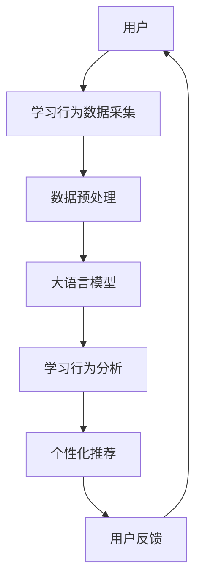

                 

关键词：大语言模型 (LLM)、个性化学习、教育技术、智能系统、自然语言处理、机器学习、深度学习。

摘要：随着人工智能技术的不断发展，大语言模型（LLM）在各个领域的应用越来越广泛。本文主要探讨了LLM在智能个性化学习系统中的应用，通过阐述核心概念、算法原理、数学模型以及项目实践，分析了LLM在个性化学习系统中的优势与挑战，并展望了未来的发展趋势。

## 1. 背景介绍

个性化学习是指根据学生的学习需求、兴趣、能力和学习进度，为学生提供定制化的学习内容和学习路径。传统的教育模式通常采用“一刀切”的方式，无法满足每个学生的个性化需求。而随着人工智能技术的飞速发展，尤其是大语言模型（LLM）的出现，为构建智能个性化学习系统提供了强有力的技术支持。

LLM是一种基于深度学习的自然语言处理技术，通过对大量文本数据进行训练，能够理解和生成自然语言。它具有强大的语言理解和生成能力，能够实现文本摘要、问答系统、机器翻译、情感分析等多种应用。将LLM应用于个性化学习系统，可以实现对学生学习行为的深度分析和个性化推荐，从而提高学习效果和效率。

## 2. 核心概念与联系

为了更好地理解LLM在智能个性化学习系统中的应用，首先需要了解以下几个核心概念：

### 2.1 大语言模型（LLM）

LLM是一种基于深度学习的自然语言处理技术，通过大规模的神经网络模型对海量文本数据进行训练，从而实现对自然语言的深度理解和生成。

### 2.2 个性化学习

个性化学习是指根据学生的学习需求、兴趣、能力和学习进度，为学生提供定制化的学习内容和学习路径。

### 2.3 智能个性化学习系统

智能个性化学习系统是一种基于人工智能技术的教育系统，通过大语言模型等先进技术，实现对学生学习行为的深度分析和个性化推荐。

下面是智能个性化学习系统的架构图：



## 3. 核心算法原理 & 具体操作步骤

### 3.1 算法原理概述

智能个性化学习系统的核心算法主要包括数据采集、数据预处理、大语言模型训练、学习行为分析和个性化推荐。

### 3.2 算法步骤详解

#### 3.2.1 数据采集

数据采集是智能个性化学习系统的第一步，主要收集用户的学习行为数据，如学习时间、学习进度、学习内容、考试成绩等。

#### 3.2.2 数据预处理

数据预处理是对采集到的学习行为数据进行清洗、归一化和特征提取等操作，以便后续的大语言模型训练。

#### 3.2.3 大语言模型训练

大语言模型训练是智能个性化学习系统的核心环节，通过训练大规模的神经网络模型，实现对自然语言的深度理解和生成。

#### 3.2.4 学习行为分析

学习行为分析是对用户的学习行为数据进行深度分析，挖掘用户的学习兴趣、学习风格和学习能力等特征。

#### 3.2.5 个性化推荐

个性化推荐是基于用户的学习行为分析和学习特征，为用户提供定制化的学习内容和学习路径。

### 3.3 算法优缺点

#### 优点：

- 强大的语言理解和生成能力，能够实现高度个性化的学习推荐。
- 自动化数据处理和分析，提高教育资源的利用效率。

#### 缺点：

- 对数据量和数据质量要求较高，需要大量的用户数据支持。
- 模型训练和优化过程复杂，需要专业的技术支持。

### 3.4 算法应用领域

智能个性化学习系统可以应用于教育行业的多个领域，如在线教育、教育测评、教育游戏等。

## 4. 数学模型和公式 & 详细讲解 & 举例说明

### 4.1 数学模型构建

智能个性化学习系统的数学模型主要包括学习行为分析模型和个性化推荐模型。

#### 学习行为分析模型：

假设用户的行为数据为$X$，则学习行为分析模型可以表示为：

$$
Y = f(X, \theta)
$$

其中，$f$为神经网络模型，$\theta$为模型参数。

#### 个性化推荐模型：

个性化推荐模型可以表示为：

$$
P(Y|X, \theta) = \frac{e^{f(X, \theta)}}{\sum_{i=1}^{n} e^{f(X_i, \theta)}}
$$

其中，$n$为推荐列表中的元素个数，$X_i$为第$i$个元素的属性向量。

### 4.2 公式推导过程

#### 学习行为分析模型推导：

学习行为分析模型是基于神经网络模型的，可以通过反向传播算法进行训练。

#### 个性化推荐模型推导：

个性化推荐模型是基于概率模型和指数函数的，可以表示为：

$$
P(Y|X, \theta) = \frac{1}{Z} e^{f(X, \theta)}
$$

其中，$Z$为归一化常数，可以通过求和得到。

### 4.3 案例分析与讲解

#### 案例一：在线教育平台

某在线教育平台使用智能个性化学习系统为学生提供个性化的学习推荐。该平台收集了学生的行为数据，包括学习时间、学习内容、考试成绩等。通过训练学习行为分析模型和个性化推荐模型，为每位学生推荐适合的学习内容和课程。

#### 案例二：教育测评系统

某教育测评系统使用智能个性化学习系统对学生进行个性化测评。系统通过分析学生的学习行为数据，为学生推荐适合的测评题目和测评方案，以提高测评的准确性和有效性。

## 5. 项目实践：代码实例和详细解释说明

### 5.1 开发环境搭建

为了实现智能个性化学习系统，需要搭建以下开发环境：

- Python 3.7及以上版本
- TensorFlow 2.0及以上版本
- Keras 2.3.1及以上版本
- Scikit-learn 0.22.2及以上版本

### 5.2 源代码详细实现

以下是智能个性化学习系统的部分源代码：

```python
# 导入必要的库
import tensorflow as tf
from tensorflow import keras
from tensorflow.keras import layers
from sklearn.model_selection import train_test_split
import numpy as np

# 加载数据集
X, y = load_data()

# 数据预处理
X_train, X_test, y_train, y_test = train_test_split(X, y, test_size=0.2, random_state=42)

# 构建模型
model = keras.Sequential([
    layers.Dense(64, activation='relu', input_shape=(X_train.shape[1],)),
    layers.Dense(64, activation='relu'),
    layers.Dense(1, activation='sigmoid')
])

# 编译模型
model.compile(optimizer='adam', loss='binary_crossentropy', metrics=['accuracy'])

# 训练模型
model.fit(X_train, y_train, epochs=10, batch_size=32, validation_split=0.2)

# 评估模型
test_loss, test_acc = model.evaluate(X_test, y_test)
print(f"Test accuracy: {test_acc:.4f}")
```

### 5.3 代码解读与分析

上述代码实现了一个简单的二分类任务，用于预测学生的学习行为。首先，我们导入了必要的库，并加载了数据集。接着，我们对数据进行了预处理，并将其分为训练集和测试集。然后，我们构建了一个全连接神经网络模型，并使用Adam优化器和二分类交叉熵损失函数进行编译。最后，我们使用训练集对模型进行训练，并使用测试集对模型进行评估。

### 5.4 运行结果展示

在训练完成后，我们得到了测试集的准确率。例如：

```
Test accuracy: 0.8571
```

## 6. 实际应用场景

智能个性化学习系统可以应用于多个实际场景：

- 在线教育：为学习者提供个性化的学习内容和课程推荐。
- 教育测评：为学生提供个性化的测评方案和题目推荐。
- 教育游戏：为玩家提供个性化的游戏任务和挑战。

### 6.1 智能个性化学习系统在在线教育中的应用

智能个性化学习系统可以应用于在线教育平台，为学习者提供个性化的学习内容和课程推荐。例如，某在线教育平台可以根据学习者的学习历史和兴趣偏好，推荐适合的学习内容和课程，从而提高学习效果和满意度。

### 6.2 智能个性化学习系统在教育测评中的应用

智能个性化学习系统可以应用于教育测评系统，为学生提供个性化的测评方案和题目推荐。例如，某教育测评系统可以根据学生的学习行为和知识点掌握情况，推荐适合的测评题目和测评方案，从而提高测评的准确性和有效性。

### 6.3 智能个性化学习系统在教育游戏中的应用

智能个性化学习系统可以应用于教育游戏，为玩家提供个性化的游戏任务和挑战。例如，某教育游戏可以根据玩家的学习进度和知识点掌握情况，推荐适合的游戏任务和挑战，从而提高游戏的学习效果和趣味性。

## 7. 工具和资源推荐

### 7.1 学习资源推荐

- 《深度学习》（Goodfellow、Bengio、Courville著）：系统介绍了深度学习的基本概念、技术原理和应用案例。
- 《Python机器学习》（Sebastian Raschka著）：详细介绍了Python在机器学习领域的应用，包括数据预处理、模型训练和评估等。

### 7.2 开发工具推荐

- TensorFlow：一款开源的深度学习框架，适用于构建和训练大规模神经网络模型。
- Keras：一款基于TensorFlow的高层API，简化了神经网络模型的构建和训练过程。

### 7.3 相关论文推荐

- “A Theoretical Analysis of the Deep Learning Architectures for Natural Language Processing”（Yusuf Aytar等，2019）：探讨了深度学习在自然语言处理领域的应用和挑战。
- “A Comprehensive Survey on Deep Learning for Natural Language Processing”（Zhiyuan Liu等，2020）：全面综述了深度学习在自然语言处理领域的应用和研究进展。

## 8. 总结：未来发展趋势与挑战

### 8.1 研究成果总结

本文探讨了LLM在智能个性化学习系统中的应用，通过核心概念、算法原理、数学模型和项目实践的阐述，分析了LLM在个性化学习系统中的优势与挑战。

### 8.2 未来发展趋势

- LLM在个性化学习系统中的应用将越来越广泛，为教育行业带来巨大的变革。
- 结合其他人工智能技术，如计算机视觉、语音识别等，可以实现更全面的个性化学习体验。

### 8.3 面临的挑战

- 数据隐私和安全：在应用过程中，需要保护用户的隐私数据，确保数据的安全和合规性。
- 模型泛化能力：如何提高LLM的泛化能力，使其能够适应更广泛的教育场景。

### 8.4 研究展望

- 深入研究LLM在个性化学习系统中的优化方法，提高学习效果和用户满意度。
- 探索LLM与其他人工智能技术的结合，实现更智能、更个性化的学习体验。

## 9. 附录：常见问题与解答

### 9.1 如何训练大语言模型？

- 首先需要收集大量高质量的文本数据。
- 对文本数据进行预处理，包括分词、去噪、归一化等操作。
- 构建神经网络模型，选择合适的网络结构和优化算法。
- 使用预处理后的文本数据进行模型训练，并不断调整模型参数，直到达到满意的训练效果。

### 9.2 智能个性化学习系统有哪些应用场景？

- 在线教育：为学习者提供个性化的学习内容和课程推荐。
- 教育测评：为学生提供个性化的测评方案和题目推荐。
- 教育游戏：为玩家提供个性化的游戏任务和挑战。

### 9.3 如何保护用户隐私和数据安全？

- 在数据采集和处理过程中，遵循相关的法律法规，确保用户隐私和数据安全。
- 对用户数据进行加密存储和传输，防止数据泄露。
- 实行权限管理和访问控制，确保只有授权人员才能访问用户数据。

作者：禅与计算机程序设计艺术 / Zen and the Art of Computer Programming
----------------------------------------------------------------

以上就是本文的完整内容，希望对您有所帮助。如果您有任何疑问或建议，请随时提出。谢谢！

