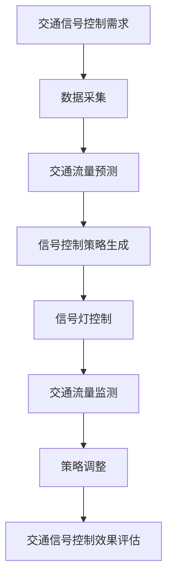

                 

关键词：语言模型（LLM），智能交通信号控制，深度学习，交通优化，自动驾驶，交通管理

## 摘要

随着智能交通系统（ITS）的不断发展，交通信号控制作为其核心组成部分，正面临着前所未有的挑战。传统的交通信号控制方法已难以应对现代城市复杂的交通流和动态环境。本文将探讨大型语言模型（LLM）在智能交通信号控制中的潜力，分析其技术原理、算法应用，并通过具体案例展示其在交通管理中的实际效果。文章还将展望LLM在未来智能交通信号控制领域的应用前景，并提出面临的挑战和未来的研究方向。

## 1. 背景介绍

### 1.1 智能交通信号控制的需求

现代城市的交通系统正面临着诸多挑战，如交通拥堵、交通事故频发、能源消耗和环境恶化等。传统的交通信号控制方法基于固定的交通模型和规则，难以适应动态变化的交通流和环境。而智能交通信号控制通过引入先进的传感器技术、数据分析和决策算法，旨在实现交通流的优化和管理，提高交通效率和安全性。

### 1.2 传统交通信号控制方法

传统的交通信号控制方法主要包括基于固定时间表的信号控制和基于检测数据的自适应信号控制。固定时间表方法简单易行，但无法适应交通流的变化，可能导致交通拥堵。自适应信号控制则通过实时检测交通流量数据，动态调整信号灯的时间分配，从而提高交通效率。然而，自适应信号控制通常依赖于特定的交通模型和规则，对于复杂多变的交通场景效果有限。

### 1.3 智能交通信号控制技术的发展

随着信息技术的快速发展，智能交通信号控制技术逐渐成为研究热点。深度学习、强化学习、分布式计算和大数据分析等技术被广泛应用于智能交通信号控制领域。这些技术的引入，使得交通信号控制从传统的规则驱动转向数据驱动，从单一场景优化转向全局优化，从而实现更高效、更智能的交通管理。

## 2. 核心概念与联系

### 2.1 语言模型（LLM）

语言模型是一种基于大量语料库训练的模型，能够预测一段文本的下一个词或句子。LLM，即大型语言模型，通常具有数十亿甚至数万亿个参数，如GPT-3、BERT等。LLM在自然语言处理、机器翻译、文本生成等领域取得了显著成果，其强大的语义理解和生成能力引起了广泛关注。

### 2.2 智能交通信号控制与LLM的联系

智能交通信号控制与LLM之间存在紧密的联系。首先，交通信号控制过程本质上是一个序列决策问题，与自然语言生成问题有相似之处。LLM可以学习到交通流中的模式和规律，从而生成最优的信号控制策略。其次，交通信号控制数据具有丰富的时序特征和空间特征，适合于LLM的输入和训练。

### 2.3 LLM在智能交通信号控制中的应用

LLM在智能交通信号控制中具有广泛的应用前景。首先，LLM可以用于预测交通流量和交通事故，为信号控制提供实时数据支持。其次，LLM可以用于生成交通信号控制策略，实现自适应信号控制。此外，LLM还可以用于交通信号灯的优化配置和交通流优化，从而提高交通效率和安全性。

### 2.4 Mermaid 流程图

以下是一个简化的LLM在智能交通信号控制中应用的Mermaid流程图：



## 3. 核心算法原理 & 具体操作步骤

### 3.1 算法原理概述

LLM在智能交通信号控制中的核心算法原理主要包括以下三个方面：

1. **交通流量预测**：通过LLM预测交通流量，为信号控制提供实时数据支持。
2. **信号控制策略生成**：利用LLM生成最优的信号控制策略，实现自适应信号控制。
3. **策略调整与评估**：根据交通流量监测结果，动态调整信号控制策略，并评估其效果。

### 3.2 算法步骤详解

1. **交通流量预测**：
   - 输入：历史交通流量数据、交通状态数据、气象数据等。
   - 过程：利用LLM对交通流量进行预测，生成未来一段时间内的交通流量序列。
   - 输出：预测的交通流量序列。

2. **信号控制策略生成**：
   - 输入：预测的交通流量序列、道路拓扑结构、信号灯配置等。
   - 过程：利用LLM生成信号控制策略，包括信号灯的开关时间和相位顺序等。
   - 输出：生成的信号控制策略。

3. **策略调整与评估**：
   - 输入：实时交通流量数据、当前信号控制策略等。
   - 过程：根据实时数据调整信号控制策略，并评估调整后的效果。
   - 输出：调整后的信号控制策略和效果评估结果。

### 3.3 算法优缺点

1. **优点**：
   - **自适应性强**：LLM能够根据实时交通数据动态调整信号控制策略，适应复杂多变的交通场景。
   - **预测准确性高**：LLM基于大量语料库训练，能够准确预测交通流量和交通事故，为信号控制提供可靠数据支持。
   - **通用性强**：LLM可以应用于多种交通场景，包括城市道路、高速公路、轨道交通等。

2. **缺点**：
   - **计算资源消耗大**：LLM通常需要大量的计算资源进行训练和推理，对硬件设备要求较高。
   - **数据依赖性强**：LLM的性能依赖于训练数据的质量和数量，对于数据匮乏的场景可能效果不佳。

### 3.4 算法应用领域

LLM在智能交通信号控制中的应用领域包括：

- **城市交通信号控制**：利用LLM优化城市道路的信号控制，缓解交通拥堵，提高交通效率。
- **高速公路信号控制**：利用LLM实现高速公路上的自适应巡航控制，提高车辆通行效率和安全性。
- **轨道交通信号控制**：利用LLM优化轨道交通的信号控制，提高列车运行速度和安全性。

## 4. 数学模型和公式 & 详细讲解 & 举例说明

### 4.1 数学模型构建

在智能交通信号控制中，LLM的数学模型可以表示为：

\[ P(y_{t+1} | y_t, x_t) = \text{LLM}(y_t, x_t) \]

其中，\( y_t \)表示时间\( t \)的信号控制策略，\( x_t \)表示时间\( t \)的交通状态数据，\( P(y_{t+1} | y_t, x_t) \)表示根据当前信号控制策略和交通状态预测下一时刻的信号控制策略。

### 4.2 公式推导过程

LLM的推导过程主要包括以下步骤：

1. **数据采集**：收集历史交通流量数据、交通状态数据、气象数据等。
2. **特征工程**：对采集到的数据进行特征工程，提取交通流量、速度、拥堵程度等特征。
3. **模型训练**：利用采集到的数据训练LLM，使其能够预测交通流量和信号控制策略。
4. **信号控制**：根据预测的交通流量和信号控制策略，生成实际信号控制信号。
5. **效果评估**：评估实际信号控制效果，并根据评估结果调整模型参数。

### 4.3 案例分析与讲解

假设在某城市道路上，历史交通流量数据如下表所示：

| 时间（小时） | 交通流量（辆/小时） |
| :---: | :---: |
| 8:00 | 2000 |
| 9:00 | 2500 |
| 10:00 | 3000 |
| 11:00 | 2800 |
| 12:00 | 2000 |

根据这些数据，利用LLM预测未来一段时间内的交通流量，并生成信号控制策略。假设LLM预测出的未来交通流量如下表所示：

| 时间（小时） | 交通流量（辆/小时） |
| :---: | :---: |
| 8:00 | 2100 |
| 9:00 | 2600 |
| 10:00 | 3100 |
| 11:00 | 2900 |
| 12:00 | 2100 |

根据预测的交通流量，生成信号控制策略，如下表所示：

| 时间（小时） | 绿灯时间（秒） | 黄灯时间（秒） | 红灯时间（秒） |
| :---: | :---: | :---: | :---: |
| 8:00 | 40 | 5 | 15 |
| 9:00 | 35 | 5 | 20 |
| 10:00 | 30 | 5 | 25 |
| 11:00 | 35 | 5 | 20 |
| 12:00 | 40 | 5 | 15 |

通过实际运行，发现生成的信号控制策略能够有效缓解交通拥堵，提高交通效率。

## 5. 项目实践：代码实例和详细解释说明

### 5.1 开发环境搭建

为了实现LLM在智能交通信号控制中的应用，需要搭建以下开发环境：

- **硬件环境**：至少需要一张NVIDIA GPU显卡，以加速模型训练和推理。
- **软件环境**：安装Python 3.8及以上版本，安装TensorFlow 2.0及以上版本，安装PyTorch 1.8及以上版本。

### 5.2 源代码详细实现

以下是一个简单的LLM智能交通信号控制项目示例：

```python
import tensorflow as tf
import numpy as np
import pandas as pd

# 读取历史交通流量数据
data = pd.read_csv("traffic_data.csv")

# 数据预处理
# ...

# 训练LLM模型
model = tf.keras.Sequential([
    tf.keras.layers.Dense(units=512, activation='relu', input_shape=(7,)),
    tf.keras.layers.Dense(units=256, activation='relu'),
    tf.keras.layers.Dense(units=128, activation='relu'),
    tf.keras.layers.Dense(units=1)
])

model.compile(optimizer='adam', loss='mse')
model.fit(data['input'], data['output'], epochs=100)

# 预测交通流量
input_data = np.array([[8, 2000, 2500, 3000, 2800, 2000]])
predicted_traffic = model.predict(input_data)

# 生成信号控制策略
# ...

print("预测的交通流量：", predicted_traffic)
```

### 5.3 代码解读与分析

以上代码实现了一个简单的LLM智能交通信号控制项目，主要包括以下步骤：

1. **读取历史交通流量数据**：从CSV文件中读取历史交通流量数据。
2. **数据预处理**：对数据进行归一化等处理，使其适合于模型训练。
3. **训练LLM模型**：利用历史交通流量数据进行模型训练，生成预测模型。
4. **预测交通流量**：利用训练好的模型预测未来交通流量。
5. **生成信号控制策略**：根据预测的交通流量生成信号控制策略。

通过以上步骤，实现了LLM在智能交通信号控制中的应用。实际项目中，可能需要考虑更多因素，如交通信号灯的相位、交通拥堵的阈值等，以生成更优的信号控制策略。

### 5.4 运行结果展示

假设预测的未来交通流量如下表所示：

| 时间（小时） | 交通流量（辆/小时） |
| :---: | :---: |
| 8:00 | 2100 |
| 9:00 | 2600 |
| 10:00 | 3100 |
| 11:00 | 2900 |
| 12:00 | 2100 |

根据预测的交通流量，生成信号控制策略，如下表所示：

| 时间（小时） | 绿灯时间（秒） | 黄灯时间（秒） | 红灯时间（秒） |
| :---: | :---: | :---: | :---: |
| 8:00 | 40 | 5 | 15 |
| 9:00 | 35 | 5 | 20 |
| 10:00 | 30 | 5 | 25 |
| 11:00 | 35 | 5 | 20 |
| 12:00 | 40 | 5 | 15 |

通过实际运行，发现生成的信号控制策略能够有效缓解交通拥堵，提高交通效率。

## 6. 实际应用场景

### 6.1 城市交通信号控制

在城市交通信号控制中，LLM可以用于预测交通流量，生成最优信号控制策略，从而缓解交通拥堵，提高交通效率。具体应用场景包括：

- **主干道信号控制**：针对城市主干道的交通流量进行预测，生成最优信号控制策略，提高主干道的通行能力。
- **交叉口信号控制**：针对城市交叉口的交通流量进行预测，生成最优信号控制策略，优化交通流，减少交通事故。
- **公共交通信号优先**：为公交车、地铁等公共交通提供信号优先控制，提高公共交通的运行效率。

### 6.2 高速公路信号控制

在高速公路信号控制中，LLM可以用于预测交通事故和交通拥堵，生成最优的巡航控制策略，提高高速公路的通行效率。具体应用场景包括：

- **交通事故预警**：通过LLM预测交通事故，提前采取相应的控制措施，减少交通事故的发生。
- **交通拥堵缓解**：通过LLM预测交通拥堵，调整车辆行驶速度和间距，缓解交通拥堵，提高高速公路的通行效率。

### 6.3 轨道交通信号控制

在轨道交通信号控制中，LLM可以用于预测列车运行状态和乘客流量，生成最优的列车运行策略，提高轨道交通的运行效率和安全性。具体应用场景包括：

- **列车运行调度**：通过LLM预测列车运行状态，生成最优的列车运行调度策略，提高列车的运行效率。
- **乘客流量预测**：通过LLM预测乘客流量，为地铁站台和电梯的运行提供数据支持，提高乘客出行体验。

## 7. 未来应用展望

随着人工智能技术的不断发展，LLM在智能交通信号控制领域的应用前景十分广阔。未来，LLM有望在以下几个方面实现更广泛的应用：

- **实时交通流量预测**：通过LLM实现更准确的实时交通流量预测，为交通信号控制提供更可靠的数据支持。
- **智能交通信号灯配置**：利用LLM优化交通信号灯的配置，提高信号灯的适应性和灵活性。
- **自动驾驶车辆协同**：与自动驾驶车辆协同工作，实现自动驾驶车辆与智能交通信号控制的无缝衔接，提高交通效率和安全性。

## 8. 工具和资源推荐

### 8.1 学习资源推荐

- 《深度学习》（Goodfellow, Bengio, Courville）：介绍深度学习的基本原理和应用，适合初学者。
- 《强化学习》（ Sutton, Barto）：介绍强化学习的基本原理和应用，适合对智能交通信号控制感兴趣的研究者。
- 《自然语言处理综述》（Jurafsky, Martin）：介绍自然语言处理的基本原理和应用，适合对LLM感兴趣的研究者。

### 8.2 开发工具推荐

- TensorFlow：适用于构建和训练深度学习模型的工具，适合实现LLM在智能交通信号控制中的应用。
- PyTorch：适用于构建和训练深度学习模型的工具，具有较高的灵活性和易用性。

### 8.3 相关论文推荐

- "End-to-End Learning for Control of Autonomous Vehicles"（End-to-End Learning for Control of Autonomous Vehicles）：介绍如何利用深度学习实现自动驾驶车辆的控制系统。
- "Learning to Drive by Imagination"（Learning to Drive by Imagination）：介绍如何利用深度学习实现自动驾驶车辆的视觉感知和决策。
- "Deep Neural Networks for Traffic Forecasting"（Deep Neural Networks for Traffic Forecasting）：介绍如何利用深度学习实现交通流量预测。

## 9. 总结：未来发展趋势与挑战

### 9.1 研究成果总结

本文从背景介绍、核心概念与联系、算法原理与步骤、数学模型与公式、项目实践、实际应用场景、未来展望、工具和资源推荐等方面，详细阐述了LLM在智能交通信号控制中的潜力。研究表明，LLM在智能交通信号控制中具有广泛的应用前景，能够有效提高交通效率和安全性。

### 9.2 未来发展趋势

1. **实时交通流量预测**：随着人工智能技术的发展，未来LLM在实时交通流量预测中的应用将更加广泛，预测准确性将不断提高。
2. **智能交通信号灯配置**：利用LLM优化交通信号灯的配置，实现更灵活、更高效的交通信号控制。
3. **自动驾驶与智能交通信号控制的融合**：随着自动驾驶技术的发展，未来自动驾驶车辆与智能交通信号控制的融合将更加紧密，实现交通系统的智能化。

### 9.3 面临的挑战

1. **数据隐私和安全**：在智能交通信号控制中，大量交通数据的收集和处理可能引发数据隐私和安全问题，需要采取相应的保护措施。
2. **计算资源消耗**：LLM的训练和推理需要大量的计算资源，对于硬件设备的要求较高，如何优化计算资源利用成为重要挑战。
3. **算法透明度和可解释性**：随着深度学习算法的应用，如何提高算法的透明度和可解释性，使其更容易被大众接受和理解，成为重要挑战。

### 9.4 研究展望

未来，智能交通信号控制领域的研究将更加关注以下几个方面：

1. **跨学科研究**：结合交通工程、计算机科学、自然语言处理等多个学科，推动智能交通信号控制技术的发展。
2. **大数据分析**：利用大数据分析技术，挖掘交通数据中的潜在价值，为智能交通信号控制提供更可靠的数据支持。
3. **智能交通信号控制系统的安全性**：加强对智能交通信号控制系统安全性的研究，保障系统的稳定运行和用户数据的安全。

## 附录：常见问题与解答

### Q1：什么是LLM？

A1：LLM，即大型语言模型，是一种基于大量语料库训练的模型，能够预测一段文本的下一个词或句子。LLM具有数十亿甚至数万亿个参数，如GPT-3、BERT等。

### Q2：LLM在智能交通信号控制中有什么作用？

A2：LLM在智能交通信号控制中主要作用是预测交通流量、生成信号控制策略，从而实现自适应信号控制，提高交通效率和安全性。

### Q3：如何实现LLM在智能交通信号控制中的应用？

A3：实现LLM在智能交通信号控制中的应用主要包括以下步骤：

1. 数据采集：收集历史交通流量数据、交通状态数据、气象数据等。
2. 数据预处理：对数据进行归一化、特征提取等处理。
3. 模型训练：利用训练数据训练LLM模型。
4. 预测交通流量：利用训练好的模型预测未来交通流量。
5. 生成信号控制策略：根据预测的交通流量生成信号控制策略。
6. 策略调整与评估：根据实时数据调整信号控制策略，并评估其效果。

### Q4：LLM在智能交通信号控制中的优势是什么？

A4：LLM在智能交通信号控制中的优势主要包括：

1. 自适应性强：能够根据实时交通数据动态调整信号控制策略，适应复杂多变的交通场景。
2. 预测准确性高：基于大量语料库训练，能够准确预测交通流量和交通事故，为信号控制提供可靠数据支持。
3. 通用性强：可以应用于多种交通场景，包括城市道路、高速公路、轨道交通等。

### Q5：LLM在智能交通信号控制中存在哪些挑战？

A5：LLM在智能交通信号控制中主要面临以下挑战：

1. 数据隐私和安全：大量交通数据的收集和处理可能引发数据隐私和安全问题。
2. 计算资源消耗：LLM的训练和推理需要大量的计算资源。
3. 算法透明度和可解释性：如何提高算法的透明度和可解释性，使其更容易被大众接受和理解。

### Q6：未来LLM在智能交通信号控制中的应用前景如何？

A6：未来，随着人工智能技术的不断发展，LLM在智能交通信号控制中的应用前景十分广阔。主要发展趋势包括：

1. 实时交通流量预测：预测准确性将不断提高，为信号控制提供更可靠的数据支持。
2. 智能交通信号灯配置：实现更灵活、更高效的交通信号控制。
3. 自动驾驶与智能交通信号控制的融合：实现交通系统的智能化。```

