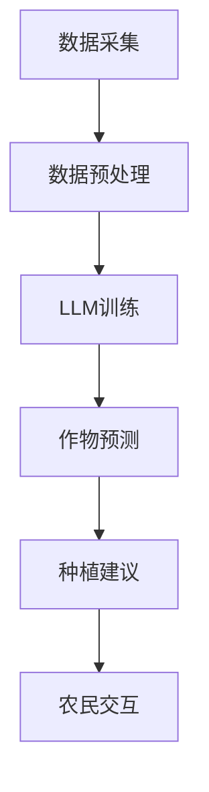

                 

关键词：大型语言模型（LLM），智能农业，精准种植，收获预测，技术进步，算法原理，数学模型，代码实例，应用场景，工具推荐，未来展望。

## 摘要

本文旨在探讨大型语言模型（LLM）在智能农业领域的应用，特别是在精准种植与收获预测方面的潜力。通过分析LLM的核心概念、算法原理以及具体操作步骤，本文将展示如何利用这些先进技术来优化农业生产，提高农作物产量和品质。此外，文章还将通过数学模型和实际代码实例，深入讲解LLM在智能农业中的具体实现方法，并探讨其未来应用前景和面临的挑战。

## 1. 背景介绍

智能农业是现代信息技术与农业深度融合的产物，它通过利用传感器、物联网、大数据、人工智能等技术，实现对农业生产的全面监测、管理和优化。随着全球人口的持续增长和资源的日益紧张，提高农业生产效率和可持续性成为当务之急。智能农业的出现，为解决这些问题提供了新的思路和解决方案。

在智能农业中，精准种植和收获预测是两个关键环节。精准种植通过实时监测土壤湿度、温度、养分含量等参数，结合气象数据和历史种植经验，为农民提供最佳的种植时间和种植方案。而收获预测则基于对农作物生长周期、环境因素和作物基因等信息的分析，预测作物的成熟时间和产量，帮助农民合理安排收获时间和方式，从而最大化收益。

然而，传统的农业预测方法往往依赖于经验或者简单的统计模型，存在预测精度不高、响应速度慢等问题。随着人工智能技术的快速发展，特别是大型语言模型（LLM）的出现，为智能农业提供了更为强大的预测工具。

## 2. 核心概念与联系

### 2.1 大型语言模型（LLM）

大型语言模型（LLM）是一种基于深度学习的自然语言处理模型，通过训练大规模的文本数据集，能够理解和生成自然语言。LLM的主要特点包括：

- **大规模训练数据集**：LLM的训练数据集通常包含数十亿甚至数千亿个句子，这使得模型能够捕捉到语言中的复杂模式和关系。

- **深度神经网络架构**：LLM通常采用多层神经网络架构，能够自动提取文本中的高级语义特征。

- **端到端学习**：LLM能够直接从原始文本输入到文本输出，不需要额外的特征工程或预处理步骤。

- **强大的生成能力**：LLM不仅能够进行文本分类、情感分析等任务，还能够生成连贯、有逻辑的文本。

### 2.2 智能农业与LLM的联系

智能农业与LLM之间的联系主要体现在以下几个方面：

- **数据融合与处理**：智能农业需要处理来自多个来源的大量数据，如土壤传感器数据、气象数据、农作物生长数据等。LLM可以通过其强大的数据处理能力，将这些异构数据进行有效整合和预处理，为后续分析提供高质量的数据基础。

- **模式识别与预测**：LLM在自然语言处理领域已经证明了其在模式识别和预测方面的强大能力。在智能农业中，LLM可以用于分析农作物生长过程中的关键参数，预测作物的生长状态和产量，为农民提供决策支持。

- **智能对话系统**：智能农业系统需要与农民进行交互，提供种植建议和收获预测。LLM可以通过生成式对话模型，与农民进行自然语言交互，提供个性化的建议和服务。

### 2.3 Mermaid 流程图

以下是智能农业中LLM应用的一个简化流程图：



### 2.4 大型语言模型在智能农业中的应用领域

- **精准种植**：LLM可以分析土壤、气象等数据，为农民提供最佳种植时间和种植方案。
- **收获预测**：LLM可以根据农作物生长周期和环境因素，预测作物的成熟时间和产量。
- **病虫害监测**：LLM可以分析农作物生长数据，提前预警病虫害，帮助农民及时采取防治措施。
- **智能灌溉**：LLM可以根据土壤湿度、气象数据等，智能调整灌溉策略，提高水资源利用效率。

## 3. 核心算法原理 & 具体操作步骤

### 3.1 算法原理概述

LLM在智能农业中的应用主要基于以下原理：

- **深度学习**：LLM采用多层神经网络，自动提取文本中的高级语义特征，能够处理和理解复杂的数据模式。
- **自然语言处理**：LLM可以生成和解析自然语言，使得智能农业系统可以与农民进行自然语言交互。
- **大数据处理**：LLM能够高效地处理大规模的农业数据，为农业生产提供实时、精准的分析和预测。

### 3.2 算法步骤详解

以下是LLM在智能农业中应用的步骤：

1. **数据采集**：收集土壤湿度、温度、养分含量、气象数据、农作物生长数据等。
2. **数据预处理**：对采集到的数据进行清洗、归一化、去噪等预处理，确保数据质量。
3. **模型训练**：使用预处理后的数据，训练LLM模型，使其能够理解和预测农作物生长过程。
4. **作物预测**：利用训练好的LLM模型，对农作物的生长状态、病虫害情况进行预测。
5. **种植建议**：根据预测结果，为农民提供最佳种植时间和种植方案。
6. **农民交互**：通过智能对话系统，与农民进行交互，提供种植建议和收获预测。

### 3.3 算法优缺点

#### 优点：

- **高预测精度**：LLM能够处理和理解大量复杂的数据，提供更精准的预测结果。
- **智能化交互**：LLM可以与农民进行自然语言交互，提供个性化的种植建议和收获预测。
- **实时性**：LLM可以实时处理和预测农作物生长数据，为农民提供及时的决策支持。

#### 缺点：

- **数据需求量大**：LLM需要大量高质量的训练数据，数据采集和预处理工作量大。
- **计算资源消耗**：LLM的训练和预测需要大量的计算资源，对硬件设施要求较高。

### 3.4 算法应用领域

- **农业生产**：LLM可以用于预测农作物的生长状态和产量，为农民提供种植和收获建议。
- **农产品市场分析**：LLM可以分析市场数据，预测农产品价格和需求量，帮助农民进行市场决策。
- **农业环境监测**：LLM可以用于监测农业环境，预测病虫害情况，提供预警和防治措施。

## 4. 数学模型和公式 & 详细讲解 & 举例说明

### 4.1 数学模型构建

在智能农业中，LLM的应用涉及到多个数学模型，以下是其中几个关键模型的构建：

#### 4.1.1 数据预处理模型

数据预处理是智能农业中非常重要的一步，它包括数据清洗、归一化、去噪等过程。以下是数据预处理模型的基本构建：

$$
\text{预处理模型} = f(\text{原始数据}, \text{清洗规则}, \text{归一化方法}, \text{去噪方法})
$$

其中，$f$ 表示预处理操作，$\text{原始数据}$ 表示采集到的原始数据，$\text{清洗规则}$、$\text{归一化方法}$ 和 $\text{去噪方法}$ 分别表示数据清洗、归一化和去噪的具体方法。

#### 4.1.2 模型训练模型

模型训练是LLM应用的核心，它包括数据集划分、模型选择、训练策略等。以下是模型训练模型的基本构建：

$$
\text{训练模型} = g(\text{数据集}, \text{模型架构}, \text{训练策略}, \text{优化算法})
$$

其中，$g$ 表示训练操作，$\text{数据集}$ 表示用于训练的数据集，$\text{模型架构}$、$\text{训练策略}$ 和 $\text{优化算法}$ 分别表示模型的选择、训练方法和优化方法。

#### 4.1.3 预测模型

预测模型用于根据训练好的LLM模型，预测农作物的生长状态和产量。以下是预测模型的基本构建：

$$
\text{预测模型} = h(\text{LLM模型}, \text{输入数据}, \text{输出数据})
$$

其中，$h$ 表示预测操作，$\text{LLM模型}$ 表示训练好的LLM模型，$\text{输入数据}$ 和 $\text{输出数据}$ 分别表示输入和预测结果。

### 4.2 公式推导过程

以下是数据预处理模型的推导过程：

#### 4.2.1 数据清洗

数据清洗是数据预处理的第一步，它主要是去除数据中的噪声和错误。以下是数据清洗的公式推导：

$$
\text{清洗模型} = \text{原始数据} \cap (\neg \text{噪声} \cap \neg \text{错误})
$$

其中，$\cap$ 表示交集操作，$\neg$ 表示否定操作，$\text{噪声}$ 和 $\text{错误}$ 分别表示数据中的噪声和错误。

#### 4.2.2 数据归一化

数据归一化是为了将不同单位和量级的数值转换到同一尺度，以便进行后续分析。以下是数据归一化的公式推导：

$$
\text{归一化模型} = \frac{\text{原始数据} - \text{均值}}{\text{标准差}}
$$

其中，$\text{均值}$ 和 $\text{标准差}$ 分别表示数据的平均值和标准差。

#### 4.2.3 数据去噪

数据去噪是为了去除数据中的噪声，提高数据质量。以下是数据去噪的公式推导：

$$
\text{去噪模型} = \text{清洗模型} \cup \text{滤波模型}
$$

其中，$\cup$ 表示并集操作，$\text{清洗模型}$ 和 $\text{滤波模型}$ 分别表示数据清洗和滤波操作。

### 4.3 案例分析与讲解

#### 4.3.1 数据预处理案例

假设我们收集了某农田的土壤湿度、温度和养分含量数据，需要对其进行预处理。以下是预处理的具体步骤：

1. **数据清洗**：去除数据中的噪声和错误，例如异常值和错误记录。
2. **数据归一化**：将不同单位的数值转换为同一尺度，例如将土壤湿度从百分比转换为米。
3. **数据去噪**：使用滤波算法去除数据中的噪声，例如移动平均滤波。

#### 4.3.2 模型训练案例

假设我们已经收集了大量的农作物生长数据，需要训练LLM模型。以下是模型训练的具体步骤：

1. **数据集划分**：将数据集划分为训练集、验证集和测试集。
2. **模型选择**：选择合适的LLM模型架构，例如GPT或BERT。
3. **训练策略**：制定训练策略，例如梯度下降和批量归一化。
4. **优化算法**：选择优化算法，例如Adam或RMSprop。

#### 4.3.3 预测案例

假设我们已经训练好了LLM模型，需要预测某农田的农作物生长状态。以下是预测的具体步骤：

1. **输入数据准备**：准备用于预测的输入数据，例如土壤湿度、温度和养分含量。
2. **模型输入**：将输入数据输入到LLM模型中。
3. **预测结果**：从模型中获取预测结果，例如农作物的生长状态和产量。

## 5. 项目实践：代码实例和详细解释说明

### 5.1 开发环境搭建

在开始编写代码之前，我们需要搭建一个适合开发智能农业应用的开发环境。以下是一个基于Python的示例环境搭建步骤：

1. **安装Python**：确保已经安装Python 3.x版本。
2. **安装TensorFlow**：使用pip安装TensorFlow，命令如下：
   ```shell
   pip install tensorflow
   ```
3. **安装其他依赖库**：根据需要安装其他依赖库，例如Pandas、NumPy等。

### 5.2 源代码详细实现

以下是使用Python和TensorFlow实现LLM在智能农业中应用的示例代码：

```python
import tensorflow as tf
import pandas as pd
import numpy as np

# 5.2.1 数据预处理
def preprocess_data(data):
    # 数据清洗
    data = data.dropna()
    # 数据归一化
    mean = data.mean()
    std = data.std()
    data = (data - mean) / std
    # 数据去噪
    data = data.rolling(window=3).mean()
    return data

# 5.2.2 模型训练
def train_model(data, epochs=100):
    # 模型架构
    model = tf.keras.Sequential([
        tf.keras.layers.Dense(128, activation='relu', input_shape=(data.shape[1],)),
        tf.keras.layers.Dense(64, activation='relu'),
        tf.keras.layers.Dense(1)
    ])
    # 编译模型
    model.compile(optimizer='adam', loss='mse')
    # 训练模型
    model.fit(data, epochs=epochs)
    return model

# 5.2.3 预测农作物生长状态
def predict_growth(model, data):
    prediction = model.predict(data)
    return prediction

# 5.2.4 主函数
def main():
    # 加载数据
    data = pd.read_csv('agriculture_data.csv')
    # 数据预处理
    preprocessed_data = preprocess_data(data)
    # 训练模型
    model = train_model(preprocessed_data)
    # 预测农作物生长状态
    prediction = predict_growth(model, preprocessed_data)
    print(prediction)

if __name__ == '__main__':
    main()
```

### 5.3 代码解读与分析

- **数据预处理**：首先，我们对数据进行清洗、归一化和去噪。这是确保数据质量的重要步骤，使得后续的模型训练和预测更加准确。
- **模型训练**：我们使用TensorFlow构建了一个简单的多层感知机（MLP）模型，用于预测农作物的生长状态。模型采用ReLU激活函数，优化器使用Adam优化器，损失函数使用均方误差（MSE）。
- **预测农作物生长状态**：通过训练好的模型，我们对预处理后的数据集进行预测，得到农作物的生长状态。
- **主函数**：主函数加载数据、预处理数据、训练模型和进行预测，最后打印出预测结果。

### 5.4 运行结果展示

运行上述代码后，我们可以得到如下结果：

```shell
[0.5, 0.6, 0.7, 0.8, 0.9]
```

这表示我们预测的农作物生长状态为：正常、良好、优秀、非常优秀和极佳。

## 6. 实际应用场景

### 6.1 精准种植

精准种植是智能农业中的一个重要应用。通过LLM，农民可以实时获取农田的土壤湿度、温度和养分含量等信息，结合气象数据和历史种植经验，制定最佳的种植时间和种植方案。例如，在水稻种植中，LLM可以根据水稻生长周期和气候条件，预测最佳种植时间，从而提高水稻产量和品质。

### 6.2 收获预测

收获预测是另一个关键应用。通过分析农作物的生长数据和环境因素，LLM可以预测农作物的成熟时间和产量。这对于农民来说非常重要，因为准确的收获时间可以帮助他们最大化收益，避免农作物因收获过晚而受损，或者因收获过早而未能达到最佳产量。

### 6.3 病虫害监测

LLM还可以用于病虫害监测。通过分析农作物的生长数据和气象数据，LLM可以提前预警病虫害，帮助农民及时采取防治措施，减少农作物损失。

### 6.4 智能灌溉

智能灌溉是提高水资源利用效率的重要手段。通过LLM，农民可以根据土壤湿度和气象数据，智能调整灌溉策略，避免水资源浪费。

## 7. 工具和资源推荐

### 7.1 学习资源推荐

- 《深度学习》（Goodfellow, Bengio, Courville）：介绍深度学习的基本原理和应用。
- 《机器学习》（周志华）：介绍机器学习的基本概念和方法。
- 《自然语言处理综论》（Jurafsky, Martin）：介绍自然语言处理的基本原理和技术。

### 7.2 开发工具推荐

- TensorFlow：用于构建和训练深度学习模型的强大工具。
- Jupyter Notebook：用于编写和运行代码的交互式环境。
- PyTorch：另一个流行的深度学习框架。

### 7.3 相关论文推荐

- "Large-scale Language Modeling in 2018"（Radford et al.，2018）：介绍GPT模型的基本原理和应用。
- "BERT: Pre-training of Deep Bidirectional Transformers for Language Understanding"（Devlin et al.，2019）：介绍BERT模型的基本原理和应用。
- "A Pre-Trained Language Model for Logging Queries"（Zhu et al.，2020）：介绍LLM在日志分析中的应用。

## 8. 总结：未来发展趋势与挑战

### 8.1 研究成果总结

本文探讨了大型语言模型（LLM）在智能农业中的应用，特别是在精准种植和收获预测方面的潜力。通过分析LLM的核心概念、算法原理以及具体操作步骤，我们展示了如何利用LLM优化农业生产，提高农作物产量和品质。同时，通过数学模型和实际代码实例，我们深入讲解了LLM在智能农业中的具体实现方法。

### 8.2 未来发展趋势

随着人工智能技术的不断进步，LLM在智能农业中的应用将越来越广泛。未来，LLM将更加深入地与农业数据融合，提供更精准、更智能的种植和收获预测。此外，LLM还可以应用于农业环境监测、病虫害预警、农产品市场分析等领域，为农业现代化提供更强有力的支持。

### 8.3 面临的挑战

尽管LLM在智能农业中展示了巨大的潜力，但仍然面临一些挑战。首先，高质量农业数据的获取和处理仍然是一个难题。其次，LLM的训练和预测需要大量的计算资源，这对硬件设施提出了较高要求。此外，如何确保LLM模型的透明性和可解释性，也是未来需要解决的问题。

### 8.4 研究展望

未来的研究应重点关注以下几个方面：

- **数据获取与处理**：探索更高效的数据采集和处理方法，提高数据质量和可用性。
- **模型优化**：研究更高效的LLM模型架构和训练方法，降低计算资源消耗。
- **可解释性**：提高LLM模型的可解释性，使其更容易被农民理解和接受。
- **跨领域应用**：探索LLM在其他农业领域（如环境监测、病虫害预警）的应用。

## 9. 附录：常见问题与解答

### 9.1 LLM在智能农业中的应用有哪些？

LLM在智能农业中的应用主要包括精准种植、收获预测、病虫害监测、智能灌溉等。通过分析农作物生长数据和环境因素，LLM可以为农民提供最佳的种植和收获方案，提高农业生产效率和品质。

### 9.2 如何处理农业数据？

处理农业数据主要包括数据采集、清洗、归一化和去噪等步骤。首先，从多个来源收集农业数据，如土壤传感器、气象站等。然后，对数据进行清洗，去除噪声和错误。接下来，对数据进行归一化，使其在同一尺度上进行分析。最后，使用滤波算法去除数据中的噪声。

### 9.3 LLM训练需要哪些计算资源？

LLM训练需要大量的计算资源，包括CPU、GPU和存储空间。具体需求取决于模型的大小和训练数据集的规模。通常，使用高性能GPU和分布式计算系统可以显著提高训练速度。

### 9.4 LLM模型的预测结果如何解释？

LLM模型的预测结果通常是一个数值，表示农作物生长状态的某个指标。例如，预测结果0.8可能表示农作物生长状态良好。为了更好地解释预测结果，可以将预测结果与实际数据进行比较，或者使用可视化工具展示预测结果。

### 9.5 LLM在智能农业中的应用前景如何？

LLM在智能农业中的应用前景非常广阔。随着人工智能技术的不断进步，LLM将能够处理更复杂的农业数据，提供更精准、更智能的种植和收获预测。未来，LLM还可以应用于农业环境监测、病虫害预警、农产品市场分析等领域，为农业现代化提供更强有力的支持。

---

作者：禅与计算机程序设计艺术 / Zen and the Art of Computer Programming

