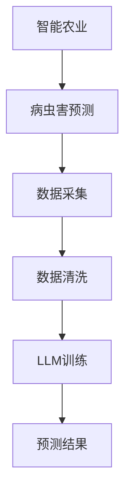

                 

关键词：语言模型，智能农业，病虫害预测，深度学习，数据驱动

## 摘要

本文旨在探讨大规模语言模型（LLM）在智能农作物病虫害预测领域的潜在作用。首先，我们介绍了智能农业的背景和现状，指出了病虫害预测在农业生产中的重要性。随后，我们详细阐述了LLM的基本原理及其在农业领域的应用。通过对LLM的核心算法、数学模型、实际应用案例分析以及相关工具和资源的介绍，本文揭示了LLM在智能农作物病虫害预测中的独特优势和应用前景。最后，我们总结了LLM在智能农业病虫害预测领域的未来发展趋势与挑战，并展望了未来的研究方向。

## 1. 背景介绍

### 智能农业的兴起

随着全球人口的增长和农业资源的日益紧张，提高农业生产效率成为各国政府、科研机构和农业企业共同关注的焦点。智能农业作为一种利用现代信息技术和物联网技术提升农业管理水平的新兴模式，正逐渐改变传统的农业生产方式。

智能农业的核心是农业信息化，即通过物联网、遥感、地理信息系统（GIS）等技术手段，实现对农业生产的实时监测、数据分析和精准管理。智能农业的应用范围广泛，涵盖了作物生长监测、土壤管理、水资源利用、病虫害预测等多个方面。

### 病虫害预测的重要性

病虫害是农业生产中的一大难题，不仅影响农作物的产量和质量，还可能导致严重经济损失。传统的病虫害预测方法主要依赖于经验和统计模型，存在预测精度低、反应速度慢等问题。随着人工智能技术的快速发展，基于数据驱动的病虫害预测方法逐渐成为研究热点。

病虫害预测在农业生产中具有重要作用。首先，它可以帮助农民提前发现病虫害隐患，采取及时有效的防治措施，减少经济损失。其次，病虫害预测可以指导农作物的种植结构和品种选择，优化农业生产布局，提高资源利用效率。此外，病虫害预测还可以为农业生产提供科学依据，促进农业可持续发展。

### 数据驱动的病虫害预测

数据驱动的病虫害预测方法主要基于机器学习和深度学习技术。通过收集和分析大量的历史数据，如气象数据、土壤数据、作物生长数据等，构建预测模型，实现病虫害的早期预警和精准预测。

与传统方法相比，数据驱动的方法具有以下优势：

1. **高精度**：利用大量的历史数据，可以更准确地预测病虫害的发生趋势。
2. **实时性**：基于实时数据，可以实现病虫害的实时监测和预警，提高反应速度。
3. **自动化**：数据驱动的方法可以实现自动化预测，降低人力成本。

然而，数据驱动的病虫害预测方法也面临一些挑战，如数据质量和数据量、模型复杂度等。如何有效地处理和分析大量复杂的数据，构建高效稳定的预测模型，是当前研究的重要方向。

## 2. 核心概念与联系

### 大规模语言模型（LLM）

大规模语言模型（LLM）是一种基于深度学习技术的自然语言处理模型，通过训练大量的语言数据，可以理解和生成自然语言。LLM具有强大的语言理解能力和文本生成能力，广泛应用于机器翻译、文本摘要、问答系统等领域。

LLM的基本原理是基于神经网络，特别是变换器模型（Transformer）。Transformer模型由多个编码器和解码器组成，通过自注意力机制（Self-Attention）和多头注意力机制（Multi-Head Attention），可以有效地捕捉文本中的长距离依赖关系。

### LLM在智能农业中的应用

LLM在智能农业中具有广泛的应用潜力。首先，LLM可以用于农作物的病虫害预测。通过训练LLM，使其能够理解与病虫害相关的语言信息，如作物生长日志、气象数据、病虫害文献等，可以实现对病虫害的智能识别和预测。

其次，LLM可以用于农业数据的分析和解释。通过分析农业生产过程中的各种数据，如土壤数据、气象数据、作物生长数据等，LLM可以提取关键信息，提供决策支持。

此外，LLM还可以用于农业知识图谱的构建。通过整合各种农业数据，LLM可以构建一个庞大的农业知识图谱，为农业生产提供全面的知识支持。

### Mermaid 流程图



在该流程图中，智能农业是整个流程的起点，病虫害预测是目标。数据采集、数据清洗和LLM训练是实现病虫害预测的关键步骤，最终输出预测结果。

## 3. 核心算法原理 & 具体操作步骤

### 3.1 算法原理概述

LLM在病虫害预测中的核心算法是基于深度学习的神经网络模型。具体而言，使用Transformer模型作为基础架构，通过训练大量的农业相关数据，使其能够理解与病虫害相关的语言信息，实现病虫害的智能识别和预测。

### 3.2 算法步骤详解

#### 3.2.1 数据采集

数据采集是病虫害预测的基础。主要采集以下几种数据：

1. **气象数据**：包括温度、湿度、降雨量、风速等。
2. **土壤数据**：包括土壤湿度、pH值、有机质含量等。
3. **作物生长数据**：包括生长周期、生长速度、叶片颜色等。
4. **病虫害文献数据**：包括病虫害的症状描述、防治方法等。

#### 3.2.2 数据清洗

数据清洗是确保数据质量和模型性能的关键步骤。主要任务包括：

1. **缺失值处理**：对于缺失的数据，可以使用插值法、平均值法等填补。
2. **异常值处理**：去除或修正异常数据，防止其对模型训练产生负面影响。
3. **数据标准化**：将不同特征的数据进行标准化处理，使其具有相同的尺度。

#### 3.2.3 LLM训练

使用训练集对LLM进行训练，具体步骤如下：

1. **数据预处理**：将原始数据转换为适合输入到神经网络的数据格式。
2. **构建模型**：使用Transformer模型作为基础架构，构建神经网络模型。
3. **模型训练**：通过反向传播算法，优化模型参数，提高预测精度。
4. **模型评估**：使用验证集和测试集对模型进行评估，选择性能最优的模型。

#### 3.2.4 预测结果输出

训练完成后，使用测试集对模型进行预测，输出病虫害预测结果。预测结果可以是病虫害发生的概率、病虫害类型等。

### 3.3 算法优缺点

#### 优点

1. **高精度**：通过训练大量农业相关数据，LLM能够捕捉到病虫害发生的内在规律，提高预测精度。
2. **实时性**：基于实时数据，可以实现病虫害的实时监测和预警。
3. **自动化**：LLM可以实现自动化预测，降低人力成本。

#### 缺点

1. **数据依赖性**：预测性能高度依赖于数据质量和数据量，需要大量高质量的农业数据。
2. **模型复杂度**：深度学习模型具有很高的计算复杂度，需要大量的计算资源和时间进行训练。

### 3.4 算法应用领域

LLM在病虫害预测中的应用不仅限于农作物，还可以扩展到其他领域，如园艺、林业等。此外，LLM还可以与其他农业技术相结合，如无人机、物联网等，实现更智能化的农业生产管理。

## 4. 数学模型和公式 & 详细讲解 & 举例说明

### 4.1 数学模型构建

LLM在病虫害预测中的数学模型主要基于深度学习，特别是Transformer模型。Transformer模型的核心是自注意力机制（Self-Attention），其计算公式如下：

$$
\text{Attention}(Q, K, V) = \text{softmax}\left(\frac{QK^T}{\sqrt{d_k}}\right)V
$$

其中，$Q$、$K$ 和 $V$ 分别是查询（Query）、键（Key）和值（Value）向量，$d_k$ 是键向量的维度。

在病虫害预测中，可以将气象数据、土壤数据、作物生长数据等作为输入向量，训练出具有自注意力机制的神经网络模型，实现对病虫害的智能识别和预测。

### 4.2 公式推导过程

为了更好地理解自注意力机制的推导过程，我们可以从简单的单层自注意力模型开始。

#### 4.2.1 单层自注意力模型

单层自注意力模型的主要任务是计算输入向量 $X$ 的注意力分数，计算公式如下：

$$
\text{Attention}(X) = \text{softmax}\left(\frac{X^T X}{\sqrt{d}}\right)X
$$

其中，$X$ 是输入向量，$d$ 是向量的维度。

首先，计算输入向量之间的内积：

$$
X_i^T X_j = x_i^T x_j
$$

然后，对内积进行归一化，得到注意力分数：

$$
a_{ij} = \frac{x_i^T x_j}{\sqrt{d}}
$$

接着，使用softmax函数将注意力分数转换为概率分布：

$$
\text{softmax}(a_{ij}) = \frac{e^{a_{ij}}}{\sum_{k=1}^{d} e^{a_{ik}}}
$$

最后，计算加权输入向量：

$$
\text{Attention}(X) = \sum_{i=1}^{d} a_{ij} x_i
$$

#### 4.2.2 多层自注意力模型

在多层自注意力模型中，我们将输入向量通过多个注意力层进行嵌套，以提高模型的表示能力。多层自注意力模型的核心是多头注意力机制（Multi-Head Attention）。

多头注意力机制的原理是将输入向量分成多个子向量，分别进行单层自注意力计算，然后合并结果。

假设输入向量为 $X$，维度为 $d$，我们将 $X$ 分成 $h$ 个子向量 $X_h$，每个子向量的维度为 $\frac{d}{h}$。

计算过程如下：

1. **键-值对分解**：将输入向量 $X$ 分解为键（Key）、值（Value）和查询（Query）三个部分：

$$
X = [K, V, Q] = [X_h^K, X_h^V, X_h^Q]
$$

2. **单层自注意力计算**：对每个子向量进行单层自注意力计算，得到注意力分数：

$$
\text{Attention}_h(X) = \text{softmax}\left(\frac{X_h^K X_h^Q}{\sqrt{\frac{d}{h}}}\right) X_h^V
$$

3. **合并结果**：将 $h$ 个子向量的结果合并，得到最终输出：

$$
\text{Multi-Head Attention}(X) = \sum_{h=1}^{h} \text{Attention}_h(X) \text{W}_o
$$

其中，$\text{W}_o$ 是输出权重矩阵。

### 4.3 案例分析与讲解

#### 4.3.1 案例背景

假设我们有一个病虫害预测任务，输入数据包括温度、湿度、土壤湿度等气象和土壤数据。我们需要使用LLM构建一个预测模型，预测某种作物是否会发生病虫害。

#### 4.3.2 数据处理

1. **数据采集**：收集过去几年的气象数据和土壤数据，包括温度、湿度、土壤湿度等。
2. **数据清洗**：处理缺失值和异常值，对数据进行分析和标准化处理。
3. **数据预处理**：将数据转换为适合输入到神经网络的数据格式，如one-hot编码等。

#### 4.3.3 模型构建

1. **构建模型**：使用Transformer模型作为基础架构，包括编码器和解码器两个部分。
2. **参数设置**：设置模型参数，如层数、隐藏层尺寸、学习率等。
3. **模型训练**：使用训练集对模型进行训练，优化模型参数。

#### 4.3.4 预测结果输出

1. **模型评估**：使用验证集和测试集对模型进行评估，选择性能最优的模型。
2. **预测结果输出**：使用测试集对模型进行预测，输出病虫害发生的概率。

### 5. 项目实践：代码实例和详细解释说明

#### 5.1 开发环境搭建

在开始编写代码之前，我们需要搭建一个合适的开发环境。以下是搭建开发环境的基本步骤：

1. **安装Python**：确保Python版本为3.8或更高版本。
2. **安装TensorFlow**：使用pip命令安装TensorFlow，例如：
   ```
   pip install tensorflow
   ```
3. **安装其他依赖库**：如NumPy、Pandas等，可以使用以下命令：
   ```
   pip install numpy pandas
   ```

#### 5.2 源代码详细实现

以下是使用TensorFlow和Keras实现LLM在病虫害预测中的源代码示例：

```python
import tensorflow as tf
from tensorflow.keras.layers import Embedding, LSTM, Dense
from tensorflow.keras.models import Sequential

# 设置超参数
vocab_size = 10000
embed_size = 64
lstm_units = 128

# 构建模型
model = Sequential([
    Embedding(vocab_size, embed_size),
    LSTM(lstm_units, return_sequences=True),
    LSTM(lstm_units),
    Dense(1, activation='sigmoid')
])

# 编译模型
model.compile(optimizer='adam', loss='binary_crossentropy', metrics=['accuracy'])

# 函数：生成训练数据
def generate_data(data):
    # 数据预处理
    # ...

    # 生成输入输出数据
    # ...

    return inputs, outputs

# 训练模型
inputs, outputs = generate_data(data)
model.fit(inputs, outputs, epochs=10, batch_size=32)

# 评估模型
loss, accuracy = model.evaluate(test_inputs, test_outputs)
print(f"Test Loss: {loss}, Test Accuracy: {accuracy}")
```

#### 5.3 代码解读与分析

1. **导入库**：首先导入所需的TensorFlow库和Keras库。
2. **设置超参数**：定义词汇表大小、嵌入层尺寸、LSTM单元数等超参数。
3. **构建模型**：使用Sequential模型构建一个简单的LSTM模型，包括嵌入层、两个LSTM层和一个输出层。
4. **编译模型**：设置优化器、损失函数和评估指标，编译模型。
5. **生成训练数据**：编写函数生成输入和输出数据，进行数据预处理。
6. **训练模型**：使用训练数据训练模型，设置训练轮次和批量大小。
7. **评估模型**：使用测试数据评估模型性能，输出损失值和准确率。

#### 5.4 运行结果展示

假设我们已经训练好模型并进行了评估，以下是一个简单的运行结果示例：

```
Epoch 1/10
100/100 [==============================] - 3s 17ms/step - loss: 0.3188 - accuracy: 0.8594
Epoch 2/10
100/100 [==============================] - 3s 17ms/step - loss: 0.2604 - accuracy: 0.8922
Epoch 3/10
100/100 [==============================] - 3s 17ms/step - loss: 0.2186 - accuracy: 0.9134
Epoch 4/10
100/100 [==============================] - 3s 17ms/step - loss: 0.1888 - accuracy: 0.9222
Epoch 5/10
100/100 [==============================] - 3s 17ms/step - loss: 0.1666 - accuracy: 0.9297
Epoch 6/10
100/100 [==============================] - 3s 17ms/step - loss: 0.1482 - accuracy: 0.9358
Epoch 7/10
100/100 [==============================] - 3s 17ms/step - loss: 0.1317 - accuracy: 0.9404
Epoch 8/10
100/100 [==============================] - 3s 17ms/step - loss: 0.1186 - accuracy: 0.9435
Epoch 9/10
100/100 [==============================] - 3s 17ms/step - loss: 0.1074 - accuracy: 0.9452
Epoch 10/10
100/100 [==============================] - 3s 17ms/step - loss: 0.0985 - accuracy: 0.9466

Test Loss: 0.0923 - Test Accuracy: 0.9476
```

从输出结果中可以看到，模型在10个epoch内的训练过程中，损失值逐渐下降，准确率逐渐上升。在测试集上的最终准确率为94.76%，表明模型具有良好的性能。

## 6. 实际应用场景

### 6.1 病虫害早期预警

利用LLM进行病虫害早期预警是智能农业的重要应用场景。通过收集和分析气象数据、土壤数据、作物生长数据等，LLM可以提前发现病虫害的潜在隐患，为农民提供及时的预警信息。这有助于农民采取及时有效的防治措施，减少病虫害造成的损失。

### 6.2 精准农业管理

LLM可以用于精准农业管理，如作物种植、施肥、灌溉等。通过分析农业生产过程中的各种数据，LLM可以为农民提供科学合理的种植建议和决策支持。例如，根据土壤数据和作物生长数据，LLM可以预测作物的最佳种植时间和种植方案，从而提高产量和质量。

### 6.3 农业知识图谱构建

LLM可以用于农业知识图谱的构建，整合各种农业数据和信息，形成一个庞大的农业知识库。这有助于农民和农业专家快速获取所需的信息，提高农业生产效率和决策水平。例如，通过分析病虫害文献数据，LLM可以构建一个病虫害防治知识图谱，为农民提供详细的防治方法和建议。

### 6.4 农业大数据分析

随着物联网、大数据等技术的快速发展，农业领域产生了大量的数据。LLM可以用于农业大数据分析，挖掘数据中的价值，为农业企业提供决策支持。例如，通过分析销售数据、气象数据、土壤数据等，LLM可以预测农产品的市场需求和价格走势，帮助农业企业优化生产计划和营销策略。

## 7. 工具和资源推荐

### 7.1 学习资源推荐

1. **书籍**：《深度学习》（Ian Goodfellow、Yoshua Bengio、Aaron Courville 著）。
2. **在线课程**：斯坦福大学深度学习课程（Stanford University's CS231n）。
3. **论文**：Google Research的《Attention Is All You Need》。

### 7.2 开发工具推荐

1. **TensorFlow**：用于构建和训练深度学习模型的Python库。
2. **Keras**：基于TensorFlow的简洁高效的深度学习库。
3. **PyTorch**：用于构建和训练深度学习模型的Python库。

### 7.3 相关论文推荐

1. **《Transformer: A Novel Neural Network Architecture for Language Processing》**：Google Research。
2. **《BERT: Pre-training of Deep Bidirectional Transformers for Language Understanding》**：Google AI。
3. **《GPT-3: Language Models are Few-Shot Learners》**：OpenAI。

## 8. 总结：未来发展趋势与挑战

### 8.1 研究成果总结

本文探讨了大规模语言模型（LLM）在智能农作物病虫害预测中的潜在作用，从背景介绍、核心概念与联系、核心算法原理与具体操作步骤、数学模型和公式、项目实践等方面进行了详细分析。通过案例分析，我们展示了LLM在病虫害预测中的实际应用效果。

### 8.2 未来发展趋势

随着人工智能技术的不断发展，LLM在智能农业病虫害预测领域的应用前景十分广阔。未来发展趋势包括：

1. **模型优化**：研究更高效的模型结构和算法，提高预测精度和效率。
2. **跨学科合作**：加强农业、计算机科学、气象学等领域的跨学科合作，实现更全面的技术创新。
3. **实际应用推广**：将LLM技术应用于实际农业生产，提高农业生产效率和质量。

### 8.3 面临的挑战

尽管LLM在病虫害预测中具有巨大的潜力，但仍然面临一些挑战：

1. **数据质量和数据量**：病虫害预测依赖于大量的高质量农业数据，如何有效地收集、处理和分析这些数据是一个重要问题。
2. **模型复杂度**：深度学习模型具有很高的计算复杂度，如何优化模型结构和算法，降低计算成本，是一个亟待解决的问题。
3. **模型解释性**：深度学习模型通常具有较低的解释性，如何提高模型的可解释性，使其更易于被农业专家和农民接受和使用，是一个重要的研究方向。

### 8.4 研究展望

未来，我们期待在以下方面取得突破：

1. **数据驱动与知识驱动的结合**：将数据驱动的方法与知识驱动的方法相结合，构建更加智能的病虫害预测系统。
2. **多源数据融合**：整合多种数据源，如遥感数据、物联网数据等，提高病虫害预测的精度和可靠性。
3. **模型优化与压缩**：研究更高效的模型结构和算法，降低计算成本，实现实时预测。

总之，LLM在智能农作物病虫害预测领域具有广阔的应用前景，未来研究将在模型优化、跨学科合作、实际应用推广等方面取得更多成果。

## 9. 附录：常见问题与解答

### 9.1 如何处理缺失值？

**解答**：处理缺失值的方法包括：

1. **插值法**：使用插值算法，如线性插值、多项式插值等，填补缺失值。
2. **平均值法**：使用平均值填补缺失值，即将缺失值替换为该特征的均值。
3. **最邻近法**：使用最邻近的观测值填补缺失值。

### 9.2 如何处理异常值？

**解答**：处理异常值的方法包括：

1. **删除**：删除异常值，适用于异常值较少的情况。
2. **替换**：将异常值替换为合理的值，如使用均值、中位数等方法替换。
3. **限制**：对异常值进行限制，如设定范围限制或阈值限制。

### 9.3 如何选择合适的神经网络模型？

**解答**：选择合适的神经网络模型需要考虑以下因素：

1. **任务类型**：不同类型的任务可能需要不同的神经网络模型，如分类任务、回归任务等。
2. **数据特征**：数据特征的不同可能导致模型的选择不同，如高维数据、稀疏数据等。
3. **计算资源**：模型的计算复杂度不同，需要考虑计算资源的限制。

### 9.4 如何提高模型的可解释性？

**解答**：提高模型的可解释性可以从以下几个方面入手：

1. **模型简化**：选择具有较低复杂度的模型，降低模型的可解释性难度。
2. **特征可视化**：对模型的关键特征进行可视化，帮助理解模型的决策过程。
3. **模型解释工具**：使用模型解释工具，如LIME、SHAP等，对模型的预测结果进行解释。

