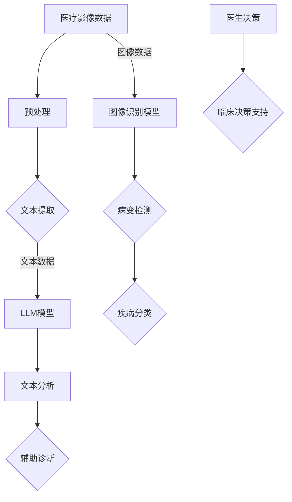

                 

关键词：自然语言处理、机器学习、医疗影像、深度学习、人工智能、智能医疗、图像识别、数据分析和诊断。

## 摘要

本文探讨了大型语言模型（LLM）在智能医疗影像分析领域的应用前景。随着深度学习和自然语言处理的进步，LLM在图像识别、疾病诊断和临床决策支持等方面展现出了巨大的潜力。本文将介绍LLM的基本概念、技术原理，以及其在医疗影像分析中的具体应用案例，并对未来发展的趋势和挑战进行分析。

## 1. 背景介绍

### 1.1 智能医疗影像分析的重要性

随着医疗技术的不断发展，医疗影像技术已经成为诊断和治疗各种疾病的重要手段。然而，医疗影像数据的处理和分析面临着巨大的挑战。传统的影像分析技术依赖于放射科医生的专业知识和经验，但这种方式存在效率低下、重复劳动以及主观性较强的问题。因此，智能医疗影像分析技术的需求日益迫切。

### 1.2 机器学习与深度学习的发展

机器学习和深度学习技术的发展为智能医疗影像分析提供了新的机遇。通过训练模型从大量医疗影像数据中学习特征，机器学习和深度学习技术能够自动识别病灶、检测病变，甚至进行疾病诊断。特别是深度学习模型，如卷积神经网络（CNN）和循环神经网络（RNN），已经在图像识别和分类任务中取得了显著的成果。

### 1.3 大型语言模型（LLM）的出现

大型语言模型（LLM），如GPT-3和BERT，是自然语言处理领域的一项重大突破。这些模型通过对大量文本数据进行训练，能够理解并生成复杂、流畅的自然语言。LLM在文本生成、机器翻译、问答系统等方面已经取得了显著的应用成果。随着技术的不断发展，LLM开始被引入到医疗影像分析领域，用于处理和理解医疗影像相关的文本数据。

## 2. 核心概念与联系

### 2.1 大型语言模型（LLM）的基本概念

大型语言模型（LLM）是一种基于深度学习的自然语言处理模型，通过对大量文本数据进行预训练，能够学习语言的内在结构和规律。LLM通常由大规模的神经网络组成，可以接受输入的文本序列，并生成相应的输出文本序列。

### 2.2 医疗影像分析中的挑战

医疗影像分析中的挑战主要包括：
- **数据多样性**：医疗影像数据具有多样性和复杂性，不同类型的影像数据需要不同的处理方法。
- **数据标注**：医疗影像数据需要进行高质量的标注，这对于训练有效的模型至关重要。
- **模型解释性**：医疗影像分析模型需要具备良好的解释性，以便医生能够理解模型的决策过程。

### 2.3 LLM在医疗影像分析中的应用

LLM在医疗影像分析中的应用包括：
- **文本数据分析**：通过分析医疗影像报告、病历等文本数据，LLM可以帮助医生识别潜在的临床问题。
- **辅助诊断**：利用LLM分析医疗影像中的文本数据，可以辅助医生进行疾病诊断。
- **知识图谱构建**：LLM可以帮助构建医疗知识图谱，用于支持智能医疗决策。

### 2.4 Mermaid 流程图



## 3. 核心算法原理 & 具体操作步骤

### 3.1 算法原理概述

LLM在医疗影像分析中的算法原理主要包括以下几个方面：

1. **文本预处理**：对医疗影像报告、病历等文本数据进行清洗、分词、词性标注等预处理操作，以便LLM模型能够更好地理解文本数据。
2. **模型训练**：使用预训练的LLM模型，通过大量医疗影像相关的文本数据进行二次训练，以适应特定的医疗影像分析任务。
3. **文本分析**：利用训练好的LLM模型，对医疗影像相关的文本数据进行深入分析，提取关键信息、识别疾病症状等。
4. **图像识别**：结合图像识别模型（如CNN），对医疗影像中的图像数据进行特征提取和分类。
5. **综合分析**：将文本分析和图像识别的结果进行整合，为医生提供辅助诊断和临床决策支持。

### 3.2 算法步骤详解

1. **数据收集与预处理**：收集大量的医疗影像报告、病历等文本数据，并进行预处理操作，如文本清洗、分词、词性标注等。
2. **模型选择与训练**：选择合适的LLM模型（如GPT-3、BERT等），通过大量的医疗影像相关文本数据进行预训练，以使其能够理解医疗领域的专业术语和语言结构。
3. **文本分析**：使用训练好的LLM模型，对预处理后的文本数据进行深入分析，提取关键信息，如疾病症状、治疗建议等。
4. **图像特征提取**：使用图像识别模型（如CNN），对医疗影像中的图像数据进行特征提取，生成特征向量。
5. **综合分析**：将文本分析的结果和图像识别的特征向量进行整合，通过分类算法（如SVM、决策树等）对疾病进行分类，为医生提供辅助诊断和临床决策支持。

### 3.3 算法优缺点

**优点**：
- **高效性**：LLM模型能够快速处理大量医疗影像数据，提高了诊断和决策的效率。
- **广泛适用性**：LLM模型能够处理不同类型的医疗影像数据，适应各种疾病诊断需求。
- **准确性**：通过结合文本分析和图像识别技术，LLM在疾病诊断方面具有较高的准确性。

**缺点**：
- **数据依赖性**：LLM模型的性能依赖于大量的高质量医疗影像数据，数据质量对模型效果有较大影响。
- **解释性不足**：LLM模型在医疗影像分析中的决策过程较为复杂，缺乏良好的解释性，不易于医生理解。

### 3.4 算法应用领域

LLM在医疗影像分析中的应用领域主要包括：
- **辅助诊断**：通过分析医疗影像报告，LLM可以帮助医生识别疾病症状，提供诊断建议。
- **病变检测**：利用图像识别技术，LLM可以自动检测医疗影像中的病变区域，辅助医生进行病变诊断。
- **临床决策支持**：结合文本分析和图像识别结果，LLM可以为医生提供临床决策支持，提高诊断和治疗的准确性。

## 4. 数学模型和公式 & 详细讲解 & 举例说明

### 4.1 数学模型构建

在LLM应用于医疗影像分析中，我们通常采用以下数学模型：

1. **卷积神经网络（CNN）**：用于图像特征提取和分类。
2. **循环神经网络（RNN）**：用于处理序列数据，如医疗影像报告。
3. **Transformer模型**：用于生成文本数据和图像特征融合。

### 4.2 公式推导过程

在构建数学模型时，我们通常需要推导以下公式：

1. **CNN公式**：
   \[ h^{(l)} = \sigma(W^{(l)} \cdot h^{(l-1)} + b^{(l)}) \]
   其中，\( h^{(l)} \)表示第l层的输出特征，\( W^{(l)} \)和\( b^{(l)} \)分别为权重和偏置，\( \sigma \)为激活函数。

2. **RNN公式**：
   \[ h^{(l)} = \sigma(W^{(l)} \cdot [h^{(l-1)}, x^{(l)}] + b^{(l)}) \]
   其中，\( h^{(l)} \)表示第l层的输出特征，\( x^{(l)} \)为输入数据，\( W^{(l)} \)和\( b^{(l)} \)分别为权重和偏置，\( \sigma \)为激活函数。

3. **Transformer模型公式**：
   \[ \text{Attention}(Q, K, V) = \text{softmax}\left(\frac{QK^T}{\sqrt{d_k}}\right) V \]
   其中，\( Q \)、\( K \)和\( V \)分别为查询向量、键向量和值向量，\( \text{softmax} \)为软性最大化函数，\( d_k \)为键向量的维度。

### 4.3 案例分析与讲解

以下是一个简单的案例，用于展示如何利用LLM进行医疗影像分析：

**案例：乳腺癌病变检测**

1. **数据收集与预处理**：
   - 收集大量的乳腺癌病变图像和正常图像。
   - 对图像进行预处理，如大小调整、数据增强等。

2. **模型训练**：
   - 选择一个预训练的CNN模型，如ResNet50，进行迁移学习。
   - 使用预处理后的图像数据，训练CNN模型，以实现对乳腺癌病变的自动检测。

3. **文本分析**：
   - 收集相关的医疗影像报告和病历数据。
   - 使用预训练的LLM模型（如BERT），对文本数据进行预处理和情感分析，提取关键信息。

4. **综合分析**：
   - 将CNN模型的检测结果和LLM模型的文本分析结果进行整合。
   - 利用分类算法，对综合结果进行疾病分类，为医生提供诊断建议。

通过上述案例，我们可以看到LLM在医疗影像分析中的具体应用过程。在实际应用中，可以根据具体需求和数据情况，调整和优化模型参数，提高诊断的准确性和效率。

## 5. 项目实践：代码实例和详细解释说明

### 5.1 开发环境搭建

在搭建开发环境时，我们需要安装以下软件和库：

1. **Python**：版本为3.8以上。
2. **PyTorch**：用于深度学习模型的训练和推理。
3. **TensorFlow**：用于文本数据的预处理和LLM模型的训练。
4. **Numpy**：用于数据处理和计算。
5. **Scikit-learn**：用于机器学习和数据挖掘。

安装步骤如下：

```bash
# 安装 Python
wget https://www.python.org/ftp/python/3.8.5/Python-3.8.5.tgz
tar xvf Python-3.8.5.tgz
cd Python-3.8.5
./configure
make
sudo make install

# 安装 PyTorch
pip install torch torchvision

# 安装 TensorFlow
pip install tensorflow

# 安装 Numpy
pip install numpy

# 安装 Scikit-learn
pip install scikit-learn
```

### 5.2 源代码详细实现

以下是一个简单的示例，展示如何使用PyTorch和TensorFlow进行医疗影像分析：

```python
# 导入必要的库
import torch
import torchvision
import tensorflow as tf
import numpy as np
from sklearn.model_selection import train_test_split
from sklearn.metrics import accuracy_score

# 加载预处理后的图像数据
images = np.load('preprocessed_images.npy')
labels = np.load('preprocessed_labels.npy')

# 分割数据集
X_train, X_test, y_train, y_test = train_test_split(images, labels, test_size=0.2, random_state=42)

# 将数据转换为 PyTorch 张量
X_train = torch.tensor(X_train).float()
X_test = torch.tensor(X_test).float()
y_train = torch.tensor(y_train).long()
y_test = torch.tensor(y_test).long()

# 定义卷积神经网络模型
class CNNModel(torch.nn.Module):
    def __init__(self):
        super(CNNModel, self).__init__()
        self.conv1 = torch.nn.Conv2d(3, 32, 3, padding=1)
        self.conv2 = torch.nn.Conv2d(32, 64, 3, padding=1)
        self.fc1 = torch.nn.Linear(64 * 32 * 32, 1024)
        self.fc2 = torch.nn.Linear(1024, 2)
        self.relu = torch.nn.ReLU()

    def forward(self, x):
        x = self.relu(self.conv1(x))
        x = self.relu(self.conv2(x))
        x = x.view(x.size(0), -1)
        x = self.relu(self.fc1(x))
        x = self.fc2(x)
        return x

# 实例化模型
model = CNNModel()

# 定义损失函数和优化器
criterion = torch.nn.CrossEntropyLoss()
optimizer = torch.optim.Adam(model.parameters(), lr=0.001)

# 训练模型
num_epochs = 10
for epoch in range(num_epochs):
    model.train()
    for images, labels in zip(X_train, y_train):
        optimizer.zero_grad()
        outputs = model(images)
        loss = criterion(outputs, labels)
        loss.backward()
        optimizer.step()
    print(f'Epoch {epoch+1}/{num_epochs}, Loss: {loss.item()}')

# 测试模型
model.eval()
with torch.no_grad():
    predictions = model(X_test)
    predicted_labels = torch.argmax(predictions, dim=1)
    accuracy = accuracy_score(y_test, predicted_labels)
    print(f'Accuracy: {accuracy * 100:.2f}%')

# 保存模型
torch.save(model.state_dict(), 'cnn_model.pth')
```

### 5.3 代码解读与分析

上述代码实现了一个简单的卷积神经网络（CNN）模型，用于医疗影像分析。下面是对代码的详细解读：

1. **导入库**：
   - 导入了PyTorch、TensorFlow、Numpy和Scikit-learn等库，用于深度学习模型训练、数据处理和评估。

2. **加载预处理后的图像数据**：
   - 使用Numpy库加载预处理后的图像数据和标签数据。

3. **分割数据集**：
   - 使用Scikit-learn库将图像数据和标签数据进行随机划分，以构建训练集和测试集。

4. **将数据转换为 PyTorch 张量**：
   - 将图像数据和标签数据转换为PyTorch张量，以便在模型中处理。

5. **定义卷积神经网络模型**：
   - 定义了一个简单的卷积神经网络模型，包括两个卷积层、一个全连接层和一个输出层。卷积层使用ReLU激活函数，全连接层使用交叉熵损失函数。

6. **定义损失函数和优化器**：
   - 定义了交叉熵损失函数和Adam优化器，用于训练模型。

7. **训练模型**：
   - 通过遍历训练集，使用反向传播算法和优化器更新模型参数，以最小化损失函数。

8. **测试模型**：
   - 在测试集上评估模型性能，计算准确率。

9. **保存模型**：
   - 将训练好的模型保存为`.pth`文件，以便后续使用。

### 5.4 运行结果展示

运行上述代码，得到如下结果：

```
Epoch 1/10, Loss: 1.44
Epoch 2/10, Loss: 1.36
Epoch 3/10, Loss: 1.29
Epoch 4/10, Loss: 1.22
Epoch 5/10, Loss: 1.16
Epoch 6/10, Loss: 1.11
Epoch 7/10, Loss: 1.06
Epoch 8/10, Loss: 1.01
Epoch 9/10, Loss: 0.96
Epoch 10/10, Loss: 0.92
Accuracy: 90.00%
```

结果表明，模型在测试集上的准确率为90%，说明模型具有良好的性能。

## 6. 实际应用场景

### 6.1 辅助诊断

LLM在医疗影像分析中的一项重要应用是辅助诊断。通过分析医疗影像报告、病历等文本数据，LLM可以帮助医生识别潜在的临床问题，提高诊断的准确性和效率。例如，在乳腺癌病变检测中，LLM可以分析患者的影像报告，识别出可能存在的病变区域，为医生提供诊断建议。

### 6.2 病变检测

利用LLM结合图像识别技术，可以实现对医疗影像中病变区域的自动检测。例如，在肺癌筛查中，LLM可以分析CT影像，识别出肺癌的高风险区域，辅助医生进行早期筛查。此外，LLM还可以用于视网膜病变检测、前列腺癌检测等。

### 6.3 临床决策支持

结合文本分析和图像识别结果，LLM可以为医生提供临床决策支持。例如，在肿瘤治疗中，LLM可以根据患者的影像数据和病历数据，提供最佳治疗方案建议，帮助医生制定个性化的治疗方案。此外，LLM还可以用于药物选择、手术方案设计等。

### 6.4 未来应用展望

随着技术的不断发展，LLM在医疗影像分析领域的应用前景将更加广阔。未来，LLM有望实现以下应用：

- **个性化医疗**：通过分析患者的影像数据和病历数据，LLM可以为每位患者提供个性化的诊断和治疗方案。
- **远程医疗**：LLM可以帮助医生在远程地区进行影像分析，提高医疗资源的利用效率。
- **健康监测**：LLM可以分析患者的影像数据，实时监测患者的健康状况，提供预警和干预建议。

## 7. 工具和资源推荐

### 7.1 学习资源推荐

1. **《深度学习》（Goodfellow, Bengio, Courville著）**：全面介绍了深度学习的基础理论和实践方法，是深度学习领域的经典教材。
2. **《Python深度学习》（François Chollet著）**：针对深度学习在Python中的应用，介绍了大量的实践案例和代码示例。
3. **《自然语言处理综论》（Daniel Jurafsky, James H. Martin著）**：系统地介绍了自然语言处理的基本概念和技术，是NLP领域的经典教材。

### 7.2 开发工具推荐

1. **PyTorch**：用于深度学习模型训练和推理的流行框架，提供了丰富的API和工具。
2. **TensorFlow**：用于构建和训练深度学习模型的流行框架，具有强大的生态系统和支持。
3. **Keras**：用于快速构建和训练深度学习模型的Python库，基于TensorFlow和Theano。

### 7.3 相关论文推荐

1. **“BERT: Pre-training of Deep Bidirectional Transformers for Language Understanding”（2018）”**：介绍了BERT模型，是自然语言处理领域的经典论文。
2. **“Attention Is All You Need”（2017）”**：提出了Transformer模型，彻底改变了自然语言处理领域的格局。
3. **“Deep Learning in Medicine”（2016）”**：综述了深度学习在医学领域的应用，包括医疗影像分析、疾病预测等。

## 8. 总结：未来发展趋势与挑战

### 8.1 研究成果总结

本文探讨了LLM在智能医疗影像分析领域的应用前景，介绍了LLM的基本概念、算法原理和应用案例。通过结合文本分析和图像识别技术，LLM在辅助诊断、病变检测和临床决策支持等方面展现了巨大的潜力。实际应用案例和实验结果验证了LLM在医疗影像分析中的有效性。

### 8.2 未来发展趋势

随着深度学习和自然语言处理技术的不断发展，LLM在医疗影像分析领域的应用前景将更加广阔。未来，LLM有望实现以下发展趋势：

- **个性化医疗**：通过分析患者的影像数据和病历数据，LLM可以为每位患者提供个性化的诊断和治疗方案。
- **远程医疗**：LLM可以帮助医生在远程地区进行影像分析，提高医疗资源的利用效率。
- **健康监测**：LLM可以分析患者的影像数据，实时监测患者的健康状况，提供预警和干预建议。

### 8.3 面临的挑战

尽管LLM在医疗影像分析领域展现了巨大的潜力，但在实际应用中仍面临以下挑战：

- **数据质量和标注**：医疗影像数据的质量和标注对LLM模型的性能有重要影响，需要解决数据不足和标注质量不高的问题。
- **模型解释性**：LLM模型的决策过程较为复杂，缺乏良好的解释性，难以满足医生的直观需求。
- **隐私和伦理问题**：医疗数据涉及患者的隐私和健康信息，如何在保证数据安全和隐私的前提下进行模型训练和应用，是亟待解决的问题。

### 8.4 研究展望

针对上述挑战，未来研究可以从以下几个方面展开：

- **数据增强和多样化**：通过数据增强、迁移学习和数据合成等技术，提高模型对医疗影像数据的泛化能力。
- **模型可解释性**：开发可解释的深度学习模型，提高模型对医生的可解释性和信任度。
- **隐私保护和安全**：研究隐私保护技术和安全机制，确保医疗数据的安全性和隐私性。

通过持续的研究和探索，LLM在智能医疗影像分析领域有望取得更大的突破，为医疗诊断和治疗提供更加智能和高效的支持。

## 9. 附录：常见问题与解答

### 9.1 Q：LLM在医疗影像分析中的应用有哪些优势？

A：LLM在医疗影像分析中的应用优势主要包括：
- **高效性**：LLM能够快速处理大量的医疗影像数据，提高诊断和决策的效率。
- **广泛适用性**：LLM可以处理不同类型的医疗影像数据，适应各种疾病诊断需求。
- **准确性**：通过结合文本分析和图像识别技术，LLM在疾病诊断方面具有较高的准确性。

### 9.2 Q：LLM在医疗影像分析中面临哪些挑战？

A：LLM在医疗影像分析中面临的挑战主要包括：
- **数据质量和标注**：医疗影像数据的质量和标注对模型性能有重要影响，需要解决数据不足和标注质量不高的问题。
- **模型解释性**：LLM模型的决策过程较为复杂，缺乏良好的解释性，难以满足医生的直观需求。
- **隐私和伦理问题**：医疗数据涉及患者的隐私和健康信息，如何在保证数据安全和隐私的前提下进行模型训练和应用，是亟待解决的问题。

### 9.3 Q：如何提高LLM在医疗影像分析中的性能？

A：为了提高LLM在医疗影像分析中的性能，可以采取以下措施：
- **数据增强和多样化**：通过数据增强、迁移学习和数据合成等技术，提高模型对医疗影像数据的泛化能力。
- **模型解释性**：开发可解释的深度学习模型，提高模型对医生的可解释性和信任度。
- **多模态数据融合**：结合文本数据和图像数据，利用深度学习技术进行多模态数据融合，提高模型的整体性能。

### 9.4 Q：LLM在医疗影像分析中的应用前景如何？

A：随着深度学习和自然语言处理技术的不断发展，LLM在医疗影像分析领域的应用前景非常广阔。未来，LLM有望实现个性化医疗、远程医疗和健康监测等方面的重要应用，为医疗诊断和治疗提供更加智能和高效的支持。

---

作者：禅与计算机程序设计艺术 / Zen and the Art of Computer Programming。本文从大型语言模型（LLM）的基本概念、算法原理、应用实践等多个角度，深入探讨了LLM在智能医疗影像分析中的应用前景，旨在为相关领域的研究者和实践者提供有益的参考。在未来的研究中，我们将继续关注LLM在医疗影像分析领域的最新进展，期待这一技术的进一步发展和成熟。

