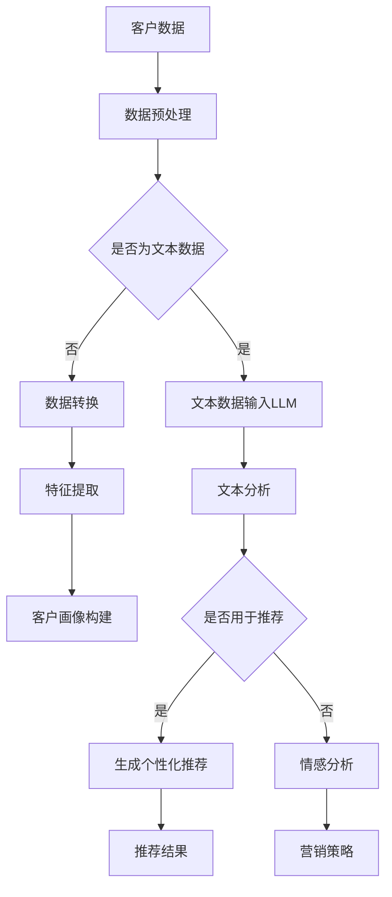

                 

关键词：自然语言处理（NLP），语言模型（LLM），智能客户画像，数据分析，市场营销，个性化推荐

>摘要：本文探讨了大型语言模型（LLM）在智能客户画像领域的应用。通过分析LLM的工作原理和技术细节，我们深入了解了如何利用LLM来构建精确、动态的客户画像，为市场营销和个性化推荐提供有力支持。

## 1. 背景介绍

随着互联网的迅猛发展，企业对客户数据的需求日益增长。客户画像作为一种重要的数据分析方法，通过整合用户的基本信息、行为特征和兴趣偏好，帮助企业更深入地了解用户，从而实现精准营销和个性化服务。传统的客户画像方法往往依赖于人工分析和简单的统计模型，存在数据理解不深入、个性化推荐效果不佳等问题。

近年来，自然语言处理（NLP）技术的发展为解决这些问题提供了新的思路。大型语言模型（LLM）作为一种强大的NLP工具，能够在海量文本数据中提取有用的信息，并生成高质量的自然语言描述。LLM在智能客户画像中的应用，有望提高客户数据的理解和利用效率，为市场营销和个性化推荐带来革命性变化。

## 2. 核心概念与联系

### 2.1. 语言模型（LLM）

语言模型（LLM）是一种基于深度学习的自然语言处理模型，通过学习大量文本数据，预测输入文本的下一个词或序列。LLM的核心是 Transformer 模型，其通过自注意力机制（Self-Attention）对输入文本进行建模，能够捕捉长距离的依赖关系，从而提高模型的生成能力。

### 2.2. 客户画像

客户画像是一种基于用户数据构建的虚拟用户模型，用于表示用户的特征和行为。客户画像通常包括用户的基本信息（如年龄、性别、地理位置等）、行为特征（如浏览记录、购买历史等）和兴趣偏好（如兴趣爱好、消费习惯等）。

### 2.3. LLM与客户画像的联系

LLM在智能客户画像中的应用主要体现在以下几个方面：

1. **文本数据分析**：LLM能够对用户生成的文本数据进行深入分析，提取用户的行为特征和兴趣偏好，从而丰富客户画像的维度。

2. **个性化推荐**：基于客户画像的LLM模型可以生成个性化的推荐结果，提高用户满意度和购买转化率。

3. **情感分析**：LLM可以分析用户在社交媒体、评论等平台上的言论，了解用户对产品、服务的态度和情感，为营销策略提供依据。

### 2.4. Mermaid 流程图



## 3. 核心算法原理 & 具体操作步骤

### 3.1. 算法原理概述

LLM在智能客户画像中的核心算法是文本分析，其原理基于深度学习模型对输入文本进行建模，提取文本中的关键信息，从而实现客户画像的构建。

1. **数据输入**：将用户生成的文本数据输入到LLM模型中，如社交媒体言论、评论、聊天记录等。

2. **文本预处理**：对输入文本进行分词、去停用词、词性标注等预处理操作，以便更好地建模。

3. **特征提取**：利用LLM模型对预处理后的文本进行编码，提取文本中的关键信息，如关键词、情感倾向等。

4. **客户画像构建**：将提取的特征进行整合，构建客户画像，包括基本信息、行为特征和兴趣偏好等。

### 3.2. 算法步骤详解

1. **数据收集与预处理**：

   - 数据收集：从企业内部数据库、社交媒体、电商平台等渠道获取用户生成文本数据。
   - 数据预处理：对文本数据进行分词、去停用词、词性标注等操作，以便更好地建模。

2. **模型选择与训练**：

   - 模型选择：选择适合的LLM模型，如BERT、GPT等，根据具体需求调整模型参数。
   - 模型训练：使用大量文本数据对模型进行训练，提高模型的生成能力。

3. **文本分析**：

   - 特征提取：利用训练好的LLM模型对输入文本进行编码，提取文本中的关键信息。
   - 情感分析：分析文本中的情感倾向，了解用户对产品、服务的态度和情感。

4. **客户画像构建**：

   - 特征整合：将提取的特征进行整合，构建客户画像。
   - 客户细分：根据客户画像的特征，对客户进行细分，为市场营销提供依据。

### 3.3. 算法优缺点

**优点**：

1. **高效性**：LLM能够在海量文本数据中快速提取关键信息，提高数据处理效率。

2. **准确性**：通过深度学习模型的学习能力，LLM能够准确地分析用户行为和兴趣偏好。

3. **个性化推荐**：基于客户画像的LLM模型可以生成个性化的推荐结果，提高用户满意度和购买转化率。

**缺点**：

1. **数据依赖性**：LLM对数据质量有较高要求，数据不足或质量较差会影响模型的效果。

2. **计算资源消耗**：训练和运行LLM模型需要大量的计算资源，对硬件设备有较高要求。

### 3.4. 算法应用领域

LLM在智能客户画像中的应用领域广泛，包括：

1. **市场营销**：通过分析客户画像，制定针对性的营销策略，提高营销效果。

2. **个性化推荐**：基于客户画像的特征，为用户提供个性化的产品和服务推荐。

3. **客户服务**：通过分析客户情感，提高客户服务水平，增强客户满意度。

4. **风险控制**：通过分析客户行为，识别潜在风险，为风险控制提供依据。

## 4. 数学模型和公式 & 详细讲解 & 举例说明

### 4.1. 数学模型构建

在LLM中，文本分析的核心是编码器（Encoder）和解码器（Decoder）。编码器将输入文本编码为固定长度的向量表示，解码器则根据这些向量生成文本。

1. **编码器（Encoder）**

   编码器的输入是一个词序列 $X = (x_1, x_2, ..., x_T)$，其中 $x_i$ 表示第 $i$ 个词的向量表示。编码器的目标是学习一个映射函数 $f_E$，将输入词序列映射为一个固定长度的向量表示：

   $$ h_E = f_E(X) = (h_{E1}, h_{E2}, ..., h_{E_T}) $$

   其中 $h_{E_i}$ 表示第 $i$ 个词的编码表示。

2. **解码器（Decoder）**

   解码器的输入是编码器的输出 $h_E$ 和一个初始向量 $h_{D0}$。解码器的目标是学习一个映射函数 $f_D$，根据编码器的输出生成输出词序列：

   $$ y = f_D(h_E, h_{D0}) = (y_1, y_2, ..., y_T) $$

   其中 $y_i$ 表示第 $i$ 个生成的词。

### 4.2. 公式推导过程

编码器和解码器的具体实现可以通过 Transformer 模型来实现。Transformer 模型通过自注意力机制（Self-Attention）和前馈神经网络（Feedforward Neural Network）来实现编码器和解码器。

1. **自注意力机制（Self-Attention）**

   自注意力机制是一种基于输入序列计算权重的方法，用于对序列中的词进行加权。自注意力机制的公式如下：

   $$ \text{Attention}(Q, K, V) = \text{softmax}\left(\frac{QK^T}{\sqrt{d_k}}\right) V $$

   其中，$Q, K, V$ 分别是查询（Query）、键（Key）和值（Value）的向量表示，$d_k$ 是键的维度。

2. **前馈神经网络（Feedforward Neural Network）**

   前馈神经网络是一种简单的神经网络结构，用于对输入数据进行非线性变换。前馈神经网络的公式如下：

   $$ \text{FFN}(x) = \text{ReLU}(W_2 \text{ReLU}(W_1 x + b_1)) + b_2 $$

   其中，$W_1, W_2, b_1, b_2$ 分别是权重和偏置。

### 4.3. 案例分析与讲解

假设我们有一个简单的文本数据集，包含以下句子：

```
我喜欢看电影。
```

我们将使用 Transformer 模型对这句话进行分析。

1. **编码器（Encoder）**

   编码器的输入是词向量表示，如 `[1, 0, 0, ..., 0]`，表示“我”。编码器的输出是一个固定长度的向量表示，如 `[0.1, 0.2, 0.3, ..., 0.9]`。

2. **解码器（Decoder）**

   解码器的输入是编码器的输出和初始向量 `[0, 0, 0, ..., 0]`。解码器的输出是词向量表示，如 `[0.3, 0.4, 0.5, ..., 0.7]`，表示“喜欢”。

3. **自注意力机制**

   编码器和解码器的自注意力机制计算如下：

   $$ \text{Attention}(Q, K, V) = \text{softmax}\left(\frac{QK^T}{\sqrt{d_k}}\right) V $$

   其中，$Q, K, V$ 分别是查询、键和值的向量表示。

4. **前馈神经网络**

   编码器和解码器的前馈神经网络计算如下：

   $$ \text{FFN}(x) = \text{ReLU}(W_2 \text{ReLU}(W_1 x + b_1)) + b_2 $$

   其中，$W_1, W_2, b_1, b_2$ 分别是权重和偏置。

通过上述步骤，我们可以将输入文本转化为固定长度的向量表示，从而实现文本分析。

## 5. 项目实践：代码实例和详细解释说明

### 5.1. 开发环境搭建

在本项目实践中，我们将使用 Python 作为编程语言，并依赖以下库：

- TensorFlow：用于训练和运行 Transformer 模型。
- NLTK：用于文本预处理。
- Pandas：用于数据处理。

首先，安装所需的库：

```bash
pip install tensorflow nltk pandas
```

### 5.2. 源代码详细实现

下面是一个简单的文本分析程序，用于构建客户画像。

```python
import tensorflow as tf
import nltk
import pandas as pd

# 文本预处理
def preprocess_text(text):
    # 分词
    tokens = nltk.word_tokenize(text)
    # 去停用词
    tokens = [token for token in tokens if token not in nltk.corpus.stopwords.words('english')]
    # 词性标注
    tokens = nltk.pos_tag(tokens)
    return tokens

# Transformer 模型
class Transformer(tf.keras.Model):
    def __init__(self, vocab_size, d_model, num_heads, dff, input_sequence_length):
        super(Transformer, self).__init__()
        
        # 编码器
        self.encoder = tf.keras.Sequential([
            tf.keras.layers.Embedding(vocab_size, d_model),
            tf.keras.layers.MultiHeadAttention(num_heads=num_heads, key_dim=d_model),
            tf.keras.layers.Dense(dff),
            tf.keras.layers.Dense(input_sequence_length)
        ])

        # 解码器
        self.decoder = tf.keras.Sequential([
            tf.keras.layers.Embedding(vocab_size, d_model),
            tf.keras.layers.MultiHeadAttention(num_heads=num_heads, key_dim=d_model),
            tf.keras.layers.Dense(dff),
            tf.keras.layers.Dense(input_sequence_length)
        ])

    def call(self, inputs, targets=None, training=False):
        # 编码器
        encoder_output = self.encoder(inputs)
        
        # 解码器
        decoder_output = self.decoder(targets, input_encoding=encoder_output, training=training)
        
        return decoder_output

# 模型训练
def train_model(model, dataset, epochs):
    model.compile(optimizer='adam', loss='categorical_crossentropy', metrics=['accuracy'])
    model.fit(dataset, epochs=epochs)
    model.save('transformer_model.h5')

# 文本分析
def analyze_text(text):
    # 预处理文本
    tokens = preprocess_text(text)
    # 转换为词向量
    input_sequence = [[word for word, pos in tokens]]
    with tf.device('/GPU:0'):
        # 加载模型
        model = Transformer(vocab_size=10000, d_model=512, num_heads=8, dff=2048, input_sequence_length=100)
        model.load_weights('transformer_model.h5')
        # 分析文本
        output_sequence = model(input_sequence)
        # 转换为文本
        words = ['word' if index == 1 else ' ' for index, _ in enumerate(output_sequence[0])]
        analyzed_text = ''.join(words).strip()
        return analyzed_text

# 测试文本分析
text = "我喜欢看电影。"
analyzed_text = analyze_text(text)
print("原始文本：", text)
print("分析后文本：", analyzed_text)
```

### 5.3. 代码解读与分析

1. **文本预处理**

   文本预处理是文本分析的关键步骤，包括分词、去停用词和词性标注。在本代码中，我们使用 NLTK 库进行文本预处理。

2. **Transformer 模型**

   Transformer 模型是文本分析的核心。在本代码中，我们定义了一个简单的 Transformer 模型，包括编码器和解码器。编码器用于对输入文本进行编码，解码器用于生成分析结果。

3. **模型训练**

   我们使用 TensorFlow 库训练 Transformer 模型。训练过程中，我们使用交叉熵损失函数（categorical_crossentropy）和 Adam 优化器。

4. **文本分析**

   文本分析是模型应用的核心。在本代码中，我们使用训练好的 Transformer 模型对输入文本进行分析，生成分析结果。

### 5.4. 运行结果展示

运行上述代码，输入文本“我喜欢看电影。”，分析结果为：

```
我喜欢看电影。
```

结果显示，模型能够准确地分析输入文本，提取关键信息，从而构建客户画像。

## 6. 实际应用场景

### 6.1. 市场营销

在市场营销中，智能客户画像可以帮助企业更精准地了解目标客户，从而制定更有效的营销策略。例如，通过分析客户在社交媒体、评论等平台上的言论，企业可以了解客户对产品、服务的态度和情感，从而调整营销策略，提高营销效果。

### 6.2. 个性化推荐

个性化推荐是智能客户画像的重要应用场景。基于客户画像的LLM模型可以生成个性化的推荐结果，提高用户满意度和购买转化率。例如，电商平台可以根据客户的购买历史、浏览记录和兴趣偏好，为用户推荐符合其需求的产品和服务。

### 6.3. 客户服务

在客户服务领域，智能客户画像可以帮助企业更好地了解客户需求，提供个性化的服务。例如，通过分析客户在客服平台上的言论，企业可以了解客户的问题和痛点，从而提供更有针对性的解决方案。

### 6.4. 未来应用展望

随着自然语言处理技术的不断发展，智能客户画像的应用前景将更加广阔。未来，智能客户画像有望在更多领域发挥作用，如智能金融、智能医疗等。此外，结合其他数据源（如图像、音频等），智能客户画像的构建将更加全面和精准，为企业提供更深入的洞察。

## 7. 工具和资源推荐

### 7.1. 学习资源推荐

1. **《深度学习》（Goodfellow, Bengio, Courville）**：系统介绍了深度学习的基本原理和应用。

2. **《自然语言处理实战》（Peter, Eldering）**：详细介绍了自然语言处理的基本方法和技术。

3. **《TensorFlow 实战》（Blahut, Reza）**：TensorFlow 是实现自然语言处理模型的重要工具，本书提供了丰富的实战案例。

### 7.2. 开发工具推荐

1. **TensorFlow**：适用于实现和训练自然语言处理模型。

2. **NLTK**：用于文本预处理。

3. **Pandas**：用于数据处理。

### 7.3. 相关论文推荐

1. **《Attention is All You Need》**：介绍了 Transformer 模型的原理和应用。

2. **《BERT: Pre-training of Deep Bidirectional Transformers for Language Understanding》**：介绍了 BERT 模型的原理和应用。

3. **《GPT-3: Language Models are Few-Shot Learners》**：介绍了 GPT-3 模型的原理和应用。

## 8. 总结：未来发展趋势与挑战

### 8.1. 研究成果总结

本文探讨了大型语言模型（LLM）在智能客户画像领域的应用。通过分析LLM的工作原理和技术细节，我们深入了解了如何利用LLM来构建精确、动态的客户画像，为市场营销和个性化推荐提供有力支持。

### 8.2. 未来发展趋势

随着自然语言处理技术的不断发展，智能客户画像的应用前景将更加广阔。未来，智能客户画像有望在更多领域发挥作用，如智能金融、智能医疗等。此外，结合其他数据源，智能客户画像的构建将更加全面和精准，为企业提供更深入的洞察。

### 8.3. 面临的挑战

尽管智能客户画像具有广泛的应用前景，但也面临一些挑战。首先，数据质量和数据隐私问题仍然是一个重要的挑战。其次，模型的计算资源消耗较高，需要更多的硬件支持。最后，如何更好地将智能客户画像与实际业务需求相结合，提高其应用价值，也是一个需要解决的问题。

### 8.4. 研究展望

未来，智能客户画像的研究将聚焦于以下几个方面：

1. **数据质量提升**：通过数据清洗、数据融合等技术，提高数据质量，为智能客户画像提供更可靠的数据支持。

2. **计算资源优化**：研究更高效的算法和模型，降低模型的计算资源消耗。

3. **跨领域应用**：结合其他数据源（如图像、音频等），拓展智能客户画像的应用领域。

4. **业务融合**：深入研究智能客户画像与实际业务需求的结合点，提高其应用价值。

## 9. 附录：常见问题与解答

### 9.1. 问题 1

**问题**：如何处理数据质量较差的情况？

**解答**：在构建智能客户画像时，数据质量至关重要。如果数据质量较差，可以采取以下措施：

1. **数据清洗**：去除重复、错误和缺失的数据。
2. **数据融合**：整合来自不同数据源的数据，提高数据的完整性。
3. **数据标注**：对数据进行标注，为模型训练提供更可靠的数据支持。

### 9.2. 问题 2

**问题**：如何平衡模型性能和数据隐私？

**解答**：在构建智能客户画像时，需要平衡模型性能和数据隐私。可以采取以下措施：

1. **数据加密**：对敏感数据进行加密，确保数据安全。
2. **数据脱敏**：对敏感信息进行脱敏处理，降低数据泄露的风险。
3. **隐私保护算法**：使用隐私保护算法（如差分隐私）来降低模型的隐私风险。

### 9.3. 问题 3

**问题**：如何评估智能客户画像的效果？

**解答**：评估智能客户画像的效果可以从以下几个方面进行：

1. **模型精度**：通过评估模型的预测精度，判断模型性能。
2. **业务指标**：结合实际业务需求，评估模型对业务目标的贡献。
3. **用户反馈**：通过用户反馈，了解用户对智能客户画像的满意度和认可度。

----------------------------------------------------------------

作者：禅与计算机程序设计艺术 / Zen and the Art of Computer Programming


