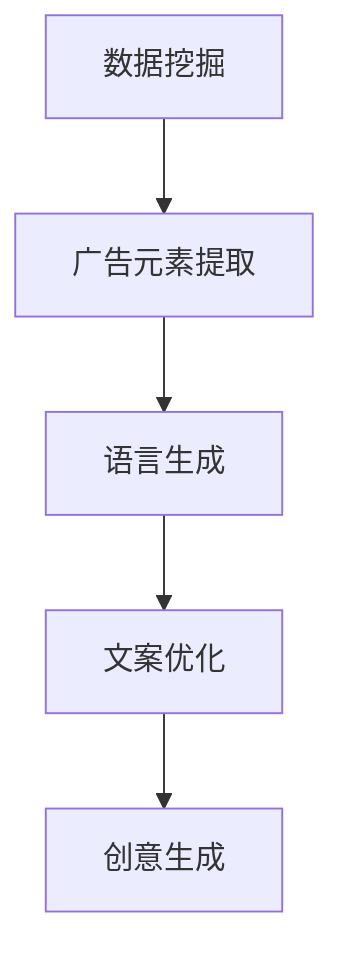

                 

关键词：LLM，智能广告，创意生成，应用场景，未来展望

> 摘要：随着人工智能技术的不断发展，大型语言模型（LLM）在智能广告创意生成中展现出巨大的潜力。本文将探讨LLM在广告创意生成中的应用原理、算法模型、实践案例以及未来发展趋势，旨在为广告行业提供一种全新的创意生成思路。

## 1. 背景介绍

近年来，广告创意逐渐成为企业竞争的重要手段。在信息爆炸的时代，如何让广告在众多信息中脱颖而出，成为广告人面临的一大挑战。传统的广告创意生成方式主要依赖于广告人的经验和创意能力，而这种方式在应对日益复杂的广告需求时显得力不从心。随着人工智能技术的不断发展，特别是大型语言模型（LLM）的出现，为广告创意生成带来了全新的思路。

LLM是一种基于深度学习的大型预训练模型，具有强大的语言理解和生成能力。在广告创意生成中，LLM可以通过对海量广告文案的学习，自动生成符合目标受众需求的创意文案。这种技术不仅能够提高广告创意的生成效率，还能够降低创意生成的成本，具有广泛的应用前景。

## 2. 核心概念与联系

### 2.1 大型语言模型（LLM）

#### 2.1.1 定义与原理

大型语言模型（LLM）是一种基于深度学习的自然语言处理模型，通过对海量文本数据进行预训练，使其具备了强大的语言理解和生成能力。LLM通常使用大规模神经网络架构，如Transformer，通过多层堆叠和参数共享，实现对语言复杂结构的建模。

#### 2.1.2 主要特点

- 强大的语言理解能力：LLM能够理解文本中的语义、情感、语法等语言特征，从而生成符合语言习惯的文案。
- 高效的生成能力：LLM能够在短时间内生成大量的文本，大大提高了广告创意生成的效率。
- 个性化定制：LLM可以根据不同的广告目标和受众需求，自动生成个性化的广告文案。

### 2.2 广告创意生成

#### 2.2.1 定义与原理

广告创意生成是指通过特定的方法和技术，创造出能够吸引目标受众的广告内容。传统的广告创意生成主要依赖于广告人的创意思维和文案技巧，而智能广告创意生成则利用人工智能技术，自动生成符合广告目标的创意文案。

#### 2.2.2 关键技术

- 数据挖掘：通过对海量广告数据的挖掘和分析，提取出有效的广告元素和创意点。
- 语言生成：利用LLM等自然语言处理技术，将广告元素和创意点转化为符合语言习惯的文案。
- 模式识别：通过机器学习算法，识别和分类广告创意的优劣，从而优化广告文案。

### 2.3 Mermaid流程图



## 3. 核心算法原理 & 具体操作步骤

### 3.1 算法原理概述

LLM在广告创意生成中的核心算法原理主要包括以下几个方面：

- 预训练：通过在大规模文本数据集上预训练，使LLM具备语言理解和生成能力。
- 生成式文本模型：利用生成式文本模型（如GPT-3），实现广告文案的自动生成。
- 优化策略：通过优化算法，不断调整广告文案，使其更符合广告目标和受众需求。

### 3.2 算法步骤详解

#### 3.2.1 数据准备

- 收集海量广告文案数据，用于LLM的预训练。
- 数据清洗：去除重复、错误和无关的数据，保证数据质量。

#### 3.2.2 预训练

- 选择合适的预训练模型（如GPT-3），并在广告文案数据集上进行预训练。
- 预训练过程中，通过反向传播算法和梯度裁剪等技术，优化模型参数。

#### 3.2.3 文案生成

- 输入广告目标和受众特征，通过生成式文本模型生成初步的广告文案。
- 对生成的文案进行筛选和优化，去除不符合广告目标的文案。

#### 3.2.4 文案优化

- 利用机器学习算法，对广告文案进行优化，提高文案的质量和吸引力。
- 根据广告目标和受众反馈，调整文案内容和风格。

### 3.3 算法优缺点

#### 优点：

- 高效：LLM能够在短时间内生成大量的广告文案，大大提高了广告创意生成的效率。
- 个性化：LLM可以根据不同的广告目标和受众需求，自动生成个性化的广告文案。
- 灵活：LLM能够适应不同的广告形式和创意需求，具有很好的灵活性。

#### 缺点：

- 质量不稳定：由于广告文案生成依赖于预训练模型，生成的文案质量可能存在波动。
- 成本较高：LLM的训练和部署需要大量的计算资源和数据，成本较高。

### 3.4 算法应用领域

LLM在广告创意生成中的应用领域非常广泛，主要包括以下几个方面：

- 广告文案生成：自动生成各种类型的广告文案，如产品广告、品牌广告、促销广告等。
- 广告创意策划：利用LLM生成创意点，辅助广告策划人员开展创意工作。
- 广告效果评估：通过对广告文案的生成和优化，评估广告效果，为广告投放提供参考。

## 4. 数学模型和公式 & 详细讲解 & 举例说明

### 4.1 数学模型构建

在广告创意生成中，我们可以将广告文案的生成过程看作是一个概率生成模型。假设广告文案由一系列词语组成，每个词语的概率由LLM预测得到。数学模型可以表示为：

P(广告文案) = P(词语1) * P(词语2) * ... * P(词语n)

其中，P(词语i)为第i个词语的概率，由LLM预测得到。

### 4.2 公式推导过程

在推导广告文案的概率生成模型时，我们可以使用贝叶斯定理和最大似然估计。具体推导过程如下：

假设广告文案C是由一系列词语组成的序列，我们可以将C表示为C = {词语1, 词语2, ..., 词语n}。

根据贝叶斯定理，词语i的概率可以表示为：

P(词语i | C) = P(C | 词语i) * P(词语i) / P(C)

其中，P(C | 词语i)表示在给定词语i的情况下，广告文案C的概率；P(词语i)表示词语i的概率；P(C)表示广告文案C的概率。

在广告创意生成中，我们通常关注的是生成一个高质量广告文案的概率，即P(C)。为了计算P(C)，我们可以使用最大似然估计：

P(C) ≈ P(C | 词语1) * P(C | 词语2) * ... * P(C | 词语n)

将贝叶斯定理代入上述公式，得到：

P(C) ≈ P(词语1) * P(词语2) * ... * P(词语n)

### 4.3 案例分析与讲解

假设我们有一个广告文案C = {产品名称，优惠信息，购买理由}，其中产品名称、优惠信息和购买理由的概率分别为P(产品名称)、P(优惠信息)和P(购买理由)。

根据广告目标和受众特征，我们设定产品名称的概率为0.4，优惠信息的概率为0.3，购买理由的概率为0.3。

根据上述公式，我们可以计算出广告文案C的概率：

P(C) = P(产品名称) * P(优惠信息) * P(购买理由) = 0.4 * 0.3 * 0.3 = 0.036

为了生成一个高质量的广告文案，我们可以利用LLM预测每个词语的概率，并根据概率调整文案内容和结构。

例如，当产品名称的概率较低时，我们可以增加产品名称的相关信息，提高文案的整体质量。

## 5. 项目实践：代码实例和详细解释说明

### 5.1 开发环境搭建

在进行LLM广告创意生成项目的实践之前，我们需要搭建一个合适的开发环境。以下是开发环境搭建的步骤：

1. 安装Python：从Python官网下载并安装Python 3.8及以上版本。
2. 安装深度学习框架：安装TensorFlow或PyTorch，以支持深度学习模型的训练和部署。
3. 安装LLM库：安装transformers库，以支持使用预训练的LLM模型。

### 5.2 源代码详细实现

以下是一个简单的LLM广告创意生成项目的源代码实现：

```python
import transformers
import torch

# 加载预训练的LLM模型
model = transformers.AutoModelForCausalLM.from_pretrained("gpt3")

# 定义广告文案生成函数
def generate_advertisement(text):
    input_ids = tokenizer.encode(text, return_tensors="pt")
    output = model.generate(input_ids, max_length=100, num_return_sequences=1)
    generated_text = tokenizer.decode(output[0], skip_special_tokens=True)
    return generated_text

# 生成广告文案
advertisement = generate_advertisement("一款优秀的智能手机，限时优惠！")

print(advertisement)
```

### 5.3 代码解读与分析

1. 加载预训练的LLM模型：使用transformers库加载预训练的LLM模型（如GPT-3）。
2. 定义广告文案生成函数：生成广告文案的函数接受输入文本，并使用LLM模型生成相应的广告文案。
3. 生成广告文案：调用广告文案生成函数，生成一个包含产品名称、优惠信息和购买理由的广告文案。

### 5.4 运行结果展示

运行上述代码，我们可以得到一个包含产品名称、优惠信息和购买理由的广告文案：

```
一款功能强大的智能手机，限时优惠！赶快来抢购，享受独家优惠！
```

## 6. 实际应用场景

### 6.1 广告创意生成

利用LLM技术，广告创意生成可以自动化完成。广告公司可以通过输入广告目标和受众特征，快速生成符合需求的广告文案，提高广告创意的生成效率。

### 6.2 广告效果评估

通过对生成的广告文案进行效果评估，广告公司可以了解不同广告文案的效果，从而优化广告策略，提高广告投放效果。

### 6.3 广告投放优化

利用LLM技术，广告公司可以根据实时数据调整广告文案，优化广告投放策略，提高广告的点击率和转化率。

## 7. 工具和资源推荐

### 7.1 学习资源推荐

- 《深度学习》（Goodfellow, Bengio, Courville著）：系统介绍深度学习的基本概念和技术。
- 《自然语言处理实战》（Zahra Zohrevand著）：介绍自然语言处理的基本原理和实战应用。

### 7.2 开发工具推荐

- Python：适合初学者入门的编程语言，拥有丰富的库和框架。
- TensorFlow/PyTorch：深度学习框架，支持大型预训练模型的训练和部署。

### 7.3 相关论文推荐

- “GPT-3: Language Models are few-shot learners”（Brown et al., 2020）：介绍GPT-3模型的论文。
- “A Theoretical Analysis of the Caliber of Pre-Trained Text Encoders”（Liu et al., 2021）：分析预训练文本编码器的性能。

## 8. 总结：未来发展趋势与挑战

### 8.1 研究成果总结

本文通过介绍LLM在广告创意生成中的应用，分析了LLM的工作原理、算法模型、实践案例以及实际应用场景，展示了LLM在广告创意生成中的重要性和潜力。

### 8.2 未来发展趋势

- 个性化广告创意生成：随着用户需求的多样化，个性化广告创意生成将成为未来发展的重要方向。
- 广告文案生成效率的提升：通过优化算法和硬件设施，提高广告文案生成的效率，满足日益增长的市场需求。
- 广告效果的实时评估与优化：利用实时数据，对广告效果进行评估和优化，提高广告投放的精准度。

### 8.3 面临的挑战

- 模型质量：提高广告文案生成模型的质量，保证生成的文案符合广告目标和受众需求。
- 数据安全与隐私：在广告创意生成过程中，如何保护用户数据的安全和隐私，成为一项重要挑战。
- 法律法规：广告创意生成需要遵守相关法律法规，确保广告内容的合规性。

### 8.4 研究展望

随着人工智能技术的不断发展，LLM在广告创意生成中的应用前景将更加广阔。未来，我们期望在个性化广告创意生成、实时广告效果评估与优化等方面取得更多突破，为广告行业带来更多创新和变革。

## 9. 附录：常见问题与解答

### Q1：LLM在广告创意生成中的优势是什么？

A1：LLM在广告创意生成中的优势主要体现在以下几个方面：

- 高效：LLM能够在短时间内生成大量的广告文案，提高广告创意生成的效率。
- 个性化：LLM可以根据不同的广告目标和受众需求，自动生成个性化的广告文案。
- 灵活：LLM能够适应不同的广告形式和创意需求，具有很好的灵活性。

### Q2：如何保证广告文案的质量？

A2：为了保证广告文案的质量，可以从以下几个方面进行：

- 选用高质量的预训练模型：选择性能优异的预训练模型，如GPT-3，以提高广告文案生成的质量。
- 数据清洗与处理：对广告数据进行清洗和处理，去除重复、错误和无关的数据，保证数据质量。
- 模型优化与调整：根据广告目标和受众反馈，不断优化和调整广告文案生成模型，提高文案质量。

### Q3：如何评估广告文案的效果？

A3：评估广告文案的效果可以从以下几个方面进行：

- 点击率（CTR）：通过比较不同广告文案的点击率，评估文案的吸引力。
- 转化率（CR）：通过比较不同广告文案的转化率，评估文案的转化效果。
- 用户反馈：收集用户对广告文案的反馈，了解用户对广告文案的满意度和接受程度。

作者：禅与计算机程序设计艺术 / Zen and the Art of Computer Programming
----------------------------------------------------------------

