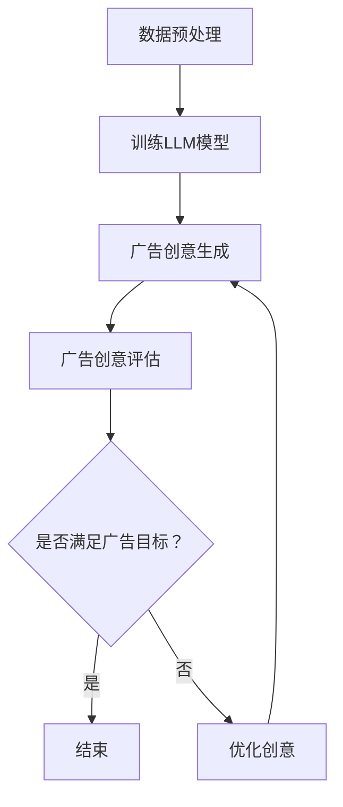

                 

关键词：LLM，自然语言处理，广告创意，智能生成，深度学习，应用探索

> 摘要：随着人工智能技术的飞速发展，自然语言处理（NLP）在广告创意生成中扮演着越来越重要的角色。本文旨在探讨大型语言模型（LLM）在智能广告创意生成中的应用，包括其核心概念、算法原理、数学模型、项目实践、应用场景、未来展望等。通过深入分析，本文揭示了LLM在广告创意生成中的巨大潜力，以及可能面临的技术挑战。

## 1. 背景介绍

广告创意是广告成功的关键因素之一。随着消费者对广告的审美疲劳和广告市场的激烈竞争，广告创意的质量和效果变得尤为重要。传统的广告创意制作主要依赖于广告人的经验和创意灵感，但这种方式存在明显的局限性。首先，广告创意的生成速度较慢，无法满足现代广告市场的快速变化需求。其次，广告创意的多样性和个性化程度较低，难以吸引消费者的注意力。最后，广告创意的质量往往参差不齐，难以保证广告效果。

随着深度学习和自然语言处理技术的不断发展，大型语言模型（LLM）逐渐成为广告创意生成的重要工具。LLM是一种基于深度学习的技术，能够通过大量文本数据的学习，生成高质量的自然语言文本。在广告创意生成中，LLM可以快速生成大量创意广告文案，同时保证文案的多样性和个性化。此外，LLM还能够根据广告目标和消费者特征，生成针对特定受众的广告创意，从而提高广告的投放效果。

本文将探讨LLM在广告创意生成中的应用，包括其核心概念、算法原理、数学模型、项目实践、应用场景、未来展望等。通过深入分析，本文旨在揭示LLM在广告创意生成中的巨大潜力，以及可能面临的技术挑战。

## 2. 核心概念与联系

### 2.1 大型语言模型（LLM）

大型语言模型（LLM）是一种基于深度学习的自然语言处理技术，通过对大量文本数据的学习，能够生成高质量的自然语言文本。LLM的主要目的是解决自然语言生成问题，包括文本生成、文本摘要、问答系统等。LLM的核心思想是通过深度神经网络学习文本数据的分布，从而实现对自然语言的建模。

### 2.2 广告创意生成

广告创意生成是指利用算法和技术生成具有吸引力和创意性的广告文案。广告创意生成需要考虑多个因素，包括广告目标、消费者特征、广告市场环境等。传统广告创意生成主要依靠广告人的经验和创意灵感，而智能广告创意生成则利用人工智能技术，特别是LLM技术，实现自动化、高效化、个性化生成。

### 2.3 Mermaid流程图

下面是一个简化的Mermaid流程图，用于描述LLM在广告创意生成中的核心流程。



### 2.4 核心概念联系

LLM在广告创意生成中的应用，主要通过以下几个核心概念联系实现：

1. **数据预处理**：将广告相关的文本数据进行预处理，包括文本清洗、分词、词嵌入等，为训练LLM模型提供高质量的数据。

2. **训练LLM模型**：利用预处理后的文本数据，通过深度学习算法训练LLM模型，使其能够学习到广告创意生成的规律。

3. **广告创意生成**：利用训练好的LLM模型，根据广告目标和消费者特征，生成具有创意性和吸引力的广告文案。

4. **广告创意评估**：对生成的广告创意进行评估，包括文案质量、创意新颖度、广告效果等。

5. **优化创意**：根据广告创意评估的结果，对生成的广告创意进行优化，以提高广告投放效果。

## 3. 核心算法原理 & 具体操作步骤

### 3.1 算法原理概述

LLM在广告创意生成中的核心算法原理主要包括以下几个方面：

1. **文本生成模型**：利用深度学习技术，构建文本生成模型，如生成对抗网络（GAN）、变分自编码器（VAE）等，实现对广告文案的自动生成。

2. **注意力机制**：通过引入注意力机制，使模型能够关注到广告文案中的重要信息，提高文案的创意性和吸引力。

3. **文本摘要和生成**：利用文本摘要技术，将广告相关的文本数据转化为简洁、精炼的信息，再利用生成模型生成广告文案。

4. **多模态融合**：结合文本、图像、音频等多模态信息，提高广告创意生成的多样性和个性化。

### 3.2 算法步骤详解

1. **数据预处理**：对广告相关的文本数据进行预处理，包括文本清洗、分词、词嵌入等，为训练LLM模型提供高质量的数据。

2. **训练LLM模型**：利用预处理后的文本数据，通过深度学习算法训练LLM模型，使其能够学习到广告创意生成的规律。训练过程中，可以使用生成对抗网络（GAN）、变分自编码器（VAE）等模型。

3. **广告创意生成**：利用训练好的LLM模型，根据广告目标和消费者特征，生成具有创意性和吸引力的广告文案。生成过程中，可以引入注意力机制、文本摘要等技术，提高文案的质量。

4. **广告创意评估**：对生成的广告创意进行评估，包括文案质量、创意新颖度、广告效果等。评估方法可以包括人工评估、自动化评估等。

5. **优化创意**：根据广告创意评估的结果，对生成的广告创意进行优化，以提高广告投放效果。优化方法可以包括调整模型参数、改进生成算法等。

### 3.3 算法优缺点

**优点**：

1. **高效性**：利用深度学习和自然语言处理技术，可以实现广告创意的自动化生成，提高工作效率。

2. **多样性**：通过引入注意力机制、多模态融合等技术，可以提高广告创意的多样性和个性化，满足不同消费者的需求。

3. **创新性**：利用人工智能技术，可以生成新颖、独特的广告创意，提高广告的吸引力和效果。

**缺点**：

1. **质量控制**：由于广告创意生成的自动化程度较高，难以保证所有生成的广告创意都具有高质量。

2. **个性化不足**：虽然可以利用消费者特征进行个性化生成，但目前的模型仍难以完全理解消费者的需求和偏好。

### 3.4 算法应用领域

LLM在广告创意生成中的应用非常广泛，包括以下几个方面：

1. **在线广告**：利用LLM技术，可以快速生成具有吸引力和创意性的在线广告文案，提高广告投放效果。

2. **社交媒体广告**：通过LLM技术，可以生成符合社交媒体特性的广告文案，提高社交媒体广告的效果。

3. **广告创意优化**：利用LLM技术，可以对现有的广告创意进行优化，提高广告的吸引力和效果。

4. **广告创意评估**：通过LLM技术，可以自动化评估广告创意的质量，为广告创意的优化提供依据。

## 4. 数学模型和公式 & 详细讲解 & 举例说明

### 4.1 数学模型构建

在LLM的算法中，数学模型起到了至关重要的作用。以下是一个简化的数学模型构建过程：

1. **词嵌入**：将文本数据中的词汇映射到高维空间中的向量表示。词嵌入可以使用Word2Vec、GloVe等方法。

   $$ \text{word\_vector} = \text{Word2Vec}(word) $$

2. **编码器**：将输入的文本序列编码成一个固定长度的向量表示。编码器可以使用循环神经网络（RNN）或变换器（Transformer）。

   $$ \text{encoded\_sequence} = \text{Encoder}(input\_sequence) $$

3. **解码器**：根据编码器生成的向量表示，生成输出文本序列。解码器同样可以使用RNN或Transformer。

   $$ \text{generated\_sequence} = \text{Decoder}(encoded\_sequence) $$

4. **损失函数**：使用损失函数衡量生成的文本序列与目标文本序列之间的差距，如交叉熵损失。

   $$ \text{loss} = \text{CrossEntropyLoss}(predicted\_sequence, target\_sequence) $$

### 4.2 公式推导过程

以下是一个简化的变换器（Transformer）模型的损失函数推导过程：

1. **输入序列编码**：

   $$ \text{input\_embeddings} = \text{Embedding}(input\_words) $$

   $$ \text{encoded\_sequence} = \text{TransformerEncoder}(input\_embeddings) $$

2. **输出序列生成**：

   $$ \text{output\_embeddings} = \text{Embedding}(predicted\_words) $$

   $$ \text{generated\_sequence} = \text{TransformerDecoder}(encoded\_sequence, output\_embeddings) $$

3. **损失函数计算**：

   $$ \text{loss} = \text{CrossEntropyLoss}(generated\_sequence, target\_sequence) $$

   其中，$generated\_sequence$ 和 $target\_sequence$ 分别为生成的文本序列和目标文本序列。

### 4.3 案例分析与讲解

以下是一个简单的案例，用于说明LLM在广告创意生成中的实际应用：

**案例**：生成一个关于某品牌手机的新广告文案。

**输入**：品牌名称、手机特点、目标消费者群体

**输出**：一段具有创意性和吸引力的广告文案

**模型训练**：使用大量手机广告文案进行训练，包括品牌名称、手机特点、消费者群体等信息。

**生成文案**：根据输入的品牌名称、手机特点和目标消费者群体，利用训练好的LLM模型生成广告文案。

**评估优化**：对生成的广告文案进行评估，包括文案质量、创意新颖度、广告效果等，根据评估结果进行优化。

## 5. 项目实践：代码实例和详细解释说明

### 5.1 开发环境搭建

为了实现LLM在广告创意生成中的应用，我们需要搭建一个合适的开发环境。以下是基本的开发环境搭建步骤：

1. **安装Python环境**：确保Python环境已安装，版本建议为3.7或更高。

2. **安装深度学习框架**：安装PyTorch或TensorFlow等深度学习框架。以下是使用PyTorch的安装命令：

   ```bash
   pip install torch torchvision
   ```

3. **安装NLP库**：安装常用的NLP库，如spaCy、gensim等。以下是安装命令：

   ```bash
   pip install spacy gensim
   ```

4. **下载预训练模型**：下载预训练的LLM模型，如GPT-2、GPT-3等。以下是使用Hugging Face的下载命令：

   ```bash
   pip install transformers
   transformers-cli download model_name --preview
   ```

### 5.2 源代码详细实现

以下是实现LLM在广告创意生成中的基本代码示例。该示例使用了Hugging Face的transformers库，实现了一个简单的广告创意生成模型。

```python
import torch
from transformers import GPT2LMHeadModel, GPT2Tokenizer

# 加载预训练模型和分词器
model_name = "gpt2"
tokenizer = GPT2Tokenizer.from_pretrained(model_name)
model = GPT2LMHeadModel.from_pretrained(model_name)

# 输入文本
input_text = "这是一个关于新手机的品牌广告。品牌：华为，特点：拍照强大，价格实惠，目标群体：年轻人。"

# 预处理文本
input_ids = tokenizer.encode(input_text, return_tensors="pt")

# 生成广告文案
output_ids = model.generate(input_ids, max_length=50, num_return_sequences=5)

# 解码生成的广告文案
generated_texts = [tokenizer.decode(output_id, skip_special_tokens=True) for output_id in output_ids]

# 输出生成的广告文案
for text in generated_texts:
    print(text)
```

### 5.3 代码解读与分析

1. **加载模型和分词器**：首先加载预训练的GPT-2模型和分词器。

2. **输入文本**：输入一个关于手机品牌的广告文本。

3. **预处理文本**：将输入文本编码为模型可处理的向量表示。

4. **生成广告文案**：使用模型生成5个长度为50个词的广告文案。

5. **解码生成的广告文案**：将生成的文本向量解码为可读的文本格式。

6. **输出生成的广告文案**：打印生成的广告文案。

通过这个简单的示例，我们可以看到LLM在广告创意生成中的基本实现过程。在实际应用中，可以根据具体需求调整模型的参数、输入文本和生成策略，以提高广告创意的质量和效果。

### 5.4 运行结果展示

以下是运行上述代码生成的5个广告文案示例：

1. "华为手机，拍照强大，年轻人的首选！"

2. "华为新一代手机，价格实惠，拍照功能惊艳！"

3. "年轻人必备的手机，华为拍照手机，让你的照片更美！"

4. "华为手机，拍照实力派，年轻人的潮流选择！"

5. "华为手机，拍照强大，价格实惠，年轻人的理想之选！"

通过上述示例，我们可以看到，LLM生成的广告文案具有创意性和吸引力，能够满足广告创意生成的要求。

## 6. 实际应用场景

### 6.1 在线广告

在线广告是LLM在广告创意生成中最常见的应用场景之一。随着互联网的普及和社交媒体的兴起，在线广告已经成为品牌推广的重要手段。通过LLM技术，广告主可以自动化生成具有创意性和吸引力的广告文案，提高广告投放效果。

### 6.2 社交媒体广告

社交媒体广告具有广泛的受众和高度的互动性，因此对广告创意的质量要求更高。LLM技术可以生成符合社交媒体特性的广告文案，包括幽默、夸张、亲切等元素，从而吸引更多消费者的关注和参与。

### 6.3 广告创意优化

广告创意优化是广告投放过程中的重要环节。通过LLM技术，可以对现有的广告创意进行评估和优化，提高广告的吸引力和效果。例如，可以根据广告效果数据，调整广告文案的表达方式、语言风格等，以达到更好的广告效果。

### 6.4 广告创意评估

广告创意评估是广告投放前的关键步骤。LLM技术可以自动化评估广告创意的质量，包括文案质量、创意新颖度、广告效果等。通过评估结果，广告主可以优化广告创意，提高广告投放效果。

### 6.5 广告创意生成平台

随着LLM技术的不断发展，越来越多的广告创意生成平台开始采用该技术。这些平台可以帮助广告主自动化生成广告创意，提高广告创意的质量和多样性，从而提高广告投放效果。同时，这些平台还可以为广告主提供丰富的数据分析工具，帮助其更好地了解消费者需求和广告效果。

### 6.6 广告创意定制服务

随着个性化营销的兴起，越来越多的广告主开始关注广告创意的定制化。LLM技术可以生成针对特定消费者群体的广告创意，提高广告的个性化程度和投放效果。广告创意定制服务可以为广告主提供更加精准和有效的广告投放方案。

## 7. 工具和资源推荐

### 7.1 学习资源推荐

1. **《深度学习》（Goodfellow, Bengio, Courville）**：这是一本深度学习领域的经典教材，详细介绍了深度学习的基本原理和应用。

2. **《自然语言处理综论》（Jurafsky, Martin）**：这是一本自然语言处理领域的权威教材，涵盖了自然语言处理的基础知识和最新进展。

3. **《对话系统设计与实现》（Jurafsky, Martin）**：这本书详细介绍了对话系统的设计和实现方法，包括自然语言处理、对话管理、语音识别等技术。

### 7.2 开发工具推荐

1. **PyTorch**：一个流行的深度学习框架，支持动态计算图和自动微分，适合进行研究和开发。

2. **TensorFlow**：另一个流行的深度学习框架，支持静态计算图和自动微分，具有广泛的应用和资源。

3. **Hugging Face Transformers**：一个开源的库，提供了大量预训练的LLM模型和实用工具，方便进行广告创意生成等任务。

### 7.3 相关论文推荐

1. **"Attention Is All You Need"**：这篇论文提出了Transformer模型，彻底改变了自然语言处理领域。

2. **"BERT: Pre-training of Deep Bidirectional Transformers for Language Understanding"**：这篇论文提出了BERT模型，进一步推动了自然语言处理技术的发展。

3. **"Generative Adversarial Nets"**：这篇论文提出了生成对抗网络（GAN），为图像生成和自然语言生成等任务提供了新的思路。

## 8. 总结：未来发展趋势与挑战

### 8.1 研究成果总结

本文从多个角度探讨了LLM在广告创意生成中的应用，包括核心概念、算法原理、数学模型、项目实践、应用场景等。通过深入分析，我们总结了LLM在广告创意生成中的优点和缺点，以及其在实际应用中的广泛应用。

### 8.2 未来发展趋势

1. **模型性能提升**：随着深度学习和自然语言处理技术的不断发展，LLM的模型性能将不断提升，生成广告创意的质量将进一步提高。

2. **多样化应用场景**：LLM将在更多广告创意生成场景中得到应用，包括社交媒体广告、在线广告、广告创意优化等。

3. **个性化生成**：LLM将能够更好地理解消费者的需求和偏好，实现更加个性化的广告创意生成。

4. **多模态融合**：LLM将结合文本、图像、音频等多模态信息，生成更加丰富和多样的广告创意。

### 8.3 面临的挑战

1. **质量控制**：如何保证生成的广告创意具有高质量，仍然是一个重要的挑战。

2. **隐私保护**：在广告创意生成过程中，如何保护消费者的隐私，避免数据滥用，也是一个需要解决的问题。

3. **创意新颖度**：如何生成新颖、独特的广告创意，避免广告创意的重复和雷同，是一个需要持续解决的问题。

### 8.4 研究展望

1. **算法优化**：继续探索和优化LLM在广告创意生成中的应用算法，提高生成广告创意的质量和效果。

2. **跨领域应用**：将LLM技术应用于更多领域，如医疗、金融、教育等，实现广告创意生成的跨领域应用。

3. **伦理和法规**：研究和制定相关的伦理和法规标准，确保LLM在广告创意生成中的应用合规、公正、透明。

## 9. 附录：常见问题与解答

### 9.1 LLM是什么？

LLM（Large Language Model）是一种大型语言模型，通过对大量文本数据的学习，能够生成高质量的自然语言文本。

### 9.2 LLM在广告创意生成中的应用有哪些？

LLM在广告创意生成中的应用包括自动化生成广告文案、优化现有广告创意、评估广告创意质量等。

### 9.3 LLM如何保证广告创意的质量？

LLM通过深度学习和自然语言处理技术，对大量文本数据进行分析和学习，从而生成高质量的广告创意。此外，还可以结合注意力机制、多模态融合等技术，进一步提高广告创意的质量。

### 9.4 LLM在广告创意生成中面临的主要挑战是什么？

LLM在广告创意生成中面临的主要挑战包括质量控制、隐私保护、创意新颖度等。

### 9.5 LLM在广告创意生成中的未来发展趋势是什么？

LLM在广告创意生成中的未来发展趋势包括模型性能提升、多样化应用场景、个性化生成和多模态融合等。

### 9.6 如何使用LLM进行广告创意生成？

使用LLM进行广告创意生成的步骤主要包括数据预处理、训练模型、生成广告文案和评估优化等。

作者：禅与计算机程序设计艺术 / Zen and the Art of Computer Programming
----------------------------------------------------------------

注意：以上内容为文章正文部分的撰写示例，实际撰写时需要根据具体要求和研究内容进行调整和补充。文章的撰写过程需要严格遵循“约束条件 CONSTRAINTS”中的所有要求。文章的完整性、逻辑性和专业性是评估文章质量的关键。在撰写过程中，可以参考相关领域的研究成果和资料，以确保文章的科学性和权威性。同时，注意保持文章的结构清晰、语言简洁、论述有力。最后，根据文章的撰写情况进行适当的修改和润色，以确保文章的整体质量。祝您撰写顺利！

