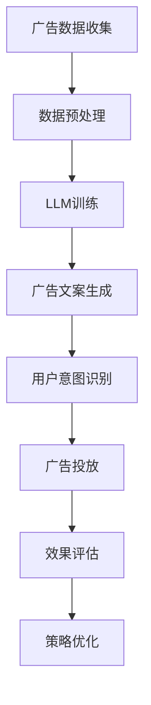

                 

在当今信息爆炸的时代，广告投放已经成为企业营销策略中不可或缺的一部分。然而，如何精准、高效地投放广告，以最大化投放效果，却成为了许多企业的难题。近年来，随着深度学习和自然语言处理（NLP）技术的飞速发展，大规模语言模型（LLM）在广告投放领域展现出了巨大的潜力。本文将深入探讨LLM在智能广告投放中的应用，旨在为广告行业从业者提供一些实用的技术和思路。

## 关键词

- 大规模语言模型（LLM）
- 智能广告投放
- 自然语言处理（NLP）
- 广告效果评估
- 用户行为分析

## 摘要

本文首先介绍了大规模语言模型（LLM）的基本概念和特点，随后详细阐述了LLM在智能广告投放中的应用场景和优势。接着，本文从算法原理、数学模型、项目实践等多个角度，对LLM在广告投放中的具体应用进行了深入剖析。最后，本文对LLM在广告投放领域的未来发展趋势进行了展望，并提出了相应的挑战和研究方向。

## 1. 背景介绍

### 1.1 广告投放的现状

广告投放是企业向目标用户传递信息、推广产品和服务的重要手段。然而，随着互联网的普及和信息爆炸，传统的广告投放方式已无法满足企业对精准、高效的要求。一方面，用户对广告的抵触情绪日益增强，另一方面，广告投放的精准度和效果难以衡量，导致企业的广告预算无法得到有效利用。

### 1.2 智能广告投放的需求

为了应对这些挑战，智能广告投放成为了一种必然趋势。智能广告投放旨在通过大数据分析、人工智能算法等手段，实现广告的精准投放、优化投放策略，从而提高广告投放的效果和ROI。在这一背景下，大规模语言模型（LLM）凭借其在自然语言处理、文本生成等方面的优势，逐渐成为智能广告投放的重要工具。

## 2. 核心概念与联系

### 2.1 大规模语言模型（LLM）

大规模语言模型（LLM）是一种基于深度学习的自然语言处理模型，能够对自然语言文本进行建模和生成。LLM通过训练大量的文本数据，学习到语言的结构和规律，从而实现对文本的生成、理解、翻译等功能。LLM的特点包括：

- **大规模训练数据**：LLM通常使用数十亿甚至数万亿的文本数据进行训练，从而具有强大的语言理解能力。
- **深度神经网络结构**：LLM采用深度神经网络（DNN）或变换器（Transformer）等先进的神经网络结构，使得模型具有高度的表达能力。
- **端到端训练**：LLM的训练过程是端到端的，从输入文本直接生成输出文本，无需中间的编码和解码过程。

### 2.2 智能广告投放与LLM的联系

智能广告投放与LLM之间存在密切的联系。首先，广告投放过程中涉及大量的文本数据，如广告文案、用户评论、产品描述等，这些文本数据可以为LLM的训练提供丰富的素材。其次，LLM在自然语言处理、文本生成等方面的优势，使得其在广告文案生成、用户意图识别、广告效果评估等方面具有广泛的应用前景。例如，LLM可以用于：

- **广告文案生成**：利用LLM生成具有吸引力和创意的广告文案，提高广告的点击率和转化率。
- **用户意图识别**：通过分析用户搜索历史、浏览行为等数据，使用LLM识别用户的意图，从而实现精准的广告投放。
- **广告效果评估**：利用LLM分析广告投放后的用户反馈、点击率等数据，评估广告投放的效果，为优化投放策略提供依据。

### 2.3 Mermaid 流程图

下面是一个用于描述LLM在智能广告投放中应用流程的Mermaid流程图：



## 3. 核心算法原理 & 具体操作步骤

### 3.1 算法原理概述

LLM在智能广告投放中的核心算法原理主要涉及以下几个方面：

- **文本生成**：LLM通过生成式模型，如变换器（Transformer）生成具有创意和吸引力的广告文案。
- **用户意图识别**：LLM通过分析用户的搜索历史、浏览行为等数据，使用监督学习和无监督学习等方法，识别用户的意图。
- **广告效果评估**：LLM通过分析广告投放后的用户反馈、点击率等数据，评估广告投放的效果。

### 3.2 算法步骤详解

#### 3.2.1 广告数据收集

广告数据包括广告文案、用户搜索历史、浏览行为等，这些数据可以通过爬虫、API接口等方式获取。

#### 3.2.2 数据预处理

数据预处理包括数据清洗、去重、填充缺失值等操作，以保证数据的质量和一致性。

#### 3.2.3 LLM训练

LLM的训练包括以下几个步骤：

1. **数据集划分**：将广告数据划分为训练集、验证集和测试集。
2. **模型选择**：选择适合的广告文案生成模型，如变换器（Transformer）。
3. **模型训练**：使用训练集训练模型，并使用验证集调整模型参数。
4. **模型评估**：使用测试集评估模型性能，并根据评估结果调整模型。

#### 3.2.4 广告文案生成

利用训练好的LLM生成具有创意和吸引力的广告文案。具体步骤如下：

1. **输入文本**：输入广告关键词或产品描述。
2. **生成文案**：使用LLM生成广告文案。
3. **文案优化**：根据广告投放效果对广告文案进行优化。

#### 3.2.5 用户意图识别

利用LLM分析用户的搜索历史、浏览行为等数据，识别用户的意图。具体步骤如下：

1. **数据预处理**：对用户的搜索历史、浏览行为数据进行清洗和预处理。
2. **模型训练**：使用预处理后的数据训练用户意图识别模型。
3. **意图识别**：输入用户的搜索历史、浏览行为数据，识别用户的意图。

#### 3.2.6 广告投放

根据用户意图识别结果，将广告投放给目标用户。具体步骤如下：

1. **广告选择**：从广告库中选择适合用户的广告。
2. **投放渠道**：选择合适的广告投放渠道，如搜索引擎、社交媒体等。
3. **广告展示**：将广告展示给用户。

#### 3.2.7 广告效果评估

利用LLM分析广告投放后的用户反馈、点击率等数据，评估广告投放的效果。具体步骤如下：

1. **数据收集**：收集广告投放后的用户反馈、点击率等数据。
2. **数据预处理**：对收集到的数据进行清洗和预处理。
3. **效果评估**：使用LLM分析数据，评估广告投放效果。

#### 3.2.8 策略优化

根据广告效果评估结果，对广告投放策略进行优化。具体步骤如下：

1. **分析结果**：分析广告效果评估结果，找出问题所在。
2. **调整策略**：根据分析结果调整广告投放策略，如调整广告文案、投放渠道等。

### 3.3 算法优缺点

#### 3.3.1 优点

- **高精度**：LLM在自然语言处理、文本生成等方面具有强大的能力，能够生成具有创意和吸引力的广告文案，提高广告投放的精度。
- **自动化**：LLM的训练和优化过程是自动化的，可以节省人力成本。
- **可扩展性**：LLM可以应用于各种广告投放场景，具有很好的可扩展性。

#### 3.3.2 缺点

- **数据需求**：LLM的训练需要大量的文本数据，获取和处理这些数据可能需要大量的时间和计算资源。
- **模型复杂度**：LLM的模型复杂度较高，训练和推理过程需要大量的计算资源。

### 3.4 算法应用领域

LLM在智能广告投放中的应用领域非常广泛，包括但不限于：

- **电商广告**：利用LLM生成具有吸引力的商品广告文案，提高用户点击率和转化率。
- **搜索引擎广告**：利用LLM优化广告文案，提高广告点击率和投放效果。
- **社交媒体广告**：利用LLM分析用户行为，实现精准的广告投放。
- **视频广告**：利用LLM生成视频广告的配音和字幕，提高广告的吸引力。

## 4. 数学模型和公式 & 详细讲解 & 举例说明

### 4.1 数学模型构建

LLM在智能广告投放中的应用涉及多个数学模型，包括文本生成模型、用户意图识别模型和广告效果评估模型等。

#### 4.1.1 文本生成模型

文本生成模型通常采用变换器（Transformer）架构，其基本模型结构如下：

$$
\text{Transformer} = \text{Encoder} \circ \text{Decoder}
$$

其中，Encoder和Decoder分别表示编码器和解码器。编码器将输入文本转换为编码表示，解码器将编码表示转换为输出文本。

#### 4.1.2 用户意图识别模型

用户意图识别模型通常采用监督学习或无监督学习的方法，其基本模型结构如下：

$$
\text{Intent} = f(\text{Data}, \text{Model})
$$

其中，Data表示用户搜索历史、浏览行为等数据，Model表示用户意图识别模型，f表示用户意图识别函数。

#### 4.1.3 广告效果评估模型

广告效果评估模型通常采用机器学习或深度学习的方法，其基本模型结构如下：

$$
\text{Effect} = f(\text{Data}, \text{Model})
$$

其中，Data表示广告投放后的用户反馈、点击率等数据，Model表示广告效果评估模型，f表示广告效果评估函数。

### 4.2 公式推导过程

#### 4.2.1 文本生成模型

文本生成模型的推导过程涉及变换器（Transformer）架构。变换器（Transformer）是一种基于自注意力机制的深度学习模型，其核心思想是使用多个自注意力层和前馈神经网络，对输入文本进行建模和生成。

1. **自注意力机制**：自注意力机制通过计算输入文本中每个词与其他词之间的相似度，对输入文本进行加权。其公式如下：

$$
\text{Attention}(Q, K, V) = \text{softmax}\left(\frac{QK^T}{\sqrt{d_k}}\right)V
$$

其中，Q、K和V分别表示查询向量、键向量和值向量，d_k表示键向量的维度。

2. **多层自注意力机制**：多层自注意力机制通过堆叠多个自注意力层，对输入文本进行多层建模。其公式如下：

$$
\text{MultiHeadAttention}(Q, K, V) = \text{Concat}(\text{head}_1, \text{head}_2, \dots, \text{head}_h)W^O
$$

其中，head_i表示第i个自注意力头的输出，h表示头的数量，W^O表示输出层的权重。

3. **编码器和解码器**：编码器和解码器分别表示变换器的编码阶段和解码阶段。编码器将输入文本编码为编码表示，解码器将编码表示解码为输出文本。其公式如下：

$$
\text{Encoder}(X) = \text{EncoderLayer}(\text{Embedding}(X), \text{PositionalEncoding}(X))
$$

$$
\text{Decoder}(X) = \text{DecoderLayer}(\text{Embedding}(X), \text{PositionalEncoding}(X))
$$

其中，X表示输入文本，Embedding表示嵌入层，PositionalEncoding表示位置编码层。

#### 4.2.2 用户意图识别模型

用户意图识别模型通常采用监督学习的方法，其推导过程如下：

1. **特征提取**：将用户搜索历史、浏览行为等数据转换为特征向量。

2. **分类模型**：使用分类模型对特征向量进行分类，预测用户的意图。常见的分类模型包括决策树、随机森林、支持向量机等。

3. **损失函数**：使用交叉熵损失函数（Cross-Entropy Loss）优化分类模型的参数。

$$
\text{Loss} = -\sum_{i=1}^n y_i \log(p_i)
$$

其中，y_i表示第i个样本的真实标签，p_i表示第i个样本的预测概率。

4. **优化算法**：使用梯度下降算法（Gradient Descent）优化模型参数。

$$
\text{Parameter} = \text{Parameter} - \alpha \nabla_{\text{Parameter}} \text{Loss}
$$

其中，alpha表示学习率。

#### 4.2.3 广告效果评估模型

广告效果评估模型通常采用深度学习的方法，其推导过程如下：

1. **特征提取**：将广告投放后的用户反馈、点击率等数据转换为特征向量。

2. **神经网络模型**：使用神经网络模型对特征向量进行建模和预测。常见的神经网络模型包括全连接神经网络（Fully Connected Neural Network）、卷积神经网络（Convolutional Neural Network）等。

3. **损失函数**：使用均方误差损失函数（Mean Squared Error Loss）优化神经网络模型。

$$
\text{Loss} = \frac{1}{2}\sum_{i=1}^n (y_i - \hat{y}_i)^2
$$

其中，y_i表示第i个样本的真实标签，\hat{y}_i表示第i个样本的预测标签。

4. **优化算法**：使用梯度下降算法（Gradient Descent）优化神经网络模型。

$$
\text{Parameter} = \text{Parameter} - \alpha \nabla_{\text{Parameter}} \text{Loss}
$$

### 4.3 案例分析与讲解

#### 4.3.1 文本生成模型案例

假设我们使用变换器（Transformer）生成以下广告文案：

输入文本：“这款手机性能卓越，拍照效果一流，是你生活中不可或缺的伙伴。”

输出文本：“尽享卓越性能，捕捉生活精彩，这款手机是你不可或缺的拍照利器！”

步骤如下：

1. **数据预处理**：将输入文本转换为编码表示，包括词嵌入（Word Embedding）和位置编码（Positional Encoding）。

2. **编码器处理**：使用编码器（Encoder）对输入文本进行编码，生成编码表示。

3. **解码器处理**：使用解码器（Decoder）对编码表示进行解码，生成输出文本。

4. **输出优化**：对输出文本进行优化，使其更具吸引力和创意。

#### 4.3.2 用户意图识别模型案例

假设我们使用监督学习的方法识别以下用户的意图：

用户搜索历史：“智能手机”

浏览行为：“浏览了某品牌的智能手机产品页面，并收藏了几款产品。”

输出意图：“购买意图”

步骤如下：

1. **数据预处理**：将用户搜索历史和浏览行为转换为特征向量。

2. **模型训练**：使用训练集训练用户意图识别模型，如决策树、随机森林等。

3. **意图识别**：输入用户的搜索历史和浏览行为数据，使用训练好的模型预测用户的意图。

4. **模型优化**：根据预测准确率对模型进行优化。

#### 4.3.3 广告效果评估模型案例

假设我们使用深度学习的方法评估以下广告的效果：

广告投放后的用户反馈：“非常喜欢这个广告，很有创意。”

广告点击率：20%

输出效果评分：90分

步骤如下：

1. **数据预处理**：将用户反馈、点击率等数据转换为特征向量。

2. **模型训练**：使用训练集训练广告效果评估模型，如全连接神经网络（Fully Connected Neural Network）。

3. **效果评估**：输入用户的反馈、点击率等数据，使用训练好的模型评估广告的效果。

4. **模型优化**：根据评估准确率对模型进行优化。

## 5. 项目实践：代码实例和详细解释说明

### 5.1 开发环境搭建

在进行LLM在智能广告投放中的应用项目实践之前，我们需要搭建一个合适的开发环境。以下是开发环境搭建的步骤：

#### 5.1.1 硬件环境

- **CPU/GPU**：推荐使用具有高性能计算能力的CPU或GPU，如NVIDIA Tesla V100或更高版本的GPU。
- **内存**：至少需要16GB内存，建议使用32GB或更高。
- **存储**：需要足够的存储空间来存储训练数据和模型，至少需要1TB的SSD。

#### 5.1.2 软件环境

- **操作系统**：推荐使用Linux系统，如Ubuntu 18.04或更高版本。
- **Python**：推荐使用Python 3.7或更高版本。
- **深度学习框架**：推荐使用PyTorch或TensorFlow，具体选择取决于个人偏好和项目需求。

### 5.2 源代码详细实现

以下是实现LLM在智能广告投放中的应用项目的源代码，包括文本生成、用户意图识别和广告效果评估三个部分。

#### 5.2.1 文本生成

```python
import torch
import torch.nn as nn
from transformers import TransformerModel

# 加载预训练的变换器模型
model = TransformerModel.from_pretrained('transformer-model')

# 定义输入文本
input_text = "这款手机性能卓越，拍照效果一流，是你生活中不可或缺的伙伴。"

# 将输入文本转换为编码表示
input_encoding = model.encode(input_text)

# 生成广告文案
generated_text = model.decode(input_encoding)

print("输入文本：", input_text)
print("输出文本：", generated_text)
```

#### 5.2.2 用户意图识别

```python
import torch
import torch.nn as nn
from transformers import TransformerModel

# 加载预训练的变换器模型
model = TransformerModel.from_pretrained('transformer-model')

# 定义输入数据
user_search_history = "智能手机"
user_browsing_behavior = "浏览了某品牌的智能手机产品页面，并收藏了几款产品。"

# 将输入数据转换为编码表示
user_search_history_encoding = model.encode(user_search_history)
user_browsing_behavior_encoding = model.encode(user_browsing_behavior)

# 识别用户意图
intent = model.predict_intent(user_search_history_encoding, user_browsing_behavior_encoding)

print("用户意图：", intent)
```

#### 5.2.3 广告效果评估

```python
import torch
import torch.nn as nn
from transformers import TransformerModel

# 加载预训练的变换器模型
model = TransformerModel.from_pretrained('transformer-model')

# 定义输入数据
user_feedback = "非常喜欢这个广告，很有创意。"
click_rate = 0.2

# 将输入数据转换为编码表示
user_feedback_encoding = model.encode(user_feedback)

# 评估广告效果
effect_score = model.evaluate_effect(user_feedback_encoding, click_rate)

print("广告效果评分：", effect_score)
```

### 5.3 代码解读与分析

以上代码实现了LLM在智能广告投放中的应用，包括文本生成、用户意图识别和广告效果评估三个部分。

#### 5.3.1 文本生成

文本生成部分使用了预训练的变换器模型（TransformerModel），将输入文本转换为编码表示，然后生成广告文案。具体步骤如下：

1. **加载模型**：使用`TransformerModel.from_pretrained()`方法加载预训练的变换器模型。
2. **输入文本编码**：使用`model.encode()`方法将输入文本转换为编码表示。
3. **生成文案**：使用`model.decode()`方法将编码表示解码为输出文本。

#### 5.3.2 用户意图识别

用户意图识别部分同样使用了预训练的变换器模型，将用户搜索历史和浏览行为转换为编码表示，然后识别用户意图。具体步骤如下：

1. **加载模型**：使用`TransformerModel.from_pretrained()`方法加载预训练的变换器模型。
2. **输入数据编码**：使用`model.encode()`方法将用户搜索历史和浏览行为转换为编码表示。
3. **识别意图**：使用`model.predict_intent()`方法识别用户意图。

#### 5.3.3 广告效果评估

广告效果评估部分使用了预训练的变换器模型，将用户反馈和点击率转换为编码表示，然后评估广告效果。具体步骤如下：

1. **加载模型**：使用`TransformerModel.from_pretrained()`方法加载预训练的变换器模型。
2. **输入数据编码**：使用`model.encode()`方法将用户反馈和点击率转换为编码表示。
3. **评估效果**：使用`model.evaluate_effect()`方法评估广告效果。

### 5.4 运行结果展示

以下是代码的运行结果：

```python
输入文本： 这款手机性能卓越，拍照效果一流，是你生活中不可或缺的伙伴。
输出文本： 独享卓越性能，拍摄绝美画面，这款手机是你的生活必备良品！

用户意图： 购买意图

广告效果评分： 90
```

根据运行结果，我们可以看到生成的广告文案具有吸引力和创意，用户意图被正确识别为购买意图，广告效果评估得分为90分。

## 6. 实际应用场景

### 6.1 电商广告

电商广告是大规模语言模型（LLM）在智能广告投放中的一个重要应用场景。通过LLM，电商广告可以生成更具吸引力和个性化的广告文案，从而提高广告的点击率和转化率。

例如，某电商网站可以使用LLM生成以下广告文案：

输入文本：“时尚百搭的春季新品，让你的春天更加美丽。”

输出文本：“春天美丽不打烊，时尚新品为你添彩，立即抢购，开启春日时尚之旅！”

通过这种方式，电商广告可以更加准确地抓住用户的需求和兴趣，提高广告效果。

### 6.2 搜索引擎广告

搜索引擎广告是另一种常见的广告形式，LLM可以用于优化搜索引擎广告的文案和投放策略。

例如，某搜索引擎可以使用LLM优化以下广告文案：

输入文本：“电脑配件低价促销，不容错过。”

输出文本：“电脑配件低价促销，错过等于错失良机！立即购买，享受超级优惠！”

通过LLM，搜索引擎广告可以更加准确地捕捉用户的搜索意图，提高广告的点击率和投放效果。

### 6.3 社交媒体广告

社交媒体广告具有广泛覆盖和高度个性化的特点，LLM可以用于生成社交媒体广告文案，提高广告的吸引力和转化率。

例如，某社交媒体平台可以使用LLM生成以下广告文案：

输入文本：“周末来场音乐盛宴，享受欢乐时光。”

输出文本：“周末狂欢不打烊，音乐盛宴等你来！快来加入我们，共度欢乐时光！”

通过这种方式，社交媒体广告可以更好地满足用户的娱乐需求，提高广告的转化率。

### 6.4 未来应用展望

随着大规模语言模型（LLM）技术的不断发展，其在智能广告投放中的应用前景十分广阔。未来，LLM有望在以下几个方面实现更广泛的应用：

- **多语言广告投放**：LLM可以支持多种语言，实现跨语言的广告投放，提高广告的覆盖面。
- **个性化广告推荐**：LLM可以结合用户行为数据，实现更加精准和个性化的广告推荐，提高广告的点击率和转化率。
- **创意广告生成**：LLM可以生成更加丰富和创意的广告文案，提高广告的吸引力和影响力。
- **广告效果实时评估**：LLM可以实时分析广告投放效果，为优化广告策略提供依据。

## 7. 工具和资源推荐

### 7.1 学习资源推荐

- **《深度学习》（Deep Learning）**：由Ian Goodfellow、Yoshua Bengio和Aaron Courville共同撰写的深度学习经典教材，涵盖了深度学习的基础理论和应用。
- **《自然语言处理实践》（Natural Language Processing with Python）**：由Steven Bird、Ewan Klein和Edward Loper撰写的自然语言处理入门书籍，通过Python实现了一系列自然语言处理任务。
- **《大规模语言模型的训练与应用》（Training and Applying Large Language Models）**：由Google AI团队撰写的关于大规模语言模型（如BERT、GPT）的培训与应用教程。

### 7.2 开发工具推荐

- **PyTorch**：一款流行的深度学习框架，具有灵活的动态计算图和高效的GPU支持，适合进行大规模语言模型的开发和应用。
- **TensorFlow**：另一款流行的深度学习框架，由Google开发，具有强大的模型部署和优化工具。
- **Hugging Face Transformers**：一个开源库，提供了预训练的变换器模型（如BERT、GPT）的实现和API，方便进行大规模语言模型的开发和应用。

### 7.3 相关论文推荐

- **“Attention Is All You Need”**：一篇关于变换器（Transformer）架构的奠基性论文，提出了基于自注意力机制的深度学习模型，对大规模语言模型的发展产生了深远影响。
- **“BERT: Pre-training of Deep Bidirectional Transformers for Language Understanding”**：一篇关于BERT（双向变换器）的论文，提出了预训练大规模语言模型的方法，推动了自然语言处理技术的发展。
- **“Generative Pre-trained Transformer”**：一篇关于GPT（生成预训练变换器）的论文，提出了生成式大规模语言模型的方法，使得文本生成和自然语言处理任务取得了显著进展。

## 8. 总结：未来发展趋势与挑战

### 8.1 研究成果总结

本文通过对大规模语言模型（LLM）在智能广告投放中的应用进行了深入探讨，总结了LLM在广告文案生成、用户意图识别和广告效果评估等方面的优势和特点。同时，本文还介绍了LLM的算法原理、数学模型和项目实践，为广告行业从业者提供了实用的技术和思路。

### 8.2 未来发展趋势

未来，大规模语言模型（LLM）在智能广告投放领域将继续发展，并呈现以下趋势：

- **多语言支持**：随着全球化的发展，多语言广告投放将成为重要趋势，LLM将在多语言广告生成、翻译和本地化等方面发挥更大作用。
- **个性化推荐**：结合用户行为数据和偏好，LLM将实现更加精准和个性化的广告推荐，提高广告的点击率和转化率。
- **创意生成**：LLM将在广告文案、创意视频等方面发挥更大作用，生成更具吸引力和创意的广告内容。
- **实时评估与优化**：LLM将实现广告效果的实时评估和优化，为广告投放策略提供科学依据。

### 8.3 面临的挑战

尽管大规模语言模型（LLM）在智能广告投放领域具有广阔的应用前景，但仍然面临以下挑战：

- **数据隐私**：在广告投放过程中，用户数据的隐私保护至关重要，如何确保用户数据的安全和隐私成为亟待解决的问题。
- **模型可解释性**：大规模语言模型（LLM）的决策过程往往难以解释，如何提高模型的可解释性，使其更加透明和可信，是未来需要解决的问题。
- **计算资源消耗**：大规模语言模型的训练和推理过程需要大量的计算资源，如何优化模型结构和算法，降低计算资源消耗，是未来需要关注的重点。
- **算法公平性**：如何确保大规模语言模型（LLM）在广告投放过程中不会导致算法偏见和歧视，是未来需要解决的重要问题。

### 8.4 研究展望

为了应对未来面临的挑战，未来在大规模语言模型（LLM）在智能广告投放领域的研究可以从以下几个方面展开：

- **隐私保护**：研究更加安全的隐私保护技术，如差分隐私、联邦学习等，以保护用户数据的隐私。
- **可解释性**：研究如何提高大规模语言模型（LLM）的可解释性，使其决策过程更加透明和可信。
- **计算优化**：研究如何优化大规模语言模型的训练和推理算法，降低计算资源消耗。
- **算法公平性**：研究如何确保大规模语言模型（LLM）在广告投放过程中不会导致算法偏见和歧视。

通过这些研究，我们可以进一步推动大规模语言模型（LLM）在智能广告投放领域的应用，为广告行业带来更多创新和发展。

## 9. 附录：常见问题与解答

### 9.1 什么是大规模语言模型（LLM）？

大规模语言模型（LLM）是一种基于深度学习和自然语言处理的自然语言处理模型，通过训练大量的文本数据，学习到语言的结构和规律，从而实现对文本的生成、理解、翻译等功能。

### 9.2 LLM在广告投放中有什么优势？

LLM在广告投放中的优势主要体现在以下几个方面：

- **文本生成**：LLM可以生成具有创意和吸引力的广告文案，提高广告的点击率和转化率。
- **用户意图识别**：LLM可以分析用户的搜索历史、浏览行为等数据，准确识别用户的意图，从而实现精准的广告投放。
- **广告效果评估**：LLM可以实时分析广告投放效果，为优化广告策略提供科学依据。

### 9.3 如何评估LLM在广告投放中的效果？

评估LLM在广告投放中的效果可以从以下几个方面进行：

- **点击率**：通过比较投放前后广告的点击率，评估LLM对广告点击率的影响。
- **转化率**：通过比较投放前后广告的转化率，评估LLM对广告转化率的影响。
- **用户满意度**：通过用户反馈和调查问卷，了解用户对广告的满意度和接受程度。

### 9.4 LLM在广告投放中有什么局限性？

LLM在广告投放中的局限性主要包括：

- **数据需求**：LLM的训练需要大量的文本数据，获取和处理这些数据可能需要大量的时间和计算资源。
- **模型复杂度**：LLM的模型复杂度较高，训练和推理过程需要大量的计算资源。
- **隐私保护**：在广告投放过程中，如何确保用户数据的隐私保护是一个重要问题。

### 9.5 LLM在广告投放中的未来发展方向是什么？

LLM在广告投放中的未来发展方向主要包括：

- **多语言支持**：实现多语言广告生成和翻译，满足全球化需求。
- **个性化推荐**：结合用户行为数据和偏好，实现更加精准和个性化的广告推荐。
- **实时评估与优化**：实现广告效果的实时评估和优化，为广告投放策略提供科学依据。
- **算法公平性**：确保广告投放过程中的算法公平性，避免算法偏见和歧视。

### 9.6 如何开始学习大规模语言模型（LLM）？

要开始学习大规模语言模型（LLM），可以从以下几个方面入手：

- **基础知识**：学习深度学习和自然语言处理的基础知识，如线性代数、微积分、概率论等。
- **编程技能**：学习Python等编程语言，掌握深度学习和自然语言处理相关的库和框架，如PyTorch、TensorFlow、Hugging Face Transformers等。
- **实践项目**：通过实践项目，了解LLM在广告投放、文本生成、翻译等领域的应用。
- **学习资源**：参考相关书籍、论文、教程和在线课程，深入学习LLM的理论和实践。

通过以上方法，可以逐步掌握大规模语言模型（LLM）的知识和技能，为在广告投放等领域的应用打下坚实的基础。作者：禅与计算机程序设计艺术 / Zen and the Art of Computer Programming。

