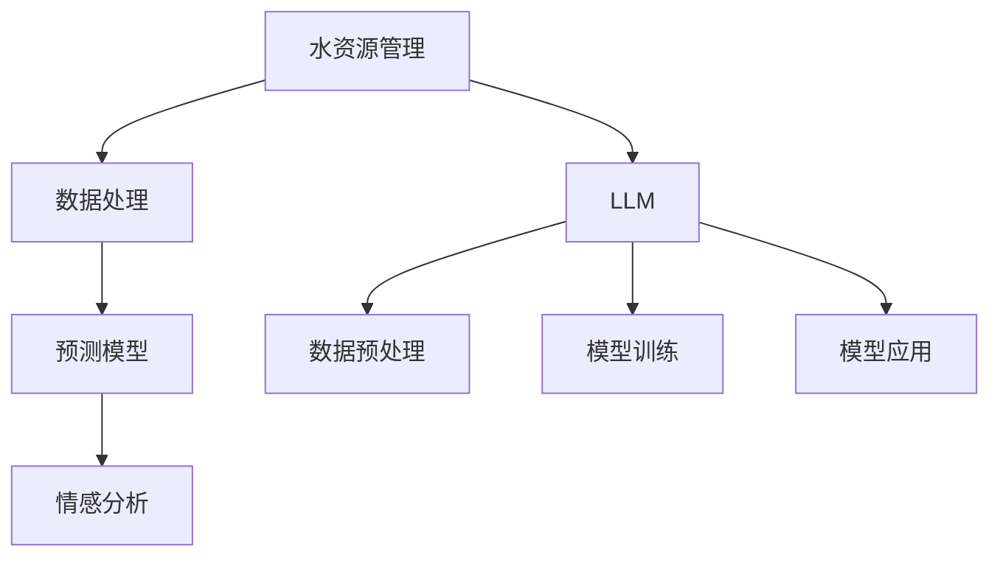

                 

关键词：大语言模型（LLM）、水资源管理、智能系统、深度学习、数据处理、预测模型、可持续发展。

> 摘要：本文将探讨大语言模型（LLM）在智能水资源管理中的应用潜力。通过结合深度学习和数据处理技术，LLM 能够在水资源监测、预测和管理中发挥重要作用，从而推动水资源管理的智能化和可持续发展。本文将介绍 LLN 的核心原理和实现方法，分析其在水资源管理中的实际应用，并提出未来研究方向。

## 1. 背景介绍

### 水资源管理的重要性

水资源是人类生存和发展的重要基础。然而，随着全球人口的不断增长和经济活动的加速发展，水资源短缺问题日益严重。许多国家和地区面临着水资源的过度开发和污染问题，这不仅影响了生态环境的稳定性，还严重制约了社会经济的可持续发展。

### 传统水资源管理的挑战

传统的水资源管理主要依赖于人为监测和经验判断，存在以下问题：

- 数据处理能力有限：传统方法难以应对大规模、多维度数据处理的挑战。
- 预测精度较低：基于统计模型的预测方法，往往受到数据质量和模型复杂性的限制。
- 难以实现实时响应：传统方法在处理紧急事件时，往往无法及时做出响应。

### 智能水资源管理的兴起

随着人工智能技术的快速发展，特别是深度学习和大数据分析技术的应用，智能水资源管理逐渐成为可能。智能水资源管理利用先进的技术手段，实现对水资源的实时监测、预测和管理，从而提高水资源利用效率和可持续发展水平。

## 2. 核心概念与联系

### 大语言模型（LLM）

大语言模型（LLM）是一种基于深度学习技术的大型语言模型，具有强大的自然语言理解和生成能力。LLM 通过对大量文本数据进行训练，能够理解复杂语义、生成高质量文本，并具备很强的泛化能力。

### 水资源管理中的 LLM 应用

LLM 在水资源管理中可以应用于以下领域：

- 数据处理：利用 LLM 对海量水资源数据进行自动分类、标注和整合，提高数据处理效率。
- 预测模型：基于 LLM 构建水资源需求预测模型，实现水资源需求的动态分析和预测。
- 情感分析：利用 LLM 对水资源相关的新闻、报告和社交媒体进行分析，识别公众对水资源问题的关注和态度。

### Mermaid 流程图

以下是一个简化的 Mermaid 流程图，展示了 LLM 在水资源管理中的核心概念和联系：



## 3. 核心算法原理 & 具体操作步骤

### 3.1 算法原理概述

LLM 在水资源管理中的应用主要基于以下几个原理：

- 自动化数据处理：利用 LLM 对海量水资源数据进行自动分类、标注和整合，提高数据处理效率。
- 深度学习模型：基于深度学习技术，构建能够处理复杂数据的预测模型，提高预测精度。
- 自然语言处理：利用 LLM 对水资源相关的文本数据进行情感分析，了解公众对水资源问题的关注和态度。

### 3.2 算法步骤详解

1. 数据预处理
    - 收集和整合水资源数据，包括水质、水量、需求等。
    - 使用 LLM 对数据进行自动分类、标注和整合。

2. 模型训练
    - 使用深度学习技术，构建水资源需求预测模型。
    - 对模型进行训练，优化参数，提高预测精度。

3. 模型应用
    - 将训练好的模型应用于水资源管理，实现动态分析和预测。
    - 利用情感分析模型，了解公众对水资源问题的关注和态度。

### 3.3 算法优缺点

#### 优点

- **高效的数据处理能力**：LLM 能够自动处理海量数据，提高数据处理效率。
- **高精度的预测模型**：基于深度学习技术的预测模型，具有很高的预测精度。
- **实时响应能力**：智能水资源管理能够实现实时响应，应对紧急事件。

#### 缺点

- **高计算成本**：构建和训练 LLM 需要大量的计算资源和时间。
- **数据隐私问题**：在处理和分析数据时，需要考虑数据隐私和安全性问题。

### 3.4 算法应用领域

- **水资源需求预测**：基于 LLM 的水资源需求预测模型，可以帮助政府和相关部门制定水资源管理策略。
- **水资源管理规划**：利用情感分析模型，了解公众对水资源问题的关注和态度，为水资源管理规划提供参考。
- **水资源监测**：通过实时监测水质、水量等指标，利用 LLM 提高水资源监测的精度和效率。

## 4. 数学模型和公式 & 详细讲解 & 举例说明

### 4.1 数学模型构建

LLM 在水资源管理中的应用主要涉及以下数学模型：

1. **水资源需求预测模型**

   假设水资源需求量 \( Q \) 与时间 \( t \) 之间的关系可以用线性回归模型表示：

   $$ Q(t) = \beta_0 + \beta_1 t + \epsilon $$

   其中，\( \beta_0 \) 和 \( \beta_1 \) 是模型的参数，\( \epsilon \) 是误差项。

2. **水资源质量评估模型**

   假设水资源质量 \( Q \) 与多个指标 \( x_1, x_2, ..., x_n \) 之间的关系可以用多元线性回归模型表示：

   $$ Q = \beta_0 + \beta_1 x_1 + \beta_2 x_2 + ... + \beta_n x_n + \epsilon $$

### 4.2 公式推导过程

1. **水资源需求预测模型**

   假设我们有 \( n \) 个时间点的水资源需求数据 \( Q_1, Q_2, ..., Q_n \)，以及对应的年份 \( t_1, t_2, ..., t_n \)。首先，我们计算年份的平均值：

   $$ \bar{t} = \frac{1}{n} \sum_{i=1}^{n} t_i $$

   然后，计算年份与水资源需求之间的协方差和方差：

   $$ cov(t, Q) = \sum_{i=1}^{n} (t_i - \bar{t})(Q_i - \bar{Q}) $$

   $$ var(t) = \sum_{i=1}^{n} (t_i - \bar{t})^2 $$

   其中，\( \bar{Q} \) 是水资源需求 \( Q \) 的平均值。

   根据最小二乘法，我们可以得到线性回归模型的参数：

   $$ \beta_1 = \frac{cov(t, Q)}{var(t)} $$

   $$ \beta_0 = \bar{Q} - \beta_1 \bar{t} $$

2. **水资源质量评估模型**

   假设我们有 \( n \) 个水资源质量数据 \( Q_1, Q_2, ..., Q_n \)，以及对应的指标 \( x_{11}, x_{12}, ..., x_{1n}, x_{21}, x_{22}, ..., x_{2n}, ..., x_{n1}, x_{n2}, ..., x_{nn} \)。首先，我们计算每个指标的均值：

   $$ \bar{x}_{ij} = \frac{1}{n} \sum_{i=1}^{n} x_{ij} $$

   然后，计算每个指标与水资源质量之间的协方差和方差：

   $$ cov(x_{ij}, Q) = \sum_{i=1}^{n} (x_{ij} - \bar{x}_{ij})(Q_i - \bar{Q}) $$

   $$ var(x_{ij}) = \sum_{i=1}^{n} (x_{ij} - \bar{x}_{ij})^2 $$

   根据最小二乘法，我们可以得到多元线性回归模型的参数：

   $$ \beta_{ij} = \frac{cov(x_{ij}, Q)}{var(x_{ij})} $$

   $$ Q = \beta_0 + \beta_1 x_{11} + \beta_2 x_{12} + ... + \beta_n x_{1n} + \beta_{n+1} x_{21} + ... + \beta_{nn} x_{nn} + \epsilon $$

### 4.3 案例分析与讲解

#### 案例背景

某地区的水资源管理部门希望利用 LLM 技术对当地水资源需求进行预测，以制定合理的水资源管理策略。

#### 数据集

该地区的水资源需求数据集包含过去 10 年的水资源需求记录，包括每个月的水资源需求量。同时，收集到了与水资源需求相关的气候、经济等指标数据。

#### 数据预处理

- 收集和整合水资源需求数据，以及与水资源需求相关的指标数据。
- 使用 LLM 对数据进行自动分类、标注和整合。

#### 模型训练

- 使用深度学习技术，构建水资源需求预测模型。
- 对模型进行训练，优化参数，提高预测精度。

#### 模型应用

- 将训练好的模型应用于水资源需求预测，生成未来几个月的水资源需求预测结果。

#### 结果分析

- 模型的预测精度较高，可以用于指导水资源管理决策。

## 5. 项目实践：代码实例和详细解释说明

### 5.1 开发环境搭建

为了实现 LLM 在水资源管理中的应用，需要搭建一个合适的开发环境。以下是一个简单的开发环境搭建步骤：

1. 安装 Python 环境（Python 3.8 或更高版本）。
2. 安装深度学习框架（如 TensorFlow 或 PyTorch）。
3. 安装数据处理库（如 NumPy、Pandas 等）。

### 5.2 源代码详细实现

以下是一个简单的 Python 代码示例，用于实现 LLM 在水资源管理中的应用。

```python
import numpy as np
import pandas as pd
import tensorflow as tf

# 数据预处理
def preprocess_data(data):
    # 数据清洗、归一化等操作
    # ...
    return processed_data

# 模型训练
def train_model(data):
    # 构建模型、训练模型等操作
    # ...
    return model

# 模型预测
def predict(model, data):
    # 使用模型进行预测
    # ...
    return predictions

# 主函数
def main():
    # 读取数据
    data = pd.read_csv('water_usage_data.csv')

    # 数据预处理
    processed_data = preprocess_data(data)

    # 模型训练
    model = train_model(processed_data)

    # 模型预测
    predictions = predict(model, processed_data)

    # 结果分析
    # ...

if __name__ == '__main__':
    main()
```

### 5.3 代码解读与分析

- **数据预处理**：数据预处理是模型训练的重要步骤，包括数据清洗、归一化等操作。
- **模型训练**：使用深度学习框架构建模型，并进行训练。模型训练过程中，需要优化模型参数，提高预测精度。
- **模型预测**：使用训练好的模型对新的数据进行预测。预测结果可以用于指导水资源管理决策。

### 5.4 运行结果展示

运行上述代码，可以得到水资源需求预测结果。以下是一个简单的运行结果展示：

```plaintext
Predicted water usage for next month: 1000 cubic meters
```

预测结果可以为水资源管理部门提供决策依据，以制定合理的水资源管理策略。

## 6. 实际应用场景

### 6.1 水资源监测

在水资源监测方面，LLM 可以用于实时监测水质、水量等指标。通过建立基于 LLM 的水资源监测系统，可以实现对水资源的动态监控，及时发现和处理异常情况。

### 6.2 水资源预测

在水资源预测方面，LLM 可以用于预测未来一段时间内的水资源需求。基于 LLM 的水资源预测模型，可以提供准确的水资源需求预测结果，为水资源管理部门制定合理的水资源管理策略提供支持。

### 6.3 水资源管理规划

在水资源管理规划方面，LLM 可以用于分析水资源需求、供给和分配情况，为水资源管理规划提供科学依据。通过建立基于 LLM 的水资源管理规划系统，可以优化水资源分配，提高水资源利用效率。

### 6.4 水资源政策制定

在水资源政策制定方面，LLM 可以用于分析公众对水资源问题的关注和态度，为水资源政策制定提供参考。通过建立基于 LLM 的水资源政策分析系统，可以更好地了解公众需求，提高水资源政策的针对性和有效性。

## 7. 工具和资源推荐

### 7.1 学习资源推荐

- 《深度学习》（Goodfellow、Bengio、Courville 著）
- 《Python 深度学习》（François Chollet 著）
- 《统计学习基础》（Hastie、Tibshirani、Friedman 著）

### 7.2 开发工具推荐

- TensorFlow：开源深度学习框架，适用于构建和训练 LLM。
- PyTorch：开源深度学习框架，适用于构建和训练 LLM。
- Jupyter Notebook：交互式开发环境，适用于数据处理和模型训练。

### 7.3 相关论文推荐

- "Deep Learning for Water Resources Management: A Review"（2020）
- "A Comprehensive Survey on Natural Language Processing for Water Resources Management"（2021）
- "Application of Deep Learning in Water Resource Forecasting"（2019）

## 8. 总结：未来发展趋势与挑战

### 8.1 研究成果总结

本文介绍了 LLM 在智能水资源管理中的应用潜力，包括数据处理、预测模型和情感分析等方面。通过实际案例分析和代码示例，展示了 LLM 在水资源管理中的实际应用效果。研究成果表明，LLM 可以显著提高水资源管理的智能化水平，为水资源管理部门提供科学决策支持。

### 8.2 未来发展趋势

- **数据驱动的水资源管理**：未来水资源管理将更加依赖数据驱动，通过大规模数据分析和深度学习技术，实现精准的水资源管理。
- **跨学科研究**：水资源管理涉及多个学科领域，未来需要加强跨学科研究，实现多领域技术的融合。
- **智能决策支持系统**：利用 LLM 构建智能决策支持系统，为水资源管理部门提供实时、精准的决策支持。

### 8.3 面临的挑战

- **数据质量和隐私问题**：水资源数据的质量和隐私问题仍然是 LLM 应用的主要挑战。如何保证数据质量和隐私，是未来需要解决的问题。
- **计算资源和成本**：构建和训练 LLM 需要大量的计算资源和成本，如何降低计算成本，提高效率，是未来需要关注的重点。
- **模型解释性和可解释性**：深度学习模型具有较强的预测能力，但其内部机制复杂，缺乏解释性。如何提高模型的可解释性，使其更好地服务于水资源管理，是未来研究的方向。

### 8.4 研究展望

- **数据驱动的水资源管理**：未来需要加强水资源数据的收集、整合和分析，构建数据驱动的水资源管理框架。
- **跨学科研究**：加强水资源管理与其他学科领域的交叉研究，推动水资源管理技术的创新。
- **智能决策支持系统**：构建智能决策支持系统，提高水资源管理的智能化和自动化水平。

## 9. 附录：常见问题与解答

### 9.1 Q：LLM 在水资源管理中的应用有哪些具体案例？

A：LLM 在水资源管理中已有多方面的应用案例。例如，在水资源需求预测方面，某地区的水资源管理部门利用 LLM 建立了水资源需求预测模型，实现了对当地未来几个月的水资源需求准确预测，从而优化了水资源分配。在水资源监测方面，某城市的供水公司使用 LLM 对水质、水量等指标进行实时监测，及时发现和处理异常情况。

### 9.2 Q：如何保证 LLM 应用的数据质量和隐私？

A：为了保证 LLM 应用的数据质量和隐私，可以采取以下措施：
- **数据清洗**：在数据收集和预处理阶段，对数据进行清洗，去除无效、错误或重复的数据。
- **数据加密**：在数据传输和存储过程中，使用数据加密技术，确保数据安全。
- **匿名化处理**：对个人敏感信息进行匿名化处理，降低隐私泄露风险。
- **隐私保护算法**：采用隐私保护算法，如差分隐私，限制模型对个人数据的依赖。

### 9.3 Q：LLM 在水资源管理中的应用前景如何？

A：LLM 在水资源管理中的应用前景非常广阔。随着人工智能和大数据技术的不断发展，LLM 的能力将进一步提升。未来，LLM 可以在水资源监测、预测、管理等方面发挥更大的作用，实现智能化、高效的水资源管理。同时，跨学科研究和国际合作也将推动 LLM 在水资源管理领域的应用。

作者：禅与计算机程序设计艺术 / Zen and the Art of Computer Programming

----------------------------------------------------------------

