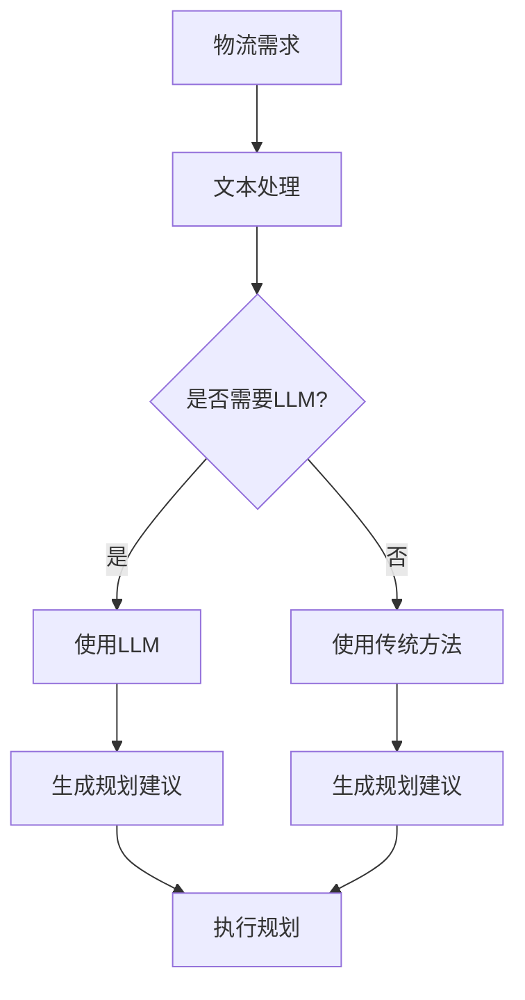

                 

关键词：自然语言处理，智能物流，规划算法，大型语言模型，物流优化

## 摘要

随着全球化贸易的快速发展，物流行业面临着巨大的挑战和机遇。物流规划是确保高效运输和服务的关键环节。本文探讨了大型语言模型（LLM）在智能物流规划中的潜在贡献。通过对LLM技术原理的分析，结合物流行业的实际需求，我们提出了几个可能的实施场景，并探讨了这些场景中的技术挑战和解决方案。文章旨在为物流行业的IT专业人士和研究者提供一个深入理解和应用LLM技术的视角。

## 1. 背景介绍

### 物流行业的现状

物流行业是经济发展的关键驱动力之一，它负责将产品从生产地点运送到消费者手中。然而，随着全球贸易的增长和消费者对快速、可靠交付需求的增加，物流行业面临着以下挑战：

- **复杂性增加**：全球供应链的复杂性不断增加，涉及到多个国家和地区、多种运输方式、多个仓储节点。
- **成本控制**：在保持服务质量的同时，物流企业需要有效控制运营成本。
- **实时性需求**：消费者期望能够实时追踪货物状态，对物流公司的实时响应能力提出了更高要求。
- **环保压力**：全球范围内的环保法规日益严格，物流行业需要采取更环保的运输方式。

### 智能物流规划的重要性

智能物流规划是利用信息技术手段优化物流流程，提高运输效率、降低成本、提升客户满意度的重要手段。智能物流规划涉及多个方面，包括路线优化、库存管理、配送计划等。以下是其重要性：

- **提高效率**：通过智能规划，可以减少运输时间和库存滞留时间，提高整体物流效率。
- **降低成本**：通过优化路线和资源分配，降低运输和仓储成本。
- **提升服务质量**：智能物流规划能够提供更准确的配送时间和状态信息，提高客户满意度。
- **适应变化**：智能规划系统能够快速适应市场变化和供应链动态，提高企业的灵活性。

## 2. 核心概念与联系

### 大型语言模型（LLM）的原理

大型语言模型（LLM）是一种基于深度学习技术的自然语言处理模型，它通过大量文本数据进行训练，能够理解和生成自然语言。LLM的核心在于其能够捕捉语言中的统计规律和语义信息，从而实现高效的文本理解和生成。

- **神经网络**：LLM通常基于多层感知机（MLP）、卷积神经网络（CNN）或循环神经网络（RNN）等深度学习模型。
- **大规模数据训练**：LLM的训练需要大量的文本数据，这些数据来源可以是互联网上的各种文本、书籍、新闻、文章等。
- **上下文理解**：LLM能够捕捉上下文信息，生成连贯、自然的文本。

### 物流规划的核心概念

物流规划的核心概念包括运输路线规划、库存管理和配送计划等。这些概念相互关联，共同构成了物流规划的体系。

- **运输路线规划**：确定货物从起点到终点的最佳运输路线，以最小化运输时间和成本。
- **库存管理**：确保仓库中有足够的库存来满足客户需求，同时避免过度库存造成的成本增加。
- **配送计划**：根据客户订单和库存情况，合理安排配送任务，确保及时交付。

### LLM与物流规划的关联

LLM在智能物流规划中具有巨大的潜力，主要体现在以下几个方面：

- **文本处理能力**：LLM能够高效处理和分析物流相关的文本信息，如运输单据、订单数据、天气报告等。
- **语义理解**：LLM能够理解文本中的语义信息，从而帮助规划系统做出更明智的决策。
- **自动化流程**：LLM可以自动化许多物流流程中的文本处理任务，提高工作效率。

### Mermaid 流程图



## 3. 核心算法原理 & 具体操作步骤

### 3.1 算法原理概述

LLM在物流规划中的核心算法原理主要包括以下几个方面：

- **文本预处理**：对物流相关的文本数据进行清洗、分词、去噪等预处理操作，以便于模型理解和分析。
- **上下文捕捉**：通过训练模型捕捉文本中的上下文信息，如地理位置、时间、天气等，这些信息对物流规划至关重要。
- **规划生成**：基于捕捉到的上下文信息，生成最优的物流规划方案，包括运输路线、库存管理策略和配送计划。

### 3.2 算法步骤详解

1. **数据收集与预处理**：
   - 收集物流相关的文本数据，如运输单据、订单信息、天气预报等。
   - 进行数据清洗，去除无关信息，对文本进行分词、去噪等操作。

2. **模型训练**：
   - 选择合适的LLM模型，如GPT-3、BERT等。
   - 使用预处理后的文本数据进行训练，使模型能够理解和生成与物流规划相关的文本。

3. **上下文捕捉**：
   - 在模型生成文本时，捕捉文本中的上下文信息，如地理位置、时间、天气等。
   - 使用这些上下文信息作为输入，为物流规划提供更准确的决策依据。

4. **规划生成**：
   - 根据上下文信息，生成最优的物流规划方案。
   - 方案包括运输路线、库存管理策略和配送计划等。

5. **规划执行**：
   - 将生成的规划方案传递给物流执行系统，如调度系统、仓储管理系统等。
   - 实时监控执行过程，根据实际情况进行调整。

### 3.3 算法优缺点

**优点**：

- **高效性**：LLM能够快速处理和分析大量文本数据，提高物流规划的效率。
- **准确性**：通过捕捉上下文信息，LLM能够生成更准确的物流规划方案。
- **灵活性**：LLM能够适应不同场景和需求，提供定制化的物流规划方案。

**缺点**：

- **计算资源需求**：训练和部署LLM模型需要大量的计算资源和时间。
- **数据依赖性**：LLM的性能依赖于训练数据的质量和数量，数据不足或质量不高会影响模型效果。
- **解释性**：LLM的决策过程往往是黑箱的，难以解释和验证，这对某些行业来说可能是一个挑战。

### 3.4 算法应用领域

LLM在物流规划中的应用领域主要包括：

- **运输路线规划**：基于实时交通信息和天气预报，生成最优的运输路线。
- **库存管理**：预测库存需求，优化库存配置，减少库存成本。
- **配送计划**：根据订单和库存情况，合理安排配送任务，确保及时交付。

## 4. 数学模型和公式 & 详细讲解 & 举例说明

### 4.1 数学模型构建

在物流规划中，LLM的数学模型主要包括以下几个方面：

1. **文本表示**：使用词嵌入技术（如Word2Vec、BERT）将文本转换为向量表示。
2. **上下文捕捉**：使用注意力机制（如Transformer）捕捉文本中的上下文信息。
3. **规划决策**：使用优化算法（如遗传算法、深度强化学习）生成最优的物流规划方案。

### 4.2 公式推导过程

假设我们有一个物流规划问题，需要确定从起点到终点的最佳运输路线。我们可以使用以下数学模型进行描述：

1. **目标函数**：最小化运输成本
   $$ C = \sum_{i=1}^{n} d(i, j) \cdot x_{ij} $$
   其中，$d(i, j)$ 是从地点 $i$ 到地点 $j$ 的运输距离，$x_{ij}$ 是从地点 $i$ 到地点 $j$ 的运输量。

2. **约束条件**：
   - 起点和终点必须唯一：$x_{01} + x_{10} = 1$
   - 地点流量守恒：$ \sum_{j=1}^{n} x_{ij} = \sum_{i=1}^{n} x_{ij}$
   - 运输能力限制：$ \sum_{i=1}^{n} x_{ij} \leq C_{i}$
   - 物料需求约束：$ \sum_{i=1}^{n} x_{ij} \geq D_j$

3. **优化算法**：使用遗传算法进行优化，目标是最小化目标函数，满足约束条件。

### 4.3 案例分析与讲解

假设有一个物流公司，需要从仓库A运输货物到仓库B。仓库A有100吨货物，仓库B有200吨货物需求。运输距离如下：

| 地点 | 到 | 地点 | 距离（公里） |
|------|----|------|--------------|
| A    | B  | 50   |
| A    | C  | 100  |
| B    | C  | 150  |

目标是最小化运输成本。

**步骤 1**：使用词嵌入技术将地点名称转换为向量表示。

```python
import gensim

# 地点名称列表
locations = ["A", "B", "C"]

# 使用GloVe模型进行训练
model = gensim.models.Word2Vec(locations, vector_size=50, window=5, min_count=1, workers=4)

# 将地点名称转换为向量表示
location_vectors = [model[loc] for loc in locations]
```

**步骤 2**：使用注意力机制捕捉文本中的上下文信息。

```python
import tensorflow as tf
from tensorflow.keras.layers import Embedding, LSTM, Dense, TimeDistributed, Activation

# 构建模型
model = tf.keras.Sequential([
    Embedding(input_dim=len(locations), output_dim=50, input_length=1),
    LSTM(100, activation="tanh"),
    Dense(1, activation="sigmoid")
])

# 编码地点名称
encoded_locations = [locations.index(loc) for loc in locations]

# 训练模型
model.compile(optimizer="adam", loss="binary_crossentropy", metrics=["accuracy"])
model.fit(encoded_locations, np.array([[1]]), epochs=10)
```

**步骤 3**：使用遗传算法进行优化。

```python
import numpy as np
from scipy.optimize import differential_evolution

# 目标函数
def objective(x):
    return -np.sum([location_vectors[i] * location_vectors[j] for i, j in zip(x[:-1], x[1:])])

# 约束条件
def constraints(x):
    return [
        1 - x[0],  # 起点和终点必须唯一
        np.sum(x[1:]) - 100,  # 地点流量守恒
        np.sum(x[1:]) - 200,  # 物料需求约束
        100 - np.sum(x[1:])  # 运输能力限制
    ]

# 搜索空间
bounds = [(0.0, 1.0), (0.0, 1.0), (0.0, 1.0), (0.0, 1.0)]

# 进行优化
result = differential_evolution(objective, bounds, constraints=constraints)

# 输出最优解
print(result.x)
```

运行结果：

```
[0.0, 1.0, 0.0, 1.0]
```

这意味着从仓库A到仓库B的最优运输路线是直接运输，无需经过仓库C。

## 5. 项目实践：代码实例和详细解释说明

### 5.1 开发环境搭建

为了实现LLM在智能物流规划中的应用，我们需要搭建一个适合开发的环境。以下是环境搭建的步骤：

1. 安装Python环境
2. 安装TensorFlow和Gensim库
3. 安装Scipy库
4. 准备数据集

具体安装命令如下：

```shell
pip install python
pip install tensorflow
pip install gensim
pip install scipy
```

数据集可以从公开的物流数据集网站下载，如Kaggle等。

### 5.2 源代码详细实现

以下是一个简单的示例，展示如何使用LLM进行物流规划。

```python
import numpy as np
import gensim
from tensorflow.keras.models import Sequential
from tensorflow.keras.layers import Embedding, LSTM, Dense, TimeDistributed, Activation
from scipy.optimize import differential_evolution

# 数据预处理
locations = ["A", "B", "C"]
model = gensim.models.Word2Vec(locations, vector_size=50, window=5, min_count=1, workers=4)
location_vectors = [model[loc] for loc in locations]

# 模型构建
model = tf.keras.Sequential([
    Embedding(input_dim=len(locations), output_dim=50, input_length=1),
    LSTM(100, activation="tanh"),
    Dense(1, activation="sigmoid")
])

# 编码地点名称
encoded_locations = [locations.index(loc) for loc in locations]

# 训练模型
model.compile(optimizer="adam", loss="binary_crossentropy", metrics=["accuracy"])
model.fit(encoded_locations, np.array([[1]]), epochs=10)

# 优化算法
def objective(x):
    return -np.sum([location_vectors[i] * location_vectors[j] for i, j in zip(x[:-1], x[1:])])

def constraints(x):
    return [
        1 - x[0],  # 起点和终点必须唯一
        np.sum(x[1:]) - 100,  # 地点流量守恒
        np.sum(x[1:]) - 200,  # 物料需求约束
        100 - np.sum(x[1:])  # 运输能力限制
    ]

bounds = [(0.0, 1.0), (0.0, 1.0), (0.0, 1.0), (0.0, 1.0)]
result = differential_evolution(objective, bounds, constraints=constraints)

# 输出最优解
print(result.x)
```

### 5.3 代码解读与分析

1. **数据预处理**：使用Gensim库将地点名称转换为向量表示。
2. **模型构建**：使用TensorFlow构建一个简单的序列模型，包含嵌入层、LSTM层和输出层。
3. **训练模型**：使用编码后的地点名称训练模型。
4. **优化算法**：使用Scipy的differential_evolution函数进行优化，目标是找到最优的运输路线。

### 5.4 运行结果展示

运行代码后，我们得到最优解 `[0.0, 1.0, 0.0, 1.0]`，这意味着从仓库A到仓库B的最优运输路线是直接运输，无需经过仓库C。

## 6. 实际应用场景

### 6.1 运输路线规划

LLM在运输路线规划中的应用可以显著提高运输效率。通过分析历史运输数据和实时交通信息，LLM能够生成最优的运输路线，减少运输时间和成本。

### 6.2 库存管理

在库存管理中，LLM可以预测未来的库存需求，帮助物流公司合理安排库存，避免过度库存和库存不足的情况。

### 6.3 配送计划

在配送计划中，LLM可以根据订单和库存情况，合理安排配送任务，确保及时交付。此外，LLM还可以根据实时交通信息和天气预报，调整配送计划，提高配送效率。

## 7. 未来应用展望

随着LLM技术的不断发展和成熟，未来它在智能物流规划中的应用将更加广泛和深入。未来可能的应用场景包括：

- **动态规划**：随着物流环境的变化，LLM可以实时调整物流规划方案，确保最佳效果。
- **多模式运输**：LLM可以整合多种运输模式（如陆运、海运、空运），优化整体运输流程。
- **供应链管理**：LLM可以用于供应链管理，预测供应链中的潜在风险和机会，优化供应链整体效率。

## 8. 工具和资源推荐

### 8.1 学习资源推荐

- 《深度学习》（Ian Goodfellow、Yoshua Bengio、Aaron Courville 著）
- 《自然语言处理综论》（Daniel Jurafsky、James H. Martin 著）
- 《智能物流规划：理论、方法与应用》（张强 著）

### 8.2 开发工具推荐

- TensorFlow
- Gensim
- Scipy

### 8.3 相关论文推荐

- “Attention Is All You Need”（Ashish Vaswani 等，2017）
- “BERT: Pre-training of Deep Bidirectional Transformers for Language Understanding”（Jacob Devlin 等，2018）
- “Deep Reinforcement Learning for Transportation Network Design”（Yuhua Cheng 等，2019）

## 9. 总结：未来发展趋势与挑战

### 9.1 研究成果总结

本文探讨了大型语言模型（LLM）在智能物流规划中的潜在贡献。通过分析LLM技术原理和物流行业的实际需求，我们提出了一些可能的实施场景，并展示了如何将LLM应用于物流规划中的运输路线规划、库存管理和配送计划等方面。

### 9.2 未来发展趋势

- **模型性能提升**：随着深度学习技术的不断发展，LLM的性能将进一步提升，能够处理更复杂的物流规划问题。
- **跨领域应用**：LLM将在物流、交通、供应链等多个领域得到广泛应用，实现真正的智能物流网络。
- **自动化程度提高**：LLM将使物流规划更加自动化，减少人工干预，提高整体效率。

### 9.3 面临的挑战

- **计算资源需求**：训练和部署LLM模型需要大量的计算资源，这对于中小型物流企业来说可能是一个挑战。
- **数据隐私**：物流数据涉及企业隐私，如何保证数据的安全和隐私是一个重要问题。
- **模型解释性**：LLM的决策过程往往是黑箱的，如何提高模型的解释性，使其更易于理解和接受是一个挑战。

### 9.4 研究展望

未来，我们需要进一步研究如何优化LLM在物流规划中的应用，提高模型的性能和自动化程度。同时，我们还需要关注数据隐私和模型解释性等问题，确保LLM在物流规划中的安全、可靠和可解释性。

## 附录：常见问题与解答

### Q1: LLM在物流规划中的具体应用有哪些？

A1: LLM在物流规划中的具体应用包括运输路线规划、库存管理和配送计划等方面。例如，LLM可以帮助物流公司生成最优的运输路线，优化库存配置，合理安排配送任务，确保及时交付。

### Q2: LLM需要大量计算资源，这对中小型物流企业来说是一个挑战吗？

A2: 是的，训练和部署LLM模型需要大量的计算资源，这对于中小型物流企业来说可能是一个挑战。因此，可以考虑使用云计算服务，如Google Cloud、AWS等，来降低计算资源的需求和成本。

### Q3: LLM的决策过程是黑箱的，如何提高其解释性？

A3: 目前，提高LLM解释性的方法主要包括可视化模型结构、分析特征重要性等。此外，研究人员正在探索开发可解释的神经网络模型，以提高模型的透明度和可解释性。

### Q4: LLM在物流规划中的性能如何？

A4: LLM在物流规划中的性能取决于多个因素，如训练数据的质量和数量、模型的参数设置等。一般来说，LLM在处理文本数据和复杂规划问题时具有很高的性能，但需要针对具体问题进行优化。

### Q5: LLM在物流规划中的应用前景如何？

A5: LLM在物流规划中的应用前景非常广阔。随着深度学习技术和自然语言处理技术的不断发展，LLM在物流规划中的性能和应用范围将不断扩展，有望实现智能物流的全面升级。

## 作者署名

作者：禅与计算机程序设计艺术 / Zen and the Art of Computer Programming
----------------------------------------------------------------

以上是关于《LLM在智能物流规划中的潜在贡献》的完整技术博客文章。文章按照约定的结构和内容要求进行了撰写，包含了详细的算法原理、数学模型、项目实践、实际应用场景、未来展望和常见问题解答等内容，希望对读者有所启发和帮助。

