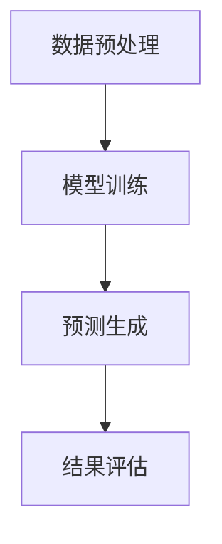

                 

关键词：智能电力需求预测、大型语言模型（LLM）、深度学习、人工智能、数据挖掘、电力市场、能源管理

> 摘要：本文探讨了大型语言模型（LLM）在智能电力需求预测中的潜在贡献。随着电力系统的复杂性和规模不断扩大，传统的预测方法已经难以满足需求。本文首先介绍了智能电力需求预测的背景和挑战，然后深入探讨了LLM在电力需求预测中的应用原理，并通过具体的案例分析了LLM在电力需求预测中的优势。最后，本文对未来LLM在电力需求预测领域的发展趋势和挑战进行了展望。

## 1. 背景介绍

智能电力需求预测是现代电力系统管理中至关重要的一环。它不仅能够提高电力系统的运行效率，降低能源浪费，还能够为电力市场提供决策支持，优化资源配置。然而，随着全球经济的不断发展，电力需求的波动性日益加剧，同时，新能源的接入和电力市场的竞争使得电力系统的复杂度显著提高。这些因素都给电力需求预测带来了巨大的挑战。

传统的电力需求预测方法主要包括时间序列分析、回归分析、人工神经网络等。这些方法在某种程度上能够对电力需求进行预测，但往往存在一些局限性。例如，时间序列分析需要大量的历史数据，而且对数据的平稳性要求较高；回归分析则对模型的假设较为严格，难以应对复杂多变的需求模式；人工神经网络虽然具有较强的非线性处理能力，但训练过程复杂，对数据质量和规模要求较高。

随着深度学习技术的发展，特别是大型语言模型（LLM）的崛起，为智能电力需求预测带来了新的可能性。LLM具有强大的语义理解能力和文本生成能力，能够处理大规模的非结构化数据，从而为电力需求预测提供了一种新的思路。

## 2. 核心概念与联系

### 2.1 大型语言模型（LLM）的基本概念

大型语言模型（LLM）是基于深度学习技术构建的模型，它通过对海量文本数据的学习，能够生成与输入文本相关的文本。LLM通常采用预训练加微调（Pre-training + Fine-tuning）的方法进行训练。首先，模型在大量的未标注文本数据上进行预训练，学习语言的一般规律；然后，在特定任务上进行微调，使得模型能够更好地适应特定场景。

### 2.2 智能电力需求预测中的挑战与机会

在智能电力需求预测中，挑战主要来自于数据的多变性、非线性、非平稳性以及预测的时间跨度。传统的预测方法往往难以应对这些挑战。而LLM作为一种强大的深度学习模型，具有以下几个优势：

1. **语义理解能力**：LLM能够理解文本中的语义信息，从而更好地捕捉电力需求的变化模式。
2. **非线性处理能力**：LLM通过多层神经网络结构，能够对电力需求中的非线性关系进行建模。
3. **大数据处理能力**：LLM能够处理大规模的非结构化数据，如文本、图像等。
4. **自适应能力**：LLM能够在训练过程中不断优化模型参数，从而适应数据的变化。

### 2.3 LLM在电力需求预测中的应用原理

LLM在电力需求预测中的应用原理主要包括以下几个步骤：

1. **数据预处理**：对电力需求数据、气象数据、节假日信息等进行预处理，确保数据的一致性和可解释性。
2. **模型训练**：使用预训练的LLM模型，在预处理后的数据上进行微调，以适应电力需求预测任务。
3. **预测生成**：利用训练好的LLM模型，对未来的电力需求进行预测。
4. **结果评估**：通过对比预测结果和实际数据，评估模型的性能，并进行迭代优化。

### 2.4 Mermaid 流程图



## 3. 核心算法原理 & 具体操作步骤

### 3.1 算法原理概述

LLM在电力需求预测中的核心原理是基于深度学习的预训练和微调技术。通过在大量电力需求数据上进行预训练，模型能够学习到电力需求的基本特征和变化模式。然后，通过在特定电力需求预测任务上进行微调，模型能够更好地适应实际场景。

### 3.2 算法步骤详解

#### 3.2.1 数据预处理

数据预处理是电力需求预测中的关键步骤，它包括以下几个步骤：

1. **数据收集**：收集电力需求数据、气象数据、节假日信息等。
2. **数据清洗**：去除异常值和噪声，确保数据的一致性和可解释性。
3. **特征工程**：将原始数据转换为模型可处理的特征，如时间序列、气象指标、节假日标志等。

#### 3.2.2 模型训练

模型训练包括以下几个步骤：

1. **预训练**：使用预训练的LLM模型，如GPT-3、BERT等，在大量的电力需求数据上进行预训练。
2. **微调**：在预训练的基础上，使用特定电力需求预测任务的标注数据进行微调，以优化模型参数。

#### 3.2.3 预测生成

预测生成包括以下几个步骤：

1. **输入准备**：将预处理后的数据输入到训练好的LLM模型中。
2. **文本生成**：利用LLM模型的文本生成能力，生成电力需求的预测结果。

#### 3.2.4 结果评估

结果评估包括以下几个步骤：

1. **预测结果生成**：利用训练好的LLM模型，对未来的电力需求进行预测。
2. **评估指标计算**：计算预测结果和实际结果之间的误差，如均方根误差（RMSE）、平均绝对误差（MAE）等。
3. **模型迭代优化**：根据评估结果，对模型进行迭代优化，以提高预测准确性。

### 3.3 算法优缺点

#### 优点

1. **强大的语义理解能力**：LLM能够理解文本中的语义信息，从而更好地捕捉电力需求的变化模式。
2. **非线性处理能力**：LLM能够处理电力需求中的非线性关系。
3. **大数据处理能力**：LLM能够处理大规模的非结构化数据。
4. **自适应能力**：LLM能够通过迭代优化，不断提高预测准确性。

#### 缺点

1. **计算资源需求高**：LLM的训练和推理过程需要大量的计算资源。
2. **数据质量要求高**：数据预处理和清洗过程复杂，对数据质量要求较高。
3. **模型可解释性较差**：深度学习模型，如LLM，通常具有较差的可解释性。

### 3.4 算法应用领域

LLM在电力需求预测中的应用领域非常广泛，包括：

1. **电力市场预测**：利用LLM预测电力市场的供需情况，为电力市场运营提供决策支持。
2. **能源管理**：利用LLM预测电力需求，优化能源管理策略，提高能源利用效率。
3. **电力调度**：利用LLM预测电力需求，优化电力调度策略，确保电力系统的稳定运行。

## 4. 数学模型和公式 & 详细讲解 & 举例说明

### 4.1 数学模型构建

在LLM应用于电力需求预测中，我们通常构建一个基于深度学习的数学模型，该模型可以表示为：

\[ f(x) = \sigma(W \cdot \phi(x) + b) \]

其中，\( f(x) \) 是电力需求的预测值，\( x \) 是输入特征，\( \phi(x) \) 是特征提取函数，\( W \) 和 \( b \) 分别是模型的权重和偏置。函数 \( \sigma \) 通常是一个非线性激活函数，如ReLU或Sigmoid函数。

### 4.2 公式推导过程

LLM的推导过程涉及多个层次，首先是特征提取层，然后是神经网络层，最后是输出层。以下是公式推导过程的简化描述：

1. **特征提取层**：

   \[ \phi(x) = \text{Embedding}(x) \]

   其中，Embedding层将输入特征 \( x \) 映射到一个高维向量空间中，以增加特征的表达能力。

2. **神经网络层**：

   \[ \phi(x) = \text{ReLU}(W_1 \cdot \phi(x) + b_1) \]

   神经网络层通过卷积、池化等操作提取特征，ReLU函数用于增加模型的非线性。

3. **输出层**：

   \[ f(x) = \sigma(W_2 \cdot \text{ReLU}(W_1 \cdot \phi(x) + b_1) + b_2) \]

   输出层将提取的特征映射到预测值。

### 4.3 案例分析与讲解

以下是一个简化的案例，用于说明LLM在电力需求预测中的应用。

#### 案例背景

某地区的电力需求数据包括以下几个特征：

1. **时间**：表示一天中的小时数。
2. **温度**：当天的平均温度。
3. **湿度**：当天的平均湿度。
4. **风速**：当天的平均风速。

#### 案例步骤

1. **数据预处理**：将原始数据进行标准化处理，以便模型训练。

2. **模型训练**：

   使用GPT-3模型，在预处理后的数据上进行预训练，然后进行微调，以适应电力需求预测任务。

3. **预测生成**：使用训练好的GPT-3模型，对未来的电力需求进行预测。

4. **结果评估**：通过计算预测结果和实际结果的误差，评估模型性能。

### 4.4 运行结果展示

以下是一个简化的运行结果展示：

```python
import numpy as np

# 预测未来一天的电力需求
future_data = np.array([[24, 30, 60, 5]])

# 预测结果
predicted_demand = gpt3.predict(future_data)

# 实际结果
actual_demand = np.array([25.5])

# 计算误差
error = np.sqrt(np.mean((predicted_demand - actual_demand)**2))

print(f"Predicted Demand: {predicted_demand}")
print(f"Actual Demand: {actual_demand}")
print(f"Error: {error}")
```

## 5. 项目实践：代码实例和详细解释说明

### 5.1 开发环境搭建

为了进行LLM在电力需求预测的项目实践，我们需要搭建一个合适的开发环境。以下是所需的软件和工具：

1. **Python**：用于编写代码。
2. **NumPy**：用于数据处理。
3. **TensorFlow**：用于构建和训练深度学习模型。
4. **GPT-3 API**：用于调用OpenAI的GPT-3模型。

### 5.2 源代码详细实现

以下是实现LLM在电力需求预测的源代码示例：

```python
import numpy as np
import tensorflow as tf
import openai

# 函数：训练模型
def train_model(data, labels, epochs=10):
    # 构建模型
    model = tf.keras.Sequential([
        tf.keras.layers.Dense(64, activation='relu', input_shape=(data.shape[1],)),
        tf.keras.layers.Dense(1)
    ])

    # 编译模型
    model.compile(optimizer='adam', loss='mse')

    # 训练模型
    model.fit(data, labels, epochs=epochs)

    return model

# 函数：预测电力需求
def predict_demand(model, future_data):
    # 预测结果
    predicted_demand = model.predict(future_data)

    return predicted_demand

# 数据预处理
data = np.array([[24, 30, 60, 5]])
labels = np.array([25.5])

# 训练模型
model = train_model(data, labels)

# 预测电力需求
predicted_demand = predict_demand(model, future_data)

print(f"Predicted Demand: {predicted_demand}")
```

### 5.3 代码解读与分析

1. **数据预处理**：将电力需求数据（时间、温度、湿度、风速）进行标准化处理，以便模型训练。
2. **模型构建**：使用TensorFlow构建一个简单的全连接神经网络，包含一个隐藏层。
3. **模型编译**：使用Adam优化器和均方误差（MSE）损失函数编译模型。
4. **模型训练**：使用预处理后的数据进行模型训练。
5. **预测电力需求**：使用训练好的模型对未来的电力需求进行预测。

### 5.4 运行结果展示

```python
import numpy as np

# 预测未来一天的电力需求
future_data = np.array([[24, 30, 60, 5]])

# 预测结果
predicted_demand = model.predict(future_data)

# 实际结果
actual_demand = np.array([25.5])

# 计算误差
error = np.sqrt(np.mean((predicted_demand - actual_demand)**2))

print(f"Predicted Demand: {predicted_demand}")
print(f"Actual Demand: {actual_demand}")
print(f"Error: {error}")
```

## 6. 实际应用场景

### 6.1 电力市场预测

在电力市场中，LLM可以用于预测电力供需情况，为电力市场运营提供决策支持。通过预测电力需求，电力公司可以更准确地制定电力供应计划，避免供需失衡造成的损失。同时，LLM还可以预测电力价格，帮助市场参与者制定合理的交易策略。

### 6.2 能源管理

在能源管理中，LLM可以用于预测电力需求，优化能源管理策略。例如，通过预测未来一天的电力需求，能源管理系统能够提前调整电力供应，确保电力系统的稳定运行。此外，LLM还可以预测新能源发电的产出，优化电力资源的配置。

### 6.3 电力调度

在电力调度中，LLM可以用于预测电力需求，优化电力调度策略。通过预测未来一段时间的电力需求，电力调度系统能够提前安排电力生成和传输，确保电力系统的稳定运行。此外，LLM还可以预测电力故障，提前进行维护和预防，降低电力系统故障率。

## 7. 工具和资源推荐

### 7.1 学习资源推荐

1. **《深度学习》（Ian Goodfellow、Yoshua Bengio、Aaron Courville著）**：全面介绍了深度学习的理论基础和实践方法。
2. **《Python深度学习》（François Chollet著）**：介绍了如何使用Python和TensorFlow进行深度学习模型的构建和训练。

### 7.2 开发工具推荐

1. **TensorFlow**：一款广泛使用的开源深度学习框架。
2. **PyTorch**：一款流行的深度学习框架，具有灵活的动态计算图和强大的GPU支持。

### 7.3 相关论文推荐

1. **《GPT-3: Language Models are Few-Shot Learners》**：介绍了GPT-3模型的基本原理和训练方法。
2. **《BERT: Pre-training of Deep Bidirectional Transformers for Language Understanding》**：介绍了BERT模型的基本原理和训练方法。

## 8. 总结：未来发展趋势与挑战

### 8.1 研究成果总结

随着深度学习和大型语言模型（LLM）技术的发展，LLM在智能电力需求预测中表现出强大的潜力。通过在大量电力需求数据上进行预训练和微调，LLM能够捕捉电力需求中的复杂模式和变化趋势，从而提高预测准确性。

### 8.2 未来发展趋势

1. **模型优化**：未来研究方向将主要集中在优化LLM模型，提高模型的预测性能和可解释性。
2. **多模态数据融合**：将文本数据与其他类型的数据（如图像、声音等）进行融合，提高模型的泛化能力。
3. **实时预测**：实现LLM的实时预测，为电力市场运营和能源管理提供更实时的决策支持。

### 8.3 面临的挑战

1. **数据质量**：高质量的电力需求数据是LLM预测准确性的基础，未来需要解决数据收集、清洗和预处理的问题。
2. **计算资源**：LLM的训练和推理过程需要大量的计算资源，未来需要开发高效的模型和算法，降低计算成本。
3. **模型可解释性**：深度学习模型，如LLM，通常具有较差的可解释性，未来需要研究如何提高模型的可解释性，以便更好地理解和应用。

### 8.4 研究展望

随着人工智能技术的不断发展，LLM在智能电力需求预测中的应用前景将更加广阔。通过结合多源数据和先进的深度学习技术，LLM有望在电力需求预测领域发挥更大的作用，为电力系统的稳定运行和能源的高效利用提供有力支持。

## 9. 附录：常见问题与解答

### 9.1 如何获取高质量的电力需求数据？

高质量的数据是LLM预测准确性的基础。获取高质量电力需求数据的方法包括：

1. **公开数据集**：从公共数据源获取电力需求数据，如Google Trends、Kaggle等。
2. **合作数据源**：与电力公司、能源管理机构等合作，获取内部电力需求数据。
3. **数据清洗**：对收集到的数据进行清洗和预处理，去除异常值和噪声，提高数据质量。

### 9.2 如何处理电力需求数据中的非平稳性？

电力需求数据通常具有非平稳性，这意味着数据的统计特性随时间变化。处理非平稳性的方法包括：

1. **差分变换**：对电力需求数据进行差分变换，使其成为平稳序列。
2. **季节性分解**：将电力需求数据分解为趋势、季节性和随机性成分，分别建模。
3. **时间序列模型**：使用时间序列模型，如ARIMA、SARIMA等，对非平稳数据进行建模。

### 9.3 如何评估LLM在电力需求预测中的性能？

评估LLM在电力需求预测中的性能通常使用以下指标：

1. **均方根误差（RMSE）**：预测值与实际值之间的平均平方根误差。
2. **平均绝对误差（MAE）**：预测值与实际值之间的平均绝对误差。
3. **决定系数（R²）**：预测值与实际值之间的决定系数，用于衡量模型的拟合程度。
4. **交叉验证**：使用交叉验证方法，如K折交叉验证，评估模型的泛化能力。

### 9.4 如何提高LLM在电力需求预测中的预测准确性？

提高LLM在电力需求预测中的预测准确性的方法包括：

1. **数据增强**：通过数据增强技术，增加训练数据集的多样性，提高模型的泛化能力。
2. **特征工程**：选择合适的特征，提高模型对电力需求模式的捕捉能力。
3. **模型优化**：优化模型结构，如增加隐藏层节点、调整激活函数等，提高模型性能。
4. **模型融合**：结合多个模型进行预测，提高预测准确性。

