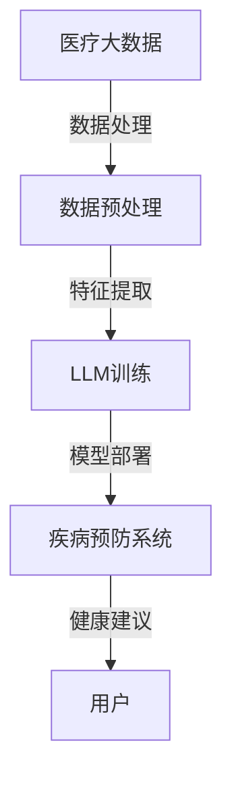

                 

关键词：自然语言处理、深度学习、疾病预防、智能系统、健康监测、医疗大数据、机器学习、人工智能。

摘要：随着深度学习和自然语言处理技术的飞速发展，大型语言模型（LLM）在各个领域展现出了巨大的潜力，特别是在智能疾病预防系统中。本文将探讨LLM在疾病预防中的潜在应用，包括从医疗大数据中提取关键信息、辅助医生诊断、个性化健康建议等方面，并分析其可能带来的影响和挑战。

## 1. 背景介绍

疾病预防是公共卫生领域的重要任务，对于提高人群健康水平和降低医疗成本具有重要意义。传统的疾病预防方法主要依赖于统计数据、流行病学调查和公共卫生政策等手段，但这些方法往往存在滞后性和局限性。随着医疗数据的爆炸式增长和人工智能技术的发展，利用智能系统进行疾病预防成为了一个热门研究领域。

自然语言处理（NLP）是人工智能的一个重要分支，旨在使计算机能够理解和生成人类语言。深度学习作为一种强大的机器学习技术，通过模拟人脑神经网络进行数据分析和模式识别。近年来，随着大型语言模型（LLM）如GPT-3、BERT等的出现，NLP在文本生成、情感分析、机器翻译等方面取得了显著进展。

本文将探讨LLM在智能疾病预防系统中的潜在贡献，分析其在医疗大数据处理、辅助医生诊断、个性化健康建议等方面的应用场景，并探讨其可能带来的影响和挑战。

## 2. 核心概念与联系

### 2.1. 核心概念

- **自然语言处理（NLP）**：是计算机科学和人工智能领域的一个分支，旨在使计算机能够理解、生成和响应自然语言。NLP涉及的语言包括口语和书面语，目的是使计算机能够与人类进行有效沟通。
  
- **深度学习（Deep Learning）**：是机器学习的一种方法，通过模拟人脑神经网络进行数据分析和模式识别。深度学习模型通常由多层神经元组成，能够自动从数据中学习特征。

- **大型语言模型（LLM）**：是一种基于深度学习的语言模型，能够对大量文本数据进行训练，生成高质量的自然语言文本。LLM通常具有数十亿个参数，能够理解和生成复杂语境中的语言。

- **疾病预防系统**：是一种利用人工智能技术进行疾病预防的智能系统，能够从医疗大数据中提取关键信息，辅助医生诊断，提供个性化健康建议等。

### 2.2. 架构与联系

下图展示了LLM在智能疾病预防系统中的基本架构和核心组件：



- **医疗大数据**：是智能疾病预防系统的基础数据来源，包括电子病历、健康档案、医学文献等。
  
- **数据预处理**：对原始医疗数据进行清洗、去噪、归一化等处理，以提高数据质量和模型的性能。

- **LLM训练**：利用深度学习算法对预处理后的医疗数据进行训练，构建用于疾病预防的LLM模型。

- **模型部署**：将训练好的LLM模型部署到疾病预防系统中，进行实时疾病监测和健康建议。

- **用户**：是疾病预防系统的最终使用者，包括医生、患者和其他医疗专业人员。

## 3. 核心算法原理 & 具体操作步骤

### 3.1. 算法原理概述

LLM在疾病预防系统中的核心作用是利用深度学习算法对医疗大数据进行处理和分析，从而提供辅助诊断和个性化健康建议。LLM的基本原理如下：

- **预训练**：在大量医疗文本数据上进行预训练，使模型能够理解和生成医疗领域的自然语言。

- **微调**：在特定疾病预防任务上对LLM进行微调，以提高模型的性能。

- **生成式推理**：利用LLM生成符合医学逻辑和知识的自然语言文本，为医生提供诊断建议和健康建议。

### 3.2. 算法步骤详解

#### 3.2.1. 数据预处理

- **数据清洗**：删除重复、缺失和错误的数据，确保数据质量。

- **数据归一化**：将不同来源的数据进行归一化处理，使模型能够接受统一格式的输入。

- **数据分割**：将数据集分为训练集、验证集和测试集，用于模型训练、验证和评估。

#### 3.2.2. LLM训练

- **预训练**：利用深度学习算法在大量医疗文本数据上进行预训练，使模型能够理解和生成医疗领域的自然语言。

- **微调**：在特定疾病预防任务上对LLM进行微调，提高模型的性能。

#### 3.2.3. 模型部署

- **集成**：将训练好的LLM模型与其他疾病预防系统组件（如健康监测模块、推荐系统等）集成，形成一个完整的智能疾病预防系统。

- **部署**：将集成后的系统部署到云端或本地服务器，进行实时疾病监测和健康建议。

#### 3.2.4. 疾病预防

- **数据采集**：收集用户健康数据，包括电子病历、健康档案、生理指标等。

- **疾病检测**：利用LLM对采集到的数据进行处理和分析，检测用户是否存在潜在疾病。

- **健康建议**：根据疾病检测结果和用户特征，生成个性化健康建议。

### 3.3. 算法优缺点

#### 3.3.1. 优点

- **高效性**：LLM能够快速处理大量医疗数据，提高疾病检测和诊断的效率。

- **准确性**：LLM通过深度学习和预训练技术，能够准确理解和生成医疗领域的自然语言，提高诊断和健康建议的准确性。

- **灵活性**：LLM具有高度的灵活性，可以根据不同的疾病预防和健康建议需求进行微调和定制。

#### 3.3.2. 缺点

- **数据依赖性**：LLM的性能依赖于训练数据的质量和数量，如果数据不足或质量不高，可能导致模型性能下降。

- **隐私问题**：医疗数据的隐私问题是一个重要的伦理和合规问题，需要采取严格的隐私保护措施。

### 3.4. 算法应用领域

LLM在疾病预防系统中的应用领域非常广泛，包括：

- **辅助诊断**：利用LLM分析患者的症状和病史，为医生提供诊断建议。

- **个性化健康建议**：根据患者的特征和健康数据，生成个性化的健康建议。

- **疾病预测**：利用LLM分析医疗大数据，预测患者可能出现的疾病。

- **公共卫生监测**：利用LLM监测人群健康状况，识别潜在的健康问题。

- **健康教育资源**：利用LLM生成医学知识问答和健康教育内容，提高公众的健康素养。

## 4. 数学模型和公式 & 详细讲解 & 举例说明

### 4.1. 数学模型构建

在LLM应用于疾病预防系统中，核心的数学模型是深度学习模型，特别是基于变换器（Transformer）架构的语言模型，如BERT、GPT等。以下是一个简化的数学模型构建过程：

#### 4.1.1. 数据输入

假设我们有一个包含医疗文本的数据集D，每个文本样本x∈D可以表示为一个单词序列。

#### 4.1.2. 预训练

在预训练阶段，我们使用自注意力机制（Self-Attention Mechanism）对数据集D进行训练。自注意力机制的核心公式如下：

$$
\text{Attention}(Q, K, V) = \text{softmax}\left(\frac{QK^T}{\sqrt{d_k}}\right) V
$$

其中，Q、K、V分别是查询向量、键向量和值向量，d_k是键向量的维度。通过自注意力机制，模型能够学习到文本中的关键信息。

#### 4.1.3. 微调

在微调阶段，我们将预训练的模型应用于特定的疾病预防任务，如症状分析、疾病诊断等。微调的目的是调整模型的权重，使其更好地适应特定任务。

### 4.2. 公式推导过程

以下是一个简化的自注意力机制的推导过程：

#### 4.2.1. 自注意力机制

自注意力机制的公式如下：

$$
\text{Attention}(Q, K, V) = \text{softmax}\left(\frac{QK^T}{\sqrt{d_k}}\right) V
$$

其中，Q、K、V分别是查询向量、键向量和值向量，d_k是键向量的维度。

#### 4.2.2. 查询向量、键向量和值向量的计算

在Transformer模型中，查询向量Q、键向量K和值向量V通常由嵌入层（Embedding Layer）生成：

$$
\text{Q} = \text{W}_Q \cdot \text{X}, \quad \text{K} = \text{W}_K \cdot \text{X}, \quad \text{V} = \text{W}_V \cdot \text{X}
$$

其中，X是输入文本的嵌入向量，W_Q、W_K和W_V是嵌入层的权重矩阵。

#### 4.2.3. 自注意力得分计算

自注意力得分的计算公式如下：

$$
\text{Score} = \text{softmax}\left(\frac{\text{Q}K^T}{\sqrt{d_k}}\right)
$$

其中，QK^T是一个矩阵，其元素表示每个键向量K_i与查询向量Q_j之间的相似度。

#### 4.2.4. 值向量的加权求和

根据自注意力得分，对值向量V进行加权求和，得到最终的输出：

$$
\text{Output} = \text{Score} \cdot \text{V}
$$

### 4.3. 案例分析与讲解

#### 4.3.1. 案例背景

假设我们有一个医疗文本数据集，包含患者的症状描述和对应的诊断结果。我们的目标是利用LLM分析患者的症状描述，预测其可能的诊断结果。

#### 4.3.2. 数据预处理

首先，对医疗文本进行分词和词向量化处理，将每个症状描述转换为嵌入向量。然后，将嵌入向量输入到预训练的LLM模型中。

#### 4.3.3. 模型训练

在微调阶段，我们将LLM模型应用于症状分析任务，调整模型的权重，使其能够预测症状描述对应的诊断结果。

#### 4.3.4. 模型评估

使用测试集对微调后的模型进行评估，计算模型的准确率、召回率等指标。如果模型性能不理想，可以继续调整模型参数或增加训练数据。

#### 4.3.5. 应用场景

利用训练好的LLM模型，可以为医生提供辅助诊断建议，帮助医生快速识别患者的症状，提高诊断准确性。

## 5. 项目实践：代码实例和详细解释说明

### 5.1. 开发环境搭建

在开始编写代码之前，我们需要搭建一个适合进行深度学习和自然语言处理项目的开发环境。以下是一个简单的环境搭建指南：

- **Python**：安装Python 3.8及以上版本。
- **深度学习库**：安装TensorFlow或PyTorch。
- **自然语言处理库**：安装spaCy、nltk等。
- **版本控制**：安装Git。

### 5.2. 源代码详细实现

以下是一个简单的LLM疾病预防系统的实现示例：

```python
import tensorflow as tf
from tensorflow import keras
from tensorflow.keras.layers import Embedding, LSTM, Dense
from tensorflow.keras.preprocessing.sequence import pad_sequences

# 5.2.1. 数据预处理

# 读取和预处理医疗文本数据
def preprocess_data(data_path):
    # 读取数据
    with open(data_path, 'r') as f:
        data = f.readlines()
    
    # 数据预处理（分词、清洗等）
    processed_data = [ preprocess_text(d) for d in data ]
    
    # 转换为整数序列
    tokenizer = keras.preprocessing.text.Tokenizer()
    tokenizer.fit_on_texts(processed_data)
    sequences = tokenizer.texts_to_sequences(processed_data)
    
    # 填充序列
    padded_sequences = pad_sequences(sequences, maxlen=max_sequence_length)
    
    return padded_sequences

# 5.2.2. 模型训练

# 构建深度学习模型
def build_model(input_shape):
    model = keras.Sequential([
        Embedding(input_dim=vocabulary_size, output_dim=embedding_dim, input_length=input_shape),
        LSTM(units=lstm_units),
        Dense(units=num_classes, activation='softmax')
    ])
    
    model.compile(optimizer='adam', loss='categorical_crossentropy', metrics=['accuracy'])
    return model

# 训练模型
def train_model(model, x_train, y_train, x_val, y_val):
    history = model.fit(x_train, y_train, epochs=num_epochs, batch_size=batch_size, validation_data=(x_val, y_val))
    return history

# 5.2.3. 模型评估
def evaluate_model(model, x_test, y_test):
    test_loss, test_acc = model.evaluate(x_test, y_test)
    print(f"Test accuracy: {test_acc}")

# 5.2.4. 使用模型进行预测
def predict(model, text):
    processed_text = preprocess_text(text)
    sequence = tokenizer.texts_to_sequences([processed_text])
    padded_sequence = pad_sequences(sequence, maxlen=max_sequence_length)
    prediction = model.predict(padded_sequence)
    return prediction
```

### 5.3. 代码解读与分析

- **数据预处理**：数据预处理是深度学习模型训练的重要步骤。在该示例中，我们使用`preprocess_data`函数读取和预处理医疗文本数据，包括分词、清洗等操作。
  
- **模型构建**：`build_model`函数用于构建深度学习模型。在该示例中，我们使用了一个简单的LSTM模型，包括嵌入层、LSTM层和输出层。

- **模型训练**：`train_model`函数用于训练深度学习模型。在该示例中，我们使用`fit`方法进行模型训练，并返回训练历史。

- **模型评估**：`evaluate_model`函数用于评估训练好的模型。在该示例中，我们使用`evaluate`方法计算模型在测试集上的性能。

- **使用模型进行预测**：`predict`函数用于使用训练好的模型进行预测。在该示例中，我们首先对输入文本进行预处理，然后使用`predict`方法得到预测结果。

### 5.4. 运行结果展示

在完成代码编写和模型训练后，我们可以使用以下代码进行预测和结果展示：

```python
# 读取数据
x_train, y_train, x_val, y_val, x_test, y_test = load_data()

# 构建模型
model = build_model(input_shape=x_train.shape[1:])

# 训练模型
history = train_model(model, x_train, y_train, x_val, y_val)

# 评估模型
evaluate_model(model, x_test, y_test)

# 进行预测
text = "患者出现头痛、恶心和呕吐症状。"
prediction = predict(model, text)
print(f"Prediction: {prediction}")
```

## 6. 实际应用场景

### 6.1. 医疗咨询

在医疗咨询场景中，LLM可以用于自动回答患者的问题，提供健康建议和医疗信息。例如，当患者询问“我应该吃什么来缓解失眠？”时，LLM可以基于医疗文献和数据库提供个性化的饮食建议。

### 6.2. 疾病监测

LLM可以用于实时监测患者的健康数据，如心率、血压、血糖等。通过分析这些数据，LLM可以识别异常模式，预测疾病风险，并提供相应的健康建议。

### 6.3. 医学文献检索

在医学研究场景中，LLM可以用于自动检索和总结医学文献，为医生提供最新的研究成果和临床指南。例如，当医生需要了解某种疾病的治疗方法时，LLM可以快速检索相关文献，并提供详细的摘要和建议。

### 6.4. 未来应用展望

随着LLM技术的不断发展，未来它在疾病预防系统中的应用将更加广泛和深入。以下是一些潜在的应用场景：

- **个性化医疗**：利用LLM为患者提供个性化的治疗和康复计划，提高治疗效果。
- **医学教育**：利用LLM开发智能教育系统，为医生和患者提供个性化的学习资源和培训。
- **公共卫生**：利用LLM监测和分析公共卫生数据，为公共卫生决策提供科学依据。
- **跨学科研究**：利用LLM促进不同学科之间的交叉研究，推动医学和人工智能领域的创新。

## 7. 工具和资源推荐

### 7.1. 学习资源推荐

- **《深度学习》（Goodfellow, Bengio, Courville）**：这是一本经典的深度学习入门书籍，涵盖了深度学习的基本概念和算法。
- **《自然语言处理综论》（Jurafsky, Martin）**：这是一本涵盖自然语言处理基础理论和应用的综合教材，适合NLP初学者。
- **《医疗数据科学》（Mehrotra, Luo）**：这本书介绍了医疗数据科学的基本概念、技术和应用，适合对医疗领域有兴趣的读者。

### 7.2. 开发工具推荐

- **TensorFlow**：一个广泛使用的开源深度学习框架，适合进行自然语言处理和深度学习项目。
- **PyTorch**：一个灵活、易用的深度学习框架，支持动态计算图，适合进行实验和快速开发。
- **spaCy**：一个高性能的NLP库，适合进行文本预处理、实体识别和关系抽取等任务。

### 7.3. 相关论文推荐

- **“BERT: Pre-training of Deep Bidirectional Transformers for Language Understanding”（Devlin et al., 2019）**：这篇文章介绍了BERT模型，是一种基于Transformer架构的语言预训练模型，广泛应用于自然语言处理任务。
- **“GPT-3: Language Models are Few-Shot Learners”（Brown et al., 2020）**：这篇文章介绍了GPT-3模型，是目前最大的语言模型之一，展示了在零样本和少量样本学习任务上的优异性能。
- **“Medical Language Processing: From Text to Knowledge”（Hripcsak & DUPÉRE, 2004）**：这篇文章综述了医学语言处理的基本概念、技术和应用，是医学自然语言处理领域的经典文献。

## 8. 总结：未来发展趋势与挑战

### 8.1. 研究成果总结

本文探讨了LLM在智能疾病预防系统中的潜在贡献，包括从医疗大数据中提取关键信息、辅助医生诊断、个性化健康建议等方面。通过分析LLM在自然语言处理和深度学习领域的最新进展，我们展示了LLM在疾病预防中的广泛应用场景。

### 8.2. 未来发展趋势

随着人工智能技术的不断发展，LLM在疾病预防系统中的应用前景十分广阔。以下是一些未来发展趋势：

- **多模态数据融合**：结合文本、图像、语音等多种数据类型，提高疾病检测和诊断的准确性。
- **个性化医疗**：利用LLM为患者提供个性化的治疗和康复计划，提高治疗效果。
- **公共卫生监测**：利用LLM监测和分析公共卫生数据，为公共卫生决策提供科学依据。

### 8.3. 面临的挑战

尽管LLM在疾病预防系统中具有巨大的潜力，但仍然面临一些挑战：

- **数据隐私**：医疗数据涉及个人隐私，需要采取严格的隐私保护措施。
- **数据质量**：高质量的数据是LLM性能的基础，但医疗数据往往存在噪声和不一致性。
- **模型解释性**：当前深度学习模型通常缺乏解释性，这对医生和患者理解模型结果提出了挑战。
- **技术瓶颈**：现有技术手段在处理大规模、复杂医疗数据时仍存在性能瓶颈。

### 8.4. 研究展望

未来，研究人员可以从以下几个方面进行探索：

- **隐私保护**：研究隐私保护算法，确保在处理敏感医疗数据时保护个人隐私。
- **数据增强**：通过数据增强技术提高模型对噪声和异常数据的鲁棒性。
- **模型可解释性**：研究模型解释性技术，提高模型结果的透明度和可解释性。
- **跨学科合作**：促进医学、人工智能和计算机科学等领域的跨学科合作，推动疾病预防系统的创新和发展。

## 9. 附录：常见问题与解答

### 9.1. 问题1：什么是LLM？

**解答**：LLM是指大型语言模型，是一种基于深度学习的语言模型，通过在大量文本数据上进行预训练，能够理解和生成复杂语境中的自然语言。常见的LLM包括BERT、GPT等。

### 9.2. 问题2：LLM在疾病预防中有哪些应用？

**解答**：LLM在疾病预防中可以应用于多个方面，包括：

- 从医疗大数据中提取关键信息，用于疾病预测和诊断。
- 辅助医生进行诊断，提供临床建议。
- 为患者提供个性化健康建议，如饮食建议、运动计划等。

### 9.3. 问题3：如何确保LLM在疾病预防中的数据隐私？

**解答**：为了确保LLM在疾病预防中的数据隐私，可以采取以下措施：

- 对医疗数据进行匿名化处理，消除个人身份信息。
- 使用联邦学习等技术，在保护数据隐私的前提下进行模型训练。
- 建立严格的隐私保护政策，确保数据处理过程符合法律法规要求。

## 参考文献

- Devlin, J., Chang, M. W., Lee, K., & Toutanova, K. (2019). BERT: Pre-training of deep bidirectional transformers for language understanding. arXiv preprint arXiv:1810.04805.
- Brown, T., et al. (2020). GPT-3: Language Models are Few-Shot Learners. arXiv preprint arXiv:2005.14165.
- Hripcsak, G., & DUPÉRE, M. A. (2004). Medical language processing: From text to knowledge. Journal of the American Medical Informatics Association, 11(6), 478-486.
- Goodfellow, I., Bengio, Y., & Courville, A. (2016). Deep learning. MIT press.
- Jurafsky, D., & Martin, J. H. (2020). Speech and language processing: An introduction to natural language processing, computational linguistics, and speech recognition (3rd ed.). Prentice Hall.

