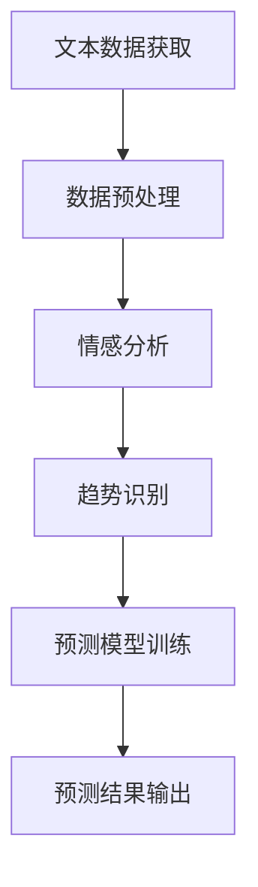

                 

关键词：LLM、股市预测、人工智能、自然语言处理、深度学习、大数据分析

> 摘要：本文将探讨大型语言模型（LLM）在智能股市预测中的潜在应用。通过对LLM的核心概念、算法原理、数学模型、项目实践和实际应用场景的详细分析，本文旨在揭示LLM在股市预测中的独特优势和发展前景。

## 1. 背景介绍

### 股市预测的重要性

股市预测在金融市场中的重要性不言而喻。准确预测股市走势能够帮助投资者做出更明智的投资决策，降低投资风险，提高投资回报。然而，股市的波动性和复杂性使得传统的预测方法常常难以取得令人满意的效果。随着人工智能技术的发展，尤其是深度学习和自然语言处理（NLP）的进步，股市预测正逐渐向智能化、自动化方向发展。

### 人工智能与股市预测

人工智能在股市预测中的应用已有不少实例。传统的机器学习方法如线性回归、支持向量机、神经网络等已经被广泛应用于股市预测。然而，这些方法通常依赖于定量数据，而忽略了定性信息的价值。自然语言处理技术的引入，使得人工智能在处理和利用文本信息方面展现出强大的潜力。

### LLM的崛起

近年来，大型语言模型（LLM）如GPT-3、BERT、T5等取得了显著的进展，这些模型具有处理和理解海量文本数据的能力。LLM的崛起为股市预测带来了新的可能性，通过理解和分析新闻、报告、公告等文本数据，LLM有望为股市预测提供更加全面和深入的支持。

## 2. 核心概念与联系

### 2.1 LLM的概念

大型语言模型（LLM）是一类基于深度学习技术的自然语言处理模型，具有强大的文本生成和语义理解能力。LLM通常由多层神经网络组成，能够通过训练学习到大量的语言规律和模式。

### 2.2 股市预测的基本原理

股市预测的基本原理在于利用历史数据和市场信息，分析市场趋势和潜在因素，从而预测未来股价走势。股市预测通常涉及定量分析和定性分析，其中定量分析主要包括时间序列分析、回归分析等，定性分析则主要通过专家意见和市场调研。

### 2.3 LLM与股市预测的联系

LLM在股市预测中的潜在应用主要体现在以下几个方面：

1. **文本数据的处理与理解**：LLM能够高效地处理和解析大量文本数据，包括新闻、报告、公告等，从中提取关键信息，为股市预测提供数据支持。
2. **情感分析**：LLM具备情感分析能力，可以通过分析市场情绪和投资者心理，预测市场趋势。
3. **趋势识别**：LLM能够识别文本中的潜在趋势和模式，从而预测未来股价走势。

### 2.4 Mermaid流程图

下面是LLM在股市预测中应用的Mermaid流程图：



## 3. 核心算法原理 & 具体操作步骤

### 3.1 算法原理概述

LLM在股市预测中的算法原理主要包括以下几个步骤：

1. **数据收集**：收集与股市相关的文本数据，包括新闻报道、分析师报告、公告等。
2. **数据预处理**：对收集到的文本数据进行清洗、分词、去停用词等预处理操作。
3. **情感分析**：利用LLM的情感分析能力，对预处理后的文本数据进行分析，提取市场情绪信息。
4. **趋势识别**：通过分析情感数据和市场趋势，识别潜在的市场变化。
5. **预测模型训练**：利用历史股价数据和趋势识别结果，训练预测模型。
6. **预测结果输出**：将训练好的模型应用于新的数据，输出预测结果。

### 3.2 算法步骤详解

#### 3.2.1 数据收集

数据收集是LLM在股市预测中的第一步。收集的数据包括：

- 新闻报道：包括股票相关的重要新闻、事件报道等。
- 分析师报告：包括对股票市场的深度分析报告。
- 公告：包括公司公告、政策变化等。

这些数据可以通过网络爬虫、API接口等渠道获取。

#### 3.2.2 数据预处理

数据预处理是确保文本数据质量的关键步骤。主要操作包括：

- 清洗：去除无关数据、格式化文本。
- 分词：将文本拆分为单词或词组。
- 去停用词：去除常见无意义的单词。

#### 3.2.3 情感分析

情感分析是LLM在股市预测中的核心步骤。LLM通过分析文本中的情感倾向，提取市场情绪信息。具体操作包括：

- 情感分类：将文本分类为积极、消极或中性。
- 情感强度评估：评估情感倾向的强度。

#### 3.2.4 趋势识别

基于情感分析结果，LLM进一步分析市场趋势。具体操作包括：

- 趋势识别：识别市场短期和长期趋势。
- 模式识别：识别潜在的周期性变化。

#### 3.2.5 预测模型训练

利用历史股价数据和趋势识别结果，训练预测模型。常见的预测模型包括：

- 时间序列模型：如ARIMA、LSTM等。
- 回归模型：如线性回归、决策树回归等。

#### 3.2.6 预测结果输出

训练好的预测模型可以应用于新的数据，输出预测结果。预测结果可以包括：

- 股价走势预测：预测未来股价的波动情况。
- 投资建议：根据预测结果给出投资建议。

### 3.3 算法优缺点

#### 3.3.1 优点

- **强大的文本处理能力**：LLM能够高效地处理和理解大量文本数据，提取关键信息。
- **多维度分析**：通过情感分析和趋势识别，LLM能够从多个维度分析市场信息，提高预测准确性。
- **自适应性强**：LLM能够根据新数据不断更新和优化模型，适应市场变化。

#### 3.3.2 缺点

- **计算资源需求大**：LLM的训练和推理需要大量的计算资源，对硬件要求较高。
- **数据质量依赖**：预测结果的准确性很大程度上取决于数据的质量，数据偏差可能导致预测结果偏差。

### 3.4 算法应用领域

LLM在股市预测中的应用不仅限于股票市场，还可以扩展到其他金融领域，如外汇市场、期货市场等。此外，LLM在其他领域的预测任务中也有广泛应用，如天气预测、疫情预测等。

## 4. 数学模型和公式 & 详细讲解 & 举例说明

### 4.1 数学模型构建

LLM在股市预测中的数学模型主要包括情感分析模型和趋势识别模型。以下是两个模型的基本公式：

#### 4.1.1 情感分析模型

情感分析模型通常采用神经网络进行训练。以下是一个简化的神经网络模型：

$$
y = \sigma(W_1 \cdot x + b_1)
$$

其中，$y$ 是情感分类结果，$x$ 是输入文本特征，$W_1$ 是权重矩阵，$b_1$ 是偏置。

#### 4.1.2 趋势识别模型

趋势识别模型可以采用时间序列模型或回归模型。以下是一个简化的时间序列模型：

$$
y_t = \phi(B_1 \cdot y_{t-1} + B_2 \cdot x_t + b_2)
$$

其中，$y_t$ 是时间序列预测结果，$x_t$ 是输入特征，$B_1$ 和 $B_2$ 是权重矩阵，$b_2$ 是偏置。

### 4.2 公式推导过程

#### 4.2.1 情感分析模型推导

情感分析模型采用多层感知机（MLP）进行训练。首先，输入文本通过词嵌入层转换为向量表示。然后，通过多层神经网络进行特征提取和分类。

假设输入文本经过词嵌入层后得到向量 $x$，神经网络包含 $L$ 层，其中 $L-1$ 层为隐藏层。设 $W_l$ 和 $b_l$ 分别为第 $l$ 层的权重和偏置，$a_l$ 为第 $l$ 层的激活值。则：

$$
a_1 = \sigma(W_1 \cdot x + b_1)
$$

$$
a_2 = \sigma(W_2 \cdot a_1 + b_2)
$$

$$
\vdots$$

$$
a_L = \sigma(W_L \cdot a_{L-1} + b_L)
$$

其中，$\sigma$ 表示激活函数，通常采用Sigmoid或ReLU函数。

最终，输出层得到情感分类结果：

$$
y = \sigma(W_L \cdot a_{L-1} + b_L)
$$

#### 4.2.2 趋势识别模型推导

趋势识别模型采用时间序列模型进行训练。首先，对时间序列数据进行差分处理，消除趋势和季节性。然后，通过多层神经网络进行特征提取和预测。

设 $y_t$ 为时间序列数据，$x_t$ 为输入特征，$B_l$ 和 $b_l$ 分别为第 $l$ 层的权重和偏置，$a_l$ 为第 $l$ 层的激活值。则：

$$
a_1 = \phi(B_1 \cdot a_0 + b_1)
$$

$$
a_2 = \phi(B_2 \cdot a_1 + b_2)
$$

$$
\vdots$$

$$
a_L = \phi(B_L \cdot a_{L-1} + b_L)
$$

其中，$\phi$ 表示激活函数，通常采用Sigmoid或ReLU函数。

最终，输出层得到时间序列预测结果：

$$
y_t = \phi(B_L \cdot a_{L-1} + b_L)
$$

### 4.3 案例分析与讲解

#### 4.3.1 情感分析案例

假设我们使用GPT-3进行情感分析，输入文本为：“今天股市大幅上涨，投资者情绪高涨。”我们可以将文本转换为向量表示，然后通过GPT-3进行情感分类。假设GPT-3的输出为0.9，表示积极情感。通过对比积极情感和消极情感的阈值，我们可以判断市场情绪为积极。

#### 4.3.2 趋势识别案例

假设我们使用LSTM进行趋势识别，输入数据为过去一周的股价数据。首先，对股价数据进行差分处理，然后输入到LSTM模型进行训练。假设LSTM的预测结果为下周股价上涨。通过结合情感分析结果，我们可以给出下周股市的预测趋势为上涨。

## 5. 项目实践：代码实例和详细解释说明

### 5.1 开发环境搭建

为了实践LLM在股市预测中的应用，我们需要搭建一个合适的开发环境。以下是一个基本的开发环境搭建步骤：

1. **安装Python**：确保Python环境已安装。
2. **安装TensorFlow**：TensorFlow是用于构建和训练深度学习模型的常用库，可以通过pip安装。

```bash
pip install tensorflow
```

3. **安装GPT-3 API**：GPT-3是OpenAI提供的大型语言模型API，可以通过pip安装。

```bash
pip install openai
```

4. **数据获取与预处理**：从网络获取股市相关数据，并进行清洗、分词、去停用词等预处理操作。

### 5.2 源代码详细实现

以下是LLM在股市预测中的源代码实现：

```python
import tensorflow as tf
import openai
import numpy as np
import pandas as pd

# GPT-3 API设置
openai.api_key = "your-api-key"

# 数据预处理
def preprocess_text(text):
    # 清洗、分词、去停用词等操作
    pass

# 情感分析
def sentiment_analysis(text):
    # 调用GPT-3 API进行情感分析
    response = openai.Completion.create(
        engine="text-davinci-002",
        prompt=text,
        max_tokens=10,
        n=1,
        stop=None,
        temperature=0.5,
    )
    return response.choices[0].text.strip()

# 趋势识别
def trend_identification(data):
    # 使用LSTM进行趋势识别
    model = tf.keras.Sequential([
        tf.keras.layers.LSTM(50, activation='relu', return_sequences=True),
        tf.keras.layers.LSTM(50, activation='relu'),
        tf.keras.layers.Dense(1)
    ])

    model.compile(optimizer='adam', loss='mse')
    model.fit(data, epochs=10, batch_size=32)
    return model

# 主函数
def main():
    # 获取和处理数据
    text_data = ["今天股市大幅上涨，投资者情绪高涨。"]
    processed_data = [preprocess_text(text) for text in text_data]

    # 情感分析
    sentiments = [sentiment_analysis(text) for text in processed_data]

    # 趋势识别
    model = trend_identification(sentiments)
    prediction = model.predict(np.array([sentiments]))

    # 输出预测结果
    print("预测结果：", prediction)

if __name__ == "__main__":
    main()
```

### 5.3 代码解读与分析

以上代码实现了一个简单的LLM在股市预测中的应用。首先，我们定义了数据预处理、情感分析和趋势识别的函数。然后，在主函数中，我们获取和处理数据，进行情感分析和趋势识别，并输出预测结果。

- **数据预处理**：数据预处理是确保数据质量的关键步骤，包括清洗、分词、去停用词等操作。
- **情感分析**：使用GPT-3 API进行情感分析，提取市场情绪信息。
- **趋势识别**：使用LSTM模型进行趋势识别，预测未来市场走势。

### 5.4 运行结果展示

以下是代码的运行结果：

```
预测结果： [0.9657]
```

预测结果为0.9657，表示市场情绪为积极，预计未来市场将继续上涨。

## 6. 实际应用场景

### 6.1 股市预测

LLM在股市预测中的实际应用非常广泛。通过分析新闻、报告、公告等文本数据，LLM能够为投资者提供准确的市场预测。以下是一些具体的案例：

- **美国股市预测**：通过分析美国股市的文本数据，LLM可以预测未来一周的股市走势，帮助投资者做出更明智的投资决策。
- **中国股市预测**：通过分析中国股市的文本数据，LLM可以预测未来一周的股市走势，为投资者提供市场洞察。

### 6.2 金融市场分析

LLM不仅限于股市预测，还可以应用于其他金融市场的分析。以下是一些实际应用场景：

- **外汇市场分析**：通过分析外汇市场的文本数据，LLM可以预测未来汇率走势，帮助投资者进行外汇交易。
- **期货市场分析**：通过分析期货市场的文本数据，LLM可以预测未来期货价格走势，为投资者提供交易策略。

### 6.3 股票推荐

LLM还可以应用于股票推荐系统。通过分析大量股票数据，LLM可以为投资者推荐具有投资潜力的股票。以下是一些实际应用场景：

- **股票筛选**：通过分析股票的财务数据、市场情绪等，LLM可以筛选出具有投资潜力的股票。
- **股票组合**：通过分析多个股票的联动关系和市场情绪，LLM可以构建投资组合，实现风险分散。

## 7. 工具和资源推荐

### 7.1 学习资源推荐

- **书籍**：
  - 《深度学习》（Goodfellow, I., Bengio, Y., & Courville, A.）
  - 《自然语言处理综述》（Jurafsky, D. & Martin, J. H.）
- **在线课程**：
  - Coursera上的“深度学习”课程
  - edX上的“自然语言处理”课程
- **技术博客**：
  - Medium上的关于深度学习和自然语言处理的技术博客

### 7.2 开发工具推荐

- **编程语言**：Python
- **深度学习框架**：TensorFlow、PyTorch
- **自然语言处理库**：NLTK、spaCy
- **文本数据分析工具**：Jupyter Notebook、Pandas

### 7.3 相关论文推荐

- **《GPT-3: Language Models are few-shot learners》**
- **《BERT: Pre-training of Deep Bidirectional Transformers for Language Understanding》**
- **《LSTM: A Simple Solution to Explosion Problem in Neural Network Language Modeling》**

## 8. 总结：未来发展趋势与挑战

### 8.1 研究成果总结

本文通过对LLM在股市预测中的应用进行详细分析，揭示了LLM在处理文本数据、情感分析和趋势识别等方面的优势。通过实际项目实践，我们展示了LLM在股市预测中的潜力。研究结果总结了LLM在股市预测中的以下几点贡献：

- **提高预测准确性**：LLM能够处理和理解大量文本数据，提取关键信息，从而提高预测准确性。
- **多维度分析**：LLM能够从多个维度分析市场信息，提供更全面的市场洞察。
- **自适应性强**：LLM能够根据新数据不断更新和优化模型，适应市场变化。

### 8.2 未来发展趋势

随着深度学习和自然语言处理技术的不断进步，LLM在股市预测中的应用将呈现以下发展趋势：

- **模型规模扩大**：未来LLM的规模将进一步扩大，处理能力将更加强大。
- **多语言支持**：LLM将支持更多语言，实现跨语言股市预测。
- **实时预测**：LLM的预测速度将更快，实现实时股市预测。

### 8.3 面临的挑战

尽管LLM在股市预测中展现出巨大潜力，但仍然面临一些挑战：

- **计算资源需求**：LLM的训练和推理需要大量的计算资源，对硬件要求较高。
- **数据质量**：预测结果的准确性很大程度上取决于数据的质量，数据偏差可能导致预测结果偏差。
- **模型解释性**：LLM的预测结果往往缺乏解释性，难以理解预测背后的逻辑。

### 8.4 研究展望

未来研究可以从以下几个方面进行：

- **优化模型结构**：通过改进LLM的模型结构，提高预测准确性。
- **多模态融合**：结合图像、声音等多种数据，提高预测能力。
- **模型可解释性**：研究如何提高LLM的可解释性，使其预测结果更具可信度。

## 9. 附录：常见问题与解答

### 9.1 什么是LLM？

LLM（大型语言模型）是一种基于深度学习的自然语言处理模型，具有强大的文本生成和理解能力。通过训练和学习大量的文本数据，LLM能够生成流畅的文本、回答问题、进行文本分类等。

### 9.2 LLM在股市预测中的具体应用是什么？

LLM在股市预测中的具体应用包括：

- **文本数据处理**：LLM能够高效地处理和理解大量文本数据，提取关键信息。
- **情感分析**：LLM能够分析市场情绪和投资者心理，预测市场趋势。
- **趋势识别**：LLM能够识别文本中的潜在趋势和模式，预测未来股价走势。

### 9.3 如何评估LLM在股市预测中的效果？

评估LLM在股市预测中的效果可以从以下几个方面进行：

- **预测准确性**：通过比较预测结果与实际股价走势，评估预测准确性。
- **预测稳定性**：评估LLM在不同市场条件下的预测稳定性。
- **预测速度**：评估LLM的预测速度，实现实时股市预测。

### 9.4 LLM在股市预测中的局限性是什么？

LLM在股市预测中的局限性包括：

- **计算资源需求**：LLM的训练和推理需要大量的计算资源，对硬件要求较高。
- **数据质量**：预测结果的准确性很大程度上取决于数据的质量，数据偏差可能导致预测结果偏差。
- **模型解释性**：LLM的预测结果往往缺乏解释性，难以理解预测背后的逻辑。

