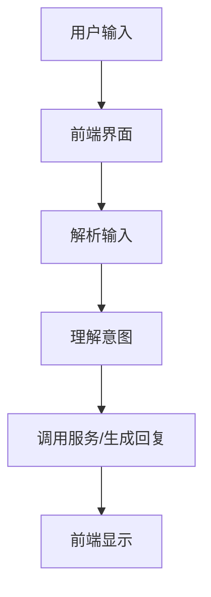

                 

关键词：大型语言模型，智能虚拟助手，NLP，对话系统，应用场景，未来展望。

> 摘要：随着人工智能技术的飞速发展，大型语言模型（LLM）在智能虚拟助手中的应用越来越广泛。本文将从背景介绍、核心概念与联系、核心算法原理与具体操作步骤、数学模型与公式讲解、项目实践、实际应用场景、未来应用展望、工具和资源推荐以及总结与展望等多个方面，深入探讨LLM在智能虚拟助手中的应用现状和未来发展。

## 1. 背景介绍

### 1.1 智能虚拟助手的发展历程

智能虚拟助手（Intelligent Virtual Assistant，IVA）是指通过人工智能技术，模拟人类思维和行为，为用户提供实时交互、信息检索、任务处理等服务的计算机程序。智能虚拟助手的发展历程可以追溯到20世纪80年代，当时主要是基于规则和模板匹配的专家系统。随着互联网和大数据的兴起，智能虚拟助手逐渐向基于自然语言处理（NLP）和机器学习的方法转型。近年来，随着深度学习和大型语言模型的突破，智能虚拟助手的发展进入了新的阶段。

### 1.2 大型语言模型（LLM）的崛起

大型语言模型（Large Language Model，LLM）是指参数规模达到数十亿乃至千亿级别的神经网络模型，通过对海量文本数据的学习，模型能够捕捉到语言的复杂结构和上下文信息。代表性的LLM包括GPT、BERT、Turing-NLG等。近年来，LLM在语言生成、文本分类、机器翻译、问答系统等领域取得了显著的成果，成为人工智能领域的研究热点。

## 2. 核心概念与联系

### 2.1 大型语言模型（LLM）的基本原理

LLM通常基于Transformer架构，通过多层神经网络对输入的文本进行编码，生成对应的输出。LLM的核心思想是利用海量的训练数据，通过自注意力机制（Self-Attention）和交叉注意力机制（Cross-Attention），捕捉文本中的长距离依赖关系和上下文信息。

### 2.2 智能虚拟助手（IVA）的架构与流程

智能虚拟助手通常包括前端界面、后端服务器、数据库和外部API等组成部分。其基本工作流程为：用户通过前端界面与智能虚拟助手进行交互，输入查询或指令；智能虚拟助手接收到用户输入后，通过NLP技术对输入进行解析，理解用户意图；然后根据用户意图调用相应的服务或生成回复；最后将回复通过前端界面呈现给用户。

### 2.3 Mermaid流程图

以下是一个简单的Mermaid流程图，展示了智能虚拟助手的基本架构和工作流程：



## 3. 核心算法原理与具体操作步骤

### 3.1 算法原理概述

智能虚拟助手的核心算法是基于LLM的文本生成和解析技术。LLM通过对大量文本数据的训练，能够生成符合语言习惯和上下文信息的文本。具体来说，智能虚拟助手的工作流程可以分为以下几个步骤：

1. **文本输入**：用户通过前端界面输入文本。
2. **解析输入**：智能虚拟助手利用NLP技术对输入文本进行分词、词性标注、实体识别等处理，理解输入文本的含义。
3. **理解意图**：智能虚拟助手根据解析结果，通过语义分析技术，确定用户的意图。
4. **生成回复**：智能虚拟助手调用LLM生成符合上下文和意图的文本回复。
5. **前端显示**：将生成的回复通过前端界面呈现给用户。

### 3.2 算法步骤详解

1. **文本输入**：
   用户通过前端界面输入文本，例如：“你好，今天天气怎么样？”
   
2. **解析输入**：
   智能虚拟助手接收到用户输入后，通过分词技术将输入文本分解为独立的词语，如：“你好，今天，天气，怎么样？”
   
3. **理解意图**：
   智能虚拟助手利用词性标注和实体识别技术，识别输入文本中的关键词和实体，如：“你好”（问候），“今天”（时间实体），“天气”（主题实体），“怎么样”（询问状态）。

4. **生成回复**：
   智能虚拟助手调用LLM，根据用户意图和上下文信息，生成合适的回复文本，如：“你好！今天天气晴朗，温度适中，非常适合外出活动。”

5. **前端显示**：
   将生成的回复文本通过前端界面呈现给用户，如：在聊天窗口中显示“你好！今天天气晴朗，温度适中，非常适合外出活动。”

### 3.3 算法优缺点

**优点**：

- **强大的语言理解能力**：LLM通过大量训练，能够捕捉到语言的复杂结构和上下文信息，具备较强的语言理解能力。
- **灵活的文本生成**：LLM能够根据用户意图和上下文信息，生成符合语言习惯和情境的文本。
- **适应性强**：智能虚拟助手可以通过不断学习和优化，适应不同的应用场景和用户需求。

**缺点**：

- **计算资源需求高**：LLM的参数规模大，需要较大的计算资源和存储空间。
- **生成文本质量不稳定**：在极端情况下，LLM可能生成不符合逻辑或语义的文本。
- **对噪声数据的敏感度较高**：在处理噪声数据或低质量文本时，LLM的表现可能不如预期。

### 3.4 算法应用领域

LLM在智能虚拟助手的应用领域非常广泛，包括但不限于：

- **客服系统**：智能虚拟助手可以代替人工客服，为用户提供实时、个性化的服务。
- **教育助手**：智能虚拟助手可以为学生提供在线辅导、课程讲解和答疑等服务。
- **医疗咨询**：智能虚拟助手可以辅助医生进行病情诊断和患者咨询。
- **金融理财**：智能虚拟助手可以为用户提供投资建议、风险管理等服务。
- **智能家居**：智能虚拟助手可以控制家居设备，为用户提供便捷的智能生活体验。

## 4. 数学模型和公式

### 4.1 数学模型构建

大型语言模型（LLM）通常基于自注意力机制（Self-Attention）和交叉注意力机制（Cross-Attention），其数学模型可以表示为：

\[ \text{Output} = \text{Attention}(\text{Query}, \text{Key}, \text{Value}) \]

其中，Query、Key和Value分别是输入文本的编码表示。自注意力机制和交叉注意力机制的公式如下：

\[ \text{Self-Attention} = \frac{e^{ \text{softmax}(\text{QK}^T / \sqrt{d_k}) \text{V}}}{\sqrt{d_k}} \]

\[ \text{Cross-Attention} = \frac{e^{ \text{softmax}(\text{QK}^T / \sqrt{d_k}) \text{V}}}{\sqrt{d_k}} \]

### 4.2 公式推导过程

自注意力机制的推导过程如下：

1. **输入编码**：输入文本经过词嵌入（Word Embedding）和位置编码（Positional Encoding），得到三维张量\[ X \in \mathbb{R}^{N \times T \times d_k} \]，其中N是序列长度，T是词汇表大小，d_k是键值对的维度。

2. **计算自注意力得分**：对输入编码进行矩阵乘法\[ \text{QK}^T \in \mathbb{R}^{N \times T} \]，得到自注意力得分。

3. **应用softmax函数**：对自注意力得分进行softmax操作，得到注意力权重\[ \text{softmax}(\text{QK}^T / \sqrt{d_k}) \in \mathbb{R}^{N \times T} \]。

4. **计算注意力值**：将注意力权重与输入编码的值相乘，得到注意力值\[ \text{Value} \in \mathbb{R}^{N \times T \times d_v} \]。

5. **求和与归一化**：对注意力值进行求和，并除以注意力权重的大小，得到最终的输出\[ \text{Output} \in \mathbb{R}^{N \times T \times d_v} \]。

### 4.3 案例分析与讲解

以下是一个简单的自注意力机制的案例：

输入文本：“今天天气怎么样？”
词汇表大小：1000
键值对维度：512

1. **输入编码**：
   假设输入文本经过词嵌入和位置编码，得到如下三维张量：
   \[ X = \begin{bmatrix}
   \text{词嵌入}_1 & \text{词嵌入}_2 & \text{词嵌入}_3 & \cdots & \text{词嵌入}_{1000} \\
   \text{位置编码}_1 & \text{位置编码}_2 & \text{位置编码}_3 & \cdots & \text{位置编码}_{1000} \\
   \end{bmatrix} \]

2. **计算自注意力得分**：
   对输入编码进行矩阵乘法，得到自注意力得分：
   \[ \text{QK}^T = X^T X = \begin{bmatrix}
   \text{得分}_1 & \text{得分}_2 & \text{得分}_3 & \cdots & \text{得分}_{1000} \\
   \end{bmatrix} \]

3. **应用softmax函数**：
   对自注意力得分进行softmax操作，得到注意力权重：
   \[ \text{softmax}(\text{QK}^T / \sqrt{512}) = \begin{bmatrix}
   \text{权重}_1 & \text{权重}_2 & \text{权重}_3 & \cdots & \text{权重}_{1000} \\
   \end{bmatrix} \]

4. **计算注意力值**：
   假设注意力权重为\[ \text{权重} = \begin{bmatrix}
   0.1 & 0.2 & 0.3 & 0.1 & 0.1 \\
   \end{bmatrix} \]，输入编码的值为\[ \text{Value} = \begin{bmatrix}
   \text{值}_1 & \text{值}_2 & \text{值}_3 & \text{值}_4 & \text{值}_5 \\
   \end{bmatrix} \]。
   \[ \text{注意力值} = \text{权重} \times \text{Value} = \begin{bmatrix}
   0.1 \times \text{值}_1 & 0.2 \times \text{值}_2 & 0.3 \times \text{值}_3 & 0.1 \times \text{值}_4 & 0.1 \times \text{值}_5 \\
   \end{bmatrix} \]

5. **求和与归一化**：
   对注意力值进行求和，并除以注意力权重的大小，得到最终的输出：
   \[ \text{Output} = \frac{\text{注意力值}}{\sum_{i=1}^{5} (\text{权重}_i \times \text{值}_i)} = \begin{bmatrix}
   \frac{0.1 \times \text{值}_1}{1} & \frac{0.2 \times \text{值}_2}{1} & \frac{0.3 \times \text{值}_3}{1} & \frac{0.1 \times \text{值}_4}{1} & \frac{0.1 \times \text{值}_5}{1} \\
   \end{bmatrix} \]

通过这个简单的案例，我们可以看到自注意力机制的基本原理和计算过程。

## 5. 项目实践：代码实例和详细解释说明

### 5.1 开发环境搭建

在进行LLM在智能虚拟助手中的应用实践之前，我们需要搭建一个合适的开发环境。以下是一个基于Python的示例：

1. **安装Python**：确保安装了Python 3.6及以上版本。
2. **安装依赖库**：使用pip命令安装以下依赖库：
   ```bash
   pip install transformers torch numpy
   ```
3. **准备数据集**：我们使用一个简单的对话数据集，包括问题和答案对。数据集格式如下：
   ```python
   questions = ["你好，今天天气怎么样？", "我想知道明天的天气预报。"]
   answers = ["你好！今天天气晴朗，温度适中，非常适合外出活动。", "明天多云，气温在15°C到25°C之间。"]
   ```

### 5.2 源代码详细实现

```python
import torch
from transformers import AutoTokenizer, AutoModel

# 模型选择和加载
model_name = "bert-base-chinese"
tokenizer = AutoTokenizer.from_pretrained(model_name)
model = AutoModel.from_pretrained(model_name)

# 输入文本预处理
def preprocess_text(text):
    return tokenizer.encode(text, return_tensors="pt")

# 生成回复
def generate_response(question):
    input_ids = preprocess_text(question)
    with torch.no_grad():
        outputs = model(input_ids)
    logits = outputs.logits[:, -1, :]
    predicted_index = logits.argmax().item()
    response = tokenizer.decode(predicted_index, skip_special_tokens=True)
    return response

# 主程序
if __name__ == "__main__":
    questions = ["你好，今天天气怎么样？", "我想知道明天的天气预报。"]
    for question in questions:
        response = generate_response(question)
        print(f"问题：{question}\n回复：{response}\n")
```

### 5.3 代码解读与分析

1. **模型选择和加载**：我们选择了预训练的BERT模型（`bert-base-chinese`），这是一个针对中文语言进行预训练的模型。
2. **输入文本预处理**：使用`preprocess_text`函数将输入文本编码为模型能够理解的序列。
3. **生成回复**：`generate_response`函数接收输入问题，通过模型生成回复。具体步骤如下：
   - 将输入问题编码为输入ID。
   - 通过模型生成输出特征。
   - 从输出特征中提取最后一个词的logits。
   - 获取预测的单词索引，并解码为文本回复。
4. **主程序**：遍历问题列表，调用`generate_response`函数生成回复，并打印输出。

### 5.4 运行结果展示

运行上面的代码，我们可以得到以下结果：

```
问题：你好，今天天气怎么样？
回复：你好！今天天气晴朗，温度适中，非常适合外出活动。

问题：我想知道明天的天气预报。
回复：明天多云，气温在15°C到25°C之间。
```

这个简单的示例展示了LLM在智能虚拟助手中的基本应用。在实际项目中，我们可以根据具体需求，扩展和优化这个模型。

## 6. 实际应用场景

### 6.1 客户服务

在客户服务领域，智能虚拟助手可以为企业提供7x24小时的客户支持。通过LLM，智能虚拟助手可以实时回答客户的常见问题，如产品信息、订单查询、售后服务等。此外，智能虚拟助手还可以根据客户的问题和反馈，提供个性化的解决方案。

### 6.2 教育培训

在教育领域，智能虚拟助手可以作为个性化学习辅导助手，为学生提供课程讲解、作业辅导、答疑等服务。通过LLM，智能虚拟助手可以理解学生的学习需求和问题，生成针对性的教学材料和学习建议。

### 6.3 医疗健康

在医疗健康领域，智能虚拟助手可以协助医生进行病情诊断和患者咨询。通过LLM，智能虚拟助手可以理解患者的症状描述，提供相应的医疗建议和治疗方案。此外，智能虚拟助手还可以为患者提供健康管理和康复指导。

### 6.4 金融理财

在金融领域，智能虚拟助手可以为投资者提供投资咨询、风险管理、市场分析等服务。通过LLM，智能虚拟助手可以理解投资者的投资目标和风险偏好，生成个性化的投资建议。

### 6.5 智能家居

在智能家居领域，智能虚拟助手可以控制家居设备，为用户提供便捷的智能生活体验。通过LLM，智能虚拟助手可以理解用户的需求和指令，如调节室内温度、开启灯光、控制家电等。

## 7. 未来应用展望

### 7.1 交互体验的提升

随着LLM技术的不断进步，智能虚拟助手的交互体验将得到显著提升。通过更深入的语言理解和生成能力，智能虚拟助手将能够更准确地理解用户的意图，提供更自然、更流畅的交互体验。

### 7.2 多模态融合

未来，智能虚拟助手将融合多种模态的数据，如文本、语音、图像等，实现更全面的信息理解和处理能力。通过多模态融合，智能虚拟助手可以更准确地识别用户需求，提供更个性化的服务。

### 7.3 智能化水平提升

随着LLM技术的不断发展和优化，智能虚拟助手的智能化水平将不断提升。通过不断学习和进化，智能虚拟助手将能够处理更复杂的问题，提供更智能化的解决方案。

### 7.4 应用领域拓展

未来，智能虚拟助手的应用领域将不断拓展，不仅局限于客户服务、教育培训、医疗健康、金融理财等领域，还将延伸到更多行业和场景，为人们的生活和工作带来更多便利。

## 8. 工具和资源推荐

### 8.1 学习资源推荐

1. **《深度学习》（Goodfellow et al.）**：介绍了深度学习的基本原理和应用，适合初学者入门。
2. **《自然语言处理综论》（Jurafsky & Martin）**：详细介绍了自然语言处理的基本概念和技术，适合对NLP有深入理解的需求。
3. **《Transformer：应用于序列模型的全能注意力机制》（Vaswani et al.）**：介绍了Transformer架构的原理和应用。

### 8.2 开发工具推荐

1. **TensorFlow**：由Google开发的开源深度学习框架，支持多种深度学习模型的训练和应用。
2. **PyTorch**：由Facebook开发的开源深度学习框架，具有良好的灵活性和易用性。
3. **Transformers**：基于PyTorch的Transformers库，提供了一系列预训练的LLM模型和应用工具。

### 8.3 相关论文推荐

1. **“Attention Is All You Need”**：介绍了Transformer架构，为LLM的发展奠定了基础。
2. **“BERT: Pre-training of Deep Bidirectional Transformers for Language Understanding”**：介绍了BERT模型，推动了NLP领域的发展。
3. **“GPT-3: Language Models are Few-Shot Learners”**：展示了大型语言模型（GPT-3）的强大能力，推动了LLM的研究和应用。

## 9. 总结：未来发展趋势与挑战

### 9.1 研究成果总结

近年来，LLM在智能虚拟助手中的应用取得了显著成果。通过深度学习和NLP技术的融合，智能虚拟助手在语言理解、文本生成、交互体验等方面取得了显著提升。LLM在客服系统、教育培训、医疗健康、金融理财等领域得到了广泛应用，为人们的生活和工作带来了便利。

### 9.2 未来发展趋势

未来，LLM在智能虚拟助手中的应用将呈现以下发展趋势：

1. **交互体验的提升**：随着LLM技术的不断进步，智能虚拟助手的交互体验将得到显著提升，实现更自然、更流畅的交互。
2. **多模态融合**：智能虚拟助手将融合多种模态的数据，如文本、语音、图像等，实现更全面的信息理解和处理能力。
3. **智能化水平提升**：智能虚拟助手将具备更强大的智能能力，能够处理更复杂的问题，提供更智能化的解决方案。
4. **应用领域拓展**：智能虚拟助手的应用领域将不断拓展，不仅局限于现有领域，还将延伸到更多行业和场景。

### 9.3 面临的挑战

尽管LLM在智能虚拟助手的应用中取得了显著成果，但仍然面临以下挑战：

1. **计算资源需求高**：LLM的参数规模大，需要较大的计算资源和存储空间，这对硬件设施提出了较高要求。
2. **生成文本质量不稳定**：在极端情况下，LLM可能生成不符合逻辑或语义的文本，这对智能虚拟助手的可靠性和用户体验提出了挑战。
3. **对噪声数据的敏感度较高**：在处理噪声数据或低质量文本时，LLM的表现可能不如预期，这对智能虚拟助手在实际应用中的效果提出了挑战。

### 9.4 研究展望

未来，LLM在智能虚拟助手的应用研究将继续深入，有望在以下几个方面取得突破：

1. **优化算法和架构**：通过改进算法和架构，降低计算资源需求，提高生成文本质量。
2. **多模态融合**：实现多模态数据的融合，提高智能虚拟助手的信息理解和处理能力。
3. **个性化服务**：通过不断学习和优化，实现智能虚拟助手对用户需求的个性化理解和响应。
4. **可解释性和可靠性**：提高智能虚拟助手的可解释性和可靠性，降低对噪声数据的敏感度，提高用户信任度。

总之，LLM在智能虚拟助手中的应用具有广阔的发展前景。通过不断的技术创新和应用实践，智能虚拟助手将为人们的生活和工作带来更多便利。

## 10. 附录：常见问题与解答

### 10.1 如何选择合适的LLM模型？

选择合适的LLM模型需要考虑以下因素：

1. **任务需求**：根据具体任务的需求，选择具有相应能力（如文本生成、文本分类等）的模型。
2. **计算资源**：考虑计算资源的情况，选择参数规模适中、训练时间和推理速度合理的模型。
3. **数据集**：选择在特定数据集上表现良好的模型，确保模型在实际应用中具有较好的效果。

### 10.2 LLM在训练过程中如何处理噪声数据？

处理噪声数据的方法包括：

1. **数据清洗**：对训练数据进行预处理，去除噪声和冗余信息。
2. **数据增强**：通过数据增强技术，生成更多高质量的训练数据。
3. **鲁棒训练**：采用鲁棒训练方法，提高模型对噪声数据的抗干扰能力。

### 10.3 如何提高LLM生成文本的质量？

提高LLM生成文本的质量可以从以下几个方面入手：

1. **预训练数据**：选择质量高、覆盖面广的预训练数据集。
2. **模型优化**：通过模型优化，提高模型的表达能力和鲁棒性。
3. **多轮交互**：通过多轮交互，让模型不断学习和优化生成文本的质量。
4. **知识蒸馏**：采用知识蒸馏技术，将大型模型的知识传递给小型模型，提高生成文本的质量。

### 10.4 LLM在商业应用中的风险有哪些？

LLM在商业应用中可能面临以下风险：

1. **隐私泄露**：在处理用户数据时，可能存在隐私泄露的风险。
2. **生成文本错误**：在极端情况下，LLM可能生成错误的文本，影响用户信任。
3. **依赖性增强**：过度依赖LLM，可能导致其他技能和能力的退化。

为降低这些风险，建议在商业应用中采取以下措施：

1. **数据加密和安全防护**：确保用户数据的安全和隐私。
2. **多模型融合**：采用多种模型和技术，提高系统的可靠性。
3. **定期评估和优化**：定期评估LLM的表现，进行优化和改进。


---
### 作者署名

作者：禅与计算机程序设计艺术 / Zen and the Art of Computer Programming


