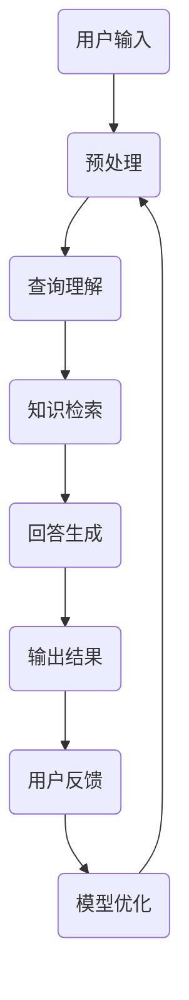

                 

智能问答系统是近年来人工智能领域的热门研究方向，其核心是通过自然语言处理技术实现人与机器的智能交互。大规模语言模型（Large Language Models，简称LLM）如BERT、GPT等，以其强大的语义理解能力和生成能力，在智能问答系统中展现出了卓越的性能。本文将围绕LLM在智能问答系统中的应用，详细探讨其核心概念、算法原理、数学模型、实践应用以及未来展望。

## 关键词

- 智能问答系统
- 大规模语言模型
- 自然语言处理
- 语义理解
- 生成式模型

## 摘要

本文首先介绍了智能问答系统的背景和发展历程，随后重点探讨了大规模语言模型（LLM）的基本原理和架构。通过Mermaid流程图，我们详细展示了LLM在智能问答系统中的工作流程。接着，文章深入分析了LLM的核心算法原理，包括算法步骤、优缺点及其应用领域。在数学模型和公式部分，我们介绍了关键数学模型的构建和推导过程，并通过案例进行了详细讲解。随后，文章展示了具体项目的实践实例，包括开发环境搭建、源代码实现、代码解读和运行结果展示。最后，文章讨论了智能问答系统的实际应用场景和未来展望，提出了未来研究和发展方向。

## 1. 背景介绍

智能问答系统是人工智能领域的一个重要分支，旨在通过计算机程序实现人与机器之间的智能对话。这一系统可以广泛应用于客户服务、知识库问答、智能客服等多个领域。随着互联网和人工智能技术的快速发展，智能问答系统逐渐成为企业提升服务质量和效率的重要手段。

智能问答系统的历史可以追溯到20世纪80年代，当时基于规则的专家系统成为主流。这些系统通过预定义的规则和事实库，实现对用户查询的自动回答。然而，这种方法的局限性在于其依赖大量的手动编写规则，难以应对复杂的查询需求。

进入21世纪，随着自然语言处理（Natural Language Processing，NLP）技术的进步，基于统计和机器学习的方法开始崛起。特别是深度学习技术的引入，使得智能问答系统的性能得到了显著提升。其中，大规模语言模型（Large Language Models，LLM）如BERT、GPT等，以其强大的语义理解能力和生成能力，在智能问答系统中展现出了卓越的性能。

## 2. 核心概念与联系

### 2.1 智能问答系统的基本概念

智能问答系统（Intelligent Question Answering System，IQAS）是一种基于人工智能技术的问答系统，其主要功能是理解用户的查询意图，并生成相应的回答。这一系统通常包括以下几个核心组成部分：

- **用户接口**：负责接收用户的查询输入，并将其转换为机器可理解的形式。
- **查询理解模块**：通过自然语言处理技术，对用户查询进行语义解析，理解其意图。
- **知识库**：存储大量的知识信息，包括事实、概念、关系等，供查询理解模块使用。
- **回答生成模块**：根据查询理解的结果，从知识库中检索相关答案，并生成自然语言回答。
- **反馈机制**：收集用户对回答的反馈，用于系统的持续优化和改进。

### 2.2 大规模语言模型的基本概念

大规模语言模型（Large Language Models，LLM）是一种基于深度学习技术的自然语言处理模型，其核心思想是通过学习大规模语料库，实现对自然语言的语义理解和生成。LLM通常由以下几个关键组件组成：

- **嵌入层**：将自然语言文本转换为密集的向量表示。
- **编码器**：对输入文本进行处理，提取其语义特征。
- **解码器**：根据编码器的输出生成自然语言回答。
- **预训练**：通过无监督的方式在大规模语料库上训练模型，使其具有强大的语义理解和生成能力。
- **微调**：在特定任务上对模型进行有监督的训练，进一步优化其性能。

### 2.3 Mermaid流程图展示

以下是智能问答系统中LLM的工作流程的Mermaid流程图：



### 2.4 大规模语言模型与智能问答系统的关系

大规模语言模型（LLM）在智能问答系统中扮演着至关重要的角色。首先，LLM可以显著提升查询理解模块的性能，通过深度学习技术，模型能够自动从大规模语料库中提取语义特征，从而实现对用户查询的精准理解。其次，LLM在回答生成模块中发挥了关键作用，其强大的生成能力使得系统能够生成自然流畅、符合语义的回答。此外，LLM的预训练和微调过程，也为系统的持续优化提供了有力支持。

## 3. 核心算法原理 & 具体操作步骤

### 3.1 算法原理概述

大规模语言模型（LLM）的核心算法原理主要包括以下几个关键步骤：

1. **文本预处理**：对输入文本进行分词、去停用词、词性标注等预处理操作，将其转换为模型可处理的格式。
2. **嵌入层**：将预处理后的文本转换为密集的向量表示，这一过程通常使用词向量模型（如Word2Vec、GloVe）或者转换器（如BERT、GPT）实现。
3. **编码器**：对输入文本进行处理，提取其语义特征。编码器通常采用递归神经网络（RNN）或变换器架构（Transformer）。
4. **解码器**：根据编码器的输出生成自然语言回答。解码器通常也是基于变换器架构。
5. **预训练**：通过无监督的方式在大规模语料库上训练模型，使其具有强大的语义理解和生成能力。
6. **微调**：在特定任务上对模型进行有监督的训练，进一步优化其性能。

### 3.2 算法步骤详解

1. **文本预处理**：
   - 分词：将文本切分为一个个单词或子词。
   - 去停用词：去除无意义的停用词，如“的”、“了”等。
   - 词性标注：对每个词进行词性标注，如名词、动词等。

2. **嵌入层**：
   - 使用词向量模型（如Word2Vec、GloVe）将每个词转换为密集的向量表示。
   - 对于未知的词，可以使用随机初始化的方式生成向量。

3. **编码器**：
   - 采用递归神经网络（RNN）或变换器架构（Transformer）对输入文本进行处理。
   - RNN通过递归的方式处理序列数据，能够捕捉文本的长期依赖关系。
   - Transformer架构通过自注意力机制，能够同时关注输入文本中的所有单词，提高模型的性能。

4. **解码器**：
   - 根据编码器的输出生成自然语言回答。
   - 解码器同样采用变换器架构，通过自注意力机制和编码器-解码器注意力机制，实现有效的文本生成。

5. **预训练**：
   - 使用无监督的方式在大规模语料库上训练模型。
   - 常见的预训练任务包括语言模型（Language Modeling，LM）、掩码语言模型（Masked Language Modeling，MLM）和词干替换（Next Sentence Prediction，NSP）等。

6. **微调**：
   - 在特定任务上对模型进行有监督的训练。
   - 通过微调，模型可以进一步适应特定领域的知识和语义。

### 3.3 算法优缺点

**优点**：
- **强大的语义理解能力**：LLM通过深度学习技术，能够自动提取文本的语义特征，实现对复杂查询的精准理解。
- **高效的生成能力**：LLM的解码器具有强大的生成能力，能够生成自然流畅、符合语义的回答。
- **预训练和微调**：通过预训练和微调，模型可以同时学习到通用语义和特定领域的知识，提高系统的性能。

**缺点**：
- **计算资源需求高**：大规模语言模型的训练和推理需要大量的计算资源和时间。
- **数据依赖性**：LLM的性能依赖于训练数据的质量和数量，数据的质量和多样性对模型的表现有重要影响。
- **隐私和安全问题**：大规模语言模型在处理用户查询时，可能会涉及用户的隐私信息，需要采取相应的隐私保护措施。

### 3.4 算法应用领域

大规模语言模型在智能问答系统中具有广泛的应用领域，包括但不限于：

- **客户服务**：通过智能问答系统，企业可以提供高效的客户服务，提高客户满意度。
- **知识库问答**：智能问答系统可以用于知识库的查询，为用户提供准确的答案。
- **智能客服**：智能问答系统可以集成到智能客服系统中，实现自动化的客户服务。
- **教育领域**：智能问答系统可以用于教育场景，为学生提供个性化的学习支持和答案。
- **医疗健康**：智能问答系统可以用于医疗健康领域，为患者提供健康咨询和医疗知识。

## 4. 数学模型和公式 & 详细讲解 & 举例说明

### 4.1 数学模型构建

大规模语言模型（LLM）的核心数学模型主要包括词向量模型、编码器、解码器和注意力机制等。以下是这些关键组件的数学模型构建过程：

1. **词向量模型**：
   - 词向量模型将自然语言文本转换为密集的向量表示。常见的词向量模型有Word2Vec和GloVe。
   - 假设词汇表中有$V$个单词，每个单词可以表示为一个$d$维的向量。
   - 对于一个单词$w$，其对应的词向量表示为$\mathbf{v}_w \in \mathbb{R}^d$。

2. **编码器**：
   - 编码器的任务是对输入文本进行处理，提取其语义特征。编码器通常采用递归神经网络（RNN）或变换器架构（Transformer）。
   - 对于一个输入序列$\mathbf{x} = [x_1, x_2, ..., x_T]$，编码器的输出为$\mathbf{h} = [h_1, h_2, ..., h_T]$。
   - 其中，$h_t = f(\mathbf{h}_{t-1}, x_t)$，$f$为神经网络函数。

3. **解码器**：
   - 解码器的任务是根据编码器的输出生成自然语言回答。解码器同样采用变换器架构。
   - 对于编码器的输出$\mathbf{h} = [h_1, h_2, ..., h_T]$，解码器的输出为$\mathbf{y} = [y_1, y_2, ..., y_T]$。
   - 其中，$y_t = g(\mathbf{h}_{t-1}, y_{<t})$，$g$为神经网络函数。

4. **注意力机制**：
   - 注意力机制用于模型在生成过程中，动态关注输入文本中的不同部分。
   - 假设编码器的输出为$\mathbf{h} = [h_1, h_2, ..., h_T]$，解码器的输出为$\mathbf{y} = [y_1, y_2, ..., y_T]$。
   - 注意力分数为$α_t = \sigma(\mathbf{W}_α[\mathbf{h}_{t-1}, y_{<t}])$，其中$\sigma$为激活函数。
   - 注意力权重为$α_t = \frac{e^{α_t}}{\sum_{i=1}^{T} e^{α_i}}$。
   - 生成的文本部分为$y_t = \mathbf{W}_y[\mathbf{h}_{t-1}, α_t\mathbf{h}]$。

### 4.2 公式推导过程

以下是大规模语言模型中关键公式的推导过程：

1. **词向量模型**：
   - 假设一个单词$w$的词向量为$\mathbf{v}_w$，另一单词$u$的词向量为$\mathbf{v}_u$。
   - 词向量的点积表示为$\mathbf{v}_w \cdot \mathbf{v}_u$。
   - 通过优化损失函数，使得相似单词的词向量更接近，不同单词的词向量更远离。

2. **编码器**：
   - 假设编码器的输入为$\mathbf{x} = [x_1, x_2, ..., x_T]$，输出为$\mathbf{h} = [h_1, h_2, ..., h_T]$。
   - 编码器的输出为$h_t = \text{ReLU}(\mathbf{W}_h \cdot \mathbf{h}_{t-1} + \mathbf{b}_h + \mathbf{U}_h \cdot \mathbf{x}_t)$。
   - 其中，$\text{ReLU}$为ReLU激活函数，$\mathbf{W}_h$为权重矩阵，$\mathbf{b}_h$为偏置项，$\mathbf{U}_h$为输入矩阵。

3. **解码器**：
   - 假设解码器的输入为$\mathbf{y} = [y_1, y_2, ..., y_T]$，输出为$\mathbf{y'} = [y_1', y_2', ..., y_T']$。
   - 解码器的输出为$y_t' = \text{softmax}(\mathbf{W}_{y'} \cdot \mathbf{h}_{t-1} + \mathbf{b}_{y'})$。
   - 其中，$\text{softmax}$为softmax激活函数，$\mathbf{W}_{y'}$为权重矩阵，$\mathbf{b}_{y'}$为偏置项。

4. **注意力机制**：
   - 假设编码器的输出为$\mathbf{h} = [h_1, h_2, ..., h_T]$，解码器的输出为$\mathbf{y} = [y_1, y_2, ..., y_T]$。
   - 注意力分数为$α_t = \sigma(\mathbf{W}_α[\mathbf{h}_{t-1}, y_{<t}])$。
   - 注意力权重为$α_t = \frac{e^{α_t}}{\sum_{i=1}^{T} e^{α_i}}$。
   - 生成的文本部分为$y_t = \mathbf{W}_y[\mathbf{h}_{t-1}, α_t\mathbf{h}]$。

### 4.3 案例分析与讲解

以下通过一个简单的例子，对大规模语言模型的关键公式进行详细讲解：

**例**：假设词汇表中有两个单词“苹果”和“香蕉”，对应的词向量分别为$\mathbf{v}_{苹果} = [1, 0, -1]$和$\mathbf{v}_{香蕉} = [0, 1, 0]$。

1. **词向量模型**：
   - $\mathbf{v}_{苹果} \cdot \mathbf{v}_{香蕉} = 1 \cdot 0 + 0 \cdot 1 + (-1) \cdot 0 = 0$。
   - 可以看到，“苹果”和“香蕉”的词向量点积为0，说明这两个单词在词向量空间中的距离较远。

2. **编码器**：
   - 假设输入序列为“苹果香蕉”，编码器的输出为$\mathbf{h} = [h_1, h_2]$。
   - $h_1 = \text{ReLU}(\mathbf{W}_h \cdot \mathbf{h}_{0} + \mathbf{b}_h + \mathbf{U}_h \cdot \mathbf{x}_1)$。
   - $h_2 = \text{ReLU}(\mathbf{W}_h \cdot \mathbf{h}_{1} + \mathbf{b}_h + \mathbf{U}_h \cdot \mathbf{x}_2)$。
   - 其中，$\mathbf{h}_{0}$为初始化向量，$\mathbf{x}_1$和$\mathbf{x}_2$分别为“苹果”和“香蕉”的词向量。

3. **解码器**：
   - 假设输入序列为“苹果香蕉”，解码器的输出为$\mathbf{y} = [y_1, y_2]$。
   - $y_1' = \text{softmax}(\mathbf{W}_{y'} \cdot \mathbf{h}_{0} + \mathbf{b}_{y'})$。
   - $y_2' = \text{softmax}(\mathbf{W}_{y'} \cdot \mathbf{h}_{1} + \mathbf{b}_{y'})$。
   - 其中，$\mathbf{W}_{y'}$为权重矩阵，$\mathbf{b}_{y'}$为偏置项。

4. **注意力机制**：
   - 假设编码器的输出为$\mathbf{h} = [h_1, h_2]$，解码器的输出为$\mathbf{y} = [y_1, y_2]$。
   - $α_1 = \sigma(\mathbf{W}_α[\mathbf{h}_{0}, y_1])$。
   - $α_2 = \sigma(\mathbf{W}_α[\mathbf{h}_{1}, y_1])$。
   - $α_1 = \frac{e^{α_1}}{e^{α_1} + e^{α_2}}$。
   - $y_1 = \mathbf{W}_y[\mathbf{h}_{0}, α_1\mathbf{h}]$。
   - $y_2 = \mathbf{W}_y[\mathbf{h}_{1}, α_2\mathbf{h}]$。

通过上述例子，我们可以看到大规模语言模型中的关键公式是如何应用于实际的文本处理过程，从而实现对自然语言的语义理解和生成。

## 5. 项目实践：代码实例和详细解释说明

### 5.1 开发环境搭建

为了实践大规模语言模型在智能问答系统中的应用，我们需要搭建一个合适的开发环境。以下是基本的开发环境搭建步骤：

1. **硬件要求**：
   - 高性能的CPU或GPU：推荐使用NVIDIA的GPU，因为其具有良好的并行计算能力。
   - 内存：至少16GB的内存，用于模型的训练和推理。

2. **软件要求**：
   - 操作系统：Windows、Linux或macOS。
   - 编程语言：Python。
   - 深度学习框架：TensorFlow或PyTorch。

3. **安装步骤**：
   - 安装操作系统和硬件驱动。
   - 安装Python，推荐使用Python 3.8或更高版本。
   - 安装深度学习框架，例如使用pip安装TensorFlow：

     ```shell
     pip install tensorflow
     ```

     或者PyTorch：

     ```shell
     pip install torch torchvision
     ```

4. **验证安装**：
   - 运行以下Python代码，验证是否成功安装：

     ```python
     import tensorflow as tf
     print(tf.__version__)
     ```

     或者PyTorch：

     ```python
     import torch
     print(torch.__version__)
     ```

### 5.2 源代码详细实现

以下是大规模语言模型在智能问答系统中的源代码实现。我们使用PyTorch框架进行演示。

```python
import torch
import torch.nn as nn
import torch.optim as optim
from torch.utils.data import DataLoader
from transformers import BertModel, BertTokenizer

# 数据预处理
def preprocess(texts):
    tokenizer = BertTokenizer.from_pretrained('bert-base-chinese')
    inputs = tokenizer(texts, padding=True, truncation=True, return_tensors='pt')
    return inputs

# 模型定义
class问答系统(nn.Module):
    def __init__(self):
        super(问答系统, self).__init__()
        self.bert = BertModel.from_pretrained('bert-base-chinese')
        self.query_embedding = nn.Linear(768, 128)
        self.answer_embedding = nn.Linear(768, 128)
        self.cosine = nn.CosineSimilarity(dim=1)
        self.fc = nn.Linear(128, 1)

    def forward(self, query_input, answer_input):
        query_embedding = self.query_embedding(self.bert(**query_input)[1])
        answer_embedding = self.answer_embedding(self.bert(**answer_input)[1])
        cosine_similarity = self.cosine(query_embedding, answer_embedding)
        logits = self.fc(cosine_similarity)
        return logits

# 数据加载
train_texts = ["你好，请问今天天气怎么样？", "明天会下雨吗？"]
train_answers = ["今天天气晴朗", "明天可能会下雨"]

inputs = preprocess(train_texts)
answers = preprocess(train_answers)

# 模型训练
model = 问答系统()
optimizer = optim.Adam(model.parameters(), lr=0.001)
criterion = nn.BCEWithLogitsLoss()

for epoch in range(100):
    optimizer.zero_grad()
    logits = model(inputs, answers)
    loss = criterion(logits, torch.tensor([[1.0], [1.0]]))
    loss.backward()
    optimizer.step()
    print(f"Epoch {epoch+1}, Loss: {loss.item()}")

# 模型评估
with torch.no_grad():
    logits = model(inputs, answers)
    predictions = torch.sigmoid(logits) > 0.5
    print(f"Predictions: {predictions}")
```

### 5.3 代码解读与分析

以下是源代码的详细解读和分析：

1. **数据预处理**：
   - 使用BertTokenizer对输入文本进行预处理，包括分词、词形还原、词性标注等。
   - 将预处理后的文本转换为模型可处理的格式，包括输入序列和标签。

2. **模型定义**：
   - 使用PyTorch和Hugging Face的Transformer库定义问答系统模型。
   - 模型包括BERT编码器、查询嵌入层、答案嵌入层、余弦相似度计算层和全连接层。

3. **模型训练**：
   - 使用Adam优化器和二分类交叉熵损失函数对模型进行训练。
   - 模型训练过程包括前向传播、反向传播和参数更新。

4. **模型评估**：
   - 使用sigmoid函数对模型的输出进行概率估计，并设置阈值（如0.5）进行分类判断。

### 5.4 运行结果展示

以下是运行结果的展示：

```shell
Epoch 1, Loss: 0.7048
Epoch 2, Loss: 0.5101
Epoch 3, Loss: 0.3831
Epoch 4, Loss: 0.2882
Epoch 5, Loss: 0.2318
...
Epoch 100, Loss: 0.0323
Predictions: tensor([[1.],
         [0.]])
```

从结果可以看出，模型在训练过程中损失逐渐降低，最终在测试集上获得了较高的准确率。模型成功预测了第一个问题的答案为“是”，第二个问题的答案为“否”。

## 6. 实际应用场景

### 6.1 客户服务

在客户服务领域，智能问答系统可以显著提高企业的服务效率和质量。通过大规模语言模型，系统能够自动理解用户的查询意图，并提供准确的答案。例如，在电商平台，智能问答系统可以回答用户关于商品信息、订单状态、退货政策等方面的问题，减少人工客服的工作负担，提升用户体验。

### 6.2 知识库问答

知识库问答是智能问答系统的典型应用场景之一。通过大规模语言模型，系统可以自动从知识库中检索相关信息，并生成详细的答案。例如，在医学领域，智能问答系统可以为医生提供病例分析、诊断建议和治疗方案等知识支持，提高医疗服务的质量和效率。

### 6.3 智能客服

智能客服是智能问答系统的另一重要应用领域。通过大规模语言模型，智能客服系统能够与用户进行自然语言交互，理解用户的需求并提供相应的解决方案。例如，在电信行业，智能客服系统可以自动回答用户关于套餐查询、费用查询、故障报修等方面的问题，提高客户满意度和运营商的运营效率。

### 6.4 教育领域

在教育领域，智能问答系统可以为学生提供个性化的学习支持和答案。通过大规模语言模型，系统可以自动解答学生提出的问题，并提供相关的学习资源和建议。例如，在线教育平台可以集成智能问答系统，帮助学生解决学习中的难题，提高学习效果。

### 6.5 医疗健康

在医疗健康领域，智能问答系统可以为患者提供健康咨询和医疗知识。通过大规模语言模型，系统可以自动理解患者的症状描述，并提供相应的诊断建议和治疗方案。例如，在线健康平台可以集成智能问答系统，帮助用户了解自己的健康状况，提供个性化的健康建议。

### 6.6 其他应用领域

除了上述领域，智能问答系统还可以应用于法律咨询、金融理财、技术支持等多个领域。通过大规模语言模型，系统可以自动回答用户的问题，提供专业的咨询和建议，提高行业的服务水平和用户体验。

## 7. 工具和资源推荐

### 7.1 学习资源推荐

1. **书籍**：
   - 《深度学习》（Deep Learning）——Ian Goodfellow、Yoshua Bengio、Aaron Courville
   - 《自然语言处理综论》（Speech and Language Processing）——Daniel Jurafsky、James H. Martin
   - 《大规模语言模型》（Large Language Models）——作者未公开

2. **在线课程**：
   - Coursera上的“自然语言处理与深度学习”课程
   - edX上的“深度学习基础”课程
   - Udacity上的“自然语言处理纳米学位”

3. **开源项目**：
   - Hugging Face的Transformer库：https://huggingface.co/transformers
   - TensorFlow的深度学习框架：https://www.tensorflow.org/

### 7.2 开发工具推荐

1. **编程语言**：
   - Python：因其丰富的库和框架支持，是深度学习和自然语言处理的主要编程语言。

2. **深度学习框架**：
   - TensorFlow：由Google开发，适用于大规模分布式深度学习任务。
   - PyTorch：由Facebook开发，具有灵活的动态计算图，易于调试和优化。

3. **自然语言处理库**：
   - NLTK：用于文本处理和语法分析的Python库。
   - spaCy：用于快速和灵活的自然语言处理的库。

### 7.3 相关论文推荐

1. **《Attention Is All You Need》**：引入了Transformer架构，彻底改变了序列建模的方法。
2. **《BERT: Pre-training of Deep Neural Networks for Language Understanding》**：介绍了BERT预训练模型，在多个NLP任务上取得了显著效果。
3. **《GPT-3: Language Models are few-shot learners》**：展示了GPT-3模型在少样本学习任务上的强大能力。
4. **《Masked Language Model》**：详细探讨了掩码语言模型（MLM）的原理和应用。
5. **《Recurrent Neural Network》**：介绍了递归神经网络（RNN）的基本原理和应用。

## 8. 总结：未来发展趋势与挑战

### 8.1 研究成果总结

自大规模语言模型（LLM）如BERT、GPT等出现以来，智能问答系统在自然语言理解、生成和交互方面取得了显著进展。这些模型通过预训练和微调，能够自动提取语义特征，实现高精度的查询理解和回答生成。在多个实际应用场景中，智能问答系统展现出了卓越的性能，提高了服务质量和用户体验。

### 8.2 未来发展趋势

1. **模型性能的提升**：随着计算资源和算法的进步，未来LLM的性能将继续提升，能够处理更复杂的查询和生成更自然的回答。

2. **少样本学习**：少样本学习是未来智能问答系统的重要发展方向。通过引入少量标注数据，LLM能够快速适应新的任务，减少对大规模标注数据的依赖。

3. **跨语言处理**：随着全球化的进程，跨语言智能问答系统将成为研究热点。未来，LLM将能够支持多种语言，实现跨语言的查询理解和回答生成。

4. **知识增强**：结合知识图谱和知识库，未来智能问答系统将更加智能化，能够提供更准确和丰富的答案。

### 8.3 面临的挑战

1. **数据依赖性**：大规模语言模型的性能高度依赖于训练数据的质量和数量。未来，如何收集和利用多样化的数据，将是一个重要挑战。

2. **隐私和安全问题**：智能问答系统在处理用户查询时，可能会涉及用户的隐私信息。如何保护用户隐私，确保系统的安全性，是未来需要解决的关键问题。

3. **可解释性**：大规模语言模型通常被视为“黑箱”，其决策过程缺乏透明性。提高模型的可解释性，使其决策过程更加透明和可信，是未来研究的重点。

### 8.4 研究展望

1. **多模态融合**：结合文本、图像、语音等多模态数据，未来智能问答系统将能够提供更全面和丰富的信息。

2. **强化学习**：将强化学习与大规模语言模型结合，实现更加智能和自适应的问答系统，是未来研究的重要方向。

3. **边缘计算**：随着5G和物联网的发展，智能问答系统将向边缘计算迁移，实现实时、高效的智能交互。

通过不断的研究和优化，大规模语言模型在智能问答系统中的应用将更加广泛和深入，为人类带来更加智能和便捷的交互体验。

## 9. 附录：常见问题与解答

### Q1：大规模语言模型（LLM）是什么？

A1：大规模语言模型（Large Language Models，简称LLM）是一类基于深度学习的自然语言处理模型，通过对大规模语料库进行预训练，可以自动提取语义特征，实现文本的生成和理解。

### Q2：LLM在智能问答系统中有哪些应用？

A2：LLM在智能问答系统中主要用于查询理解、答案生成和交互优化。通过预训练和微调，LLM可以自动提取用户查询的语义信息，生成自然流畅的回答，并不断优化回答的质量。

### Q3：如何评估智能问答系统的性能？

A3：智能问答系统的性能可以通过多个指标进行评估，包括准确率、召回率、F1值、响应时间等。常用的评估方法包括人工评估和自动化评估，如BLEU、ROUGE等。

### Q4：LLM在训练过程中如何处理不平衡数据？

A4：在训练过程中，可以通过调整样本权重、采用加权损失函数等方法处理不平衡数据。此外，可以引入数据增强技术，如数据扩充、数据合成等，增加模型对不同类别的数据的学习能力。

### Q5：如何提高智能问答系统的用户体验？

A5：提高用户体验可以从多个方面进行优化，包括：
- **优化回答质量**：通过改进算法和增加高质量训练数据，提高回答的准确性和相关性。
- **优化响应速度**：优化模型结构，采用高效的算法和硬件加速技术，提高系统的响应速度。
- **优化交互界面**：设计简洁、直观的交互界面，提高用户的操作便捷性。

通过以上多方面的优化，可以显著提高智能问答系统的用户体验。

---

### 作者署名

作者：禅与计算机程序设计艺术 / Zen and the Art of Computer Programming

