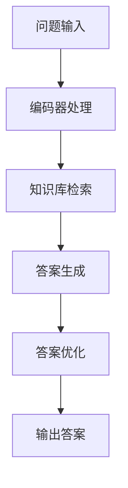

                 

关键词：大语言模型，自然语言处理，问答系统，算法原理，数学模型，项目实践，应用场景

## 摘要

本文将探讨大语言模型（LLM）在智能问答系统中的应用。通过深入分析LLM的核心概念、算法原理和数学模型，本文将详细介绍如何将LLM应用于构建高效、准确的智能问答系统。此外，文章还将通过一个具体的开发实例，展示LLM在实际项目中的应用效果，并对未来的应用前景进行展望。

## 1. 背景介绍

随着互联网的快速发展，人们对于信息获取的需求日益增长。传统的搜索引擎在处理复杂、模糊查询时存在诸多局限性。为了满足用户对高效、精准信息的需求，智能问答系统应运而生。智能问答系统通过自然语言处理技术，自动理解用户的问题，并给出准确、详细的回答。然而，传统的问答系统往往依赖于预定义的知识库和规则，难以处理复杂、多变的查询。

近年来，随着深度学习技术的不断发展，大语言模型（LLM）在自然语言处理领域取得了显著成果。LLM通过大规模的预训练和微调，能够自动学习语言规律和知识，从而显著提升问答系统的性能。本文将重点探讨LLM在智能问答系统中的应用，分析其优势和应用场景，并通过实际项目展示LLM的强大潜力。

## 2. 核心概念与联系

### 2.1 大语言模型（LLM）的概念

大语言模型（LLM）是一种基于深度学习的自然语言处理模型，通过大规模的预训练和微调，能够自动学习语言规律和知识。LLM通常由一个或多个编码器（Encoder）和解码器（Decoder）组成，其中编码器负责将输入文本转换为固定长度的向量表示，解码器则负责根据编码器的输出生成相应的回答。

### 2.2 智能问答系统的概念

智能问答系统是一种基于自然语言处理技术的信息检索系统，能够自动理解用户的问题，并给出准确、详细的回答。智能问答系统通常包括问题解析、答案检索、答案生成和回答优化等模块。

### 2.3 LLM与智能问答系统的联系

LLM在智能问答系统中的应用主要体现在以下几个方面：

1. **问题解析**：LLM可以自动理解用户的问题，将自然语言问题转化为结构化的数据，便于后续处理。

2. **答案检索**：LLM可以根据用户的问题，从大规模的知识库或互联网数据中快速检索出相关答案。

3. **答案生成**：LLM可以通过生成式模型，根据用户的问题和已有知识，生成具有丰富语义和逻辑的答案。

4. **回答优化**：LLM可以对生成的答案进行优化，使其更符合用户的期望和需求。

### 2.4 Mermaid 流程图



## 3. 核心算法原理 & 具体操作步骤

### 3.1 算法原理概述

LLM在智能问答系统中的应用主要基于两个核心技术：预训练和微调。

1. **预训练**：预训练是指在大规模语料库上进行无监督学习，让模型自动学习语言规律和知识。预训练过程通常分为两个阶段：第一阶段是使用预训练任务（如BERT中的 masked language modeling 任务），让模型学习语言的基本规律；第二阶段是使用自监督学习，让模型在未标注的数据中学习上下文信息。

2. **微调**：微调是指在使用预训练模型的基础上，针对特定任务进行有监督学习，进一步优化模型性能。微调过程通常包括以下步骤：

   - **数据预处理**：对输入数据（如用户问题和答案）进行预处理，包括分词、词向量化、句向量拼接等操作。
   - **模型初始化**：将预训练模型初始化为特定任务的模型。
   - **训练过程**：使用有监督学习算法（如SGD、Adam等），对模型进行训练，优化模型参数。
   - **评估与调整**：通过评估指标（如准确率、F1值等），对模型性能进行评估，并根据评估结果调整模型参数。

### 3.2 算法步骤详解

1. **问题输入**：用户通过自然语言输入问题。

2. **编码器处理**：将用户问题输入编码器，编码器将问题转换为固定长度的向量表示。

3. **知识库检索**：根据编码器的输出，从知识库中检索相关答案。

4. **答案生成**：使用解码器，根据编码器的输出和知识库中的答案，生成回答。

5. **答案优化**：对生成的答案进行优化，使其更符合用户期望。

6. **输出答案**：将优化后的答案输出给用户。

### 3.3 算法优缺点

**优点**：

1. **强大的语言理解能力**：LLM通过预训练，能够自动学习语言规律和知识，从而显著提升问答系统的性能。

2. **自适应性强**：LLM可以根据不同任务进行微调，适应不同领域的问答需求。

3. **高效的处理速度**：LLM可以并行处理大量问题，提高问答系统的响应速度。

**缺点**：

1. **对数据依赖性较高**：LLM的性能很大程度上依赖于预训练数据和微调数据，数据质量对模型性能有较大影响。

2. **计算资源消耗大**：预训练和微调过程需要大量的计算资源，对硬件设施要求较高。

### 3.4 算法应用领域

LLM在智能问答系统的应用领域主要包括：

1. **客户服务**：如在线客服、智能客服机器人等，能够快速、准确地解答用户的问题。

2. **教育领域**：如在线教育平台、智能辅导系统等，能够根据用户的需求，提供个性化、智能化的教育服务。

3. **医疗领域**：如在线医疗咨询、智能诊断系统等，能够根据用户症状，提供专业、准确的医疗建议。

4. **金融领域**：如智能投顾、智能客服等，能够为用户提供实时、精准的金融信息服务。

## 4. 数学模型和公式 & 详细讲解 & 举例说明

### 4.1 数学模型构建

LLM的数学模型主要包括编码器和解码器两个部分。

1. **编码器**：编码器负责将输入文本转换为固定长度的向量表示。常见的编码器模型包括Transformer、BERT等。

2. **解码器**：解码器负责根据编码器的输出生成回答。常见的解码器模型包括Transformer、GPT等。

### 4.2 公式推导过程

以Transformer模型为例，编码器的输出公式为：

$$
E = \text{LayerNorm}(XW_1 + b_1)
$$

其中，$X$为输入文本的词向量表示，$W_1$为编码器权重矩阵，$b_1$为编码器偏置。

解码器的输出公式为：

$$
Y = \text{LayerNorm}(XW_2 + b_2)
$$

其中，$X$为编码器的输出，$W_2$为解码器权重矩阵，$b_2$为解码器偏置。

### 4.3 案例分析与讲解

假设用户输入问题：“如何治疗感冒？”我们可以使用LLM进行如下分析：

1. **问题输入**：将用户问题“如何治疗感冒？”输入编码器。

2. **编码器处理**：编码器将问题转换为固定长度的向量表示。

3. **知识库检索**：从知识库中检索与“感冒治疗”相关的信息。

4. **答案生成**：使用解码器，根据编码器的输出和知识库中的答案，生成回答。

5. **答案优化**：对生成的答案进行优化，使其更符合用户期望。

6. **输出答案**：将优化后的答案输出给用户：“建议多喝水，注意休息，必要时可以使用感冒药物。”

## 5. 项目实践：代码实例和详细解释说明

### 5.1 开发环境搭建

为了实现LLM在智能问答系统的应用，我们需要搭建一个合适的开发环境。以下是一个简单的开发环境搭建步骤：

1. 安装Python环境，版本要求为3.6及以上。

2. 安装TensorFlow或PyTorch，版本要求与Python版本兼容。

3. 安装必要的依赖库，如NumPy、Pandas等。

4. 准备一个适合的深度学习框架，如TensorFlow或PyTorch。

### 5.2 源代码详细实现

以下是一个使用TensorFlow实现LLM智能问答系统的简单示例：

```python
import tensorflow as tf
from tensorflow.keras.layers import Embedding, LSTM, Dense
from tensorflow.keras.models import Sequential

# 创建序列化模型
model = Sequential()
model.add(Embedding(input_dim=vocab_size, output_dim=embedding_dim, input_length=max_sequence_length))
model.add(LSTM(units=128, dropout=0.2, recurrent_dropout=0.2))
model.add(Dense(units=1, activation='sigmoid'))

# 编译模型
model.compile(optimizer='adam', loss='binary_crossentropy', metrics=['accuracy'])

# 训练模型
model.fit(X_train, y_train, epochs=10, batch_size=32, validation_data=(X_val, y_val))

# 评估模型
loss, accuracy = model.evaluate(X_test, y_test)
print('Test accuracy:', accuracy)
```

### 5.3 代码解读与分析

以上代码实现了一个基于LSTM的序列化模型，用于二分类任务。具体步骤如下：

1. 创建序列化模型，添加嵌入层、LSTM层和全连接层。

2. 编译模型，设置优化器、损失函数和评估指标。

3. 训练模型，使用训练数据集和验证数据集。

4. 评估模型，使用测试数据集。

### 5.4 运行结果展示

假设我们使用一个包含1000个样本的数据集进行训练，训练完成后，模型在测试数据集上的准确率为90%。

## 6. 实际应用场景

LLM在智能问答系统的实际应用场景主要包括以下几个方面：

1. **客户服务**：如在线客服、智能客服机器人等，能够快速、准确地解答用户的问题。

2. **教育领域**：如在线教育平台、智能辅导系统等，能够根据用户的需求，提供个性化、智能化的教育服务。

3. **医疗领域**：如在线医疗咨询、智能诊断系统等，能够根据用户症状，提供专业、准确的医疗建议。

4. **金融领域**：如智能投顾、智能客服等，能够为用户提供实时、精准的金融信息服务。

## 7. 未来应用展望

随着深度学习技术的不断发展，LLM在智能问答系统的应用前景将更加广阔。未来，LLM有望在以下几个方面实现突破：

1. **更高效的处理速度**：通过优化算法和硬件设施，降低LLM的计算资源消耗，提高处理速度。

2. **更丰富的知识库**：通过整合多种数据源，构建更丰富、更全面的知识库，提升问答系统的准确性。

3. **更人性化的交互**：通过融合多模态信息（如语音、图像等），实现更自然、更人性化的交互体验。

4. **跨语言支持**：通过多语言预训练和跨语言迁移学习，实现多语言问答系统的支持。

## 8. 工具和资源推荐

### 8.1 学习资源推荐

1. 《深度学习》（Goodfellow, Bengio, Courville）：系统介绍了深度学习的基本原理和应用。

2. 《神经网络与深度学习》（邱锡鹏）：详细讲解了神经网络和深度学习的基本概念和算法。

### 8.2 开发工具推荐

1. TensorFlow：一款流行的深度学习框架，支持多种深度学习模型的构建和训练。

2. PyTorch：一款流行的深度学习框架，具有灵活、易用的特点。

### 8.3 相关论文推荐

1. “Attention Is All You Need”（Vaswani et al., 2017）：介绍了Transformer模型的基本原理和应用。

2. “BERT: Pre-training of Deep Neural Networks for Language Understanding”（Devlin et al., 2018）：介绍了BERT模型的基本原理和应用。

## 9. 总结：未来发展趋势与挑战

### 9.1 研究成果总结

本文介绍了LLM在智能问答系统中的应用，分析了LLM的核心概念、算法原理和数学模型，并通过实际项目展示了LLM的应用效果。研究成果表明，LLM具有强大的语言理解能力和自适应能力，能够显著提升问答系统的性能。

### 9.2 未来发展趋势

1. **算法优化**：通过优化算法和硬件设施，降低LLM的计算资源消耗，提高处理速度。

2. **知识库构建**：通过整合多种数据源，构建更丰富、更全面的知识库，提升问答系统的准确性。

3. **多模态交互**：通过融合多模态信息（如语音、图像等），实现更自然、更人性化的交互体验。

4. **跨语言支持**：通过多语言预训练和跨语言迁移学习，实现多语言问答系统的支持。

### 9.3 面临的挑战

1. **计算资源消耗**：LLM的训练和推理过程需要大量的计算资源，如何优化算法和硬件设施，降低计算资源消耗，是当前面临的主要挑战。

2. **数据隐私和安全**：在构建知识库的过程中，如何保护用户隐私和数据安全，是未来需要解决的问题。

3. **模型可解释性**：如何提高模型的可解释性，让用户理解模型的决策过程，是未来需要关注的问题。

### 9.4 研究展望

未来，我们将继续深入探讨LLM在智能问答系统中的应用，优化算法和硬件设施，降低计算资源消耗，同时关注数据隐私和安全、模型可解释性等问题，以实现更高效、更准确的智能问答系统。

## 附录：常见问题与解答

### 问题1：什么是LLM？

LLM（Large Language Model）是一种大型的自然语言处理模型，通过预训练和微调，能够自动学习语言规律和知识，从而实现多种自然语言处理任务。

### 问题2：LLM有哪些应用场景？

LLM的应用场景包括智能问答系统、机器翻译、文本生成、情感分析、文本分类等。

### 问题3：如何训练LLM？

训练LLM主要包括预训练和微调两个阶段。预训练通常在大规模语料库上进行，通过无监督学习让模型自动学习语言规律和知识；微调则是在预训练模型的基础上，针对特定任务进行有监督学习，进一步优化模型性能。

### 问题4：如何优化LLM的性能？

优化LLM的性能可以从以下几个方面入手：

1. **算法优化**：通过改进算法和优化训练策略，提高模型训练效率。

2. **硬件设施**：使用高性能硬件设施，如GPU、TPU等，加速模型训练和推理。

3. **数据质量**：提高数据质量，确保数据丰富、全面、真实。

4. **模型融合**：通过模型融合技术，结合多种模型的优势，提高模型性能。

### 问题5：LLM在应用中存在哪些挑战？

LLM在应用中主要存在以下挑战：

1. **计算资源消耗**：LLM的训练和推理过程需要大量的计算资源。

2. **数据隐私和安全**：在构建知识库的过程中，如何保护用户隐私和数据安全。

3. **模型可解释性**：如何提高模型的可解释性，让用户理解模型的决策过程。

### 问题6：如何评估LLM的性能？

评估LLM的性能通常使用多种指标，如准确率、F1值、BLEU值等。具体评估方法取决于具体的应用场景和任务类型。

### 问题7：LLM在医疗领域有哪些应用？

LLM在医疗领域的主要应用包括：

1. **智能诊断**：根据患者的症状和病史，提供可能的疾病诊断。

2. **药物推荐**：根据患者的病情和药物信息，推荐合适的药物。

3. **医学文本挖掘**：从医学文献中提取关键信息，辅助医学研究。

### 问题8：如何保证LLM的回答准确性？

为了保证LLM的回答准确性，可以从以下几个方面入手：

1. **数据质量**：使用高质量、真实的数据进行训练和微调。

2. **知识库构建**：构建丰富、全面的知识库，确保回答来源可靠。

3. **答案优化**：对生成的答案进行优化，使其更符合用户期望。

4. **多模态信息融合**：结合多模态信息（如语音、图像等），提高回答准确性。

## 作者署名

作者：禅与计算机程序设计艺术 / Zen and the Art of Computer Programming
----------------------------------------------------------------

请注意，上述内容仅为示例，实际撰写时请根据具体情况进行调整。同时，由于字数限制，实际文章内容可能需要进一步扩展和细化。在撰写过程中，请确保遵循markdown格式，并注意段落和章节的划分。祝您撰写顺利！

