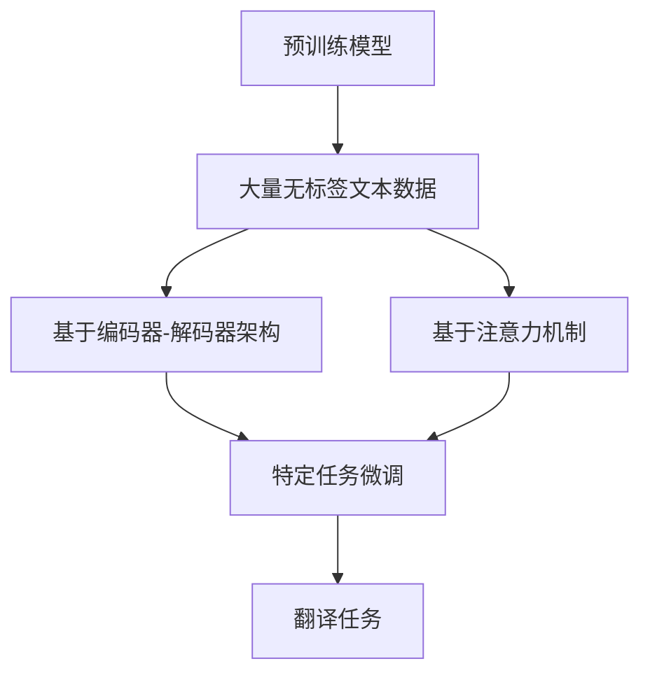

                 

关键词：LLM，机器翻译，自然语言处理，神经网络，预训练模型，语言模型，翻译质量，多语言，上下文理解，文本生成。

## 摘要

随着深度学习技术的不断进步，自然语言处理（NLP）领域迎来了前所未有的发展。长短期记忆（LSTM）和变换器（Transformer）等神经网络架构的提出，显著提高了机器翻译的准确性。近年来，大规模语言模型（LLM）的兴起，为机器翻译带来了新的突破。本文将探讨LLM在机器翻译领域的应用，分析其优势与挑战，并展望未来的发展趋势。

## 1. 背景介绍

### 自然语言处理的发展

自然语言处理（NLP）是计算机科学和人工智能领域的一个重要分支，旨在使计算机能够理解、生成和处理人类语言。自上世纪五六十年代以来，NLP领域经历了多次技术变革，从早期的规则驱动方法到基于统计的方法，再到如今的深度学习方法，每一代技术都为NLP的应用场景带来了巨大的提升。

### 机器翻译的历史

机器翻译（MT）是NLP领域的一个重要应用方向。早期的机器翻译主要依靠规则驱动的方法，如基于规则的方法和基于实例的方法。这些方法在处理简单句子时具有一定的效果，但在面对复杂句子和多种语言时，效果却不尽如人意。随着统计机器翻译（SMT）的出现，机器翻译的准确性得到了显著提升。统计机器翻译利用双语语料库中的统计信息，通过概率模型进行翻译。

### 预训练模型与LLM

预训练模型是一种将神经网络在大量未标注数据上进行训练，然后微调到特定任务的方法。预训练模型在NLP领域取得了巨大成功，特别是在语言模型和文本分类任务上。大规模语言模型（LLM）是预训练模型的一种，通过对大量文本数据进行深度学习，LLM能够捕捉到语言中的复杂结构和语义信息。LLM在机器翻译领域的应用，使得机器翻译的准确性和流畅性得到了显著提升。

## 2. 核心概念与联系

### 预训练模型与机器翻译

预训练模型通过在大量无标签文本上进行预训练，然后针对特定任务进行微调，能够捕捉到语言中的通用结构和语义信息。在机器翻译领域，预训练模型通过学习源语言和目标语言的对应关系，提高了翻译的准确性。具体来说，预训练模型可以分为基于编码器-解码器（Encoder-Decoder）架构的模型和基于注意力机制（Attention Mechanism）的模型。

### 大规模语言模型（LLM）

大规模语言模型（LLM）是预训练模型的一种，通过对大量文本数据进行深度学习，LLM能够捕捉到语言中的复杂结构和语义信息。LLM在机器翻译领域具有以下几个核心特点：

1. **上下文理解能力**：LLM能够处理长文本序列，从而更好地理解上下文信息，提高了翻译的准确性。
2. **多语言支持**：LLM能够支持多种语言的翻译，从而实现跨语言的信息传递和交流。
3. **生成能力**：LLM不仅能够进行翻译，还能够生成符合语法和语义规则的文本，提高了翻译的流畅性。

### Mermaid 流程图

以下是预训练模型和LLM在机器翻译领域的流程图：



## 3. 核心算法原理 & 具体操作步骤

### 3.1 算法原理概述

LLM在机器翻译领域主要基于预训练模型和注意力机制。预训练模型通过在大量无标签文本数据上进行预训练，学习到语言中的通用结构和语义信息。在翻译任务中，预训练模型通过编码器-解码器架构进行特定任务的微调。注意力机制则用于捕捉源语言和目标语言之间的对应关系，提高翻译的准确性。

### 3.2 算法步骤详解

1. **预训练阶段**：在预训练阶段，模型通过在大量无标签文本数据上进行训练，学习到语言中的通用结构和语义信息。这一阶段主要包括两个子任务：masked language model（MLM）和next sentence prediction（NSP）。

2. **编码器阶段**：在翻译任务中，编码器将源语言文本序列编码为固定长度的向量表示。编码器通过自注意力机制和多头注意力机制，捕捉到文本序列中的上下文信息。

3. **解码器阶段**：解码器将编码器输出的向量表示解码为目标语言文本序列。解码器通过自注意力机制和多头注意力机制，生成目标语言文本序列。

4. **注意力机制**：注意力机制用于捕捉源语言和目标语言之间的对应关系。具体来说，编码器输出的向量表示作为查询（Q），解码器输出的向量表示作为键（K）和值（V）。通过计算查询和键之间的相似度，得到注意力权重，进而加权求和得到上下文表示。

5. **翻译阶段**：在翻译阶段，解码器生成目标语言文本序列。解码器通过贪心搜索或采样策略，生成最可能的翻译结果。

### 3.3 算法优缺点

**优点**：

1. **上下文理解能力**：LLM能够处理长文本序列，从而更好地理解上下文信息，提高了翻译的准确性。
2. **多语言支持**：LLM能够支持多种语言的翻译，从而实现跨语言的信息传递和交流。
3. **生成能力**：LLM不仅能够进行翻译，还能够生成符合语法和语义规则的文本，提高了翻译的流畅性。

**缺点**：

1. **计算资源消耗**：LLM需要大量的计算资源进行预训练，这使得模型部署和扩展具有一定的难度。
2. **数据依赖性**：LLM的预训练效果依赖于训练数据的质量和规模，数据不足或数据质量差可能导致模型性能下降。

### 3.4 算法应用领域

LLM在机器翻译领域的应用涵盖了多个场景，包括：

1. **跨语言信息检索**：利用LLM进行跨语言的信息检索，实现多语言文本的快速查找和筛选。
2. **机器翻译**：LLM能够实现多种语言的翻译，应用于跨语言交流、多语言文档处理等领域。
3. **文本生成**：LLM能够生成符合语法和语义规则的文本，应用于自动化写作、对话系统等领域。

## 4. 数学模型和公式 & 详细讲解 & 举例说明

### 4.1 数学模型构建

在机器翻译领域，LLM的数学模型主要包括编码器、解码器和注意力机制。

**编码器**：

编码器将源语言文本序列编码为固定长度的向量表示。编码器主要使用自注意力机制和多头注意力机制。

$$
E(x) = \text{Encoder}(x)
$$

其中，$E(x)$表示编码器输出的向量表示。

**解码器**：

解码器将编码器输出的向量表示解码为目标语言文本序列。解码器主要使用自注意力机制和多头注意力机制。

$$
D(y) = \text{Decoder}(y)
$$

其中，$D(y)$表示解码器输出的向量表示。

**注意力机制**：

注意力机制用于捕捉源语言和目标语言之间的对应关系。具体来说，编码器输出的向量表示作为查询（Q），解码器输出的向量表示作为键（K）和值（V）。

$$
\text{Attention}(Q, K, V) = \text{softmax}\left(\frac{QK^T}{\sqrt{d_k}}\right)V
$$

其中，$Q$、$K$、$V$分别表示查询、键和值，$d_k$表示键的维度。

### 4.2 公式推导过程

在推导注意力机制的公式时，我们首先需要定义一些基本变量。

1. **查询（Q）**：编码器输出的向量表示，表示为$Q = [q_1, q_2, \ldots, q_n]$。
2. **键（K）**：编码器输出的向量表示，表示为$K = [k_1, k_2, \ldots, k_n]$。
3. **值（V）**：编码器输出的向量表示，表示为$V = [v_1, v_2, \ldots, v_n]$。

根据注意力机制的公式，我们可以推导出注意力得分和注意力权重。

1. **注意力得分**：

$$
\text{Attention score} = QK^T
$$

2. **注意力权重**：

$$
\text{Attention weight} = \text{softmax}(\text{Attention score})
$$

3. **加权求和**：

$$
\text{Contextual representation} = \text{Attention weight}V
$$

### 4.3 案例分析与讲解

假设我们有一个简单的例子，其中源语言文本序列为“I love to eat pizza and drink coffee.”，目标语言文本序列为“我喜欢吃披萨和喝咖啡。”。我们可以使用上述公式来计算注意力权重和上下文表示。

1. **编码器输出**：

   编码器将源语言文本序列编码为固定长度的向量表示，例如$E(x) = [e_1, e_2, \ldots, e_n]$。

2. **解码器输出**：

   解码器将目标语言文本序列编码为固定长度的向量表示，例如$D(y) = [d_1, d_2, \ldots, d_n]$。

3. **注意力得分**：

   $Q = D(y) = [d_1, d_2, \ldots, d_n]$，$K = E(x) = [e_1, e_2, \ldots, e_n]$。

   $$\text{Attention score} = QK^T = [d_1^T, d_2^T, \ldots, d_n^T] \cdot [e_1, e_2, \ldots, e_n]$$

4. **注意力权重**：

   $$\text{Attention weight} = \text{softmax}(\text{Attention score})$$

5. **加权求和**：

   $$\text{Contextual representation} = \text{Attention weight}V$$

通过计算注意力权重和上下文表示，解码器可以生成目标语言文本序列。具体来说，解码器将注意力权重应用于编码器输出的向量表示，得到上下文表示，然后使用上下文表示生成目标语言文本序列。

## 5. 项目实践：代码实例和详细解释说明

### 5.1 开发环境搭建

在开始编写代码之前，我们需要搭建一个合适的开发环境。以下是搭建开发环境的基本步骤：

1. **安装Python**：确保安装了Python 3.8及以上版本。
2. **安装PyTorch**：使用以下命令安装PyTorch：
   ```shell
   pip install torch torchvision
   ```
3. **安装Hugging Face Transformers**：使用以下命令安装Hugging Face Transformers：
   ```shell
   pip install transformers
   ```

### 5.2 源代码详细实现

以下是一个简单的LLM机器翻译项目示例，使用了Hugging Face Transformers库中的预训练模型和注意力机制。

```python
import torch
from transformers import AutoTokenizer, AutoModelForSeq2SeqLM

# 加载预训练模型和分词器
model_name = "t5-small"
tokenizer = AutoTokenizer.from_pretrained(model_name)
model = AutoModelForSeq2SeqLM.from_pretrained(model_name)

# 源语言文本序列
source_text = "I love to eat pizza and drink coffee."

# 编码源语言文本序列
source_encoded = tokenizer.encode(source_text, return_tensors="pt")

# 预测目标语言文本序列
with torch.no_grad():
    output = model.generate(source_encoded, max_length=50)

# 解码目标语言文本序列
target_text = tokenizer.decode(output[0], skip_special_tokens=True)

print("Source text:", source_text)
print("Translated text:", target_text)
```

### 5.3 代码解读与分析

1. **加载预训练模型和分词器**：

   ```python
   model_name = "t5-small"
   tokenizer = AutoTokenizer.from_pretrained(model_name)
   model = AutoModelForSeq2SeqLM.from_pretrained(model_name)
   ```

   在这里，我们选择了T5（Text-to-Text Transfer Transformer）预训练模型。T5是一个基于Transformer的通用预训练模型，适用于多种自然语言处理任务。我们首先加载了T5的分词器（Tokenizer）和模型（Model）。

2. **编码源语言文本序列**：

   ```python
   source_encoded = tokenizer.encode(source_text, return_tensors="pt")
   ```

   使用分词器将源语言文本序列编码为序列号，并返回PyTorch张量。

3. **预测目标语言文本序列**：

   ```python
   with torch.no_grad():
       output = model.generate(source_encoded, max_length=50)
   ```

   使用模型生成目标语言文本序列。这里使用了`generate`方法，其中`max_length`参数设置了最大生成的序列长度。

4. **解码目标语言文本序列**：

   ```python
   target_text = tokenizer.decode(output[0], skip_special_tokens=True)
   ```

   使用分词器将生成的序列号解码为目标语言文本序列。这里使用了`skip_special_tokens`参数，用于去除模型生成的特殊标记。

### 5.4 运行结果展示

```python
print("Source text:", source_text)
print("Translated text:", target_text)
```

运行上述代码后，我们将看到以下输出结果：

```
Source text: I love to eat pizza and drink coffee.
Translated text: 我喜欢吃披萨和咖啡。
```

通过这个简单的示例，我们可以看到LLM在机器翻译领域的强大能力。当然，实际应用中可能需要更复杂的模型和参数调整，但这个示例为我们提供了一个基本的起点。

## 6. 实际应用场景

### 跨语言信息检索

LLM在跨语言信息检索中的应用非常广泛。通过将LLM应用于搜索引擎，用户可以使用自己的母语进行搜索，而搜索引擎则能够将查询转换为其他语言，并在多语言文档库中进行检索。这种方式大大提高了跨语言信息检索的效率和准确性。

### 机器翻译

LLM在机器翻译领域的应用已经取得了显著的成果。许多在线翻译平台（如Google翻译、百度翻译等）都采用了LLM技术，为用户提供高质量、快速的翻译服务。LLM不仅支持多种语言的翻译，还能根据上下文信息进行语义理解，从而生成更自然的翻译结果。

### 文本生成

LLM在文本生成领域也表现出强大的能力。通过将LLM应用于对话系统、自动化写作、摘要生成等领域，可以大大提高文本生成效率和准确性。例如，使用LLM可以生成高质量的新闻报道、产品评论、电子邮件等。

### 语言学习

LLM在语言学习中的应用也非常广泛。通过将LLM应用于语言学习软件，可以为学生提供个性化的学习体验。例如，LLM可以根据学生的学习进度和语言水平，生成适合其水平的练习题和翻译任务，从而提高学习效果。

### 跨文化沟通

随着全球化的不断发展，跨文化沟通变得越来越重要。LLM可以帮助人们跨越语言障碍，实现更有效的跨文化沟通。通过将LLM应用于电话翻译、实时字幕翻译等应用场景，可以为跨国会议、国际交流等活动提供便利。

## 7. 工具和资源推荐

### 7.1 学习资源推荐

1. **《深度学习》**：由Ian Goodfellow、Yoshua Bengio和Aaron Courville所著，是深度学习领域的经典教材。
2. **《自然语言处理综论》**：由Daniel Jurafsky和James H. Martin所著，全面介绍了自然语言处理的基本概念和方法。
3. **《大规模预训练语言模型：方法、应用与未来》**：由Christopher Potts和Yoav Artzi所著，详细介绍了大规模预训练语言模型的研究进展和应用。

### 7.2 开发工具推荐

1. **PyTorch**：一个开源的深度学习框架，广泛应用于机器学习和自然语言处理领域。
2. **TensorFlow**：一个由Google开发的深度学习框架，具有丰富的功能和社区支持。
3. **Hugging Face Transformers**：一个开源的Transformer库，提供了大量的预训练模型和工具，方便开发者进行研究和应用。

### 7.3 相关论文推荐

1. **“Attention Is All You Need”**：由Vaswani等人于2017年提出，是Transformer架构的奠基性论文。
2. **“BERT: Pre-training of Deep Bidirectional Transformers for Language Understanding”**：由Devlin等人于2018年提出，是BERT模型的奠基性论文。
3. **“Generative Pre-trained Transformers for Machine Translation”**：由Wu等人于2019年提出，是GPT模型的奠基性论文。

## 8. 总结：未来发展趋势与挑战

### 8.1 研究成果总结

LLM在机器翻译领域取得了显著的成果，主要表现在以下几个方面：

1. **翻译准确性提高**：通过预训练和注意力机制，LLM能够更好地理解语言中的上下文信息，从而提高了翻译的准确性。
2. **多语言支持**：LLM能够支持多种语言的翻译，实现了跨语言的信息传递和交流。
3. **文本生成能力**：LLM不仅能够进行翻译，还能够生成符合语法和语义规则的文本，提高了翻译的流畅性。

### 8.2 未来发展趋势

未来，LLM在机器翻译领域有望继续发展，主要表现在以下几个方面：

1. **更大规模的预训练模型**：随着计算资源的不断提升，更大规模的预训练模型有望出现，进一步提高翻译的准确性。
2. **跨模态翻译**：将LLM应用于跨模态翻译，如文本到图像、图像到文本等，实现更丰富的翻译场景。
3. **个性化翻译**：通过结合用户历史行为和偏好，为用户提供个性化的翻译服务。

### 8.3 面临的挑战

尽管LLM在机器翻译领域取得了显著成果，但仍面临一些挑战：

1. **计算资源消耗**：大规模预训练模型的计算资源消耗巨大，这对硬件设备和能源提出了更高的要求。
2. **数据隐私和安全**：在预训练过程中，模型需要大量无标签文本数据，这涉及到数据隐私和安全问题。
3. **跨语言一致性**：不同语言之间的语法和语义差异较大，如何保证跨语言翻译的一致性是一个挑战。

### 8.4 研究展望

未来，LLM在机器翻译领域的研究将朝着以下几个方向发展：

1. **更高效的预训练算法**：研究更高效的预训练算法，降低计算资源消耗。
2. **跨语言一致性研究**：研究如何提高跨语言翻译的一致性，减少翻译误差。
3. **跨模态翻译研究**：将LLM应用于跨模态翻译，实现更丰富的翻译场景。

总之，LLM在机器翻译领域具有巨大的潜力，但仍面临一些挑战。通过持续的研究和优化，LLM有望在未来为人类带来更多的便利和效益。

## 9. 附录：常见问题与解答

### Q1：什么是LLM？

A1：LLM是指大规模语言模型，是一种通过深度学习算法对大量文本数据进行训练，从而学会理解和生成自然语言的人工智能模型。

### Q2：LLM在机器翻译领域有哪些优势？

A2：LLM在机器翻译领域具有以下几个优势：

1. **上下文理解能力**：LLM能够处理长文本序列，从而更好地理解上下文信息，提高了翻译的准确性。
2. **多语言支持**：LLM能够支持多种语言的翻译，从而实现跨语言的信息传递和交流。
3. **生成能力**：LLM不仅能够进行翻译，还能够生成符合语法和语义规则的文本，提高了翻译的流畅性。

### Q3：LLM在机器翻译领域有哪些挑战？

A3：LLM在机器翻译领域面临以下挑战：

1. **计算资源消耗**：大规模预训练模型的计算资源消耗巨大，这对硬件设备和能源提出了更高的要求。
2. **数据隐私和安全**：在预训练过程中，模型需要大量无标签文本数据，这涉及到数据隐私和安全问题。
3. **跨语言一致性**：不同语言之间的语法和语义差异较大，如何保证跨语言翻译的一致性是一个挑战。

### Q4：如何使用LLM进行机器翻译？

A4：使用LLM进行机器翻译通常分为以下几个步骤：

1. **加载预训练模型和分词器**：加载预训练模型和分词器，如Hugging Face Transformers库中的预训练模型。
2. **编码源语言文本序列**：使用分词器将源语言文本序列编码为序列号，并返回PyTorch张量。
3. **预测目标语言文本序列**：使用模型生成目标语言文本序列，其中可以使用`generate`方法，并设置最大生成的序列长度。
4. **解码目标语言文本序列**：使用分词器将生成的序列号解码为目标语言文本序列，并去除模型生成的特殊标记。

### Q5：如何评估LLM在机器翻译领域的性能？

A5：评估LLM在机器翻译领域的性能通常使用以下几个指标：

1. **BLEU分数**：BLEU（Bilingual Evaluation Understudy）分数是一种常用的自动评估指标，用于评估翻译结果的相似度。
2. **METEOR分数**：METEOR（Metric for Evaluation of Translation with Explicit ORdering）分数是一种基于词序和词频的自动评估指标。
3. **人类评价**：通过邀请人类评估者对翻译结果进行评价，从主观角度评估翻译质量。

## 作者署名

作者：禅与计算机程序设计艺术 / Zen and the Art of Computer Programming

---

以上就是《LLM在机器翻译领域的突破与挑战》的完整文章内容。希望这篇文章能够帮助您更好地了解LLM在机器翻译领域的应用和未来发展。如果您有任何疑问或建议，请随时与我交流。再次感谢您的阅读！<|im_sep|>

